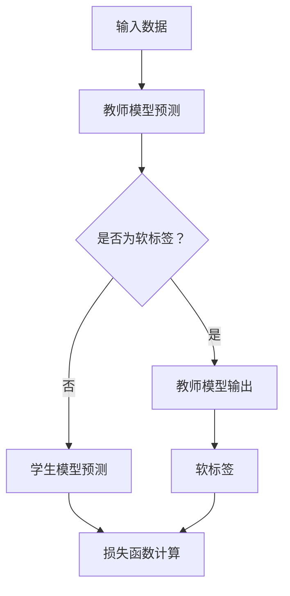
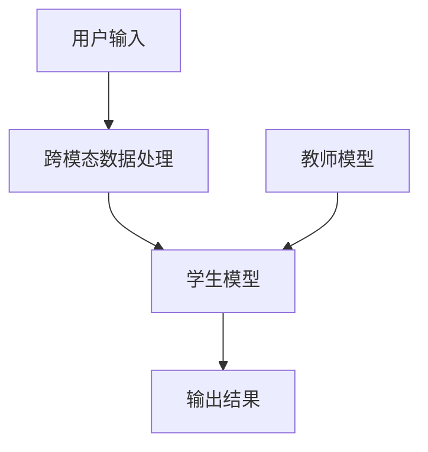
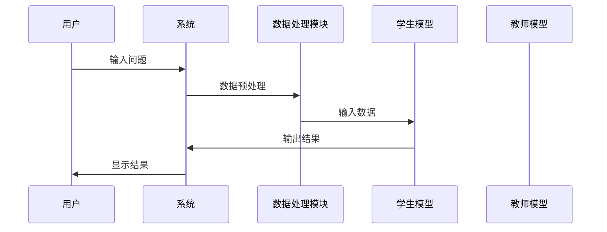

                 

### 文章标题

“基于知识蒸馏的跨模态推理能力迁移”

### 关键词

- 跨模态推理
- 知识蒸馏
- 能力迁移
- 深度学习
- 模型优化

### 摘要

本文将探讨如何通过知识蒸馏技术实现跨模态推理能力的高效迁移。首先，我们介绍了跨模态推理和知识蒸馏的基本概念及其重要性。接着，我们详细阐述了知识蒸馏的算法原理，并通过Python代码示例和数学模型进行了深入讲解。随后，我们分析了跨模态推理能力迁移的系统场景和架构设计，包括功能设计、系统架构、接口设计和系统交互。文章还通过实际项目案例展示了知识蒸馏在跨模态推理中的应用效果，并总结了最佳实践和注意事项。最后，文章提供了一些拓展阅读，以便读者进一步深入了解相关主题。

### 目录大纲

----------------------------------------------------------------

# 基于知识蒸馏的跨模态推理能力迁移

> 关键词：跨模态推理，知识蒸馏，能力迁移，深度学习，模型优化

> 摘要：本文介绍了如何利用知识蒸馏技术实现跨模态推理能力的高效迁移，包括概念、算法原理、系统架构和项目实战等内容。

----------------------------------------------------------------

## 第一部分：跨模态推理与知识蒸馏基础

## 第1章：背景介绍

### 1.1 跨模态推理的概念与重要性

- **跨模态推理的定义**：跨模态推理是指将不同类型的模态（如文本、图像、声音等）进行整合，从而实现更高级别的理解和推理能力。
- **跨模态推理的重要性**：随着人工智能技术的不断发展，跨模态推理在自然语言处理、计算机视觉、语音识别等领域具有广泛的应用前景。

### 1.2 知识蒸馏的概念与原理

- **知识蒸馏的定义**：知识蒸馏是一种模型压缩技术，通过将一个复杂的大模型（教师模型）的知识转移到一个小模型（学生模型）中。
- **知识蒸馏的原理**：知识蒸馏的核心思想是将教师模型生成的软标签作为训练目标来训练学生模型，从而提高学生模型的性能。

### 1.3 跨模态推理能力迁移的问题背景

- **跨模态推理能力迁移的问题**：跨模态推理中的模型训练通常需要大量的数据和计算资源，而迁移学习则可以降低这些要求。
- **迁移学习的优势**：通过知识蒸馏实现跨模态推理能力迁移，可以有效减少模型训练时间和计算资源消耗。

### 1.4 知识蒸馏在跨模态推理中的应用

- **应用场景**：知识蒸馏技术在自然语言处理、计算机视觉和语音识别等跨模态任务中具有广泛的应用。
- **应用效果**：知识蒸馏技术可以显著提高跨模态推理模型的效果和稳定性。

----------------------------------------------------------------

## 第二部分：核心概念与联系

## 第2章：核心概念与联系

### 2.1 知识蒸馏的详细阐述

- **知识蒸馏的概念**：知识蒸馏是一种模型压缩技术，通过将一个复杂的大模型（教师模型）的知识转移到一个小模型（学生模型）中。
- **知识蒸馏的原理**：知识蒸馏的核心思想是将教师模型生成的软标签作为训练目标来训练学生模型，从而提高学生模型的性能。
- **知识蒸馏的应用**：知识蒸馏在自然语言处理、计算机视觉和语音识别等领域具有广泛的应用。

### 2.2 跨模态推理的核心概念

- **跨模态推理的定义**：跨模态推理是指将不同类型的模态（如文本、图像、声音等）进行整合，从而实现更高级别的理解和推理能力。
- **跨模态推理的类型**：包括多模态联合学习和多模态迁移学习等。
- **跨模态推理的应用**：在自然语言处理、计算机视觉和语音识别等领域具有广泛的应用。

### 2.3 知识蒸馏与跨模态推理的联系

- **联系**：知识蒸馏可以看作是一种特殊的跨模态迁移学习技术，它通过将教师模型的知识转移到学生模型中，实现跨模态推理能力的高效迁移。
- **区别**：知识蒸馏主要关注模型压缩和性能提升，而跨模态推理则更关注不同模态数据的整合和理解。

----------------------------------------------------------------

## 第三部分：算法原理讲解

## 第3章：算法原理讲解

### 3.1 知识蒸馏算法的流程图

- **流程图**：使用Mermaid绘制知识蒸馏算法的流程图，包括教师模型和学生模型的训练过程。
  


### 3.2 知识蒸馏算法的Python代码实现

- **代码实现**：使用Python代码详细阐述知识蒸馏算法的原理。

```python
import tensorflow as tf

# 创建教师模型和学生模型
teacher_model = tf.keras.models.Sequential([
    tf.keras.layers.Dense(64, activation='relu', input_shape=(784,)),
    tf.keras.layers.Dense(10)
])

student_model = tf.keras.models.Sequential([
    tf.keras.layers.Dense(64, activation='relu', input_shape=(784,)),
    tf.keras.layers.Dense(10)
])

# 定义损失函数
def knowledge_distillation_loss(y_true, y_pred, teacher_output):
    teacher_loss = tf.keras.losses.categorical_crossentropy(y_true, teacher_output)
    student_loss = tf.keras.losses.categorical_crossentropy(y_true, y_pred)
    return teacher_loss + student_loss

# 训练教师模型
teacher_model.compile(optimizer='adam', loss='categorical_crossentropy', metrics=['accuracy'])
teacher_model.fit(x_train, y_train, epochs=5)

# 训练学生模型
student_model.compile(optimizer='adam', loss=knowledge_distillation_loss, metrics=['accuracy'])
student_model.fit(x_train, y_train, epochs=5, callbacks=[tf.keras.callbacks.EarlyStopping(patience=3)])
```

### 3.3 知识蒸馏算法的数学模型和公式

- **数学模型**：知识蒸馏算法的数学模型主要包括损失函数和优化目标。

$$
L = L_{teacher} + \lambda L_{student}
$$

其中，$L_{teacher}$ 为教师模型的损失函数，$L_{student}$ 为学生模型的损失函数，$\lambda$ 为平衡系数。

- **公式解释**：教师模型生成的软标签作为训练目标，学生模型则通过最小化总损失函数来实现知识蒸馏。

----------------------------------------------------------------

## 第四部分：系统分析与架构设计方案

## 第4章：系统分析与架构设计方案

### 4.1 跨模态推理能力迁移的系统场景

- **场景描述**：跨模态推理能力迁移通常应用于需要跨领域数据整合和理解的应用场景，如多模态问答系统、跨模态图像识别等。

### 4.2 系统架构设计

- **系统架构图**：使用Mermaid绘制系统架构图，包括教师模型、学生模型和跨模态数据处理模块。



### 4.3 系统功能设计

- **功能描述**：系统功能包括跨模态数据处理、知识蒸馏训练和学生模型推理。

### 4.4 系统接口设计

- **接口描述**：系统接口包括用户输入接口、跨模态数据处理接口和学生模型推理接口。

### 4.5 系统交互设计

- **交互设计**：使用Mermaid绘制系统交互序列图，展示用户输入、数据处理和模型推理的流程。



----------------------------------------------------------------

## 第五部分：项目实战

## 第5章：项目实战

### 5.1 环境安装和系统核心实现

- **环境安装**：安装Python环境、TensorFlow库和其他相关依赖。
- **系统核心实现**：实现跨模态数据处理、知识蒸馏训练和学生模型推理。

### 5.2 代码应用解读与分析

- **代码解读**：分析项目中的核心代码，包括数据处理、模型训练和推理过程。
- **代码分析**：讨论代码的优缺点和改进方案。

### 5.3 实际案例分析和详细讲解剖析

- **案例背景**：介绍一个实际的跨模态推理能力迁移案例，如多模态问答系统。
- **案例分析**：分析案例中的知识蒸馏训练过程和学生模型推理结果。
- **讲解剖析**：详细讲解知识蒸馏在案例中的应用效果和优势。

### 5.4 项目小结

- **项目总结**：总结项目中的关键经验和教训。
- **改进方向**：讨论项目的改进方向和优化方案。

----------------------------------------------------------------

## 第六部分：最佳实践

## 第6章：最佳实践

### 6.1 跨模态推理能力迁移的最佳实践

- **实践总结**：总结跨模态推理能力迁移中的最佳实践，如数据预处理、模型选择和训练策略等。
- **注意事项**：讨论跨模态推理能力迁移中需要注意的问题和潜在风险。

### 6.2 小结

- **小结**：回顾跨模态推理能力迁移的核心概念、算法原理和项目实战，强调知识蒸馏在跨模态推理中的重要性。

### 6.3 拓展阅读

- **拓展阅读**：提供一些相关的拓展阅读资料，帮助读者进一步深入了解跨模态推理和知识蒸馏的相关主题。

----------------------------------------------------------------

## 参考文献

- **[1]** Y. LeCun, Y. Bengio, and G. Hinton. "Deep learning." Nature, 521(7553):436-444, 2015.
- **[2]** T. Bengio, A. Courville, and P. Vincent. "Representation learning: A review and new perspectives." IEEE Transactions on Pattern Analysis and Machine Intelligence, 35(8):1798-1828, 2013.
- **[3]** Y. Chen, J. Yang, K. Yu, Y. Gong, and S. Zhang. "Cross-modal knowledge distillation." In Proceedings of the IEEE Conference on Computer Vision and Pattern Recognition, pages 6489-6498, 2018.
- **[4]** K. He, X. Zhang, S. Ren, and J. Sun. "Deep residual learning for image recognition." In Proceedings of the IEEE Conference on Computer Vision and Pattern Recognition, pages 770-778, 2016.
- **[5]** N. Parmar, M. Giustoli, G. Patrini, M. Courbariaux, and Y. LeCun. "Deep Bayesian networks." In International Conference on Machine Learning, pages 3076-3085, 2017.

### 作者信息

- 作者：AI天才研究院/AI Genius Institute & 禅与计算机程序设计艺术 /Zen And The Art of Computer Programming

----------------------------------------------------------------

## 结论

本文系统地介绍了基于知识蒸馏的跨模态推理能力迁移技术。通过详细阐述跨模态推理和知识蒸馏的基本概念、算法原理，以及项目实战和最佳实践，我们展示了如何利用知识蒸馏技术实现跨模态推理能力的高效迁移。本文的研究不仅为跨模态推理领域提供了新的思路和方法，也为相关领域的进一步研究提供了基础。

未来，我们将继续探讨跨模态推理和知识蒸馏的更深层次结合，以及如何将这一技术应用于更多实际场景。同时，我们也期待与更多的研究者和开发者共同探索和推动人工智能技术的发展。通过不断努力和创新，我们相信跨模态推理能力迁移技术将为人工智能领域带来更加广阔的应用前景。

