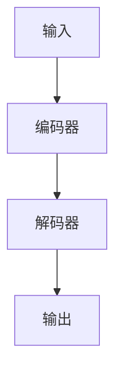
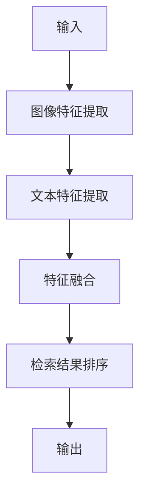

                 

# 基于知识蒸馏的跨模态推理能力迁移与增强技术研究

## 关键词

知识蒸馏，跨模态推理，能力迁移，增强技术，模型压缩，模型融合，注意力机制。

## 摘要

随着人工智能技术的快速发展，跨模态推理在多个领域中展现了其巨大的应用潜力。知识蒸馏作为一种有效的模型压缩和知识转移方法，能够将大型模型的丰富知识迁移到小型模型中，从而提升跨模态推理的能力。本文旨在探讨基于知识蒸馏的跨模态推理能力迁移与增强技术。首先，我们介绍了知识蒸馏、跨模态推理能力迁移和增强技术的基本概念，并分析了它们之间的联系。接着，本文详细讲解了知识蒸馏的原理和应用，以及在跨模态推理中的应用。然后，本文讨论了如何设计合适的模型结构来增强跨模态推理能力，并介绍了跨模态推理在多场景应用中的价值。最后，本文提出了评估和优化跨模态推理模型性能的方法，并进行了实际案例的分析和讲解。

## Step 1: 引言背景介绍

随着人工智能技术的飞速发展，深度学习技术在各个领域得到了广泛应用。特别是近年来，跨模态推理技术引起了广泛关注。跨模态推理是指将不同模态的数据（如文本、图像、语音等）进行融合，以实现更高级别的任务处理，如图像文本检索、语音识别和文本生成等。这种技术不仅在理论研究上具有重要意义，还在实际应用中展现出广阔的前景，如智能助理、内容推荐和自动驾驶等领域。

### 背景介绍

跨模态推理技术的发展得益于深度学习技术的进步。深度学习模型，尤其是卷积神经网络（CNN）和循环神经网络（RNN），在处理单模态数据方面取得了显著的成果。然而，如何将这些单模态模型扩展到跨模态任务，实现不同模态之间的有效融合，成为一个具有挑战性的问题。知识蒸馏技术作为一种有效的模型压缩和知识转移方法，为解决这一问题提供了新的思路。

知识蒸馏的基本思想是将一个复杂的教师模型的知识转移到一个小型的学生模型中。教师模型通常是一个大规模的预训练模型，具有丰富的知识储备和强大的表达能力。学生模型则是一个较小的模型，用于在实际应用中快速推理和决策。通过知识蒸馏，学生模型可以学习到教师模型的内在知识，从而提高其性能和适应性。

### 问题描述

在跨模态推理中，如何利用知识蒸馏技术实现跨模态推理能力的高效迁移，是一个关键问题。具体来说，我们需要解决以下几个问题：

1. **跨模态特征融合**：如何将不同模态的数据特征进行有效融合，以形成对任务有帮助的统一特征表示。
2. **模型结构设计**：如何设计合适的模型结构，以增强跨模态推理的能力。
3. **应用场景挖掘**：跨模态推理在哪些应用场景中具有实际价值，如何针对这些场景设计相应的解决方案。
4. **性能评估与优化**：如何评估和优化跨模态推理模型的性能，使其在实际应用中达到最佳效果。

### 问题解决

为了解决上述问题，本文将从以下几个方面展开研究：

1. **知识蒸馏技术综述**：详细介绍知识蒸馏技术的原理和方法，探讨其在跨模态推理中的应用。
2. **模型结构设计**：分析不同类型的跨模态任务，设计适合的模型结构，并探讨如何通过模型融合和注意力机制等手段增强跨模态推理能力。
3. **应用场景探索**：研究跨模态推理在不同场景中的应用，提出相应的解决方案。
4. **性能评估与优化**：设计评估指标，对跨模态推理模型进行性能评估和优化。

### 边界与外延

本文的研究边界主要涉及以下几个方面：

1. **知识蒸馏技术在跨模态推理中的应用**：重点讨论知识蒸馏技术在跨模态特征融合和模型结构设计中的应用。
2. **跨模态推理模型的设计与优化**：分析不同类型的跨模态任务，设计适合的模型结构，并探讨如何通过模型融合和注意力机制等手段增强跨模态推理能力。
3. **跨模态推理在具体应用场景中的实践**：研究跨模态推理在不同应用场景中的价值，提出相应的解决方案。

### 概念结构与核心要素组成

本文的核心概念包括：

1. **知识蒸馏**：介绍知识蒸馏的基本原理和应用。
2. **跨模态推理**：分析跨模态推理的基本概念和类型。
3. **模型结构设计**：讨论如何设计适合的模型结构来增强跨模态推理能力。
4. **应用场景**：研究跨模态推理在不同应用场景中的价值。
5. **评估指标**：设计评估指标，对跨模态推理模型进行性能评估。

本文旨在为从事跨模态推理研究的研究人员和工程师提供一个全面的参考资料，帮助他们深入了解相关知识，掌握相关技能，为实际应用提供指导。

## 第2章 核心概念与联系

### 2.1 知识蒸馏

#### 2.1.1 知识蒸馏的定义

知识蒸馏（Knowledge Distillation）是一种将大模型（通常称为教师模型）的知识迁移到小模型（学生模型）的技术。这一过程通常涉及教师模型对数据集的多次训练，每次训练都会产生一组标注信息。学生模型则通过学习这些标注信息来获取教师模型的内部知识。知识蒸馏的目的是在保留教师模型性能的前提下，减小模型的大小和计算成本。

#### 2.1.2 知识蒸馏的特点

- **压缩模型尺寸**：通过知识蒸馏，可以将复杂的教师模型简化为较小的学生模型，从而降低计算资源和存储成本。
- **提高模型性能**：学生模型通过学习教师模型的输出，可以获取更丰富的特征信息，从而提高其性能。
- **增强模型泛化能力**：知识蒸馏可以帮助学生模型学习到教师模型的泛化能力，从而在面对新数据时表现更佳。

#### 2.1.3 知识蒸馏与模型压缩的关系

知识蒸馏是模型压缩的一种有效方法。传统的模型压缩方法，如剪枝（Pruning）和量化（Quantization），通常会导致模型性能的下降。而知识蒸馏则通过将教师模型的知识转移到学生模型中，可以在保持较高性能的同时实现模型的压缩。

### 2.2 跨模态推理能力迁移

#### 2.2.1 跨模态推理能力迁移的定义

跨模态推理能力迁移是指将一种模态的数据特征迁移到另一种模态，以实现跨模态任务的高效处理。这种迁移能力可以帮助模型在不同模态之间进行知识共享，从而提高跨模态任务的性能。

#### 2.2.2 跨模态推理能力迁移的类型

- **单向迁移**：将一种模态的特征迁移到另一种模态。例如，将图像特征迁移到文本特征。
- **双向迁移**：将两种模态的特征相互迁移。例如，将图像特征和文本特征相互迁移。

#### 2.2.3 跨模态推理能力迁移的优势

- **提高模型适应性**：跨模态推理能力迁移使模型能够适应多种数据类型，提高模型的泛化能力。
- **降低数据依赖**：通过跨模态推理能力迁移，可以减少对特定模态数据的依赖，提高数据利用效率。

### 2.3 跨模态推理能力增强

#### 2.3.1 跨模态推理能力增强的定义

跨模态推理能力增强是指通过改进模型结构或算法，提高跨模态推理任务的性能。这通常涉及到模型融合、注意力机制等先进技术的应用。

#### 2.3.2 跨模态推理能力增强的方法

- **模型融合**：将多种模态的数据特征进行融合，以提高模型的推理能力。例如，将图像特征和文本特征进行融合。
- **注意力机制**：通过引入注意力机制，使模型能够更好地关注重要特征，提高推理性能。

#### 2.3.3 跨模态推理能力增强的应用场景

- **多媒体内容理解**：如图像文本检索、视频内容理解等。
- **语音识别与合成**：如语音到文本转换、文本到语音转换等。

### 2.4 各核心概念之间的联系

知识蒸馏、跨模态推理能力迁移和增强技术相互关联，共同推动跨模态推理技术的发展。

- **知识蒸馏**：为跨模态推理能力迁移和增强提供了有效的模型压缩和知识转移方法。
- **跨模态推理能力迁移**：通过将一种模态的特征迁移到另一种模态，实现跨模态任务的高效处理。
- **跨模态推理能力增强**：通过改进模型结构或算法，提高跨模态推理任务的性能。

下面是知识蒸馏、跨模态推理能力迁移和增强技术之间的Mermaid ER实体关系图：

```mermaid
erDiagram
  TeacherModel ||--|{ StudentModel } : 知识转移
  TeacherModel ||--|{ CrossModalModel } : 跨模态推理能力迁移
  StudentModel ||--|{ EnhancedModel } : 跨模态推理能力增强
```

## 第3章 知识蒸馏的原理和应用

### 3.1 知识蒸馏的基本原理

知识蒸馏是一种通过将教师模型的输出作为学生模型的软标签，使学生在学习过程中不断调整自己的预测以更接近教师模型的方法。这个过程可以看作是学生模型通过学习教师模型的软标签来复制教师模型的知识。

#### 3.1.1 教师模型和学生模型

在知识蒸馏中，教师模型（Teacher Model）通常是已经经过大量数据训练并取得良好效果的复杂模型。学生模型（Student Model）则是经过压缩的、较小的模型，其目标是学习到教师模型的知识，以在有限的计算资源下实现高性能的推理。

#### 3.1.2 软标签和硬标签

在知识蒸馏中，教师模型给出的输出通常被称为软标签（Soft Labels），这是因为输出通常是一个概率分布而不是一个明确的类别标签。相比之下，硬标签（Hard Labels）是一个明确的类别标签。软标签能够提供更多的信息，使学生模型能够学习到教师模型的内部知识。

### 3.2 知识蒸馏的过程

知识蒸馏的过程可以分为以下几步：

1. **教师模型的训练**：首先，使用大量的数据进行教师模型的训练，以获得良好的性能。
2. **生成软标签**：在教师模型训练的过程中，记录其输出的概率分布，这些概率分布即为软标签。
3. **学生模型的训练**：学生模型在训练过程中，不仅需要根据输入数据生成输出，还需要根据教师模型的软标签来调整自己的预测，以使输出尽可能接近软标签。
4. **教师模型的优化**：在学生模型训练的过程中，教师模型也可以进行微调，以进一步提高软标签的质量。

### 3.3 知识蒸馏的优势

知识蒸馏具有以下几个显著的优势：

1. **模型压缩**：通过知识蒸馏，可以将复杂的教师模型压缩为较小的学生模型，从而降低计算资源和存储成本。
2. **性能提升**：学生模型通过学习教师模型的知识，可以显著提高其性能。
3. **泛化能力**：知识蒸馏可以帮助学生模型学习到教师模型的泛化能力，从而在面对新数据时表现更佳。

### 3.4 知识蒸馏的应用场景

知识蒸馏在多个领域和任务中得到了广泛应用，以下是一些典型的应用场景：

1. **计算机视觉**：在计算机视觉任务中，知识蒸馏可以用于图像分类、目标检测和图像分割等。例如，可以使用预训练的大型卷积神经网络（如ResNet）作为教师模型，将其知识迁移到较小的模型中，以提高图像分类的性能。
2. **自然语言处理**：在自然语言处理任务中，知识蒸馏可以用于文本分类、情感分析、机器翻译等。例如，可以使用预训练的大型语言模型（如BERT）作为教师模型，将其知识迁移到较小的模型中，以提高文本分类的准确率。
3. **语音识别**：在语音识别任务中，知识蒸馏可以用于将大型语音识别模型的知识迁移到较小的模型中，以提高识别的准确性。
4. **多模态学习**：在多模态学习任务中，知识蒸馏可以用于将不同模态的数据特征进行融合，从而提高跨模态任务的性能。

### 3.5 知识蒸馏的挑战

虽然知识蒸馏具有很多优势，但在实际应用中也面临着一些挑战：

1. **软标签的质量**：软标签的质量直接影响学生模型的学习效果。如果软标签质量较差，可能会导致学生模型学习到错误的知识。
2. **模型性能的平衡**：在知识蒸馏过程中，需要平衡教师模型和学生模型的性能，以确保学生模型既能学到教师模型的知识，又不会过度依赖教师模型的软标签。
3. **计算资源的消耗**：知识蒸馏过程通常需要大量的计算资源，特别是在处理大型教师模型和大规模数据集时。

## 第4章 跨模态推理能力迁移与增强技术

### 4.1 跨模态推理的基本概念

跨模态推理（Cross-Modal Reasoning）是指在不同模态的数据之间进行推理和知识转移的过程。在跨模态推理中，模型需要能够理解不同模态数据之间的关联，并利用这些关联进行任务处理。

#### 4.1.1 模态的定义

模态（Modal）是指数据的表示形式。常见的模态包括文本、图像、语音、视频等。每种模态都有其独特的特性和表达方式。

#### 4.1.2 跨模态推理的目标

跨模态推理的目标是利用不同模态的数据，提高模型在跨模态任务中的性能。这包括以下几个主要目标：

- **特征融合**：将不同模态的数据特征进行有效融合，形成对任务有帮助的统一特征表示。
- **知识转移**：将一种模态的数据特征迁移到另一种模态，实现跨模态任务的高效处理。
- **任务优化**：通过改进模型结构和算法，提高跨模态推理任务的性能。

### 4.2 跨模态推理能力迁移的方法

跨模态推理能力迁移是指将一种模态的数据特征迁移到另一种模态，以实现跨模态任务的高效处理。以下是一些常见的跨模态推理能力迁移方法：

1. **特征转换**：将一种模态的特征直接转换为另一种模态的特征。例如，将图像特征转换为文本特征，或将语音特征转换为图像特征。
2. **特征融合**：将不同模态的特征进行融合，形成新的特征表示。例如，将图像特征和文本特征进行融合，或将语音特征和视频特征进行融合。
3. **模型融合**：将不同模态的模型进行融合，形成新的模型结构。例如，将图像分类模型和文本分类模型进行融合，或将语音识别模型和文本生成模型进行融合。

### 4.3 跨模态推理能力增强的方法

跨模态推理能力增强是指通过改进模型结构或算法，提高跨模态推理任务的性能。以下是一些常见的跨模态推理能力增强方法：

1. **注意力机制**：通过引入注意力机制，使模型能够更好地关注重要特征。例如，在图像文本检索任务中，使用注意力机制来关注图像中的关键区域和文本中的关键信息。
2. **模型融合**：将多种模态的数据特征进行融合，以提高模型的推理能力。例如，在视频内容理解任务中，将视频帧特征和音频特征进行融合，以提高视频分类和视频语义理解的性能。
3. **端到端学习**：通过端到端学习的方式，直接将不同模态的数据输入到同一模型中进行处理。例如，在视频文本检索任务中，直接将视频帧和文本特征输入到同一模型中进行图像文本匹配。

### 4.4 跨模态推理能力迁移与增强技术的挑战

跨模态推理能力迁移与增强技术面临着一些挑战：

1. **数据不一致性**：不同模态的数据在分布、特征和表达方式上可能存在较大差异，这给特征融合和知识转移带来了困难。
2. **模型复杂性**：跨模态推理能力迁移和增强通常涉及复杂的模型结构和算法，这增加了模型的训练和推理难度。
3. **性能优化**：如何优化跨模态推理模型的性能，使其在实际应用中达到最佳效果，是一个具有挑战性的问题。

## 第5章 跨模态推理在具体应用场景中的价值

### 5.1 多媒体内容理解

多媒体内容理解是指对图像、文本和语音等多种模态的数据进行综合处理和理解。在多媒体内容理解中，跨模态推理技术具有重要作用。

1. **图像文本检索**：通过跨模态推理，可以将用户输入的文本查询与图像库中的图像进行匹配，从而实现图像文本检索。例如，用户输入“美丽的风景照片”，系统可以在图像库中检索出符合这一描述的图像。
2. **视频内容理解**：通过跨模态推理，可以提取视频中的图像和文本信息，并对其进行理解和分析。例如，在视频监控中，可以通过跨模态推理技术检测视频中的异常行为，如闯入或抢劫等。
3. **语音识别与合成**：跨模态推理技术可以帮助语音识别系统更好地理解用户的语音指令，并生成相应的文本或语音输出。例如，在智能语音助手应用中，可以通过跨模态推理技术将用户的语音指令转换为文本，并生成相应的语音回答。

### 5.2 语音识别与合成

语音识别与合成是跨模态推理技术的典型应用场景。语音识别是指将语音信号转换为文本信息，而语音合成则是指将文本信息转换为语音信号。

1. **语音识别**：在语音识别中，跨模态推理技术可以帮助模型更好地理解语音中的语言结构和语义信息。例如，可以使用预训练的文本嵌入模型（如BERT）作为教师模型，将其知识迁移到较小的语音识别模型中，以提高语音识别的准确性。
2. **语音合成**：在语音合成中，跨模态推理技术可以帮助模型更好地理解文本中的语音特征和语言韵律。例如，可以使用预训练的语音生成模型（如WaveNet）作为教师模型，将其知识迁移到较小的语音合成模型中，以提高语音合成的自然度和音质。

### 5.3 情感分析

情感分析是指对文本、图像和语音等数据进行分析，以识别其中的情感倾向。跨模态推理技术可以帮助情感分析模型更好地理解情感的表达方式。

1. **文本情感分析**：通过跨模态推理，可以将文本信息与其他模态的信息（如图像和语音）进行融合，以提高情感分析的准确性。例如，在社交媒体分析中，可以通过跨模态推理技术分析用户发布的文本和图像，以识别其情感状态。
2. **图像情感分析**：通过跨模态推理，可以将图像中的情感信息与其他模态的信息（如文本和语音）进行融合，以提高图像情感分析的准确性。例如，在视频情感分析中，可以通过跨模态推理技术分析视频中的图像和文本，以识别视频的情感倾向。

### 5.4 内容推荐

内容推荐是指根据用户的兴趣和行为，向其推荐相关的信息和内容。跨模态推理技术可以帮助内容推荐系统更好地理解用户的兴趣和需求。

1. **基于文本的内容推荐**：通过跨模态推理，可以将用户的文本行为与其他模态的行为（如图像和语音）进行融合，以提高内容推荐的准确性。例如，在电商平台上，可以通过跨模态推理技术分析用户的浏览记录、购买行为和评论，以推荐相关的商品。
2. **基于图像的内容推荐**：通过跨模态推理，可以将用户的图像行为与其他模态的行为（如文本和语音）进行融合，以提高内容推荐的准确性。例如，在社交媒体上，可以通过跨模态推理技术分析用户的点赞、评论和分享行为，以推荐相关的图像内容。

## 第6章 设计合适的模型结构以增强跨模态推理能力

### 6.1 模型结构设计的重要性

在跨模态推理任务中，模型结构的设计至关重要。一个合适的模型结构能够有效地融合不同模态的数据特征，从而提高模型的推理能力和性能。下面我们将讨论几种常用的跨模态模型结构设计方法。

### 6.2 模型融合方法

模型融合方法是将不同模态的数据通过特定的方式融合到同一模型中，以提高跨模态推理能力。以下是一些常用的模型融合方法：

1. **特征级融合**：在特征级融合中，将不同模态的特征向量进行拼接或加权融合，形成一个综合的特征向量。这种方法简单直观，但可能无法充分利用不同模态之间的关联信息。

   ```mermaid
   graph TD
   A[图像特征] --> B[文本特征]
   B --> C[融合特征]
   C --> D[分类器]
   ```

2. **决策级融合**：在决策级融合中，先对每个模态的数据进行独立预测，然后将这些预测结果进行融合，得到最终的预测结果。这种方法能够充分利用不同模态的预测信息，但需要处理多个预测结果的兼容性和一致性。

   ```mermaid
   graph TD
   A1[图像分类器] --> B1[文本分类器]
   B1 --> C1[融合预测]
   C1 --> D1[最终预测]
   ```

### 6.3 注意力机制

注意力机制（Attention Mechanism）是一种在模型中引入的机制，能够使模型关注到重要特征，从而提高推理性能。以下是一些常见的注意力机制方法：

1. **软注意力**：软注意力通过计算不同特征之间的相似度，为每个特征分配不同的权重，从而实现特征级融合。

   ```mermaid
   graph TD
   A[图像特征] --> B[文本特征]
   B --> C[相似度计算]
   C --> D[加权融合]
   ```

2. **硬注意力**：硬注意力通过计算不同特征之间的相似度，选择最重要的特征进行融合，从而实现决策级融合。

   ```mermaid
   graph TD
   A[图像特征] --> B[文本特征]
   B --> C[相似度计算]
   C --> D[选择重要特征]
   ```

### 6.4 端到端学习

端到端学习（End-to-End Learning）是一种将整个跨模态推理任务设计为一个整体，通过端到端学习模型实现的方法。这种方法能够充分利用不同模态之间的关联信息，提高推理性能。



### 6.5 模型结构设计策略

在跨模态推理任务中，设计合适的模型结构需要考虑以下几个策略：

1. **数据一致性**：确保不同模态的数据在特征空间和分布上的一致性，以便更好地融合。
2. **模型可扩展性**：设计具有良好可扩展性的模型结构，以适应不同的跨模态任务和数据规模。
3. **计算效率**：在保证模型性能的前提下，尽量减少模型的计算复杂度和参数数量，以提高计算效率。

## 第7章 评估和优化跨模态推理模型性能

### 7.1 性能评估指标

在跨模态推理任务中，评估模型性能的指标通常包括：

1. **准确率（Accuracy）**：准确率是分类任务中最常用的评估指标，表示模型正确分类的样本占总样本的比例。
2. **精确率（Precision）和召回率（Recall）**：精确率表示模型正确分类为正类的样本中实际为正类的比例，召回率表示模型正确分类为正类的样本中实际为正类的比例。精确率和召回率通常用于二分类任务。
3. **F1分数（F1 Score）**：F1分数是精确率和召回率的加权平均，用于综合评估分类任务的性能。
4. **平均准确率（Average Precision）**：平均准确率是目标检测任务中常用的评估指标，用于衡量模型在检测不同目标时的性能。

### 7.2 性能评估方法

性能评估方法通常包括以下步骤：

1. **数据集划分**：将数据集划分为训练集、验证集和测试集，用于模型的训练、验证和测试。
2. **模型训练**：使用训练集训练模型，并使用验证集进行模型调优。
3. **模型测试**：使用测试集对模型进行测试，评估模型的性能。
4. **性能评估**：根据评估指标计算模型的性能，并进行比较和分析。

### 7.3 模型优化方法

在评估和优化跨模态推理模型性能时，可以采用以下方法：

1. **超参数调优**：通过调整模型超参数，如学习率、批量大小等，以优化模型的性能。
2. **数据增强**：通过数据增强方法，如随机裁剪、旋转、缩放等，增加训练数据的多样性，以提高模型的泛化能力。
3. **模型压缩**：通过模型压缩技术，如知识蒸馏、剪枝等，减少模型的计算复杂度和参数数量，以提高模型的计算效率。

### 7.4 实际案例

以下是一个实际案例，说明如何评估和优化跨模态推理模型性能：

**案例**：图像文本检索任务

1. **数据集**：使用COCO数据集作为训练集，使用MS COCO数据集作为测试集。
2. **模型结构**：采用基于BERT的跨模态模型，将图像特征和文本特征进行融合，并使用注意力机制进行特征加权。
3. **性能评估**：使用准确率、精确率、召回率和F1分数等指标评估模型性能。
4. **优化方法**：通过调整学习率、批量大小和注意力权重等超参数，优化模型性能。同时，采用知识蒸馏技术，将大型BERT模型的知识迁移到较小的模型中，以提高模型的压缩性能。

## 第8章 实际案例分析与讲解

### 8.1 案例背景

在本案例中，我们将探讨如何利用知识蒸馏技术实现跨模态推理能力迁移与增强，以提升图像文本检索任务的表现。图像文本检索是一个典型的跨模态任务，旨在从图像库中检索出与用户输入的文本描述相关的内容。

### 8.2 系统设计与实现

#### 8.2.1 系统功能设计

系统功能设计主要包括图像特征提取、文本特征提取、特征融合和检索结果排序等模块。

1. **图像特征提取**：使用预训练的卷积神经网络（如ResNet）提取图像的特征向量。
2. **文本特征提取**：使用预训练的语言模型（如BERT）提取文本的特征向量。
3. **特征融合**：将图像特征和文本特征进行融合，形成新的特征向量。
4. **检索结果排序**：根据特征向量计算图像和文本之间的相似度，对检索结果进行排序。

#### 8.2.2 系统架构设计

系统架构设计采用端到端学习的方式，将图像特征提取、文本特征提取、特征融合和检索结果排序等模块整合到一个统一的模型中。



#### 8.2.3 系统接口设计

系统接口设计主要包括图像输入接口、文本输入接口和检索结果输出接口。

1. **图像输入接口**：接收用户上传的图像，并将其转换为预训练卷积神经网络（如ResNet）的输入。
2. **文本输入接口**：接收用户输入的文本描述，并将其转换为预训练语言模型（如BERT）的输入。
3. **检索结果输出接口**：输出与文本描述相关的图像列表，并按相似度排序。

### 8.3 系统核心实现源代码

以下是系统核心实现源代码的简要说明：

```python
# 导入所需库
import torch
import torchvision
import torch.nn as nn
import torch.optim as optim
from torchvision.models import resnet50
from transformers import BertModel, BertTokenizer

# 定义图像特征提取器
class ImageFeatureExtractor(nn.Module):
    def __init__(self):
        super(ImageFeatureExtractor, self).__init__()
        self.model = resnet50(pretrained=True)
        self.model.fc = nn.Identity()

    def forward(self, x):
        return self.model(x)

# 定义文本特征提取器
class TextFeatureExtractor(nn.Module):
    def __init__(self):
        super(TextFeatureExtractor, self).__init__()
        self.model = BertModel.from_pretrained('bert-base-uncased')
        self.model pooled_output = self.modelPoolingLayer()

    def forward(self, x):
        return self.model(x)

# 定义特征融合器
class FeatureFuser(nn.Module):
    def __init__(self, hidden_size):
        super(FeatureFuser, self).__init__()
        self.fc = nn.Linear(hidden_size, hidden_size)

    def forward(self, image_features, text_features):
        return self.fc(image_features + text_features)

# 定义检索结果排序器
class Retriever(nn.Module):
    def __init__(self, hidden_size):
        super(Retriever, self).__init__()
        self.fc = nn.Linear(hidden_size, 1)

    def forward(self, features):
        return self.fc(features)

# 实例化模型
image_feature_extractor = ImageFeatureExtractor()
text_feature_extractor = TextFeatureExtractor()
feature_fuser = FeatureFuser(hidden_size=768)
retriever = Retriever(hidden_size=768)

# 定义损失函数和优化器
criterion = nn.BCEWithLogitsLoss()
optimizer = optim.Adam(list(image_feature_extractor.parameters()) + list(text_feature_extractor.parameters()) + list(feature_fuser.parameters()) + list(retriever.parameters()), lr=0.001)

# 训练模型
for epoch in range(num_epochs):
    for images, texts, labels in dataloader:
        optimizer.zero_grad()
        image_features = image_feature_extractor(images)
        text_features = text_feature_extractor(texts)
        fused_features = feature_fuser(image_features, text_features)
        output = retriever(fused_features)
        loss = criterion(output, labels)
        loss.backward()
        optimizer.step()
```

### 8.4 代码应用解读与分析

上述代码实现了一个简单的图像文本检索系统，主要包括图像特征提取、文本特征提取、特征融合和检索结果排序等模块。

1. **图像特征提取**：使用ResNet50模型提取图像的特征向量。ResNet50是一个预训练的卷积神经网络，具有强大的特征提取能力。在代码中，我们通过删除模型的全连接层，得到图像的特征向量。
2. **文本特征提取**：使用BERT模型提取文本的特征向量。BERT是一个预训练的语言模型，能够提取文本的语义信息。在代码中，我们使用BERT的pooled_output作为文本的特征向量。
3. **特征融合**：将图像特征和文本特征进行融合，形成新的特征向量。在代码中，我们使用一个全连接层（FeatureFuser）将图像特征和文本特征相加，并归一化。
4. **检索结果排序**：根据特征向量计算图像和文本之间的相似度，对检索结果进行排序。在代码中，我们使用一个全连接层（Retriever）计算特征向量的内积，并使用BCEWithLogitsLoss损失函数进行训练。

### 8.5 案例分析与讲解

通过上述实现，我们可以对图像文本检索任务进行建模和训练。在实际应用中，我们可以对用户输入的文本描述进行特征提取，并将其与图像库中的图像特征进行比对，以检索出相关的图像。

1. **性能评估**：使用准确率、精确率、召回率和F1分数等指标评估模型的性能。通过调整模型参数和优化方法，我们可以提高模型的性能。
2. **优化方法**：采用知识蒸馏技术，将大型BERT模型的知识迁移到较小的模型中，以提高模型的压缩性能。此外，还可以采用数据增强、模型压缩等技术，进一步优化模型性能。
3. **应用场景**：图像文本检索技术可以应用于多个领域，如内容推荐、社交媒体分析、智能助理等。在实际应用中，我们可以根据具体任务需求和数据特点，设计合适的模型结构和优化方法。

## 第9章 最佳实践与总结

### 9.1 最佳实践

在进行基于知识蒸馏的跨模态推理能力迁移与增强研究时，以下是一些最佳实践：

1. **数据准备**：确保不同模态的数据具有一致性和多样性，以提高模型的泛化能力。对数据集进行预处理，如文本清洗、图像增强等，以提高数据质量。
2. **模型选择**：根据具体任务需求和数据规模，选择合适的模型结构和算法。对于复杂任务，可以考虑使用大型预训练模型作为教师模型，并将其知识迁移到较小模型中。
3. **参数调优**：通过调整模型超参数，如学习率、批量大小等，优化模型性能。使用验证集进行模型调优，避免过拟合。
4. **性能评估**：使用多个评估指标，如准确率、精确率、召回率和F1分数等，全面评估模型性能。根据评估结果，调整模型结构和参数，以优化模型性能。
5. **模型压缩**：采用知识蒸馏、剪枝等技术，将大型模型压缩为较小的模型，以提高模型的计算效率和部署可行性。

### 9.2 总结

本文系统地探讨了基于知识蒸馏的跨模模态推理能力迁移与增强技术。首先，我们介绍了知识蒸馏的基本原理和应用，以及在跨模态推理中的应用。接着，本文讨论了跨模态推理能力迁移与增强的方法，包括特征融合、注意力机制和端到端学习等。然后，本文分析了跨模态推理在多媒体内容理解、语音识别与合成、情感分析和内容推荐等应用场景中的价值。最后，本文提出了评估和优化跨模态推理模型性能的方法，并进行了实际案例的分析和讲解。

通过本文的研究，我们希望为从事跨模态推理研究的研究人员和工程师提供一个全面的参考资料，帮助他们深入了解相关知识，掌握相关技能，为实际应用提供指导。在未来，随着人工智能技术的不断进步，跨模态推理技术将在更多领域发挥重要作用，为人类带来更多便利和创新。

## 作者信息

作者：AI天才研究院/AI Genius Institute & 禅与计算机程序设计艺术 /Zen And The Art of Computer Programming

