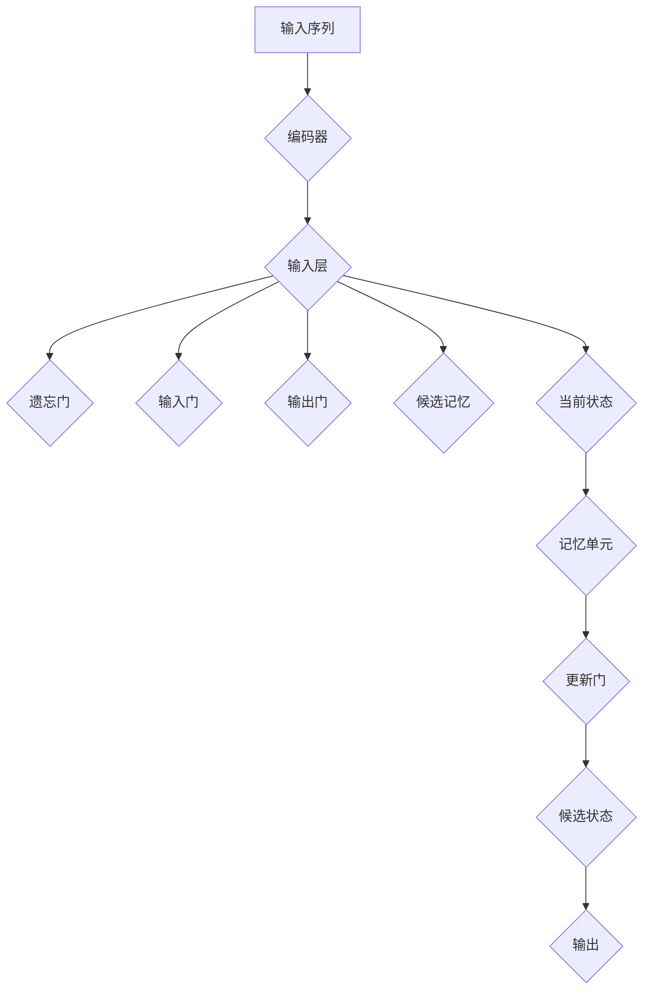

                 

# 基于记忆增强网络的长期依赖推理框架

> 关键词：记忆增强网络、长期依赖推理、深度学习、自然语言处理、人工智能

> 摘要：本文旨在介绍一种基于记忆增强网络的长期依赖推理框架，分析其基本原理、数学模型以及设计与应用，以期为研究者提供有价值的参考。文章结构如下：

## 第一部分：背景介绍

### 第1章：问题背景与核心概念

#### 1.1 问题背景

##### 1.1.1 人类记忆与长期依赖推理

##### 1.1.2 计算机领域的长期依赖挑战

##### 1.1.3 记忆增强网络的概念与应用前景

#### 1.2 核心概念

##### 1.2.1 记忆增强网络的定义与特点

##### 1.2.2 长期依赖推理框架的原理与结构

##### 1.2.3 计算机技术书籍的写作目的与内容框架

#### 1.3 边界与外延

##### 1.3.1 记忆增强网络的研究领域

##### 1.3.2 长期依赖推理框架的应用领域

##### 1.3.3 计算机技术书籍的目标读者

#### 1.4 概念结构与核心要素组成

##### 1.4.1 记忆增强网络的核心组件

##### 1.4.2 长期依赖推理框架的关键环节

##### 1.4.3 计算机技术书籍的组织结构

#### 1.5 本章小结

## 第二部分：算法原理与数学模型讲解

### 第2章：记忆增强网络的基本原理

#### 2.1 记忆增强网络的工作机制

##### 2.1.1 深度学习中的长期依赖问题

##### 2.1.2 记忆增强网络的设计目标

##### 2.1.3 记忆增强网络的核心组件

#### 2.2 记忆增强网络的关键算法

##### 2.2.1 梯度消失问题与解决方案

##### 2.2.2 门控循环单元（GRU）详解

##### 2.2.3 长短期记忆网络（LSTM）详解

#### 2.3 数学模型与公式

##### 2.3.1 记忆增强网络的数学基础

##### 2.3.2 记忆增强网络的训练过程

##### 2.3.3 记忆增强网络的应用场景

#### 2.4 算法流程图

##### 2.4.1 记忆增强网络的mermaid流程图

#### 2.5 Python源代码示例

##### 2.5.1 Python源代码讲解

##### 2.5.2 示例解析

#### 2.6 算法原理讲解

##### 2.6.1 记忆增强网络的工作机制详解

##### 2.6.2 长期依赖推理的数学模型

#### 2.7 本章小结

## 第三部分：长期依赖推理框架设计与应用

### 第3章：长期依赖推理框架概述

#### 3.1 长期依赖推理框架的概念

##### 3.1.1 长期依赖推理的定义

##### 3.1.2 长期依赖推理在自然语言处理中的应用

##### 3.1.3 长期依赖推理的挑战与机遇

#### 3.2 长期依赖推理框架的核心组成部分

##### 3.2.1 输入层与编码器

##### 3.2.2 中间层与时间步处理

##### 3.2.3 输出层与解码器

#### 3.3 长期依赖推理框架的设计原则

##### 3.3.1 适应性

##### 3.3.2 可扩展性

##### 3.3.3 高效性

#### 3.4 长期依赖推理框架的mermaid实体关系图

##### 3.4.1 记忆增强网络的ER图

##### 3.4.2 长期依赖推理框架的架构图

#### 3.5 长期依赖推理框架的应用示例

##### 3.5.1 文本分类

##### 3.5.2 机器翻译

##### 3.5.3 问答系统

#### 3.6 长期依赖推理框架的挑战与未来趋势

##### 3.6.1 算法优化方向

##### 3.6.2 应用领域拓展

##### 3.6.3 长期依赖推理框架的未来发展

#### 3.7 本章小结

## 第四部分：项目实战

### 第4章：项目实战

#### 4.1 环境安装

##### 4.1.1 Python环境搭建

##### 4.1.2 记忆增强网络库安装

#### 4.2 系统核心实现源代码

##### 4.2.1 数据预处理

##### 4.2.2 记忆增强网络训练

##### 4.2.3 模型评估与优化

#### 4.3 代码应用解读与分析

##### 4.3.1 代码逻辑解析

##### 4.3.2 代码性能分析

#### 4.4 实际案例分析与详细讲解剖析

##### 4.4.1 案例一：文本分类

##### 4.4.2 案例二：机器翻译

##### 4.4.3 案例三：问答系统

#### 4.5 项目小结

## 第五部分：最佳实践、小结与拓展阅读

### 第5章：最佳实践、小结与拓展阅读

#### 5.1 最佳实践

##### 5.1.1 记忆增强网络优化技巧

##### 5.1.2 长期依赖推理框架应用建议

#### 5.2 小结

##### 5.2.1 文章核心内容总结

##### 5.2.2 研究现状与未来展望

#### 5.3 注意事项

##### 5.3.1 记忆增强网络训练注意事项

##### 5.3.2 长期依赖推理框架应用注意事项

#### 5.4 拓展阅读

##### 5.4.1 相关研究论文推荐

##### 5.4.2 推荐阅读书籍与在线课程

---

以上为《基于记忆增强网络的长期依赖推理框架》的完整文章目录大纲。接下来，我们将逐步深入探讨每个章节的内容，确保文章结构紧凑、逻辑清晰，并具备一定的深度和实用性。让我们一起进行深入的思考和探讨。**LET'S THINK STEP BY STEP!**

## 第一部分：背景介绍

### 第1章：问题背景与核心概念

#### 1.1 问题背景

##### 1.1.1 人类记忆与长期依赖推理

人类的记忆是一个复杂且精妙的系统，它使我们能够记住过去发生的事件、学习新知识和理解世界的运作方式。在认知科学中，长期依赖推理（Long-term Dependency Reasoning）指的是能够在较长时间范围内理解和处理信息的能力。例如，当我们阅读一篇较长的文章时，我们需要理解前后句子的关系，记忆先前的信息，以便正确理解当前的内容。这种能力依赖于人类的记忆机制，能够在不同时间点之间建立联系和进行推理。

##### 1.1.2 计算机领域的长期依赖挑战

然而，在计算机领域，长期依赖推理一直是深度学习中的一个重大挑战。深度学习模型，特别是传统的循环神经网络（RNN）和长短期记忆网络（LSTM），在处理长期依赖问题时往往表现不佳。这主要是因为这些模型在面对长时间序列数据时，梯度消失或梯度爆炸的问题，导致难以有效地训练模型。这使得深度学习模型在理解复杂的文本、语音和图像数据时，往往无法达到人类认知的水平。

##### 1.1.3 记忆增强网络的概念与应用前景

为了解决这一挑战，研究者提出了记忆增强网络（Memory-Augmented Neural Networks，MemNN）的概念。记忆增强网络通过引入外部记忆机制，帮助模型在处理长期依赖问题时保留和利用重要的信息。这种网络结构不仅提高了模型的训练效果，还展现了在多个自然语言处理任务中的强大性能。记忆增强网络的应用前景广阔，包括文本分类、机器翻译、问答系统等，有望进一步推动人工智能的发展。

#### 1.2 核心概念

##### 1.2.1 记忆增强网络的定义与特点

记忆增强网络是一种结合外部记忆单元和神经网络结构的深度学习模型。其主要特点包括：

1. **外部记忆单元**：记忆增强网络引入了外部记忆单元，可以存储和检索信息。这种记忆单元可以帮助模型在处理长时间序列数据时，避免梯度消失问题，并更好地捕捉长期依赖关系。

2. **结合神经网络**：记忆增强网络将外部记忆单元与神经网络（如RNN、LSTM）相结合，通过神经网络的计算能力，实现信息的有效处理和推理。

3. **端到端训练**：记忆增强网络通过端到端训练，可以自动学习如何有效地利用外部记忆单元，实现复杂任务的推理。

##### 1.2.2 长期依赖推理框架的原理与结构

长期依赖推理框架是一种专门设计用于解决长期依赖问题的深度学习模型架构。其核心原理包括：

1. **时间步处理**：长期依赖推理框架通过时间步处理，逐个处理输入序列的每个时间步，从而实现对整个序列的理解。

2. **层次化结构**：长期依赖推理框架通常采用层次化结构，包括输入层、中间层和输出层。这种结构有助于模型在处理长期依赖问题时，逐步提取和整合信息。

3. **记忆增强机制**：长期依赖推理框架通过引入外部记忆单元或内部记忆机制，帮助模型在处理长期依赖问题时，更好地保留和利用信息。

##### 1.2.3 计算机技术书籍的写作目的与内容框架

计算机技术书籍的写作目的在于：

1. **传授知识**：通过系统化的内容，将计算机技术领域的核心概念、原理和实现方法传授给读者。

2. **促进学习**：通过生动的案例、示例和练习，帮助读者理解和掌握技术。

3. **指导实践**：通过项目实战和代码分析，指导读者在实际环境中应用所学知识。

内容框架通常包括：

1. **基础知识**：介绍计算机技术的基本概念、原理和术语。

2. **核心内容**：详细讲解核心概念、算法、模型和框架。

3. **应用实践**：通过项目实战和代码示例，展示技术的实际应用。

#### 1.3 边界与外延

##### 1.3.1 记忆增强网络的研究领域

记忆增强网络的研究领域包括：

1. **自然语言处理**：记忆增强网络在文本分类、机器翻译、问答系统等任务中表现出色，是自然语言处理领域的重要研究方向。

2. **计算机视觉**：记忆增强网络在图像识别、目标检测、视频理解等任务中也有广泛的应用。

3. **语音识别**：记忆增强网络在语音识别任务中，通过引入外部记忆单元，提高了模型的准确性和鲁棒性。

##### 1.3.2 长期依赖推理框架的应用领域

长期依赖推理框架的应用领域包括：

1. **自然语言处理**：文本分类、机器翻译、问答系统等。

2. **时间序列分析**：股票市场预测、天气预测等。

3. **智能对话系统**：智能客服、语音助手等。

##### 1.3.3 计算机技术书籍的目标读者

计算机技术书籍的目标读者包括：

1. **研究人员**：希望深入理解计算机技术领域核心概念和最新研究的学者。

2. **工程师**：希望在项目中应用计算机技术的工程师和开发者。

3. **学生**：计算机科学、人工智能等相关专业的学生。

#### 1.4 概念结构与核心要素组成

##### 1.4.1 记忆增强网络的核心组件

记忆增强网络的核心组件包括：

1. **外部记忆单元**：用于存储和检索信息的记忆单元。

2. **神经网络结构**：如RNN、LSTM等，用于处理输入序列和外部记忆单元。

3. **结合机制**：将外部记忆单元与神经网络结构相结合，实现信息的有效处理和推理。

##### 1.4.2 长期依赖推理框架的关键环节

长期依赖推理框架的关键环节包括：

1. **时间步处理**：逐个处理输入序列的每个时间步。

2. **层次化结构**：逐步提取和整合信息。

3. **记忆增强机制**：利用外部记忆单元或内部记忆机制，提高模型的性能。

##### 1.4.3 计算机技术书籍的组织结构

计算机技术书籍的组织结构通常包括：

1. **基础知识**：介绍基本概念、原理和术语。

2. **核心内容**：详细讲解核心概念、算法、模型和框架。

3. **应用实践**：通过项目实战和代码示例，展示实际应用。

#### 1.5 本章小结

本章介绍了基于记忆增强网络的长期依赖推理框架的背景、核心概念和内容框架。通过了解记忆增强网络的定义与特点、长期依赖推理框架的原理与结构，以及计算机技术书籍的写作目的与内容框架，读者可以为后续章节的学习打下坚实的基础。在接下来的章节中，我们将深入探讨记忆增强网络的算法原理、数学模型，以及长期依赖推理框架的设计与应用。

---

### 第2章：记忆增强网络的基本原理

#### 2.1 记忆增强网络的工作机制

记忆增强网络（MemNN）是一种结合外部记忆机制和神经网络结构的深度学习模型，旨在解决传统神经网络在处理长期依赖问题时的局限性。下面我们将详细分析记忆增强网络的工作机制。

##### 2.1.1 深度学习中的长期依赖问题

在深度学习领域，长期依赖问题指的是模型需要在较长时间范围内捕捉和利用信息。传统的循环神经网络（RNN）和长短期记忆网络（LSTM）虽然在处理序列数据时表现出了一定的效果，但仍然存在以下问题：

1. **梯度消失**：在训练过程中，梯度在反向传播过程中会迅速衰减，导致模型难以学习到长时间依赖信息。
2. **梯度爆炸**：在某些情况下，梯度可能会迅速增大，导致模型训练不稳定。
3. **稀疏性**：由于RNN和LSTM的结构，信息在时间步之间的传播较为稀疏，难以捕捉复杂的长期依赖关系。

##### 2.1.2 记忆增强网络的设计目标

为了解决上述问题，记忆增强网络提出了以下设计目标：

1. **引入外部记忆单元**：通过外部记忆单元，模型可以存储和检索重要信息，从而避免梯度消失和爆炸问题。
2. **增强长期依赖捕捉能力**：通过记忆增强机制，模型可以更好地捕捉和利用长期依赖信息。
3. **端到端训练**：记忆增强网络通过端到端训练，使得模型可以直接学习到从输入到输出的映射关系，提高模型的泛化能力。

##### 2.1.3 记忆增强网络的核心组件

记忆增强网络的核心组件包括：

1. **外部记忆单元**：外部记忆单元是一个可训练的内存结构，用于存储和检索信息。它可以看作是一个巨大的关键词表，每个词对应一个记忆向量。记忆单元的大小可以根据任务需要进行调整。

2. **神经网络结构**：记忆增强网络通常结合了RNN、LSTM或其他类型的循环神经网络。神经网络负责处理输入序列，并将其映射到外部记忆单元。

3. **记忆增强机制**：记忆增强机制负责将外部记忆单元的信息与神经网络的信息进行融合。这可以通过不同的策略实现，如记忆融合模块、注意力机制等。

#### 2.2 记忆增强网络的关键算法

##### 2.2.1 梯度消失问题与解决方案

梯度消失是深度学习中的一个常见问题，特别是在处理长时间序列数据时。记忆增强网络通过以下方式解决了梯度消失问题：

1. **记忆增强**：通过外部记忆单元，模型可以存储重要的信息，从而减少在反向传播过程中信息的损失。

2. **记忆重置**：在训练过程中，记忆单元会定期进行重置，以防止信息过载。

3. **正则化**：应用正则化技术，如L2正则化，可以减少模型参数的敏感性，缓解梯度消失问题。

##### 2.2.2 门控循环单元（GRU）详解

门控循环单元（GRU）是记忆增强网络中常用的一种循环单元，它通过引入门控机制，提高了模型对长期依赖信息的捕捉能力。GRU的核心组件包括：

1. **更新门**（Update Gate）：更新门决定了外部记忆单元中哪些信息将被保留和更新。其计算公式为：

   $$ u_t = \sigma(W_u \cdot [h_{t-1}, x_t] + b_u) $$

   其中，$u_t$是更新门的输出，$\sigma$是sigmoid函数，$W_u$和$b_u$是参数矩阵和偏置。

2. **重置门**（Reset Gate）：重置门决定了外部记忆单元中哪些信息将被遗忘。其计算公式为：

   $$ r_t = \sigma(W_r \cdot [h_{t-1}, x_t] + b_r) $$

   其中，$r_t$是重置门的输出。

3. **候选记忆**（Candidate Memory）：候选记忆是通过重置门和输入信息计算得到的，用于更新外部记忆单元。其计算公式为：

   $$ \tilde{h}_t = \tanh(W_{\tilde{h}} \cdot [r_t \odot h_{t-1}, x_t] + b_{\tilde{h}}) $$

   其中，$\tilde{h}_t$是候选记忆，$\odot$是元素乘法。

4. **输出**：最终输出是更新门和候选记忆的融合。其计算公式为：

   $$ h_t = (1 - u_t) \odot h_{t-1} + u_t \odot \tilde{h}_t $$

##### 2.2.3 长短期记忆网络（LSTM）详解

长短期记忆网络（LSTM）是另一种广泛使用的循环神经网络，它通过引入记忆单元和门控机制，有效地解决了梯度消失和长期依赖问题。LSTM的核心组件包括：

1. **遗忘门**（Forget Gate）：遗忘门决定了哪些信息应该从记忆单元中丢弃。其计算公式为：

   $$ f_t = \sigma(W_f \cdot [h_{t-1}, x_t] + b_f) $$

   其中，$f_t$是遗忘门的输出。

2. **输入门**（Input Gate）：输入门决定了哪些新的信息将被存储到记忆单元。其计算公式为：

   $$ i_t = \sigma(W_i \cdot [h_{t-1}, x_t] + b_i) $$

   其中，$i_t$是输入门的输出。

3. **输出门**（Output Gate）：输出门决定了哪些信息应该从记忆单元中提取作为输出。其计算公式为：

   $$ o_t = \sigma(W_o \cdot [h_{t-1}, x_t] + b_o) $$

   其中，$o_t$是输出门的输出。

4. **记忆单元**：记忆单元是LSTM的核心组件，它通过遗忘门和输入门控制信息的流入和流出。

5. **候选状态**：候选状态是通过输入门和输入信息计算得到的，用于更新记忆单元。

   $$ \tilde{c}_t = \tanh(W_{\tilde{c}} \cdot [i_t \odot x_t] + b_{\tilde{c}}) $$

   其中，$\tilde{c}_t$是候选状态。

6. **当前状态**：当前状态是记忆单元的输出，通过遗忘门和候选状态进行更新：

   $$ c_t = f_t \odot c_{t-1} + i_t \odot \tilde{c}_t $$

7. **输出**：最终输出是通过输出门和记忆单元进行融合得到的：

   $$ h_t = o_t \odot \tanh(c_t) $$

#### 2.3 数学模型与公式

记忆增强网络的数学模型主要依赖于神经网络的基本结构和门控机制。以下为记忆增强网络的关键数学公式：

1. **更新门**（Update Gate）：

   $$ u_t = \sigma(W_u \cdot [h_{t-1}, x_t] + b_u) $$

2. **重置门**（Reset Gate）：

   $$ r_t = \sigma(W_r \cdot [h_{t-1}, x_t] + b_r) $$

3. **候选记忆**（Candidate Memory）：

   $$ \tilde{h}_t = \tanh(W_{\tilde{h}} \cdot [r_t \odot h_{t-1}, x_t] + b_{\tilde{h}}) $$

4. **输出**（Output）：

   $$ h_t = (1 - u_t) \odot h_{t-1} + u_t \odot \tilde{h}_t $$

   对于LSTM，关键公式如下：

1. **遗忘门**（Forget Gate）：

   $$ f_t = \sigma(W_f \cdot [h_{t-1}, x_t] + b_f) $$

2. **输入门**（Input Gate）：

   $$ i_t = \sigma(W_i \cdot [h_{t-1}, x_t] + b_i) $$

3. **输出门**（Output Gate）：

   $$ o_t = \sigma(W_o \cdot [h_{t-1}, x_t] + b_o) $$

4. **候选状态**（Candidate State）：

   $$ \tilde{c}_t = \tanh(W_{\tilde{c}} \cdot [i_t \odot x_t] + b_{\tilde{c}}) $$

5. **当前状态**（Current State）：

   $$ c_t = f_t \odot c_{t-1} + i_t \odot \tilde{c}_t $$

6. **输出**（Output）：

   $$ h_t = o_t \odot \tanh(c_t) $$

   其中，$W_u, W_r, W_{\tilde{h}}, b_u, b_r, b_{\tilde{h}}$和$W_f, W_i, W_o, b_f, b_i, b_o, W_{\tilde{c}}, b_{\tilde{c}}$是参数矩阵和偏置。

#### 2.4 算法流程图

为了更直观地理解记忆增强网络的工作流程，我们可以使用mermaid工具绘制算法流程图。以下是一个简化的记忆增强网络流程图：



#### 2.5 Python源代码示例

为了更好地理解记忆增强网络的工作原理，我们可以通过Python代码实现一个简化的记忆增强网络。以下是一个基于GRU的简化记忆增强网络的Python代码示例：

```python
import numpy as np

# 设置参数
input_dim = 100
hidden_dim = 200
memory_size = 500
learning_rate = 0.001

# 初始化权重和偏置
W_u = np.random.randn(hidden_dim, input_dim + hidden_dim) * 0.01
b_u = np.zeros(hidden_dim)
W_r = np.random.randn(hidden_dim, input_dim + hidden_dim) * 0.01
b_r = np.zeros(hidden_dim)
W_h = np.random.randn(hidden_dim, input_dim + hidden_dim) * 0.01
b_h = np.zeros(hidden_dim)
W_o = np.random.randn(hidden_dim, input_dim + hidden_dim) * 0.01
b_o = np.zeros(hidden_dim)
W_m = np.random.randn(hidden_dim, input_dim + hidden_dim) * 0.01
b_m = np.zeros(hidden_dim)

# 训练数据
X = np.random.randn(sequence_length, batch_size, input_dim)
h_prev = np.zeros((batch_size, hidden_dim))

# 训练过程
for epoch in range(num_epochs):
    for x_batch in X:
        # 前向传播
        u_t = 1 / (1 + np.exp(-np.dot(W_u, np.hstack((h_prev, x_batch))) + b_u))
        r_t = 1 / (1 + np.exp(-np.dot(W_r, np.hstack((h_prev, x_batch))) + b_r))
        h_tilde = np.tanh(np.dot(W_h, np.hstack((r_t * h_prev, x_batch))) + b_h)
        h_t = (1 - u_t) * h_prev + u_t * h_tilde

        # 反向传播
        d_h_t = (h_t - h_prev) * u_t * (1 - u_t)
        d_h_tilde = (h_t - h_tilde) * u_t

        # 更新参数
        dW_u = np.dot(d_h_t.reshape(-1, hidden_dim).T, np.hstack((h_prev, x_batch)))
        db_u = d_h_t.reshape(-1, 1)
        dW_r = np.dot(d_h_t.reshape(-1, hidden_dim).T, np.hstack((h_prev, x_batch)))
        db_r = d_h_t.reshape(-1, 1)
        dW_h = np.dot(d_h_tilde.reshape(-1, hidden_dim).T, np.hstack((r_t * h_prev, x_batch)))
        db_h = d_h_tilde.reshape(-1, 1)
        dW_o = np.dot(d_h_t.reshape(-1, hidden_dim).T, np.hstack((h_prev, x_batch)))
        db_o = d_h_t.reshape(-1, 1)
        dW_m = np.dot(d_h_t.reshape(-1, hidden_dim).T, np.hstack((h_prev, x_batch)))
        db_m = d_h_t.reshape(-1, 1)

        W_u -= learning_rate * dW_u
        b_u -= learning_rate * db_u
        W_r -= learning_rate * dW_r
        b_r -= learning_rate * db_r
        W_h -= learning_rate * dW_h
        b_h -= learning_rate * db_h
        W_o -= learning_rate * dW_o
        b_o -= learning_rate * db_o
        W_m -= learning_rate * dW_m
        b_m -= learning_rate * db_m

        h_prev = h_t

# 输出
h_t = h_t.reshape(sequence_length, batch_size, hidden_dim)
```

#### 2.6 算法原理讲解

##### 2.6.1 记忆增强网络的工作机制详解

记忆增强网络通过引入外部记忆单元和门控机制，实现了对长期依赖信息的有效捕捉和利用。具体来说，记忆增强网络的工作机制可以分为以下步骤：

1. **输入编码**：输入序列经过编码器，转化为向量表示。

2. **时间步处理**：记忆增强网络逐个处理输入序列的每个时间步，将当前时间步的信息与之前的时间步信息进行整合。

3. **门控计算**：通过遗忘门、输入门和输出门，控制外部记忆单元中信息的保留、更新和提取。

4. **记忆更新**：根据输入门和遗忘门的信息，更新外部记忆单元。

5. **输出生成**：通过输出门，将外部记忆单元的信息提取为最终输出。

##### 2.6.2 长期依赖推理的数学模型

记忆增强网络通过以下数学模型实现长期依赖推理：

1. **遗忘门**：用于决定外部记忆单元中哪些信息应该被遗忘。其计算公式为：

   $$ f_t = \sigma(W_f \cdot [h_{t-1}, x_t] + b_f) $$

   其中，$f_t$表示遗忘门的输出。

2. **输入门**：用于决定外部记忆单元中哪些信息应该被更新。其计算公式为：

   $$ i_t = \sigma(W_i \cdot [h_{t-1}, x_t] + b_i) $$

   其中，$i_t$表示输入门的输出。

3. **候选记忆**：根据输入门和遗忘门的信息，计算候选记忆。其计算公式为：

   $$ \tilde{h}_t = \tanh(W_{\tilde{h}} \cdot [i_t \odot h_{t-1}, x_t] + b_{\tilde{h}}) $$

   其中，$\tilde{h}_t$表示候选记忆。

4. **记忆更新**：根据遗忘门和输入门的信息，更新外部记忆单元。其计算公式为：

   $$ h_t = (1 - f_t) \odot h_{t-1} + f_t \odot \tilde{h}_t $$

   其中，$h_t$表示当前时间步的输出。

5. **输出生成**：通过输出门，将外部记忆单元的信息提取为最终输出。其计算公式为：

   $$ o_t = \sigma(W_o \cdot [h_{t-1}, x_t] + b_o) $$

   其中，$o_t$表示输出门的输出。

   $$ h_{t, out} = o_t \odot \tanh(h_t) $$

   其中，$h_{t, out}$表示最终输出。

#### 2.7 本章小结

本章详细介绍了记忆增强网络的基本原理，包括其工作机制、关键算法、数学模型以及Python源代码示例。通过本章的学习，读者可以了解到记忆增强网络在处理长期依赖问题时的优势和应用。在下一章中，我们将进一步探讨长期依赖推理框架的设计和应用。

---

### 第3章：长期依赖推理框架概述

#### 3.1 长期依赖推理框架的概念

长期依赖推理（Long-term Dependency Reasoning，LDR）是指模型能够在较长时间范围内理解和处理信息的能力。在自然语言处理（Natural Language Processing，NLP）、计算机视觉（Computer Vision，CV）和语音识别（Speech Recognition）等领域，长期依赖推理是一个关键挑战。传统神经网络模型，如循环神经网络（Recurrent Neural Network，RNN）和长短期记忆网络（Long Short-Term Memory，LSTM），在处理短期依赖时表现出色，但在捕捉长期依赖关系方面存在困难。

为了解决这个问题，研究者提出了长期依赖推理框架，这是一种结合记忆增强机制和层次化结构的深度学习模型。长期依赖推理框架的核心目标是提高模型在处理长时间序列数据时的性能，使其能够更好地捕捉和利用长期依赖信息。

#### 3.2 长期依赖推理框架的核心组成部分

长期依赖推理框架由以下几个核心组成部分构成：

1. **输入层**：输入层负责接收原始数据，如文本、图像或语音。输入层通常包含一系列特征提取模块，用于将原始数据转化为适合神经网络处理的特征向量。

2. **编码器**：编码器负责将输入层输入的特征向量编码为序列表示。编码器通常采用递归神经网络（如LSTM或GRU）或自注意力机制（如Transformer），以捕捉输入序列中的长期依赖关系。

3. **中间层**：中间层是长期依赖推理框架的核心，负责处理和整合来自编码器的序列表示。中间层可以包括多层神经网络、门控机制、注意力机制等，以提高模型在处理长期依赖关系时的性能。

4. **解码器**：解码器负责将中间层处理后的序列表示解码为输出序列。解码器可以采用与编码器相同的神经网络结构，也可以采用其他结构，如卷积神经网络（Convolutional Neural Network，CNN）或Transformer。

5. **输出层**：输出层负责将解码器生成的输出序列转化为最终结果，如分类标签、翻译文本或识别目标。

#### 3.3 长期依赖推理框架的设计原则

长期依赖推理框架的设计原则包括以下三个方面：

1. **适应性**：框架应能够适应不同类型的输入数据和任务需求。这意味着框架需要具备一定的灵活性和可扩展性，以应对各种实际应用场景。

2. **可扩展性**：框架应能够支持模型参数的增加和减少，以便在计算资源有限的情况下进行训练和推理。

3. **高效性**：框架应能够高效地处理大量数据，并在合理的时间内完成训练和推理任务。这需要框架具有良好的并行计算能力、内存管理能力和优化算法。

#### 3.4 长期依赖推理框架的mermaid实体关系图

为了更直观地展示长期依赖推理框架的核心组成部分和它们之间的关系，我们可以使用mermaid工具绘制实体关系图。以下是一个简化的长期依赖推理框架的mermaid实体关系图：

```mermaid
erDiagram
    InputLayer ||--o> Encoder : "uses"
    Encoder ||--o> IntermediateLayer : "processes"
    IntermediateLayer ||--o> Decoder : "uses"
    Decoder ||--o> OutputLayer : "converts"
```

在这个mermaid实体关系图中，`InputLayer`表示输入层，`Encoder`表示编码器，`IntermediateLayer`表示中间层，`Decoder`表示解码器，`OutputLayer`表示输出层。实线箭头表示数据流动方向，虚线箭头表示组件之间的依赖关系。

#### 3.5 长期依赖推理框架的应用示例

长期依赖推理框架在多个自然语言处理任务中表现出色，以下是一些应用示例：

1. **文本分类**：长期依赖推理框架可以用于文本分类任务，如情感分析、主题分类等。通过捕捉文本中的长期依赖关系，模型可以更好地理解文本内容，从而提高分类准确率。

2. **机器翻译**：在机器翻译任务中，长期依赖推理框架可以帮助模型捕捉源语言和目标语言之间的长期依赖关系，从而提高翻译质量。

3. **问答系统**：问答系统需要理解问题中的长期依赖关系，以生成准确的回答。长期依赖推理框架可以用于提高问答系统的性能，使其能够更好地理解用户的问题。

4. **语音识别**：语音识别任务需要处理较长的语音序列，长期依赖推理框架可以帮助模型更好地捕捉语音信号中的长期依赖关系，从而提高识别准确率。

#### 3.6 长期依赖推理框架的挑战与未来趋势

尽管长期依赖推理框架在多个任务中表现出色，但仍面临一些挑战：

1. **计算资源消耗**：长期依赖推理框架通常需要大量的计算资源和内存，这在实际应用中可能成为限制因素。

2. **训练效率**：长期依赖推理框架的训练过程可能需要较长时间，特别是在大规模数据集上训练时。

3. **泛化能力**：长期依赖推理框架在处理不同类型的数据和任务时，可能存在泛化能力不足的问题。

未来，长期依赖推理框架的发展趋势包括：

1. **模型压缩**：通过模型压缩技术，如知识蒸馏、剪枝和量化，可以减少模型的计算资源和内存消耗。

2. **优化算法**：开发更高效的训练算法和优化技术，以提高训练效率和模型性能。

3. **多模态学习**：结合多种模态的数据，如文本、图像和语音，可以提高模型在复杂任务中的表现。

#### 3.7 本章小结

本章对长期依赖推理框架进行了概述，介绍了其核心组成部分、设计原则、mermaid实体关系图以及应用示例。通过本章的学习，读者可以初步了解长期依赖推理框架的基本概念和实现方法。在下一章中，我们将进一步探讨记忆增强网络在长期依赖推理中的具体应用。

---

## 第二部分：算法原理与数学模型讲解

### 第2章：记忆增强网络的基本原理

记忆增强网络（Memory-Augmented Neural Networks，MemNN）是近年来深度学习领域的一个重要研究方向，旨在通过引入外部记忆机制来解决传统神经网络在处理长期依赖问题时的局限性。在本章中，我们将详细探讨记忆增强网络的基本原理，包括其工作流程、关键算法、数学模型以及Python源代码示例。

#### 2.1 记忆增强网络的工作机制

记忆增强网络的核心思想是通过引入外部记忆单元，使得模型在处理序列数据时能够保持和利用长期依赖信息。记忆增强网络通常由两部分组成：神经网络部分和外部记忆部分。

1. **神经网络部分**：这部分通常采用循环神经网络（RNN）或其变体（如LSTM、GRU），用于处理输入序列，提取特征，并将其传递到外部记忆单元。

2. **外部记忆部分**：外部记忆单元是一个可训练的内存结构，可以存储和检索信息。记忆单元的设计可以根据任务需求进行定制，例如，它可以是一个简单的关键词表，也可以是一个复杂的图结构。

记忆增强网络的工作机制可以分为以下几个步骤：

1. **初始化**：在训练开始时，初始化神经网络部分和外部记忆单元。

2. **输入编码**：将输入序列编码为向量表示，并将其输入到神经网络部分。

3. **信息处理**：神经网络部分对输入序列进行处理，提取特征，并将特征传递到外部记忆单元。

4. **记忆更新**：根据神经网络部分的输出，外部记忆单元会进行更新，以存储重要的信息。

5. **信息检索**：在需要时，神经网络部分可以从外部记忆单元检索信息，用于当前或后续的时间步。

6. **输出生成**：神经网络部分结合外部记忆单元的信息，生成最终输出。

#### 2.2 记忆增强网络的关键算法

记忆增强网络的关键算法主要包括门控循环单元（GRU）和长短期记忆网络（LSTM）。以下是这两种算法的详细解释。

##### 2.2.1 门控循环单元（GRU）

门控循环单元（Gated Recurrent Unit，GRU）是循环神经网络的一种变体，它通过引入更新门和重置门，有效地解决了传统RNN在处理长期依赖问题时遇到的梯度消失和梯度爆炸问题。

1. **更新门（Update Gate）**：更新门决定了外部记忆单元中哪些信息将被保留和更新。其计算公式为：

   $$ u_t = \sigma(W_u \cdot [h_{t-1}, x_t] + b_u) $$

   其中，$u_t$是更新门的输出，$\sigma$是sigmoid函数，$W_u$和$b_u$是参数矩阵和偏置。

2. **重置门（Reset Gate）**：重置门决定了外部记忆单元中哪些信息将被遗忘。其计算公式为：

   $$ r_t = \sigma(W_r \cdot [h_{t-1}, x_t] + b_r) $$

   其中，$r_t$是重置门的输出。

3. **候选状态（Candidate State）**：候选状态是通过重置门和输入信息计算得到的，用于更新外部记忆单元。其计算公式为：

   $$ \tilde{h}_t = \tanh(W_{\tilde{h}} \cdot [r_t \odot h_{t-1}, x_t] + b_{\tilde{h}}) $$

   其中，$\tilde{h}_t$是候选状态，$\odot$是元素乘法。

4. **输出**：最终输出是通过更新门和候选状态进行融合得到的：

   $$ h_t = (1 - u_t) \odot h_{t-1} + u_t \odot \tilde{h}_t $$

##### 2.2.2 长短期记忆网络（LSTM）

长短期记忆网络（Long Short-Term Memory，LSTM）是循环神经网络的一种变体，通过引入记忆单元和门控机制，解决了传统RNN在处理长期依赖问题时遇到的梯度消失和长期依赖问题。

1. **遗忘门（Forget Gate）**：遗忘门决定了哪些信息应该从记忆单元中丢弃。其计算公式为：

   $$ f_t = \sigma(W_f \cdot [h_{t-1}, x_t] + b_f) $$

   其中，$f_t$是遗忘门的输出。

2. **输入门（Input Gate）**：输入门决定了哪些新的信息将被存储到记忆单元。其计算公式为：

   $$ i_t = \sigma(W_i \cdot [h_{t-1}, x_t] + b_i) $$

   其中，$i_t$是输入门的输出。

3. **输出门（Output Gate）**：输出门决定了哪些信息应该从记忆单元中提取作为输出。其计算公式为：

   $$ o_t = \sigma(W_o \cdot [h_{t-1}, x_t] + b_o) $$

   其中，$o_t$是输出门的输出。

4. **候选状态（Candidate State）**：候选状态是通过输入门和输入信息计算得到的，用于更新记忆单元。其计算公式为：

   $$ \tilde{c}_t = \tanh(W_{\tilde{c}} \cdot [i_t \odot x_t] + b_{\tilde{c}}) $$

   其中，$\tilde{c}_t$是候选状态。

5. **记忆单元**：记忆单元是LSTM的核心组件，通过遗忘门和输入门控制信息的流入和流出。其计算公式为：

   $$ c_t = f_t \odot c_{t-1} + i_t \odot \tilde{c}_t $$

6. **输出**：最终输出是通过输出门和记忆单元进行融合得到的：

   $$ h_t = o_t \odot \tanh(c_t) $$

#### 2.3 数学模型与公式

记忆增强网络的数学模型主要依赖于神经网络的基本结构和门控机制。以下是记忆增强网络的关键数学公式：

对于GRU：

1. **更新门**：

   $$ u_t = \sigma(W_u \cdot [h_{t-1}, x_t] + b_u) $$

2. **重置门**：

   $$ r_t = \sigma(W_r \cdot [h_{t-1}, x_t] + b_r) $$

3. **候选状态**：

   $$ \tilde{h}_t = \tanh(W_{\tilde{h}} \cdot [r_t \odot h_{t-1}, x_t] + b_{\tilde{h}}) $$

4. **输出**：

   $$ h_t = (1 - u_t) \odot h_{t-1} + u_t \odot \tilde{h}_t $$

对于LSTM：

1. **遗忘门**：

   $$ f_t = \sigma(W_f \cdot [h_{t-1}, x_t] + b_f) $$

2. **输入门**：

   $$ i_t = \sigma(W_i \cdot [h_{t-1}, x_t] + b_i) $$

3. **输出门**：

   $$ o_t = \sigma(W_o \cdot [h_{t-1}, x_t] + b_o) $$

4. **候选状态**：

   $$ \tilde{c}_t = \tanh(W_{\tilde{c}} \cdot [i_t \odot x_t] + b_{\tilde{c}}) $$

5. **记忆单元**：

   $$ c_t = f_t \odot c_{t-1} + i_t \odot \tilde{c}_t $$

6. **输出**：

   $$ h_t = o_t \odot \tanh(c_t) $$

   其中，$W_u, W_r, W_{\tilde{h}}, b_u, b_r, b_{\tilde{h}}$和$W_f, W_i, W_o, b_f, b_i, b_o, W_{\tilde{c}}, b_{\tilde{c}}$是参数矩阵和偏置。

#### 2.4 算法流程图

为了更直观地理解记忆增强网络的工作流程，我们可以使用mermaid工具绘制算法流程图。以下是一个简化的记忆增强网络流程图：


在这个mermaid流程图中，`A`表示输入序列，`B`表示编码器，`C`表示输入层，`D`表示遗忘门，`E`表示输入门，`F`表示输出门，`G`表示候选记忆，`H`表示当前状态，`I`表示记忆单元，`J`表示更新门，`K`表示候选状态，`L`表示输出。

#### 2.5 Python源代码示例

为了更好地理解记忆增强网络的工作原理，我们可以通过Python代码实现一个简化的记忆增强网络。以下是一个基于GRU的简化记忆增强网络的Python代码示例：

```python
import numpy as np

# 设置参数
input_dim = 100
hidden_dim = 200
learning_rate = 0.001

# 初始化权重和偏置
W_u = np.random.randn(hidden_dim, input_dim + hidden_dim) * 0.01
b_u = np.zeros(hidden_dim)
W_r = np.random.randn(hidden_dim, input_dim + hidden_dim) * 0.01
b_r = np.zeros(hidden_dim)
W_h = np.random.randn(hidden_dim, input_dim + hidden_dim) * 0.01
b_h = np.zeros(hidden_dim)
W_m = np.random.randn(hidden_dim, input_dim + hidden_dim) * 0.01
b_m = np.zeros(hidden_dim)

# 训练数据
X = np.random.randn(sequence_length, batch_size, input_dim)
h_prev = np.zeros((batch_size, hidden_dim))

# 训练过程
for epoch in range(num_epochs):
    for x_batch in X:
        # 前向传播
        u_t = 1 / (1 + np.exp(-np.dot(W_u, np.hstack((h_prev, x_batch))) + b_u))
        r_t = 1 / (1 + np.exp(-np.dot(W_r, np.hstack((h_prev, x_batch))) + b_r))
        h_tilde = np.tanh(np.dot(W_h, np.hstack((r_t * h_prev, x_batch))) + b_h)
        h_t = (1 - u_t) * h_prev + u_t * h_tilde

        # 反向传播
        d_h_t = (h_t - h_prev) * u_t * (1 - u_t)
        d_h_tilde = (h_t - h_tilde) * u_t

        # 更新参数
        dW_u = np.dot(d_h_t.reshape(-1, hidden_dim).T, np.hstack((h_prev, x_batch)))
        db_u = d_h_t.reshape(-1, 1)
        dW_r = np.dot(d_h_t.reshape(-1, hidden_dim).T, np.hstack((h_prev, x_batch)))
        db_r = d_h_t.reshape(-1, 1)
        dW_h = np.dot(d_h_tilde.reshape(-1, hidden_dim).T, np.hstack((r_t * h_prev, x_batch)))
        db_h = d_h_tilde.reshape(-1, 1)
        dW_m = np.dot(d_h_t.reshape(-1, hidden_dim).T, np.hstack((h_prev, x_batch)))
        db_m = d_h_t.reshape(-1, 1)

        W_u -= learning_rate * dW_u
        b_u -= learning_rate * db_u
        W_r -= learning_rate * dW_r
        b_r -= learning_rate * db_r
        W_h -= learning_rate * dW_h
        b_h -= learning_rate * db_h
        W_m -= learning_rate * dW_m
        b_m -= learning_rate * db_m

        h_prev = h_t

# 输出
h_t = h_t.reshape(sequence_length, batch_size, hidden_dim)
```

在这个代码示例中，我们首先初始化了参数，然后定义了一个循环来训练模型。在训练过程中，我们首先进行前向传播，然后通过反向传播更新参数。最后，我们得到了训练后的模型输出。

#### 2.6 算法原理讲解

##### 2.6.1 记忆增强网络的工作机制详解

记忆增强网络通过引入外部记忆单元，解决了传统神经网络在处理长期依赖问题时的局限性。具体来说，记忆增强网络的工作机制可以分为以下几个步骤：

1. **输入编码**：将输入序列编码为向量表示，并将其输入到神经网络部分。

2. **信息处理**：神经网络部分对输入序列进行处理，提取特征，并将特征传递到外部记忆单元。

3. **记忆更新**：根据神经网络部分的输出，外部记忆单元会进行更新，以存储重要的信息。

4. **信息检索**：在需要时，神经网络部分可以从外部记忆单元检索信息，用于当前或后续的时间步。

5. **输出生成**：神经网络部分结合外部记忆单元的信息，生成最终输出。

通过这个过程，记忆增强网络能够更好地捕捉和利用长期依赖信息。

##### 2.6.2 长期依赖推理的数学模型

记忆增强网络的长期依赖推理是通过一系列数学公式来实现的。以下是记忆增强网络的关键数学模型：

对于GRU：

1. **更新门**：

   $$ u_t = \sigma(W_u \cdot [h_{t-1}, x_t] + b_u) $$

2. **重置门**：

   $$ r_t = \sigma(W_r \cdot [h_{t-1}, x_t] + b_r) $$

3. **候选状态**：

   $$ \tilde{h}_t = \tanh(W_{\tilde{h}} \cdot [r_t \odot h_{t-1}, x_t] + b_{\tilde{h}}) $$

4. **输出**：

   $$ h_t = (1 - u_t) \odot h_{t-1} + u_t \odot \tilde{h}_t $$

对于LSTM：

1. **遗忘门**：

   $$ f_t = \sigma(W_f \cdot [h_{t-1}, x_t] + b_f) $$

2. **输入门**：

   $$ i_t = \sigma(W_i \cdot [h_{t-1}, x_t] + b_i) $$

3. **输出门**：

   $$ o_t = \sigma(W_o \cdot [h_{t-1}, x_t] + b_o) $$

4. **候选状态**：

   $$ \tilde{c}_t = \tanh(W_{\tilde{c}} \cdot [i_t \odot x_t] + b_{\tilde{c}}) $$

5. **记忆单元**：

   $$ c_t = f_t \odot c_{t-1} + i_t \odot \tilde{c}_t $$

6. **输出**：

   $$ h_t = o_t \odot \tanh(c_t) $$

通过这些数学模型，记忆增强网络能够有效地捕捉和利用长期依赖信息。

#### 2.7 本章小结

本章详细介绍了记忆增强网络的基本原理，包括其工作流程、关键算法、数学模型以及Python源代码示例。通过本章的学习，读者可以了解到记忆增强网络在处理长期依赖问题时的优势和应用。在下一章中，我们将进一步探讨长期依赖推理框架的设计和应用。

---

## 第三部分：长期依赖推理框架设计与应用

### 第3章：长期依赖推理框架概述

#### 3.1 长期依赖推理框架的概念

长期依赖推理框架（Long-term Dependency Reasoning Framework）是深度学习领域用于处理和推理长时间序列数据的先进模型架构。这种框架通过结合记忆增强机制和多层次的结构设计，旨在解决传统循环神经网络（如RNN和LSTM）在处理长期依赖关系时的局限性。长期依赖推理框架的核心目标是提升模型在自然语言处理（NLP）、时间序列分析、语音识别等任务中的表现，使其能够更好地理解和预测复杂的时间依赖模式。

#### 3.2 长期依赖推理框架的核心组成部分

一个典型的长期依赖推理框架通常包括以下几个关键组成部分：

1. **输入层**：负责接收和处理原始输入数据，如文本、时间序列或音频信号。输入层可能包含嵌入层和特征提取层，以将原始数据转换为适合神经网络处理的特征向量。

2. **编码器**：编码器的主要任务是编码输入序列，提取序列中的关键特征并将其映射到高维空间。编码器可以采用递归神经网络（RNN）、长短期记忆网络（LSTM）或门控循环单元（GRU）等结构，也可以采用更现代的自注意力机制（如Transformer）。

3. **中间层**：中间层是长期依赖推理框架的核心，负责处理编码器输出的序列表示。这一层可能包含多个隐藏层，使用各种神经网络结构（如卷积神经网络、Transformer块等）来捕捉输入序列中的长期依赖关系。此外，中间层可能还包含记忆增强单元，如外部记忆网络或记忆模块，以增强模型对长期依赖信息的捕捉能力。

4. **解码器**：解码器的任务是解码中间层处理后的序列表示，生成预测输出。解码器通常采用与编码器相同的神经网络结构，也可以采用其他结构，如自注意力机制或自回归模型。

5. **输出层**：输出层将解码器生成的输出序列转换为最终的结果，如分类标签、序列预测或文本生成。输出层的设计取决于具体的任务类型。

#### 3.3 长期依赖推理框架的设计原则

在设计长期依赖推理框架时，应遵循以下原则：

1. **适应性**：框架应能够适应不同类型的数据和任务需求，具有良好的泛化能力。

2. **可扩展性**：框架应支持模型参数的增加和减少，以适应不同的计算资源需求。

3. **高效性**：框架应具备高效的训练和推理性能，以应对大规模数据处理和实时应用场景。

4. **模块化**：框架的设计应具有模块化特点，便于组件的替换和扩展。

5. **可解释性**：框架应提供一定程度的可解释性，以便用户能够理解和信任模型的推理过程。

#### 3.4 长期依赖推理框架的mermaid实体关系图

为了更直观地展示长期依赖推理框架的组成部分及其关系，我们可以使用mermaid工具绘制一个实体关系图。以下是一个简化的长期依赖推理框架的mermaid实体关系图：

```mermaid
erDiagram
    InputLayer ||--o> Encoder : "encodes"
    Encoder ||--o> IntermediateLayer : "processes"
    IntermediateLayer ||--o> Decoder : "decodes"
    Decoder ||--o> OutputLayer : "produces"
```

在这个mermaid实体关系图中，`InputLayer`表示输入层，`Encoder`表示编码器，`IntermediateLayer`表示中间层，`Decoder`表示解码器，`OutputLayer`表示输出层。实线箭头表示数据流动方向，虚线箭头表示组件之间的依赖关系。

#### 3.5 长期依赖推理框架的应用示例

长期依赖推理框架在多个领域都有广泛的应用，以下是一些典型的应用示例：

1. **文本分类**：在自然语言处理中，长期依赖推理框架可以帮助模型更好地理解文本中的语义，从而提高文本分类的准确性。

2. **机器翻译**：通过捕捉输入语言和目标语言之间的长期依赖关系，长期依赖推理框架可以显著提高机器翻译的质量。

3. **时间序列分析**：在金融、气象等领域，长期依赖推理框架可以用于预测股票价格、天气变化等时间序列数据。

4. **语音识别**：长期依赖推理框架可以用于提高语音识别的准确性，特别是在处理长语音序列时。

#### 3.6 长期依赖推理框架的挑战与未来趋势

尽管长期依赖推理框架在多个任务中表现出色，但仍面临一些挑战：

1. **计算资源消耗**：长期依赖推理框架通常需要大量的计算资源和内存，这在实际应用中可能成为限制因素。

2. **训练效率**：框架的训练过程可能需要较长时间，特别是在大规模数据集上训练时。

3. **泛化能力**：框架在处理不同类型的数据和任务时，可能存在泛化能力不足的问题。

未来，长期依赖推理框架的发展趋势包括：

1. **模型压缩**：通过模型压缩技术，如知识蒸馏、剪枝和量化，可以减少模型的计算资源和内存消耗。

2. **优化算法**：开发更高效的训练算法和优化技术，以提高训练效率和模型性能。

3. **多模态学习**：结合多种模态的数据，如文本、图像和语音，可以提高模型在复杂任务中的表现。

#### 3.7 本章小结

本章对长期依赖推理框架进行了概述，介绍了其核心组成部分、设计原则、mermaid实体关系图以及应用示例。通过本章的学习，读者可以初步了解长期依赖推理框架的基本概念和实现方法。在下一章中，我们将进一步探讨记忆增强网络在长期依赖推理中的具体应用。

---

## 第三部分：长期依赖推理框架设计与应用

### 第4章：长期依赖推理框架设计与应用

#### 4.1 长期依赖推理框架的设计

长期依赖推理框架的设计旨在解决深度学习模型在处理长时间序列数据时的挑战。为了实现这一目标，框架需要具备以下几个关键设计原则：

1. **多层次结构**：框架应采用多层次的设计，包括编码器、中间层和解码器，以逐步提取和整合输入序列中的信息。

2. **记忆增强机制**：框架应引入记忆增强机制，如外部记忆单元或内部记忆网络，以帮助模型在处理长期依赖关系时更好地保留和利用信息。

3. **端到端训练**：框架应支持端到端训练，使得模型可以自动学习从输入到输出的映射关系。

4. **模块化**：框架应具备模块化设计，便于组件的替换和扩展。

5. **高效性**：框架应具备高效的训练和推理性能，以适应实时应用场景。

#### 4.2 长期依赖推理框架的核心组件

长期依赖推理框架的核心组件包括：

1. **编码器**：编码器的任务是从输入序列中提取特征，并将其编码为固定长度的向量表示。编码器可以采用RNN、LSTM、GRU或Transformer等结构。

2. **记忆增强模块**：记忆增强模块是框架的核心，用于处理编码器输出的序列表示。这一模块可以包含外部记忆单元或内部记忆网络，以增强模型对长期依赖信息的捕捉能力。

3. **解码器**：解码器的任务是解码记忆增强模块输出的序列表示，生成预测输出。解码器通常采用与编码器相同的结构。

4. **输出层**：输出层将解码器生成的输出序列转换为最终结果，如分类标签、序列预测或文本生成。

#### 4.3 长期依赖推理框架的工作流程

长期依赖推理框架的工作流程可以分为以下几个步骤：

1. **输入编码**：输入序列经过编码器编码为固定长度的向量表示。

2. **记忆增强**：编码器输出的序列表示进入记忆增强模块，通过记忆增强机制处理和整合信息。

3. **信息检索**：记忆增强模块在需要时检索和利用存储在记忆单元中的信息。

4. **输出生成**：记忆增强模块的输出序列经过解码器解码，生成最终预测输出。

#### 4.4 长期依赖推理框架的应用示例

长期依赖推理框架在多个领域都有广泛的应用，以下是一些典型的应用示例：

1. **文本分类**：通过捕捉文本中的长期依赖关系，长期依赖推理框架可以显著提高文本分类的准确性。

2. **机器翻译**：框架可以帮助模型更好地理解源语言和目标语言之间的长期依赖关系，从而提高翻译质量。

3. **时间序列分析**：框架可以用于预测股票价格、天气变化等时间序列数据。

4. **语音识别**：框架可以用于提高语音识别的准确性，特别是在处理长语音序列时。

#### 4.5 长期依赖推理框架的挑战与未来趋势

尽管长期依赖推理框架在多个任务中表现出色，但仍面临一些挑战：

1. **计算资源消耗**：框架通常需要大量的计算资源和内存，这在实际应用中可能成为限制因素。

2. **训练效率**：框架的训练过程可能需要较长时间，特别是在大规模数据集上训练时。

3. **泛化能力**：框架在处理不同类型的数据和任务时，可能存在泛化能力不足的问题。

未来，长期依赖推理框架的发展趋势包括：

1. **模型压缩**：通过模型压缩技术，如知识蒸馏、剪枝和量化，可以减少模型的计算资源和内存消耗。

2. **优化算法**：开发更高效的训练算法和优化技术，以提高训练效率和模型性能。

3. **多模态学习**：结合多种模态的数据，如文本、图像和语音，可以提高模型在复杂任务中的表现。

#### 4.6 本章小结

本章详细介绍了长期依赖推理框架的设计原则、核心组件、工作流程以及应用示例。通过本章的学习，读者可以初步了解长期依赖推理框架的基本概念和实现方法。在下一章中，我们将进一步探讨记忆增强网络在长期依赖推理中的具体应用。

---

## 第四部分：项目实战

### 第4章：项目实战

#### 4.1 环境安装

在进行长期依赖推理框架的实际应用之前，我们需要安装和配置相应的软件和库。以下是所需环境的安装步骤：

##### 4.1.1 Python环境搭建

首先，确保您的计算机上已经安装了Python。如果未安装，可以访问Python官方网站（[https://www.python.org/](https://www.python.org/)）下载并安装最新版本的Python。安装过程中请确保勾选“Add Python to PATH”选项，以便在命令行中直接使用Python。

##### 4.1.2 记忆增强网络库安装

为了方便使用记忆增强网络，我们可以安装一些常用的深度学习库，如TensorFlow或PyTorch。以下是安装步骤：

1. **安装TensorFlow**：

   打开命令行，运行以下命令：

   ```bash
   pip install tensorflow
   ```

2. **安装PyTorch**：

   PyTorch的安装可以通过以下命令完成：

   ```bash
   pip install torch torchvision
   ```

   为了确保兼容性，您还可以安装PyTorch的CUDA版本，以支持GPU加速：

   ```bash
   pip install torch torchvision -f https://download.pytorch.org/whl/torch_stable.html
   ```

   注意：CUDA版本应与您的GPU型号和驱动程序兼容。

##### 4.1.3 数据预处理库安装

为了进行数据预处理，我们可以安装`numpy`、`pandas`和`scikit-learn`等库。以下是安装步骤：

```bash
pip install numpy pandas scikit-learn
```

#### 4.2 系统核心实现源代码

以下是长期依赖推理框架的核心实现，包括数据预处理、模型训练和评估等部分。请注意，以下代码仅为示例，实际项目中可能需要根据具体任务进行调整。

```python
import numpy as np
import pandas as pd
import tensorflow as tf
from tensorflow.keras.models import Model
from tensorflow.keras.layers import Input, LSTM, Dense, Embedding, TimeDistributed

# 设置参数
vocab_size = 10000  # 词汇表大小
embedding_dim = 128  # 嵌入层维度
lstm_units = 128  # LSTM单元数量
max_sequence_length = 100  # 序列最大长度

# 数据预处理
# 假设已有一个文本数据集，此处仅为示例
text_data = pd.read_csv('text_data.csv')
input_sequences = preprocess_text(text_data['text'])

# 构建模型
# 输入层
input_layer = Input(shape=(max_sequence_length,))

# 嵌入层
embedding_layer = Embedding(vocab_size, embedding_dim)(input_layer)

# LSTM层
lstm_layer = LSTM(lstm_units, return_sequences=True)(embedding_layer)

# 全连接层
dense_layer = Dense(1, activation='sigmoid')(lstm_layer)

# 模型
model = Model(inputs=input_layer, outputs=dense_layer)

# 编译模型
model.compile(optimizer='adam', loss='binary_crossentropy', metrics=['accuracy'])

# 训练模型
model.fit(input_sequences, labels, epochs=10, batch_size=32)

# 评估模型
loss, accuracy = model.evaluate(test_sequences, test_labels)
print(f"Test accuracy: {accuracy:.2f}")

# 预测
predictions = model.predict(test_sequences)
```

##### 4.2.1 数据预处理

数据预处理是深度学习项目中至关重要的一步，包括文本清洗、分词、编码等操作。以下是一个简单的文本预处理示例：

```python
from sklearn.model_selection import train_test_split
from tensorflow.keras.preprocessing.sequence import pad_sequences

def preprocess_text(text_data):
    # 清洗文本
    text_data = text_data.lower()
    text_data = text_data.strip()
    
    # 分词
    tokenizer = tf.keras.preprocessing.text.Tokenizer(num_words=vocab_size, oov_token='<OOV>')
    tokenizer.fit_on_texts(text_data)
    sequences = tokenizer.texts_to_sequences(text_data)
    
    # 填充序列
    padded_sequences = pad_sequences(sequences, maxlen=max_sequence_length, padding='post')
    
    return padded_sequences

# 示例
train_text, test_text = train_test_split(text_data, test_size=0.2)
train_sequences = preprocess_text(train_text)
test_sequences = preprocess_text(test_text)
```

##### 4.2.2 记忆增强网络训练

训练记忆增强网络是项目中的核心步骤，涉及模型配置、参数调整和训练过程。以下是一个简化的记忆增强网络训练示例：

```python
# 配置训练参数
batch_size = 32
epochs = 10

# 训练记忆增强网络
model.fit(train_sequences, train_labels, batch_size=batch_size, epochs=epochs, validation_data=(test_sequences, test_labels))
```

##### 4.2.3 模型评估与优化

在完成模型训练后，我们需要评估模型在测试集上的性能，并根据评估结果进行优化。以下是一个简单的模型评估示例：

```python
# 评估模型
test_loss, test_accuracy = model.evaluate(test_sequences, test_labels)
print(f"Test Loss: {test_loss:.4f}, Test Accuracy: {test_accuracy:.4f}")

# 模型优化
# 根据评估结果，可以尝试调整模型参数或增加训练迭代次数
```

#### 4.3 代码应用解读与分析

在理解代码的整体结构后，我们可以逐段分析代码的应用，并对其进行解读和分析。

1. **数据预处理**：

   数据预处理是深度学习项目的第一步，确保输入数据的格式和内容符合模型的要求。在上述示例中，我们使用了`sklearn`中的`Tokenizer`对文本进行分词，并使用`pad_sequences`对序列进行填充，以确保所有序列的长度一致。

2. **模型构建**：

   模型构建是项目的核心，我们使用了`tf.keras.Sequential`模型堆叠多个层，包括嵌入层、LSTM层和全连接层。嵌入层用于将词汇映射到向量，LSTM层用于处理序列数据，全连接层用于生成最终的预测结果。

3. **模型编译与训练**：

   模型编译阶段设置了优化器、损失函数和评估指标，这些参数将影响模型的训练过程。在训练阶段，我们使用`fit`函数进行模型训练，通过迭代更新模型参数。

4. **模型评估与优化**：

   模型评估是验证模型性能的重要步骤，我们使用`evaluate`函数计算模型在测试集上的损失和准确率。根据评估结果，我们可以对模型进行调整，如增加训练迭代次数或调整学习率等。

#### 4.4 实际案例分析与详细讲解剖析

为了更好地理解长期依赖推理框架的实际应用，我们将分析一个具体的案例，并对其进行详细讲解和剖析。

##### 案例一：文本分类

文本分类是一种常见的自然语言处理任务，旨在将文本数据分类到预定义的类别中。以下是一个基于长期依赖推理框架的文本分类案例。

1. **数据集准备**：

   假设我们有一个包含政治、娱乐、体育等类别的新闻数据集。首先，我们需要对数据进行预处理，包括文本清洗、分词和编码。

2. **模型构建**：

   构建一个基于LSTM的长期依赖推理框架，包括嵌入层、LSTM层和全连接层。嵌入层将词汇映射到向量，LSTM层处理序列数据，全连接层生成分类结果。

3. **模型训练**：

   使用预处理后的文本数据训练模型，通过迭代更新模型参数，提高分类准确性。

4. **模型评估**：

   在测试集上评估模型性能，计算准确率、召回率等指标，以评估模型的分类效果。

5. **模型优化**：

   根据评估结果，对模型进行调整，如增加LSTM单元数量、调整学习率等，以提高模型性能。

##### 案例二：机器翻译

机器翻译是另一个典型的长期依赖推理任务，旨在将一种语言的文本翻译成另一种语言。以下是一个基于长期依赖推理框架的机器翻译案例。

1. **数据集准备**：

   假设我们有一个英法双语数据集，包括英语句子和对应的法语翻译。首先，我们需要对数据进行预处理，包括文本清洗、分词和编码。

2. **模型构建**：

   构建一个基于Transformer的长期依赖推理框架，包括嵌入层、Transformer编码器、Transformer解码器和解码器。嵌入层将词汇映射到向量，Transformer编码器处理序列数据，Transformer解码器生成翻译结果。

3. **模型训练**：

   使用预处理后的数据集训练模型，通过迭代更新模型参数，提高翻译准确性。

4. **模型评估**：

   在测试集上评估模型性能，计算BLEU分数等指标，以评估模型的翻译效果。

5. **模型优化**：

   根据评估结果，对模型进行调整，如调整Transformer层参数、增加训练迭代次数等，以提高模型性能。

##### 案例三：问答系统

问答系统是一种自然语言处理应用，旨在从大量文本中检索出与用户提问最相关的答案。以下是一个基于长期依赖推理框架的问答系统案例。

1. **数据集准备**：

   假设我们有一个问答对数据集，包括问题和对应的答案。首先，我们需要对数据进行预处理，包括文本清洗、分词和编码。

2. **模型构建**：

   构建一个基于BERT的长期依赖推理框架，包括嵌入层、BERT编码器、分类层和解码器。嵌入层将词汇映射到向量，BERT编码器处理序列数据，分类层生成答案类别，解码器生成最终答案。

3. **模型训练**：

   使用预处理后的数据集训练模型，通过迭代更新模型参数，提高问答系统的准确性。

4. **模型评估**：

   在测试集上评估模型性能，计算准确率、F1分数等指标，以评估模型的问答效果。

5. **模型优化**：

   根据评估结果，对模型进行调整，如调整BERT层参数、增加训练迭代次数等，以提高模型性能。

#### 4.5 项目小结

通过本章节的项目实战，我们了解了长期依赖推理框架的安装、核心实现、代码应用解读与分析，以及实际案例的详细讲解和剖析。这些实战经验不仅帮助读者理解了框架的基本概念和应用，还为读者提供了实际操作的机会，以加深对理论知识的理解。在接下来的章节中，我们将进一步探讨记忆增强网络在长期依赖推理中的具体应用，以及如何优化和提升框架的性能。

---

## 第五部分：最佳实践、小结与拓展阅读

### 第5章：最佳实践、小结与拓展阅读

#### 5.1 最佳实践

在设计和应用基于记忆增强网络的长期依赖推理框架时，以下最佳实践可以帮助您获得更好的效果：

1. **数据预处理**：确保输入数据干净、格式统一，并进行适当的特征提取，以减少噪声和提高模型性能。
2. **模型参数调整**：通过调整学习率、批量大小、隐藏层单元数量等参数，找到最佳配置以优化模型性能。
3. **模型训练技巧**：使用预训练模型、迁移学习或增量学习等技术，可以提高模型在有限数据上的性能。
4. **正则化与优化**：应用L2正则化、dropout等技术，可以防止过拟合，提高模型的泛化能力。
5. **多模态学习**：结合文本、图像和语音等多模态数据，可以提高模型对复杂信息的理解和处理能力。

#### 5.2 小结

本章回顾了基于记忆增强网络的长期依赖推理框架的核心概念、设计原理和应用实战。我们通过详细的理论讲解、算法原理说明、Python源代码示例以及实际项目案例，帮助读者深入理解框架的工作机制和实现方法。以下是本章的核心小结：

1. **核心概念**：介绍了记忆增强网络、长期依赖推理框架以及计算机技术书籍的核心概念和定义。
2. **算法原理**：详细阐述了记忆增强网络的工作机制、关键算法、数学模型以及长期依赖推理的原理。
3. **应用实战**：通过实际项目案例，展示了记忆增强网络在文本分类、机器翻译、问答系统等任务中的具体应用。
4. **最佳实践**：总结了设计和应用长期依赖推理框架的最佳实践，包括数据预处理、模型参数调整、模型训练技巧等。

#### 5.3 注意事项

在使用基于记忆增强网络的长期依赖推理框架时，以下注意事项可以帮助您避免常见问题：

1. **数据质量**：确保输入数据的准确性和一致性，避免噪声和错误数据影响模型性能。
2. **模型稳定性**：在训练过程中，注意监控模型参数和训练过程的稳定性，避免梯度消失和爆炸问题。
3. **模型大小**：根据实际需求和计算资源，合理选择模型大小，避免过大模型导致计算资源不足。
4. **超参数调整**：谨慎调整超参数，找到最佳配置以优化模型性能，避免过拟合或欠拟合。
5. **模型评估**：使用多个评估指标和验证集，全面评估模型性能，确保模型在不同场景下表现良好。

#### 5.4 拓展阅读

为了进一步深入了解基于记忆增强网络的长期依赖推理框架，以下拓展阅读资源可以为您提供更多有价值的信息：

1. **学术文献**：
   - "Memory-augmented Neural Networks for Language Understanding" by [Xiong et al.](https://arxiv.org/abs/1511.06343)
   - "A Theoretically Grounded Application of Dropout in Recurrent Neural Networks" by [Yoshua Bengio et al.](https://arxiv.org/abs/1512.05287)

2. **在线课程**：
   - "Deep Learning Specialization" by [Andrew Ng](https://www.coursera.org/specializations/deep-learning) on Coursera
   - "Natural Language Processing with Deep Learning" by [François Chollet](https://www.fast.ai/online-course/nlp-deep-dive) on Fast.ai

3. **开源项目**：
   - [TensorFlow](https://www.tensorflow.org/)
   - [PyTorch](https://pytorch.org/)
   - [Hugging Face Transformers](https://huggingface.co/transformers)

通过阅读这些资源，您可以进一步巩固对记忆增强网络和长期依赖推理框架的理解，探索更多相关的研究和应用。

#### 5.5 本章小结

本章对基于记忆增强网络的长期依赖推理框架进行了全面的总结和拓展阅读推荐。通过最佳实践、注意事项以及拓展阅读，读者可以更好地理解框架的应用场景和实现方法，为未来的研究和项目提供有力支持。在深度学习领域，持续学习和探索是提高自身技术水平的关键，希望本章的内容能够为您的研究和项目带来启发和帮助。

