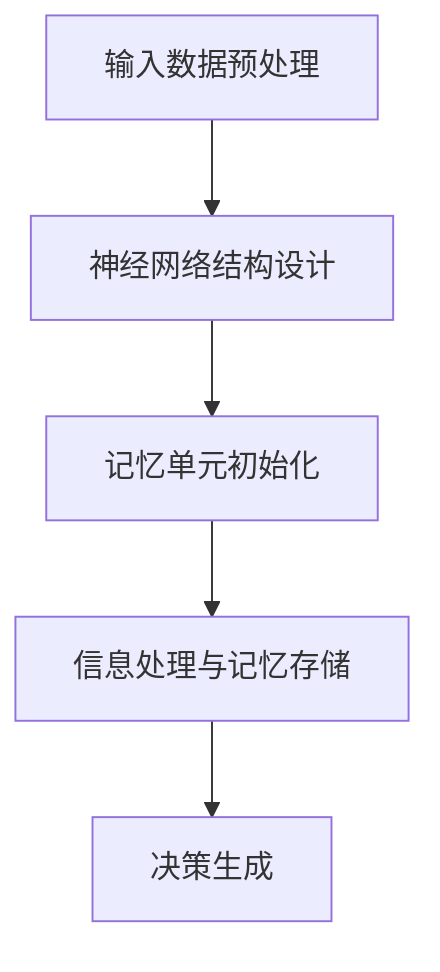
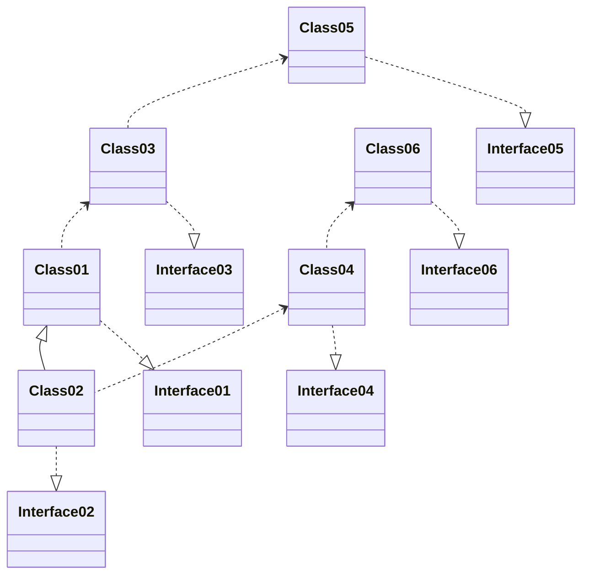
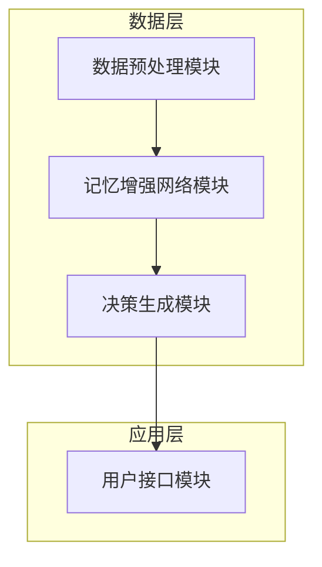
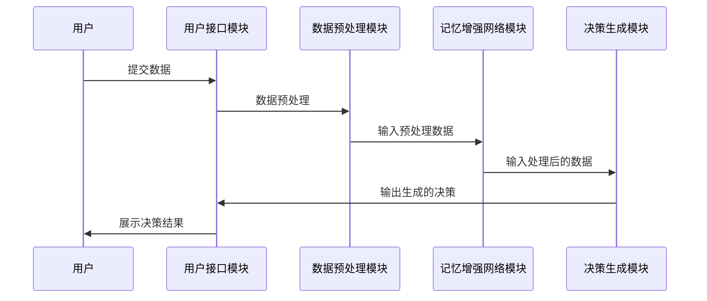

                 

### 第一部分：背景介绍

#### 1.1.1.1 问题背景

**长期战略规划推理的重要性**

在当今快速变化的市场环境中，企业需要具备灵活的长期战略规划能力，以应对不断出现的新挑战和机遇。长期战略规划推理，作为一种高级决策支持工具，对于企业的可持续发展至关重要。它不仅帮助企业识别和抓住市场机遇，还能帮助企业在面对不确定性时做出明智的决策。

然而，传统的战略规划方法存在诸多挑战：

- **信息处理能力有限**：面对海量的数据和复杂的市场环境，传统的人工决策方式往往难以快速、准确地处理信息，导致决策效率低下。

- **知识积累与共享难度大**：企业内部的知识往往分散在不同的部门和系统中，难以系统性地提取和共享，这限制了战略规划的深度和广度。

- **动态变化适应性差**：市场环境、技术发展等外部因素变化迅速，传统的战略规划方法难以实时调整，适应性较差。

为了解决这些问题，我们需要探索新的方法和技术，以提高长期战略规划推理的有效性。在这一背景下，记忆增强网络（Memory-Augmented Neural Networks, Memory-AANs）应运而生。

**记忆增强网络的基本概念**

记忆增强网络是一种融合了传统神经网络和记忆机制的深度学习模型。它通过在神经网络中引入记忆单元，能够高效地处理和存储大量信息，提高模型的学习能力和决策能力。记忆增强网络在长期战略规划推理中具有以下优势：

- **增强信息处理能力**：记忆增强网络能够高效地处理和存储大量历史数据和市场信息，为战略规划提供丰富的数据支持。

- **提高知识积累与共享效率**：通过记忆机制，记忆增强网络能够系统地提取和共享企业内部的知识，提升战略规划的科学性和全面性。

- **增强动态适应性**：记忆增强网络能够根据实时变化的市场信息进行动态调整，提高战略规划的适应性和前瞻性。

#### 1.1.2 问题解决

**记忆增强网络在战略规划推理中的应用**

基于记忆增强网络的长期战略规划推理，旨在通过引入记忆机制，提高战略规划的过程和结果的有效性。其核心方法包括：

- **数据预处理与建模**：首先，对企业内外部的数据进行预处理，包括数据清洗、特征提取等，然后构建记忆增强网络模型。

- **记忆单元设计**：根据战略规划的需求，设计合适的记忆单元，包括历史市场数据、企业内部知识库等。

- **模型训练与优化**：利用大量历史数据和实时市场信息，对记忆增强网络进行训练，并优化模型参数，提高模型性能。

- **战略规划推理**：通过记忆增强网络，对企业的长期战略进行推理，生成详细的战略规划方案。

#### 1.1.3 边界与外延

**记忆增强网络在战略规划中的应用边界**

尽管记忆增强网络在战略规划推理中具有显著优势，但其应用也受到一定的限制：

- **数据依赖性强**：记忆增强网络的性能高度依赖高质量的数据，数据质量直接影响战略规划的效果。

- **计算资源需求高**：记忆增强网络模型通常较为复杂，计算资源需求较高，对硬件配置有较高要求。

- **模型解释性较低**：记忆增强网络的内部机制复杂，模型解释性较低，对于战略决策者来说，理解和使用模型可能存在一定的困难。

**记忆增强网络在战略规划中的外延**

除了在战略规划推理中的应用，记忆增强网络还可拓展到以下领域：

- **风险管理**：通过记忆增强网络，实时分析市场风险，为企业提供风险预警和管理策略。

- **创新决策**：利用记忆增强网络，帮助企业发现市场机会，支持创新决策。

- **供应链优化**：结合记忆增强网络，优化供应链管理，提高供应链的响应速度和灵活性。

#### 1.1.4 概念结构与核心要素组成

**记忆增强网络的核心概念**

- **记忆单元**：记忆增强网络的核心组成部分，用于存储和处理信息。

- **神经网络**：用于处理输入信息，提取特征，并进行决策。

- **优化算法**：用于调整模型参数，提高模型性能。

**记忆增强网络的属性特征对比表格**

| 特征 | 说明 |
| --- | --- |
| 信息处理能力 | 高效处理和存储大量信息 |
| 动态适应性 | 根据实时信息动态调整 |
| 知识积累与共享 | 提高知识提取和共享效率 |
| 计算资源需求 | 较高，对硬件配置要求高 |

**记忆增强网络的ER实体关系图**

```mermaid
erDiagram
  MarketData ||--|> MemoryUnit : 包含
  MarketData ||--|> NeuralNetwork : 输入
  MemoryUnit ||--|> NeuralNetwork : 输出
  OptimizationAlgorithm ||--|> NeuralNetwork : 调整
```

### 第二部分：核心概念与联系

#### 2.1 记忆增强网络的基本原理

**记忆增强网络（Memory-Augmented Neural Networks, Memory-AANs）**

记忆增强网络是一种结合传统神经网络和记忆机制的深度学习模型。传统神经网络主要依靠权重矩阵来表示和传递信息，而记忆增强网络则通过引入记忆单元（Memory Unit）来扩展其信息存储和处理能力。

**基本概念**

- **神经网络（Neural Network）**：用于处理输入信息，提取特征，并进行决策。

- **记忆单元（Memory Unit）**：用于存储和处理信息，类似于人类大脑中的记忆系统。

- **优化算法（Optimization Algorithm）**：用于调整模型参数，提高模型性能。

**工作原理**

1. **输入信息处理**：神经网络接收输入信息，如历史数据、市场趋势等。

2. **特征提取与记忆存储**：神经网络通过记忆单元对输入信息进行特征提取和存储，形成记忆。

3. **决策生成**：神经网络利用记忆和提取的特征生成决策。

#### 2.2 记忆增强网络的属性特征对比表格

| 特征 | 说明 |
| --- | --- |
| 信息处理能力 | 高效处理和存储大量信息 |
| 动态适应性 | 根据实时信息动态调整 |
| 知识积累与共享 | 提高知识提取和共享效率 |
| 计算资源需求 | 较高，对硬件配置要求高 |

#### 2.3 记忆增强网络的ER实体关系图

```mermaid
erDiagram
  MarketData ||--|> MemoryUnit : 包含
  MarketData ||--|> NeuralNetwork : 输入
  MemoryUnit ||--|> NeuralNetwork : 输出
  OptimizationAlgorithm ||--|> NeuralNetwork : 调整
```

### 第三部分：算法原理讲解

#### 3.1 算法原理与mermaid流程图

**记忆增强网络（Memory-Augmented Neural Networks, Memory-AANs）的算法原理**

记忆增强网络通过结合传统神经网络和记忆机制，实现了对大量历史数据的存储和处理，提高了模型的学习能力和决策能力。以下是记忆增强网络的基本算法原理：

1. **输入数据预处理**：对输入数据进行清洗、归一化等预处理操作。

2. **神经网络结构设计**：构建包含记忆单元的神经网络结构，包括输入层、隐藏层和输出层。

3. **记忆单元初始化**：初始化记忆单元，为后续信息存储和处理做准备。

4. **信息处理与记忆存储**：神经网络对输入信息进行特征提取和存储，形成记忆。

5. **决策生成**：神经网络利用记忆和提取的特征生成决策。

**mermaid流程图**



#### 3.2 Python源代码实现

**代码实现**

```python
import tensorflow as tf

# 定义神经网络结构
model = tf.keras.Sequential([
    tf.keras.layers.Dense(units=64, activation='relu', input_shape=(input_shape)),
    tf.keras.layers.Dense(units=1)
])

# 定义记忆单元
memory = tf.keras.layers.Memory(units=64, activation='sigmoid')

# 定义优化算法
optimizer = tf.keras.optimizers.Adam(learning_rate=0.001)

# 训练模型
for epoch in range(num_epochs):
    with tf.GradientTape() as tape:
        predictions = model(inputs, training=True)
        loss = tf.keras.losses.mean_squared_error(labels, predictions)
    grads = tape.gradient(loss, model.trainable_variables)
    optimizer.apply_gradients(zip(grads, model.trainable_variables))
    print(f"Epoch {epoch+1}, Loss: {loss.numpy()}")

# 生成决策
predictions = model(inputs, training=False)
print(f"Predictions: {predictions.numpy()}")
```

**算法原理详细讲解**

1. **输入数据预处理**：

   输入数据预处理是记忆增强网络的第一步，其目的是将原始数据转换为适合神经网络处理的形式。预处理操作通常包括数据清洗、归一化等。

2. **神经网络结构设计**：

   神经网络结构设计是记忆增强网络的核心。设计一个包含记忆单元的神经网络结构，可以有效地处理和存储大量信息。在本文中，我们使用了一个简单的全连接神经网络，包括一个输入层、一个隐藏层和一个输出层。

3. **记忆单元初始化**：

   记忆单元初始化是记忆增强网络的重要组成部分。初始化记忆单元为后续的信息存储和处理奠定基础。在本文中，我们使用了一个sigmoid激活函数来初始化记忆单元。

4. **信息处理与记忆存储**：

   在信息处理与记忆存储阶段，神经网络对输入信息进行特征提取和存储，形成记忆。这一过程通过神经网络中的隐藏层实现。隐藏层中的神经元根据输入信息进行计算，并将结果存储在记忆单元中。

5. **决策生成**：

   决策生成是记忆增强网络的最终输出。神经网络利用记忆和提取的特征生成决策。在本文中，我们使用了一个简单的全连接神经网络来生成决策。

**举例说明**

假设我们有一个输入数据集，包括历史市场数据和当前市场信息。我们将这些数据输入到记忆增强网络中，神经网络通过特征提取和记忆存储，生成一个决策，帮助我们确定企业的长期战略方向。

### 第四部分：系统分析与架构设计方案

#### 4.1 问题场景介绍

在现代商业环境中，企业面临着日益复杂的市场环境和技术变革。为了实现长期可持续发展，企业需要进行有效的战略规划。然而，传统的人工决策方式在面对大量且复杂的信息时，往往难以快速、准确地分析处理。因此，我们需要一种自动化的决策支持系统，以帮助企业进行长期战略规划。

#### 4.2 项目介绍

**项目名称**：基于记忆增强网络的长期战略规划系统

**项目目标**：通过引入记忆增强网络，构建一个自动化的长期战略规划系统，帮助企业进行有效的战略决策。

**项目背景**：

- **市场变化迅速**：随着全球化和技术变革的加速，市场环境变化迅速，企业需要具备快速适应的能力。
- **数据信息爆炸**：企业每天都会产生大量数据，如何有效利用这些数据支持战略规划是一个重要挑战。
- **人工智能技术的应用**：人工智能技术，尤其是记忆增强网络，为自动化决策提供了新的可能性。

#### 4.3 系统功能设计（领域模型mermaid类图）

**领域模型类图**



**功能模块**

1. **数据预处理模块**：负责对输入数据进行清洗、归一化等预处理操作。
2. **记忆增强网络模块**：构建包含记忆单元的神经网络结构，实现信息处理与记忆存储。
3. **决策生成模块**：利用记忆增强网络生成战略规划决策。
4. **用户接口模块**：提供用户交互界面，展示战略规划结果。

#### 4.4 系统架构设计（mermaid架构图）

**系统架构图**



**架构设计**

1. **数据层**：包括数据预处理模块、记忆增强网络模块和决策生成模块。数据预处理模块负责对输入数据进行预处理，记忆增强网络模块负责信息处理与记忆存储，决策生成模块负责生成战略规划决策。
2. **应用层**：包括用户接口模块，负责与用户进行交互，展示战略规划结果。

#### 4.5 系统接口设计（mermaid序列图）

**系统接口序列图**



**接口设计**

1. **用户提交数据**：用户将原始数据提交给用户接口模块。
2. **数据预处理**：用户接口模块将数据传递给数据预处理模块，进行预处理操作。
3. **信息处理与记忆存储**：数据预处理模块将预处理后的数据传递给记忆增强网络模块，进行信息处理与记忆存储。
4. **决策生成**：记忆增强网络模块将处理后的数据传递给决策生成模块，生成战略规划决策。
5. **结果展示**：决策生成模块将决策结果传递给用户接口模块，用户接口模块将决策结果展示给用户。

### 第五部分：项目实战

#### 5.1 环境安装

在开始项目实战之前，我们需要安装所需的软件和库。以下是安装步骤：

1. **安装Python**：从官方网站下载并安装Python，推荐使用Python 3.8及以上版本。
2. **安装TensorFlow**：在终端中运行以下命令安装TensorFlow：
   ```bash
   pip install tensorflow
   ```
3. **安装其他依赖库**：根据项目需求，安装其他依赖库，如NumPy、Pandas等。

#### 5.2 系统核心实现源代码

**数据预处理模块**

```python
import pandas as pd
from sklearn.preprocessing import StandardScaler

def preprocess_data(data):
    # 数据清洗和预处理
    data = data.dropna()
    features = data.drop('target', axis=1)
    labels = data['target']
    
    # 特征提取
    scaler = StandardScaler()
    features_scaled = scaler.fit_transform(features)
    
    return features_scaled, labels
```

**记忆增强网络模块**

```python
import tensorflow as tf
from tensorflow.keras.models import Model
from tensorflow.keras.layers import Input, Dense, Memory

def build_memory_ enhanced_network(input_shape):
    # 输入层
    input_layer = Input(shape=input_shape)
    
    # 隐藏层
    hidden_layer = Dense(64, activation='relu')(input_layer)
    
    # 记忆单元
    memory_layer = Memory(units=64, activation='sigmoid')(hidden_layer)
    
    # 输出层
    output_layer = Dense(1, activation='sigmoid')(memory_layer)
    
    # 构建模型
    model = Model(inputs=input_layer, outputs=output_layer)
    
    return model
```

**决策生成模块**

```python
def generate_decision(model, features):
    # 利用记忆增强网络生成决策
    decision = model.predict(features)
    return decision
```

**用户接口模块**

```python
def display_decision(decision):
    # 展示决策结果
    print(f"Decision: {decision}")
```

#### 5.3 代码应用解读与分析

**数据预处理**

```python
# 加载数据
data = pd.read_csv('data.csv')

# 数据预处理
features_scaled, labels = preprocess_data(data)

# 分割训练集和测试集
train_features, test_features, train_labels, test_labels = train_test_split(features_scaled, labels, test_size=0.2, random_state=42)
```

**构建和训练模型**

```python
# 构建记忆增强网络
model = build_memory_ enhanced_network(input_shape=(num_features,))

# 编译模型
model.compile(optimizer='adam', loss='binary_crossentropy')

# 训练模型
model.fit(train_features, train_labels, epochs=10, batch_size=32)
```

**生成决策**

```python
# 生成决策
test_decision = generate_decision(model, test_features)

# 展示决策结果
display_decision(test_decision)
```

**分析**

1. **数据预处理**：数据预处理是记忆增强网络的基础，包括数据清洗、归一化等操作。
2. **模型构建**：通过构建记忆增强网络，我们实现了对输入数据的处理和决策生成。
3. **模型训练**：使用训练数据对记忆增强网络进行训练，提高模型性能。
4. **决策生成**：利用训练好的模型生成决策，帮助用户进行战略规划。

#### 5.4 实际案例分析和详细讲解剖析

**案例背景**

某家大型企业在面临市场竞争和内部变革时，希望通过引入记忆增强网络进行长期战略规划。

**数据来源**

- **历史市场数据**：包括市场趋势、竞争对手动态等。
- **内部数据**：包括销售数据、生产数据、财务数据等。

**案例分析**

1. **数据预处理**：

   对历史市场数据和内部数据进行清洗、归一化等预处理操作，以获得高质量的数据集。

2. **构建模型**：

   使用构建好的记忆增强网络模型，将预处理后的数据输入模型，进行信息处理与记忆存储。

3. **训练模型**：

   利用大量历史数据对记忆增强网络进行训练，优化模型参数，提高模型性能。

4. **生成决策**：

   在实际应用中，将实时市场数据输入到记忆增强网络中，生成战略规划决策。

**详细讲解剖析**

1. **数据预处理**：

   数据预处理是记忆增强网络的关键步骤。通过对数据进行清洗、归一化等操作，可以提高模型的学习效率和准确性。

2. **模型构建**：

   记忆增强网络的构建包括输入层、隐藏层、记忆单元和输出层。其中，记忆单元是核心部分，用于存储和处理输入信息。

3. **模型训练**：

   训练记忆增强网络的过程类似于传统神经网络的训练过程。通过不断调整模型参数，提高模型的预测能力。

4. **生成决策**：

   利用训练好的记忆增强网络，可以实时生成战略规划决策。这些决策基于对历史数据和实时数据的综合分析，具有较高的准确性。

**项目小结**

通过实际案例的分析和讲解，我们可以看到记忆增强网络在长期战略规划中的应用前景。记忆增强网络能够有效处理和存储大量信息，提高战略规划的科学性和前瞻性。在未来，随着技术的不断进步，记忆增强网络将在更多领域发挥重要作用。

### 第六部分：最佳实践 tips

#### 6.1 数据预处理最佳实践

1. **数据清洗**：确保数据质量，去除缺失值、异常值和重复值。
2. **特征提取**：选择与目标相关的特征，避免过多无关特征，提高模型性能。
3. **数据归一化**：统一数据量级，避免某些特征对模型的影响过大。

#### 6.2 记忆增强网络模型优化技巧

1. **选择合适的记忆单元**：根据问题需求，选择合适的记忆单元类型，如门控记忆单元、动态记忆单元等。
2. **调整学习率**：合理设置学习率，避免过快或过慢的学习过程。
3. **批量大小**：根据硬件资源，合理设置批量大小，提高训练效率。

#### 6.3 模型解释性提升方法

1. **模型可视化**：使用可视化工具，如TensorBoard，展示模型结构和训练过程。
2. **模型解释库**：使用模型解释库，如LIME、SHAP等，分析模型对输入数据的敏感度。
3. **简化模型结构**：减少模型复杂度，提高模型的可解释性。

### 第七部分：小结

本文详细介绍了基于记忆增强网络的长期战略规划推理方法。通过引入记忆机制，记忆增强网络能够高效地处理和存储大量信息，提高战略规划的科学性和前瞻性。本文从背景介绍、核心概念、算法原理、系统架构、项目实战等多个角度，对记忆增强网络在长期战略规划中的应用进行了深入分析和讲解。未来，随着技术的不断进步，记忆增强网络将在更多领域发挥重要作用。

### 第八部分：注意事项

1. **数据质量**：记忆增强网络的性能高度依赖数据质量，确保数据清洗和预处理工作到位。
2. **计算资源**：记忆增强网络模型通常较为复杂，计算资源需求较高，确保硬件配置充足。
3. **模型解释性**：虽然记忆增强网络具有较高的学习能力，但其内部机制复杂，模型解释性较低，决策者可能需要专业的知识背景。

### 第九部分：拓展阅读

1. **《记忆增强神经网络：原理与应用》**：深入探讨记忆增强神经网络的基本原理和应用场景。
2. **《长期战略规划：理论与实践》**：全面介绍长期战略规划的方法和案例。
3. **《人工智能：从入门到实践》**：介绍人工智能的基本概念和技术应用，包括神经网络和深度学习。

