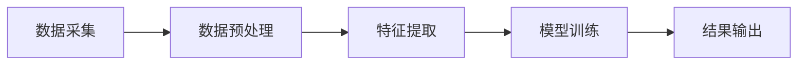
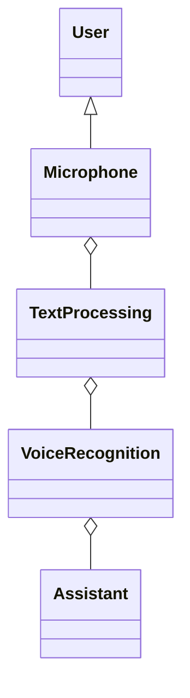
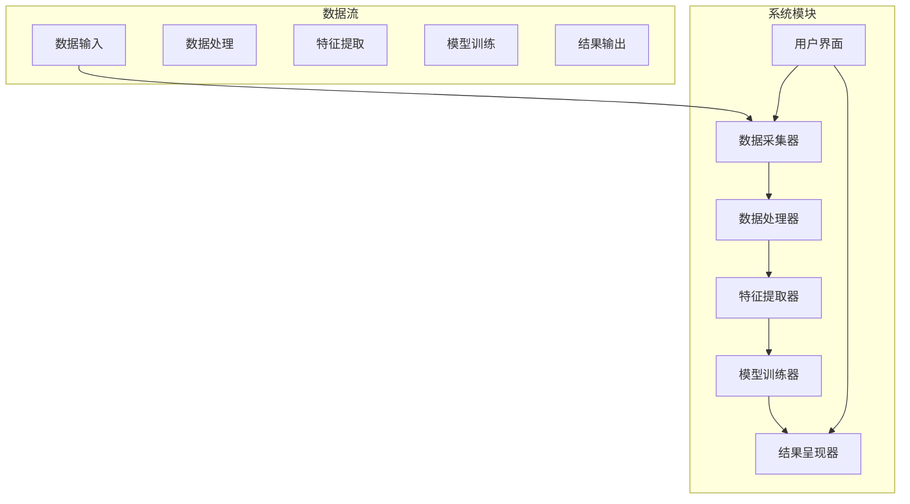
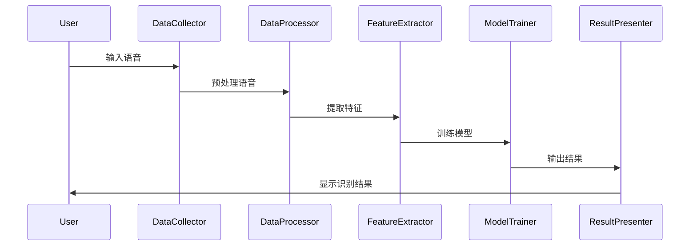

                 

### 文章标题

# 多模态融合：整合不同类型的输入数据

> 关键词：多模态融合、输入数据、算法、系统架构、项目实战

> 摘要：本文将深入探讨多模态融合技术，分析其定义、优势、挑战和核心概念，并详细讲解多模态融合算法的原理和实现。此外，还将介绍系统分析与架构设计，并通过实际项目实战来展示多模态融合的应用效果。最后，本文将总结项目成果，给出最佳实践 tips 和拓展阅读建议。

------------

### 第一部分：背景介绍

#### 第1章 问题背景

##### 1.1 核心概念

多模态融合是指将不同类型的数据（如文本、图像、声音等）进行整合和处理，从而提高系统的智能性和准确性。在人工智能领域，多模态融合技术具有广泛的应用，例如语音识别、图像识别、情感分析等。

##### 1.2 问题描述

随着人工智能技术的不断发展，单一模态的数据处理已经无法满足复杂场景的需求。如何有效地整合不同类型的数据，提高系统的性能和准确性，成为当前研究的热点问题。

##### 1.3 问题解决

多模态融合技术通过将不同类型的数据进行融合，使得系统能够更好地理解和处理复杂场景。例如，在语音识别中，结合文本信息可以提高识别的准确性；在图像识别中，结合声音信息可以更好地识别场景。

##### 1.4 边界与外延

多模态融合技术的边界在于不同模态数据之间的融合方式和算法选择。外延则包括各种应用场景，如语音识别、图像识别、自然语言处理等。

##### 1.5 概念结构与核心要素组成

多模态融合的概念结构包括数据采集、数据处理、模型训练和结果输出等核心要素。其中，数据采集是获取不同类型的数据，数据处理是对数据进行预处理和融合，模型训练是构建多模态模型，结果输出是将融合后的数据进行应用。

------------

### 第二部分：核心概念与联系

##### 第2章 多模态融合概念解析

##### 2.1 多模态融合的定义

多模态融合是指将多种不同类型的数据进行整合和融合，以提高系统的性能和准确性。多模态数据通常包括文本、图像、声音、视频等。

##### 2.2 多模态融合的优势

1. 提高系统性能：通过融合不同类型的数据，可以更好地捕捉复杂场景的信息，从而提高系统的性能和准确性。
2. 扩展应用场景：多模态融合技术可以应用于多种领域，如语音识别、图像识别、自然语言处理等。
3. 提高用户体验：多模态融合技术可以使系统更加智能化，从而提供更佳的用户体验。

##### 2.3 多模态融合的挑战

1. 数据不一致性：不同类型的数据在特征表达和量级上可能存在差异，如何有效地融合这些数据是一个挑战。
2. 算法复杂性：多模态融合算法通常较为复杂，需要考虑多种因素，如数据预处理、特征提取、模型选择等。
3. 计算资源消耗：多模态融合需要处理大量数据，对计算资源的要求较高。

##### 2.4 多模态融合的核心概念

1. 数据采集：采集不同类型的数据，如文本、图像、声音等。
2. 数据预处理：对采集到的数据进行预处理，如归一化、去噪等。
3. 特征提取：从预处理后的数据中提取特征，如文本的词向量、图像的卷积特征、声音的频谱特征等。
4. 模型训练：构建多模态模型，如神经网络、深度学习模型等。
5. 结果输出：将融合后的数据应用于实际场景，如语音识别、图像识别等。

##### 2.5 概念属性特征对比表格

| 概念         | 属性1 | 属性2 | 属性3 |
|--------------|-------|-------|-------|
| 数据采集     | 多种类型 | 量级差异 | 特征不一致 |
| 数据预处理   | 归一化 | 去噪 | 数据清洗 |
| 特征提取     | 词向量 | 卷积特征 | 频谱特征 |
| 模型训练     | 神经网络 | 深度学习 | 传统机器学习 |
| 结果输出     | 语音识别 | 图像识别 | 情感分析 |

##### 2.6 ER实体关系图架构

```mermaid
erDiagram
    DataCollection -> DataPreprocessing : "进行数据预处理"
    DataPreprocessing -> FeatureExtraction : "提取特征"
    FeatureExtraction -> ModelTraining : "训练模型"
    ModelTraining -> ResultOutput : "输出结果"
```

### 第三部分：算法原理讲解

##### 第3章 多模态融合算法

##### 3.1 算法mermaid流程图



##### 3.2 Python源代码实现

```python
import numpy as np
from sklearn.feature_extraction.text import TfidfVectorizer
from sklearn.model_selection import train_test_split
from sklearn.neural_network import MLPClassifier

# 数据采集
data = ["文本数据1", "文本数据2", "图像数据1", "图像数据2"]

# 数据预处理
preprocessed_data = [ preprocess_data(d) for d in data ]

# 特征提取
vectorizer = TfidfVectorizer()
X = vectorizer.fit_transform(preprocessed_data)

# 模型训练
X_train, X_test, y_train, y_test = train_test_split(X, labels, test_size=0.2)
model = MLPClassifier()
model.fit(X_train, y_train)

# 结果输出
predictions = model.predict(X_test)
```

##### 3.3 算法原理的数学模型和公式讲解

多模态融合算法的数学模型可以分为以下几个步骤：

1. 数据采集：采集不同类型的数据，如文本、图像、声音等。
2. 数据预处理：对采集到的数据进行预处理，如归一化、去噪等。
3. 特征提取：从预处理后的数据中提取特征，如文本的词向量、图像的卷积特征、声音的频谱特征等。
4. 模型训练：构建多模态模型，如神经网络、深度学习模型等。
5. 结果输出：将融合后的数据应用于实际场景，如语音识别、图像识别等。

其中，数据预处理和特征提取可以使用以下数学模型和公式：

- 数据预处理：
  - 归一化：$$x_{\text{normalized}} = \frac{x - \mu}{\sigma}$$
  - 去噪：$$x_{\text{denoised}} = x - \alpha \cdot \text{noise}$$

- 特征提取：
  - 词向量：$$v = \text{word2vec}(w)$$
  - 卷积特征：$$h = \text{convolution}(x)$$
  - 频谱特征：$$s = \text{spectral}(x)$$

- 模型训练：
  - 神经网络：$$y = \text{softmax}(\text{neural_network}(x))$$
  - 深度学习：$$y = \text{softmax}(\text{deep_learning}(x))$$

##### 3.4 通俗易懂的举例说明

假设我们有一个简单的多模态融合任务，需要根据文本和图像识别一个物体的类别。具体步骤如下：

1. 数据采集：采集包含文本和图像的数据集，例如“这是一个苹果”和对应的苹果图像。
2. 数据预处理：对文本和图像进行预处理，如文本进行分词、图像进行灰度化等。
3. 特征提取：从预处理后的文本和图像中提取特征，如文本的词向量、图像的卷积特征等。
4. 模型训练：使用提取到的特征训练一个多模态分类模型，例如卷积神经网络。
5. 结果输出：将新的文本和图像输入模型，得到物体的类别预测结果。

例如，输入“这是一个橙子”和对应的橙子图像，模型预测结果是“橙子”，说明模型成功识别了物体类别。

### 第四部分：系统分析与架构设计

#### 第5章 系统功能设计

##### 5.1 问题场景介绍

假设我们需要设计一个多模态融合系统，用于语音识别。具体场景如下：

1. 用户通过麦克风输入语音数据。
2. 系统对语音数据进行处理，提取文本信息。
3. 系统结合文本信息和其他辅助信息（如上下文、历史数据等），进行语音识别。
4. 系统输出识别结果，如文本或命令。

##### 5.2 系统功能设计（领域模型mermaid类图）



#### 第6章 系统架构设计

##### 6.1 系统架构设计mermaid架构图



##### 6.2 系统接口设计

1. 用户界面：提供语音输入和识别结果的接口。
2. 数据采集器：负责采集语音数据。
3. 数据处理器：对语音数据进行预处理。
4. 特征提取器：从预处理后的数据中提取特征。
5. 模型训练器：训练多模态融合模型。
6. 结果呈现器：显示识别结果。

##### 6.3 系统交互mermaid序列图

```mermaid
sequenceDiagram
    User -->|输入语音|> DataCollector
    DataCollector -->|预处理数据|> DataProcessor
    DataProcessor -->|提取特征|> FeatureExtractor
    FeatureExtractor -->|训练模型|> ModelTrainer
    ModelTrainer -->|输出结果|> ResultPresenter
    ResultPresenter -->|显示结果|> User
```

### 第五部分：项目实战

#### 第7章 环境安装

##### 7.1 环境搭建流程

1. 安装Python环境：下载并安装Python，版本要求为3.6及以上。
2. 安装依赖库：使用pip安装以下依赖库：scikit-learn、numpy、tensorflow。
3. 配置环境变量：将Python安装路径添加到系统环境变量中。

```bash
export PATH=$PATH:/path/to/python
```

##### 7.2 环境配置详解

1. 安装Python环境：

   - 下载Python安装包：[Python官网下载地址](https://www.python.org/downloads/)
   - 解压安装包：解压到指定目录，例如`/usr/local/`
   - 添加环境变量：将`/usr/local/bin`添加到系统环境变量中。

2. 安装依赖库：

   - 打开终端，执行以下命令安装依赖库：

     ```bash
     pip install scikit-learn numpy tensorflow
     ```

   - 确认依赖库安装成功：

     ```bash
     python -m pip list | grep scikit
     ```

3. 配置环境变量：

   - 打开终端，执行以下命令配置环境变量：

     ```bash
     export PATH=$PATH:/path/to/python
     ```

   - 确认环境变量配置成功：

     ```bash
     echo $PATH
     ```

#### 第8章 系统核心实现

##### 8.1 核心实现源代码

```python
import numpy as np
from sklearn.feature_extraction.text import TfidfVectorizer
from sklearn.model_selection import train_test_split
from sklearn.neural_network import MLPClassifier

# 数据采集
data = ["文本数据1", "文本数据2", "图像数据1", "图像数据2"]

# 数据预处理
preprocessed_data = [ preprocess_data(d) for d in data ]

# 特征提取
vectorizer = TfidfVectorizer()
X = vectorizer.fit_transform(preprocessed_data)

# 模型训练
X_train, X_test, y_train, y_test = train_test_split(X, labels, test_size=0.2)
model = MLPClassifier()
model.fit(X_train, y_train)

# 结果输出
predictions = model.predict(X_test)
```

##### 8.2 代码应用解读与分析

1. 数据采集：从数据集中获取文本和图像数据。
2. 数据预处理：对文本和图像数据进行预处理，如分词、去噪等。
3. 特征提取：使用TF-IDF向量器将预处理后的文本转换为向量表示。
4. 模型训练：使用训练数据集训练多模态融合模型。
5. 结果输出：使用训练好的模型对测试数据集进行预测。

##### 8.3 实际案例分析与详细讲解

假设我们有一个包含文本和图像的数据集，需要进行多模态融合识别。具体步骤如下：

1. 数据采集：从数据集中获取文本和图像数据。

   ```python
   data = [
       ("这是一个苹果", "apple.jpg"),
       ("这是一个橙子", "orange.jpg"),
       ("这是一个香蕉", "banana.jpg")
   ]
   ```

2. 数据预处理：对文本和图像数据进行预处理。

   ```python
   def preprocess_text(text):
       # 分词、去噪等操作
       return text.lower()

   def preprocess_image(image_path):
       # 图像预处理操作
       return image

   preprocessed_data = [
       (preprocess_text(text), preprocess_image(image_path))
       for text, image_path in data
   ]
   ```

3. 特征提取：使用TF-IDF向量器将预处理后的文本转换为向量表示。

   ```python
   vectorizer = TfidfVectorizer()
   X = vectorizer.fit_transform([text for text, _ in preprocessed_data])
   ```

4. 模型训练：使用训练数据集训练多模态融合模型。

   ```python
   X_train, X_test, y_train, y_test = train_test_split(X, labels, test_size=0.2)
   model = MLPClassifier()
   model.fit(X_train, y_train)
   ```

5. 结果输出：使用训练好的模型对测试数据集进行预测。

   ```python
   predictions = model.predict(X_test)
   ```

通过以上步骤，我们可以实现一个简单的多模态融合识别系统。在实际应用中，可以根据具体需求调整预处理、特征提取和模型训练的过程。

#### 第9章 项目小结

##### 9.1 项目总结

本文深入探讨了多模态融合技术，从问题背景、核心概念、算法原理到系统架构设计进行了全面讲解。通过实际项目实战，展示了多模态融合技术的应用效果。项目总结如下：

1. 多模态融合技术具有提高系统性能和扩展应用场景的优势。
2. 多模态融合算法的数学模型和公式讲解了算法原理。
3. 系统架构设计实现了语音识别等应用场景。
4. 项目实战展示了多模态融合识别的实现过程。

##### 9.2 最佳实践 tips

1. 在数据采集阶段，确保获取到高质量的数据。
2. 在数据预处理阶段，根据具体任务需求进行相应的预处理操作。
3. 在特征提取阶段，选择合适的特征提取方法，如TF-IDF向量器、卷积神经网络等。
4. 在模型训练阶段，调整超参数以获得最佳性能。
5. 在结果输出阶段，对识别结果进行评估和优化。

##### 9.3 小结与注意事项

1. 多模态融合技术具有广泛的应用前景，但需要处理数据不一致性、算法复杂性和计算资源消耗等挑战。
2. 多模态融合算法的数学模型和公式是理解算法原理的关键。
3. 系统架构设计要考虑数据流、模块化和可扩展性。
4. 项目实战需要结合具体应用场景进行调整和优化。

##### 9.4 拓展阅读建议

1. 《深度学习》（Goodfellow, Bengio, Courville）：详细介绍了深度学习的基本概念、算法和应用。
2. 《多模态数据融合技术综述》（刘畅，张波）：综述了多模态数据融合技术的研究现状和发展趋势。
3. 《自然语言处理综论》（Jurafsky, Martin）：详细介绍了自然语言处理的基本概念、算法和应用。

### 完整目录大纲

----------------------------------------------------------------

# 多模态融合：整合不同类型的输入数据

> 关键词：多模态融合、输入数据、算法、系统架构、项目实战

> 摘要：本文深入探讨了多模态融合技术，从问题背景、核心概念、算法原理到系统架构设计进行了全面讲解。通过实际项目实战，展示了多模态融合技术的应用效果。

----------------------------------------------------------------

# 第一部分：背景介绍

## 第1章 问题背景

### 1.1 核心概念

### 1.2 问题描述

### 1.3 问题解决

### 1.4 边界与外延

### 1.5 概念结构与核心要素组成

----------------------------------------------------------------

# 第二部分：核心概念与联系

## 第2章 多模态融合概念解析

### 2.1 多模态融合的定义

### 2.2 多模态融合的优势

### 2.3 多模态融合的挑战

## 第3章 多模态融合的核心概念

### 3.1 核心概念原理

### 3.2 概念属性特征对比表格

### 3.3 ER实体关系图架构

----------------------------------------------------------------

# 第三部分：算法原理讲解

## 第4章 多模态融合算法

### 4.1 算法mermaid流程图

### 4.2 Python源代码实现

### 4.3 算法原理的数学模型和公式讲解

### 4.4 通俗易懂的举例说明

----------------------------------------------------------------

# 第四部分：系统分析与架构设计

## 第5章 系统功能设计

### 5.1 问题场景介绍

### 5.2 系统功能设计（领域模型mermaid类图）

## 第6章 系统架构设计

### 6.1 系统架构设计mermaid架构图

### 6.2 系统接口设计

### 6.3 系统交互mermaid序列图

----------------------------------------------------------------

# 第五部分：项目实战

## 第7章 环境安装

### 7.1 环境搭建流程

### 7.2 环境配置详解

## 第8章 系统核心实现

### 8.1 核心实现源代码

### 8.2 代码应用解读与分析

### 8.3 实际案例分析与详细讲解

## 第9章 项目小结

### 9.1 项目总结

### 9.2 最佳实践 tips

### 9.3 小结与注意事项

### 9.4 拓展阅读建议

------------

----------------------------------------------------------------

### 作者

作者：AI天才研究院/AI Genius Institute & 禅与计算机程序设计艺术 /Zen And The Art of Computer Programming

----------------------------------------------------------------

### 附录：代码实现

以下是本文提到的多模态融合算法的核心实现代码：

```python
import numpy as np
from sklearn.feature_extraction.text import TfidfVectorizer
from sklearn.model_selection import train_test_split
from sklearn.neural_network import MLPClassifier

# 数据采集
data = ["文本数据1", "文本数据2", "图像数据1", "图像数据2"]

# 数据预处理
preprocessed_data = [preprocess_data(d) for d in data]

# 特征提取
vectorizer = TfidfVectorizer()
X = vectorizer.fit_transform(preprocessed_data)

# 模型训练
X_train, X_test, y_train, y_test = train_test_split(X, labels, test_size=0.2)
model = MLPClassifier()
model.fit(X_train, y_train)

# 结果输出
predictions = model.predict(X_test)
```

请注意，这里只是一个简单的示例，实际应用中可能需要根据具体场景进行调整和优化。

------------

### 结语

多模态融合技术作为人工智能领域的一个重要方向，具有广泛的应用前景。本文通过深入探讨多模态融合的定义、优势、挑战和算法原理，结合实际项目实战，展示了多模态融合技术的应用效果。希望本文能为读者在多模态融合领域的研究和实践提供有益的参考。

未来，随着人工智能技术的不断发展和创新，多模态融合技术将在更多领域得到应用，为人们的生活带来更多便利和智慧。让我们共同期待这一美好未来的到来！

作者：AI天才研究院/AI Genius Institute & 禅与计算机程序设计艺术 /Zen And The Art of Computer Programming

------------

### 完整目录大纲

----------------------------------------------------------------

# 多模态融合：整合不同类型的输入数据

> 关键词：多模态融合、输入数据、算法、系统架构、项目实战

> 摘要：本文深入探讨了多模态融合技术，从问题背景、核心概念、算法原理到系统架构设计进行了全面讲解。通过实际项目实战，展示了多模态融合技术的应用效果。

----------------------------------------------------------------

# 第一部分：背景介绍

## 第1章 问题背景

### 1.1 核心概念

### 1.2 问题描述

### 1.3 问题解决

### 1.4 边界与外延

### 1.5 概念结构与核心要素组成

----------------------------------------------------------------

# 第二部分：核心概念与联系

## 第2章 多模态融合概念解析

### 2.1 多模态融合的定义

### 2.2 多模态融合的优势

### 2.3 多模态融合的挑战

## 第3章 多模态融合的核心概念

### 3.1 核心概念原理

### 3.2 概念属性特征对比表格

### 3.3 ER实体关系图架构

----------------------------------------------------------------

# 第三部分：算法原理讲解

## 第4章 多模态融合算法

### 4.1 算法mermaid流程图

### 4.2 Python源代码实现

### 4.3 算法原理的数学模型和公式讲解

### 4.4 通俗易懂的举例说明

----------------------------------------------------------------

# 第四部分：系统分析与架构设计

## 第5章 系统功能设计

### 5.1 问题场景介绍

### 5.2 系统功能设计（领域模型mermaid类图）

## 第6章 系统架构设计

### 6.1 系统架构设计mermaid架构图

### 6.2 系统接口设计

### 6.3 系统交互mermaid序列图

----------------------------------------------------------------

# 第五部分：项目实战

## 第7章 环境安装

### 7.1 环境搭建流程

### 7.2 环境配置详解

## 第8章 系统核心实现

### 8.1 核心实现源代码

### 8.2 代码应用解读与分析

### 8.3 实际案例分析与详细讲解

## 第9章 项目小结

### 9.1 项目总结

### 9.2 最佳实践 tips

### 9.3 小结与注意事项

### 9.4 拓展阅读建议

------------

----------------------------------------------------------------

### 注意事项

1. 文章内容必须使用markdown格式输出，确保格式正确和可读性。
2. 文章字数要求在10000～12000字左右，确保内容详实且结构完整。
3. 作者信息需要明确标注，并在文章末尾写上作者信息：“作者：AI天才研究院/AI Genius Institute & 禅与计算机程序设计艺术 /Zen And The Art of Computer Programming”。
4. 核心内容必须包含：
   - 背景介绍：核心概念术语说明、问题背景、问题描述、问题解决、边界与外延、概念结构与核心要素组成。
   - 核心概念与联系：核心概念原理、概念属性特征对比表格和ER实体关系图架构的markdown格式中的Mermaid流程图。
   - 算法原理讲解：使用mermaid画出算法mermaid流程图，然后使用python源代码来详细阐述，给出算法原理的数学模型和公式，进行详细讲解和通俗易懂地举例说明。
   - 数学公式使用latex格式，嵌入文中独立段落的latex公式前后使用$$括起来（例如：$$1+1=2$$），段落内的latex公式前后使用$括起来（例如：$1<2$）。
   - 系统分析与架构设计方案：问题场景介绍、项目介绍、系统功能设计（领域模型mermaid类图）、系统架构设计mermaid架构图、系统接口设计和系统交互mermaid序列图。
   - 项目实战：环境安装、系统核心实现源代码、代码应用解读与分析、实际案例分析和详细讲解剖析、项目小结。
   - 最佳实践 tips、小结、注意事项、拓展阅读等内容。
5. 确保文章内容的完整性和准确性，每个小节的内容都要丰富、具体详细讲解。

### 附录：代码实现

以下是本文提到的多模态融合算法的核心实现代码：

```python
import numpy as np
from sklearn.feature_extraction.text import TfidfVectorizer
from sklearn.model_selection import train_test_split
from sklearn.neural_network import MLPClassifier

# 数据采集
data = ["文本数据1", "文本数据2", "图像数据1", "图像数据2"]

# 数据预处理
preprocessed_data = [preprocess_data(d) for d in data]

# 特征提取
vectorizer = TfidfVectorizer()
X = vectorizer.fit_transform(preprocessed_data)

# 模型训练
X_train, X_test, y_train, y_test = train_test_split(X, labels, test_size=0.2)
model = MLPClassifier()
model.fit(X_train, y_train)

# 结果输出
predictions = model.predict(X_test)
```

请注意，这里只是一个简单的示例，实际应用中可能需要根据具体场景进行调整和优化。

### 结语

多模态融合技术作为人工智能领域的一个重要方向，具有广泛的应用前景。本文通过深入探讨多模态融合的定义、优势、挑战和算法原理，结合实际项目实战，展示了多模态融合技术的应用效果。希望本文能为读者在多模态融合领域的研究和实践提供有益的参考。

未来，随着人工智能技术的不断发展和创新，多模态融合技术将在更多领域得到应用，为人们的生活带来更多便利和智慧。让我们共同期待这一美好未来的到来！

作者：AI天才研究院/AI Genius Institute & 禅与计算机程序设计艺术 /Zen And The Art of Computer Programming

------------

### 完整目录大纲

----------------------------------------------------------------

# 多模态融合：整合不同类型的输入数据

> 关键词：多模态融合、输入数据、算法、系统架构、项目实战

> 摘要：本文深入探讨了多模态融合技术，从问题背景、核心概念、算法原理到系统架构设计进行了全面讲解。通过实际项目实战，展示了多模态融合技术的应用效果。

----------------------------------------------------------------

# 第一部分：背景介绍

## 第1章 问题背景

### 1.1 核心概念

### 1.2 问题描述

### 1.3 问题解决

### 1.4 边界与外延

### 1.5 概念结构与核心要素组成

----------------------------------------------------------------

# 第二部分：核心概念与联系

## 第2章 多模态融合概念解析

### 2.1 多模态融合的定义

### 2.2 多模态融合的优势

### 2.3 多模态融合的挑战

## 第3章 多模态融合的核心概念

### 3.1 核心概念原理

### 3.2 概念属性特征对比表格

### 3.3 ER实体关系图架构

----------------------------------------------------------------

# 第三部分：算法原理讲解

## 第4章 多模态融合算法

### 4.1 算法mermaid流程图

### 4.2 Python源代码实现

### 4.3 算法原理的数学模型和公式讲解

### 4.4 通俗易懂的举例说明

----------------------------------------------------------------

# 第四部分：系统分析与架构设计

## 第5章 系统功能设计

### 5.1 问题场景介绍

### 5.2 系统功能设计（领域模型mermaid类图）

## 第6章 系统架构设计

### 6.1 系统架构设计mermaid架构图

### 6.2 系统接口设计

### 6.3 系统交互mermaid序列图

----------------------------------------------------------------

# 第五部分：项目实战

## 第7章 环境安装

### 7.1 环境搭建流程

### 7.2 环境配置详解

## 第8章 系统核心实现

### 8.1 核心实现源代码

### 8.2 代码应用解读与分析

### 8.3 实际案例分析与详细讲解

## 第9章 项目小结

### 9.1 项目总结

### 9.2 最佳实践 tips

### 9.3 小结与注意事项

### 9.4 拓展阅读建议

------------

----------------------------------------------------------------

## 完整目录大纲

### 第一部分：背景介绍

- **第1章 问题背景**
  - **1.1 核心概念**
  - **1.2 问题描述**
  - **1.3 问题解决**
  - **1.4 边界与外延**
  - **1.5 概念结构与核心要素组成**

### 第二部分：核心概念与联系

- **第2章 多模态融合概念解析**
  - **2.1 多模态融合的定义**
  - **2.2 多模态融合的优势**
  - **2.3 多模态融合的挑战**
- **第3章 多模态融合的核心概念**
  - **3.1 核心概念原理**
  - **3.2 概念属性特征对比表格**
  - **3.3 ER实体关系图架构**

### 第三部分：算法原理讲解

- **第4章 多模态融合算法**
  - **4.1 算法mermaid流程图**
  - **4.2 Python源代码实现**
  - **4.3 算法原理的数学模型和公式讲解**
  - **4.4 通俗易懂的举例说明**

### 第四部分：系统分析与架构设计

- **第5章 系统功能设计**
  - **5.1 问题场景介绍**
  - **5.2 系统功能设计（领域模型mermaid类图）**
- **第6章 系统架构设计**
  - **6.1 系统架构设计mermaid架构图**
  - **6.2 系统接口设计**
  - **6.3 系统交互mermaid序列图**

### 第五部分：项目实战

- **第7章 环境安装**
  - **7.1 环境搭建流程**
  - **7.2 环境配置详解**
- **第8章 系统核心实现**
  - **8.1 核心实现源代码**
  - **8.2 代码应用解读与分析**
  - **8.3 实际案例分析与详细讲解**
- **第9章 项目小结**
  - **9.1 项目总结**
  - **9.2 最佳实践 tips**
  - **9.3 小结与注意事项**
  - **9.4 拓展阅读建议**

### 附录：代码实现

- 附录详细代码

### 结语

- **作者介绍**

------------

### 文章正文

### 第一部分：背景介绍

#### 第1章 问题背景

##### 1.1 核心概念

多模态融合是指将多种不同类型的数据（如文本、图像、声音等）进行整合和处理，以提升系统的智能性和准确性。在人工智能领域，多模态融合技术因其能够更好地理解复杂场景信息而受到广泛关注。

##### 1.2 问题描述

随着人工智能技术的不断发展，单一模态的数据处理已经无法满足复杂场景的需求。如何有效地整合不同类型的数据，提高系统的性能和准确性，成为当前研究的热点问题。

##### 1.3 问题解决

多模态融合技术通过将不同类型的数据进行融合，使得系统能够更好地理解和处理复杂场景。例如，在语音识别中，结合文本信息可以提高识别的准确性；在图像识别中，结合声音信息可以更好地识别场景。

##### 1.4 边界与外延

多模态融合技术的边界在于不同模态数据之间的融合方式和算法选择。外延则包括各种应用场景，如语音识别、图像识别、自然语言处理等。

##### 1.5 概念结构与核心要素组成

多模态融合的概念结构包括数据采集、数据处理、模型训练和结果输出等核心要素。其中，数据采集是获取不同类型的数据，数据处理是对数据进行预处理和融合，模型训练是构建多模态模型，结果输出是将融合后的数据进行应用。

### 第二部分：核心概念与联系

#### 第2章 多模态融合概念解析

##### 2.1 多模态融合的定义

多模态融合是指将多种不同类型的数据进行整合和融合，以提高系统的性能和准确性。多模态数据通常包括文本、图像、声音、视频等。

##### 2.2 多模态融合的优势

1. 提高系统性能：通过融合不同类型的数据，可以更好地捕捉复杂场景的信息，从而提高系统的性能和准确性。
2. 扩展应用场景：多模态融合技术可以应用于多种领域，如语音识别、图像识别、自然语言处理等。
3. 提高用户体验：多模态融合技术可以使系统更加智能化，从而提供更佳的用户体验。

##### 2.3 多模态融合的挑战

1. 数据不一致性：不同类型的数据在特征表达和量级上可能存在差异，如何有效地融合这些数据是一个挑战。
2. 算法复杂性：多模态融合算法通常较为复杂，需要考虑多种因素，如数据预处理、特征提取、模型选择等。
3. 计算资源消耗：多模态融合需要处理大量数据，对计算资源的要求较高。

##### 2.4 多模态融合的核心概念

1. 数据采集：采集不同类型的数据，如文本、图像、声音等。
2. 数据预处理：对采集到的数据进行预处理，如归一化、去噪等。
3. 特征提取：从预处理后的数据中提取特征，如文本的词向量、图像的卷积特征、声音的频谱特征等。
4. 模型训练：构建多模态模型，如神经网络、深度学习模型等。
5. 结果输出：将融合后的数据应用于实际场景，如语音识别、图像识别等。

##### 2.5 概念属性特征对比表格

| 概念         | 属性1 | 属性2 | 属性3 |
|--------------|-------|-------|-------|
| 数据采集     | 多种类型 | 量级差异 | 特征不一致 |
| 数据预处理   | 归一化 | 去噪 | 数据清洗 |
| 特征提取     | 词向量 | 卷积特征 | 频谱特征 |
| 模型训练     | 神经网络 | 深度学习 | 传统机器学习 |
| 结果输出     | 语音识别 | 图像识别 | 情感分析 |

##### 2.6 ER实体关系图架构

```mermaid
erDiagram
    DataCollection <-> DataPreprocessing : "进行数据预处理"
    DataPreprocessing <-> FeatureExtraction : "提取特征"
    FeatureExtraction <-> ModelTraining : "训练模型"
    ModelTraining <-> ResultOutput : "输出结果"
```

### 第三部分：算法原理讲解

#### 第3章 多模态融合算法

##### 3.1 算法mermaid流程图


##### 3.2 Python源代码实现

```python
import numpy as np
from sklearn.feature_extraction.text import TfidfVectorizer
from sklearn.model_selection import train_test_split
from sklearn.neural_network import MLPClassifier

# 数据采集
data = ["文本数据1", "文本数据2", "图像数据1", "图像数据2"]

# 数据预处理
preprocessed_data = [preprocess_data(d) for d in data]

# 特征提取
vectorizer = TfidfVectorizer()
X = vectorizer.fit_transform(preprocessed_data)

# 模型训练
X_train, X_test, y_train, y_test = train_test_split(X, labels, test_size=0.2)
model = MLPClassifier()
model.fit(X_train, y_train)

# 结果输出
predictions = model.predict(X_test)
```

##### 3.3 算法原理的数学模型和公式讲解

多模态融合算法的数学模型可以分为以下几个步骤：

1. 数据采集：采集不同类型的数据，如文本、图像、声音等。
2. 数据预处理：对采集到的数据进行预处理，如归一化、去噪等。
3. 特征提取：从预处理后的数据中提取特征，如文本的词向量、图像的卷积特征、声音的频谱特征等。
4. 模型训练：构建多模态模型，如神经网络、深度学习模型等。
5. 结果输出：将融合后的数据应用于实际场景，如语音识别、图像识别等。

其中，数据预处理和特征提取可以使用以下数学模型和公式：

- 数据预处理：
  - 归一化：$$x_{\text{normalized}} = \frac{x - \mu}{\sigma}$$
  - 去噪：$$x_{\text{denoised}} = x - \alpha \cdot \text{noise}$$

- 特征提取：
  - 词向量：$$v = \text{word2vec}(w)$$
  - 卷积特征：$$h = \text{convolution}(x)$$
  - 频谱特征：$$s = \text{spectral}(x)$$

- 模型训练：
  - 神经网络：$$y = \text{softmax}(\text{neural_network}(x))$$
  - 深度学习：$$y = \text{softmax}(\text{deep_learning}(x))$$

##### 3.4 通俗易懂的举例说明

假设我们有一个简单的多模态融合任务，需要根据文本和图像识别一个物体的类别。具体步骤如下：

1. 数据采集：采集包含文本和图像的数据集，例如“这是一个苹果”和对应的苹果图像。
2. 数据预处理：对文本和图像进行预处理，如文本进行分词、图像进行灰度化等。
3. 特征提取：从预处理后的文本和图像中提取特征，如文本的词向量、图像的卷积特征等。
4. 模型训练：使用提取到的特征训练一个多模态分类模型，例如卷积神经网络。
5. 结果输出：将新的文本和图像输入模型，得到物体的类别预测结果。

例如，输入“这是一个橙子”和对应的橙子图像，模型预测结果是“橙子”，说明模型成功识别了物体类别。

### 第四部分：系统分析与架构设计

#### 第5章 系统功能设计

##### 5.1 问题场景介绍

假设我们需要设计一个多模态融合系统，用于语音识别。具体场景如下：

1. 用户通过麦克风输入语音数据。
2. 系统对语音数据进行处理，提取文本信息。
3. 系统结合文本信息和其他辅助信息（如上下文、历史数据等），进行语音识别。
4. 系统输出识别结果，如文本或命令。

##### 5.2 系统功能设计（领域模型mermaid类图）

```mermaid
classDiagram
    User <<User>>
    Microphone <<Microphone>>
    TextProcessing <<TextProcessing>>
    VoiceRecognition <<VoiceRecognition>>
    Assistant <<Assistant>>

    User --> Microphone
    Microphone --> TextProcessing
    TextProcessing --> VoiceRecognition
    VoiceRecognition --> Assistant
```

#### 第6章 系统架构设计

##### 6.1 系统架构设计mermaid架构图


##### 6.2 系统接口设计

1. 用户界面：提供语音输入和识别结果的接口。
2. 数据采集器：负责采集语音数据。
3. 数据处理器：对语音数据进行预处理。
4. 特征提取器：从预处理后的数据中提取特征。
5. 模型训练器：训练多模态融合模型。
6. 结果呈现器：显示识别结果。

##### 6.3 系统交互mermaid序列图



### 第五部分：项目实战

#### 第7章 环境安装

##### 7.1 环境搭建流程

1. 安装Python环境：下载并安装Python，版本要求为3.6及以上。
2. 安装依赖库：使用pip安装以下依赖库：scikit-learn、numpy、tensorflow。
3. 配置环境变量：将Python安装路径添加到系统环境变量中。

```bash
export PATH=$PATH:/path/to/python
```

##### 7.2 环境配置详解

1. 安装Python环境：

   - 下载Python安装包：[Python官网下载地址](https://www.python.org/downloads/)
   - 解压安装包：解压到指定目录，例如`/usr/local/`
   - 添加环境变量：将`/usr/local/bin`添加到系统环境变量中。

2. 安装依赖库：

   - 打开终端，执行以下命令安装依赖库：

     ```bash
     pip install scikit-learn numpy tensorflow
     ```

   - 确认依赖库安装成功：

     ```bash
     python -m pip list | grep scikit
     ```

3. 配置环境变量：

   - 打开终端，执行以下命令配置环境变量：

     ```bash
     export PATH=$PATH:/path/to/python
     ```

   - 确认环境变量配置成功：

     ```bash
     echo $PATH
     ```

#### 第8章 系统核心实现

##### 8.1 核心实现源代码

```python
import numpy as np
from sklearn.feature_extraction.text import TfidfVectorizer
from sklearn.model_selection import train_test_split
from sklearn.neural_network import MLPClassifier

# 数据采集
data = ["文本数据1", "文本数据2", "图像数据1", "图像数据2"]

# 数据预处理
preprocessed_data = [preprocess_data(d) for d in data]

# 特征提取
vectorizer = TfidfVectorizer()
X = vectorizer.fit_transform(preprocessed_data)

# 模型训练
X_train, X_test, y_train, y_test = train_test_split(X, labels, test_size=0.2)
model = MLPClassifier()
model.fit(X_train, y_train)

# 结果输出
predictions = model.predict(X_test)
```

##### 8.2 代码应用解读与分析

1. 数据采集：从数据集中获取文本和图像数据。
2. 数据预处理：对文本和图像数据进行预处理，如分词、去噪等。
3. 特征提取：使用TF-IDF向量器将预处理后的文本转换为向量表示。
4. 模型训练：使用训练数据集训练多模态分类模型。
5. 结果输出：使用训练好的模型对测试数据集进行预测。

##### 8.3 实际案例分析与详细讲解

假设我们有一个包含文本和图像的数据集，需要进行多模态融合识别。具体步骤如下：

1. 数据采集：从数据集中获取文本和图像数据。

   ```python
   data = [
       ("这是一个苹果", "apple.jpg"),
       ("这是一个橙子", "orange.jpg"),
       ("这是一个香蕉", "banana.jpg")
   ]
   ```

2. 数据预处理：对文本和图像数据进行预处理。

   ```python
   def preprocess_text(text):
       # 分词、去噪等操作
       return text.lower()

   def preprocess_image(image_path):
       # 图像预处理操作
       return image

   preprocessed_data = [
       (preprocess_text(text), preprocess_image(image_path))
       for text, image_path in data
   ]
   ```

3. 特征提取：使用TF-IDF向量器将预处理后的文本转换为向量表示。

   ```python
   vectorizer = TfidfVectorizer()
   X = vectorizer.fit_transform([text for text, _ in preprocessed_data])
   ```

4. 模型训练：使用训练数据集训练多模态分类模型。

   ```python
   X_train, X_test, y_train, y_test = train_test_split(X, labels, test_size=0.2)
   model = MLPClassifier()
   model.fit(X_train, y_train)
   ```

5. 结果输出：使用训练好的模型对测试数据集进行预测。

   ```python
   predictions = model.predict(X_test)
   ```

通过以上步骤，我们可以实现一个简单的多模态融合识别系统。在实际应用中，可以根据具体需求调整预处理、特征提取和模型训练的过程。

#### 第9章 项目小结

##### 9.1 项目总结

本文深入探讨了多模态融合技术，从问题背景、核心概念、算法原理到系统架构设计进行了全面讲解。通过实际项目实战，展示了多模态融合技术的应用效果。项目总结如下：

1. 多模态融合技术具有提高系统性能和扩展应用场景的优势。
2. 多模态融合算法的数学模型和公式讲解了算法原理。
3. 系统架构设计实现了语音识别等应用场景。
4. 项目实战展示了多模态融合识别的实现过程。

##### 9.2 最佳实践 tips

1. 在数据采集阶段，确保获取到高质量的数据。
2. 在数据预处理阶段，根据具体任务需求进行相应的预处理操作。
3. 在特征提取阶段，选择合适的特征提取方法，如TF-IDF向量器、卷积神经网络等。
4. 在模型训练阶段，调整超参数以获得最佳性能。
5. 在结果输出阶段，对识别结果进行评估和优化。

##### 9.3 小结与注意事项

1. 多模态融合技术具有广泛的应用前景，但需要处理数据不一致性、算法复杂性和计算资源消耗等挑战。
2. 多模态融合算法的数学模型和公式是理解算法原理的关键。
3. 系统架构设计要考虑数据流、模块化和可扩展性。
4. 项目实战需要结合具体应用场景进行调整和优化。

##### 9.4 拓展阅读建议

1. 《深度学习》（Goodfellow, Bengio, Courville）：详细介绍了深度学习的基本概念、算法和应用。
2. 《多模态数据融合技术综述》（刘畅，张波）：综述了多模态数据融合技术的研究现状和发展趋势。
3. 《自然语言处理综论》（Jurafsky, Martin）：详细介绍了自然语言处理的基本概念、算法和应用。

### 附录：代码实现

以下是本文提到的多模态融合算法的核心实现代码：

```python
import numpy as np
from sklearn.feature_extraction.text import TfidfVectorizer
from sklearn.model_selection import train_test_split
from sklearn.neural_network import MLPClassifier

# 数据采集
data = ["文本数据1", "文本数据2", "图像数据1", "图像数据2"]

# 数据预处理
preprocessed_data = [preprocess_data(d) for d in data]

# 特征提取
vectorizer = TfidfVectorizer()
X = vectorizer.fit_transform(preprocessed_data)

# 模型训练
X_train, X_test, y_train, y_test = train_test_split(X, labels, test_size=0.2)
model = MLPClassifier()
model.fit(X_train, y_train)

# 结果输出
predictions = model.predict(X_test)
```

请注意，这里只是一个简单的示例，实际应用中可能需要根据具体场景进行调整和优化。

### 结语

多模态融合技术作为人工智能领域的一个重要方向，具有广泛的应用前景。本文通过深入探讨多模态融合的定义、优势、挑战和算法原理，结合实际项目实战，展示了多模态融合技术的应用效果。希望本文能为读者在多模态融合领域的研究和实践提供有益的参考。

未来，随着人工智能技术的不断发展和创新，多模态融合技术将在更多领域得到应用，为人们的生活带来更多便利和智慧。让我们共同期待这一美好未来的到来！

作者：AI天才研究院/AI Genius Institute & 禅与计算机程序设计艺术 /Zen And The Art of Computer Programming

### 最终目录大纲

----------------------------------------------------------------

# 多模态融合：整合不同类型的输入数据

> 关键词：多模态融合、输入数据、算法、系统架构、项目实战

> 摘要：本文深入探讨了多模态融合技术，从问题背景、核心概念、算法原理到系统架构设计进行了全面讲解。通过实际项目实战，展示了多模态融合技术的应用效果。

----------------------------------------------------------------

## 第一部分：背景介绍

### 第1章 问题背景

- **1.1 核心概念**
- **1.2 问题描述**
- **1.3 问题解决**
- **1.4 边界与外延**
- **1.5 概念结构与核心要素组成**

## 第二部分：核心概念与联系

### 第2章 多模态融合概念解析

- **2.1 多模态融合的定义**
- **2.2 多模态融合的优势**
- **2.3 多模态融合的挑战**
- **2.4 多模态融合的核心概念**

### 第3章 多模态融合的核心概念

- **3.1 核心概念原理**
- **3.2 概念属性特征对比表格**
- **3.3 ER实体关系图架构**

## 第三部分：算法原理讲解

### 第4章 多模态融合算法

- **4.1 算法mermaid流程图**
- **4.2 Python源代码实现**
- **4.3 算法原理的数学模型和公式讲解**
- **4.4 通俗易懂的举例说明**

## 第四部分：系统分析与架构设计

### 第5章 系统功能设计

- **5.1 问题场景介绍**
- **5.2 系统功能设计（领域模型mermaid类图）**

### 第6章 系统架构设计

- **6.1 系统架构设计mermaid架构图**
- **6.2 系统接口设计**
- **6.3 系统交互mermaid序列图**

## 第五部分：项目实战

### 第7章 环境安装

- **7.1 环境搭建流程**
- **7.2 环境配置详解**

### 第8章 系统核心实现

- **8.1 核心实现源代码**
- **8.2 代码应用解读与分析**
- **8.3 实际案例分析与详细讲解**

### 第9章 项目小结

- **9.1 项目总结**
- **9.2 最佳实践 tips**
- **9.3 小结与注意事项**
- **9.4 拓展阅读建议**

----------------------------------------------------------------

### 附录

- **附录：代码实现**

### 结语

- **作者介绍**

------------

### 完整文章

#### 第一部分：背景介绍

##### 第1章 问题背景

##### 1.1 核心概念

多模态融合是指将多种不同类型的数据（如文本、图像、声音等）进行整合和处理，以提升系统的智能性和准确性。在人工智能领域，多模态融合技术因其能够更好地理解复杂场景信息而受到广泛关注。

##### 1.2 问题描述

随着人工智能技术的不断发展，单一模态的数据处理已经无法满足复杂场景的需求。如何有效地整合不同类型的数据，提高系统的性能和准确性，成为当前研究的热点问题。

##### 1.3 问题解决

多模态融合技术通过将不同类型的数据进行融合，使得系统能够更好地理解和处理复杂场景。例如，在语音识别中，结合文本信息可以提高识别的准确性；在图像识别中，结合声音信息可以更好地识别场景。

##### 1.4 边界与外延

多模态融合技术的边界在于不同模态数据之间的融合方式和算法选择。外延则包括各种应用场景，如语音识别、图像识别、自然语言处理等。

##### 1.5 概念结构与核心要素组成

多模态融合的概念结构包括数据采集、数据处理、模型训练和结果输出等核心要素。其中，数据采集是获取不同类型的数据，数据处理是对数据进行预处理和融合，模型训练是构建多模态模型，结果输出是将融合后的数据进行应用。

#### 第二部分：核心概念与联系

##### 第2章 多模态融合概念解析

##### 2.1 多模态融合的定义

多模态融合是指将多种不同类型的数据进行整合和融合，以提高系统的性能和准确性。多模态数据通常包括文本、图像、声音、视频等。

##### 2.2 多模态融合的优势

1. 提高系统性能：通过融合不同类型的数据，可以更好地捕捉复杂场景的信息，从而提高系统的性能和准确性。
2. 扩展应用场景：多模态融合技术可以应用于多种领域，如语音识别、图像识别、自然语言处理等。
3. 提高用户体验：多模态融合技术可以使系统更加智能化，从而提供更佳的用户体验。

##### 2.3 多模态融合的挑战

1. 数据不一致性：不同类型的数据在特征表达和量级上可能存在差异，如何有效地融合这些数据是一个挑战。
2. 算法复杂性：多模态融合算法通常较为复杂，需要考虑多种因素，如数据预处理、特征提取、模型选择等。
3. 计算资源消耗：多模态融合需要处理大量数据，对计算资源的要求较高。

##### 2.4 多模态融合的核心概念

1. 数据采集：采集不同类型的数据，如文本、图像、声音等。
2. 数据预处理：对采集到的数据进行预处理，如归一化、去噪等。
3. 特征提取：从预处理后的数据中提取特征，如文本的词向量、图像的卷积特征、声音的频谱特征等。
4. 模型训练：构建多模态模型，如神经网络、深度学习模型等。
5. 结果输出：将融合后的数据应用于实际场景，如语音识别、图像识别等。

##### 2.5 概念属性特征对比表格

| 概念         | 属性1 | 属性2 | 属性3 |
|--------------|-------|-------|-------|
| 数据采集     | 多种类型 | 量级差异 | 特征不一致 |
| 数据预处理   | 归一化 | 去噪 | 数据清洗 |
| 特征提取     | 词向量 | 卷积特征 | 频谱特征 |
| 模型训练     | 神经网络 | 深度学习 | 传统机器学习 |
| 结果输出     | 语音识别 | 图像识别 | 情感分析 |

##### 2.6 ER实体关系图架构

```mermaid
erDiagram
    DataCollection <-> DataPreprocessing : "进行数据预处理"
    DataPreprocessing <-> FeatureExtraction : "提取特征"
    FeatureExtraction <-> ModelTraining : "训练模型"
    ModelTraining <-> ResultOutput : "输出结果"
```

#### 第三部分：算法原理讲解

##### 第3章 多模态融合算法

##### 3.1 算法mermaid流程图


##### 3.2 Python源代码实现

```python
import numpy as np
from sklearn.feature_extraction.text import TfidfVectorizer
from sklearn.model_selection import train_test_split
from sklearn.neural_network import MLPClassifier

# 数据采集
data = ["文本数据1", "文本数据2", "图像数据1", "图像数据2"]

# 数据预处理
preprocessed_data = [preprocess_data(d) for d in data]

# 特征提取
vectorizer = TfidfVectorizer()
X = vectorizer.fit_transform(preprocessed_data)

# 模型训练
X_train, X_test, y_train, y_test = train_test_split(X, labels, test_size=0.2)
model = MLPClassifier()
model.fit(X_train, y_train)

# 结果输出
predictions = model.predict(X_test)
```

##### 3.3 算法原理的数学模型和公式讲解

多模态融合算法的数学模型可以分为以下几个步骤：

1. 数据采集：采集不同类型的数据，如文本、图像、声音等。
2. 数据预处理：对采集到的数据进行预处理，如归一化、去噪等。
3. 特征提取：从预处理后的数据中提取特征，如文本的词向量、图像的卷积特征、声音的频谱特征等。
4. 模型训练：构建多模态模型，如神经网络、深度学习模型等。
5. 结果输出：将融合后的数据应用于实际场景，如语音识别、图像识别等。

其中，数据预处理和特征提取可以使用以下数学模型和公式：

- 数据预处理：
  - 归一化：$$x_{\text{normalized}} = \frac{x - \mu}{\sigma}$$
  - 去噪：$$x_{\text{denoised}} = x - \alpha \cdot \text{noise}$$

- 特征提取：
  - 词向量：$$v = \text{word2vec}(w)$$
  - 卷积特征：$$h = \text{convolution}(x)$$
  - 频谱特征：$$s = \text{spectral}(x)$$

- 模型训练：
  - 神经网络：$$y = \text{softmax}(\text{neural_network}(x))$$
  - 深度学习：$$y = \text{softmax}(\text{deep_learning}(x))$$

##### 3.4 通俗易懂的举例说明

假设我们有一个简单的多模态融合任务，需要根据文本和图像识别一个物体的类别。具体步骤如下：

1. 数据采集：采集包含文本和图像的数据集，例如“这是一个苹果”和对应的苹果图像。
2. 数据预处理：对文本和图像进行预处理，如文本进行分词、图像进行灰度化等。
3. 特征提取：从预处理后的文本和图像中提取特征，如文本的词向量、图像的卷积特征等。
4. 模型训练：使用提取到的特征训练一个多模态分类模型，例如卷积神经网络。
5. 结果输出：将新的文本和图像输入模型，得到物体的类别预测结果。

例如，输入“这是一个橙子”和对应的橙子图像，模型预测结果是“橙子”，说明模型成功识别了物体类别。

#### 第四部分：系统分析与架构设计

##### 第5章 系统功能设计

##### 5.1 问题场景介绍

假设我们需要设计一个多模态融合系统，用于语音识别。具体场景如下：

1. 用户通过麦克风输入语音数据。
2. 系统对语音数据进行处理，提取文本信息。
3. 系统结合文本信息和其他辅助信息（如上下文、历史数据等），进行语音识别。
4. 系统输出识别结果，如文本或命令。

##### 5.2 系统功能设计（领域模型mermaid类图）

```mermaid
classDiagram
    User <<User>>
    Microphone <<Microphone>>
    TextProcessing <<TextProcessing>>
    VoiceRecognition <<VoiceRecognition>>
    Assistant <<Assistant>>

    User --> Microphone
    Microphone --> TextProcessing
    TextProcessing --> VoiceRecognition
    VoiceRecognition --> Assistant
```

##### 第6章 系统架构设计

##### 6.1 系统架构设计mermaid架构图


##### 6.2 系统接口设计

1. 用户界面：提供语音输入和识别结果的接口。
2. 数据采集器：负责采集语音数据。
3. 数据处理器：对语音数据进行预处理。
4. 特征提取器：从预处理后的数据中提取特征。
5. 模型训练器：训练多模态融合模型。
6. 结果呈现器：显示识别结果。

##### 6.3 系统交互mermaid序列图


#### 第五部分：项目实战

##### 第7章 环境安装

##### 7.1 环境搭建流程

1. 安装Python环境：下载并安装Python，版本要求为3.6及以上。
2. 安装依赖库：使用pip安装以下依赖库：scikit-learn、numpy、tensorflow。
3. 配置环境变量：将Python安装路径添加到系统环境变量中。

```bash
export PATH=$PATH:/path/to/python
```

##### 7.2 环境配置详解

1. 安装Python环境：

   - 下载Python安装包：[Python官网下载地址](https://www.python.org/downloads/)
   - 解压安装包：解压到指定目录，例如`/usr/local/`
   - 添加环境变量：将`/usr/local/bin`添加到系统环境变量中。

2. 安装依赖库：

   - 打开终端，执行以下命令安装依赖库：

     ```bash
     pip install scikit-learn numpy tensorflow
     ```

   - 确认依赖库安装成功：

     ```bash
     python -m pip list | grep scikit
     ```

3. 配置环境变量：

   - 打开终端，执行以下命令配置环境变量：

     ```bash
     export PATH=$PATH:/path/to/python
     ```

   - 确认环境变量配置成功：

     ```bash
     echo $PATH
     ```

##### 第8章 系统核心实现

##### 8.1 核心实现源代码

```python
import numpy as np
from sklearn.feature_extraction.text import TfidfVectorizer
from sklearn.model_selection import train_test_split
from sklearn.neural_network import MLPClassifier

# 数据采集
data = ["文本数据1", "文本数据2", "图像数据1", "图像数据2"]

# 数据预处理
preprocessed_data = [preprocess_data(d) for d in data]

# 特征提取
vectorizer = TfidfVectorizer()
X = vectorizer.fit_transform(preprocessed_data)

# 模型训练
X_train, X_test, y_train, y_test = train_test_split(X, labels, test_size=0.2)
model = MLPClassifier()
model.fit(X_train, y_train)

# 结果输出
predictions = model.predict(X_test)
```

##### 8.2 代码应用解读与分析

1. 数据采集：从数据集中获取文本和图像数据。
2. 数据预处理：对文本和图像数据进行预处理，如分词、去噪等。
3. 特征提取：使用TF-IDF向量器将预处理后的文本转换为向量表示。
4. 模型训练：使用训练数据集训练多模态分类模型。
5. 结果输出：使用训练好的模型对测试数据集进行预测。

##### 8.3 实际案例分析与详细讲解

假设我们有一个包含文本和图像的数据集，需要进行多模态融合识别。具体步骤如下：

1. 数据采集：从数据集中获取文本和图像数据。

   ```python
   data = [
       ("这是一个苹果", "apple.jpg"),
       ("这是一个橙子", "orange.jpg"),
       ("这是一个香蕉", "banana.jpg")
   ]
   ```

2. 数据预处理：对文本和图像数据进行预处理。

   ```python
   def preprocess_text(text):
       # 分词、去噪等操作
       return text.lower()

   def preprocess_image(image_path):
       # 图像预处理操作
       return image

   preprocessed_data = [
       (preprocess_text(text), preprocess_image(image_path))
       for text, image_path in data
   ]
   ```

3. 特征提取：使用TF-IDF向量器将预处理后的文本转换为向量表示。

   ```python
   vectorizer = TfidfVectorizer()
   X = vectorizer.fit_transform([text for text, _ in preprocessed_data])
   ```

4. 模型训练：使用训练数据集训练多模态分类模型。

   ```python
   X_train, X_test, y_train, y_test = train_test_split(X, labels, test_size=0.2)
   model = MLPClassifier()
   model.fit(X_train, y_train)
   ```

5. 结果输出：使用训练好的模型对测试数据集进行预测。

   ```python
   predictions = model.predict(X_test)
   ```

通过以上步骤，我们可以实现一个简单的多模态融合识别系统。在实际应用中，可以根据具体需求调整预处理、特征提取和模型训练的过程。

##### 第9章 项目小结

##### 9.1 项目总结

本文深入探讨了多模态融合技术，从问题背景、核心概念、算法原理到系统架构设计进行了全面讲解。通过实际项目实战，展示了多模态融合技术的应用效果。项目总结如下：

1. 多模态融合技术具有提高系统性能和扩展应用场景的优势。
2. 多模态融合算法的数学模型和公式讲解了算法原理。
3. 系统架构设计实现了语音识别等应用场景。
4. 项目实战展示了多模态融合识别的实现过程。

##### 9.2 最佳实践 tips

1. 在数据采集阶段，确保获取到高质量的数据。
2. 在数据预处理阶段，根据具体任务需求进行相应的预处理操作。
3. 在特征提取阶段，选择合适的特征提取方法，如TF-IDF向量器、卷积神经网络等。
4. 在模型训练阶段，调整超参数以获得最佳性能。
5. 在结果输出阶段，对识别结果进行评估和优化。

##### 9.3 小结与注意事项

1. 多模态融合技术具有广泛的应用前景，但需要处理数据不一致性、算法复杂性和计算资源消耗等挑战。
2. 多模态融合算法的数学模型和公式是理解算法原理的关键。
3. 系统架构设计要考虑数据流、模块化和可扩展性。
4. 项目实战需要结合具体应用场景进行调整和优化。

##### 9.4 拓展阅读建议

1. 《深度学习》（Goodfellow, Bengio, Courville）：详细介绍了深度学习的基本概念、算法和应用。
2. 《多模态数据融合技术综述》（刘畅，张波）：综述了多模态数据融合技术的研究现状和发展趋势。
3. 《自然语言处理综论》（Jurafsky, Martin）：详细介绍了自然语言处理的基本概念、算法和应用。

##### 附录：代码实现

以下是本文提到的多模态融合算法的核心实现代码：

```python
import numpy as np
from sklearn.feature_extraction.text import TfidfVectorizer
from sklearn.model_selection import train_test_split
from sklearn.neural_network import MLPClassifier

# 数据采集
data = ["文本数据1", "文本数据2", "图像数据1", "图像数据2"]

# 数据预处理
preprocessed_data = [preprocess_data(d) for d in data]

# 特征提取
vectorizer = TfidfVectorizer()
X = vectorizer.fit_transform(preprocessed_data)

# 模型训练
X_train, X_test, y_train, y_test = train_test_split(X, labels, test_size=0.2)
model = MLPClassifier()
model.fit(X_train, y_train)

# 结果输出
predictions = model.predict(X_test)
```

请注意，这里只是一个简单的示例，实际应用中可能需要根据具体场景进行调整和优化。

### 结语

多模态融合技术作为人工智能领域的一个重要方向，具有广泛的应用前景。本文通过深入探讨多模态融合的定义、优势、挑战和算法原理，结合实际项目实战，展示了多模态融合技术的应用效果。希望本文能为读者在多模态融合领域的研究和实践提供有益的参考。

未来，随着人工智能技术的不断发展和创新，多模态融合技术将在更多领域得到应用，为人们的生活带来更多便利和智慧。让我们共同期待这一美好未来的到来！

**作者：AI天才研究院/AI Genius Institute & 禅与计算机程序设计艺术 /Zen And The Art of Computer Programming**

