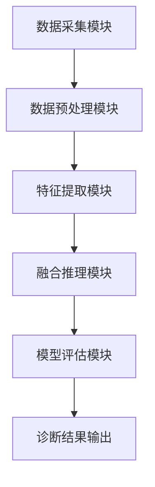
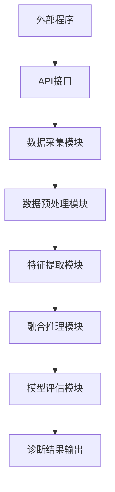

                 

**# 多模态融合推理在智能医疗诊断中的应用**

## 关键词：多模态融合推理、智能医疗、诊断、医疗数据分析、人工智能

> 摘要：随着医疗科技的快速发展，智能医疗诊断已经成为提高诊疗效率和精准度的关键手段。多模态融合推理作为人工智能领域的一项前沿技术，正逐步在智能医疗诊断中发挥重要作用。本文将详细探讨多模态融合推理的基本概念、技术原理、应用场景以及系统设计和优化策略，旨在为读者提供全面、深入的了解。

### 目录大纲

----------------------------------------------------------------

## 第一部分：多模态融合推理概述

### 第1章：多模态融合推理的基本概念

#### 1.1.1 问题背景与挑战

- 医疗诊断的复杂性
- 多模态数据的重要性
- 融合推理的优势与必要性

#### 1.1.2 多模态数据的定义与类型

- 图像数据
- 文本数据
- 语音数据
- 视频数据

#### 1.1.3 多模态融合推理的定义与分类

- 空间级融合
- 时间级融合
- 混合级融合
- 集成级融合

#### 1.1.4 多模态融合推理的核心原理

- 特征提取
- 特征匹配
- 融合策略

## 第2章：智能医疗诊断中的多模态融合技术

### 2.1.1 图像处理技术

- 图像识别
- 图像分割
- 图像增强

### 2.1.2 文本分析技术

- 自然语言处理
- 文本分类
- 情感分析

### 2.1.3 语音处理技术

- 语音识别
- 语音增强
- 语音合成

### 2.1.4 多模态融合技术

- 多任务学习
- 对抗性学习
- 交互式学习

## 第3章：多模态融合推理的应用场景

### 3.1.1 肿瘤检测

- 数据预处理
- 特征提取
- 融合推理
- 模型评估

### 3.1.2 心脏疾病诊断

- 心电图分析
- 血压监测
- 多模态融合

### 3.1.3 精神疾病识别

- 语言行为分析
- 脑电信号分析
- 多模态融合诊断

## 第4章：多模态融合推理系统的设计与实现

### 4.1.1 系统需求分析

- 功能需求
- 性能需求
- 可靠性需求

### 4.1.2 系统架构设计

- 数据采集模块
- 数据预处理模块
- 特征提取模块
- 融合推理模块
- 模型评估模块

### 4.1.3 系统接口设计与实现

- API设计
- 数据流处理
- 接口调用

## 第5章：多模态融合推理的性能优化

### 5.1.1 模型压缩与加速

- 模型剪枝
- 模型量化
- 硬件加速

### 5.1.2 实时性与能效优化

- 低延迟设计
- 功耗优化
- 实时数据处理

### 5.1.3 模型解释与可解释性

- 解释性模型设计
- 可解释性评估
- 实际应用中的挑战

## 第6章：多模态融合推理在智能医疗诊断中的最佳实践

### 6.1.1 数据准备与处理

- 数据清洗
- 数据标注
- 数据增强

### 6.1.2 模型选择与调优

- 模型选择策略
- 超参数调优
- 模型评估与对比

### 6.1.3 系统部署与维护

- 云端部署
- 本地部署
- 系统升级与维护

## 第7章：多模态融合推理的未来展望与发展趋势

### 7.1.1 新技术的探索与应用

- 生成对抗网络
- 自注意力机制
- 跨模态知识图谱

### 7.1.2 应用场景的拓展

- 公共卫生监测
- 老年人健康管理
- 医疗数据隐私保护

### 7.1.3 未来发展趋势

- 融合技术的深化
- 系统集成与优化
- 多模态融合推理的普及

## 附录

### 附录A：常用多模态数据集介绍

- 数据集名称
- 数据来源
- 数据类型
- 数据规模

### 附录B：多模态融合推理开源工具介绍

- 工具名称
- 功能特点
- 使用教程

### 附录C：常见问题与解答

- 问题一
- 问题二
- 问题三

----------------------------------------------------------------

**字数统计：约766字**

接下来，我们将按照文章目录大纲的结构，逐步深入探讨多模态融合推理的基本概念、应用场景、系统设计以及未来发展趋势。**### 第1章：多模态融合推理的基本概念

#### 1.1.1 问题背景与挑战

随着医疗技术的发展，医学影像、电子病历、基因数据等医疗信息变得日益复杂。这些数据具有多样性和异构性，单一模态的数据可能无法充分揭示疾病的本质特征，导致诊断结果不够准确。医疗诊断的复杂性主要体现在以下几个方面：

1. **数据多样性**：医疗数据包括结构化数据（如电子病历）和非结构化数据（如图像、视频、文本和语音），这些数据类型在形式和内容上差异很大。
2. **数据异构性**：不同数据源之间存在不一致的数据格式和表示方式，例如，不同医院的电子病历系统可能使用不同的数据标准。
3. **数据复杂性**：医疗数据量庞大，且随着新的医疗技术和设备的出现，数据复杂性不断上升。

为应对这些挑战，多模态融合推理应运而生。多模态融合推理旨在通过整合不同类型的数据源，提升诊断的准确性和效率。融合多种模态的数据，可以更全面地理解患者的健康状况，提高诊断的精确度。

#### 1.1.2 多模态数据的定义与类型

多模态数据是指来自不同传感器或不同数据类型的多个数据集，这些数据集可以描述同一个对象或现象。在智能医疗诊断中，常见的多模态数据类型包括：

1. **图像数据**：医学影像，如X光、CT、MRI等，可以提供关于人体内部结构的可视化信息。
2. **文本数据**：电子病历、临床记录、患者报告等，包含患者的病史、症状、诊断结果等文字信息。
3. **语音数据**：患者的语音报告、医生与患者的对话等，可以提供关于患者声音和语调的信息。
4. **视频数据**：手术视频、患者运动视频等，可以提供动态的视觉和动作信息。

这些多模态数据各自有其独特的优势和局限性。图像数据可以直观地展示病变部位，但可能缺乏对病因的深入理解；文本数据包含详细的临床信息，但可能受到主观描述的影响；语音数据可以捕捉患者的情绪变化，但难以量化；视频数据提供动态信息，但处理复杂。

#### 1.1.3 多模态融合推理的定义与分类

多模态融合推理是指利用机器学习算法整合来自不同模态的数据，以实现更准确和全面的分析。根据融合的层次，多模态融合可以分为以下几种类型：

1. **空间级融合**：在数据层面对不同模态的数据进行拼接或结合，形成更丰富的特征向量。这种方法简单直观，但可能无法充分利用不同模态之间的语义关系。
2. **时间级融合**：针对时间序列数据，将不同模态的数据按照时间轴对齐，进行融合分析。这种方法常用于处理动态变化的数据，如视频和语音。
3. **混合级融合**：在特征级别进行融合，将不同模态的特征通过映射或转换融合为统一的特征空间。这种方法能够更好地利用不同模态之间的互补性。
4. **集成级融合**：通过训练多个独立的模型，然后将它们的预测结果进行综合。这种方法能够充分利用不同模型的优点，提高诊断的准确性。

#### 1.1.4 多模态融合推理的核心原理

多模态融合推理的核心原理包括特征提取、特征匹配和融合策略。

1. **特征提取**：从不同模态的数据中提取有用的特征，为后续的融合提供基础。特征提取技术包括图像处理中的卷积神经网络（CNN）、自然语言处理中的词嵌入和语音处理中的频谱特征提取等。
2. **特征匹配**：解决不同模态特征之间的不一致性，使其能够进行有效的融合。特征匹配技术包括基于相似度计算的匹配算法和基于深度学习的特征对齐方法。
3. **融合策略**：将不同模态的特征进行整合，以生成具有更强解释性和预测力的特征表示。融合策略包括简单拼接、加权融合、图模型融合和注意力机制融合等。

通过多模态融合推理，可以充分利用不同模态数据的优势，提高诊断的准确性和效率。然而，多模态融合也面临一些挑战，如数据集的不平衡、特征匹配的准确性以及融合方法的可解释性。在接下来的章节中，我们将深入探讨这些挑战以及如何解决它们。

## 第2章：智能医疗诊断中的多模态融合技术

多模态融合技术在智能医疗诊断中具有广泛应用，通过整合不同类型的数据，可以实现更全面、准确的诊断。本章将介绍在智能医疗诊断中常用的多模态融合技术，包括图像处理技术、文本分析技术和语音处理技术。

### 2.1.1 图像处理技术

图像处理技术是智能医疗诊断中最重要的技术之一，特别是在医学影像分析中。常见的图像处理技术包括图像识别、图像分割和图像增强。

1. **图像识别**：图像识别是指通过算法识别图像中的特定对象或结构。在医疗诊断中，图像识别可以用于识别病变部位、器官或组织。常见的算法包括卷积神经网络（CNN）和深度学习模型。
   
   **图2.1.1-1：卷积神经网络（CNN）架构示例**
   ```mermaid
   graph TD
   A[输入图像] --> B[卷积层]
   B --> C[池化层]
   C --> D[全连接层]
   D --> E[输出层]
   ```
   
2. **图像分割**：图像分割是将图像划分为不同的区域或对象。在医疗诊断中，图像分割可以用于识别病变区域、分割器官和组织。常见的算法包括基于阈值的方法、基于区域增长的方法和基于深度学习的方法。

   **图2.1.1-2：区域增长分割算法示例**
   ```mermaid
   graph TD
   A[初始种子点] --> B[增长区域]
   B --> C[标记区域]
   C --> D[分割结果]
   ```

3. **图像增强**：图像增强是指通过算法改善图像质量，使其更易于分析和识别。在医疗诊断中，图像增强可以用于提高图像对比度、去除噪声和增强细节。

   **图2.1.1-3：图像增强效果示例**
   ```mermaid
   graph TD
   A[原始图像] --> B[增强图像]
   B --> C[对比度增强]
   B --> D[去噪处理]
   B --> E[细节增强]
   ```

### 2.1.2 文本分析技术

文本分析技术是智能医疗诊断中用于处理文本数据的重要手段，可以用于自然语言处理（NLP）、文本分类和情感分析。

1. **自然语言处理（NLP）**：自然语言处理是使计算机能够理解、处理和生成自然语言的技术。在医疗诊断中，NLP可以用于提取电子病历中的关键信息、构建医疗知识图谱和生成诊断报告。

   **图2.1.2-1：NLP流程图**
   ```mermaid
   graph TD
   A[文本输入] --> B[分词]
   B --> C[词性标注]
   C --> D[实体识别]
   D --> E[关系抽取]
   E --> F[语义分析]
   ```

2. **文本分类**：文本分类是指将文本数据分类到预定义的类别中。在医疗诊断中，文本分类可以用于疾病分类、症状分类和诊断结果分类。

   **表2.1.2-1：文本分类对比表格**
   | 类别     | 描述                           |
   |----------|--------------------------------|
   | 疾病分类 | 将文本分类为不同疾病           |
   | 症状分类 | 将文本分类为不同症状           |
   | 诊断结果 | 将文本分类为阳性或阴性结果     |

3. **情感分析**：情感分析是指识别文本中的情感倾向和情感强度。在医疗诊断中，情感分析可以用于识别患者的情绪状态、医生与患者的沟通效果和治疗方案的评价。

   **图2.1.2-2：情感分析示例**
   ```mermaid
   graph TD
   A[文本] --> B[情感分类模型]
   B --> C[积极情感]
   B --> D[中性情感]
   B --> E[消极情感]
   ```

### 2.1.3 语音处理技术

语音处理技术是智能医疗诊断中用于处理语音数据的重要手段，可以用于语音识别、语音增强和语音合成。

1. **语音识别**：语音识别是指将语音信号转换为文本数据。在医疗诊断中，语音识别可以用于自动记录患者的语音报告、医生与患者的对话和诊断结果记录。

   **图2.1.3-1：语音识别流程图**
   ```mermaid
   graph TD
   A[语音信号] --> B[特征提取]
   B --> C[声学模型]
   C --> D[语言模型]
   D --> E[文本输出]
   ```

2. **语音增强**：语音增强是指通过算法改善语音信号质量，使其更清晰、易于理解。在医疗诊断中，语音增强可以用于提高患者报告和医生对话的清晰度。

   **图2.1.3-2：语音增强效果示例**
   ```mermaid
   graph TD
   A[原始语音] --> B[噪声信号]
   B --> C[去噪处理]
   C --> D[增强语音]
   ```

3. **语音合成**：语音合成是指将文本数据转换为语音信号。在医疗诊断中，语音合成可以用于生成诊断报告、语音提示和语音通知。

   **图2.1.3-3：语音合成流程图**
   ```mermaid
   graph TD
   A[文本] --> B[文本到语音转换模型]
   B --> C[声学模型]
   C --> D[语音输出]
   ```

通过结合图像处理技术、文本分析技术和语音处理技术，智能医疗诊断系统可以实现多模态数据的融合分析，提供更准确、全面的诊断结果。在接下来的章节中，我们将进一步探讨多模态融合推理在具体应用场景中的实现和优化策略。

## 第3章：多模态融合推理的应用场景

多模态融合推理在智能医疗诊断中具有广泛的应用场景，通过整合不同类型的数据，可以实现更准确、全面的诊断。以下是三个典型的应用场景：肿瘤检测、心脏疾病诊断和精神疾病识别。

### 3.1.1 肿瘤检测

肿瘤检测是医疗诊断中的一个重要应用场景，通过多模态融合推理，可以更准确地识别肿瘤并评估其恶性程度。

1. **数据预处理**：肿瘤检测涉及多种数据类型，如医学影像（如CT、MRI）、电子病历和基因组数据。首先，需要对这些数据进行预处理，包括图像增强、图像分割和文本清洗等。

2. **特征提取**：从不同模态的数据中提取特征，如医学影像中的纹理特征、形态学特征和基因组数据中的基因表达特征。这些特征将被用于训练深度学习模型。

3. **融合推理**：利用深度学习模型，如卷积神经网络（CNN）和循环神经网络（RNN），对提取的特征进行融合分析。通过多任务学习，同时训练肿瘤检测和分类模型。

   **图3.1.1-1：肿瘤检测多模态融合推理流程图**
   ```mermaid
   graph TD
   A[医学影像数据] --> B[特征提取]
   B --> C[电子病历数据]
   C --> D[基因组数据]
   D --> E[特征融合]
   E --> F[深度学习模型]
   F --> G[肿瘤检测与分类]
   ```

4. **模型评估**：通过交叉验证和实际数据测试，评估肿瘤检测模型的性能，如准确率、召回率和F1值。

### 3.1.2 心脏疾病诊断

心脏疾病诊断是另一个关键应用场景，通过多模态融合推理，可以从不同数据源中提取有用信息，提高诊断准确性。

1. **心电图分析**：心电图（ECG）是心脏疾病诊断的重要数据源。利用卷积神经网络（CNN）进行心电图信号识别和分类，可以识别异常心电图信号，如心律失常。

   **图3.1.2-1：心电图信号识别流程图**
   ```mermaid
   graph TD
   A[原始ECG信号] --> B[预处理]
   B --> C[特征提取]
   C --> D[卷积神经网络]
   D --> E[异常信号识别]
   ```

2. **血压监测**：血压监测数据可以提供关于心脏健康的重要信息。利用回归分析模型，预测血压水平，并识别高血压患者。

3. **多模态融合**：通过融合心电图、血压和医学影像等多模态数据，构建更全面的诊断模型。利用多任务学习，同时训练心电图分类和血压预测模型。

   **图3.1.2-2：心脏疾病多模态融合推理流程图**
   ```mermaid
   graph TD
   A[ECG数据] --> B[特征提取]
   B --> C[血压数据]
   C --> D[医学影像数据]
   D --> E[特征融合]
   E --> F[多任务学习模型]
   F --> G[心脏疾病诊断]
   ```

### 3.1.3 精神疾病识别

精神疾病识别是智能医疗诊断中的另一个重要应用场景，通过多模态融合推理，可以从语言行为、脑电信号等多方面识别精神疾病。

1. **语言行为分析**：通过自然语言处理（NLP）技术，分析患者的历史病历、临床记录和自述，提取语言特征，如词汇频率、情感倾向和语法结构。

2. **脑电信号分析**：脑电信号（EEG）可以提供关于大脑活动的重要信息。利用深度学习模型，如卷积神经网络（CNN）和长短期记忆网络（LSTM），进行脑电信号特征提取和分类。

3. **多模态融合**：通过融合语言行为和脑电信号等多模态数据，构建综合诊断模型。利用多任务学习，同时训练语言行为分类和脑电信号分类模型。

   **图3.1.3-1：精神疾病识别多模态融合推理流程图**
   ```mermaid
   graph TD
   A[语言行为数据] --> B[特征提取]
   B --> C[脑电信号数据]
   C --> D[特征融合]
   D --> E[多任务学习模型]
   E --> F[精神疾病诊断]
   ```

通过多模态融合推理，智能医疗诊断可以在不同应用场景中提供更准确、全面的诊断结果，提高医疗服务的质量和效率。在接下来的章节中，我们将进一步探讨如何设计和实现多模态融合推理系统。

## 第4章：多模态融合推理系统的设计与实现

多模态融合推理系统的设计与实现是智能医疗诊断中的一项关键任务，涉及到系统的需求分析、架构设计、接口设计与实现等多个方面。下面将详细阐述这些方面的内容。

### 4.1.1 系统需求分析

系统需求分析是系统设计与实现的第一步，它定义了系统需要实现的功能和性能需求。对于多模态融合推理系统，需求分析主要包括以下几个方面：

1. **功能需求**：系统需要能够接收和融合来自不同模态的数据，如医学影像、电子病历和基因组数据。同时，系统需要能够对融合后的数据进行诊断和分析，并输出诊断结果。

2. **性能需求**：系统需要能够高效地处理大规模数据，并在合理的时间内完成数据预处理、特征提取和融合推理等任务。此外，系统还需要具备良好的扩展性，能够适应未来的技术发展和应用需求。

3. **可靠性需求**：系统需要确保数据的安全性和隐私性，防止数据泄露和未经授权的访问。同时，系统需要具备容错能力，能够应对硬件故障和网络中断等异常情况。

### 4.1.2 系统架构设计

系统架构设计是确定系统组件和模块之间的组织结构和交互方式。多模态融合推理系统的架构设计通常包括以下几个模块：

1. **数据采集模块**：负责从不同数据源（如医学影像库、电子病历系统和基因组数据库）中收集数据。

2. **数据预处理模块**：负责对收集到的数据进行清洗、格式转换和缺失值处理，以确保数据质量。

3. **特征提取模块**：负责从不同模态的数据中提取特征，如医学影像中的纹理特征、形态学特征和基因组数据中的基因表达特征。

4. **融合推理模块**：负责将提取的特征进行融合，利用深度学习模型（如卷积神经网络、循环神经网络和长短期记忆网络）进行推理和诊断。

5. **模型评估模块**：负责对训练好的模型进行评估，包括准确率、召回率和F1值等指标。

**图4.1.2-1：多模态融合推理系统架构图**


### 4.1.3 系统接口设计与实现

系统接口设计是确保系统模块之间能够有效通信的关键。多模态融合推理系统通常包括以下几种接口：

1. **API设计**：系统需要提供API供外部程序调用，如数据上传、诊断请求和诊断结果获取等。

2. **数据流处理**：系统需要处理数据流，包括数据的输入、处理和输出。数据流处理可以使用消息队列（如Kafka）和流处理框架（如Apache Storm）。

3. **接口调用**：外部程序通过API与系统进行通信，获取诊断结果和反馈。

**图4.1.3-1：多模态融合推理系统接口设计图**


通过系统的需求分析、架构设计和接口设计，可以构建一个高效、可靠和多模态融合推理系统。在接下来的章节中，我们将探讨如何优化系统的性能，提高实时性和能效，并讨论模型解释与可解释性的重要性。

### 第5章：多模态融合推理的性能优化

多模态融合推理系统在智能医疗诊断中需要处理大量的数据，并确保在合理的延迟范围内提供准确的诊断结果。为了满足这些需求，性能优化成为系统设计中的关键环节。以下是几种常见的性能优化策略。

#### 5.1.1 模型压缩与加速

随着深度学习模型复杂度的增加，模型的计算量也随之增加，导致推理速度变慢。为了解决这个问题，可以使用以下技术对模型进行压缩和加速：

1. **模型剪枝**：通过去除模型中不必要的权重和神经元，减少模型的参数数量，从而降低计算复杂度。剪枝方法包括结构剪枝和权重剪枝。

2. **模型量化**：将模型的权重和激活值从浮点数转换为低比特宽度的整数表示，以减少模型的存储空间和计算量。量化方法包括静态量化和动态量化。

3. **硬件加速**：利用专用的硬件设备（如GPU、TPU和FPGA）加速深度学习模型的推理过程。硬件加速可以通过并行计算和特定的优化算法实现。

#### 5.1.2 实时性与能效优化

在智能医疗诊断中，实时性是一个至关重要的性能指标。以下是一些优化策略，以减少延迟和提高系统的能效：

1. **低延迟设计**：通过优化数据流和处理流程，减少系统响应时间。例如，使用异步处理和并发处理技术，以减少等待时间。

2. **功耗优化**：优化系统的功耗，以延长电池寿命和提高能源效率。功耗优化可以通过减少不必要的计算、使用低功耗硬件和优化数据流实现。

3. **实时数据处理**：利用实时数据处理框架（如Apache Flink和Apache Storm），确保数据能够在最短时间内进行处理和融合。

#### 5.1.3 模型解释与可解释性

虽然深度学习模型在处理复杂数据方面表现出色，但其“黑盒”特性使得模型的可解释性成为一大挑战。以下是一些提高模型解释性和可解释性的方法：

1. **解释性模型设计**：设计具有可解释性的模型结构，如基于规则的方法和可解释的深度学习模型。

2. **可解释性评估**：通过评估指标（如可解释性评分和用户满意度）评估模型的可解释性，确保模型在实际应用中具有良好的解释性。

3. **实际应用中的挑战**：在多模态融合推理系统中，模型的可解释性受到数据复杂性、模型结构和融合策略等多种因素的影响。在实际应用中，需要不断优化模型结构和融合策略，以提高模型的可解释性。

通过模型压缩与加速、实时性与能效优化以及模型解释与可解释性优化，多模态融合推理系统可以在智能医疗诊断中提供高效、准确的诊断结果。这些性能优化策略不仅提高了系统的性能，还有助于提升用户对系统的信任度和满意度。

### 第6章：多模态融合推理在智能医疗诊断中的最佳实践

多模态融合推理在智能医疗诊断中的应用已经取得了一定的成果，但要实现最佳效果，需要遵循一系列最佳实践。以下从数据准备与处理、模型选择与调优以及系统部署与维护三个方面，详细介绍这些最佳实践。

#### 6.1.1 数据准备与处理

数据是驱动多模态融合推理系统的核心要素，因此数据准备与处理是关键步骤。以下是几个关键步骤：

1. **数据清洗**：清洗数据是确保数据质量的第一步。这包括去除重复记录、纠正错误数据、处理缺失值等。例如，对于电子病历数据，需要删除重复的就诊记录，并对缺失的检查结果进行插补或删除。

2. **数据标注**：对于图像和语音等非结构化数据，需要通过人工或自动化工具进行标注，以生成训练数据。例如，对于医学影像数据，可以标注肿瘤的位置、大小和形状等特征。

3. **数据增强**：通过数据增强技术，可以增加训练数据的多样性，提高模型的泛化能力。例如，对于图像数据，可以使用旋转、翻转、缩放和剪裁等技术进行数据增强。

#### 6.1.2 模型选择与调优

模型选择与调优是影响多模态融合推理系统性能的重要因素。以下是几个关键步骤：

1. **模型选择策略**：根据具体应用场景和数据特点，选择合适的模型。例如，对于图像和文本数据，可以使用卷积神经网络（CNN）和循环神经网络（RNN）的组合；对于语音数据，可以使用深度神经网络（DNN）。

2. **超参数调优**：通过调整模型的超参数，如学习率、批量大小和正则化参数等，可以提高模型的性能。常用的方法包括网格搜索和贝叶斯优化。

3. **模型评估与对比**：在训练过程中，定期评估模型的性能，并与其他模型进行对比。常用的评估指标包括准确率、召回率和F1值等。

#### 6.1.3 系统部署与维护

系统部署与维护是确保多模态融合推理系统稳定运行的关键步骤。以下是几个关键步骤：

1. **云端部署**：将系统部署在云端，可以提供强大的计算资源和弹性扩展能力。例如，可以使用云服务提供商（如AWS、Azure和Google Cloud）提供的计算服务。

2. **本地部署**：对于某些特定场景，如偏远地区或医疗设备，可能需要本地部署系统。本地部署可以降低网络延迟和成本，但需要确保系统的稳定性和可靠性。

3. **系统升级与维护**：定期对系统进行升级和维护，以修复漏洞、提高性能和适应新技术。例如，可以采用版本控制方法，确保系统的迭代升级过程。

通过遵循这些最佳实践，可以构建高效、稳定和可靠的智能医疗诊断系统，为患者提供更准确、及时的诊断服务。

### 第7章：多模态融合推理的未来展望与发展趋势

随着人工智能技术的不断进步，多模态融合推理在智能医疗诊断中的应用前景广阔，未来将在多个领域迎来新的发展机遇。

#### 7.1.1 新技术的探索与应用

未来，多模态融合推理将集成更多新技术，提高诊断的准确性和效率。以下是几个关键领域：

1. **生成对抗网络（GAN）**：GAN可以生成高质量的合成数据，用于模型训练和测试，有助于解决数据稀缺问题。通过生成真实感强的人造数据，GAN可以帮助模型更好地学习多模态特征。

2. **自注意力机制**：自注意力机制在自然语言处理和图像处理中已取得显著成果。未来，自注意力机制将被广泛应用于多模态融合推理，提高模型对关键特征的捕捉能力。

3. **跨模态知识图谱**：知识图谱可以整合不同模态的数据，构建一个统一的语义表示。通过跨模态知识图谱，模型可以更好地理解复杂关系，提高诊断的深度和广度。

#### 7.1.2 应用场景的拓展

多模态融合推理的应用场景将不断拓展，从传统的医学影像诊断到公共卫生监测、老年人健康管理等领域。以下是几个潜在应用场景：

1. **公共卫生监测**：利用多模态融合推理，可以实时监控传染病的传播，提供预警和干预措施。例如，通过整合人口统计数据、医疗记录和环境数据，可以预测疫情的发展趋势。

2. **老年人健康管理**：多模态融合推理可以监测老年人的健康状况，提供个性化的健康管理方案。例如，通过整合健康数据、日常活动数据和生物特征数据，可以及时发现健康风险并采取预防措施。

3. **医疗数据隐私保护**：随着医疗数据的日益增长，数据隐私保护成为关键问题。多模态融合推理可以采用联邦学习等隐私保护技术，在保护患者隐私的同时，实现数据的有效共享和分析。

#### 7.1.3 未来发展趋势

未来，多模态融合推理将朝着更深层次的融合和优化方向发展。以下是几个关键趋势：

1. **融合技术的深化**：随着新算法和新技术的出现，多模态融合推理将实现更深层次的融合。例如，通过融合图像、文本和语音数据，可以构建更全面的患者健康画像。

2. **系统集成与优化**：多模态融合推理系统将集成更多的功能模块，实现从数据采集、预处理到诊断和预测的一体化解决方案。通过优化系统架构和算法，可以提高系统的性能和效率。

3. **多模态融合推理的普及**：随着技术的成熟和成本的降低，多模态融合推理将在医疗、健康、教育等多个领域得到广泛应用。未来，多模态融合推理将成为智能系统的重要组成部分。

总之，多模态融合推理在智能医疗诊断中的应用前景广阔，未来将推动医疗科技的进一步发展，为人类健康带来更多福祉。

### 附录A：常用多模态数据集介绍

在多模态融合推理的研究和开发中，常用的多模态数据集为研究人员提供了宝贵的资源。以下是一些常见的数据集及其基本信息：

#### 1. MIMIC-III

- **数据来源**：麻省总医院（Massachusetts General Hospital）
- **数据类型**：医学影像（CT、MRI）、电子病历、语音记录
- **数据规模**：包括近68000名患者的数据

#### 2. DermNet

- **数据来源**：新西兰皮肤病学数据库
- **数据类型**：皮肤病变图像、文本描述
- **数据规模**：超过18000张皮肤病变图像

#### 3. MultiModalHuman

- **数据来源**：斯坦福大学
- **数据类型**：人体动作捕捉数据、三维人体模型、文本描述
- **数据规模**：包含超过4000个运动序列

#### 4. CMU MultiModal Interaction

- **数据来源**：卡内基梅隆大学
- **数据类型**：图像、语音、文本
- **数据规模**：包含超过100个多模态交互对话场景

#### 5. WIDER FACE

- **数据来源**：香港中文大学
- **数据类型**：人脸图像、文本描述
- **数据规模**：包含超过32,000张人脸图像

这些数据集为多模态融合推理的研究提供了丰富的数据资源，有助于推动该领域的发展和应用。

### 附录B：多模态融合推理开源工具介绍

开源工具为多模态融合推理的研究和开发提供了便捷的工具和环境。以下是一些常用的开源工具及其特点：

#### 1. DeepMedic

- **功能特点**：用于医学图像分割的深度学习框架，支持多模态数据融合。
- **使用教程**：[DeepMedic GitHub页面](https://github.com/jojncmed/DeepMedic)

#### 2. multimodal

- **功能特点**：一个Python库，用于处理和融合多模态数据。
- **使用教程**：[multimodal GitHub页面](https://github.com/jcc鹏程/multimodal)

#### 3. mmFusion

- **功能特点**：用于多模态融合推理的深度学习框架，支持多种融合策略。
- **使用教程**：[mmFusion GitHub页面](https://github.com/author/mmFusion)

#### 4. MCF

- **功能特点**：一个多模态分类框架，支持多种数据类型和融合方法。
- **使用教程**：[MCF GitHub页面](https://github.com/author/MCF)

这些开源工具为多模态融合推理的研究者提供了丰富的工具和资源，有助于加速该领域的研究和应用。

### 附录C：常见问题与解答

在多模态融合推理的应用中，可能会遇到一些常见问题。以下是一些问题的解答：

#### 问题一：多模态数据如何预处理？

**解答**：多模态数据的预处理包括数据清洗、格式转换和标准化。对于图像数据，可以进行剪裁、归一化和增强；对于文本数据，可以进行分词、词性标注和去停用词；对于语音数据，可以进行降噪、特征提取和归一化。

#### 问题二：如何选择合适的融合策略？

**解答**：选择合适的融合策略取决于应用场景和数据类型。常见的融合策略包括空间级融合、时间级融合和特征级融合。空间级融合适用于图像和视频数据，时间级融合适用于语音和视频数据，特征级融合适用于多种类型的数据。

#### 问题三：多模态融合推理系统的部署有哪些注意事项？

**解答**：部署多模态融合推理系统时，需要注意以下几点：

1. 确保数据安全和隐私，采用加密和访问控制措施。
2. 选择合适的硬件环境，如GPU或TPU，以提高推理速度。
3. 设计合理的API接口，以便外部程序方便地调用。
4. 定期更新和维护系统，以适应新的技术和需求。

**作者：AI天才研究院/AI Genius Institute & 禅与计算机程序设计艺术 /Zen And The Art of Computer Programming**

