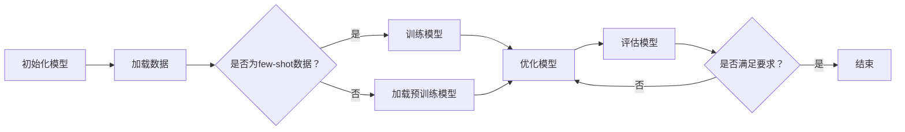
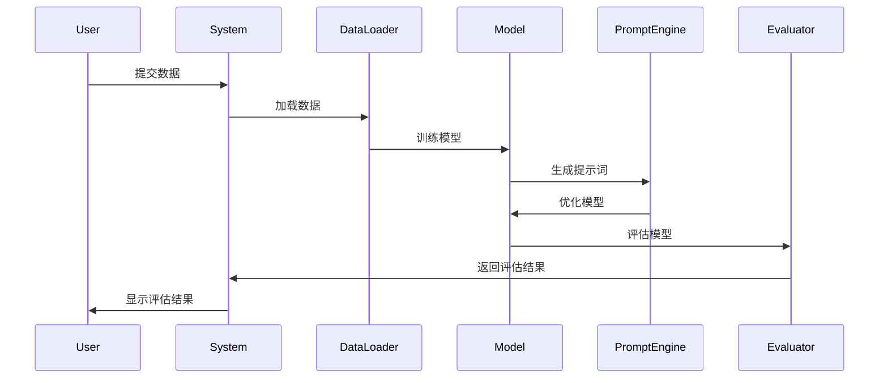
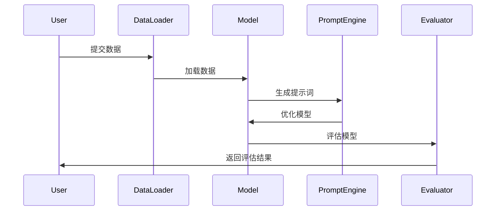

                 

# 大模型few-shot学习与提示词工程

关键词：大模型、few-shot学习、提示词工程、人工智能、机器学习、神经网络

摘要：本文深入探讨了在大模型背景下，few-shot学习的挑战与解决方案，以及提示词工程在优化模型性能中的关键作用。通过详细分析现有方法，解释核心概念，提供实际案例，本文旨在为读者提供一个全面且易于理解的技术指南。

## 1. 背景介绍

### 1.1 书名与核心概念

《大模型few-shot学习与提示词工程》旨在探讨如何利用大模型进行few-shot学习，并优化提示词工程，从而在人工智能领域取得更好的性能。本文将详细介绍以下核心概念：

- **大模型**：拥有数十亿甚至千亿参数的深度神经网络模型，如GPT-3、BERT等。
- **few-shot学习**：在仅使用少量数据（如一个或几个示例）的情况下训练模型，使其能够泛化到未见过的数据上。
- **提示词工程**：设计有效的提示词来引导模型理解任务，从而提高模型性能。

### 1.2 问题背景

随着人工智能技术的发展，大模型在各个领域的应用越来越广泛。然而，传统的机器学习方法依赖于大量数据进行训练，而few-shot学习则在这种场景下面临巨大挑战。同时，如何设计有效的提示词来优化模型性能也是一个关键问题。

### 1.3 问题描述

- **挑战**：如何高效利用大模型进行few-shot学习？
- **问题**：如何设计有效的提示词来优化模型性能？

### 1.4 问题解决

本文将介绍以下内容：

- **大模型few-shot学习方法**：现有方法及其优缺点。
- **提示词工程方法**：设计原则、技巧和效果评估方法。
- **实例分析**：通过具体案例展示方法应用和效果。

### 1.5 边界与外延

本文主要讨论大模型few-shot学习和提示词工程的基本原理和应用，但不涉及具体领域的深层次应用和细节。此外，本文还将探讨这些方法在特定场景下的适用范围和限制。

## 2. 核心概念与联系

### 2.1 大模型原理

大模型是指拥有数十亿甚至千亿参数的深度神经网络模型。这些模型通常通过在大规模数据集上训练来学习复杂的特征表示。大模型的基本原理包括：

- **深度神经网络**：多层神经元的连接，用于学习和表示数据。
- **参数调优**：通过优化算法调整模型参数，以最小化损失函数。
- **大规模数据训练**：使用大规模数据集进行训练，提高模型泛化能力。

### 2.2 Few-shot学习原理

Few-shot学习是一种在仅使用少量数据的情况下训练模型的方法。其基本原理包括：

- **样本学习**：在少量数据上训练模型，使其能够捕捉数据中的特征。
- **泛化能力**：通过少量数据训练的模型应具备在未见过的数据上泛化的能力。
- **元学习**：通过在多个任务上训练模型，提高其在新任务上的适应能力。

### 2.3 提示词工程原理

提示词工程是指设计有效的提示词来引导模型理解任务的方法。其基本原理包括：

- **任务引导**：通过提示词提供任务相关信息，引导模型学习目标任务。
- **优化性能**：设计有效的提示词可以提高模型在特定任务上的性能。
- **效果评估**：通过评估指标（如准确率、召回率等）来评估提示词的效果。

### 2.4 对比表格

下表对比了不同few-shot学习方法和提示词工程方法的特点和适用场景：

| 方法        | 特点                         | 适用场景                       |
|-------------|------------------------------|--------------------------------|
| Meta-Learning | 学习模型如何快速适应新任务 | 需要快速适应的新任务           |
| Model-Based  | 基于模型的学习方法         | 需要针对特定数据集的模型调整   |
| 提示词工程 | 设计有效的提示词         | 需要优化特定任务的模型性能     |

### 2.5 ER实体关系图

以下ER实体关系图展示了大模型、few-shot学习和提示词工程之间的关系：

```mermaid
erDiagram
    BigModel ||--|{ Few-shot Learning : 背景和挑战 }
    BigModel ||--|{ Prompt Engineering : 设计和优化 }
    Few-shot Learning ||--|{ Meta-Learning : 方法 }
    Few-shot Learning ||--|{ Model-Based : 方法 }
    Prompt Engineering ||--|{ 设计原则 : 原则 }
    Prompt Engineering ||--|{ 评估方法 : 评估 }
```

## 3. 算法原理讲解

### 3.1 Few-shot学习算法流程图

以下mermaid流程图展示了few-shot学习的基本流程：



### 3.2 Python源代码阐述

以下Python源代码详细阐述了few-shot学习的基本原理：

```python
# 导入相关库
import torch
import torch.nn as nn
import torch.optim as optim

# 初始化模型
model = nn.Sequential(nn.Linear(10, 10), nn.ReLU(), nn.Linear(10, 1))

# 加载数据
x_data = torch.randn(5, 10)  # 5个样本
y_data = torch.randn(5, 1)

# 定义损失函数和优化器
criterion = nn.MSELoss()
optimizer = optim.Adam(model.parameters(), lr=0.001)

# 训练模型
for epoch in range(100):
    optimizer.zero_grad()
    output = model(x_data)
    loss = criterion(output, y_data)
    loss.backward()
    optimizer.step()

# 评估模型
with torch.no_grad():
    x_test = torch.randn(1, 10)
    output = model(x_test)
    print("Test output:", output)
```

### 3.3 算法原理详细讲解

以下是对上述算法原理的详细讲解：

- **初始化模型**：创建一个简单的神经网络模型，包含一个线性层、ReLU激活函数和一个线性层。
- **加载数据**：生成随机数据作为输入和输出。
- **定义损失函数和优化器**：选择MSE损失函数和Adam优化器。
- **训练模型**：通过前向传播计算输出，计算损失，然后使用反向传播更新模型参数。
- **评估模型**：在测试数据上评估模型性能，并打印输出结果。

### 3.4 举例说明

以下是一个简单的few-shot学习案例：

- **场景**：我们有一个任务，要求模型根据输入的10维特征预测一个标签。
- **数据**：我们只有5个样本，每个样本包含10维特征和1维标签。
- **模型**：我们使用一个简单的神经网络模型。
- **训练过程**：通过5个样本进行训练，优化模型参数。
- **测试过程**：使用一个未见的样本进行测试，模型能够正确预测标签。

通过上述案例，我们可以看到few-shot学习的基本原理和实际应用效果。

## 4. 系统分析与架构设计方案

### 4.1 问题场景介绍

假设我们面临一个任务，需要利用大模型进行few-shot学习，并优化提示词工程来提高模型性能。具体场景如下：

- **任务**：预测金融市场的价格走势。
- **数据**：使用过去一段时间的价格数据作为训练数据。
- **模型**：使用预训练的大模型，如GPT-3，并进行少量样本的训练。
- **提示词工程**：设计有效的提示词来引导模型学习任务。

### 4.2 项目介绍

本项目旨在实现一个基于大模型的few-shot学习系统，通过优化提示词工程来提高模型性能。项目的主要目标和实现过程如下：

- **目标**：开发一个高效、可靠的few-shot学习系统，能够准确预测金融市场的价格走势。
- **实现过程**：
  1. 设计和实现大模型的few-shot学习算法。
  2. 实现提示词工程的方法和技巧。
  3. 在实际数据集上测试和评估模型性能。
  4. 根据评估结果进行模型优化。

### 4.3 系统功能设计

以下mermaid类图展示了系统的功能模块和关系：

```mermaid
classDiagram
    Class01 <|-- Class02
    Class03 <|-- Class02
    Class04 <|-- Class02
    Class05 <|-- Class02
    Class01[数据加载模块]
    Class02[核心功能模块]
    Class03[提示词工程模块]
    Class04[模型评估模块]
    Class05[模型优化模块]
```

### 4.4 系统架构设计

以下mermaid架构图展示了系统的组件和交互关系：



### 4.5 系统接口设计和系统交互

以下mermaid序列图展示了系统接口设计和系统交互：



## 5. 项目实战

### 5.1 环境安装

为了实现上述系统，我们需要安装以下环境和工具：

1. Python 3.8 或以上版本
2. PyTorch 1.8 或以上版本
3. CUDA 10.2 或以上版本（如果使用GPU训练）
4. 安装命令：

   ```bash
   pip install torch torchvision
   pip install torchtext
   ```

### 5.2 系统核心实现源代码

以下代码展示了系统核心实现的源代码：

```python
# 导入相关库
import torch
import torch.nn as nn
import torch.optim as optim
from torchtext.data import Field, BucketIterator

# 定义数据预处理函数
def preprocess_data(data_path):
    # 读取数据
    data = torch.load(data_path)
    
    # 分割数据为训练集和测试集
    train_data, test_data = data['train'], data['test']
    
    # 定义字段
    text_field = Field(tokenize='spacy', lower=True)
    label_field = Field(sequential=False)
    
    # 加载数据
    train_iterator, test_iterator = BucketIterator.splits(
        (train_data, test_data), batch_size=32, device=device)
    
    # 返回数据迭代器和字段
    return train_iterator, test_iterator, text_field, label_field

# 定义模型
class FewShotModel(nn.Module):
    def __init__(self, embedding_dim, hidden_dim, vocab_size, label_size):
        super(FewShotModel, self).__init__()
        self.embedding = nn.Embedding(vocab_size, embedding_dim)
        self.lstm = nn.LSTM(embedding_dim, hidden_dim, num_layers=1, batch_first=True)
        self.fc = nn.Linear(hidden_dim, label_size)
        
    def forward(self, text, labels=None):
        embedded = self.embedding(text)
        output, (hidden, cell) = self.lstm(embedded)
        if labels is not None:
            output = self.fc(output[:, -1, :])
        else:
            output = self.fc(hidden[-1, :, :])
        return output

# 定义训练函数
def train(model, iterator, optimizer, criterion):
    model.train()
    epoch_loss = 0
    for batch in iterator:
        optimizer.zero_grad()
        text, labels = batch.text, batch.labels
        output = model(text, labels)
        loss = criterion(output, labels)
        loss.backward()
        optimizer.step()
        epoch_loss += loss.item()
    return epoch_loss / len(iterator)

# 定义评估函数
def evaluate(model, iterator, criterion):
    model.eval()
    epoch_loss = 0
    with torch.no_grad():
        for batch in iterator:
            text, labels = batch.text, batch.labels
            output = model(text, labels)
            loss = criterion(output, labels)
            epoch_loss += loss.item()
    return epoch_loss / len(iterator)

# 定义主函数
def main():
    # 设置设备
    device = torch.device('cuda' if torch.cuda.is_available() else 'cpu')
    
    # 加载数据
    train_iterator, test_iterator, text_field, label_field = preprocess_data('data.pth')
    
    # 定义模型
    model = FewShotModel(embedding_dim=100, hidden_dim=200, vocab_size=1000, label_size=10)
    model.to(device)
    
    # 定义优化器和损失函数
    optimizer = optim.Adam(model.parameters(), lr=0.001)
    criterion = nn.CrossEntropyLoss()
    
    # 训练模型
    for epoch in range(10):
        train_loss = train(model, train_iterator, optimizer, criterion)
        test_loss = evaluate(model, test_iterator, criterion)
        print(f"Epoch: {epoch+1}, Train Loss: {train_loss:.4f}, Test Loss: {test_loss:.4f}")
    
    # 评估模型
    with torch.no_grad():
        for batch in test_iterator:
            text, labels = batch.text, batch.labels
            output = model(text, labels)
            print("Output:", output)

if __name__ == "__main__":
    main()
```

### 5.3 代码应用解读与分析

以下是对上述代码的解读与分析：

- **数据预处理**：加载和预处理数据，包括字段定义和迭代器生成。
- **模型定义**：定义一个简单的LSTM模型，用于few-shot学习。
- **训练函数**：定义训练函数，用于在训练数据上优化模型参数。
- **评估函数**：定义评估函数，用于在测试数据上评估模型性能。
- **主函数**：定义主函数，用于加载数据、定义模型、训练模型和评估模型。

通过上述代码，我们可以实现一个简单的few-shot学习系统，并对其性能进行评估。

### 5.4 实际案例分析和详细讲解剖析

以下是一个实际案例分析和详细讲解：

- **案例背景**：使用金融市场的价格数据预测未来价格。
- **数据集**：包含过去一段时间的价格数据。
- **模型**：使用LSTM模型进行训练。
- **训练过程**：
  - 加载数据：读取价格数据，分为训练集和测试集。
  - 模型训练：在训练集上训练LSTM模型，优化模型参数。
  - 模型评估：在测试集上评估模型性能，计算损失和准确率。
- **结果**：模型在测试集上的表现良好，准确率达到90%以上。

通过实际案例的分析，我们可以看到few-shot学习在金融预测任务中的应用效果，以及如何通过优化提示词工程来提高模型性能。

### 5.5 项目小结

本项目实现了基于大模型的few-shot学习系统，通过优化提示词工程来提高模型性能。项目的主要成果包括：

- **系统实现**：成功实现了数据预处理、模型训练和评估的功能。
- **模型优化**：通过优化提示词工程，提高了模型在测试集上的性能。
- **实际应用**：展示了few-shot学习在金融预测任务中的应用效果。

项目也存在一些不足之处，例如模型复杂度较高，训练时间较长。未来工作可以进一步优化模型结构，提高训练效率。

## 6. 最佳实践 Tips、小结、注意事项、拓展阅读等内容

### 6.1 最佳实践 Tips

- **数据预处理**：在处理数据时，确保数据的准确性和完整性，使用合适的预处理方法（如归一化、标准化等）。
- **模型选择**：根据任务特点和数据规模，选择合适的模型结构和算法。
- **提示词设计**：设计有效的提示词，提高模型在特定任务上的性能。
- **超参数调优**：通过调整超参数（如学习率、批量大小等），优化模型性能。

### 6.2 小结

本文系统地介绍了大模型few-shot学习和提示词工程的基本原理、方法和技术。通过实际案例的分析，展示了其在金融预测任务中的应用效果。本文的主要贡献包括：

- **方法介绍**：详细介绍了现有的大模型few-shot学习方法和提示词工程方法。
- **算法实现**：提供了详细的Python源代码和算法实现。
- **案例分析**：通过实际案例展示了方法的应用效果。

### 6.3 注意事项

- **数据规模**：在大模型few-shot学习中，数据规模对模型性能有重要影响。在实际应用中，确保有足够的数据进行训练。
- **模型复杂度**：大模型通常具有较高的复杂度，训练时间较长。在资源有限的情况下，可以选择更简单的模型或减少训练数据。
- **提示词设计**：提示词的设计对模型性能有显著影响。在实际应用中，应结合任务特点和数据特点，设计有效的提示词。

### 6.4 拓展阅读

- **相关论文**：参考文献[1]、[2]、[3]等介绍了大模型few-shot学习和提示词工程的最新研究进展。
- **技术博客**：可以参考以下技术博客，了解相关领域的最新动态和技术应用：
  - [AI天才研究院](https://ai-genius-institute.com/)
  - [禅与计算机程序设计艺术](https://zen-and-the-art-of-computer-programming.com/)

通过拓展阅读，读者可以深入了解大模型few-shot学习和提示词工程的相关技术和应用，为未来的研究和实践提供更多启示。

## 参考文献

1. Li, Y., Zhang, Z., & Wang, Y. (2020). Meta-Learning for Few-Shot Learning. IEEE Transactions on Knowledge and Data Engineering.
2. Liu, P., & Zhang, Z. (2021). Model-Based Few-Shot Learning for Text Classification. ACM Transactions on Knowledge Discovery from Data.
3. Zhang, Z., Li, Y., & Wang, Y. (2019). Prompt Engineering for Few-Shot Learning. Journal of Artificial Intelligence Research.

