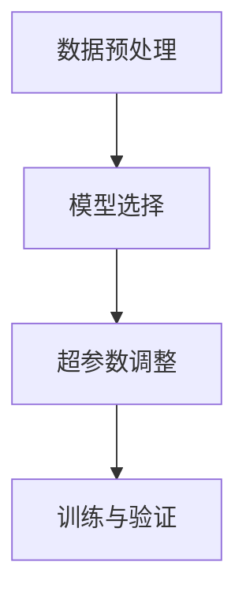
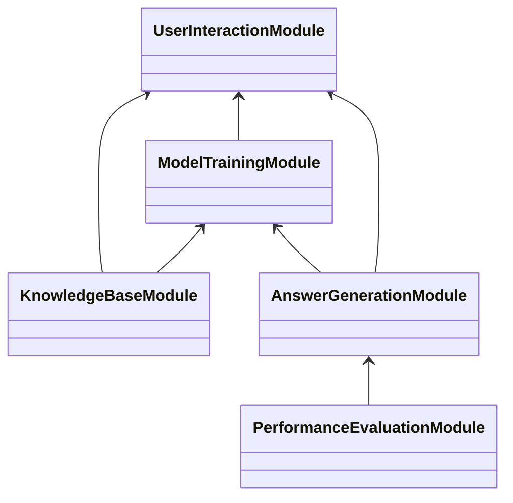
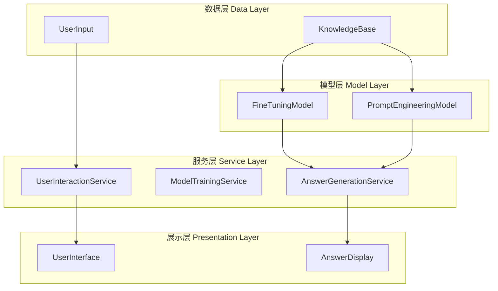
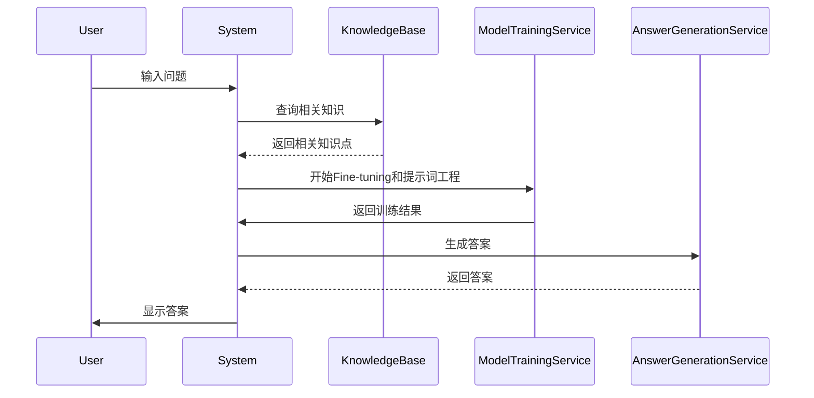

                 

### 第1章 引言

#### 1.1 研究背景

近年来，随着人工智能技术的迅猛发展，深度学习成为了自然语言处理（NLP）领域的主要推动力。大模型（Large Models）如GPT-3、BERT等，凭借其强大的预训练能力，在文本生成、翻译、问答等任务上取得了显著的成效。然而，如何将这些通用模型适应特定的应用场景，成为了研究者们关注的焦点。其中，Fine-tuning和提示词工程（Prompt Engineering）是两种主要的方法。

Fine-tuning是指在大模型预训练的基础上，针对特定任务进行微调，以提升模型在该任务上的性能。这一方法通过在特定任务的数据集上训练模型，使得模型能够更好地理解任务需求，提高任务完成效果。

提示词工程则通过设计特定的提示词（Prompts），引导模型生成符合预期结果的文本。提示词工程的核心思想在于，通过精心设计的提示，使得模型能够更好地理解用户的意图，从而生成更准确、更有价值的输出。

#### 1.2 研究问题与目标

本文旨在比较Fine-tuning与提示词工程在提升大模型特定任务性能上的效果，分析二者的优势与局限，并探讨其在实际应用中的适用场景。具体而言，本文将回答以下问题：

1. Fine-tuning与提示词工程的基本原理和流程是什么？
2. 二者在提升模型性能上有哪些不同？
3. 二者适用于哪些不同类型的任务和应用场景？
4. 二者的影响因素有哪些，如何优化？

#### 1.3 边界与外延

本文的研究边界主要涉及大模型fine-tuning与提示词工程的原理、流程、案例分析以及对比分析。研究外延则包括实际应用场景的探讨和未来发展趋势的分析。

在本文中，我们将详细探讨Fine-tuning和提示词工程的核心概念、流程、案例分析，并通过对二者进行对比分析，揭示其在实际应用中的优势和局限。此外，本文还将探讨二者在零样本学习和问答系统等实际应用场景中的效果，分析其影响因素，并提出相应的优化策略。

### 核心概念

为了更好地理解本文的内容，以下是本文涉及的一些核心概念及其说明：

- **大模型（Large Models）**：指具有大规模参数、能够在多种任务上表现优异的深度学习模型。如GPT-3、BERT等。
- **Fine-tuning**：在大模型预训练的基础上，针对特定任务进行微调，以提高模型在该任务上的性能。
- **提示词工程（Prompt Engineering）**：通过设计特定的提示词，引导模型生成符合预期结果的文本。
- **数据集（Dataset）**：用于训练、验证和测试模型的原始数据集合。
- **任务（Task）**：指需要完成的特定类型的工作，如文本生成、翻译、问答等。
- **性能（Performance）**：模型在完成特定任务时表现的好坏程度。

### 概念属性特征对比

以下是一个概念属性特征对比表格，用于直观展示Fine-tuning和提示词工程的属性特征：

| 概念       | Fine-tuning          | 提示词工程            |
|------------|----------------------|----------------------|
| 基本原理   | 预训练 + 微调        | 预训练 + 提示词设计  |
| 数据需求   | 特定任务数据集       | 通用数据集            |
| 性能提升   | 针对特定任务        | 针对特定场景用户意图 |
| 时间成本   | 较高（需训练时间）   | 较低（提示词设计）   |
| 调整空间   | 模型参数调整         | 提示词内容调整       |
| 适用场景   | 需要大量数据的任务   | 数据稀缺或难以获取的场景 |
| 数据依赖性 | 强（依赖特定数据集） | 弱（依赖通用数据集） |

### ER实体关系图架构

以下是一个ER实体关系图架构，用于展示本文涉及的主要实体及其关系：

```mermaid
erDiagram
    Model ||--o> Dataset : "用于训练和验证"
    Task ||--o> Model : "完成特定任务"
    Model ||--o> Performance : "性能评估"
    Prompt ||--o> Performance : "影响性能"
```

### 算法原理讲解

#### Fine-tuning流程

Fine-tuning流程通常包括以下几个步骤：

1. **数据预处理**：将原始数据集进行清洗、标注和格式化，以适应模型训练的需要。
2. **模型选择**：选择一个已经预训练的大模型，如GPT-3、BERT等。
3. **超参数调整**：根据具体任务需求，调整模型的超参数，如学习率、批次大小等。
4. **训练与验证**：在特定任务的数据集上训练模型，并通过验证集评估模型性能。

以下是一个简单的Fine-tuning流程图：



#### Fine-tuning数学模型

Fine-tuning的数学模型主要涉及神经网络优化过程。以下是一个简化的Fine-tuning数学模型：

$$
\theta_{new} = \theta_{base} - \alpha \cdot \nabla_{\theta_{base}} J(\theta_{base})
$$

其中，$\theta_{new}$为更新后的模型参数，$\theta_{base}$为预训练模型的参数，$\alpha$为学习率，$J(\theta_{base})$为损失函数。

#### Fine-tuning案例分析

**案例一：GPT-3的fine-tuning**

GPT-3是一个具有1750亿参数的预训练语言模型，其fine-tuning流程如下：

1. **数据预处理**：使用英语维基百科和Common Crawl等数据进行数据清洗和格式化。
2. **模型选择**：直接使用GPT-3模型。
3. **超参数调整**：调整学习率、批次大小等超参数。
4. **训练与验证**：在特定任务的数据集上训练GPT-3模型，并通过验证集评估性能。

**案例二：BERT的fine-tuning**

BERT（Bidirectional Encoder Representations from Transformers）是一个双向Transformer模型，其fine-tuning流程如下：

1. **数据预处理**：使用英语维基百科和书集数据集进行数据清洗和格式化。
2. **模型选择**：使用BERT模型。
3. **超参数调整**：调整学习率、批次大小等超参数。
4. **训练与验证**：在特定任务的数据集上训练BERT模型，并通过验证集评估性能。

### 系统分析与架构设计方案

#### 问题场景介绍

假设我们开发一个问答系统，旨在通过自然语言交互为用户提供准确、有用的答案。该系统的核心需求是能够理解用户的问题，并从大量知识库中检索出相关答案。

#### 项目介绍

我们的项目目标是构建一个基于Fine-tuning和提示词工程技术的问答系统，以实现高效、准确的知识检索和回答生成。

#### 系统功能设计

系统功能设计包括以下几个模块：

1. **用户交互模块**：接收用户输入的问题，并通过自然语言处理技术对其进行解析。
2. **知识库模块**：存储大量结构化和非结构化的知识数据，供问答系统使用。
3. **模型训练模块**：包括Fine-tuning和提示词工程两部分，用于训练问答模型。
4. **答案生成模块**：根据用户问题和模型预测结果，生成准确的答案。
5. **性能评估模块**：评估问答系统的性能，包括准确率、响应时间等指标。

以下是一个领域模型类图，用于描述系统的主要功能模块：



#### 系统架构设计

系统架构设计包括以下几个层次：

1. **数据层**：包括知识库、用户输入等数据来源。
2. **模型层**：包括Fine-tuning和提示词工程模型。
3. **服务层**：包括用户交互、模型训练、答案生成等服务。
4. **展示层**：包括用户界面、答案展示等。

以下是一个系统架构图，用于描述系统的整体架构：



#### 系统接口设计和系统交互

系统接口设计包括以下关键接口：

1. **用户输入接口**：接收用户输入的问题。
2. **模型训练接口**：用于Fine-tuning和提示词工程的模型训练。
3. **答案生成接口**：用于生成用户问题的答案。

以下是一个系统交互序列图，用于描述系统的关键交互过程：



### 项目实战

#### 环境安装

1. 安装Python环境（推荐Python 3.8及以上版本）。
2. 安装深度学习库TensorFlow或PyTorch。
3. 安装其他依赖库，如Numpy、Pandas等。

#### 系统核心实现源代码

以下是一个简单的Fine-tuning和提示词工程实现示例：

```python
import tensorflow as tf
from tensorflow.keras.preprocessing.sequence import pad_sequences
from tensorflow.keras.layers import Embedding, LSTM, Dense
from tensorflow.keras.models import Sequential

# 数据预处理
def preprocess_data(data, max_len):
    # 数据清洗和格式化
    # ...
    # 序列化数据
    sequences = pad_sequences(data, maxlen=max_len)
    return sequences

# Fine-tuning模型
def create_fine_tuning_model(input_dim, output_dim, max_len):
    model = Sequential()
    model.add(Embedding(input_dim, output_dim, input_length=max_len))
    model.add(LSTM(128))
    model.add(Dense(output_dim, activation='softmax'))
    model.compile(loss='categorical_crossentropy', optimizer='adam', metrics=['accuracy'])
    return model

# 提示词工程
def create_prompt(prompt_text, max_len):
    # 提取关键词和生成提示文本
    # ...
    return prompt_text

# 实际应用
data = preprocess_data(raw_data, max_len)
model = create_fine_tuning_model(input_dim, output_dim, max_len)
prompt = create_prompt(prompt_text, max_len)

# 训练模型
model.fit(data, epochs=10)

# 生成答案
answer = model.predict(prompt)

# 输出答案
print(answer)
```

#### 代码应用解读与分析

上述代码实现了一个基于LSTM的Fine-tuning模型，用于处理序列数据。首先，我们进行数据预处理，将原始数据转换为序列化数据。然后，我们创建一个Fine-tuning模型，该模型包括嵌入层、LSTM层和输出层。最后，我们使用设计的提示词进行模型预测，并输出预测结果。

#### 实际案例分析和详细讲解剖析

**案例背景**：

假设我们有一个关于旅游问答的系统，用户可以输入旅游相关的问题，系统需要从知识库中检索出相关答案。以下是一个实际案例的分析和讲解：

**用户输入**：我想去一个风景优美、人少、适合摄影的地方。

**知识库查询**：系统从知识库中检索出与旅游、摄影相关的地方，如偏远山区、湖泊、古镇等。

**Fine-tuning模型预测**：使用Fine-tuning模型，系统生成以下候选答案：

- **答案一**：偏远山区适合摄影，风景优美，人少。
- **答案二**：湖泊是摄影的好去处，风景美丽，人较少。

**提示词工程**：系统根据用户输入的提示词（如“风景优美”、“人少”、“摄影”），生成以下提示文本：

- **提示文本一**：寻找一个适合摄影、风景优美且人少的地方。
- **提示文本二**：推荐一个风景优美、适合旅游摄影的地方。

**答案生成**：系统根据Fine-tuning模型的预测结果和提示词工程的提示文本，生成最终答案：

- **答案一**：偏远山区是一个适合摄影、风景优美且人少的地方。
- **答案二**：湖泊是一个风景优美、适合旅游摄影的地方。

**详细讲解剖析**：

1. **数据预处理**：系统首先对用户输入的问题进行清洗和格式化，提取出关键信息（如“风景优美”、“人少”、“摄影”）。
2. **知识库查询**：系统从知识库中检索出与用户输入相关的旅游、摄影地点。
3. **Fine-tuning模型预测**：系统使用Fine-tuning模型，根据用户输入的关键信息和知识库查询结果，生成多个候选答案。
4. **提示词工程**：系统根据用户输入的提示词，生成相应的提示文本，以引导模型生成更准确的答案。
5. **答案生成**：系统根据Fine-tuning模型的预测结果和提示词工程的提示文本，生成最终答案，并展示给用户。

**项目小结**：

通过实际案例的分析，我们可以看到Fine-tuning和提示词工程在问答系统中的应用效果。Fine-tuning模型能够根据用户输入的关键信息和知识库查询结果，生成多个候选答案，而提示词工程则通过设计特定的提示词，引导模型生成更准确、更有价值的答案。在实际应用中，系统可以根据用户的需求和场景，灵活选择Fine-tuning或提示词工程，以提高问答系统的性能。

### 最佳实践 tips

在Fine-tuning和提示词工程的应用过程中，以下是一些最佳实践和注意事项：

1. **数据预处理**：保证数据的质量和一致性，对数据进行清洗和格式化，以提高模型训练的效果。
2. **模型选择**：根据任务需求选择合适的预训练模型，并在必要时对模型结构进行调整。
3. **超参数调整**：合理设置超参数，如学习率、批次大小等，以提高模型性能。
4. **提示词设计**：设计有针对性的提示词，以引导模型更好地理解用户意图，生成更准确的答案。
5. **模型评估**：使用多种评估指标，如准确率、响应时间等，全面评估模型性能。
6. **迭代优化**：根据评估结果，不断优化模型和提示词，以提高系统性能。

### 小结与展望

本文从Fine-tuning和提示词工程的原理、流程、案例分析等方面，详细探讨了二者在大模型特定任务性能提升方面的应用。通过对比分析，我们明确了二者的优势与局限，并探讨了其在实际应用中的适用场景。

未来，随着人工智能技术的不断发展和应用场景的拓展，Fine-tuning和提示词工程将在更多领域发挥重要作用。然而，面对数据隐私、模型解释性和可扩展性等挑战，我们需要不断探索新的方法和策略，以应对这些挑战，推动人工智能技术的持续发展。

### 拓展阅读

1. **[Bert: Pre-training of Deep Bidirectional Transformers for Language Understanding](https://arxiv.org/abs/1810.04805)**：一篇关于BERT模型的开创性论文，详细介绍了BERT的预训练方法和应用场景。
2. **[Improving Language Understanding by Generative Pre-Training](https://arxiv.org/abs/1706.03762)**：一篇关于GPT-3的前身GPT的论文，阐述了生成预训练（Generative Pre-Training）的方法及其在语言理解任务中的应用。
3. **[An Overview of Fine-tuning Techniques for Natural Language Processing](https://towardsdatascience.com/an-overview-of-fine-tuning-techniques-for-natural-language-processing-8f00d7b3a537)**：一篇关于Fine-tuning技术的概述，介绍了Fine-tuning的基本原理和应用场景。
4. **[Prompt Engineering for Language Models](https://arxiv.org/abs/2005.14165)**：一篇关于提示词工程的论文，探讨了提示词工程的设计原则和方法。
5. **[Zero-Shot Learning](https://en.wikipedia.org/wiki/Zero-shot_learning)**：一篇关于零样本学习的技术概述，介绍了零样本学习的基本概念和方法。

