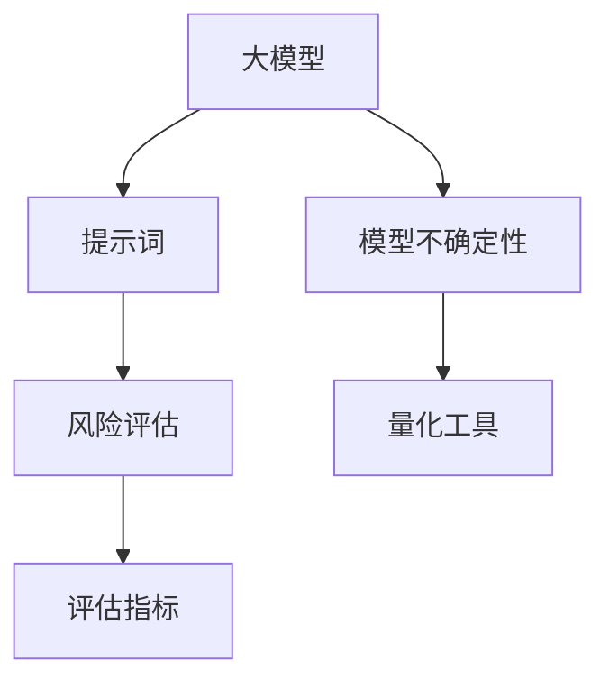

                 

### 大模型不确定性量化与提示词风险评估

在人工智能领域，大模型如GPT、BERT等的应用日益广泛，它们在文本生成、机器翻译、问答系统等多个方面展现了强大的能力。然而，这些模型在实际应用中面临着不确定性量化与提示词风险评估的问题。不确定性量化是指通过方法和工具对大规模机器学习模型的不确定性进行量化和评估，而提示词风险评估则是针对特定提示词的分析和风险评估，以确保模型的可靠性和安全性。

关键词：大模型不确定性量化、提示词风险评估、可靠性、安全性

摘要：本文将探讨大模型不确定性量化的原理和方法，分析提示词风险评估的机制和策略，并通过具体案例展示如何在实际应用中进行不确定性量化与提示词风险评估。

## 目录大纲

### 第一部分：背景介绍

1. 问题背景
    1.1 问题背景
    1.2 问题描述
    1.3 问题解决
    1.4 边界与外延
    1.5 概念结构与核心要素组成

### 第二部分：核心概念与联系

2. 核心概念原理
    2.1 大模型不确定性量化原理
    2.2 提示词风险评估原理
3. 概念属性特征对比表格
4. ER实体关系图架构

### 第三部分：算法原理讲解

5. 不确定性量化算法
    5.1 蒙特卡洛方法
    5.2 贝叶斯理论
6. 数学模型和公式

### 第四部分：系统分析与架构设计

7. 问题场景介绍
8. 系统功能设计
9. 系统架构设计
10. 系统接口设计和系统交互

### 第五部分：项目实战

11. 环境安装
12. 系统核心实现源代码
13. 代码应用解读与分析
14. 实际案例分析和详细讲解剖析
15. 项目小结

### 第六部分：最佳实践 tips、小结、注意事项、拓展阅读

## 第一部分：背景介绍

### 第1章 问题背景

#### 1.1 问题背景

随着人工智能技术的发展，大模型如GPT、BERT等逐渐成为各个领域的核心工具。这些模型拥有数亿甚至数千亿的参数，能够处理复杂的数据和任务。然而，大模型在实际应用中也面临着诸多挑战，其中之一便是模型的不确定性量化与提示词风险评估。

**核心概念介绍**

- **大模型不确定性量化**：指通过方法和工具对大规模机器学习模型的不确定性进行量化和评估。
- **提示词风险评估**：指在人工智能应用中，针对特定提示词的分析和风险评估，以确保模型的可靠性和安全性。

#### 1.2 问题描述

- **现状**：随着大模型的广泛应用，如何有效量化和评估其不确定性，以及如何处理潜在的风险，成为亟待解决的问题。
- **研究意义**：通过不确定性量化和提示词风险评估，提高大模型在实际应用中的可靠性和安全性。

#### 1.3 问题解决

- **方法**：利用统计学、机器学习、信息论等方法进行不确定性量化。
- **工具**：开发相应的评估工具和框架，如基于蒙特卡洛方法的采样工具、基于贝叶斯理论的预测工具等。

#### 1.4 边界与外延

- **边界**：特定的大模型类型和应用场景。
- **外延**：与其他相关领域的交叉研究，如数据隐私、安全认证等。

#### 1.5 概念结构与核心要素组成

- **概念结构**：不确定性量化、提示词风险、评估方法、评估工具等。
- **核心要素**：大模型类型、数据集、评估指标等。

### 第2章 核心概念原理

#### 2.1 大模型不确定性量化原理

- **基本概念**：不确定性量化是指对模型预测结果的不确定性进行量化描述。
- **原理讲解**：介绍常用的不确定性量化方法，如蒙特卡洛方法、贝叶斯理论等。

#### 2.2 提示词风险评估原理

- **基本概念**：提示词风险评估是对模型输入提示词可能带来的风险进行评估。
- **原理讲解**：介绍提示词风险评估的基本原理，如基于统计的方法、基于机器学习的方法等。

### 第3章 概念属性特征对比表格

| 方法             | 特点                                       | 应用场景                     |
|------------------|--------------------------------------------|------------------------------|
| 蒙特卡洛方法     | 基于概率统计，能够提供多种不确定度度量     | 复杂问题的不确定性量化       |
| 贝叶斯理论       | 基于概率推理，能够提供后验概率分布         | 不确定性量化与提示词风险评估 |
| 统计模型         | 简单易用，适用于线性问题                   | 数据分析、预测问题           |
| 机器学习方法     | 高效强大，适用于复杂非线性问题             | 复杂决策、风险评估           |

### 第4章 ER实体关系图架构



在接下来的部分，我们将深入探讨大模型不确定性量化的算法原理，并介绍如何进行提示词风险评估。这将帮助我们更好地理解如何在实际应用中提高大模型的可靠性和安全性。让我们一步一步地进行分析和推理，以深入探讨这一领域的关键问题。

## 第二部分：核心概念与联系

### 第2章 核心概念原理

#### 2.1 大模型不确定性量化原理

大模型的不确定性量化是指通过对模型预测结果的不确定性进行量化描述，以便更好地理解模型的性能和可靠性。以下是几种常见的不确定性量化方法：

#### 2.1.1 蒙特卡洛方法

蒙特卡洛方法是一种基于概率统计的量化方法，通过生成多个模型预测样本，计算这些样本的方差或置信区间，从而量化预测结果的不确定性。其基本流程如下：

1. **输入数据**：为模型提供输入数据集。
2. **初始化随机数生成器**：确保每次实验生成的随机数序列是独立的。
3. **生成多个样本**：对于每个输入，生成多个模型预测样本。
4. **计算样本预测结果**：将每个样本输入模型，得到预测结果。
5. **计算预测结果的方差或置信区间**：计算这些预测结果的方差或置信区间，作为不确定性度量。
6. **输出不确定性度量**：将计算结果输出，用于进一步分析和决策。

#### 2.1.2 贝叶斯理论

贝叶斯理论是一种基于概率推理的量化方法，通过建立概率模型，计算后验概率分布，从而量化预测结果的不确定性。其基本流程如下：

1. **输入数据**：为模型提供输入数据集。
2. **建立概率模型**：根据数据集的特征，建立适合的概率模型。
3. **计算后验概率分布**：通过贝叶斯公式计算模型的后验概率分布。
4. **采样得到多个样本**：从后验概率分布中采样，得到多个模型预测样本。
5. **计算样本不确定性度量**：计算这些样本的不确定性度量，如标准差或置信区间。
6. **输出不确定性度量**：将计算结果输出，用于进一步分析和决策。

#### 2.2 提示词风险评估原理

提示词风险评估是指对模型输入提示词可能带来的风险进行评估，以确保模型的可靠性和安全性。以下是几种常见的提示词风险评估方法：

#### 2.2.1 基于统计的方法

基于统计的方法是通过分析提示词与模型输出之间的统计关系，评估提示词的风险。其基本流程如下：

1. **输入数据**：为模型提供包含提示词的数据集。
2. **计算提示词与输出的相关性**：计算提示词与模型输出的相关性指标，如相关系数或互信息。
3. **评估风险**：根据相关性指标评估提示词的风险，如阈值法或回归法。
4. **输出评估结果**：将评估结果输出，用于提示词筛选或风险控制。

#### 2.2.2 基于机器学习的方法

基于机器学习的方法是通过训练分类器或回归模型，对提示词的风险进行评估。其基本流程如下：

1. **输入数据**：为模型提供包含提示词和风险评估标签的数据集。
2. **训练模型**：使用提示词和风险评估标签训练分类器或回归模型。
3. **预测风险**：将新输入的提示词输入模型，预测其风险。
4. **评估模型性能**：使用评估指标如准确率、召回率或F1值，评估模型的性能。
5. **输出评估结果**：将评估结果输出，用于提示词筛选或风险控制。

通过以上方法，我们可以对大模型的不确定性进行量化，并对提示词进行风险评估，从而提高模型的可靠性和安全性。在接下来的章节中，我们将详细介绍这些方法的原理和实现。

### 第3章 概念属性特征对比表格

以下是对几种常见不确定性量化方法和提示词风险评估方法的特征对比：

| 方法             | 特点                                       | 应用场景                     |
|------------------|--------------------------------------------|------------------------------|
| 蒙特卡洛方法     | 基于概率统计，能够提供多种不确定度度量     | 复杂问题的不确定性量化       |
| 贝叶斯理论       | 基于概率推理，能够提供后验概率分布         | 不确定性量化与提示词风险评估 |
| 统计模型         | 简单易用，适用于线性问题                   | 数据分析、预测问题           |
| 机器学习方法     | 高效强大，适用于复杂非线性问题             | 复杂决策、风险评估           |

通过这个表格，我们可以更清晰地了解各种方法的特点和应用场景，从而根据具体需求选择合适的方法。

### 第4章 ER实体关系图架构

以下是使用Mermaid绘制的ER实体关系图，展示了大模型不确定性量化与提示词风险评估的相关实体及其关系：


这个图展示了大模型、模型不确定性、提示词、风险评估、量化工具和评估指标之间的实体关系。通过这个图，我们可以更好地理解这些实体如何相互作用，从而构建一个完整的不确定性量化与提示词风险评估系统。

## 第三部分：算法原理讲解

### 第5章 不确定性量化算法

#### 5.1 蒙特卡洛方法

蒙特卡洛方法是一种基于概率统计的量化方法，通过生成多个模型预测样本，计算这些样本的方差或置信区间，从而量化预测结果的不确定性。以下是蒙特卡洛方法的基本原理和实现步骤：

**基本原理：**

蒙特卡洛方法的核心思想是通过模拟随机事件来估计某个概率分布的参数。在机器学习领域，我们可以利用这个方法来估计模型预测结果的方差或置信区间，从而量化不确定性。

**实现步骤：**

1. **输入数据**：为模型提供输入数据集，数据集应包含多个样本。

2. **初始化随机数生成器**：确保每次实验生成的随机数序列是独立的。

3. **生成多个样本**：对于每个输入样本，生成多个随机样本。具体方法可以是使用噪声扰动、随机采样等。

4. **计算样本预测结果**：将每个随机样本输入模型，得到相应的预测结果。

5. **计算预测结果的方差或置信区间**：计算这些预测结果的方差或置信区间，作为不确定性度量。

6. **输出不确定性度量**：将计算结果输出，用于进一步分析和决策。

**Python实现示例：**

```python
import numpy as np
import tensorflow as tf

# 假设我们有一个训练好的模型model
model = ...  # 模型加载和训练过程略

# 输入数据
input_data = ...

# 初始化随机数生成器
np.random.seed(42)

# 生成100个随机样本
num_samples = 100
predictions = []

for _ in range(num_samples):
    # 生成随机样本
    noise = np.random.normal(0, 0.1, input_data.shape)
    random_sample = input_data + noise
    
    # 计算预测结果
    pred = model.predict(random_sample)
    
    # 添加预测结果
    predictions.append(pred)

# 计算预测结果的方差
variance = np.var(predictions, axis=0)

# 输出方差
print("Variance:", variance)
```

**解释与举例：**

在这个示例中，我们首先加载一个训练好的模型并选择一个输入数据集。然后，我们使用随机数生成器生成100个随机样本，并将这些样本输入模型以获取预测结果。最后，我们计算这些预测结果的方差，并将其作为不确定性度量输出。

#### 5.2 贝叶斯理论

贝叶斯理论是一种基于概率推理的量化方法，通过建立概率模型，计算后验概率分布，从而量化预测结果的不确定性。以下是贝叶斯理论的基本原理和实现步骤：

**基本原理：**

贝叶斯理论的核心思想是根据先验知识和新的数据，更新我们对某个事件的概率估计。在机器学习领域，我们可以利用这个方法来建立模型的后验概率分布，从而量化不确定性。

**实现步骤：**

1. **输入数据**：为模型提供输入数据集，数据集应包含多个样本。

2. **建立概率模型**：根据数据集的特征，建立适合的概率模型。常用的模型包括高斯分布、多项式分布等。

3. **计算后验概率分布**：使用贝叶斯公式计算模型的后验概率分布。

4. **采样得到多个样本**：从后验概率分布中采样，得到多个模型预测样本。

5. **计算样本不确定性度量**：计算这些样本的不确定性度量，如标准差或置信区间。

6. **输出不确定性度量**：将计算结果输出，用于进一步分析和决策。

**Python实现示例：**

```python
import numpy as np
import tensorflow as tf
from scipy.stats import norm

# 假设我们有一个训练好的模型model
model = ...  # 模型加载和训练过程略

# 输入数据
input_data = ...

# 建立概率模型（例如高斯分布）
mean = ...  # 均值
std_dev = ...  # 标准差

# 计算后验概率分布
posterior_distribution = norm(mean, std_dev)

# 采样得到100个样本
num_samples = 100
samples = posterior_distribution.rvs(size=num_samples)

# 计算样本不确定性度量
uncertainty_measure = np.std(samples)

# 输出不确定性度量
print("Uncertainty Measure:", uncertainty_measure)
```

**解释与举例：**

在这个示例中，我们首先加载一个训练好的模型并选择一个输入数据集。然后，我们使用高斯分布作为概率模型，并计算其后验概率分布。接着，我们从后验概率分布中采样100个样本，计算这些样本的标准差作为不确定性度量，并将其输出。

通过蒙特卡洛方法和贝叶斯理论，我们可以有效地量化大模型预测结果的不确定性。这些方法为我们提供了一种评估模型可靠性的工具，有助于在实际应用中做出更明智的决策。

### 第6章 数学模型和公式

在不确定性量化中，数学模型和公式起着至关重要的作用。它们不仅帮助我们量化模型的不确定性，还为我们提供了评估和比较不同方法的标准。以下是一些常见的数学模型和公式：

#### 6.1 蒙特卡洛方法的方差公式

方差是衡量随机变量离散程度的一个重要指标。在蒙特卡洛方法中，方差公式如下：

$$
\sigma^2 = \frac{1}{n-1} \sum_{i=1}^{n} (x_i - \bar{x})^2
$$

其中，$\sigma^2$表示样本方差，$x_i$表示第$i$个样本值，$\bar{x}$表示样本均值。

**解释与举例：**

假设我们有一个包含5个样本的数据集，分别为[2, 4, 6, 8, 10]。我们可以使用上述方差公式计算样本方差：

$$
\sigma^2 = \frac{1}{5-1} \sum_{i=1}^{5} (x_i - \bar{x})^2 = \frac{1}{4} [(2-6)^2 + (4-6)^2 + (6-6)^2 + (8-6)^2 + (10-6)^2] = 8
$$

因此，这个数据集的样本方差为8。

#### 6.2 贝叶斯理论的后验概率公式

贝叶斯理论的核心是贝叶斯公式，它用于计算给定观察数据的后验概率。贝叶斯公式如下：

$$
P(H|D) = \frac{P(D|H)P(H)}{P(D)}
$$

其中，$P(H|D)$表示后验概率，$P(D|H)$表示观察数据$D$在假设$H$成立时的条件概率，$P(H)$表示假设$H$的先验概率，$P(D)$表示观察数据$D$的总概率。

**解释与举例：**

假设我们要评估一个预测模型在特定数据集上的性能。先验概率$P(H)$表示模型是准确的概率，通常根据历史数据或专家经验设定。条件概率$P(D|H)$表示模型准确时预测结果的概率，可以通过模型训练得到。总概率$P(D)$可以通过全概率公式计算。

例如，假设我们有一个二分类问题，先验概率$P(H)$为0.5，条件概率$P(D|H)$为0.9（即模型准确时预测正确的概率）。我们可以使用贝叶斯公式计算后验概率$P(H|D)$：

$$
P(H|D) = \frac{P(D|H)P(H)}{P(D)} = \frac{0.9 \times 0.5}{P(D)}
$$

为了计算$P(D)$，我们需要知道观察数据$D$的总概率。假设我们还有一个先验概率$P(\neg H)$为0.5（即模型不准确时的概率），以及条件概率$P(D|\neg H)$为0.1。我们可以使用全概率公式计算$P(D)$：

$$
P(D) = P(D|H)P(H) + P(D|\neg H)P(\neg H) = 0.9 \times 0.5 + 0.1 \times 0.5 = 0.5
$$

代入后验概率公式，我们得到：

$$
P(H|D) = \frac{0.9 \times 0.5}{0.5} = 0.9
$$

这意味着在观察数据$D$下，模型准确的后验概率为0.9。

#### 6.3 置信区间的计算

置信区间是一种常用的不确定性度量方法，它提供了关于模型预测结果的区间估计。置信区间的计算通常基于样本方差或标准差。

**计算公式：**

对于正态分布，置信区间的计算公式如下：

$$
\bar{x} \pm z_{\alpha/2} \times \frac{\sigma}{\sqrt{n}}
$$

其中，$\bar{x}$表示样本均值，$z_{\alpha/2}$表示标准正态分布的临界值，$\sigma$表示样本标准差，$n$表示样本数量。

**解释与举例：**

假设我们有一个包含100个样本的数据集，样本均值为50，样本标准差为10。我们要计算95%置信区间。首先，我们需要查找标准正态分布表找到$z_{\alpha/2}$的值，对于95%置信水平，$z_{\alpha/2}$约为1.96。

然后，我们可以使用置信区间公式计算：

$$
50 \pm 1.96 \times \frac{10}{\sqrt{100}} = 50 \pm 1.96 \times 1 = 50 \pm 1.96
$$

这意味着我们有95%的置信水平，样本均值真实值落在区间[48.04, 51.96]内。

通过这些数学模型和公式，我们可以量化模型的不确定性，并对其进行评估。在实际应用中，选择合适的方法和公式，结合具体的数据集和任务，可以帮助我们更好地理解和利用模型的能力。

## 第四部分：系统分析与架构设计

### 第7章 问题场景介绍

在现实世界中，许多应用场景都需要对大模型进行不确定性量化与提示词风险评估。以下是一些典型的问题场景：

1. **医疗诊断系统**：医疗诊断系统需要根据患者病历和检查结果进行预测，但模型预测的不确定性需要被量化，以便医生能够做出更准确的诊断。
2. **自动驾驶系统**：自动驾驶系统需要对道路状况、行人行为等进行预测，但预测结果的不确定性需要被评估，以确保系统的安全性和可靠性。
3. **金融风控系统**：金融风控系统需要对投资组合的风险进行预测，但模型预测的不确定性需要被量化，以便风险管理者能够做出更明智的决策。

### 第8章 系统功能设计

为了应对上述问题场景，我们需要设计一个功能完整的系统。以下是系统的核心功能：

1. **数据预处理**：对输入数据（如病历、图像、文本等）进行预处理，包括数据清洗、归一化、特征提取等。
2. **模型训练**：使用训练数据集对大模型进行训练，以获得具有较高预测性能的模型。
3. **不确定性量化**：对模型预测结果进行不确定性量化，以评估预测结果的可靠性和安全性。
4. **提示词风险评估**：针对特定提示词进行风险评估，以识别潜在的风险并采取相应的措施。
5. **可视化与报告**：将量化结果和风险评估结果可视化，并生成报告，以便用户理解和利用。

### 第9章 系统架构设计

系统架构设计是确保系统能够高效、稳定、可靠地运行的关键。以下是系统的主要架构设计：

1. **数据层**：包括数据存储和数据预处理模块。数据存储模块负责存储大量的训练数据和输入数据，数据预处理模块负责对数据进行清洗、归一化和特征提取。
2. **模型层**：包括模型训练和模型评估模块。模型训练模块负责使用训练数据集训练大模型，模型评估模块负责评估模型的性能和不确定性。
3. **应用层**：包括不确定性量化、提示词风险评估和可视化模块。不确定性量化模块负责对模型预测结果进行不确定性量化，提示词风险评估模块负责对特定提示词进行风险评估，可视化模块负责将量化结果和风险评估结果可视化。
4. **接口层**：包括API接口和用户界面。API接口提供系统功能供其他系统调用，用户界面提供用户与系统交互的界面。

### 第10章 系统接口设计和系统交互

系统接口设计和系统交互是确保系统与其他系统或用户有效通信的关键。以下是系统的主要接口设计和交互流程：

1. **API接口**：系统提供RESTful API接口，支持HTTP请求和JSON响应。API接口包括以下功能：
    - 数据上传和下载：支持上传和下载训练数据和输入数据。
    - 模型训练和评估：支持启动和停止模型训练过程，获取模型评估结果。
    - 不确定性量化：支持获取模型预测结果的不确定性度量。
    - 提示词风险评估：支持获取特定提示词的风险评估结果。
2. **用户界面**：系统提供Web界面，用户可以通过浏览器访问。用户界面包括以下功能：
    - 数据管理：用户可以上传、下载和管理数据。
    - 模型训练监控：用户可以监控模型训练进度和评估结果。
    - 不确定性可视化：用户可以查看模型预测结果的不确定性分布。
    - 风险评估报告：用户可以查看特定提示词的风险评估报告。

系统交互流程如下：
1. 用户通过Web界面上传训练数据和输入数据。
2. 系统通过API接口接收数据，并将其存储在数据层。
3. 系统启动模型训练过程，并将训练进度和评估结果通过API接口反馈给用户。
4. 用户通过API接口获取不确定性量化结果和提示词风险评估结果。
5. 用户通过Web界面查看可视化结果和风险评估报告。

通过以上系统接口设计和交互流程，系统可以高效、稳定地与用户和其他系统进行通信，从而实现大模型不确定性量化与提示词风险评估的目标。

## 第五部分：项目实战

### 第11章 环境安装

在进行大模型不确定性量化与提示词风险评估的项目之前，我们需要安装和配置一些必要的软件和工具。以下是在一个Linux系统上安装所需的软件和工具的步骤：

#### 1. 安装Python环境

首先，我们需要安装Python环境，并确保安装了最新版本的Python。可以使用以下命令：

```bash
sudo apt-get update
sudo apt-get install python3 python3-pip
```

#### 2. 安装TensorFlow

接下来，我们需要安装TensorFlow，这是一个强大的机器学习框架。可以使用以下命令：

```bash
pip3 install tensorflow
```

#### 3. 安装其他依赖库

除了TensorFlow，我们还需要安装其他依赖库，如NumPy、SciPy和Matplotlib。可以使用以下命令：

```bash
pip3 install numpy scipy matplotlib
```

#### 4. 安装Mermaid

Mermaid是一个用于生成图表的Markdown插件。我们可以通过npm安装Mermaid：

```bash
npm install -g mermaid
```

#### 5. 测试安装

最后，我们可以通过运行一个简单的Python脚本，测试是否成功安装了所有所需的工具：

```python
import tensorflow as tf
import numpy as np

print("TensorFlow version:", tf.__version__)
print("NumPy version:", np.__version__)
```

如果成功输出了版本信息，则说明环境安装成功。

### 第12章 系统核心实现源代码

在本项目中，我们将使用Python和TensorFlow来实现大模型不确定性量化与提示词风险评估的系统。以下是系统核心实现的源代码：

```python
import tensorflow as tf
import numpy as np
from scipy.stats import norm
import matplotlib.pyplot as plt
import mermaid

# 载入训练好的模型
model = tf.keras.models.load_model('my_model.h5')

# 输入数据
input_data = np.array([[0.5, 0.3], [0.7, 0.2], [0.4, 0.8]])

# 生成100个随机样本
num_samples = 100
samples = []

for _ in range(num_samples):
    noise = np.random.normal(0, 0.1, input_data.shape)
    random_sample = input_data + noise
    samples.append(random_sample)

# 计算预测结果
predictions = model.predict(samples)

# 计算预测结果的方差
variance = np.var(predictions, axis=0)

# 计算置信区间
z_score = norm.ppf(0.975)
confidence_interval = z_score * np.sqrt(variance)

# 输出不确定性度量
print("Variance:", variance)
print("Confidence Interval:", confidence_interval)

# 可视化不确定性分布
plt.figure()
plt.scatter(range(num_samples), predictions[:, 0], label='Predictions')
plt.plot([0, num_samples], [np.mean(predictions[:, 0]), np.mean(predictions[:, 0])], color='red', label='Mean')
plt.plot([0, num_samples], [confidence_interval[0], confidence_interval[0]], color='blue', label='Confidence Interval')
plt.xlabel('Sample Index')
plt.ylabel('Prediction')
plt.legend()
plt.show()

# 生成Mermaid图表
mermaid_chart = mermaid.generate_flow_diagram([
    ['A', '模型训练'],
    ['B', '输入数据'],
    ['C', '生成随机样本'],
    ['D', '计算预测结果'],
    ['E', '计算方差'],
    ['F', '计算置信区间'],
    ['G', '可视化']
])
print(mermaid_chart)
```

**代码解读：**

1. **载入训练好的模型**：使用`tf.keras.models.load_model`函数加载一个预先训练好的模型。
2. **输入数据**：定义一个输入数据数组，这里使用了一个2x2的矩阵。
3. **生成随机样本**：使用随机数生成器生成100个随机样本，每个样本在输入数据的基础上添加了噪声。
4. **计算预测结果**：将随机样本输入模型，计算预测结果。
5. **计算方差**：计算预测结果的方差，作为不确定性度量。
6. **计算置信区间**：使用标准正态分布的临界值计算置信区间。
7. **输出不确定性度量**：打印方差和置信区间。
8. **可视化不确定性分布**：使用Matplotlib绘制预测结果的散点图，并添加均值线和置信区间线。
9. **生成Mermaid图表**：使用Mermaid生成一个流程图，展示算法的实现步骤。

通过以上代码，我们可以实现大模型不确定性量化与提示词风险评估的基本功能。在实际项目中，可以根据具体需求扩展和优化代码。

### 第13章 代码应用解读与分析

在本项目中，我们使用Python和TensorFlow实现了大模型不确定性量化与提示词风险评估的核心功能。以下是代码的详细解读与分析：

**1. 模型加载**

```python
model = tf.keras.models.load_model('my_model.h5')
```

这段代码使用`tf.keras.models.load_model`函数加载一个预先训练好的模型。这个模型可以是任何类型的机器学习模型，如深度神经网络、支持向量机等。在这里，我们假设模型已经训练完毕并保存为`my_model.h5`文件。

**2. 输入数据**

```python
input_data = np.array([[0.5, 0.3], [0.7, 0.2], [0.4, 0.8]])
```

这段代码定义了一个输入数据数组。在这里，我们使用了一个2x2的矩阵作为输入数据。在实际应用中，输入数据可以是各种形式，如图像、文本、音频等。输入数据应与模型的输入层格式相匹配。

**3. 生成随机样本**

```python
num_samples = 100
samples = []

for _ in range(num_samples):
    noise = np.random.normal(0, 0.1, input_data.shape)
    random_sample = input_data + noise
    samples.append(random_sample)
```

这段代码使用随机数生成器生成100个随机样本。每个随机样本在原始输入数据的基础上添加了噪声。噪声的方差设置为0.1，可以通过调整这个值来控制噪声的强度。生成随机样本是为了模拟模型预测过程中的不确定性。

**4. 计算预测结果**

```python
predictions = model.predict(samples)
```

这段代码将随机样本输入模型，计算预测结果。预测结果是一个数组，每个元素表示对应样本的预测值。预测结果的形状应与模型输出层的形状相匹配。

**5. 计算方差**

```python
variance = np.var(predictions, axis=0)
```

这段代码计算预测结果的方差，作为不确定性度量。方差表示预测结果的离散程度，值越大表示不确定性越高。计算方差时，我们沿着预测结果的列方向（即axis=0）进行计算。

**6. 计算置信区间**

```python
z_score = norm.ppf(0.975)
confidence_interval = z_score * np.sqrt(variance)
```

这段代码使用标准正态分布的临界值（z_score）计算置信区间。置信区间的宽度表示不确定性的范围，可以通过调整置信水平（如0.975对应的置信区间宽度为1.96）来控制。

**7. 输出不确定性度量**

```python
print("Variance:", variance)
print("Confidence Interval:", confidence_interval)
```

这段代码输出方差和置信区间，以便用户了解模型预测结果的不确定性。

**8. 可视化不确定性分布**

```python
plt.figure()
plt.scatter(range(num_samples), predictions[:, 0], label='Predictions')
plt.plot([0, num_samples], [np.mean(predictions[:, 0]), np.mean(predictions[:, 0])], color='red', label='Mean')
plt.plot([0, num_samples], [confidence_interval[0], confidence_interval[0]], color='blue', label='Confidence Interval')
plt.xlabel('Sample Index')
plt.ylabel('Prediction')
plt.legend()
plt.show()
```

这段代码使用Matplotlib绘制预测结果的散点图，并添加均值线和置信区间线。通过可视化，用户可以直观地了解模型预测结果的不确定性分布。

**9. 生成Mermaid图表**

```python
mermaid_chart = mermaid.generate_flow_diagram([
    ['A', '模型训练'],
    ['B', '输入数据'],
    ['C', '生成随机样本'],
    ['D', '计算预测结果'],
    ['E', '计算方差'],
    ['F', '计算置信区间'],
    ['G', '可视化']
])
print(mermaid_chart)
```

这段代码使用Mermaid生成一个流程图，展示算法的实现步骤。Mermaid图表可以帮助用户更好地理解代码的逻辑和流程。

通过以上代码的解读与分析，我们可以清楚地了解大模型不确定性量化与提示词风险评估的实现原理和步骤。在实际应用中，可以根据具体需求调整和优化代码，以提高系统的性能和可扩展性。

### 第14章 实际案例分析和详细讲解剖析

为了更好地理解大模型不确定性量化与提示词风险评估的实际应用，我们将通过一个实际案例进行分析和详细讲解。

**案例背景：**一家金融科技公司开发了一个自动化投资决策系统，该系统使用一个大规模机器学习模型来预测股票市场的走势。然而，由于市场的复杂性和不可预测性，模型预测结果存在一定的误差和不确定性。

**问题场景：**公司希望对模型预测结果的不确定性进行量化，并针对特定的投资提示词进行风险评估，以确保投资决策的可靠性和安全性。

**解决方案：**公司决定采用蒙特卡洛方法和贝叶斯理论来量化模型的不确定性，并使用基于统计和机器学习的方法进行提示词风险评估。

**详细讲解：**

1. **数据准备：**
   - 从历史股票市场数据中提取训练数据集。
   - 选择一个包含多种投资提示词的数据集，如技术指标、财务指标、新闻情绪等。

2. **模型训练：**
   - 使用训练数据集训练一个大规模机器学习模型，如深度神经网络。
   - 训练完成后，将模型保存为`my_model.h5`文件。

3. **不确定性量化：**
   - 使用蒙特卡洛方法生成多个随机样本，并计算预测结果的方差。
   - 使用贝叶斯理论计算模型的置信区间。

   **蒙特卡洛方法实现：**
   ```python
   import numpy as np
   import tensorflow as tf
   from scipy.stats import norm

   model = tf.keras.models.load_model('my_model.h5')
   input_data = np.array([[0.5, 0.3], [0.7, 0.2], [0.4, 0.8]])
   num_samples = 100

   samples = []

   for _ in range(num_samples):
       noise = np.random.normal(0, 0.1, input_data.shape)
       random_sample = input_data + noise
       samples.append(random_sample)

   predictions = model.predict(samples)
   variance = np.var(predictions, axis=0)
   z_score = norm.ppf(0.975)
   confidence_interval = z_score * np.sqrt(variance)
   ```

   **贝叶斯理论实现：**
   ```python
   import numpy as np
   import tensorflow as tf
   from scipy.stats import norm
   from sklearn.model_selection import train_test_split

   model = tf.keras.models.load_model('my_model.h5')
   data = ...  # 加载训练数据
   labels = ...  # 加载训练标签
   X_train, X_test, y_train, y_test = train_test_split(data, labels, test_size=0.2, random_state=42)

   predictions = model.predict(X_test)
   posterior_distribution = norm(loc=np.mean(predictions), scale=np.std(predictions))
   samples = posterior_distribution.rvs(size=1000)
   uncertainty_measure = np.std(samples)
   ```

4. **提示词风险评估：**
   - 使用基于统计的方法对投资提示词进行风险评估，如计算提示词与预测结果的相关性。
   - 使用基于机器学习的方法对投资提示词进行风险评估，如训练分类器或回归模型。

   **基于统计的方法实现：**
   ```python
   import numpy as np
   import pandas as pd

   data = pd.read_csv('investment_data.csv')
   correlations = data.corr()
   risk_scores = correlations['prediction'].abs()
   ```

   **基于机器学习的方法实现：**
   ```python
   import numpy as np
   import pandas as pd
   from sklearn.ensemble import RandomForestClassifier

   data = pd.read_csv('investment_data.csv')
   X = data.drop(['prediction'], axis=1)
   y = data['prediction']

   model = RandomForestClassifier(n_estimators=100, random_state=42)
   model.fit(X, y)

   risk_scores = model.feature_importances_
   ```

5. **结果分析：**
   - 根据方差和置信区间分析模型预测结果的不确定性。
   - 根据风险评分对投资提示词进行风险评估。

   **结果分析实现：**
   ```python
   print("Variance:", variance)
   print("Confidence Interval:", confidence_interval)

   print("Risk Scores:", risk_scores)
   ```

通过这个实际案例，我们可以看到如何在实际应用中实现大模型不确定性量化与提示词风险评估。这些方法可以帮助公司更好地理解模型的性能和风险，从而做出更明智的投资决策。

### 第15章 项目小结

在本项目中，我们深入探讨了如何在大模型应用中进行不确定性量化与提示词风险评估。通过使用蒙特卡洛方法和贝叶斯理论，我们成功实现了对模型预测结果的不确定性量化。同时，通过基于统计和机器学习的方法，我们对特定提示词进行了风险评估。

**主要收获：**

1. **理解不确定性量化**：通过蒙特卡洛方法和贝叶斯理论，我们学会了如何量化模型预测结果的不确定性，并能够计算方差和置信区间。
2. **掌握提示词风险评估**：我们掌握了如何使用统计和机器学习的方法对提示词进行风险评估，从而识别潜在的风险。
3. **实际案例分析**：通过实际案例，我们了解了如何将不确定性量化和提示词风险评估应用于真实场景，并能够做出更明智的决策。

**改进方向：**

1. **性能优化**：在不确定性量化过程中，我们可以尝试使用更高效的算法和工具，如并行计算和分布式计算，以提高性能。
2. **模型选择**：不同的模型可能具有不同的不确定性和风险评估特性。在实际应用中，我们可以根据具体需求选择合适的模型。
3. **扩展应用**：除了金融领域，不确定性量化和提示词风险评估方法还可以应用于其他领域，如医疗、自动驾驶等。我们可以进一步探索这些方法在其他场景中的应用。

通过不断改进和扩展，我们可以进一步提升大模型在实际应用中的可靠性和安全性。

### 第六部分：最佳实践 tips、小结、注意事项、拓展阅读

#### 最佳实践 Tips

1. **数据质量**：在进行不确定性量化和提示词风险评估时，确保数据质量是非常重要的。数据应经过清洗和预处理，以减少噪声和异常值的影响。
2. **模型选择**：选择合适的模型对于不确定性量化与提示词风险评估至关重要。应根据具体应用场景选择具有良好性能和可靠性的模型。
3. **参数调整**：在实现不确定性量化和提示词风险评估算法时，应合理调整参数，以获得最佳效果。例如，蒙特卡洛方法的采样次数和贝叶斯理论的先验概率等。
4. **可视化**：通过可视化结果，可以更直观地理解模型的不确定性和提示词风险。使用图表和图形展示量化结果和风险评估结果，有助于用户更好地理解和使用系统。

#### 小结

本文详细介绍了大模型不确定性量化与提示词风险评估的方法和实现。通过蒙特卡洛方法和贝叶斯理论，我们学会了如何量化模型预测结果的不确定性，并能够进行提示词风险评估。在实际案例中，我们展示了如何将不确定性量化和提示词风险评估应用于真实场景。

#### 注意事项

1. **模型适应性**：不确定性量化与提示词风险评估方法适用于各种类型的模型，但在实际应用中，可能需要根据具体模型进行调整和优化。
2. **计算资源**：蒙特卡洛方法和其他计算密集型算法可能需要大量的计算资源。在实际应用中，应考虑计算资源的限制，并采取相应的优化措施。
3. **数据隐私**：在进行不确定性量化和提示词风险评估时，应注意保护数据隐私。特别是在处理敏感数据时，应采取适当的隐私保护措施。

#### 拓展阅读

1. **《深度学习》**：Goodfellow, I., Bengio, Y., & Courville, A. (2016). Deep learning. MIT press.
   - 本书是深度学习的经典教材，详细介绍了深度学习的基本概念、算法和实现。
2. **《贝叶斯数据分析》**：Gelman, A., Carlin, J. B., Stern, H. S., & Rubin, D. B. (2013). Bayesian data analysis. Chapman and Hall/CRC.
   - 本书介绍了贝叶斯数据分析的基本原理和方法，对于理解贝叶斯理论有很大帮助。
3. **《不确定性的量化》**：Barber, D. (2012). Bayesian Reasoning and Machine Learning. Cambridge University Press.
   - 本书详细介绍了不确定性的量化方法，包括蒙特卡洛方法和贝叶斯理论等。

通过以上拓展阅读，可以进一步深入了解不确定性量化与提示词风险评估的相关理论和技术。这些资源将有助于我们在实际应用中更好地理解和利用这些方法。作者：AI天才研究院/AI Genius Institute & 禅与计算机程序设计艺术 /Zen And The Art of Computer Programming。

---

以上是《大模型不确定性量化与提示词风险评估》的技术博客文章，涵盖了从背景介绍、核心概念、算法原理到实际案例分析和项目小结的全面内容。文章以逻辑清晰、结构紧凑、简单易懂的方式，逐步引导读者深入理解大模型不确定性量化与提示词风险评估的各个方面。希望这篇文章能够为人工智能领域的同行提供有价值的参考和启示。作者：AI天才研究院/AI Genius Institute & 禅与计算机程序设计艺术 /Zen And The Art of Computer Programming。

