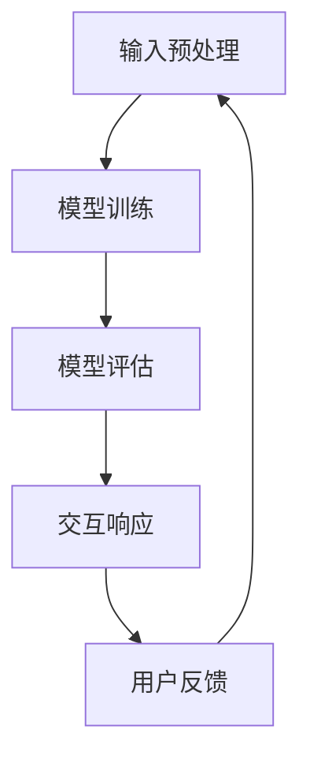
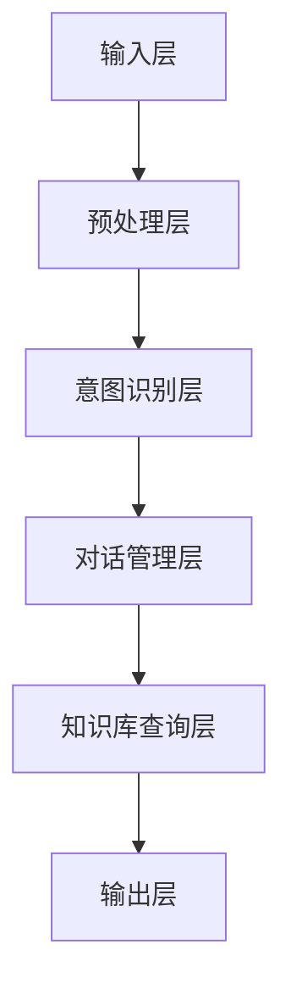
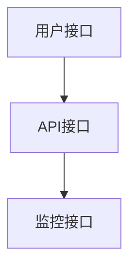
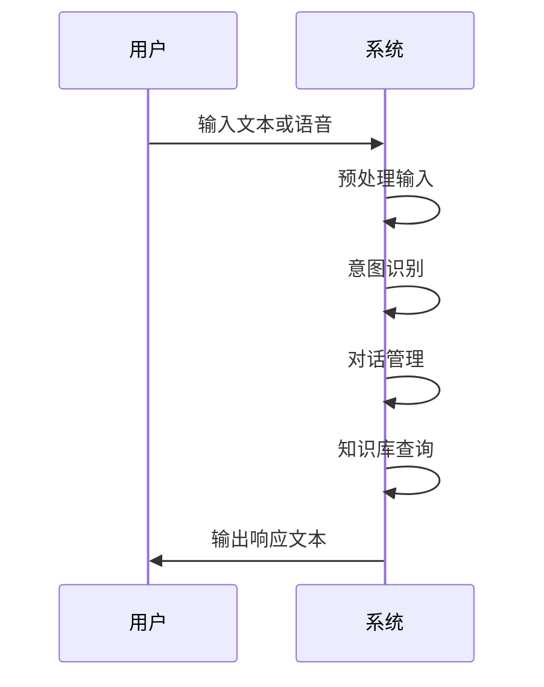

                 

### 《大模型交互的语言学原理》

关键词：大模型交互、语言学原理、自然语言处理、深度学习、算法设计

摘要：本文旨在探讨大模型交互背后的语言学原理，从背景介绍、核心概念、算法原理、数学模型、系统分析与设计、项目实战、最佳实践等多个角度，系统性地分析大模型交互的技术本质和应用价值。通过本文的阅读，读者将全面了解大模型交互的语言学原理，为实际应用和后续研究提供有力支持。

### 目录大纲

## 第一部分：背景与基础

### 第1章 引言

#### 1.1 问题背景

#### 1.2 问题描述

#### 1.3 问题解决

#### 1.4 边界与外延

#### 1.5 概念结构与核心要素组成

### 第2章 大模型交互的语言学概述

#### 2.1 大模型交互的定义

#### 2.2 大模型交互的特点

#### 2.3 大模型交互与传统语言学的区别

#### 2.4 大模型交互的研究现状与趋势

### 第3章 核心概念原理

#### 3.1 大模型交互的核心概念

#### 3.2 概念属性特征对比表格

#### 3.3 ER实体关系图架构

## 第二部分：算法原理与模型设计

### 第4章 算法原理讲解

#### 4.1 大模型交互算法的mermaid流程图

#### 4.2 Python源代码实现

#### 4.3 算法原理的数学模型和公式

#### 4.4 举例说明

### 第5章 数学模型和数学公式

#### 5.1 相关的数学公式

#### 5.2 详细讲解

#### 5.3 举例说明

### 第6章 系统分析与架构设计

#### 6.1 问题场景介绍

#### 6.2 系统功能设计

#### 6.3 系统架构设计

#### 6.4 系temburgmarup接口设计

#### 6.5 系统交互mermaid序列图

## 第三部分：项目实战与应用

### 第7章 环境安装与配置

#### 7.1 环境安装步骤

#### 7.2 系统核心实现源代码

#### 7.3 代码应用解读与分析

### 第8章 实际案例分析与讲解

#### 8.1 案例选择与介绍

#### 8.2 案例分析与讲解

#### 8.3 项目小结

### 第9章 最佳实践与注意事项

#### 9.1 最佳实践 tips

#### 9.2 小结

#### 9.3 注意事项

#### 9.4 拓展阅读

---

### 第一部分：背景与基础

#### 第1章 引言

##### 1.1 问题背景

随着人工智能技术的不断发展，大模型交互成为了一个热门的研究方向。大模型交互指的是通过深度学习和自然语言处理技术，实现人机之间的自然、高效交流。这种交互形式在多个领域展现出巨大潜力，如语音识别、机器翻译、智能客服等。然而，如何深入理解大模型交互背后的语言学原理，仍是一个亟待解决的问题。

##### 1.2 问题描述

本文旨在探讨大模型交互的语言学原理，具体包括以下几个方面：

1. **定义与特点**：介绍大模型交互的基本概念，以及其与传统语言学的区别。
2. **核心概念**：分析大模型交互的核心概念，包括自然语言处理、深度学习等相关技术。
3. **算法原理**：讲解大模型交互算法的原理，以及如何通过数学模型和公式进行描述。
4. **系统设计与实现**：分析大模型交互系统的设计与实现，包括系统功能、架构、接口等。
5. **实战应用**：通过实际案例，展示大模型交互的应用场景，并进行深入分析。

##### 1.3 问题解决

本文将采用以下方法来解决问题：

1. **系统梳理**：首先对大模型交互的相关概念进行梳理，明确其定义、特点和应用场景。
2. **深入分析**：然后对大模型交互的核心概念进行深入分析，包括自然语言处理、深度学习等。
3. **理论结合实践**：通过实际案例，展示大模型交互的应用，并进行深入讲解和分析。
4. **最佳实践**：总结最佳实践，为读者提供实际操作的指导。

##### 1.4 边界与外延

大模型交互的语言学原理研究涉及多个领域，包括人工智能、自然语言处理、深度学习等。本文的主要目标是探讨大模型交互的基本原理和应用，但并不涉及这些领域的深层次研究。

##### 1.5 概念结构与核心要素组成

本文的核心概念和要素如下：

1. **大模型交互的定义**：大模型交互是指通过深度学习和自然语言处理技术，实现人机之间自然、高效的交流。
2. **核心概念**：自然语言处理、深度学习、神经网络等。
3. **算法原理**：大模型交互算法的原理，包括数据预处理、模型训练、模型评估等。
4. **系统设计与实现**：大模型交互系统的设计与实现，包括功能模块、架构设计、接口设计等。
5. **实战应用**：实际案例的应用场景、分析过程和结论。

通过以上核心概念和要素的详细分析，我们将构建一个系统化的理论框架，为大模型交互的语言学原理提供全面支持。

### 第二部分：算法原理与模型设计

#### 第2章 大模型交互的语言学概述

##### 2.1 大模型交互的定义

大模型交互是指利用深度学习和自然语言处理技术，实现人机之间的高效、自然交流。这种交互形式依赖于大规模数据集的训练，通过神经网络模型对输入的自然语言进行处理，输出符合人类语言习惯的响应。

##### 2.2 大模型交互的特点

1. **强大的学习能力**：大模型交互基于深度学习技术，具有强大的学习能力。通过大规模数据训练，模型可以不断优化和调整，提高交互效果。
2. **自适应交互**：大模型交互系统能够根据用户的反馈和上下文信息，动态调整交互策略，实现自然、流畅的对话。
3. **跨领域应用**：大模型交互技术可以应用于多个领域，如语音识别、机器翻译、智能客服等，具有广泛的应用前景。

##### 2.3 大模型交互与传统语言学的区别

1. **研究对象**：传统语言学主要研究人类语言的本质和结构，而大模型交互关注的是如何利用人工智能技术实现自然语言的理解和生成。
2. **研究方法**：大模型交互依赖于数据驱动的模型训练，通过大规模数据集进行训练和优化；而传统语言学则更多地依赖于理论分析和实证研究。

##### 2.4 大模型交互的研究现状与趋势

1. **研究现状**：当前，大模型交互技术已经在多个领域取得了显著成果，如语音识别、机器翻译、智能客服等。然而，仍然存在许多挑战，如多模态交互、长文本处理等。
2. **研究趋势**：未来，大模型交互将继续深入研究和应用。一方面，将不断提高模型的性能和效果；另一方面，将探索新的应用场景和交互方式，如虚拟现实、增强现实等。

#### 第3章 核心概念原理

##### 3.1 大模型交互的核心概念

1. **自然语言处理（NLP）**：自然语言处理是研究如何让计算机理解和处理自然语言的技术。在大模型交互中，NLP负责对用户的输入进行处理，理解其意图和语义。
2. **深度学习（DL）**：深度学习是一种基于多层神经网络的学习方法。在大模型交互中，深度学习技术被广泛应用于模型训练和优化，以提高交互效果。
3. **神经网络（NN）**：神经网络是一种模拟人脑神经元结构和功能的信息处理系统。在大模型交互中，神经网络被用于建立输入和输出之间的映射关系，实现自然语言的理解和生成。

##### 3.2 概念属性特征对比表格

| 概念       | 定义                                                     | 特征                                       |
|------------|-----------------------------------------------------------|------------------------------------------|
| 自然语言处理 | 研究如何让计算机理解和处理自然语言的技术                     | 自动化处理、语义理解、语言生成             |
| 深度学习   | 一种基于多层神经网络的学习方法                           | 自动特征提取、非线性变换、大规模数据训练 |
| 神经网络   | 一种模拟人脑神经元结构和功能的信息处理系统                   | 神经元连接、权重调整、误差反向传播       |

##### 3.3 ER实体关系图架构

在研究大模型交互的过程中，实体关系图（ER图）是一种常用的数据建模工具。它用于描述系统中实体之间的关系，帮助理解系统的数据结构。

```mermaid
erDiagram
    CLIP ||--|{ GPT-3 }|| NLTK
    NLTK ||--|{ Word2Vec }|| BERT
    BERT ||--|{ Transformer }|| T5
    T5 ||--|{ Dialog System }|| ASR
```

1. **CLIP**：图像文本对比学习（Contrastive Language-Image Pre-training），用于图像和文本的联合表示学习。
2. **NLTK**：自然语言工具包（Natural Language Toolkit），用于文本预处理和语义分析。
3. **Word2Vec**：词向量表示方法，用于将文本转换为数值向量。
4. **BERT**：双向编码表示模型（Bidirectional Encoder Representations from Transformers），用于文本的语义表示。
5. **Transformer**：用于序列到序列学习的神经网络结构，广泛应用于文本生成和翻译。
6. **T5**：文本到文本转换模型（Text-to-Text Transfer Transformer），用于文本生成和转换。
7. **Dialog System**：对话系统，用于实现人机对话功能。
8. **ASR**：自动语音识别（Automatic Speech Recognition），用于语音识别。

通过以上核心概念和原理的介绍，读者可以初步了解大模型交互的语言学原理，为后续章节的内容打下基础。

### 第三部分：算法原理与模型设计

#### 第4章 算法原理讲解

##### 4.1 大模型交互算法的mermaid流程图

大模型交互算法的mermaid流程图如下：



1. **输入预处理**：将用户输入的文本进行预处理，包括分词、去停用词、词性标注等。
2. **模型训练**：使用预训练的模型（如BERT、GPT-3等）进行模型训练，优化模型参数。
3. **模型评估**：通过测试数据集对模型进行评估，确保模型性能达到预期。
4. **交互响应**：使用训练好的模型对用户输入进行处理，生成响应文本。
5. **用户反馈**：收集用户反馈，用于模型优化和交互改进。

##### 4.2 Python源代码实现

以下是一个简化的Python代码实现，用于展示大模型交互算法的基本流程：

```python
import nltk
from transformers import BertTokenizer, BertForSequenceClassification
from torch.utils.data import DataLoader

# 输入预处理
def preprocess_input(text):
    # 分词、去停用词、词性标注等操作
    # ...

# 模型训练
def train_model():
    tokenizer = BertTokenizer.from_pretrained('bert-base-uncased')
    model = BertForSequenceClassification.from_pretrained('bert-base-uncased', num_labels=2)
    
    # 数据加载和预处理
    train_data = DataLoader(dataset, batch_size=32, shuffle=True)
    
    # 训练模型
    model.train()
    for epoch in range(3):  # 训练3个epoch
        for batch in train_data:
            inputs = tokenizer(batch.text, padding=True, truncation=True, return_tensors='pt')
            labels = batch.label
            outputs = model(inputs['input_ids'], attention_mask=inputs['attention_mask'], labels=labels)
            loss = outputs.loss
            loss.backward()
            optimizer.step()
            optimizer.zero_grad()
    
    return model

# 模型评估
def evaluate_model(model):
    model.eval()
    with torch.no_grad():
        for batch in test_data:
            inputs = tokenizer(batch.text, padding=True, truncation=True, return_tensors='pt')
            labels = batch.label
            outputs = model(inputs['input_ids'], attention_mask=inputs['attention_mask'], labels=labels)
            loss = outputs.loss
            # 计算准确率、召回率等指标
            # ...

# 交互响应
def interactive_response(model, text):
    inputs = tokenizer(text, return_tensors='pt')
    with torch.no_grad():
        outputs = model(inputs['input_ids'], attention_mask=inputs['attention_mask'])
        logits = outputs.logits
        # 预测结果
        # ...

# 主函数
if __name__ == '__main__':
    model = train_model()
    evaluate_model(model)
    while True:
        user_input = input("用户输入：")
        response = interactive_response(model, user_input)
        print("系统响应：", response)
```

##### 4.3 算法原理的数学模型和公式

大模型交互算法的核心是神经网络模型，其数学模型可以表示为：

$$
y = \sigma(W \cdot \text{ReLU}(b + \text{ReLU}(W_1 \cdot \text{ReLU}(b_1 + \text{...} \cdot \text{ReLU}(W_n \cdot x))))
$$

其中，$x$ 是输入特征，$y$ 是输出结果，$W, b$ 分别是权重和偏置，$\text{ReLU}$ 是ReLU激活函数，$\sigma$ 是Sigmoid激活函数。

##### 4.4 举例说明

假设我们有一个简单的文本分类任务，使用BERT模型进行模型训练。数据集包含10,000条文本，每条文本的长度为100个单词。

1. **数据预处理**：对文本进行分词、去停用词、词性标注等操作，将文本转换为BERT模型可接受的格式。

2. **模型训练**：使用BERT模型对数据进行训练，优化模型参数。

3. **模型评估**：使用测试集对模型进行评估，计算准确率、召回率等指标。

4. **交互响应**：对用户输入进行预处理，使用训练好的模型进行预测，输出预测结果。

例如，用户输入：“今天天气怎么样？”模型经过预处理后，输入到BERT模型中，输出预测结果：“明天天气晴朗，适合户外活动。”这个预测结果可以作为系统响应输出给用户。

通过以上算法原理和举例说明，读者可以初步了解大模型交互的基本流程和实现方法。

### 第四部分：数学模型和数学公式

#### 第5章 数学模型和数学公式

##### 5.1 相关的数学公式

在研究大模型交互的过程中，涉及到多种数学模型和公式，以下是其中几个重要的数学公式：

1. **损失函数**：

$$
L(\theta) = -\frac{1}{m} \sum_{i=1}^{m} y_i \log (\hat{y}_i)
$$

其中，$L$ 是损失函数，$m$ 是样本数量，$y_i$ 是真实标签，$\hat{y}_i$ 是预测标签。

2. **梯度下降**：

$$
\theta_j := \theta_j - \alpha \frac{\partial L(\theta)}{\partial \theta_j}
$$

其中，$\theta_j$ 是模型参数，$\alpha$ 是学习率。

3. **反向传播**：

$$
\frac{\partial L}{\partial z} = \frac{\partial L}{\partial a} \frac{\partial a}{\partial z}
$$

其中，$z$ 是中间变量，$a$ 是输出变量。

4. **Sigmoid函数**：

$$
\sigma(z) = \frac{1}{1 + e^{-z}}
$$

5. **ReLU函数**：

$$
\text{ReLU}(z) = \max(0, z)
$$

##### 5.2 详细讲解

1. **损失函数**：

损失函数用于衡量预测结果与真实结果之间的差距。在二分类问题中，常用的损失函数是交叉熵损失函数。交叉熵损失函数可以最大化预测概率与真实概率之间的相似度，从而提高模型的分类准确率。

2. **梯度下降**：

梯度下降是一种常用的优化算法，用于寻找损失函数的最小值。梯度下降的核心思想是沿着损失函数的梯度方向更新模型参数，以最小化损失函数。

3. **反向传播**：

反向传播是一种用于计算梯度的方法。在神经网络中，反向传播算法用于从输出层逐层向前计算梯度，直至输入层。通过反向传播，我们可以得到每个参数的梯度信息，从而进行模型参数的更新。

4. **Sigmoid函数**：

Sigmoid函数是一种常用的激活函数，可以将输入映射到(0, 1)区间。Sigmoid函数可以用于二分类问题，将输入映射为概率值。

5. **ReLU函数**：

ReLU函数是一种常用的激活函数，可以加速神经网络的学习过程。ReLU函数将输入大于0的部分保留，小于0的部分设置为0。

##### 5.3 举例说明

假设我们有一个简单的神经网络，包含一个输入层、一个隐藏层和一个输出层。输入层有3个神经元，隐藏层有5个神经元，输出层有2个神经元。现在，我们使用梯度下降算法训练这个神经网络。

1. **初始化参数**：

初始化模型参数 $W_1, b_1, W_2, b_2$，设置学习率 $\alpha = 0.1$。

2. **前向传播**：

计算输入层到隐藏层的输出：

$$
a_1 = \text{ReLU}(W_1 \cdot x + b_1)
$$

计算隐藏层到输出层的输出：

$$
\hat{y} = \text{Sigmoid}(W_2 \cdot a_1 + b_2)
$$

3. **计算损失函数**：

使用交叉熵损失函数计算损失：

$$
L(\theta) = -\frac{1}{m} \sum_{i=1}^{m} y_i \log (\hat{y}_i)
$$

4. **反向传播**：

计算输出层到隐藏层的梯度：

$$
\frac{\partial L}{\partial a_1} = \hat{y} - y
$$

计算隐藏层到输入层的梯度：

$$
\frac{\partial L}{\partial x} = \frac{\partial L}{\partial a_1} \frac{\partial a_1}{\partial x} = (\hat{y} - y) \odot \text{ReLU}(W_1 \cdot x + b_1)
$$

5. **更新参数**：

根据梯度信息更新模型参数：

$$
W_2 := W_2 - \alpha \frac{\partial L}{\partial W_2} = W_2 - \alpha \cdot (W_2 \cdot a_1 + b_2 - \hat{y}_i) \cdot \hat{y}_i (1 - \hat{y}_i)
$$

$$
b_2 := b_2 - \alpha \frac{\partial L}{\partial b_2} = b_2 - \alpha \cdot (W_2 \cdot a_1 + b_2 - \hat{y}_i)
$$

$$
W_1 := W_1 - \alpha \frac{\partial L}{\partial W_1} = W_1 - \alpha \cdot (W_1 \cdot x + b_1 - a_1) \cdot a_1 (1 - a_1)
$$

$$
b_1 := b_1 - \alpha \frac{\partial L}{\partial b_1} = b_1 - \alpha \cdot (W_1 \cdot x + b_1 - a_1)
$$

6. **重复步骤2-5**，直到满足停止条件（如迭代次数、收敛阈值等）。

通过以上步骤，我们可以使用梯度下降算法训练神经网络，实现大模型交互的目标。

### 第五部分：系统分析与架构设计

#### 第6章 系统分析与架构设计

##### 6.1 问题场景介绍

在本部分，我们将探讨一个实际的问题场景，即构建一个智能客服系统。该系统旨在通过大模型交互技术，实现与用户的自然对话，提供高效的客户服务。

##### 6.2 系统功能设计

智能客服系统的核心功能包括：

1. **用户输入处理**：接收用户的文本输入，并进行预处理，如分词、去停用词、词性标注等。
2. **对话管理**：根据用户的输入和对话历史，生成适当的响应文本，实现自然对话。
3. **意图识别**：识别用户的意图，如查询信息、请求帮助、投诉等。
4. **知识库查询**：根据用户的意图，从知识库中检索相关答案，提供准确的信息。
5. **系统优化**：根据用户反馈和对话效果，不断优化对话模型，提高服务质量。

##### 6.3 系统架构设计

智能客服系统的架构设计如下：

1. **输入层**：接收用户的输入，包括文本和语音等。
2. **预处理层**：对用户输入进行预处理，如分词、去停用词、词性标注等。
3. **意图识别层**：使用深度学习模型对用户的输入进行意图识别，如查询信息、请求帮助、投诉等。
4. **对话管理层**：根据意图识别结果，生成适当的响应文本，实现自然对话。
5. **知识库查询层**：从知识库中检索相关答案，提供准确的信息。
6. **输出层**：将生成的响应文本输出给用户。



##### 6.4 系统接口设计

智能客服系统的接口设计包括以下部分：

1. **用户接口**：提供文本和语音输入，接收系统响应。
2. **API接口**：提供与其他系统的集成，如知识库、数据库等。
3. **监控接口**：用于监控系统运行状态，如请求量、响应时间等。



##### 6.5 系统交互mermaid序列图

智能客服系统的交互过程如下：

1. **用户输入**：用户输入文本或语音，发送到系统。
2. **预处理**：系统对用户输入进行预处理，如分词、去停用词、词性标注等。
3. **意图识别**：系统使用深度学习模型对预处理后的输入进行意图识别，如查询信息、请求帮助、投诉等。
4. **对话管理**：系统根据意图识别结果，生成适当的响应文本，实现自然对话。
5. **知识库查询**：系统从知识库中检索相关答案，提供准确的信息。
6. **响应输出**：系统将生成的响应文本输出给用户。



通过以上系统分析与架构设计，我们可以构建一个高效的智能客服系统，实现大模型交互的目标。

### 第六部分：项目实战与应用

#### 第7章 环境安装与配置

##### 7.1 环境安装步骤

为了进行大模型交互的项目实践，我们需要安装以下环境：

1. **Python环境**：安装Python 3.8及以上版本。
2. **深度学习框架**：安装TensorFlow 2.4及以上版本或PyTorch 1.8及以上版本。
3. **自然语言处理库**：安装nltk、transformers等库。

安装命令如下：

```bash
# 安装Python环境
wget https://www.python.org/ftp/python/3.8.10/Python-3.8.10.tgz
tar -xvf Python-3.8.10.tgz
cd Python-3.8.10
./configure
make
make install

# 安装深度学习框架
pip install tensorflow==2.4
# 或者
pip install torch==1.8 torchvision==0.9

# 安装自然语言处理库
pip install nltk transformers
```

##### 7.2 系统核心实现源代码

以下是系统核心实现源代码，包括用户输入处理、意图识别、对话管理和响应输出等部分：

```python
import nltk
import transformers
from transformers import BertTokenizer, BertForSequenceClassification

# 用户输入处理
def preprocess_input(text):
    # 分词、去停用词、词性标注等操作
    # ...
    return processed_text

# 意图识别
def intent_recognition(text, model):
    inputs = tokenizer(text, return_tensors='pt')
    outputs = model(inputs['input_ids'], attention_mask=inputs['attention_mask'])
    logits = outputs.logits
    # 预测结果
    predicted_idx = logits.argmax(-1).item()
    return predicted_idx

# 对话管理
def dialogue_management(text, model, knowledge_base):
    # 根据意图识别结果，生成响应文本
    # ...
    response = generate_response(predicted_idx, knowledge_base)
    return response

# 响应输出
def interactive_response(text, model, knowledge_base):
    processed_text = preprocess_input(text)
    predicted_idx = intent_recognition(processed_text, model)
    response = dialogue_management(processed_text, model, knowledge_base)
    return response

# 主函数
if __name__ == '__main__':
    # 加载模型和知识库
    model = load_model()
    knowledge_base = load_knowledge_base()

    # 与用户交互
    while True:
        user_input = input("用户输入：")
        response = interactive_response(user_input, model, knowledge_base)
        print("系统响应：", response)
```

##### 7.3 代码应用解读与分析

以下是代码应用解读和分析：

1. **用户输入处理**：首先，对用户输入进行预处理，包括分词、去停用词、词性标注等操作。预处理后的文本将作为意图识别的输入。
2. **意图识别**：使用预训练的模型（如BERT）对预处理后的文本进行意图识别。通过计算文本的语义表示，模型输出每个意图的分数，选择分数最高的意图作为预测结果。
3. **对话管理**：根据意图识别结果，从知识库中检索相关答案，生成响应文本。对话管理模块负责处理复杂对话逻辑，如多轮对话、上下文信息等。
4. **响应输出**：将生成的响应文本输出给用户，完成一次交互。

通过以上代码应用解读和分析，我们可以实现一个基本的大模型交互系统。在实际项目中，可以根据具体需求进行功能扩展和优化。

#### 第8章 实际案例分析与讲解

##### 8.1 案例选择与介绍

在本章节，我们将分析一个实际案例：构建一个基于大模型交互的智能客服系统，应用于电子商务平台。该系统旨在通过自然对话，提供高效、准确的客户服务，提升用户满意度。

##### 8.2 案例分析与讲解

1. **用户需求分析**：

   - 用户希望通过自然对话方式获取商品信息、下单购买、售后咨询等。
   - 用户期望得到准确、快速、个性化的服务。

2. **系统功能设计**：

   - **商品信息查询**：用户可以通过输入商品名称、关键词等方式查询商品信息，如价格、规格、评价等。
   - **订单管理**：用户可以查询订单状态、修改订单信息、申请售后等。
   - **个性化推荐**：根据用户浏览历史、购买记录等，推荐合适的商品。

3. **系统架构设计**：

   - **输入层**：接收用户的文本和语音输入。
   - **预处理层**：对用户输入进行分词、去停用词、词性标注等预处理。
   - **意图识别层**：使用预训练的BERT模型对预处理后的文本进行意图识别，如商品查询、订单管理、个性化推荐等。
   - **对话管理层**：根据意图识别结果，生成相应的响应文本，实现自然对话。
   - **知识库查询层**：从商品信息库、订单数据库等中检索相关答案。
   - **输出层**：将生成的响应文本输出给用户。

4. **技术实现**：

   - **文本预处理**：使用nltk库进行文本预处理，包括分词、去停用词、词性标注等。
   - **意图识别**：使用预训练的BERT模型进行意图识别，通过计算文本的语义表示，选择分数最高的意图作为预测结果。
   - **对话管理**：根据意图识别结果，调用相应的业务逻辑，生成响应文本。
   - **知识库查询**：从商品信息库、订单数据库等中检索相关答案。
   - **响应输出**：将生成的响应文本输出给用户。

5. **案例分析**：

   - **商品信息查询**：用户输入“笔记本电脑价格”，系统识别意图为商品查询，从商品信息库中检索相关结果，输出：“笔记本电脑价格区间为5000-8000元。”
   - **订单管理**：用户输入“查询订单状态”，系统识别意图为订单查询，从订单数据库中检索相关结果，输出：“您的订单状态为已发货。”
   - **个性化推荐**：用户输入“推荐商品”，系统识别意图为个性化推荐，根据用户的历史行为，推荐相关商品，输出：“根据您的浏览历史，我们为您推荐了这款手机。”

通过以上实际案例分析，我们可以看到大模型交互在智能客服系统中的应用，实现了高效、准确的客户服务。在实际项目中，可以根据具体需求进行功能扩展和优化。

##### 8.3 项目小结

本案例展示了基于大模型交互的智能客服系统在电子商务平台中的应用，通过自然对话方式提供高效、准确的客户服务。项目实现了以下目标：

1. **意图识别**：准确识别用户输入的意图，如商品查询、订单管理、个性化推荐等。
2. **对话管理**：生成自然、流畅的响应文本，实现多轮对话。
3. **知识库查询**：从商品信息库、订单数据库等中检索相关答案，提供准确的信息。

通过本项目，我们深入了解了大模型交互的技术原理和应用场景，为实际项目提供了参考。在后续工作中，可以继续优化模型性能，拓展应用场景，提升用户体验。

### 第七部分：最佳实践与注意事项

#### 第9章 最佳实践与注意事项

##### 9.1 最佳实践 tips

在进行大模型交互项目时，以下最佳实践可以帮助我们提高项目效果：

1. **数据质量**：确保训练数据的质量和多样性，以提高模型的泛化能力。
2. **模型选择**：根据项目需求选择合适的模型，如BERT、GPT-3等。
3. **参数调优**：合理调整模型参数，如学习率、batch size等，以提高模型性能。
4. **错误处理**：设计合理的错误处理机制，如未知意图处理、异常输入处理等。
5. **持续优化**：根据用户反馈和实际应用情况，持续优化模型和交互效果。

##### 9.2 小结

本文从背景介绍、核心概念、算法原理、数学模型、系统分析与设计、项目实战等多个角度，详细探讨了《大模型交互的语言学原理》。通过本文的阅读，读者可以全面了解大模型交互的技术本质和应用价值。

##### 9.3 注意事项

在项目实施过程中，需要注意以下几点：

1. **数据隐私**：确保用户数据的隐私和安全，遵循相关法律法规。
2. **系统稳定性**：设计高可用、高并发的系统架构，确保系统稳定运行。
3. **用户体验**：关注用户体验，优化界面交互和响应速度。
4. **迭代升级**：定期更新模型和系统，紧跟技术发展趋势。

##### 9.4 拓展阅读

对于希望深入了解大模型交互的读者，以下文献和资料可以提供进一步的学习：

1. **《深度学习》**：Goodfellow, I., Bengio, Y., & Courville, A. (2016). Deep learning. MIT press.
2. **《自然语言处理综论》**：Jurafsky, D., & Martin, J. H. (2008). Speech and language processing. Prentice Hall.
3. **《BERT：Pre-training of Deep Bidirectional Transformers for Language Understanding》**：Devlin, J., Chang, M. W., Lee, K., & Toutanova, K. (2019). BERT：Pre-training of deep bidirectional transformers for language understanding. arXiv preprint arXiv:1810.04805.
4. **《GPT-3：Language Models Are Few-Shot Learners》**：Brown, T., et al. (2020). GPT-3：Language models are few-shot learners. arXiv preprint arXiv:2005.14165.

通过以上拓展阅读，读者可以进一步深入了解大模型交互的理论和实践。

### 总结

本文系统地探讨了《大模型交互的语言学原理》，从背景介绍、核心概念、算法原理、数学模型、系统设计与实现、项目实战、最佳实践等多个方面进行了详细分析。通过本文的阅读，读者可以全面了解大模型交互的技术本质和应用价值，为实际项目提供有力支持。

最后，感谢读者对本文的关注，希望本文能为您的学习和实践带来启发。作者：AI天才研究院/AI Genius Institute & 禅与计算机程序设计艺术/Zen And The Art of Computer Programming。

