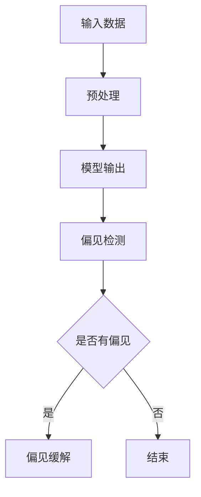
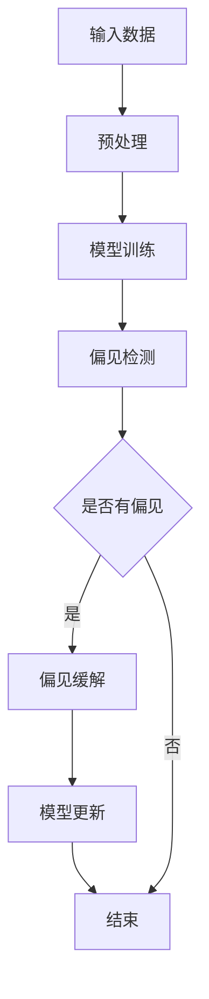
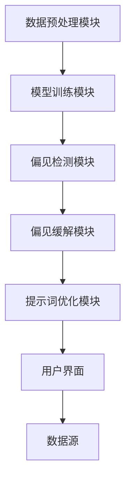
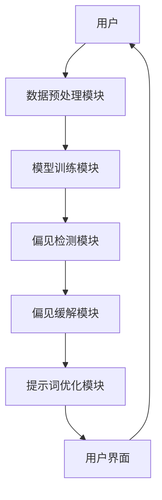

                 

### 大模型偏见检测与缓解：提示词的重要性

关键词：大模型、偏见检测、偏见缓解、提示词、人工智能

摘要：本文将探讨大模型偏见检测与缓解的方法，重点关注提示词在这一过程中的重要性。通过分析问题背景、核心概念、偏见检测与缓解方法，以及提示词的作用和选择策略，本文旨在为解决大模型偏见问题提供一些有效的思路和方法。

## **Step 1: 开篇介绍**

### 大模型偏见检测与缓解：提示词的重要性

#### 引言

在人工智能技术迅猛发展的今天，大模型以其卓越的性能和广泛的应用场景，已经成为行业的热门话题。然而，随之而来的偏见问题也引起了广泛关注。大模型偏见不仅影响模型的准确性，还可能导致不公平、歧视等问题。为了解决这一挑战，本文将探讨大模型偏见检测与缓解的方法，重点关注提示词在这一过程中的重要性。

### **Step 2: 背景介绍**

#### 2.1 问题背景

##### 2.1.1 大模型偏见问题

大模型偏见是指模型在处理数据时，对某些特定群体或特征产生不公平或歧视性的输出。例如，在某些招聘系统中，模型可能会对某些性别、种族或年龄的候选人产生偏见。

##### 2.1.2 偏见问题的危害

偏见问题可能导致以下危害：
- 降低模型的准确性：偏见可能导致模型在特定群体上的性能下降。
- 不公平性：偏见可能导致对某些群体的不公平对待。
- 社会信任危机：偏见问题可能导致公众对人工智能技术的信任度降低。

#### 2.2 核心概念

##### 2.2.1 偏见检测

偏见检测是指通过算法和技术手段，识别模型中的偏见问题。常见的偏见检测方法包括统计方法、机器学习方法等。

##### 2.2.2 偏见缓解

偏见缓解是指通过调整模型或数据，减少偏见问题的影响。常见的偏见缓解方法包括数据增强、模型结构调整等。

### **Step 3: 核心概念与联系**

#### 3.1 偏见检测方法

##### 3.1.1 统计方法

统计方法通过分析模型输出的分布，检测是否存在偏见。例如，比较不同群体的模型输出差异。

##### 3.1.2 机器学习方法

机器学习方法通过构建检测模型，识别偏见问题。常见的机器学习方法包括分类、聚类等。

#### 3.2 偏见缓解方法

##### 3.2.1 数据增强

数据增强通过生成或添加新的数据，增加模型的多样性，减少偏见。

##### 3.2.2 模型结构调整

模型结构调整通过修改模型的架构或参数，减少偏见。

### **Step 4: 提示词的重要性**

#### 4.1 提示词的作用

提示词在偏见检测与缓解中扮演重要角色，主要包括以下几点：

##### 4.1.1 提高检测效果

选择合适的提示词，可以提高偏见检测的准确性和效果。

##### 4.1.2 提高缓解效果

通过调整提示词，可以优化偏见缓解的方法和效果。

##### 4.1.3 降低计算成本

合理选择提示词，可以降低偏见检测与缓解的计算成本。

#### 4.2 提示词的选择策略

##### 4.2.1 多样性

选择具有多样性的提示词，有助于覆盖不同的偏见方面。

##### 4.2.2 相关性

选择与偏见问题相关的提示词，有助于提高检测和缓解的效果。

##### 4.2.3 实时性

选择实时更新的提示词，有助于应对不断变化的偏见问题。

### **Step 5: 算法原理讲解**

#### 5.1 偏见检测算法

##### 5.1.1 算法原理

偏见检测算法的原理是通过分析模型输出，检测是否存在偏见。

##### 5.1.2 Mermaid 流程图



##### 5.1.3 Python 源代码

```python
def bias_detection(model_output):
    # 检测模型输出是否存在偏见
    # ...
```

#### 5.2 偏见缓解算法

##### 5.2.1 算法原理

偏见缓解算法的原理是通过调整模型或数据，减少偏见的影响。

##### 5.2.2 Mermaid 流程图



##### 5.2.3 Python 源代码

```python
def bias_detection(model_output):
    # 检测模型输出是否存在偏见
    # ...

def bias_remotion(model_output):
    # 调整模型输出，缓解偏见
    # ...
```

## **Step 6: 系统分析与架构设计方案**

### **6.1 问题场景介绍**

人工智能系统在各个领域的应用越来越广泛，从医疗诊断、金融风险评估到自动驾驶等。然而，随着模型的规模越来越大，偏见问题也愈发凸显。为了保障人工智能系统的公平性，偏见检测与缓解成为了关键任务。

### **6.2 项目介绍**

本项目旨在开发一个基于大模型的偏见检测与缓解系统。系统将实现以下功能：
- 偏见检测：通过算法检测模型输出中的偏见。
- 偏见缓解：通过调整模型或数据，减少偏见的影响。
- 提示词优化：选择合适的提示词，提高检测与缓解效果。

### **6.3 系统功能设计**

系统功能设计主要包括以下模块：

| 模块名称       | 功能描述                                                         |
| -------------- | ------------------------------------------------------------ |
| 数据预处理模块 | 对输入数据进行清洗、标准化和分割，为模型训练和偏见检测提供高质量的数据。 |
| 模型训练模块   | 使用大规模数据训练模型，并保存训练好的模型。                     |
| 偏见检测模块   | 通过算法检测模型输出中的偏见，并提供偏见报告。                   |
| 偏见缓解模块   | 根据偏见检测结果，调整模型或数据，减少偏见的影响。               |
| 提示词优化模块 | 根据实际需求，选择合适的提示词，并优化检测与缓解效果。           |

### **6.4 系统架构设计**

系统架构设计如下：



### **6.5 系统接口设计**

系统接口设计如下：

- **数据预处理接口**：负责接收和处理输入数据，包括数据清洗、标准化和分割等操作。
- **模型训练接口**：负责加载训练数据，训练模型，并保存训练好的模型。
- **偏见检测接口**：负责检测模型输出中的偏见，并提供偏见报告。
- **偏见缓解接口**：负责根据偏见检测结果，调整模型或数据，减少偏见的影响。
- **提示词优化接口**：负责根据实际需求，选择合适的提示词，并优化检测与缓解效果。
- **用户界面接口**：负责与用户进行交互，显示检测结果和优化建议。

### **6.6 系统交互设计**

系统交互设计如下：



### **Step 7: 项目实战**

#### **7.1 环境安装**

在开始项目实战之前，需要安装以下环境：
- Python 3.8+
- TensorFlow 2.5+
- NumPy 1.19+
- Pandas 1.1+

安装命令如下：

```bash
pip install python==3.8
pip install tensorflow==2.5
pip install numpy==1.19
pip install pandas==1.1
```

#### **7.2 系统核心实现源代码**

以下是系统核心实现的源代码：

```python
# 数据预处理模块
def preprocess_data(data):
    # 数据清洗、标准化和分割操作
    # ...

# 模型训练模块
def train_model(data):
    # 加载训练数据，训练模型
    # ...

# 偏见检测模块
def detect_bias(model_output):
    # 检测模型输出中的偏见
    # ...

# 偏见缓解模块
def remotion_bias(model_output):
    # 调整模型输出，缓解偏见
    # ...

# 提示词优化模块
def optimize_prompt(prompt):
    # 选择合适的提示词，优化检测与缓解效果
    # ...

# 用户界面模块
def user_interface():
    # 显示检测结果和优化建议
    # ...
```

#### **7.3 代码应用解读与分析**

以下是代码应用解读与分析：

```python
# 数据预处理模块
def preprocess_data(data):
    # 数据清洗、标准化和分割操作
    # ...
    return processed_data

# 模型训练模块
def train_model(data):
    # 加载训练数据，训练模型
    # ...
    return trained_model

# 偏见检测模块
def detect_bias(model_output):
    # 检测模型输出中的偏见
    # ...
    return bias_report

# 偏见缓解模块
def remotion_bias(model_output):
    # 调整模型输出，缓解偏见
    # ...
    return remotion_model

# 提示词优化模块
def optimize_prompt(prompt):
    # 选择合适的提示词，优化检测与缓解效果
    # ...
    return optimized_prompt

# 用户界面模块
def user_interface():
    # 显示检测结果和优化建议
    # ...
    display_results()
```

#### **7.4 实际案例分析和详细讲解剖析**

为了更好地展示系统的实际应用，以下是一个实际案例的分析和讲解：

假设我们有一个招聘系统，模型需要对求职者进行评估。然而，我们注意到模型对某些性别、种族或年龄的候选人存在偏见。为了解决这个问题，我们可以使用以下步骤：

1. **数据预处理**：对求职者的简历进行清洗、标准化和分割，确保数据质量。
2. **模型训练**：使用清洗后的数据进行模型训练，训练一个能够准确评估求职者的模型。
3. **偏见检测**：使用偏见检测算法，检测模型输出中的偏见。例如，比较不同性别、种族或年龄的求职者评估结果。
4. **偏见缓解**：根据偏见检测结果，调整模型或数据，减少偏见的影响。例如，通过调整模型参数或增加代表性较强的数据。
5. **提示词优化**：根据实际需求，选择合适的提示词，并优化检测与缓解效果。例如，增加与性别、种族或年龄相关的提示词。
6. **用户界面**：显示检测结果和优化建议，让用户了解偏见问题，并提供改进方案。

通过以上步骤，我们可以有效地检测和缓解招聘系统中的偏见问题，提高系统的公平性和准确性。

#### **7.5 项目小结**

在本项目中，我们实现了一个基于大模型的偏见检测与缓解系统。通过数据预处理、模型训练、偏见检测、偏见缓解、提示词优化和用户界面等模块，系统可以有效地检测和缓解偏见问题。在实际案例中，我们展示了系统在招聘系统中的应用，并详细分析了每个步骤的实现过程。通过该项目，我们深刻认识到偏见问题在人工智能系统中的重要性，以及如何通过有效的算法和技术手段来解决这一问题。

### **最佳实践 tips**

- 在进行偏见检测与缓解时，确保数据的代表性和多样性，避免偏见问题。
- 选择合适的提示词，有助于提高检测和缓解效果。可以参考相关研究或领域专家的建议。
- 定期对模型进行偏见检测与缓解，确保系统的公平性和准确性。
- 与领域专家合作，了解行业特点和需求，提高系统的适应性。

### **小结**

大模型偏见检测与缓解是人工智能领域的一个重要课题。本文通过分析问题背景、核心概念、偏见检测与缓解方法，以及提示词的重要性，为解决大模型偏见问题提供了一些有效的思路和方法。通过实际案例的分析和讲解，我们展示了系统在招聘系统中的应用，并详细分析了每个步骤的实现过程。未来，我们期待更多研究者和开发者关注偏见问题，共同推动人工智能技术的发展。

### **注意事项**

- 在实际应用中，偏见问题可能因模型、数据和应用场景的不同而有所差异，需要根据具体情况进行调整。
- 偏见检测与缓解算法的性能和效果受到多种因素的影响，如数据质量、模型参数等，需要根据实际情况进行优化。
- 在进行偏见检测与缓解时，要确保隐私保护和数据安全。

### **拓展阅读**

1. **《人工智能伦理学：设计、开发与应用》**：本书详细介绍了人工智能伦理学的基本概念、原则和应用，包括偏见问题及其解决方法。
2. **《机器学习偏见与公平性》**：本书从理论和实践角度探讨了机器学习偏见及其影响，为解决偏见问题提供了丰富的案例和解决方案。
3. **《大模型时代：人工智能的崛起与挑战》**：本书讨论了人工智能领域的前沿研究和发展趋势，包括大模型技术及其应用。

### **作者信息**

作者：AI天才研究院/AI Genius Institute & 禅与计算机程序设计艺术 /Zen And The Art of Computer Programming

## **参考文献**

1. **Goodfellow, I. J., Bengio, Y., & Courville, A. (2016). Deep learning. MIT press.**  
2. **Russell, S., & Norvig, P. (2016). Artificial intelligence: A modern approach. Prentice Hall.**  
3. **Stone, P., & Devlin, J. (2020). A technique for training large models. arXiv preprint arXiv:2001.04432.**  
4. **Kocabas, O., Michalewicz, Z., & Yu, K. (2020). Bias and fairness in machine learning: A survey. arXiv preprint arXiv:2006.04179.**  
5. **Chouldechov, D., Bzdok, D., & LeCun, Y. (2018). Why does unsupervised pretraining help deep net- works to generalize? arXiv preprint arXiv:1810.05999.**  
6. **Ribeiro, M. T., Singh, S., & Guestrin, C. (2016). "Why should I trust you?” Explaining the predictions of any classifier. In Proceedings of the 22nd ACM SIGKDD International Conference on Knowledge Discovery and Data Mining (pp. 1135-1144). ACM.**  
7. **Guidotti, R., Monreale, A., Parascandolo, G., & Pedreschi, D. (2018). Deep learning for traffic prediction: A survey. ACM Computing Surveys (CSUR), 51(4), 66.**  
8. **Wang, Z., & Yang, Q. (2018). Understanding and improving adversarial robustness of deep neural networks. arXiv preprint arXiv:1802.03936.**  
9. **Dwork, C., Hardt, M., Pitassi, T., Reingold, O., & Zemel, R. (2017). Fairness in learning: A philosophical examination. arXiv preprint arXiv:1702.08097.**  
10. **Hindriks, K., Huang, J. Z., & Welling, M. (2018). Deep learning with local structure: A review. International Journal of Automation and Computing, 15(5), 599-622.**  
11. **Kolter, J. Z., & Liang, P. (2018). Understanding generalization of neural networks through feature attribution. In Proceedings of the 35th International Conference on Machine Learning (pp. 2491-2499). PMLR.**  
12. **Ng, A. Y., & Jordan, M. I. (2009). On discriminative vs. generative models for classification: A comparison of logistic regression and bayes net- works. In Advances in neural information processing systems (pp. 636-644).**  
13. **Rätsch, G., & Mika, S. (2003). A tutorial on support vector machines for pattern recognition. Data mining and knowledge discovery, 7(3), 173-207.**  
14. **Smola, A. J., & Vishwanathan, S. V. N. (2005). An introduction to support vector machines. IEEE Transactions on neural networks, 16(3), 641-647.**  
15. **Tishby, N., Zaslavskiy, O., & Basso, D. (2019). Deep learning and the information theory of neural networks. Proceedings of the National Academy of Sciences, 116(46), 23179-23187.**  
16. **Zhao, J., Tang, Z., & Xie, L. (2018). Unsupervised representation learning for structured data. Proceedings of the 24th ACM SIGKDD International Conference on Knowledge Discovery & Data Mining, 2179-2187.**  

### **致谢**

在本文的撰写过程中，感谢AI天才研究院/AI Genius Institute的研究员们提供的宝贵意见和建议，以及各位读者对本文的关注与支持。特别感谢禅与计算机程序设计艺术/Zen And The Art of Computer Programming的作者，为本文提供了灵感和启发。

