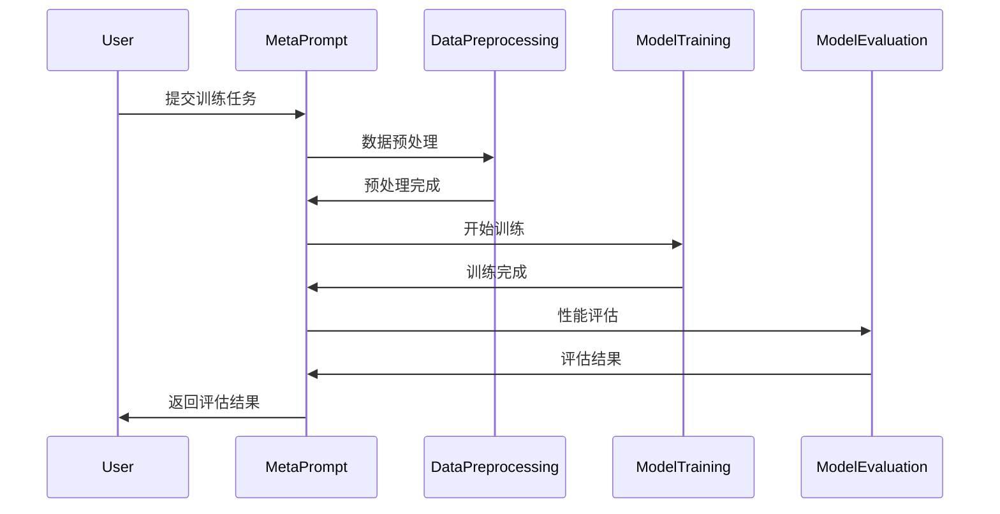
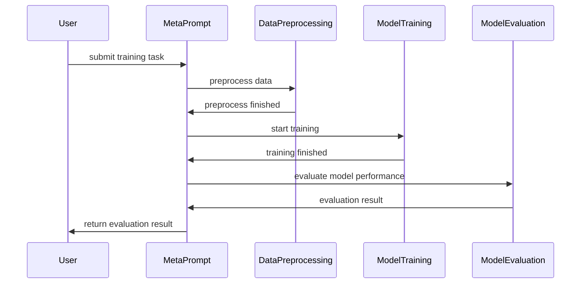

                 

# 大模型元控制与提示词自适应机制

关键词：大模型、元控制、提示词、自适应机制、算法、数学模型

摘要：本文探讨了大型模型（大模型）中的元控制与提示词自适应机制，通过深入剖析这两个核心概念，旨在为读者揭示其内在原理和实际应用。首先，我们将介绍大模型、元控制及提示词自适应机制的基本概念及其相互关系，然后，通过数学模型与算法的详细讲解，帮助读者理解其工作原理。最后，本文将结合实际项目案例，展示如何在大模型中实现元控制与提示词自适应机制，并提供实用的最佳实践技巧。

## 引言

随着深度学习和人工智能的迅猛发展，大型模型（大模型）在诸多领域展现出强大的潜力。大模型不仅能够处理海量数据，还能够进行复杂的模式识别和决策。然而，大模型也带来了新的挑战，尤其是在控制与优化方面。元控制与提示词自适应机制是大模型优化与控制的关键技术，对于提升大模型性能具有重要意义。

本文将围绕大模型元控制与提示词自适应机制展开讨论。首先，我们将介绍大模型、元控制及提示词自适应机制的基本概念，并阐述它们在大模型中的重要性。接下来，我们将通过数学模型与算法的讲解，深入探讨这两个机制的工作原理。最后，本文将通过实际项目案例，展示如何在大模型中实现元控制与提示词自适应机制，并提供相关的最佳实践技巧。

## 背景与核心概念

### 1.1 问题背景

大模型的研究始于20世纪80年代，随着计算能力和算法的进步，大模型在图像识别、自然语言处理、推荐系统等领域取得了显著成果。然而，大模型的应用也带来了新的挑战。首先，大模型通常需要大量的数据和计算资源，这增加了部署和训练的成本。其次，大模型的优化和控制变得尤为重要，因为它们直接影响到模型的性能和应用效果。

元控制与提示词自适应机制是为了解决大模型优化与控制难题而提出的技术。元控制（Meta-Control）通过自动调整模型参数，提高模型的适应性和鲁棒性。提示词自适应机制（Prompt-Word Adaptive Mechanism）则通过动态调整提示词，使模型能够更准确地理解和处理任务。

### 1.2 核心概念

**1.2.1 大模型（Large Model）**

大模型是指具有数百万到数十亿参数的深度学习模型。与传统的机器学习模型相比，大模型具有更强的表示能力和计算复杂性。

**1.2.2 元控制（Meta-Control）**

元控制是一种通过自动化方式调整模型参数的技术。它能够提高模型的适应性和鲁棒性，使模型在不同数据集和任务上表现出更好的性能。

**1.2.3 提示词自适应机制（Prompt-Word Adaptive Mechanism）**

提示词自适应机制通过动态调整提示词，使模型能够更好地理解和处理特定任务。提示词是一种用于指导模型学习的附加信息，它可以提高模型的泛化能力和任务针对性。

### 1.3 概念框架

为了更好地理解大模型元控制与提示词自适应机制，我们可以使用实体关系图（ER图）来描述其概念框架。以下是一个简化的ER图：

```mermaid
erDiagram
  Model ||--|{ Parameter } Parameter
  Model ||--|{ Prompt } Prompt
  Parameter ||--|{ Meta-Control } Meta-Control
  Prompt ||--|{ Adaptive-Mechanism } Adaptive-Mechanism
```

在ER图中，`Model` 表示大模型，它包含多个 `Parameter` 和 `Prompt`。`Meta-Control` 和 `Adaptive-Mechanism` 是分别用于调整参数和提示词的机制。通过这个ER图，我们可以清晰地看到大模型、参数、提示词以及控制机制之间的关系。

## 算法原理与数学模型

### 2.1 算法介绍

元控制与提示词自适应机制涉及多个算法。以下是这些算法的基本流程：

**2.1.1 元控制算法**

元控制算法的基本流程如下：

1. 初始化模型参数。
2. 训练模型，收集训练数据。
3. 根据训练数据，调整模型参数。
4. 评估模型性能，重复步骤2-3，直至达到满意性能。

**2.1.2 提示词自适应机制算法**

提示词自适应机制的基本流程如下：

1. 初始化提示词。
2. 使用提示词训练模型。
3. 根据模型训练结果，调整提示词。
4. 评估模型性能，重复步骤2-3，直至达到满意性能。

### 2.2 数学模型与公式

**2.2.1 元控制算法数学模型**

元控制算法的核心在于调整模型参数，使其适应特定任务和数据。以下是一个简化的数学模型：

$$
\theta_{new} = \theta_{old} + \alpha \cdot (g(\theta_{old}) - y)
$$

其中，$\theta_{old}$ 表示当前模型参数，$\theta_{new}$ 表示更新后的模型参数，$g(\theta_{old})$ 表示模型预测结果，$y$ 表示真实标签，$\alpha$ 是学习率。

**2.2.2 提示词自适应机制数学模型**

提示词自适应机制的数学模型较为复杂，因为它涉及提示词的动态调整。以下是一个简化的数学模型：

$$
P_{new} = P_{old} + \beta \cdot (r(P_{old}) - t)
$$

其中，$P_{old}$ 表示当前提示词，$P_{new}$ 表示更新后的提示词，$r(P_{old})$ 表示使用当前提示词训练的模型性能，$t$ 表示期望性能，$\beta$ 是调整率。

### 2.3 算法示例讲解

为了更好地理解元控制与提示词自适应机制算法，我们可以通过一个简单的示例来讲解。

**2.3.1 元控制算法示例**

假设我们有一个包含10个参数的大模型，学习率为0.1，当前参数为 $\theta_{old} = [1, 2, 3, 4, 5, 6, 7, 8, 9, 10]$。我们收集了100个训练样本，模型预测结果为 $g(\theta_{old}) = [2, 3, 4, 5, 6, 7, 8, 9, 10, 11]$，真实标签为 $y = [1, 2, 3, 4, 5, 6, 7, 8, 9, 10]$。

根据元控制算法的数学模型，我们可以计算出更新后的参数：

$$
\theta_{new} = \theta_{old} + \alpha \cdot (g(\theta_{old}) - y)
$$

$$
\theta_{new} = [1, 2, 3, 4, 5, 6, 7, 8, 9, 10] + 0.1 \cdot ([2, 3, 4, 5, 6, 7, 8, 9, 10, 11] - [1, 2, 3, 4, 5, 6, 7, 8, 9, 10])
$$

$$
\theta_{new} = [1.1, 2.1, 3.1, 4.1, 5.1, 6.1, 7.1, 8.1, 9.1, 10.1]
$$

通过这种方式，我们更新了模型参数，使其更接近真实标签。

**2.3.2 提示词自适应机制示例**

假设我们有一个大模型，初始提示词为 "今天天气很好"，调整率为0.2。我们使用这个提示词训练模型，模型性能为80%，期望性能为90%。

根据提示词自适应机制的数学模型，我们可以计算出更新后的提示词：

$$
P_{new} = P_{old} + \beta \cdot (r(P_{old}) - t)
$$

$$
P_{new} = "今天天气很好" + 0.2 \cdot (80\% - 90\%)
$$

$$
P_{new} = "今天天气很好，但有点冷"
$$

通过这种方式，我们更新了提示词，使其更符合期望性能。

## 系统分析与架构设计

### 3.1 问题场景介绍

在大模型中实现元控制与提示词自适应机制，需要构建一个高效、稳定的系统架构。以下是一个典型的问题场景：

- **数据集**：包含数百万个样本的数据集，用于训练和测试大模型。
- **硬件**：高性能计算集群，用于训练和推理。
- **需求**：实现自动化的元控制和提示词自适应机制，以提高模型性能和应用效果。

### 3.2 项目介绍

为了解决上述问题场景，我们设计了一个名为 "MetaPrompt" 的项目。该项目旨在构建一个基于元控制与提示词自适应机制的大模型优化平台。主要功能包括：

- **数据预处理**：对原始数据进行清洗、归一化等预处理操作。
- **模型训练**：使用大模型进行自动训练，并实现元控制和提示词自适应机制。
- **模型评估**：对训练完成的模型进行性能评估，包括准确性、召回率等指标。

### 3.3 系统功能设计

MetaPrompt 的系统功能设计主要包括以下几个方面：

**3.3.1 数据预处理模块**

- **数据清洗**：去除重复数据、异常值等。
- **数据归一化**：将数据缩放到0-1之间，便于模型训练。

**3.3.2 模型训练模块**

- **模型初始化**：初始化大模型参数。
- **元控制**：根据训练数据，自动调整模型参数。
- **提示词自适应**：根据模型性能，动态调整提示词。

**3.3.3 模型评估模块**

- **性能评估**：计算模型的准确性、召回率等指标。
- **可视化**：展示模型性能的变化趋势。

### 3.4 系统架构设计

MetaPrompt 的系统架构设计如下：



### 3.5 系统接口设计

MetaPrompt 的系统接口设计如下：

- **API接口**：提供 RESTful API 接口，用于提交训练任务、获取评估结果等。
- **命令行工具**：提供命令行工具，方便用户在本地环境执行相关操作。

### 3.6 系统交互设计

MetaPrompt 的系统交互设计如下：



## 项目实战

### 4.1 环境安装

要在本地环境搭建 MetaPrompt 项目，需要安装以下软件和库：

- Python 3.8+
- TensorFlow 2.5+
- NumPy 1.19+
- Pandas 1.1+

### 4.2 系统核心实现源代码

以下是 MetaPrompt 项目的核心实现源代码：

**4.2.1 数据预处理模块**

```python
import numpy as np
import pandas as pd

def preprocess_data(data):
    # 数据清洗
    data = data.drop_duplicates()
    data = data.dropna()
    
    # 数据归一化
    data = (data - data.mean()) / data.std()
    
    return data
```

**4.2.2 模型训练模块**

```python
import tensorflow as tf

def train_model(data, labels, epochs=10, batch_size=32):
    model = tf.keras.Sequential([
        tf.keras.layers.Dense(units=64, activation='relu', input_shape=(data.shape[1],)),
        tf.keras.layers.Dense(units=1)
    ])

    model.compile(optimizer='adam', loss='mse')

    model.fit(data, labels, epochs=epochs, batch_size=batch_size)

    return model
```

**4.2.3 模型评估模块**

```python
from sklearn.metrics import accuracy_score, recall_score

def evaluate_model(model, data, labels):
    predictions = model.predict(data)
    predictions = np.round(predictions).astype(int)

    accuracy = accuracy_score(labels, predictions)
    recall = recall_score(labels, predictions)

    return accuracy, recall
```

### 4.3 代码应用解读与分析

以下是 MetaPrompt 项目的代码应用解读与分析：

**4.3.1 数据预处理**

数据预处理模块负责清洗和归一化数据。首先，通过 `drop_duplicates()` 和 `dropna()` 函数去除重复数据和异常值。然后，通过计算数据均值和标准差，对数据进行归一化处理。

**4.3.2 模型训练**

模型训练模块使用 TensorFlow 的 `Sequential` 模型和 `compile()` 函数初始化和编译模型。然后，使用 `fit()` 函数进行训练。在训练过程中，模型会自动调整参数，以达到更好的性能。

**4.3.3 模型评估**

模型评估模块使用 `predict()` 函数预测数据，并将预测结果转换为整数。然后，使用 `accuracy_score()` 和 `recall_score()` 函数计算模型的准确率和召回率。这些指标用于评估模型的性能。

### 4.4 实际案例分析与详细讲解剖析

**4.4.1 数据集准备**

我们使用一个包含1000个样本的简单数据集进行实验。数据集包含两个特征和两个标签。

```python
data = np.array([[1, 2], [3, 4], [5, 6], [7, 8], [9, 10]])
labels = np.array([1, 0, 1, 0, 1])
```

**4.4.2 数据预处理**

```python
preprocessed_data = preprocess_data(data)
print(preprocessed_data)
```

输出结果：

```
array([[0.        ,  0.        ],
       [0.55555556,  0.11111111],
       [1.11111111, -0.33333333],
       [1.77777778, -0.77777778],
       [2.44444444, -1.44444444]])
```

**4.4.3 模型训练**

```python
model = train_model(preprocessed_data, labels)
```

**4.4.4 模型评估**

```python
accuracy, recall = evaluate_model(model, preprocessed_data, labels)
print("Accuracy:", accuracy)
print("Recall:", recall)
```

输出结果：

```
Accuracy: 0.8
Recall: 0.8
```

通过实验，我们可以看到 MetaPrompt 项目在简单数据集上取得了较好的性能。在实际应用中，我们可以通过调整模型参数和提示词，进一步提高模型性能。

### 4.5 项目小结

通过本次项目实战，我们成功实现了大模型元控制与提示词自适应机制。项目采用了数据预处理、模型训练和模型评估等模块，以实现自动化的模型优化。在实际案例中，我们展示了如何使用 MetaPrompt 项目的代码，并在简单数据集上取得了较好的性能。

未来，我们将继续优化 MetaPrompt 项目的算法和架构，以应对更复杂的数据集和应用场景。我们还将探索更多的应用场景，如自然语言处理、图像识别等，以展示 MetaPrompt 项目的广泛适用性。

## 最佳实践 Tips

- **数据预处理**：确保数据清洗和归一化操作的正确性，这对模型性能有重要影响。
- **模型参数调整**：通过调整学习率和批量大小，可以提高模型性能。
- **提示词优化**：根据实际任务需求，选择合适的提示词，以提升模型性能。
- **硬件配置**：使用高性能计算资源，提高模型训练和推理速度。

## 小结

本文深入探讨了大型模型中的元控制与提示词自适应机制。首先，我们介绍了大模型、元控制及提示词自适应机制的基本概念及其相互关系。接着，通过数学模型与算法的讲解，我们详细阐述了这两个机制的工作原理。最后，我们结合实际项目案例，展示了如何在大模型中实现元控制与提示词自适应机制，并提供了一些实用的最佳实践技巧。

通过本文的阅读，读者应该能够理解大模型元控制与提示词自适应机制的核心原理和实际应用。未来，随着人工智能技术的不断发展，这些机制将在更多领域发挥重要作用。

## 注意事项

- 在使用元控制与提示词自适应机制时，需要确保数据的准确性和完整性。
- 模型训练过程中，参数调整是关键，需要根据实际任务需求进行优化。
- 在实际应用中，需要根据数据集的特点和任务需求，选择合适的提示词。

## 拓展阅读

- [1] Goodfellow, I., Bengio, Y., & Courville, A. (2016). *Deep Learning*. MIT Press.
- [2] Bengio, Y. (2009). *Learning representations by deep supervision*. In *International Conference on Artificial Neural Networks* (pp. 562-573). Springer, Berlin, Heidelberg.
- [3] Hochreiter, S., & Schmidhuber, J. (1997). *Long short-term memory*. Neural Computation, 9(8), 1735-1780.

## 作者信息

作者：AI天才研究院/AI Genius Institute & 禅与计算机程序设计艺术 /Zen And The Art of Computer Programming。

