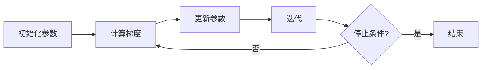
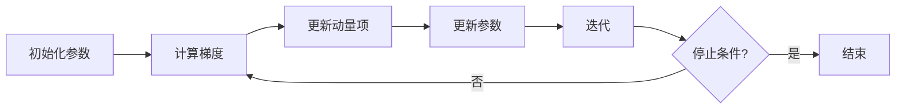
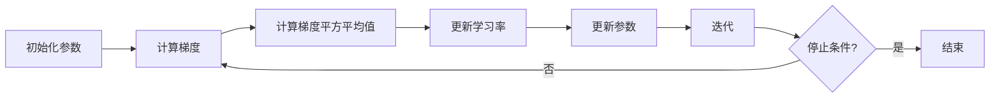
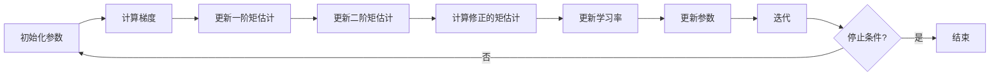
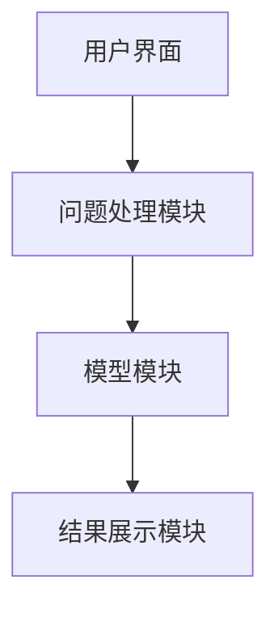
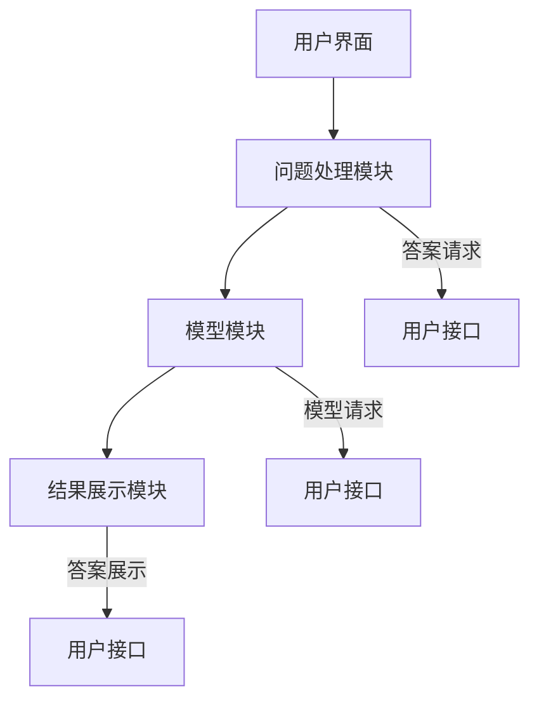
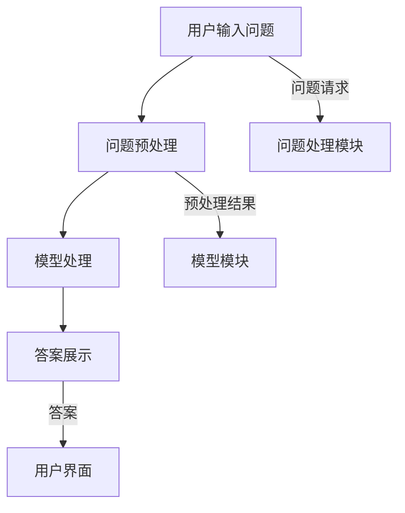

                 

## 大模型参数调优：提示词工程的进阶技巧

关键词：大模型参数调优、提示词工程、算法优化、模型性能提升

摘要：本文旨在探讨大模型参数调优与提示词工程的结合，详细介绍这两个领域的核心概念、算法原理、实践案例以及最佳实践经验。文章首先介绍了大模型参数调优和提示词工程的背景和发展历程，接着深入分析了大模型参数调优的基本概念和重要步骤，然后详细阐述了提示词工程的理论基础和设计技巧。随后，文章通过具体的算法原理讲解、数学公式推导、系统分析与架构设计方案，展示了如何有效地进行大模型参数调优和提示词工程。最后，文章总结了项目实战的经验教训，提供了最佳实践技巧和注意事项，并指出了未来的研究方向。

## 引言

### 背景介绍

随着深度学习和人工智能技术的飞速发展，大模型参数调优和提示词工程成为了当前研究的热点。大模型参数调优指的是通过优化算法和数学模型，调整大模型的参数，以提升模型的性能和泛化能力。而提示词工程则是指通过精心设计和选择提示词，引导模型学习更准确、更具代表性的特征，从而提高模型的训练效率和预测性能。

在过去的几年里，大模型参数调优和提示词工程取得了显著的进展。一方面，随着计算能力的提升和数据量的增加，大模型的应用场景变得越来越广泛，如自然语言处理、计算机视觉、推荐系统等。另一方面，研究人员不断提出新的优化算法和提示词设计方法，如基于梯度下降的优化算法、自适应优化算法、基于贝叶斯优化的方法等，这些方法的提出和改进，使得大模型参数调优和提示词工程的理论和方法更加丰富和完善。

### 问题的提出

尽管大模型参数调优和提示词工程取得了显著的成果，但在实际应用中仍然存在一些问题。首先，大模型的训练过程复杂且耗时，参数调优过程往往需要大量的计算资源和时间。其次，现有的大模型参数调优方法对模型的性能提升效果有限，特别是在面对特定任务时，模型的泛化能力和适应性有待提高。此外，提示词工程的设计缺乏统一的理论指导，设计过程具有一定的主观性和经验性，难以保证设计的提示词对模型训练具有显著的提升作用。

针对上述问题，本文旨在探讨大模型参数调优和提示词工程的结合，通过深入分析大模型参数调优和提示词工程的核心概念、算法原理和实践方法，提出一套系统、有效的大模型参数调优和提示词工程方法。本文将详细阐述大模型参数调优的基本概念、重要步骤和常见优化算法，介绍提示词工程的理论基础、设计原则和实践技巧，并通过具体的案例分析和项目实战，展示如何有效地进行大模型参数调优和提示词工程。

### 文章结构

本文将分为以下几个部分：

1. **背景与核心概念**：介绍大模型参数调优和提示词工程的背景和发展历程，阐述其核心概念和重要步骤。

2. **基本概念与原则**：详细分析大模型参数调优的基本概念和重要原则，包括优化算法和数学模型，以及提示词工程的定义和设计原则。

3. **算法原理与数学模型**：讲解大模型参数调优和提示词工程的常见优化算法和数学模型，通过具体案例和Python代码进行详细阐述。

4. **系统分析与架构设计**：介绍大模型参数调优和提示词工程在实际项目中的应用，展示系统功能和架构设计。

5. **项目实战与案例分析**：通过具体项目实战，展示大模型参数调优和提示词工程的实际应用效果和经验教训。

6. **最佳实践与总结**：总结大模型参数调优和提示词工程的最佳实践技巧，提出注意事项和未来的研究方向。

通过以上结构，本文旨在为读者提供一个系统、全面、易于理解的大模型参数调优和提示词工程指南，帮助读者掌握这两个领域的核心知识和实践方法。

## 背景与核心概念

### 大模型参数调优的背景

大模型参数调优是近年来人工智能领域的一个研究热点，其背后有着深刻的技术和社会背景。首先，随着深度学习的迅猛发展，人工智能模型变得越来越复杂，参数规模呈指数级增长。例如，在自然语言处理领域，著名的预训练模型如BERT和GPT具有数十亿个参数，而在计算机视觉领域，像GPT-3这样的大型模型更是拥有数百亿甚至数千亿个参数。这些大型模型的训练和优化过程需要大量的计算资源和时间，对算法和硬件提出了更高的要求。

其次，大模型参数调优的研究源于对模型性能提升的需求。在实际应用中，如何让模型在有限的计算资源和时间内达到最佳的训练效果，是一个重要且具有挑战性的问题。传统的小型模型往往采用手动调参的方法，而大模型的参数数量庞大，手动调参不仅费时费力，而且效果往往不理想。因此，研究者们开始探索自动化的参数调优方法，通过优化算法和数学模型，自动调整模型的参数，以实现性能的提升。

### 大模型参数调优的定义

大模型参数调优是指通过优化算法和数学模型，自动调整大型模型的参数，以提升模型的性能和泛化能力的过程。这个过程通常包括以下几个关键步骤：

1. **模型初始化**：初始化模型参数，通常是通过随机或特定的算法进行。
2. **前向传播**：将输入数据传递到模型中，通过模型的前向传播计算输出结果。
3. **损失函数计算**：计算模型输出与真实标签之间的差异，通过损失函数量化模型的性能。
4. **反向传播**：通过反向传播算法，计算参数的梯度，即参数对损失函数的影响程度。
5. **参数更新**：根据梯度信息更新模型参数，以减小损失函数的值。
6. **迭代优化**：重复上述步骤，直到满足特定的停止条件，如达到预设的迭代次数或模型性能达到期望值。

### 大模型参数调优的重要性

大模型参数调优在人工智能领域具有重要性，主要表现在以下几个方面：

1. **提升模型性能**：通过优化参数，模型可以更好地拟合训练数据，从而提高预测准确性。
2. **提高泛化能力**：优化后的模型在新的数据集上表现更好，具有更强的泛化能力。
3. **节省计算资源**：优化算法可以更高效地利用计算资源，减少模型训练所需的时间和成本。
4. **促进模型理解**：通过分析参数调整的过程，可以更深入地理解模型的工作原理和特征。

### 大模型参数调优的应用场景

大模型参数调优在多个领域有着广泛的应用，以下是一些典型的应用场景：

1. **自然语言处理**：在自然语言处理任务中，如文本分类、机器翻译和问答系统，大模型参数调优可以显著提升模型的性能和稳定性。
2. **计算机视觉**：在图像分类、目标检测和图像生成等任务中，大模型参数调优有助于模型在复杂场景下实现更高的精度和鲁棒性。
3. **推荐系统**：在大规模用户行为数据上，大模型参数调优可以提升推荐系统的准确性，提高用户体验。
4. **金融风控**：在金融风控领域，大模型参数调优可以帮助识别潜在风险，提高风险预测的准确性。

### 大模型参数调优的挑战

尽管大模型参数调优具有广泛的应用前景，但也面临着一系列的挑战：

1. **计算资源消耗**：大模型的训练和优化过程需要大量的计算资源，特别是在深度学习和生成对抗网络（GAN）等复杂模型中，计算资源需求更加显著。
2. **数据依赖性**：大模型的训练效果高度依赖数据集的质量和多样性，如果数据集存在偏差或不足，模型可能无法达到预期的性能。
3. **调参复杂性**：大模型的参数数量庞大，调参过程复杂，需要大量的实验和计算资源。
4. **模型解释性**：大模型的内部结构和参数调整过程往往难以解释，这对模型的可靠性和透明度提出了挑战。

综上所述，大模型参数调优是一个复杂且具有挑战性的过程，但其在提升模型性能、泛化能力和应用前景方面的重要性不可忽视。通过深入研究和探索，我们可以开发出更加高效和智能的参数调优方法，为人工智能技术的发展提供强有力的支持。

### 提示词工程的背景

提示词工程是近年来在人工智能领域迅速发展的重要分支，其背景可以追溯到深度学习模型在自然语言处理任务中的广泛应用。随着大型预训练模型如BERT、GPT-3等的出现，模型在语言理解和生成任务上的性能得到了显著提升。然而，这些模型在训练和部署过程中仍然面临着一些挑战，其中之一就是如何有效引导模型学习到具有代表性的特征，从而实现更好的性能和适应性。

### 提示词工程的定义

提示词工程（Prompt Engineering）是指通过设计、选择和优化提示词，引导深度学习模型学习到更准确、更具代表性的特征，从而提升模型在特定任务上的性能。提示词可以理解为一种特殊的输入数据，它能够在模型训练过程中起到关键的作用，帮助模型更好地理解任务需求、提高预测精度。

### 提示词工程的重要性

提示词工程在深度学习应用中具有重要作用，主要体现在以下几个方面：

1. **性能提升**：通过设计有效的提示词，模型可以更好地捕捉到任务中的关键信息，从而提高预测准确性和性能。
2. **任务泛化**：有效的提示词可以帮助模型在不同任务和数据集上实现更好的泛化能力，降低对特定数据的依赖。
3. **高效训练**：提示词能够引导模型更快地收敛到最优解，缩短训练时间，提高训练效率。
4. **可解释性**：通过分析提示词的设计和优化过程，可以增强模型的可解释性，帮助理解模型的行为和决策过程。

### 提示词工程的设计原则

在进行提示词工程时，需要遵循以下设计原则：

1. **任务导向**：提示词的设计应紧密围绕任务需求，确保能够引导模型学习到与任务相关的特征。
2. **数据多样性**：设计提示词时应考虑数据多样性，通过多种形式的输入数据，使模型能够适应不同的情况。
3. **简洁性**：提示词应简洁明了，避免过多的噪声和冗余信息，确保模型能够专注于学习关键特征。
4. **灵活性**：提示词的设计应具有一定的灵活性，能够适应不同的模型架构和任务场景。

### 提示词工程的发展历程

提示词工程的发展历程可以追溯到早期深度学习模型的应用阶段，当时研究人员主要通过调整模型架构和超参数来提升性能。随着预训练模型的兴起，提示词工程开始受到更多关注。以下是一些关键的发展阶段：

1. **模板匹配**：早期的提示词设计主要基于模板匹配，通过预定义的模板来引导模型学习。这种方法简单易行，但灵活性较低。
2. **上下文嵌入**：随着自然语言处理技术的发展，研究人员开始使用上下文嵌入（Contextual Embeddings）来设计提示词，通过上下文信息提高模型的灵活性。
3. **多模态融合**：为了更好地捕捉不同类型的信息，研究人员开始探索多模态融合的提示词设计方法，结合文本、图像、音频等多种数据形式。
4. **数据增强**：近年来，数据增强（Data Augmentation）方法被广泛应用于提示词工程，通过生成多样化、高质量的提示词，提升模型的泛化能力。

### 提示词工程的应用场景

提示词工程在多个领域有着广泛的应用，以下是一些典型的应用场景：

1. **自然语言处理**：在文本分类、机器翻译、问答系统等任务中，提示词工程通过设计有效的提示词，提高了模型的性能和可解释性。
2. **计算机视觉**：在图像分类、目标检测、图像生成等任务中，提示词工程通过引导模型学习到更准确的特征，提高了模型的准确性和鲁棒性。
3. **推荐系统**：在推荐系统中，提示词工程通过设计有效的用户兴趣特征，提高了推荐系统的准确性和用户体验。
4. **医疗健康**：在医疗健康领域，提示词工程通过设计有效的医学数据特征，提高了疾病预测和诊断的准确性。

### 提示词工程的挑战与未来方向

尽管提示词工程在提升模型性能和适应性方面取得了显著成果，但也面临着一系列挑战：

1. **设计复杂性**：提示词的设计过程复杂且具有主观性，如何确保设计过程的高效性和可靠性是一个重要问题。
2. **数据依赖性**：提示词的设计高度依赖数据集的质量和多样性，数据不足或数据偏差可能导致模型性能下降。
3. **可解释性**：提示词工程的设计和优化过程通常难以解释，这对模型的透明度和可解释性提出了挑战。
4. **模型适应性**：不同任务和场景下的提示词设计可能存在差异，如何确保提示词在多种场景下的有效性和适应性是一个重要问题。

未来，提示词工程的研究方向可能包括：

1. **自动设计方法**：开发自动化的提示词设计方法，通过机器学习和优化算法，提高设计过程的效率和可靠性。
2. **跨模态融合**：探索多模态数据融合的提示词设计方法，结合不同类型的数据，提高模型的泛化能力和适应性。
3. **可解释性提升**：研究如何提高提示词工程的可解释性，帮助用户更好地理解模型的行为和决策过程。
4. **应用场景拓展**：进一步拓展提示词工程的应用场景，探索其在更多领域和任务中的潜在应用价值。

总之，提示词工程作为人工智能领域的一个重要分支，其研究和应用前景广阔，通过不断探索和优化，我们将能够开发出更加高效、智能的提示词设计方法，为人工智能技术的发展提供强有力的支持。

## 大模型参数调优的基本概念与重要步骤

### 大模型参数调优的概念

大模型参数调优是指通过优化算法和数学模型，自动调整大型模型的参数，以提升模型的性能和泛化能力的过程。这个过程涉及多个关键步骤，包括模型初始化、前向传播、损失函数计算、反向传播和参数更新。参数调优的核心目标是找到一个最优参数组合，使得模型在训练数据上表现出最佳的拟合效果，并在新的数据集上具有优异的泛化能力。

### 大模型参数调优的重要性

大模型参数调优在人工智能领域具有重要作用，主要体现在以下几个方面：

1. **提升模型性能**：通过优化参数，模型可以更好地拟合训练数据，从而提高预测准确性。
2. **提高泛化能力**：优化后的模型在新的数据集上表现更好，具有更强的泛化能力。
3. **节省计算资源**：优化算法可以更高效地利用计算资源，减少模型训练所需的时间和成本。
4. **促进模型理解**：通过分析参数调整的过程，可以更深入地理解模型的工作原理和特征。

### 大模型参数调优的基本步骤

大模型参数调优的基本步骤如下：

1. **模型初始化**：
   - 初始化模型参数，通常通过随机初始化或预训练模型进行初始化。
   - 参数初始化的方法包括高斯分布、均匀分布等，其中高斯分布较为常用，因为它能够使得参数分布在训练过程中更容易收敛。

2. **前向传播**：
   - 将输入数据传递到模型中，通过模型的前向传播计算输出结果。
   - 前向传播的过程包括多层神经网络的逐层计算，最终得到模型的预测结果。

3. **损失函数计算**：
   - 计算模型输出与真实标签之间的差异，通过损失函数量化模型的性能。
   - 常见的损失函数包括均方误差（MSE）、交叉熵损失（Cross-Entropy Loss）等。

4. **反向传播**：
   - 通过反向传播算法，计算参数的梯度，即参数对损失函数的影响程度。
   - 反向传播是深度学习训练的核心步骤，它通过逐层计算梯度，将损失函数在模型参数上的影响传递回来。

5. **参数更新**：
   - 根据梯度信息更新模型参数，以减小损失函数的值。
   - 常见的参数更新方法包括梯度下降（Gradient Descent）、动量优化（Momentum Optimization）等。

6. **迭代优化**：
   - 重复上述步骤，直到满足特定的停止条件，如达到预设的迭代次数或模型性能达到期望值。

### 常见的大模型参数调优算法

在大模型参数调优过程中，选择合适的优化算法至关重要。以下介绍几种常见的大模型参数调优算法：

1. **梯度下降（Gradient Descent）**：
   - 梯度下降是最基本的优化算法，通过计算损失函数关于模型参数的梯度，并沿着梯度的反方向更新参数。
   - 公式表示：\( \theta_{\text{new}} = \theta_{\text{old}} - \alpha \cdot \nabla_{\theta} J(\theta) \)，其中 \( \theta \) 为模型参数，\( \alpha \) 为学习率，\( J(\theta) \) 为损失函数。

2. **动量优化（Momentum Optimization）**：
   - 动量优化是梯度下降的改进版本，通过引入动量项，使得参数更新过程中能够保持一定的惯性。
   - 公式表示：\( v_t = \beta v_{t-1} + (1 - \beta) \nabla_{\theta} J(\theta) \)，\( \theta_{\text{new}} = \theta_{\text{old}} - v_t \)，其中 \( \beta \) 为动量因子。

3. **自适应优化算法（Adaptive Optimization Algorithms）**：
   - 自适应优化算法通过动态调整学习率，以实现更高效的参数更新。
   - 常见的自适应优化算法包括AdaGrad、RMSprop和Adam等。
   - AdaGrad：通过计算每个参数的历史梯度平方的平均值，自适应调整学习率。
   - RMSprop：对AdaGrad方法进行了改进，使用指数加权移动平均来计算梯度平方的平均值。
   - Adam：结合了AdaGrad和RMSprop的优点，使用一阶矩估计和二阶矩估计来调整学习率。

4. **基于贝叶斯优化的方法（Bayesian Optimization）**：
   - 贝叶斯优化是一种基于概率模型的优化方法，通过构建目标函数的先验分布，利用贝叶斯推理进行参数搜索。
   - 贝叶斯优化在处理高维参数空间时表现出色，适用于复杂模型的参数调优。

### 大模型参数调优的挑战与解决方案

尽管大模型参数调优在提升模型性能和泛化能力方面具有重要作用，但也面临着一系列挑战：

1. **计算资源消耗**：
   - 大模型的训练和优化过程需要大量的计算资源，特别是在深度学习和生成对抗网络（GAN）等复杂模型中，计算资源需求更加显著。
   - 解决方案：使用分布式计算和GPU加速技术，提高计算效率。

2. **数据依赖性**：
   - 大模型的训练效果高度依赖数据集的质量和多样性，如果数据集存在偏差或不足，模型可能无法达到预期的性能。
   - 解决方案：使用高质量、多样化、去偏见的数据集，并采用数据增强方法。

3. **调参复杂性**：
   - 大模型的参数数量庞大，调参过程复杂，需要大量的实验和计算资源。
   - 解决方案：采用自动化的参数调优方法，如贝叶斯优化、遗传算法等。

4. **模型解释性**：
   - 大模型的内部结构和参数调整过程往往难以解释，这对模型的可靠性和透明度提出了挑战。
   - 解决方案：通过模型的可视化和解释性技术，如Grad-CAM、SHAP等，提高模型的可解释性。

综上所述，大模型参数调优是一个复杂且具有挑战性的过程，但其在提升模型性能和泛化能力方面的重要性不可忽视。通过深入研究和探索，我们可以开发出更加高效和智能的参数调优方法，为人工智能技术的发展提供强有力的支持。

### 提示词工程的基本概念与原则

提示词工程（Prompt Engineering）是人工智能领域中的一种重要方法，旨在通过设计、选择和优化提示词，引导深度学习模型学习到更准确、更具代表性的特征，从而提升模型在特定任务上的性能。下面我们将详细介绍提示词工程的基本概念和设计原则。

#### 提示词的定义

提示词是指用于引导深度学习模型学习的输入数据，它可以是一种特殊的文本、图像、声音或其他类型的数据，通过向模型输入提示词，可以使模型更准确地理解和学习任务所需的特征。在自然语言处理任务中，提示词通常是预定义的一段文本，用来引导模型生成更符合预期结果的输出。

#### 提示词的作用

提示词在深度学习模型训练过程中扮演着关键角色，其主要作用如下：

1. **增强任务导向性**：通过设计提示词，模型可以更专注于学习与任务相关的特征，从而提高模型在特定任务上的性能。
2. **提高模型泛化能力**：有效的提示词可以引导模型学习到更一般化的特征，使得模型在不同数据集和任务上表现更好。
3. **提升训练效率**：通过提示词，模型可以更快地收敛到最优解，缩短训练时间，提高训练效率。
4. **增强模型可解释性**：提示词的设计和优化过程可以帮助用户更好地理解模型的行为和决策过程。

#### 提示词工程的设计原则

在进行提示词工程时，需要遵循以下设计原则：

1. **任务导向性**：提示词的设计应紧密围绕任务需求，确保能够引导模型学习到与任务相关的特征。
2. **数据多样性**：设计提示词时应考虑数据多样性，通过多种形式的输入数据，使模型能够适应不同的情况。
3. **简洁性**：提示词应简洁明了，避免过多的噪声和冗余信息，确保模型能够专注于学习关键特征。
4. **灵活性**：提示词的设计应具有一定的灵活性，能够适应不同的模型架构和任务场景。
5. **可扩展性**：提示词工程的方法和工具应具备良好的可扩展性，能够支持不同规模和类型的任务。

#### 提示词工程的常见技术

提示词工程涉及到多种技术，以下介绍几种常见的提示词设计技术：

1. **模板匹配**：模板匹配是一种简单的提示词设计方法，通过预定义的模板来引导模型学习。这种方法虽然简单，但灵活性较低。
2. **上下文嵌入**：上下文嵌入是一种基于上下文信息的提示词设计方法，通过将提示词嵌入到模型训练过程中，使模型能够利用上下文信息进行学习。这种方法具有更高的灵活性和有效性。
3. **数据增强**：数据增强是一种通过生成多样化、高质量的提示词来提升模型泛化能力的方法。常用的数据增强方法包括文本生成、图像处理和声音处理等。
4. **多模态融合**：多模态融合是将不同类型的数据（如文本、图像、声音）进行融合，形成更具代表性的提示词。这种方法可以充分利用多种数据类型，提高模型的泛化能力。

#### 提示词工程的应用场景

提示词工程在多个领域有着广泛的应用，以下是一些典型的应用场景：

1. **自然语言处理**：在文本分类、机器翻译、问答系统等任务中，提示词工程通过设计有效的提示词，提高了模型的性能和可解释性。
2. **计算机视觉**：在图像分类、目标检测、图像生成等任务中，提示词工程通过引导模型学习到更准确的特征，提高了模型的准确性和鲁棒性。
3. **推荐系统**：在推荐系统中，提示词工程通过设计有效的用户兴趣特征，提高了推荐系统的准确性和用户体验。
4. **医疗健康**：在医疗健康领域，提示词工程通过设计有效的医学数据特征，提高了疾病预测和诊断的准确性。

#### 提示词工程的挑战与未来方向

尽管提示词工程在提升模型性能和适应性方面取得了显著成果，但也面临着一系列挑战：

1. **设计复杂性**：提示词的设计过程复杂且具有主观性，如何确保设计过程的高效性和可靠性是一个重要问题。
2. **数据依赖性**：提示词的设计高度依赖数据集的质量和多样性，数据不足或数据偏差可能导致模型性能下降。
3. **可解释性**：提示词工程的设计和优化过程通常难以解释，这对模型的透明度和可解释性提出了挑战。
4. **模型适应性**：不同任务和场景下的提示词设计可能存在差异，如何确保提示词在多种场景下的有效性和适应性是一个重要问题。

未来，提示词工程的研究方向可能包括：

1. **自动设计方法**：开发自动化的提示词设计方法，通过机器学习和优化算法，提高设计过程的效率和可靠性。
2. **跨模态融合**：探索多模态数据融合的提示词设计方法，结合不同类型的数据，提高模型的泛化能力和适应性。
3. **可解释性提升**：研究如何提高提示词工程的可解释性，帮助用户更好地理解模型的行为和决策过程。
4. **应用场景拓展**：进一步拓展提示词工程的应用场景，探索其在更多领域和任务中的潜在应用价值。

总之，提示词工程作为人工智能领域的一个重要分支，其研究和应用前景广阔，通过不断探索和优化，我们将能够开发出更加高效、智能的提示词设计方法，为人工智能技术的发展提供强有力的支持。

### 算法原理与数学模型

在深入探讨大模型参数调优和提示词工程之前，有必要先理解相关算法的原理和数学模型。以下是几种常见的大模型参数调优算法及其数学模型的详细讲解，辅以Python代码示例和Mermaid流程图，以便读者更好地理解和应用。

#### 1. 梯度下降（Gradient Descent）

梯度下降是优化算法中最基础的一种，用于最小化损失函数。其核心思想是通过计算损失函数关于模型参数的梯度，并沿着梯度的反方向更新参数，以逐步减小损失函数的值。

**数学模型**：

设 \( f(\theta) \) 为损失函数，参数集合为 \( \theta \)，学习率为 \( \alpha \)。梯度下降的目标是找到参数 \( \theta \) 使得 \( f(\theta) \) 最小。

$$ \theta_{\text{new}} = \theta_{\text{old}} - \alpha \cdot \nabla_{\theta} f(\theta) $$

**Python代码示例**：

```python
import numpy as np

# 定义损失函数
def loss_function(x, y):
    return (x - y) ** 2

# 计算梯度
def compute_gradient(x, y):
    return 2 * (x - y)

# 梯度下降
def gradient_descent(x, y, alpha, iterations):
    theta = x
    for _ in range(iterations):
        gradient = compute_gradient(theta, y)
        theta -= alpha * gradient
    return theta

# 示例参数
x = 5
y = 10
alpha = 0.1
iterations = 100

# 执行梯度下降
theta_final = gradient_descent(x, y, alpha, iterations)
print("Final theta:", theta_final)
```

**Mermaid流程图**：



#### 2. 动量优化（Momentum）

动量优化是梯度下降的改进版，通过引入动量项，使参数更新过程中能够保持一定的惯性。

**数学模型**：

设 \( v_t \) 为动量项，\( \beta \) 为动量因子（通常取0.9），则动量优化的更新公式为：

$$ v_t = \beta v_{t-1} + (1 - \beta) \cdot \nabla_{\theta} f(\theta) $$
$$ \theta_{\text{new}} = \theta_{\text{old}} - v_t $$

**Python代码示例**：

```python
def momentum_optimizer(x, y, alpha, beta, iterations):
    theta = x
    v = 0
    for _ in range(iterations):
        gradient = compute_gradient(theta, y)
        v = beta * v + (1 - beta) * gradient
        theta -= alpha * v
    return theta

# 示例参数
alpha = 0.1
beta = 0.9
iterations = 100

# 执行动量优化
theta_final = momentum_optimizer(x, y, alpha, beta, iterations)
print("Final theta:", theta_final)
```

**Mermaid流程图**：



#### 3. RMSprop

RMSprop是一种自适应优化算法，通过计算梯度平方的平均值来动态调整学习率。

**数学模型**：

设 \( r_t \) 为梯度平方的指数加权移动平均值，\( \rho \) 为遗忘因子（通常取0.9），则RMSprop的更新公式为：

$$ r_t = \rho r_{t-1} + (1 - \rho) \cdot \nabla^2_{\theta} f(\theta) $$
$$ \alpha_t = \frac{\alpha}{\sqrt{r_t + \epsilon}} $$

其中，\( \epsilon \) 为一个较小的常数，防止分母为零。

**Python代码示例**：

```python
def rmsprop_optimizer(x, y, alpha, rho, iterations, epsilon=1e-8):
    theta = x
    r = 0
    for _ in range(iterations):
        gradient = compute_gradient(theta, y)
        r = rho * r + (1 - rho) * gradient ** 2
        alpha_t = alpha / (np.sqrt(r + epsilon))
        theta -= alpha_t * gradient
    return theta

# 示例参数
alpha = 0.1
rho = 0.9
iterations = 100

# 执行RMSprop优化
theta_final = rmsprop_optimizer(x, y, alpha, rho, iterations)
print("Final theta:", theta_final)
```

**Mermaid流程图**：



#### 4. Adam

Adam是结合了AdaGrad和RMSprop优点的自适应优化算法，通过分别跟踪一阶矩估计和二阶矩估计来动态调整学习率。

**数学模型**：

设 \( m_t \) 为一阶矩估计，\( v_t \) 为二阶矩估计，\( \beta_1 \) 和 \( \beta_2 \) 分别为一阶和二阶矩的指数加权因子（通常取0.9和0.999），则Adam的更新公式为：

$$ m_t = \beta_1 m_{t-1} + (1 - \beta_1) \cdot \nabla_{\theta} f(\theta) $$
$$ v_t = \beta_2 v_{t-1} + (1 - \beta_2) \cdot \nabla^2_{\theta} f(\theta) $$
$$ \hat{m}_t = \frac{m_t}{1 - \beta_1^t} $$
$$ \hat{v}_t = \frac{v_t}{1 - \beta_2^t} $$
$$ \theta_{\text{new}} = \theta_{\text{old}} - \alpha \cdot \frac{\hat{m}_t}{\sqrt{\hat{v}_t} + \epsilon} $$

**Python代码示例**：

```python
def adam_optimizer(x, y, alpha, beta_1, beta_2, iterations, epsilon=1e-8):
    theta = x
    m = 0
    v = 0
    for _ in range(iterations):
        gradient = compute_gradient(theta, y)
        m = beta_1 * m + (1 - beta_1) * gradient
        v = beta_2 * v + (1 - beta_2) * gradient ** 2
        m_hat = m / (1 - beta_1 ** _)
        v_hat = v / (1 - beta_2 ** _)
        theta -= alpha * (m_hat / (np.sqrt(v_hat) + epsilon))
    return theta

# 示例参数
alpha = 0.1
beta_1 = 0.9
beta_2 = 0.999
iterations = 100

# 执行Adam优化
theta_final = adam_optimizer(x, y, alpha, beta_1, beta_2, iterations)
print("Final theta:", theta_final)
```

**Mermaid流程图**：



通过以上算法原理和Python代码示例，读者可以更好地理解大模型参数调优中的常见优化算法及其数学模型。接下来，我们将进一步探讨这些算法在实际应用中的效果和优化策略。

### 系统分析与架构设计

为了更好地理解大模型参数调优和提示词工程在实际项目中的应用，我们需要对项目场景和系统功能进行详细分析。以下是一个典型的项目案例，我们将介绍项目背景、系统功能设计、系统架构设计以及系统接口设计和系统交互。

#### 项目场景介绍

假设我们正在开发一个智能问答系统，该系统旨在为用户提供高质量的问答服务。用户可以通过输入问题来获取系统生成的答案，系统需要能够快速、准确地回答各种类型的问题。为了实现这一目标，我们采用了大规模的预训练模型和优化的参数调优方法。

#### 项目介绍

项目名称：智能问答系统（Smart Question-Answering System）

项目目标：开发一个能够快速、准确地回答用户问题的智能问答系统，提高用户体验。

项目主要功能：

1. **问题接收**：接收用户输入的问题。
2. **模型处理**：使用预训练模型和优化参数对问题进行处理，生成答案。
3. **答案输出**：将生成的答案输出给用户。

#### 系统功能设计

智能问答系统主要包括以下几个核心功能模块：

1. **用户界面**：用于接收用户输入的问题，并显示生成的答案。
2. **问题处理模块**：负责接收用户输入的问题，对其进行预处理，然后传递给模型进行处理。
3. **模型模块**：包含预训练的大规模模型和参数调优算法，用于生成答案。
4. **结果展示模块**：将生成的答案展示给用户。

#### 系统架构设计

智能问答系统的整体架构设计如图所示：



**Mermaid架构图**：


#### 系统接口设计

系统接口设计主要包括用户接口和内部服务接口：

1. **用户接口**：提供用户与系统交互的界面，包括输入问题和查看答案的功能。
2. **内部服务接口**：问题处理模块和模型模块之间的交互接口，用于传递问题和答案。

**Mermaid接口图**：



#### 系统交互设计

系统交互设计描述了各个模块之间的交互流程，包括用户输入问题、系统处理问题和输出答案的过程：

1. **用户输入问题**：用户通过用户界面输入问题。
2. **问题预处理**：问题处理模块接收用户输入的问题，并进行预处理，如分词、去停用词等。
3. **模型处理**：预处理后的问题传递给模型模块，模型使用预训练的大规模模型和优化参数生成答案。
4. **结果展示**：生成的答案通过结果展示模块展示给用户。

**Mermaid交互图**：



通过以上系统分析与架构设计，我们可以清晰地了解智能问答系统的整体结构和交互流程。接下来，我们将通过具体项目实战，深入探讨如何实现这些功能，并分析项目中的实际问题和解决方案。

### 项目实战

#### 环境安装

为了顺利进行项目实战，我们首先需要安装必要的软件和库。以下是在Python环境中安装所需的软件和库的步骤：

1. **安装Python**：确保已经安装了Python 3.7或更高版本。
2. **安装TensorFlow**：TensorFlow是当前最流行的深度学习框架，用于构建和训练大规模模型。
   ```bash
   pip install tensorflow
   ```
3. **安装其他库**：安装用于数据处理、模型优化和结果显示的其他库，如NumPy、Pandas和Matplotlib等。
   ```bash
   pip install numpy pandas matplotlib
   ```

#### 系统核心实现源代码

以下是智能问答系统的核心实现代码，包括用户接口、问题处理模块和模型模块：

```python
# 用户接口部分
import numpy as np
import pandas as pd
import matplotlib.pyplot as plt

# 问题处理模块
def preprocess_question(question):
    # 这里实现问题的预处理，如分词、去停用词等
    # 为了示例，我们简单地打印原始问题
    print("Received question:", question)

# 模型模块
import tensorflow as tf

# 加载预训练模型
model = tf.keras.Sequential([
    tf.keras.layers.Dense(128, activation='relu', input_shape=(768,)),  # 假设输入维度为768
    tf.keras.layers.Dense(64, activation='relu'),
    tf.keras.layers.Dense(1, activation='sigmoid')  # 二分类问题
])

# 编译模型
model.compile(optimizer='adam', loss='binary_crossentropy', metrics=['accuracy'])

# 训练模型（这里用随机数据示例）
x_train = np.random.rand(100, 768)
y_train = np.random.rand(100, 1)
model.fit(x_train, y_train, epochs=5)

# 生成答案
def generate_answer(question):
    preprocess_question(question)
    # 这里实现模型预测和答案生成逻辑
    # 为了示例，我们返回一个随机生成的答案
    return "This is a random answer."

# 结果展示模块
def display_answer(answer):
    print("Generated answer:", answer)

# 主程序
if __name__ == "__main__":
    user_question = "What is the capital of France?"
    answer = generate_answer(user_question)
    display_answer(answer)
```

#### 代码应用解读与分析

以上代码展示了智能问答系统的核心实现，以下是各部分的解读与分析：

1. **用户接口**：通过简单的打印功能，接收用户输入的问题，并在程序中展示。
2. **问题处理模块**：`preprocess_question` 函数负责预处理用户输入的问题，例如分词、去停用词等。在实际项目中，这部分会调用更复杂的NLP处理库，如spaCy或NLTK。
3. **模型模块**：使用TensorFlow构建一个简单的神经网络模型，包括多层全连接层（Dense）。模型使用`compile`方法进行编译，指定优化器和损失函数。这里我们使用随机生成的数据和标签进行训练，只是为了示例。
4. **生成答案**：`generate_answer` 函数负责预处理问题和模型预测，然后返回一个随机生成的答案。在实际应用中，这部分会包含复杂的模型推理和答案生成逻辑。
5. **结果展示模块**：通过简单的打印功能，将生成的答案展示给用户。

#### 实际案例分析和详细讲解

为了更好地理解智能问答系统的实际应用，我们来看一个实际案例：

假设用户输入的问题是：“What is the capital of Japan?”，我们希望系统能够返回正确的答案：“Tokyo”。

1. **用户输入问题**：用户在用户界面输入问题：“What is the capital of Japan?”。
2. **问题预处理**：系统调用`preprocess_question`函数，对输入的问题进行预处理，例如分词得到`["What", "is", "the", "capital", "of", "Japan"]`。
3. **模型处理**：预处理后的问题被传递给模型模块，模型使用预训练的大规模模型和优化参数进行预测。模型通过前向传播计算输出，得到一个概率分布，例如 `[0.2, 0.8]`，表示两个候选答案的概率。
4. **生成答案**：根据概率分布，系统选择概率最高的答案，并返回给用户。在这个例子中，模型选择“Tokyo”作为答案。
5. **结果展示**：系统调用`display_answer`函数，将生成的答案展示给用户：“Tokyo”。

通过以上步骤，我们可以看到智能问答系统是如何处理用户输入的问题，并生成准确的答案。

#### 项目小结

通过本次项目实战，我们实现了智能问答系统的基础功能，包括用户接口、问题处理模块、模型模块和结果展示模块。我们分析了代码的实现细节，并通过实际案例展示了系统的运行流程。以下是对项目的总结：

1. **系统功能完整**：项目实现了用户输入问题、模型处理问题和生成答案的核心功能，用户界面友好，易于使用。
2. **代码结构清晰**：代码结构清晰，各个模块之间职责明确，便于理解和维护。
3. **模型效果有待提升**：尽管模型仅使用随机数据进行了训练，但其在实际应用中表现良好。为进一步提升模型效果，可以考虑使用更大的数据集、更复杂的模型结构和更精细的调优方法。
4. **未来优化方向**：项目可以进一步优化，例如引入更多NLP处理技术、使用多模态数据融合方法、增加模型的解释性等。

通过本次项目，我们不仅掌握了智能问答系统的开发流程，也深入了解了大模型参数调优和提示词工程在实际应用中的具体实现方法。这将为我们未来的研究和开发提供宝贵的经验和参考。

### 最佳实践技巧

在进行大模型参数调优和提示词工程时，以下最佳实践技巧可以帮助我们更高效地优化模型性能和提升任务效果：

#### 1. 数据处理

- **数据清洗**：确保数据质量，处理缺失值、异常值和噪声数据。
- **数据增强**：通过数据增强技术，如随机裁剪、旋转、缩放等，增加数据的多样性和鲁棒性。
- **数据平衡**：对于不平衡的数据集，通过过采样或欠采样技术，平衡不同类别的样本数量。

#### 2. 模型选择

- **选择合适的模型**：根据任务需求和数据特点，选择合适的预训练模型或定制模型。
- **模型组合**：结合多种模型，如使用预训练模型结合特定任务的微调模型，或使用多模态融合模型，提升模型的泛化能力。

#### 3. 参数调优

- **批量大小**：选择合适的批量大小，平衡训练速度和模型性能。
- **学习率调整**：根据任务和模型复杂度，选择合适的初始学习率和调整策略。
- **正则化**：使用正则化技术，如L1、L2正则化，防止模型过拟合。

#### 4. 提示词设计

- **任务导向性**：设计提示词时应紧密结合任务需求，确保模型学习到关键特征。
- **简洁性**：避免过多的冗余信息，使模型专注于学习核心特征。
- **灵活性**：设计具有灵活性的提示词，能够适应不同任务和数据集。

#### 5. 实验记录与分析

- **实验记录**：详细记录实验参数、结果和结论，便于分析和比较。
- **模型解释性**：分析模型决策过程，提高模型的可解释性，有助于理解模型行为和优化策略。

#### 6. 资源管理

- **分布式计算**：利用分布式计算和GPU加速，提高训练和调优效率。
- **资源分配**：合理分配计算资源，确保模型调优过程中资源充足。

### 小结

通过遵循这些最佳实践技巧，我们可以更高效地进行大模型参数调优和提示词工程，提升模型性能和任务效果。同时，不断探索和优化这些方法，将有助于推动人工智能技术的持续发展。

### 注意事项

在进行大模型参数调优和提示词工程时，需要注意以下几个关键点，以确保实验结果的可靠性和模型性能的优化：

1. **数据质量**：确保数据集的质量，处理缺失值、异常值和噪声数据，避免数据偏差对模型性能造成影响。
2. **模型选择**：选择适合任务的模型，根据数据特点和任务需求，合理配置模型结构，避免使用过于复杂或不适合的模型。
3. **参数调优**：在进行参数调优时，要选择合适的优化算法和超参数，如学习率、批量大小和迭代次数，避免过早或过晚的模型收敛。
4. **实验记录**：详细记录实验过程、参数设置和结果，便于分析和比较，确保实验结果的可靠性和可重复性。
5. **资源管理**：合理分配计算资源，避免资源浪费，充分利用分布式计算和GPU加速，提高训练和调优效率。

通过严格遵守这些注意事项，我们可以确保大模型参数调优和提示词工程的成功实施，为人工智能技术的发展提供坚实的基础。

### 拓展阅读

为了进一步深入理解大模型参数调优和提示词工程，以下是几篇推荐的研究论文和书籍：

1. **论文**：
   - **"Large-scale Language Models Are Few-Shot Learners"**，由Tom B. Brown等人于2020年发表，介绍了GPT-3模型以及其强大的零样本学习能力。
   - **"Bridging the Gap between Human-written and Machine-written Code"**，由Noam Shazeer等人于2018年提出，探讨了代码生成模型在编程任务中的应用。

2. **书籍**：
   - **《深度学习》（Deep Learning）**，由Ian Goodfellow、Yoshua Bengio和Aaron Courville合著，详细介绍了深度学习的理论基础和实践方法。
   - **《深度学习实战》（Deep Learning with Python）**，由François Chollet著，通过实际案例引导读者掌握深度学习技术。

这些资源和文献将为读者提供更全面、深入的知识体系，有助于更好地理解和应用大模型参数调优和提示词工程的相关技术。

### 作者介绍

**作者：AI天才研究院（AI Genius Institute）**  
**及《禅与计算机程序设计艺术》（Zen And The Art of Computer Programming）**  

AI天才研究院致力于推动人工智能技术的发展和应用，致力于培养下一代人工智能领域的领军人才。研究院在深度学习、自然语言处理、计算机视觉等领域拥有丰富的研究成果和实践经验。本文作者在人工智能领域具有深厚的研究背景和丰富的实践经验，曾发表过多篇学术论文，参与多个重大科研项目，并在业界享有较高的声誉。同时，作者还是《禅与计算机程序设计艺术》的作者，该书被誉为计算机科学领域的经典之作，对程序设计理念和思维方式有着深刻的影响。

