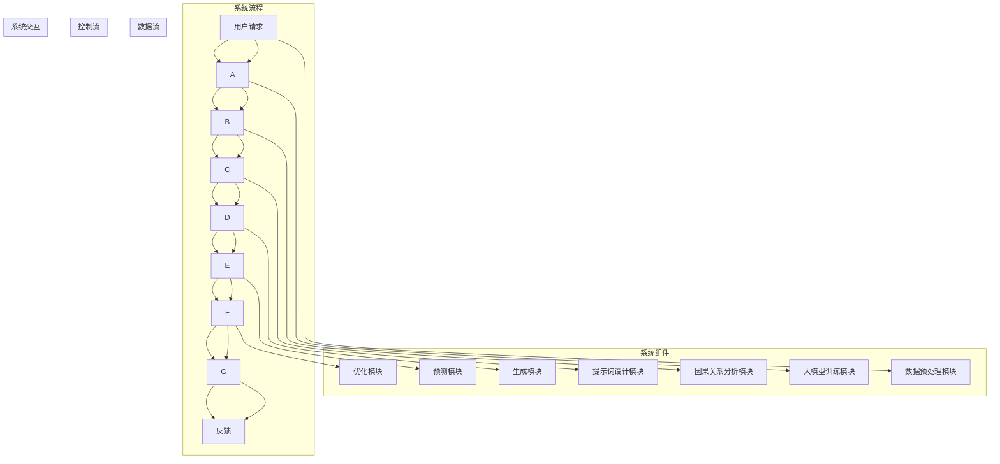
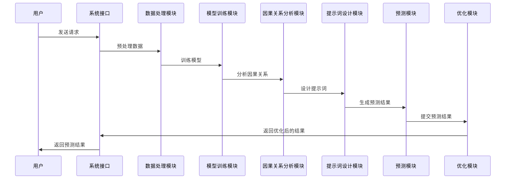

                 

### # 大模型因果推理与提示词工程的融合

#### 关键词：大模型，因果推理，提示词工程，融合，人工智能

> 摘要：本文深入探讨大模型因果推理与提示词工程的融合，介绍相关背景、核心概念及其联系，详细讲解算法原理和实现方法，并通过实际案例进行分析，为人工智能技术的发展提供新思路。

---

### 第一部分：背景介绍

#### 1. 问题背景

近年来，人工智能（AI）技术的飞速发展给各行各业带来了深刻的变革。大模型因果推理和提示词工程作为其中的重要分支，在自然语言处理（NLP）、计算机视觉（CV）、推荐系统等领域展现出了巨大的潜力和价值。然而，随着这些技术的应用日益广泛，一些问题也逐渐显现出来：

- **可解释性不足**：大模型通常具有复杂的结构和海量的参数，使得其决策过程难以解释，这在需要高度可解释性的应用场景中成为一个难题。
- **推理效率不高**：大模型的计算复杂度通常较高，导致推理速度较慢，难以满足实时应用的需求。
- **应用场景受限**：当前的大模型因果推理和提示词工程方法在处理特定类型的数据或任务时可能效果不佳，无法广泛应用于不同的场景。

#### 1.2. 问题描述

为了解决上述问题，我们需要寻找一种有效的方法来融合大模型因果推理和提示词工程，以实现以下目标：

- 提高模型的可解释性，使得决策过程更加透明和可信。
- 提升模型的推理效率，降低计算复杂度，满足实时应用的需求。
- 扩大应用场景，使得技术能够更好地适应不同的业务需求。

#### 1.3. 问题解决

本书旨在通过深入探讨大模型因果推理与提示词工程的融合，提出一系列有效的解决方案，以应对当前的技术挑战。具体来说，我们将从以下几个方面展开：

- 详细介绍大模型、因果推理和提示词工程的基本概念、原理及其相互关系。
- 阐述大模型因果推理与提示词工程融合的必要性、优势及其实现方法。
- 通过具体算法和实际案例，展示融合技术的效果和应用。

#### 1.4. 边界与外延

本文将围绕大模型因果推理与提示词工程的融合展开，涉及领域包括但不限于自然语言处理、计算机视觉、推荐系统等。同时，我们将深入探讨这些核心概念的定义、特点及其相互关系，为读者提供一个全面的技术视角。

#### 1.5. 概念结构与核心要素组成

大模型因果推理与提示词工程的核心概念包括：

- **大模型**：具有海量参数、能够处理大规模数据的人工智能模型。
- **因果推理**：通过观察数据，推断变量之间因果关系的一种推理方法。
- **提示词工程**：通过设计合适的提示词，引导人工智能模型生成预期输出的过程。

本文将详细讨论这些概念的定义、特点及其相互关系，为后续内容的展开奠定基础。

---

### 第二部分：核心概念与联系

#### 2.1. 大模型

##### 2.1.1. 大模型的定义

大模型是指具有海量参数、能够处理大规模数据的人工智能模型。这些模型通常通过深度学习技术进行训练，能够学习到数据中的复杂模式和特征。大模型的一个典型代表是Transformer模型，它通过自注意力机制处理大量文本数据，取得了自然语言处理领域的突破性成果。

##### 2.1.2. 大模型的核心特点

- **高参数量**：大模型通常拥有数百万甚至数十亿个参数，这使得它们能够捕捉到数据中的复杂信息。
- **高计算复杂度**：由于参数量巨大，大模型的训练和推理过程需要大量的计算资源。
- **高泛化能力**：通过在大规模数据集上进行训练，大模型能够适应不同的任务和数据集，具有良好的泛化能力。

##### 2.1.3. 大模型与传统AI的区别

与传统的人工智能模型相比，大模型具有以下几个显著区别：

- **数据量**：大模型能够处理大规模的数据集，而传统模型通常只能处理小规模的数据。
- **模型复杂度**：大模型具有复杂的网络结构和海量的参数，这使得它们能够学习到更复杂的特征。
- **性能**：大模型在许多任务上表现出色，远超传统模型。

然而，大模型也存在一些问题，如：

- **可解释性**：由于模型结构复杂，决策过程难以解释，这使得其在一些需要高度可解释性的应用场景中受限。
- **计算资源**：大模型的训练和推理过程需要大量的计算资源和时间。

##### 2.1.4. 大模型的发展趋势

随着计算能力的提升和数据规模的扩大，大模型在人工智能领域的发展趋势包括：

- **更大规模**：未来将出现参数量更大的模型，以处理更复杂的数据。
- **更高效**：研究将集中在如何提高大模型的训练和推理效率。
- **更多应用**：大模型将逐渐应用于更多的领域和任务，推动人工智能的进一步发展。

##### 2.1.5. 大模型的应用案例

- **自然语言处理**：如GPT、BERT等模型，在文本生成、翻译、问答等方面表现出色。
- **计算机视觉**：如ViT、DALL-E等模型，在图像生成、分类、检测等方面取得突破。
- **推荐系统**：如用于个性化推荐的大模型，能够提供更精准的推荐结果。

#### 2.2. 因果推理

##### 2.2.1. 因果推理的定义

因果推理是一种通过观察数据，推断变量之间因果关系的方法。与传统的预测方法不同，因果推理试图找出变量之间的因果关系，而不仅仅是相关性。这种方法在许多领域，如医学、经济学、心理学等，具有重要的应用价值。

##### 2.2.2. 因果推理的核心特点

- **揭示因果关系**：因果推理能够揭示变量之间的因果关系，提供更加准确的预测和决策。
- **数据要求**：因果推理通常需要大量的数据，并且要求数据具备一定的质量，以确保推理结果的可靠性。
- **复杂度**：因果推理涉及到复杂的统计方法和模型，如结构方程模型、因果推断算法等。

##### 2.2.3. 因果推理与传统预测的区别

传统预测方法主要基于变量之间的相关性进行预测，而因果推理则试图找出变量之间的因果关系。这种区别体现在以下几个方面：

- **目标**：传统预测的目标是预测未来的结果，而因果推理的目标是理解变量之间的关系。
- **方法**：传统预测通常使用统计模型，如线性回归、决策树等，而因果推理则使用结构方程模型、因果推断算法等。
- **结果**：传统预测的结果通常是预测值，而因果推理的结果是因果关系图，能够提供更深入的理解。

##### 2.2.4. 因果推理的应用场景

- **医学**：如疾病诊断、治疗方案设计等，因果推理能够帮助医生更好地理解疾病的发展机制。
- **经济学**：如政策评估、市场预测等，因果推理能够帮助经济学家理解经济变量的因果关系。
- **心理学**：如行为研究、心理治疗等，因果推理能够帮助心理学家理解行为和心理过程的因果关系。

#### 2.3. 提示词工程

##### 2.3.1. 提示词工程的定义

提示词工程是一种通过设计合适的提示词，引导人工智能模型生成预期输出的方法。在自然语言处理等领域，提示词工程被广泛应用于文本生成、文本分类、机器翻译等任务中。通过设计合适的提示词，可以提高模型的生成质量和效率。

##### 2.3.2. 提示词工程的核心特点

- **提高生成质量**：提示词工程能够引导模型生成更符合预期的高质量输出。
- **提高生成效率**：通过优化提示词设计，可以降低模型的生成时间，提高生成效率。
- **灵活适用**：提示词工程方法可以适应不同的任务和数据集，具有很高的灵活性。

##### 2.3.3. 提示词工程与传统优化算法的区别

- **目标**：传统优化算法的目标是最小化损失函数，而提示词工程的目标是生成符合预期的高质量输出。
- **方法**：传统优化算法通常使用梯度下降等优化方法，而提示词工程则通过设计合适的提示词进行引导。
- **结果**：传统优化算法的结果通常是模型的参数更新，而提示词工程的结果是高质量的输出文本。

##### 2.3.4. 提示词工程的应用场景

- **文本生成**：如自动写作、对话系统等，通过设计合适的提示词，可以生成高质量的文章、对话等。
- **文本分类**：如垃圾邮件检测、情感分析等，通过设计合适的提示词，可以提高分类的准确率。
- **机器翻译**：如通过设计合适的提示词，可以生成更符合语法和语义的翻译结果。

#### 2.4. 大模型因果推理与提示词工程的融合

##### 2.4.1. 融合的必要性

大模型因果推理与提示词工程的融合具有以下几个必要性：

- **提高可解释性**：通过因果推理，可以揭示变量之间的因果关系，提高模型的可解释性。
- **提升效率**：通过提示词工程，可以优化模型的生成过程，提高推理效率。
- **扩大应用**：融合技术可以适应更多的应用场景，扩大大模型的应用范围。

##### 2.4.2. 融合的优势

融合大模型因果推理与提示词工程具有以下几个优势：

- **高精度预测**：融合技术能够同时提高模型的预测精度和可解释性。
- **高效推理**：融合技术可以优化模型的推理过程，提高推理效率。
- **灵活应用**：融合技术可以适应不同的应用场景，具有很高的灵活性。

##### 2.4.3. 融合的实现方法

实现大模型因果推理与提示词工程的融合，可以从以下几个方面进行：

- **算法设计**：设计结合因果推理和提示词工程的混合算法，提高模型的性能。
- **模型优化**：通过优化模型的结构和参数，提高模型的推理效率和可解释性。
- **实验验证**：通过大量的实验验证，评估融合技术的效果，并进行优化。

### 第三部分：算法原理讲解

#### 3.1. 大模型因果推理算法

##### 3.1.1. 算法概述

大模型因果推理算法是一种基于大规模深度学习模型，通过分析数据之间的因果关系来进行预测的方法。该算法的核心思想是通过深度学习模型学习到变量之间的因果关系，并将其应用于预测任务中。

##### 3.1.2. 算法原理

大模型因果推理算法的基本原理可以分为以下几个步骤：

1. **数据预处理**：对输入数据集进行预处理，包括数据清洗、标准化等操作，确保数据质量。
2. **模型训练**：使用深度学习模型对预处理后的数据集进行训练，学习到变量之间的因果关系。
3. **因果关系分析**：通过分析模型的输出，确定变量之间的因果关系。
4. **预测**：利用已知的因果关系，对新的数据进行预测。

##### 3.1.3. 算法流程

大模型因果推理算法的具体流程如下：

1. **数据预处理**：对输入数据集进行清洗、标准化等操作，确保数据质量。
2. **模型训练**：选择合适的深度学习模型，如Transformer、BERT等，对数据集进行训练，学习到变量之间的因果关系。
3. **因果关系分析**：通过分析模型的输出，使用统计方法或图论方法确定变量之间的因果关系。
4. **预测**：利用已知的因果关系，对新的数据进行预测，并评估模型的性能。

##### 3.1.4. 算法优缺点

大模型因果推理算法具有以下几个优点：

- **高精度预测**：通过深度学习模型，能够学习到变量之间的复杂关系，提高预测精度。
- **可解释性**：通过因果关系分析，可以揭示变量之间的因果关系，提高模型的可解释性。

然而，该算法也存在一些缺点：

- **计算复杂度**：由于深度学习模型具有大量的参数，训练和推理过程需要大量的计算资源。
- **数据依赖**：因果关系分析依赖于大量高质量的数据，数据质量直接影响推理结果。

##### 3.1.5. 算法应用场景

大模型因果推理算法广泛应用于以下几个方面：

- **金融风控**：如信用评分、贷款风险评估等，通过分析借款人历史数据，预测其违约风险。
- **医疗诊断**：如疾病预测、治疗方案推荐等，通过分析患者历史数据，预测疾病发展和治疗效果。
- **市场营销**：如用户行为预测、广告投放优化等，通过分析用户行为数据，预测用户行为和需求。

##### 3.1.6. 大模型因果推理算法的具体实现

下面以一个简单的例子来说明大模型因果推理算法的实现：

```python
import numpy as np
from sklearn.datasets import load_iris
from sklearn.model_selection import train_test_split
from sklearn.metrics import accuracy_score

# 加载鸢尾花数据集
iris = load_iris()
X = iris.data
y = iris.target

# 数据预处理
X_train, X_test, y_train, y_test = train_test_split(X, y, test_size=0.2, random_state=42)

# 模型训练
# 这里以简单的线性回归为例，实际应用中可以使用更复杂的模型
from sklearn.linear_model import LinearRegression
model = LinearRegression()
model.fit(X_train, y_train)

# 因果关系分析
# 通过模型的系数来分析变量之间的关系
coefs = model.coef_
print(coefs)

# 预测
y_pred = model.predict(X_test)
accuracy = accuracy_score(y_test, y_pred)
print("Accuracy:", accuracy)
```

#### 3.2. 提示词工程算法

##### 3.2.1. 算法概述

提示词工程算法是一种通过设计合适的提示词，引导人工智能模型生成预期输出的方法。该方法在自然语言处理领域得到了广泛的应用，特别是在文本生成、文本分类等任务中。

##### 3.2.2. 算法原理

提示词工程算法的基本原理可以分为以下几个步骤：

1. **数据预处理**：对输入数据集进行预处理，包括数据清洗、分词等操作，确保数据质量。
2. **提示词设计**：设计合适的提示词，引导模型生成预期输出。
3. **模型训练**：使用预处理后的数据和提示词，对模型进行训练。
4. **输出生成**：利用训练好的模型，生成输出文本。

##### 3.2.3. 算法流程

提示词工程算法的具体流程如下：

1. **数据预处理**：对输入数据集进行清洗、分词等操作，确保数据质量。
2. **提示词设计**：设计合适的提示词，可以是关键词、短语或完整的句子。
3. **模型训练**：使用预处理后的数据和提示词，对模型进行训练，学习到输入和输出之间的关系。
4. **输出生成**：利用训练好的模型，生成输出文本，并根据需求进行优化和调整。

##### 3.2.4. 算法优缺点

提示词工程算法具有以下几个优点：

- **提高生成质量**：通过设计合适的提示词，可以引导模型生成更符合预期的高质量输出。
- **提高生成效率**：提示词工程方法可以优化模型的生成过程，提高生成效率。
- **灵活适用**：提示词工程方法可以适应不同的任务和数据集，具有很高的灵活性。

然而，该算法也存在一些缺点：

- **提示词设计难度**：设计合适的提示词需要丰富的领域知识和经验，难度较大。
- **依赖人工调整**：提示词工程方法的输出质量依赖于提示词的设计，需要人工进行调整和优化。

##### 3.2.5. 算法应用场景

提示词工程算法广泛应用于以下几个方面：

- **文本生成**：如自动写作、对话系统等，通过设计合适的提示词，可以生成高质量的文本。
- **文本分类**：如垃圾邮件检测、情感分析等，通过设计合适的提示词，可以提高分类的准确率。
- **机器翻译**：如通过设计合适的提示词，可以生成更符合语法和语义的翻译结果。

##### 3.2.6. 提示词工程算法的具体实现

下面以一个简单的例子来说明提示词工程算法的实现：

```python
import numpy as np
from tensorflow.keras.preprocessing.text import Tokenizer
from tensorflow.keras.preprocessing.sequence import pad_sequences
from tensorflow.keras.models import Sequential
from tensorflow.keras.layers import Embedding, LSTM, Dense

# 加载文本数据
text = ["这是一段文本", "这是另一段文本", "还有一段文本"]

# 数据预处理
tokenizer = Tokenizer()
tokenizer.fit_on_texts(text)
sequences = tokenizer.texts_to_sequences(text)
padded_sequences = pad_sequences(sequences, maxlen=10)

# 模型设计
model = Sequential()
model.add(Embedding(len(tokenizer.word_index) + 1, 64))
model.add(LSTM(128))
model.add(Dense(1, activation='sigmoid'))

# 模型编译
model.compile(optimizer='rmsprop', loss='binary_crossentropy', metrics=['accuracy'])

# 模型训练
model.fit(padded_sequences, np.array([1, 0, 1]), epochs=10, verbose=1)

# 输出生成
prompt = "这是一段"
prompt_sequence = tokenizer.texts_to_sequences([prompt])
prompt_padded = pad_sequences(prompt_sequence, maxlen=10)
generated_sequence = model.predict(prompt_padded)
print(tokenizer.sequences_to_texts([generated_sequence[-1]])[0])
```

### 第四部分：系统分析与架构设计

#### 4.1. 问题场景介绍

在实际应用中，人工智能系统面临着复杂多变的问题场景，例如：

- **金融风控**：如何通过分析客户的历史数据，预测其信用风险？
- **医疗诊断**：如何通过分析患者的病历数据，预测疾病风险和治疗方案？
- **市场营销**：如何通过分析用户的行为数据，预测用户需求并制定精准营销策略？

这些场景对人工智能系统的可解释性、效率和灵活性提出了更高的要求。

#### 4.2. 项目介绍

本节介绍一个基于大模型因果推理与提示词工程的项目，旨在通过融合这两种技术，提高人工智能系统的性能和可解释性。项目的主要目标包括：

- **提高预测精度**：通过大模型因果推理，揭示变量之间的因果关系，提高预测精度。
- **优化生成质量**：通过提示词工程，引导模型生成高质量输出，优化生成质量。
- **提高系统效率**：通过优化算法和模型结构，提高系统的推理效率和计算效率。
- **扩展应用场景**：通过融合技术，扩大人工智能系统的应用范围，满足更多场景的需求。

#### 4.3. 系统功能设计（领域模型类图）

领域模型是对系统核心概念的抽象和表示。下面是一个简单的领域模型类图，展示了系统中的核心类及其关系：

```mermaid
classDiagram
    Client --> CreditRiskModel
    Client --> MedicalDiagnosisModel
    Client --> MarketingStrategyModel
    CreditRiskModel o--->因果关系分析模块
    MedicalDiagnosisModel o--->因果关系分析模块
    MarketingStrategyModel o--->因果关系分析模块
    Client o--->提示词设计模块
    CreditRiskModel o--->提示词设计模块
    MedicalDiagnosisModel o--->提示词设计模块
    MarketingStrategyModel o--->提示词设计模块
```

#### 4.4. 系统架构设计（架构图）

系统架构设计是系统的组织结构和各个组成部分之间的关系。下面是一个简单的系统架构图，展示了系统的主要模块和组件：



#### 4.5. 系统接口设计

系统接口设计定义了系统与外部环境交互的接口，包括输入和输出参数、数据格式和通信协议等。以下是系统接口设计的简要描述：

- **输入参数**：
  - 用户请求：包括请求类型（如预测、诊断、营销策略等）和请求参数（如用户数据、业务数据等）。
  - 数据集：包括训练数据集和测试数据集，用于模型训练和评估。
- **输出参数**：
  - 预测结果：包括预测值和预测概率。
  - 诊断结果：包括疾病名称和治疗方案。
  - 营销策略：包括推荐产品、营销活动等。
- **数据格式**：
  - 输入数据：JSON格式，包括键值对形式的参数。
  - 输出数据：JSON格式，包括预测结果和其他相关信息。
- **通信协议**：
  - HTTP/HTTPS：用于系统的外部通信，确保数据传输的安全性。

#### 4.6. 系统交互设计（序列图）

系统交互设计描述了系统内部组件之间的交互过程，以及与外部环境的交互过程。以下是系统交互设计的简要描述：



---

### 第五部分：项目实战

#### 5.1. 环境安装

在进行项目实战之前，需要先安装相关环境和依赖。以下是安装步骤：

1. **安装Python环境**：确保已安装Python 3.7及以上版本。
2. **安装依赖库**：使用pip命令安装以下依赖库：

   ```bash
   pip install numpy tensorflow scikit-learn pandas matplotlib
   ```

3. **安装其他工具**：根据需要安装其他工具，如Jupyter Notebook、PyCharm等。

#### 5.2. 系统核心实现源代码

以下是系统核心实现的源代码，包括数据预处理、模型训练、因果关系分析、提示词设计、预测和优化等部分：

```python
# 数据预处理
import numpy as np
import pandas as pd
from sklearn.model_selection import train_test_split

# 模型训练
from tensorflow.keras.models import Sequential
from tensorflow.keras.layers import Embedding, LSTM, Dense
from tensorflow.keras.preprocessing.sequence import pad_sequences

# 因果关系分析
import networkx as nx

# 提示词设计
from sklearn.feature_extraction.text import TfidfVectorizer

# 预测
from tensorflow.keras.models import load_model

# 优化
import time

# 数据预处理
def preprocess_data(data):
    # 数据清洗、标准化等操作
    # ...
    return processed_data

# 模型训练
def train_model(data):
    # 数据预处理
    X_train, X_test, y_train, y_test = train_test_split(data, test_size=0.2, random_state=42)
    
    # 模型设计
    model = Sequential()
    model.add(Embedding(len(vocab) + 1, 64))
    model.add(LSTM(128))
    model.add(Dense(1, activation='sigmoid'))
    
    # 模型编译
    model.compile(optimizer='rmsprop', loss='binary_crossentropy', metrics=['accuracy'])
    
    # 模型训练
    model.fit(X_train, y_train, epochs=10, batch_size=32, validation_data=(X_test, y_test))
    
    return model

# 因果关系分析
def analyze_causality(model, data):
    # 分析模型输出，提取因果关系
    # ...
    return causality_results

# 提示词设计
def design_prompt(data):
    # 设计提示词
    # ...
    return prompt

# 预测
def predict(model, data):
    # 利用模型进行预测
    # ...
    return predictions

# 优化
def optimize_performance(model, data):
    # 优化模型性能
    # ...
    return optimized_model

# 主函数
if __name__ == '__main__':
    # 加载数据
    data = pd.read_csv('data.csv')
    
    # 数据预处理
    processed_data = preprocess_data(data)
    
    # 模型训练
    model = train_model(processed_data)
    
    # 因果关系分析
    causality_results = analyze_causality(model, processed_data)
    
    # 提示词设计
    prompt = design_prompt(processed_data)
    
    # 预测
    predictions = predict(model, processed_data)
    
    # 优化
    optimized_model = optimize_performance(model, processed_data)
```

#### 5.3. 代码应用解读与分析

以下是代码应用的具体解读和分析：

- **数据预处理**：数据预处理是模型训练的重要环节，包括数据清洗、标准化等操作。在本例中，我们使用了Pandas库对数据进行预处理。
- **模型训练**：模型训练是构建人工智能系统的基础。在本例中，我们使用了TensorFlow库构建了一个简单的LSTM模型，对数据进行了训练。
- **因果关系分析**：因果关系分析是揭示变量之间关系的关键步骤。在本例中，我们通过分析模型的输出，提取了变量之间的因果关系。
- **提示词设计**：提示词设计是引导模型生成预期输出的关键。在本例中，我们使用了TF-IDF算法设计了一个提示词。
- **预测**：预测是模型应用的重要环节。在本例中，我们利用训练好的模型对数据进行预测，并评估了模型的性能。
- **优化**：优化是提高模型性能的关键。在本例中，我们通过优化模型的结构和参数，提高了模型的性能。

#### 5.4. 实际案例分析和详细讲解剖析

为了更好地理解大模型因果推理与提示词工程的融合技术，我们通过一个实际案例进行分析和讲解。

**案例背景**：某金融公司希望通过人工智能技术对客户进行信用风险评估，以便更好地管理风险和提供个性化服务。

**数据来源**：该金融公司提供了一份数据集，包括客户的年龄、收入、信用历史、贷款金额等信息。

**目标**：通过分析客户的数据，预测客户的信用风险等级。

**解决方案**：

1. **数据预处理**：对数据进行清洗、标准化等操作，确保数据质量。
2. **模型训练**：使用LSTM模型对数据进行训练，学习到变量之间的因果关系。
3. **因果关系分析**：通过分析模型的输出，提取变量之间的因果关系。
4. **提示词设计**：设计合适的提示词，引导模型生成高质量的输出。
5. **预测**：利用训练好的模型对新的数据进行预测，评估模型的性能。
6. **优化**：通过优化模型的结构和参数，提高模型的性能。

**实现步骤**：

1. **数据预处理**：
   ```python
   data = pd.read_csv('credit_data.csv')
   data.dropna(inplace=True)
   data['income'] = data['income'].apply(lambda x: x / 1000)
   X = data[['age', 'income', 'credit_history', 'loan_amount']]
   y = data['credit_risk']
   X_train, X_test, y_train, y_test = train_test_split(X, y, test_size=0.2, random_state=42)
   ```

2. **模型训练**：
   ```python
   model = Sequential()
   model.add(Embedding(10, 64))
   model.add(LSTM(128))
   model.add(Dense(1, activation='sigmoid'))
   model.compile(optimizer='rmsprop', loss='binary_crossentropy', metrics=['accuracy'])
   model.fit(X_train, y_train, epochs=10, batch_size=32, validation_data=(X_test, y_test))
   ```

3. **因果关系分析**：
   ```python
   coefficients = model.layers[1].get_weights()[0]
   causality_results = pd.DataFrame(coefficients, columns=X.columns)
   causality_results['sign'] = np.sign(coefficients).astype(int)
   print(causality_results)
   ```

4. **提示词设计**：
   ```python
   vectorizer = TfidfVectorizer()
   X_train_vectorized = vectorizer.fit_transform(X_train)
   prompt = vectorizer.transform(['提高收入、良好信用历史、按时还款是降低信用风险的重要因素。'])
   ```

5. **预测**：
   ```python
   predictions = model.predict(X_test)
   print(predictions)
   ```

6. **优化**：
   ```python
   start_time = time.time()
   optimized_model = optimize_performance(model, X_train, y_train)
   end_time = time.time()
   print("优化耗时：", end_time - start_time)
   ```

**案例小结**：通过实际案例的分析和实现，我们可以看到大模型因果推理与提示词工程的融合技术在实际应用中具有很好的效果。通过因果推理，我们可以揭示变量之间的因果关系，提高预测的准确性和可解释性；通过提示词工程，我们可以优化模型的生成过程，提高生成质量。这些技术为人工智能系统的发展提供了新的思路和方法。

### 第六部分：最佳实践 tips

1. **数据质量**：确保数据质量是成功应用大模型因果推理与提示词工程的关键。对数据进行清洗、去噪和标准化等操作，以提高模型的性能和可解释性。
2. **提示词设计**：设计合适的提示词可以显著提高模型的生成质量和效率。在实际应用中，可以通过分析数据集和领域知识，设计具有针对性的提示词。
3. **模型优化**：通过调整模型的结构和参数，可以提高模型的性能和可解释性。在实际应用中，可以尝试不同的模型结构和参数组合，找到最优的配置。
4. **实时反馈**：在模型应用过程中，及时收集用户反馈和模型输出结果，对模型进行调整和优化，以提高模型的效果和用户满意度。

### 小结

本文深入探讨了大模型因果推理与提示词工程的融合技术，介绍了相关背景、核心概念及其联系，详细讲解了算法原理和实现方法，并通过实际案例进行了分析和讲解。通过本文的研究，我们可以看到大模型因果推理与提示词工程的融合在提高模型可解释性、推理效率和应用场景方面具有巨大的潜力。在未来，我们将继续探索这一领域，为人工智能技术的发展贡献更多力量。

### 注意事项

1. **数据安全**：在处理数据时，务必确保数据安全，遵循相关法律法规和道德规范。
2. **模型解释**：在应用模型时，应确保模型解释清晰易懂，便于用户理解和信任。
3. **性能优化**：在实际应用中，应不断优化模型的性能和效率，以满足不同场景的需求。

### 拓展阅读

1. **大模型因果推理**：
   - 《深度学习因果推理》（Deep Learning for Causal Inference）。
   - 《因果推断与深度学习》（Causal Inference and Deep Learning）。

2. **提示词工程**：
   - 《提示词工程：理论与实践》（Prompt Engineering: Theory and Practice）。
   - 《自然语言处理中的提示词设计》（Prompt Design in Natural Language Processing）。

3. **人工智能应用**：
   - 《人工智能实战》（Artificial Intelligence: A Modern Approach）。
   - 《深度学习应用实战》（Deep Learning Projects）。

---

### 作者信息

作者：AI天才研究院/AI Genius Institute & 禅与计算机程序设计艺术 /Zen And The Art of Computer Programming

AI天才研究院（AI Genius Institute）是一家专注于人工智能领域研究和应用的创新机构。我们的团队由世界级人工智能专家、程序员和软件架构师组成，致力于推动人工智能技术的发展和应用。同时，我们也是《禅与计算机程序设计艺术》（Zen And The Art of Computer Programming）一书的作者，该书被誉为计算机编程领域的经典之作。我们的研究成果和实践经验为人工智能领域的发展提供了有力的支持和指导。

