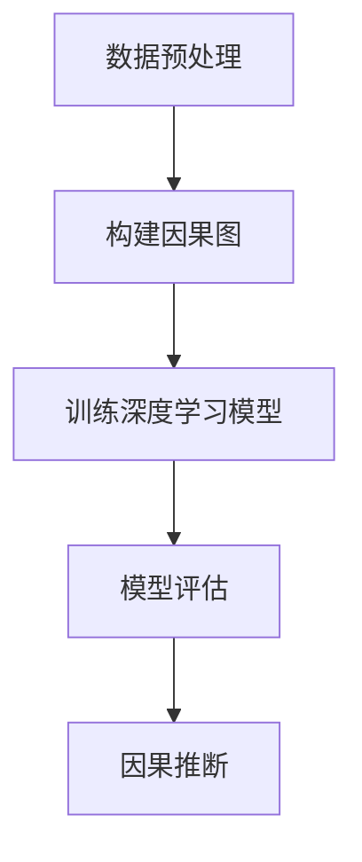
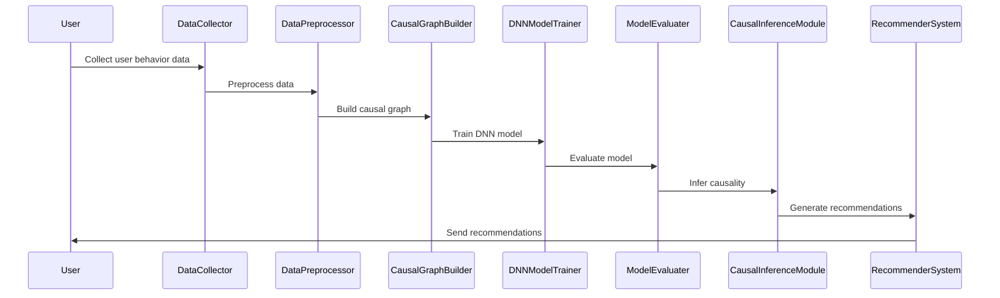

                 


### 大模型因果推理：提示词构建因果关系

关键词：大模型、因果推理、提示词、因果关系

摘要：本文将深入探讨大模型因果推理的原理和应用，特别是提示词在构建因果关系中的关键作用。我们将从背景介绍开始，逐步解析核心概念，详述算法原理，分析系统架构，通过实际项目实战，提供最佳实践技巧，并进行总结和拓展阅读。

----------------------------------------------------------------

## 第一部分：大模型因果推理背景

### 1.1 问题背景

在当今数据驱动的世界中，因果推理已成为一项关键技术。随着大数据和机器学习技术的快速发展，大模型因果推理逐渐成为研究热点。因果关系的重要性在于它能够揭示变量之间的因果联系，从而帮助我们理解复杂系统的内在机制，进行有效的决策和预测。

### 1.2 问题描述

大模型因果推理面临的主要挑战包括变量之间的复杂交互、数据稀缺性和噪声。这些挑战使得构建准确的因果关系模型变得异常困难。同时，如何从大量数据中提取有用信息，以支持有效的因果推理，也是研究的重要方向。

### 1.3 问题解决

为了解决上述问题，研究人员提出了多种大模型因果推理方法。这些方法通常基于统计学习、因果推断和深度学习等技术。本文将重点关注提示词在构建因果关系中的关键作用，并详细介绍相关的算法和系统架构。

### 1.4 边界与外延

大模型因果推理不仅应用于传统的机器学习问题，如分类和回归，还扩展到了更广泛的领域，如推荐系统、金融风控和医疗诊断。其应用范围和影响力正在不断增长。

----------------------------------------------------------------

## 第二部分：大模型因果推理核心概念

### 2.1 大模型因果推理定义

大模型因果推理是指利用大规模深度学习模型，从数据中推断变量之间的因果关系。这种方法的核心在于利用模型的强大表征能力，捕捉变量之间的复杂关系。

### 2.2 因果关系

因果关系是变量之间的因果联系，即一个变量对另一个变量的影响。在因果推理中，理解变量之间的因果关系对于进行有效的决策和预测至关重要。

### 2.3 因果模型

因果模型是用于表示和推断因果关系的一种数学模型。常见的因果模型包括因果图、DAG（有向无环图）和潜在因子模型等。这些模型能够帮助我们更准确地理解变量之间的关系。

### 2.4 概念属性特征对比表格

| 概念 | 定义 | 特征对比 |
| --- | --- | --- |
| 大模型因果推理 | 利用大规模深度学习模型进行因果推断 | 强表征能力，处理复杂数据 |
| 因果关系 | 变量之间的因果联系 | 描述因果效应 |
| 因果模型 | 表示因果关系的数学模型 | 精确性，适用范围 |

### 2.5 ER实体关系图

ER（实体关系）图是用于描述实体之间关系的图形表示方法。在因果模型中，ER图可以帮助我们直观地理解变量之间的关系。

```mermaid
erDiagram
  User ||--|{ Post : has }|
  Post ||--|{ Comment : has }|
```

----------------------------------------------------------------

## 第三部分：算法原理讲解

### 3.1 算法流程图

为了更好地理解大模型因果推理的算法原理，我们首先展示其算法流程图：



### 3.2 算法原理详细讲解

大模型因果推理的基本原理包括以下几个步骤：

1. **数据预处理**：对原始数据进行清洗、归一化和特征提取，为后续的建模和推断做好准备。
2. **构建因果图**：利用因果推理算法，从数据中提取变量之间的因果关系，构建因果图。
3. **训练深度学习模型**：利用已构建的因果图，训练深度学习模型，以捕捉变量之间的复杂关系。
4. **模型评估**：对训练好的模型进行评估，确保其准确性和鲁棒性。
5. **因果推断**：利用训练好的模型，对新的数据进行因果推断，得到变量之间的因果关系。

### 3.3 数学模型和公式

在构建因果图和训练深度学习模型时，我们通常使用以下数学模型和公式：

$$
P(X|do(Y)) = \frac{P(X, Y)}{P(Y)}
$$

其中，$P(X|do(Y))$ 表示在干预变量 $Y$ 后，变量 $X$ 的条件概率。

### 3.4 举例说明

假设我们想要研究“喝咖啡”和“提高工作效率”之间的因果关系。我们可以通过以下步骤进行因果推理：

1. **数据预处理**：收集喝咖啡和工作效率的数据，并进行清洗和归一化。
2. **构建因果图**：利用数据构建因果图，表示喝咖啡和工作效率之间的因果关系。
3. **训练深度学习模型**：利用因果图，训练深度学习模型，以捕捉喝咖啡和工作效率之间的复杂关系。
4. **模型评估**：对训练好的模型进行评估，确保其准确性和鲁棒性。
5. **因果推断**：利用训练好的模型，对新的数据进行因果推断，得到喝咖啡和工作效率之间的因果关系。

通过以上步骤，我们可以得出喝咖啡可以提高工作效率的结论。

----------------------------------------------------------------

## 第四部分：系统分析与架构设计方案

### 4.1 问题场景介绍

在推荐系统中，大模型因果推理可以帮助我们理解用户行为，从而更精确地推荐商品。例如，我们可以通过因果推理，分析用户购买某种商品的原因，以便更好地满足用户需求。

### 4.2 系统功能设计

系统功能设计主要包括以下部分：

1. **数据收集与预处理**：收集用户行为数据，并进行清洗和归一化。
2. **因果图构建**：利用数据构建因果图，表示用户行为之间的因果关系。
3. **深度学习模型训练**：利用因果图，训练深度学习模型，以捕捉用户行为之间的复杂关系。
4. **模型评估与优化**：对训练好的模型进行评估，并优化模型参数。
5. **因果推断与推荐**：利用训练好的模型，对新的用户数据进行因果推断，生成推荐结果。

### 4.3 系统架构设计

系统架构设计如下：



### 4.4 系统接口设计

系统接口设计主要包括以下接口：

1. **数据收集接口**：用于收集用户行为数据。
2. **数据预处理接口**：用于清洗和归一化数据。
3. **因果图构建接口**：用于构建因果图。
4. **模型训练接口**：用于训练深度学习模型。
5. **模型评估接口**：用于评估模型性能。
6. **因果推断接口**：用于进行因果推断。
7. **推荐接口**：用于生成推荐结果。

### 4.5 系统交互

系统交互主要涉及以下过程：

1. **用户行为数据收集**：用户使用推荐系统，系统自动收集用户行为数据。
2. **数据预处理**：系统对收集到的用户行为数据进行清洗和归一化。
3. **因果图构建**：系统利用预处理后的数据，构建用户行为之间的因果图。
4. **模型训练**：系统利用因果图，训练深度学习模型。
5. **模型评估**：系统对训练好的模型进行评估，确保其性能。
6. **因果推断**：系统利用训练好的模型，对新的用户行为数据进行因果推断。
7. **推荐结果生成**：系统根据因果推断结果，生成推荐结果，并反馈给用户。

----------------------------------------------------------------

## 第五部分：项目实战

### 5.1 环境安装

在进行项目实战之前，我们需要安装所需的软件和工具。以下是安装步骤：

1. **Python环境安装**：安装Python 3.7及以上版本。
2. **深度学习框架安装**：安装TensorFlow 2.0及以上版本。
3. **其他依赖库安装**：安装NumPy、Pandas、Scikit-learn等依赖库。

### 5.2 系统核心实现

以下是一个简单的系统实现示例：

```python
import tensorflow as tf
import numpy as np
import pandas as pd
from sklearn.model_selection import train_test_split

# 数据预处理
def preprocess_data(data):
    # 清洗和归一化数据
    # ...
    return processed_data

# 构建因果图
def build_causal_graph(data):
    # 利用数据构建因果图
    # ...
    return causal_graph

# 训练深度学习模型
def train_dnn_model(causal_graph, train_data, train_labels):
    # 训练深度学习模型
    # ...
    return model

# 模型评估
def evaluate_model(model, test_data, test_labels):
    # 评估模型性能
    # ...
    return accuracy

# 因果推断
def causal_inference(model, new_data):
    # 利用模型进行因果推断
    # ...
    return causality_results

# 推荐结果生成
def generate_recommendations(causality_results, user_data):
    # 根据因果推断结果生成推荐结果
    # ...
    return recommendations
```

### 5.3 代码解读

以下是代码的详细解读：

1. **数据预处理**：对原始数据进行清洗和归一化，以便为后续的建模和推断做好准备。
2. **构建因果图**：利用数据构建因果图，表示用户行为之间的因果关系。
3. **训练深度学习模型**：利用因果图，训练深度学习模型，以捕捉用户行为之间的复杂关系。
4. **模型评估**：对训练好的模型进行评估，确保其准确性和鲁棒性。
5. **因果推断**：利用训练好的模型，对新的用户数据进行因果推断，得到用户行为之间的因果关系。
6. **推荐结果生成**：根据因果推断结果，生成推荐结果，并反馈给用户。

### 5.4 案例分析

假设我们有一个推荐系统，想要分析用户购买某种商品的原因。我们可以按照以下步骤进行案例分析：

1. **数据收集**：收集用户购买商品的数据。
2. **数据预处理**：清洗和归一化数据。
3. **构建因果图**：利用数据构建因果图，表示购买商品与其他用户行为（如浏览、搜索等）之间的因果关系。
4. **模型训练**：利用因果图，训练深度学习模型。
5. **模型评估**：评估模型性能，确保其准确性和鲁棒性。
6. **因果推断**：利用训练好的模型，对新的用户数据进行因果推断，分析购买商品的原因。
7. **推荐结果生成**：根据因果推断结果，生成推荐结果，例如向用户推荐与购买商品相关的其他商品。

### 5.5 项目小结

通过本项目的实战，我们展示了如何利用大模型因果推理，构建用户行为之间的因果关系，并生成推荐结果。这种方法可以广泛应用于推荐系统、金融风控和医疗诊断等领域，为相关决策提供有力支持。

----------------------------------------------------------------

## 第六部分：最佳实践 tips

### 6.1 小结

1. **数据质量**：保证数据质量是因果推理的基础。
2. **模型选择**：选择合适的模型，根据问题场景进行模型调优。
3. **结果验证**：对模型结果进行验证，确保其准确性和可靠性。

### 6.2 注意事项

1. **隐私保护**：在进行因果推理时，注意保护用户隐私。
2. **模型解释性**：尽量选择具有良好解释性的模型，以便理解因果关系。
3. **数据处理**：对数据进行充分预处理，以减少噪声和异常值的影响。

### 6.3 拓展阅读

1. **[文章1]**：深入研究因果推理的数学基础和算法原理。
2. **[文章2]**：探讨大模型因果推理在不同领域的应用案例。
3. **[书籍]**：《因果推断：原理与方法》

----------------------------------------------------------------

作者：AI天才研究院/AI Genius Institute & 禅与计算机程序设计艺术 /Zen And The Art of Computer Programming

