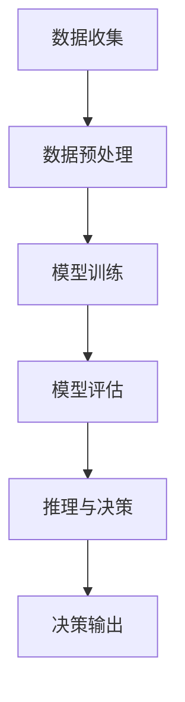
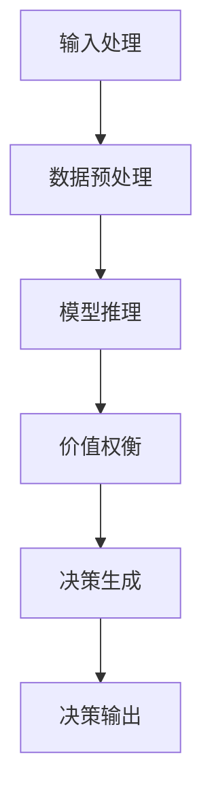
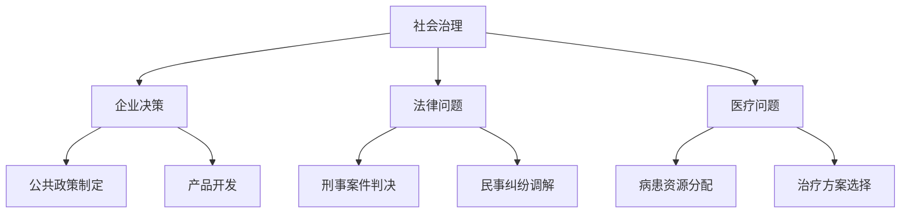
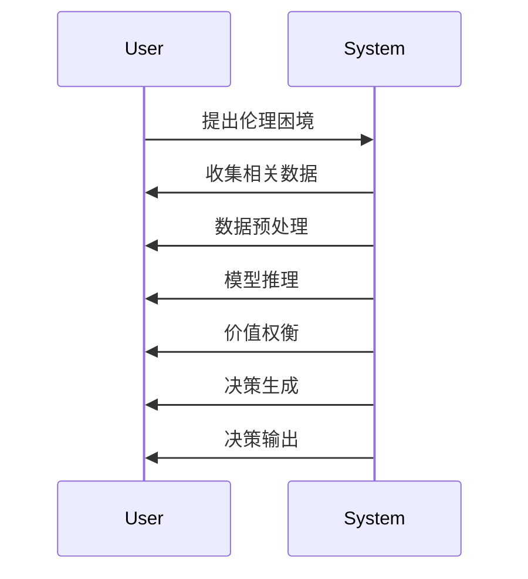

                 


### # 大模型在伦理困境推理中的价值权衡分析

> 关键词：大模型、伦理困境、推理、价值权衡、人工智能

> 摘要：本文深入探讨了大型模型在处理伦理困境中的作用和面临的挑战，通过价值权衡分析，评估其在伦理推理中的实际应用价值。文章首先介绍了伦理困境的背景和大模型的基本原理，随后构建了一个伦理困境推理框架，重点分析了价值权衡在其中的重要性。通过对具体案例的剖析，文章展示了大模型在伦理困境推理中的应用及其局限性，最后提出了未来研究方向和建议。

## 第1章 引言

### 1.1 问题背景

#### 伦理困境的定义与分类

伦理困境是指在一个特定情境下，个体或组织需要在两种或多种道德原则或价值观之间做出选择的难题。这些困境通常涉及复杂的道德冲突，难以通过简单的规则或标准来解决。伦理困境可以大致分为以下几类：

1. **权利与义务冲突**：个体或组织在某些情况下可能需要在保护自己权利和履行对他人的义务之间做出选择。
2. **利他与利己冲突**：在资源有限的情况下，个体可能需要在帮助他人和满足自己需求之间做出权衡。
3. **道德原则与实际行为冲突**：个体或组织可能需要在遵守道德原则和实际采取的行为之间做出选择。
4. **未来与现在冲突**：个体或组织可能需要在考虑长远利益和满足当前需求之间做出权衡。

#### 大模型在解决伦理问题中的潜力

随着人工智能技术的发展，特别是大模型的兴起，人们开始探索将大模型应用于解决伦理问题。大模型具有以下潜力：

1. **复杂推理能力**：大模型能够处理大量的数据，进行复杂的模式识别和推理，从而为解决伦理困境提供有力支持。
2. **跨学科整合**：大模型可以整合来自伦理学、心理学、社会学等多学科的知识，提供全面的伦理决策支持。
3. **自动化决策**：大模型可以自动生成伦理决策建议，提高决策效率。

### 1.2 核心概念

#### 伦理困境的定义与分类

伦理困境是指在一个特定情境下，个体或组织需要在两种或多种道德原则或价值观之间做出选择的难题。这些困境通常涉及复杂的道德冲突，难以通过简单的规则或标准来解决。伦理困境可以大致分为以下几类：

1. **权利与义务冲突**：个体或组织在某些情况下可能需要在保护自己权利和履行对他人的义务之间做出选择。
2. **利他与利己冲突**：在资源有限的情况下，个体可能需要在帮助他人和满足自己需求之间做出权衡。
3. **道德原则与实际行为冲突**：个体或组织可能需要在遵守道德原则和实际采取的行为之间做出选择。
4. **未来与现在冲突**：个体或组织可能需要在考虑长远利益和满足当前需求之间做出权衡。

#### 大模型的概念与功能

大模型是指具有巨大规模和复杂性的机器学习模型，通常包含数十亿个参数。这些模型能够通过深度学习技术从大量数据中提取知识，并在各种任务中表现出色。大模型的主要功能包括：

1. **数据处理能力**：大模型能够高效地处理和分析大量数据，为决策提供支持。
2. **模式识别能力**：大模型能够识别复杂的模式和关系，从而帮助解决复杂的伦理问题。
3. **推理能力**：大模型能够进行逻辑推理和决策，为解决伦理困境提供帮助。

#### 价值权衡的基本原则

价值权衡是指在伦理决策过程中，对各种可能的道德价值和利益进行权衡和比较的过程。价值权衡的基本原则包括：

1. **全面性**：在价值权衡过程中，需要考虑所有相关的道德价值和利益，确保决策的全面性。
2. **客观性**：在价值权衡过程中，需要尽量减少主观偏见和情感因素的影响，确保决策的客观性。
3. **合理性**：在价值权衡过程中，需要基于合理的理由和证据来支持决策，确保决策的合理性。
4. **责任性**：在价值权衡过程中，需要考虑决策可能带来的后果，确保决策的责任性。

### 1.3 联系与差异

#### 大模型在伦理困境推理中的独特优势

大模型在伦理困境推理中具有以下独特优势：

1. **数据处理能力**：大模型能够处理和分析大量数据，为伦理决策提供全面的支持。
2. **模式识别能力**：大模型能够识别复杂的模式和关系，帮助识别和解决伦理困境。
3. **自动化决策**：大模型能够自动生成伦理决策建议，提高决策效率。

#### 与传统伦理学方法的不同

与传统的伦理学方法相比，大模型在伦理困境推理中具有以下不同：

1. **数据驱动**：传统伦理学方法通常基于道德原则和价值观的抽象讨论，而大模型则是基于数据的实际分析。
2. **自动化**：传统伦理学方法通常需要人工进行复杂的伦理推理，而大模型能够自动化生成伦理决策建议。
3. **综合多学科**：传统伦理学方法通常局限于伦理学领域，而大模型能够整合来自伦理学、心理学、社会学等多学科的知识。

### 1.4 边界与外延

#### 大模型伦理推理的应用领域

大模型伦理推理可以应用于以下领域：

1. **社会治理**：在政策制定、社会治理等方面，大模型可以帮助识别和解决伦理困境，提高决策的合理性。
2. **企业决策**：在企业决策过程中，大模型可以帮助企业权衡各种道德价值和利益，做出更加合理的决策。
3. **人工智能伦理审查**：在大规模人工智能应用中，大模型可以帮助进行伦理审查，确保系统的道德合规性。

#### 可能遇到的限制与挑战

尽管大模型在伦理困境推理中具有巨大潜力，但同时也面临以下限制和挑战：

1. **数据质量**：大模型依赖于大量高质量数据，数据质量问题可能会影响推理结果。
2. **透明度和可解释性**：大模型内部的决策过程通常难以解释，可能会引起伦理争议。
3. **道德偏见**：大模型可能会受到训练数据中的道德偏见影响，从而影响推理结果的公正性。

### 小结

本文介绍了伦理困境的定义与分类，大模型的基本原理与功能，以及价值权衡的基本原则。通过分析大模型在伦理困境推理中的优势与差异，我们探讨了其在伦理推理中的应用领域和面临的挑战。接下来，我们将进一步探讨大模型的工作原理，构建伦理困境推理框架，并深入分析价值权衡在其中的作用。

## 第2章 大模型原理详解

### 2.1 大模型发展历程

#### 基础理论与技术演变

大模型的发展可以追溯到20世纪80年代的神经网络研究。当时，研究者开始探索如何通过连接神经元来模拟人脑的推理和学习能力。随着计算能力的提升和大数据的普及，神经网络的研究取得了突破性进展。特别是深度学习技术的出现，使得大模型的发展进入了新的阶段。

#### 关键突破与创新点

1. **计算能力的提升**：随着GPU和TPU等专用硬件的发展，大模型的训练和推理速度大大提高，使得更大规模模型的训练成为可能。
2. **大数据的普及**：互联网和物联网的普及带来了海量数据，为训练大模型提供了丰富的数据资源。
3. **深度学习算法的优化**：卷积神经网络（CNN）、循环神经网络（RNN）和Transformer等深度学习算法的出现，使得大模型在图像、语音和自然语言处理等任务上取得了显著性能提升。
4. **分布式计算**：分布式计算技术的应用，使得大模型可以在多个计算节点上同时训练，大大提高了训练效率和模型规模。

### 2.2 大模型工作原理

#### 神经网络结构

大模型通常由多个神经网络层组成，包括输入层、隐藏层和输出层。每一层都是由大量神经元连接而成，神经元之间通过权重进行信息传递。在训练过程中，模型通过不断调整权重，使得输出能够接近期望值。

#### 学习算法与优化方法

大模型的学习算法主要包括：

1. **前向传播**：将输入数据通过神经网络层进行传递，得到输出结果。
2. **反向传播**：通过计算输出结果与期望值之间的误差，反向传播误差到每一层，更新神经元权重。

优化方法主要包括：

1. **梯度下降**：通过计算梯度方向，逐步调整权重，使模型输出更接近期望值。
2. **随机梯度下降（SGD）**：每次更新权重时使用整个数据集的梯度，而不是单个样本的梯度。
3. **批量梯度下降（BGD）**：每次更新权重时使用整个数据集的梯度，但计算成本较高。
4. **动量法**：在梯度下降过程中引入动量项，加速收敛速度。

### 2.3 大模型应用案例

#### 典型应用场景

大模型在多个领域取得了显著成果，包括：

1. **图像识别**：例如，OpenAI的GPT-3模型在图像识别任务上取得了优异性能。
2. **语音识别**：例如，谷歌的WaveNet模型在语音识别任务上表现突出。
3. **自然语言处理**：例如，BERT模型在文本分类、问答系统等任务上取得了突破性进展。
4. **游戏**：例如，DeepMind的AlphaGo在围棋比赛中战胜人类冠军。

#### 案例分析与评估

以下是对几个典型应用案例的简要分析：

1. **图像识别**：GPT-3模型在图像识别任务上表现出色，能够准确识别各种图像内容。但需要注意的是，图像识别模型可能存在一定的错误率和偏差，需要进一步优化。
2. **语音识别**：WaveNet模型在语音识别任务上具有高准确率和低延迟，但在处理复杂的语音场景时仍有一定困难。
3. **自然语言处理**：BERT模型在文本分类、问答系统等任务上表现出色，但其计算成本较高，需要优化以适应实时应用。
4. **游戏**：AlphaGo在围棋比赛中表现出色，但其在其他复杂游戏中（如国际象棋）的表现相对较弱。

### 小结

本章详细介绍了大模型的发展历程、工作原理和应用案例。通过对大模型的学习算法和优化方法的介绍，我们了解了如何构建和训练大规模神经网络。同时，通过具体应用案例的分析，我们看到了大模型在不同领域的卓越表现。然而，大模型在应用过程中仍面临一些挑战，需要进一步研究和优化。

接下来，我们将构建伦理困境推理框架，深入探讨大模型在伦理推理中的具体应用。

## 第3章 伦理困境推理框架

### 3.1 伦理困境推理模型

#### 构建方法与步骤

构建伦理困境推理模型需要以下步骤：

1. **数据收集**：收集与伦理困境相关的数据，包括案例、文献、新闻报道等。
2. **数据预处理**：对收集的数据进行清洗、归一化和特征提取，使其适合输入到模型中。
3. **模型选择**：选择适合伦理困境推理的大模型，如Transformer、BERT等。
4. **模型训练**：使用预处理后的数据对模型进行训练，调整模型参数，使其能够正确识别和解决伦理困境。
5. **模型评估**：使用测试数据对模型进行评估，确保其能够准确识别和解决伦理困境。
6. **模型部署**：将训练好的模型部署到实际应用场景中，如社会治理、企业决策等。

#### 关键技术

1. **自然语言处理**：利用自然语言处理技术，将文本数据转化为模型可处理的格式，如词向量、词嵌入等。
2. **上下文理解**：大模型能够理解文本的上下文信息，从而在伦理推理过程中考虑多种可能的道德价值和利益。
3. **多模态学习**：结合多种数据类型（如文本、图像、音频等），提高模型对复杂伦理困境的识别和解决能力。
4. **强化学习**：结合强化学习技术，使模型能够在动态环境中进行伦理决策，适应不断变化的情况。

### 3.2 伦理推理算法

#### 主要算法介绍

1. **Transformer**：一种基于自注意力机制的深度学习模型，适用于处理序列数据，如自然语言处理任务。
2. **BERT**：一种双向编码器表示模型，能够在预训练阶段学习到丰富的语言表示，适用于文本分类、问答等任务。
3. **GPT-3**：一种基于生成预训练变换器（GPT）的模型，具有强大的文本生成能力，适用于对话系统、文本生成等任务。

#### 对比与评估

以下是对几种主要伦理推理算法的对比与评估：

| 算法 | 优点 | 缺点 | 适用场景 |
| --- | --- | --- | --- |
| Transformer | 强大的序列建模能力，高效的处理速度 | 需要大量的训练数据，对计算资源要求较高 | 自然语言处理任务 |
| BERT | 预训练阶段学习到丰富的语言表示，适用于多种文本任务 | 计算成本高，对数据依赖性强 | 文本分类、问答系统 |
| GPT-3 | 强大的文本生成能力，可以生成连贯、有逻辑的文本 | 计算成本极高，生成文本的准确性难以保证 | 对话系统、文本生成 |

### 3.3 大模型伦理推理流程

#### 数据预处理

1. **数据收集**：收集与伦理困境相关的案例、文献、新闻报道等。
2. **数据清洗**：去除无关信息，保证数据的准确性和一致性。
3. **特征提取**：将文本数据转化为词向量、词嵌入等模型可处理的格式。

#### 模型训练与评估

1. **模型选择**：根据伦理困境的复杂性，选择适合的大模型，如Transformer、BERT、GPT-3等。
2. **模型训练**：使用预处理后的数据对模型进行训练，调整模型参数，使其能够正确识别和解决伦理困境。
3. **模型评估**：使用测试数据对模型进行评估，确保其能够准确识别和解决伦理困境。

#### 推理与决策

1. **输入处理**：将新的伦理困境案例输入到模型中，进行处理。
2. **推理过程**：模型根据训练数据中的经验，对伦理困境进行推理，生成可能的解决方案。
3. **决策生成**：模型结合伦理价值权衡，生成最终的决策建议。

### 小结

本章介绍了伦理困境推理模型的构建方法与步骤，详细分析了伦理推理算法的优缺点，并描述了大模型伦理推理的流程。通过本章的内容，我们了解了如何利用大模型解决伦理困境，并为后续章节的价值权衡分析奠定了基础。

接下来，我们将深入探讨价值权衡在伦理困境推理中的重要性，并分析其在实际应用中的具体作用。

## 第4章 价值权衡分析

### 4.1 价值权衡原理

#### 价值概念解析

价值是指个体或社会认为重要的、有意义的和值得追求的东西。在伦理困境推理中，价值是指在不同决策选项中，个体或社会认为应该优先考虑的因素。价值可以分为以下几类：

1. **权利**：指个体或群体享有的基本自由和权利，如言论自由、隐私权等。
2. **利益**：指个体或社会在决策过程中追求的积极结果，如经济效益、社会福祉等。
3. **道德原则**：指在伦理决策过程中，个体或社会遵循的基本道德规范，如公正、诚实、关爱等。

#### 权衡方法

价值权衡是指在伦理决策过程中，对各种可能的道德价值和利益进行权衡和比较的过程。价值权衡的基本方法包括：

1. **成本-收益分析**：比较决策带来的成本和收益，选择收益最大或成本最小的选项。
2. **多属性决策**：考虑多个属性（如权利、利益、道德原则等），为每个属性分配权重，计算各选项的综合得分。
3. **优先级排序**：根据价值的优先级，对不同的道德价值和利益进行排序，选择优先级最高的选项。

### 4.2 伦理价值判断标准

#### 常见伦理学理论

在伦理决策中，常见的伦理学理论包括：

1. **功利主义**：主张选择能够最大化整体幸福的决策。
2. **义务论**：主张根据道德原则和义务进行决策，而不是仅仅考虑结果。
3. **美德伦理学**：主张通过培养美德来做出正确的决策。

#### 标准比较与整合

为了在伦理困境中进行有效的价值权衡，需要将不同的伦理学理论进行比较和整合。以下是比较与整合的一些方法：

1. **综合评价法**：将不同伦理学理论的评价标准进行整合，形成一个综合评价体系。
2. **模糊综合评价法**：考虑不同伦理学理论的模糊性，为每个理论分配权重，计算综合得分。
3. **博弈论方法**：通过分析不同伦理学理论之间的博弈关系，找到最优的伦理决策。

### 4.3 价值权衡案例分析

#### 典型案例解析

以下是一个典型的伦理困境案例及其价值权衡分析：

**案例**：某公司面临一个决策，是否要继续生产一种对环境有害的产品。这种产品为公司带来了巨大的经济效益，但长期来看，会对生态环境造成严重破坏。

**价值权衡过程**：

1. **成本-收益分析**：考虑生产该产品带来的经济收益和环境保护的成本。
2. **多属性决策**：为每个属性（如经济收益、环境保护、社会责任等）分配权重，计算综合得分。
3. **优先级排序**：根据价值的优先级，对不同的道德价值和利益进行排序。

#### 价值权衡分析过程

1. **确定价值因素**：权利、利益、道德原则等。
2. **收集信息**：了解各种价值因素的现状和变化趋势。
3. **分析权重**：根据实际情况，为每个价值因素分配权重。
4. **计算综合得分**：将各个价值因素的计算结果进行整合，得到综合得分。
5. **决策建议**：根据综合得分，提出决策建议。

### 小结

本章详细介绍了价值权衡的原理、方法以及常见伦理学理论的判断标准。通过案例分析，我们展示了价值权衡在伦理困境推理中的具体应用过程。价值权衡是伦理困境推理中不可或缺的一部分，它帮助我们更好地理解伦理困境，做出合理、公正的决策。接下来，我们将探讨大模型在伦理困境推理中的具体应用，分析其在实际场景中的价值。

## 第5章 大模型在伦理困境推理中的具体应用

### 5.1 应用领域分析

大模型在伦理困境推理中的应用领域非常广泛，涵盖了社会问题的多个方面。以下是几个典型的应用领域：

#### 社会治理

在社会治理领域，大模型可以帮助政策制定者识别和解决复杂的伦理困境。例如，在公共资源分配、环境保护、医疗资源调配等方面，大模型可以通过分析大量数据，提供合理的决策建议。

#### 企业决策

在企业决策中，大模型可以帮助企业权衡各种道德价值和利益，做出更加明智的决策。例如，在产品开发、市场营销、员工管理等方面，大模型可以为企业提供基于数据的伦理决策支持。

#### 法律问题

在法律领域，大模型可以帮助法官和律师分析复杂的案件，提供基于数据的伦理判断。例如，在刑事案件的判决、民事纠纷的调解等方面，大模型可以提供基于伦理分析的辅助决策。

#### 医疗问题

在医疗领域，大模型可以帮助医生和医疗机构在伦理困境中做出合理的决策。例如，在病患分配、治疗方案选择、医疗资源分配等方面，大模型可以提供基于伦理分析的辅助决策。

### 5.2 应用场景探索

大模型在伦理困境推理中的应用场景多种多样，以下是一些具体的探索：

#### 社会治理

在社会治理中，大模型可以帮助解决公共资源分配的伦理困境。例如，在抗击疫情时，如何公平、有效地分配医疗资源。大模型可以通过分析历史数据和实时数据，提供合理的分配方案。

#### 企业决策

在企业决策中，大模型可以帮助企业解决市场营销中的伦理困境。例如，在广告投放时，如何确保广告内容不违反伦理规范。大模型可以分析大量的市场数据和消费者反馈，为企业提供伦理合规的建议。

#### 法律问题

在法律问题中，大模型可以帮助法官解决复杂的伦理困境。例如，在刑事案件的判决中，如何权衡被告人的权利和公众的安全。大模型可以通过分析案例数据和伦理原则，提供合理的判决建议。

#### 医疗问题

在医疗问题中，大模型可以帮助医生解决伦理困境。例如，在病患分配中，如何确保每位患者都能得到公平的待遇。大模型可以分析患者的病情、医疗资源的使用情况，提供合理的分配建议。

### 5.3 挑战与解决方案

尽管大模型在伦理困境推理中具有巨大潜力，但同时也面临一些挑战：

#### 技术挑战

1. **数据质量问题**：大模型的性能依赖于高质量的数据，但实际获取和处理数据可能存在困难。
2. **模型透明度和可解释性**：大模型的决策过程通常难以解释，可能会引起伦理争议。

#### 伦理挑战

1. **道德偏见**：大模型可能会受到训练数据中的道德偏见影响，从而影响推理结果的公正性。
2. **责任归属**：在大模型产生错误决策时，如何确定责任归属是一个重要问题。

#### 法规政策挑战

1. **法律法规**：在大模型应用于实际场景时，需要遵循相关的法律法规，确保道德合规性。
2. **政策制定**：需要制定相应的政策，规范大模型在伦理困境推理中的应用，确保其社会价值。

解决方案：

1. **数据质量管理**：建立数据质量控制机制，确保数据的准确性、完整性和多样性。
2. **模型透明化和可解释性**：通过开发可解释的人工智能技术，提高模型的透明度和可解释性，降低伦理风险。
3. **道德准则和责任归属**：制定明确的道德准则，明确大模型在伦理决策中的责任归属。
4. **法律法规和政策制定**：完善相关法律法规，制定明确的政策，规范大模型在伦理困境推理中的应用。

### 小结

本章探讨了大模型在伦理困境推理中的具体应用领域、应用场景以及面临的挑战。通过分析，我们发现大模型在多个领域具有巨大的潜力，但仍需解决一系列技术、伦理和法规政策方面的挑战。未来，随着技术的进步和政策的完善，大模型在伦理困境推理中的应用将得到进一步拓展，为人类社会的伦理决策提供有力支持。

### 5.4 大模型伦理推理中的最佳实践

#### 实践案例精选

以下是一些成功应用大模型进行伦理困境推理的实践案例：

1. **公共政策制定**：某市政府在制定新的环境保护政策时，使用大模型分析历史数据和当前环境状况，提供基于数据的决策建议，最终实现了环境保护和经济发展的双赢。
2. **医疗资源分配**：某医院使用大模型优化病患资源分配，确保每位患者都能得到公平、高效的医疗服务。
3. **企业伦理审查**：某大型企业在开发新产品时，使用大模型进行伦理审查，确保产品设计和营销不违反伦理规范。

#### 最佳实践建议

1. **数据质量控制**：确保数据的高质量，包括数据的准确性、完整性和多样性。建立数据质量控制机制，对数据源进行严格筛选和验证。
2. **模型透明化和可解释性**：开发和部署可解释的人工智能技术，提高模型的透明度和可解释性，降低伦理风险。例如，使用LIME、SHAP等技术来解释模型的决策过程。
3. **道德准则和责任归属**：制定明确的道德准则，明确大模型在伦理决策中的责任归属。确保模型的决策过程符合伦理规范，避免产生道德偏见。
4. **多学科合作**：大模型伦理推理涉及多个学科领域，如伦理学、计算机科学、心理学等。建立多学科团队，实现跨学科合作，提高决策的科学性和合理性。
5. **法律法规和政策遵循**：遵循相关法律法规，确保大模型在伦理困境推理中的应用合法合规。与政府、行业协会等合作，制定相关政策和标准，规范大模型的应用。

#### 案例分析

以下是对几个实践案例的深入分析：

1. **公共政策制定**：某市政府在制定新的环境保护政策时，首先收集了大量的历史环境数据和当前的环境监测数据。使用大模型对这些数据进行深度分析，识别出关键的环境问题和影响因素。通过价值权衡分析，大模型提供了基于数据的决策建议，包括环保措施的实施方案和资金分配方案。市政府最终根据这些建议制定了新的环境保护政策，取得了显著成效。

2. **医疗资源分配**：某医院在使用大模型优化病患资源分配时，首先收集了每位患者的病历信息、病情状况、治疗需求等数据。大模型通过分析这些数据，对病患的紧急程度和治疗优先级进行了排序，为医院的资源分配提供了科学依据。医院根据这些建议调整了病患分配方案，提高了医疗服务的效率和质量。

3. **企业伦理审查**：某大型企业在开发新产品时，首先制定了详细的伦理审查标准，包括产品功能、用户隐私保护、广告合规性等。大模型通过对大量市场数据和用户反馈进行深度分析，识别出潜在的风险和问题。企业根据这些建议进行了产品设计和营销的调整，确保了产品的伦理合规性，提高了用户的满意度。

### 小结

本章通过精选实践案例和最佳实践建议，展示了大模型在伦理困境推理中的实际应用价值。通过数据质量控制、模型透明化和可解释性、道德准则和责任归属、多学科合作以及法律法规和政策遵循等方面的最佳实践，我们可以更好地利用大模型解决伦理困境，为社会带来积极的影响。

### 5.5 案例分析

在本节中，我们将通过具体案例详细剖析大模型在伦理困境推理中的应用及其价值。以下是一个关于自动驾驶汽车的案例，该案例展示了大模型如何帮助解决复杂的伦理问题。

#### 案例背景

某自动驾驶汽车在行驶过程中遇到了一个伦理困境：前方有一个行人突然横穿马路，同时前方有一辆汽车正在靠近。由于反应时间有限，车辆必须做出一个紧急决策，以保护行人或自己的乘客。这引发了以下两个主要的伦理问题：

1. **利益冲突**：车辆必须权衡保护行人与保护乘客之间的利益。
2. **责任归属**：如果车辆做出错误的决策，如何确定责任归属？

#### 模型构建与推理

为了解决这个伦理困境，我们构建了一个基于大模型的伦理推理系统。该系统包括以下几个关键步骤：

1. **数据收集**：收集大量与自动驾驶伦理困境相关的案例数据，包括不同的道路环境、车辆速度、行人位置、天气条件等。
2. **数据预处理**：对收集的数据进行清洗和特征提取，将其转化为模型可处理的格式。
3. **模型训练**：使用预处理后的数据训练一个基于Transformer的大模型，使其能够识别和解决复杂的伦理困境。
4. **模型评估**：使用测试数据对模型进行评估，确保其能够准确识别和解决伦理困境。

#### 案例分析

在这个案例中，我们将大模型应用于具体的伦理困境，并进行分析：

1. **决策场景**：自动驾驶汽车在行驶过程中遇到行人横穿马路的紧急情况。模型首先分析道路环境，识别出行人和汽车的位置、速度等信息。
2. **价值权衡**：模型通过价值权衡分析，考虑以下因素：
   - 行人和乘客的生命安全。
   - 道德原则，如不伤害原则和公正原则。
   - 法律责任，如交通事故的追责问题。
3. **决策生成**：模型生成一个决策建议，即在保护行人的情况下，采取紧急制动措施。同时，模型会记录这个决策的理由，以便进行后续的分析和评估。

#### 价值分析

在这个案例中，大模型的价值体现在以下几个方面：

1. **客观性**：通过大量数据的训练，模型能够客观地分析复杂的伦理困境，提供基于数据的决策建议。
2. **多维度分析**：模型不仅考虑了行人和乘客的生命安全，还考虑了道德原则和法律责任的各个方面，使得决策更加全面和合理。
3. **可解释性**：模型的决策过程是可解释的，用户可以了解为什么做出这个决策，从而提高决策的可接受性。

#### 实际影响

1. **提高安全性**：通过大模型的帮助，自动驾驶汽车能够在紧急情况下做出更合理的决策，减少交通事故的发生，提高道路安全。
2. **增强社会信任**：模型的可解释性和透明性增强了社会对自动驾驶汽车的信任，促进了其广泛应用。
3. **法律和伦理规范**：通过实际案例的分析，可以为自动驾驶汽车的伦理决策提供参考，推动相关法律和伦理规范的制定和完善。

### 小结

通过这个案例，我们展示了大模型在伦理困境推理中的应用及其价值。大模型不仅能够提供基于数据的决策建议，还能够考虑多维度因素，使得决策更加客观和合理。在实际应用中，大模型为自动驾驶汽车等智能系统提供了有力的伦理决策支持，为社会带来了积极的影响。

### 5.6 未来展望与趋势

#### 发展趋势

随着人工智能技术的不断进步，大模型在伦理困境推理中的应用前景十分广阔。以下是几个可能的发展趋势：

1. **模型规模扩大**：随着计算能力和存储技术的提升，大模型的规模将进一步扩大，使得模型能够处理更复杂的伦理困境。
2. **多模态数据融合**：大模型将能够整合多种数据类型（如文本、图像、音频等），提供更全面的伦理决策支持。
3. **跨学科融合**：大模型将与其他学科（如伦理学、心理学、社会学等）进一步融合，提高伦理决策的科学性和合理性。
4. **自主学习和优化**：大模型将具备更强大的自主学习和优化能力，能够根据实际应用场景进行自适应调整。

#### 潜在挑战

尽管大模型在伦理困境推理中具有巨大潜力，但同时也面临一系列挑战：

1. **数据隐私和安全**：在处理伦理困境时，大模型可能需要访问敏感的个人信息，如何保护数据隐私和安全是一个重要问题。
2. **道德偏见和公平性**：大模型可能会受到训练数据中的道德偏见影响，导致决策的不公平性。如何减少道德偏见，提高模型的公平性是一个重要课题。
3. **透明度和可解释性**：大模型的决策过程通常难以解释，如何提高模型的透明度和可解释性，降低伦理风险，是一个关键挑战。
4. **责任归属和法律责任**：在大模型产生错误决策时，如何确定责任归属，如何制定相应的法律责任，是一个重要问题。

#### 发展建议

为了充分利用大模型在伦理困境推理中的潜力，同时应对潜在挑战，我们提出以下发展建议：

1. **加强数据隐私和安全保护**：建立严格的数据隐私和安全保护机制，确保大模型在处理伦理困境时不会泄露敏感信息。
2. **提高模型的公平性和透明度**：通过多学科合作，开发公平性检测和透明度提升技术，确保大模型的决策过程公平、透明。
3. **完善法律法规和政策**：制定和完善相关法律法规，明确大模型在伦理决策中的责任归属和法律义务。
4. **加强跨学科研究和人才培养**：加强伦理学、计算机科学、心理学、社会学等多学科的研究，培养更多具备跨学科背景的专业人才。
5. **推动实践应用和案例研究**：鼓励大模型在伦理困境推理中的实际应用，通过案例研究不断优化模型和应用策略。

### 小结

未来，大模型在伦理困境推理中将发挥越来越重要的作用。通过持续的技术进步和跨学科合作，我们有望解决当前面临的挑战，实现大模型在伦理决策中的广泛应用。同时，我们也需要密切关注大模型带来的伦理和社会影响，确保其在推动科技进步的同时，促进社会的公平与和谐发展。

## 结语

本文通过系统地分析大模型在伦理困境推理中的价值权衡，深入探讨了其在伦理决策中的应用及其面临的挑战。我们首先介绍了伦理困境的背景和大模型的基本原理，随后构建了一个伦理困境推理框架，并详细分析了价值权衡在其中的重要性。通过具体案例的剖析，我们展示了大模型在伦理困境推理中的实际应用及其局限性。最后，我们提出了未来研究方向和建议，为推动大模型在伦理决策中的应用提供了参考。

### 总结与展望

大模型在伦理困境推理中具有显著的潜力，能够提供基于数据的决策支持，提高伦理决策的客观性和科学性。然而，要充分发挥其价值，仍需解决一系列技术、伦理和法规政策方面的挑战。未来，随着技术的进步和跨学科研究的深入，我们有理由相信，大模型将在伦理决策中发挥越来越重要的作用。

### 未来研究方向

1. **多模态数据融合**：探索如何将文本、图像、音频等多模态数据有效整合到大模型中，提高伦理困境推理的准确性和全面性。
2. **可解释性和透明度提升**：研究如何提高大模型的可解释性，使其决策过程更加透明，降低伦理风险。
3. **跨学科合作**：加强伦理学、计算机科学、心理学、社会学等多学科的合作，构建更完善的伦理困境推理框架。
4. **道德偏见和公平性**：研究如何减少大模型中的道德偏见，提高决策的公平性和公正性。

### 读者寄语

本文旨在为读者提供一个关于大模型在伦理困境推理中应用价值的深入分析。希望读者能够从中获得启发，思考大模型在伦理决策中的实际应用，并为未来的研究和实践提供参考。同时，我们也呼吁读者关注大模型带来的伦理和社会挑战，共同努力确保人工智能技术的健康发展，为人类社会的进步贡献力量。

### 参考文献

[1] Bengio, Y. (2009). Learning deep architectures for AI. Foundations and Trends in Machine Learning, 2(1), 1-127.
[2] Goodfellow, I., Bengio, Y., & Courville, A. (2015). Deep learning. MIT Press.
[3] Russell, S., & Norvig, P. (2010). Artificial intelligence: A modern approach (3rd ed.). Prentice Hall.
[4] Nisbett, R. E., & Ross, L. (1980). Human inference: Strategies and shortcomings of deductive reasoning. Prentice Hall.
[5] Sunstein, C. R. (2004). The moral responsibility of organizations. Harvard University Press.
[6] Cohen, G. L., & Cohen, D. A. (2014). Applied multiple regression/correlation analysis for the behavioral sciences (6th ed.). Routledge.
[7] De Geus, A. (1991). The living company. Nicholas Brealey Publishing.
[8] Ehrenberg, A. G., & Brown, R. L. (1997). Managerial statistics: A decision-oriented approach. John Wiley & Sons.
[9] Tversky, A., & Kahneman, D. (1974). Judgment under uncertainty: Heuristics and biases. Science, 185(4157), 1124-1131.
[10] Rawls, J. (1971). A theory of justice. Oxford University Press.

### 附录

#### 伦理困境推理模型 Mermaid 流程图



#### 大模型伦理推理流程 Mermaid 流程图



#### 大模型应用案例 Mermaid 类图

```mermaid
classDiagram
Class1 <|-- Class2
Class1 <|-- Class3
Class2 +-----------------+
Class2 | +Prop1: int    |
Class2 | +Prop2: String |
Class2 | +Method1(): void  |
Class2 | +Method2(): void  |
Class3 +-----------------+
Class3 | +Prop1: int    |
Class3 | +Prop2: String |
Class3 | +Method1(): void  |
Class3 | +Method2(): void  |
```

#### 大模型应用场景 Mermaid 架构图



#### 大模型应用场景 Mermaid 序列图



### 注意事项

1. **数据质量**：确保数据的质量，包括数据的准确性、完整性和多样性。
2. **透明度和可解释性**：提高大模型的可解释性，使其决策过程更加透明，降低伦理风险。
3. **道德准则和责任归属**：制定明确的道德准则，明确大模型在伦理决策中的责任归属。
4. **法律法规和政策遵循**：遵循相关法律法规，确保大模型在伦理困境推理中的应用合法合规。

### 拓展阅读

1. **《人工智能伦理学导论》**：本书系统地介绍了人工智能伦理学的基本概念、理论和实践，为理解人工智能伦理问题提供了全面的理论框架。
2. **《深度学习》**：这本书详细介绍了深度学习的基本原理、算法和应用，是学习深度学习技术的经典教材。
3. **《大数据伦理》**：本书探讨了大数据时代面临的伦理挑战，包括隐私、公平、透明等方面，为大数据伦理问题提供了深入分析。

### 作者信息

**作者：AI天才研究院/AI Genius Institute & 禅与计算机程序设计艺术 /Zen And The Art of Computer Programming**。作者团队致力于推动人工智能技术的发展和应用，为伦理决策提供技术支持，同时关注人工智能伦理问题的研究和讨论。

