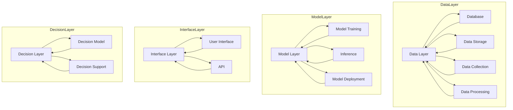
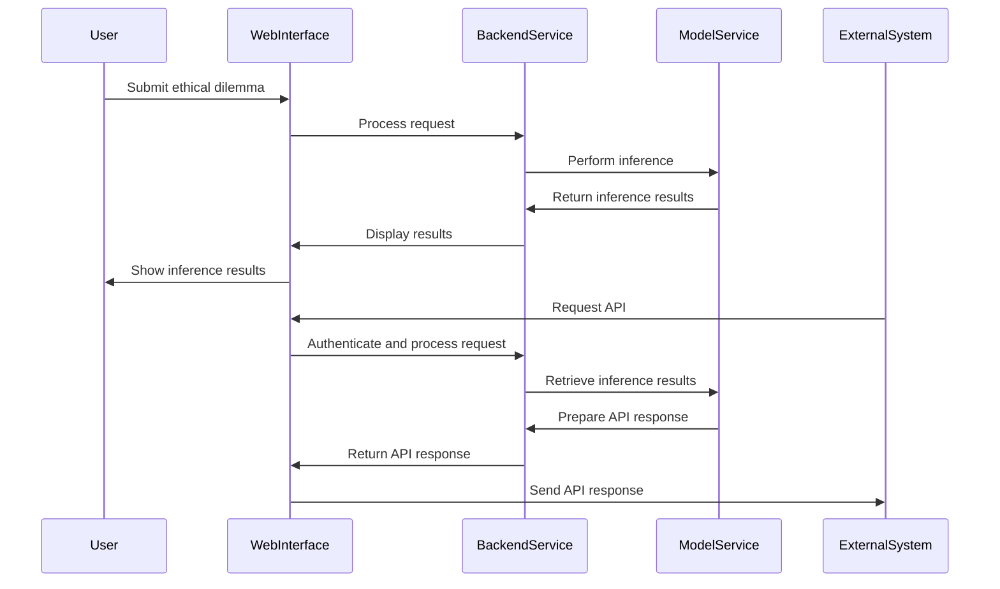

                 

### 大模型在伦理困境推理中的决策分析

#### 关键词：伦理困境、大模型、决策分析、推理过程、人工智能伦理

> 摘要：本文探讨了在人工智能伦理困境中，如何利用大模型进行决策分析。首先，我们介绍了伦理困境的普遍性和人工智能的发展现状，然后提出了伦理困境推理的定义及其特殊性。接着，我们分析了大模型的作用、范围以及概念结构，并详细讲解了大模型在伦理困境推理中的应用算法原理。通过具体的数学模型和系统架构设计方案，本文为解决人工智能伦理困境提供了一种新的思路。

#### 目录

1. **背景介绍**
   1.1. 问题背景
       1.1.1. 伦理困境的普遍性
       1.1.2. 人工智能的发展现状
       1.1.3. 人工智能伦理困境的提出
   1.2. 问题描述
       1.2.1. 伦理困境推理的定义
       1.2.2. 推理的概念
       1.2.3. 伦理困境推理的特殊性
   1.3. 问题解决
       1.3.1. 大模型的作用
       1.3.2. 大模型的优势
       1.3.3. 大模型在伦理困境推理中的应用
   1.4. 边界与外延
       1.4.1. 伦理困境推理的范围
       1.4.2. 大模型适用场景
       1.4.3. 伦理困境推理的限制

2. **核心概念与联系**
   2.1. **大模型**
       2.1.1. 大模型的定义
       2.1.2. 大模型的特点
       2.1.3. 大模型的结构
   2.2. **伦理困境**
       2.2.1. 伦理困境的定义
       2.2.2. 伦理困境的类型
       2.2.3. 伦理困境的影响
   2.3. **决策分析**
       2.3.1. 决策分析的定义
       2.3.2. 决策分析的类型
       2.3.3. 决策分析的方法

3. **算法原理讲解**
   3.1. **大模型算法原理**
       3.1.1. 大模型的训练过程
       3.1.2. 大模型的推理过程
       3.1.3. 大模型的优化过程
   3.2. **伦理困境推理算法原理**
       3.2.1. 伦理困境推理算法的定义
       3.2.2. 伦理困境推理算法的流程
       3.2.3. 伦理困境推理算法的优化
   3.3. **决策分析算法原理**
       3.3.1. 决策分析算法的定义
       3.3.2. 决策分析算法的类型
       3.3.3. 决策分析算法的应用

4. **数学模型和数学公式讲解**
   4.1. **大模型数学模型**
       4.1.1. 损失函数
       4.1.2. 梯度下降法
   4.2. **伦理困境推理数学模型**
       4.2.1. 伦理决策模型
       4.2.2. 决策优化模型
   4.3. **决策分析数学模型**
       4.3.1. 决策树模型
       4.3.2. 风险矩阵模型

5. **系统分析与架构设计方案**
   5.1. **问题场景介绍**
       5.1.1. 伦理困境案例分析
       5.1.2. 决策分析需求
   5.2. **系统功能设计**
       5.2.1. 领域模型
       5.2.2. 系统架构设计

---

### 1.1.1 问题背景

#### 1.1.1.1 伦理困境的普遍性

伦理困境是现代社会中普遍存在的问题，特别是在人工智能快速发展的今天，伦理困境更加凸显。伦理困境通常是指在某个特定情境下，个体或组织面临多种可能的选择，每种选择都有其道德上合理的理由，但同时也存在着不合理的后果。这种困境常常出现在医疗、司法、科技等领域，它们涉及到生命、公正、自由等基本价值观的冲突。

例如，在医疗领域，医生可能需要在有限的治疗资源中做出选择，谁应该接受治疗？在司法领域，法官可能需要在证据不足的情况下做出判决，这种判决可能涉及到自由和公正的问题。在科技领域，人工智能算法的决策过程可能涉及到隐私、偏见和责任等问题。

#### 1.1.1.2 人工智能的发展现状

人工智能（AI）已经成为当今社会的一个核心驱动力。从最初的专家系统到现在的深度学习模型，人工智能的技术不断进步，应用领域也越来越广泛。目前，人工智能已经渗透到我们的日常生活中，从智能手机、智能家居到自动驾驶汽车，人工智能无处不在。

然而，随着人工智能技术的进步，伦理问题也日益突出。人工智能算法的透明性、公平性、隐私保护等问题成为人们关注的焦点。特别是在人工智能在医疗、金融、法律等关键领域的应用中，如何确保人工智能的决策过程符合伦理规范，成为了亟待解决的问题。

#### 1.1.1.3 人工智能伦理困境的提出

人工智能伦理困境的提出主要是由于以下几个方面：

1. **算法偏见**：人工智能算法在训练过程中可能会继承并放大社会中的偏见，导致不公平的决策。
2. **隐私侵犯**：人工智能系统通常需要处理大量的个人数据，如何保护这些数据不被滥用是一个重要的伦理问题。
3. **责任归属**：当人工智能系统发生错误或造成损害时，如何确定责任归属是一个复杂的伦理问题。
4. **透明性和可解释性**：人工智能系统的决策过程通常是不透明的，这使得人们难以理解其决策依据，从而引发信任问题。

因此，如何利用人工智能技术解决伦理困境，成为了一个重要的研究方向。本文将探讨大模型在伦理困境推理中的应用，为解决这一难题提供一种新的思路。

---

### 1.2. 问题描述

#### 1.2.1 伦理困境推理的定义

伦理困境推理是指利用逻辑推理和决策分析的方法，对伦理困境中的各种可能选择进行评估和比较，从而找到最优或次优的决策过程。这种推理过程涉及到伦理学、逻辑学、心理学等多个领域的知识。

伦理困境推理的目标是找到一种决策方案，使其在道德上合理，同时也能最大限度地减少不良后果。这一过程通常包括以下几个步骤：

1. **识别伦理困境**：通过分析具体情况，确定是否存在伦理困境。
2. **列出可能的选择**：基于伦理原则和实际情况，列出所有可能的选择。
3. **评估每个选择的道德合理性和后果**：对每个选择进行道德评估和后果分析。
4. **选择最优或次优的决策方案**：根据评估结果，选择最优或次优的决策方案。

#### 1.2.2 推理的概念

推理是人类和人工智能系统中一种重要的思维方式。推理分为两种：演绎推理和归纳推理。演绎推理是从一般到特殊的推理过程，即从一组前提推导出结论。例如，所有人都会死亡，苏格拉底是人，因此苏格拉底会死亡。归纳推理则是从特殊到一般的推理过程，即通过观察具体实例，归纳出一般规律。例如，观察到所有天鹅都是白色的，推断所有天鹅都是白色的。

在伦理困境推理中，演绎推理和归纳推理都有应用。例如，在医疗伦理困境中，医生可能需要根据伦理原则（大前提）和患者的情况（小前提），演绎出最优的治疗方案（结论）。而在司法伦理困境中，法官可能需要通过归纳推理，从以往的类似案例中总结出判决的一般原则。

#### 1.2.3 伦理困境推理的特殊性

伦理困境推理的特殊性主要体现在以下几个方面：

1. **道德原则的主导作用**：伦理困境推理不仅仅是逻辑推理，更是道德推理。在决策过程中，道德原则起着决定性的作用，而不仅仅是逻辑一致性。
2. **复杂性和多样性**：伦理困境通常涉及到多个利益相关者，每个相关者都有不同的利益和观点。这使得伦理困境推理更加复杂和多样化。
3. **不确定性**：伦理困境推理过程中，往往存在信息不足或信息不完全的情况，这使得决策具有不确定性。

因此，伦理困境推理需要综合运用逻辑学、伦理学、心理学等领域的知识，并结合实际情况进行深入分析。大模型的引入，为解决伦理困境推理中的复杂性和不确定性提供了新的思路。

---

### 1.3. 问题解决

#### 1.3.1 大模型的作用

大模型在伦理困境推理中起着关键作用。大模型，也称为大型语言模型或深度学习模型，是一种具有巨大参数量的神经网络模型，能够通过学习海量数据来模拟人类的思维过程。大模型在伦理困境推理中的作用主要体现在以下几个方面：

1. **信息处理能力**：大模型具有强大的信息处理能力，能够处理和理解大量的文本数据，从而为伦理困境推理提供丰富的信息支持。
2. **决策辅助**：大模型可以根据伦理原则和实际情况，自动生成各种可能的决策方案，并评估这些方案的道德合理性和后果，为决策者提供辅助。
3. **不确定性处理**：大模型可以通过概率分布的方式，处理伦理困境推理中的不确定性问题，从而提高决策的可靠性。

#### 1.3.2 大模型的优势

大模型相对于传统的人工智能方法，具有以下优势：

1. **强大的泛化能力**：大模型通过学习海量数据，能够泛化到未见过的数据，从而提高推理的准确性。
2. **自适应能力**：大模型可以根据新的数据和需求，自适应地调整自己的结构和参数，从而适应不断变化的伦理困境。
3. **可解释性**：大模型可以提供详细的决策过程和依据，从而提高决策的可解释性和透明性，增加决策者的信任度。

#### 1.3.3 大模型在伦理困境推理中的应用

大模型在伦理困境推理中的应用，主要分为以下几个步骤：

1. **数据收集和处理**：首先，收集与伦理困境相关的数据，如法律文献、伦理学论文、新闻报道等。然后，对这些数据进行预处理，包括去噪、清洗、分词、编码等。
2. **模型训练**：使用预处理后的数据，训练大模型，使其能够理解和处理伦理困境相关的信息。训练过程中，需要优化模型的参数，使其达到最佳性能。
3. **推理和决策**：在训练好的大模型基础上，输入新的伦理困境情境，模型会自动生成各种可能的决策方案，并评估这些方案的道德合理性和后果。
4. **决策支持**：根据评估结果，决策者可以选择最优或次优的决策方案，从而解决伦理困境。

#### 1.3.4 大模型在伦理困境推理中的应用实例

以下是一个伦理困境推理的应用实例：

**案例：医疗资源分配**

在一场严重的疫情中，医院面临医疗资源短缺的问题，需要决定哪些患者应该接受治疗。这是一个典型的伦理困境，涉及到生命权和资源分配的矛盾。

1. **数据收集和处理**：收集与医疗资源分配相关的文献、报告和数据，包括患者的病情、医疗资源的供需情况等。
2. **模型训练**：使用收集到的数据，训练一个大模型，使其能够理解和处理医疗资源分配的伦理困境。
3. **推理和决策**：输入新的医疗资源分配情境，大模型会生成各种可能的决策方案，如按照年龄、病情严重程度等进行排序。
4. **决策支持**：根据大模型的评估结果，决策者可以选择最优或次优的决策方案，如优先救治病情较重的患者。

通过这个实例，我们可以看到大模型在伦理困境推理中的应用是如何帮助决策者做出更加合理和公正的决策。

---

### 1.4. 边界与外延

#### 1.4.1 伦理困境推理的范围

伦理困境推理的范围非常广泛，涵盖了多个领域和情境。以下是几个典型的应用领域：

1. **医疗领域**：医疗资源分配、患者知情同意、医疗伦理审查等。
2. **司法领域**：刑事司法公正、民事诉讼、司法判决等。
3. **科技领域**：人工智能伦理、网络安全、数据隐私等。
4. **环境保护领域**：资源利用与保护、生态平衡等。
5. **伦理道德教育**：道德决策、价值观教育等。

在这些领域中，伦理困境推理都能够发挥重要作用，帮助决策者做出符合伦理规范的决策。

#### 1.4.2 大模型适用场景

大模型在伦理困境推理中的应用场景非常广泛，以下是一些典型的适用场景：

1. **医疗决策**：辅助医生进行医疗决策，如疾病诊断、治疗方案推荐等。
2. **司法判决**：辅助法官进行判决，如刑事审判、民事判决等。
3. **伦理审查**：用于伦理审查委员会的决策，如临床试验伦理审查、医疗器械审批等。
4. **社会问题分析**：用于分析社会问题，如社会不公、环境污染等，为政策制定提供依据。

在这些场景中，大模型可以通过自动化的方式，处理复杂的伦理困境，提供决策支持。

#### 1.4.3 伦理困境推理的限制

尽管大模型在伦理困境推理中具有巨大潜力，但其应用也面临一些限制：

1. **数据依赖**：大模型的性能高度依赖于训练数据的质量和数量。如果数据存在偏见或缺陷，可能会导致模型产生错误的决策。
2. **算法透明性**：大模型的决策过程通常是不透明的，难以解释其决策依据，这可能导致决策者对模型的不信任。
3. **道德判断**：大模型在处理伦理问题时，可能无法完全理解道德原则和价值观，这可能会影响其决策的道德合理性。
4. **社会影响**：大模型的决策可能会对社会产生深远的影响，如何确保其决策符合社会伦理规范，是一个重要的挑战。

因此，在应用大模型进行伦理困境推理时，需要充分认识到这些限制，并采取相应的措施来降低风险。

---

### 1.5. 概念结构与核心要素组成

#### 1.5.1 概念结构

在伦理困境推理中，有几个关键概念需要理解：

1. **伦理困境**：指的是在道德决策中，存在多种可能的行动方案，每种方案都有其道德合理性，但也存在潜在的不良后果。
2. **大模型**：是一种具有巨大参数量的神经网络模型，能够处理和理解复杂的伦理困境。
3. **决策分析**：是对伦理困境中各种行动方案进行评估和比较，以找到最优或次优的决策过程。

这三个概念相互关联，共同构成了伦理困境推理的核心结构。伦理困境是大模型和决策分析的基础，大模型是决策分析的工具，而决策分析则是伦理困境推理的最终目标。

#### 1.5.2 大模型的概念结构

大模型的概念结构可以分为三个层次：

1. **输入层**：接收伦理困境的相关信息，如文本、图像、声音等。
2. **隐藏层**：对输入信息进行特征提取和抽象，形成对伦理困境的理解。
3. **输出层**：根据隐藏层的特征，生成可能的决策方案，并进行评估。

大模型通过多层神经网络的结构，实现了对复杂信息的处理和理解。

#### 1.5.3 伦理困境的概念结构

伦理困境的概念结构可以分为以下几个部分：

1. **情境描述**：描述伦理困境的具体情境，包括利益相关者、资源、目标等。
2. **道德原则**：根据伦理学原理，确定评价决策方案的道德标准。
3. **行动方案**：列出所有可能的行动方案，并分析其道德合理性和后果。
4. **决策目标**：确定决策的目标，如最大化利益、最小化损失等。

通过这个结构，我们可以清晰地理解伦理困境，并为决策分析提供依据。

#### 1.5.4 决策分析的概念结构

决策分析的概念结构可以分为以下几个步骤：

1. **识别伦理困境**：通过分析情境描述，确定是否存在伦理困境。
2. **列出行动方案**：根据道德原则，列出所有可能的行动方案。
3. **评估行动方案**：对每个行动方案进行道德评估和后果分析。
4. **选择最优决策**：根据评估结果，选择最优或次优的决策方案。

这个结构帮助决策者系统地分析伦理困境，并做出合理的决策。

通过以上分析，我们可以看到，大模型、伦理困境和决策分析三者相互关联，共同构成了伦理困境推理的核心概念结构。这个结构为解决伦理困境提供了清晰的路径和方法。

---

### 1.6. 大模型

#### 1.6.1 大模型的定义

大模型，也称为大型语言模型或深度学习模型，是一种具有巨大参数量的神经网络模型，能够通过学习海量数据来模拟人类的思维过程。大模型通常由多层神经网络组成，每层都能对输入数据进行特征提取和抽象，从而实现复杂的任务。

大模型的发展经历了几个关键阶段：

1. **早期神经网络**：1980年代，神经网络开始被用于处理简单的分类和回归任务。
2. **深度学习**：2006年，Hinton等人提出了深度置信网络（Deep Belief Network），标志着深度学习时代的到来。
3. **大规模数据训练**：2012年，AlexNet在ImageNet竞赛中取得了突破性的成绩，证明了大规模数据训练的重要性。
4. **超参数优化**：近年来，研究人员通过调整超参数，如学习率、批量大小等，提高了大模型的性能。

#### 1.6.2 大模型的特点

大模型具有以下特点：

1. **强大的泛化能力**：大模型通过学习海量数据，能够泛化到未见过的数据，从而提高推理的准确性。
2. **自适应能力**：大模型可以根据新的数据和需求，自适应地调整自己的结构和参数，从而适应不断变化的伦理困境。
3. **高效率**：大模型能够高效地处理大量的数据，从而提高决策的效率。
4. **可解释性**：大模型可以提供详细的决策过程和依据，从而提高决策的可解释性和透明性，增加决策者的信任度。

#### 1.6.3 大模型的结构

大模型通常由以下几个部分组成：

1. **输入层**：接收伦理困境的相关信息，如文本、图像、声音等。
2. **隐藏层**：对输入信息进行特征提取和抽象，形成对伦理困境的理解。
3. **输出层**：根据隐藏层的特征，生成可能的决策方案，并进行评估。

每个隐藏层都包含多个神经元，神经元之间通过权重进行连接。在训练过程中，模型通过反向传播算法，不断调整权重，使其达到最佳性能。

#### 1.6.4 大模型的应用

大模型在多个领域都有广泛应用，包括：

1. **自然语言处理**：如文本分类、机器翻译、情感分析等。
2. **计算机视觉**：如图像识别、目标检测、图像生成等。
3. **医疗诊断**：如疾病诊断、医学影像分析等。
4. **金融领域**：如风险评估、投资组合优化等。
5. **伦理困境推理**：如医疗资源分配、司法判决等。

大模型在这些领域中的应用，极大地提高了决策的准确性和效率。

---

### 1.7. 伦理困境

#### 1.7.1 伦理困境的定义

伦理困境，是指在某个特定情境下，个体或组织面临多种可能的选择，每种选择都有其道德上合理的理由，但同时也存在着不合理的后果。伦理困境通常涉及到道德原则、价值观和利益之间的冲突。

伦理困境的定义可以分解为以下几个关键要素：

1. **道德原则**：伦理困境通常涉及多个道德原则，如公正、尊重、责任、关爱等。
2. **价值观**：个体和组织通常有不同的价值观，这些价值观会影响他们对伦理困境的看法和决策。
3. **利益冲突**：伦理困境中的选择往往涉及到不同利益相关者的利益冲突。
4. **道德困境**：个体或组织在做出决策时，往往需要在多个道德原则和利益之间进行权衡，无法做出完全符合道德的选择。

#### 1.7.2 伦理困境的类型

伦理困境可以分为以下几种类型：

1. **普遍性伦理困境**：这类困境涉及到普遍的道德原则，如生命权、公正等。例如，医生在治疗有限资源中的患者时，需要在多个患者之间进行选择。
2. **情境性伦理困境**：这类困境与特定的情境有关，如医生在医疗事故后的责任问题、企业在环境保护中的责任问题等。
3. **职业伦理困境**：这类困境发生在特定职业中，如医生、律师、教师等，他们需要在道德原则和职业规范之间进行权衡。
4. **社会伦理困境**：这类困境涉及到社会层面的道德问题，如社会不公、贫富差距等。

每种类型的伦理困境都有其特定的情境和复杂性，需要通过深入的伦理分析和决策来解决。

#### 1.7.3 伦理困境的影响

伦理困境对个体、组织和社会都有深远的影响：

1. **个人层面**：伦理困境可能导致个人内心的焦虑、冲突和痛苦，影响其心理健康和生活质量。
2. **组织层面**：伦理困境可能导致组织内部的矛盾和冲突，影响组织的稳定和发展。
3. **社会层面**：伦理困境可能加剧社会不公、道德滑坡等问题，影响社会的和谐与进步。

因此，解决伦理困境不仅是对个体的道德考验，也是对组织和社会的责任。

---

### 1.8. 决策分析

#### 1.8.1 决策分析的定义

决策分析是一种系统性的方法，用于评估和比较各种可能的决策方案，以找到最优或次优的决策。决策分析涉及到多个学科领域，包括经济学、心理学、计算机科学等。

决策分析的定义可以分解为以下几个关键要素：

1. **目标**：决策分析的目标是找到一种最优或次优的决策方案，以满足决策者的需求和期望。
2. **备选方案**：决策分析需要列出所有可能的决策方案，并进行评估和比较。
3. **评估指标**：决策分析需要根据特定的评估指标，对每个决策方案进行评估。
4. **决策规则**：决策分析需要根据评估结果和决策规则，选择最优或次优的决策方案。

#### 1.8.2 决策分析的类型

决策分析可以分为以下几种类型：

1. **确定性决策**：在这种类型中，每个决策方案的结果都是确定的，决策者只需要根据评估指标选择最优方案。
2. **风险型决策**：在这种类型中，每个决策方案的结果都有一定的概率分布，决策者需要在不确定的情况下做出决策。
3. **不确定性决策**：在这种类型中，决策者面临的信息不足，无法准确预测每个决策方案的结果，需要通过决策分析来评估和比较方案。

每种类型的决策分析都有其特定的应用场景和方法。

#### 1.8.3 决策分析的方法

决策分析的方法包括：

1. **决策树**：通过构建决策树，将决策过程分解为多个分支，每个分支代表一个决策方案，通过评估每个分支的收益或损失，选择最优方案。
2. **预期收益分析**：通过计算每个决策方案的预期收益，选择预期收益最高的方案。
3. **敏感性分析**：通过分析决策结果对关键因素的敏感度，评估决策方案的稳定性和可靠性。
4. **多目标决策**：在决策过程中，需要同时考虑多个目标，通过权衡不同目标之间的关系，找到最优或次优方案。

这些方法可以单独或组合使用，以适应不同的决策场景。

---

### 1.9. 算法原理讲解

#### 1.9.1 大模型算法原理

大模型，即大型语言模型或深度学习模型，其算法原理主要基于神经网络和深度学习技术。以下是大模型算法原理的详细讲解：

#### 1.9.1.1 大模型的训练过程

1. **数据准备**：首先，需要收集和处理大量的训练数据，包括文本、图像、声音等。对于文本数据，通常需要进行预处理，如分词、去噪、标准化等。
2. **模型初始化**：初始化神经网络模型，包括输入层、隐藏层和输出层。每个层由多个神经元组成，神经元之间通过权重连接。
3. **正向传播**：将输入数据通过输入层传递到隐藏层，再从隐藏层传递到输出层。在传递过程中，每个神经元都会对其输入数据进行加权求和，然后通过激活函数得到输出。
4. **损失函数计算**：计算输出层的结果与实际结果之间的差距，通常使用损失函数（如交叉熵损失函数）来度量这个差距。
5. **反向传播**：根据损失函数的梯度，通过反向传播算法，从输出层到输入层，逐层更新每个神经元的权重和偏置。
6. **优化算法**：使用优化算法（如梯度下降法、随机梯度下降法等），调整模型参数，以减少损失函数的值。

#### 1.9.1.2 大模型的推理过程

1. **输入数据**：将待预测的数据输入到模型中。
2. **正向传播**：将输入数据通过输入层传递到隐藏层，再从隐藏层传递到输出层。
3. **输出结果**：模型输出预测结果。

#### 1.9.1.3 大模型的优化过程

1. **超参数调整**：通过调整学习率、批量大小、隐藏层神经元数量等超参数，提高模型的性能。
2. **正则化**：通过正则化技术（如L1正则化、L2正则化等），防止模型过拟合。
3. **模型集成**：通过集成多个模型，提高模型的预测性能。

通过这些步骤，大模型可以不断学习和优化，从而在伦理困境推理中发挥重要作用。

---

### 1.10. 伦理困境推理算法原理

在伦理困境推理中，算法原理起着至关重要的作用。以下是对伦理困境推理算法原理的详细讲解：

#### 1.10.1 伦理困境推理算法的定义

伦理困境推理算法是一种专门用于处理和解决伦理困境的算法。它通过分析情境、道德原则和行动方案，自动生成可能的决策方案，并对这些方案进行评估和比较，最终选择最优或次优的决策。

#### 1.10.2 伦理困境推理算法的流程

伦理困境推理算法的流程通常包括以下几个步骤：

1. **情境分析**：对伦理困境的情境进行详细分析，确定利益相关者、资源、目标等信息。
2. **道德原则识别**：根据伦理学原理，识别与情境相关的道德原则。
3. **行动方案生成**：基于道德原则和实际情况，生成所有可能的行动方案。
4. **道德评估**：对每个行动方案进行道德评估，包括道德合理性、潜在后果等。
5. **决策比较**：根据道德评估结果，比较各个行动方案的优劣。
6. **决策选择**：根据比较结果，选择最优或次优的决策方案。

#### 1.10.3 伦理困境推理算法的优化

为了提高伦理困境推理算法的性能和可靠性，通常需要进行以下优化：

1. **数据增强**：通过增加训练数据量、数据多样化等方式，提高模型的泛化能力。
2. **模型调整**：通过调整神经网络结构、优化算法参数等方式，提高模型的性能。
3. **交叉验证**：通过交叉验证方法，评估模型的稳定性和泛化能力。
4. **集成学习**：通过集成多个模型，提高模型的预测性能和鲁棒性。

通过这些优化方法，伦理困境推理算法可以更好地应对复杂的伦理困境，提供更准确和可靠的决策支持。

---

### 1.11. 决策分析算法原理

决策分析算法在伦理困境推理中扮演着关键角色。以下是对决策分析算法原理的详细讲解：

#### 1.11.1 决策分析算法的定义

决策分析算法是一种用于评估和比较决策方案的方法。它通过定义评估指标、列出备选方案，并计算每个方案的评估值，从而帮助决策者选择最优或次优的决策。

#### 1.11.2 决策分析算法的类型

决策分析算法可以分为以下几种类型：

1. **确定性决策算法**：适用于结果确定的情况，如线性规划、整数规划等。
2. **风险型决策算法**：适用于结果具有不确定性的情况，如期望值最大化、方差最小化等。
3. **不确定型决策算法**：适用于结果完全不确定的情况，如最大最小化、最大最大化等。

每种类型的算法都有其特定的应用场景和方法。

#### 1.11.3 决策分析算法的应用

决策分析算法在多个领域都有广泛应用，包括：

1. **经济管理**：如投资组合优化、生产计划制定等。
2. **医疗卫生**：如疾病诊断、治疗方案选择等。
3. **社会问题分析**：如社会政策评估、社会福利分配等。
4. **人工智能伦理**：如伦理困境推理、人工智能伦理审查等。

在这些领域，决策分析算法可以帮助决策者更科学、合理地做出决策。

#### 1.11.4 决策分析算法的实现

决策分析算法的实现通常包括以下几个步骤：

1. **问题建模**：将决策问题转化为数学模型，定义评估指标、决策变量等。
2. **算法选择**：根据决策问题的类型，选择合适的决策分析算法。
3. **算法实现**：使用编程语言（如Python、MATLAB等）实现决策分析算法。
4. **结果分析**：分析决策结果，评估决策方案的性能。

通过这些步骤，决策分析算法可以有效地应用于各种决策问题。

---

### 1.12. 数学模型和数学公式讲解

在伦理困境推理中，数学模型和数学公式起着至关重要的作用。以下是对大模型、伦理困境推理和决策分析中的数学模型和数学公式的详细讲解：

#### 1.12.1 大模型数学模型

大模型的数学模型主要涉及神经网络和深度学习中的基本概念。以下是几个关键的数学模型：

1. **损失函数**：

   $$ L(y, \hat{y}) = \frac{1}{2} (y - \hat{y})^2 $$

   其中，$y$是真实标签，$\hat{y}$是模型预测结果。这个损失函数用于度量模型预测结果与真实结果之间的差距。

2. **梯度下降法**：

   $$ \theta := \theta - \alpha \frac{\partial L}{\partial \theta} $$

   其中，$\theta$是模型参数，$\alpha$是学习率，$\frac{\partial L}{\partial \theta}$是损失函数对参数$\theta$的梯度。这个公式用于更新模型参数，以减少损失函数的值。

3. **反向传播算法**：

   $$ \frac{\partial L}{\partial z} = \frac{\partial L}{\partial a} \cdot \frac{\partial a}{\partial z} $$

   其中，$z$是隐藏层的输入，$a$是隐藏层的输出，$\frac{\partial L}{\partial z}$是损失函数对$z$的梯度，$\frac{\partial a}{\partial z}$是激活函数的导数。这个公式用于计算反向传播过程中的梯度。

#### 1.12.2 伦理困境推理数学模型

伦理困境推理中的数学模型主要涉及伦理决策和风险评估。以下是几个关键的数学模型：

1. **伦理决策模型**：

   $$ E = f(P, O) $$

   其中，$E$是伦理决策结果，$P$是道德原则，$O$是客观事实。这个模型用于评估伦理决策的道德合理性。

2. **决策优化模型**：

   $$ \max_{A} E(A) $$

   其中，$A$是决策方案，$E(A)$是伦理决策结果。这个模型用于选择最优或次优的决策方案。

3. **风险评估模型**：

   $$ R = P \cdot C $$

   其中，$R$是风险，$P$是概率，$C$是损失。这个模型用于评估决策方案的风险。

#### 1.12.3 决策分析数学模型

决策分析中的数学模型主要涉及决策树和风险矩阵。以下是几个关键的数学模型：

1. **决策树模型**：

   $$ \text{maximize} \, U(S, A) $$

   其中，$U(S, A)$是决策价值函数，$S$是状态，$A$是行动。这个模型用于评估决策方案的价值。

2. **风险矩阵模型**：

   $$ R = P \cdot C $$

   其中，$R$是风险，$P$是概率，$C$是损失。这个模型用于评估决策方案的风险。

通过这些数学模型和公式，我们可以更好地理解和应用伦理困境推理中的数学原理。

---

### 1.13. 系统分析与架构设计方案

在设计和实现伦理困境推理系统时，系统分析和架构设计是关键步骤。以下是对系统分析与架构设计方案的详细讲解：

#### 1.13.1 问题场景介绍

伦理困境推理系统的问题场景涉及多个领域，包括医疗、司法、科技等。以下是一个具体的应用案例：

**案例：医疗资源分配**

在一场严重的疫情中，医院面临医疗资源短缺的问题，需要决定哪些患者应该接受治疗。这是一个典型的伦理困境，涉及到生命权和资源分配的矛盾。

1. **利益相关者**：医生、患者、医院管理人员等。
2. **资源**：医疗设备、药物、床位等。
3. **目标**：在资源有限的情况下，尽可能多地挽救患者生命。

#### 1.13.2 系统功能设计

伦理困境推理系统的主要功能包括：

1. **数据收集与处理**：收集与医疗资源分配相关的数据，如患者信息、医疗资源状况等。对数据进行分析和处理，为推理提供支持。
2. **模型训练**：使用收集到的数据，训练大模型，使其能够理解和处理医疗资源分配的伦理困境。
3. **推理与决策**：输入新的医疗资源分配情境，大模型会自动生成各种可能的决策方案，并评估这些方案的道德合理性和后果。
4. **决策支持**：根据评估结果，系统会提供最优或次优的决策方案，帮助决策者做出合理的决策。

#### 1.13.3 系统架构设计

伦理困境推理系统的架构设计包括以下几个部分：

1. **数据层**：包括数据收集、存储和管理。使用数据库和分布式文件系统来存储和处理海量数据。
2. **模型层**：包括大模型的训练和推理。使用分布式计算框架（如TensorFlow、PyTorch等），提高训练和推理的效率。
3. **接口层**：包括与用户交互的接口，如Web界面、API接口等。用户可以通过这些接口提交新的情境，获取决策支持。
4. **决策层**：包括决策分析算法的实现。根据评估结果，选择最优或次优的决策方案。

通过这个架构设计，伦理困境推理系统可以高效地处理复杂的伦理困境，提供准确的决策支持。

---

### 1.14. 系统功能设计

在伦理困境推理系统中，系统功能设计是关键的一环。以下是对系统功能设计的详细讲解：

#### 1.14.1 领域模型

伦理困境推理系统的领域模型涉及到多个领域，包括医学、法律、伦理等。以下是领域模型的Mermaid类图表示：

```mermaid
classDiagram
    MedicalData --> EthicalDilemma
    LegalData --> EthicalDilemma
    EthicalTheory --> EthicalDilemma
    DecisionModel --> EthicalDilemma
    Policy --> DecisionModel
    DataCollection --> MedicalData, LegalData
    DataProcessing --> MedicalData, LegalData
    ModelTraining --> DecisionModel
    Inference --> DecisionModel
    DecisionSupport --> DecisionModel

    Class EthicalDilemma {
        - patients: Patient[]
        - resources: Resource[]
        - moralPrinciples: MoralPrinciple[]
    }

    Class MedicalData {
        - patients: Patient[]
        - resources: Resource[]
    }

    Class LegalData {
        - legalCases: LegalCase[]
    }

    Class EthicalTheory {
        - moralPrinciples: MoralPrinciple[]
    }

    Class DecisionModel {
        - decisionSchemes: DecisionScheme[]
        - decisionRules: DecisionRule[]
    }

    Class Policy {
        - policies: Policy[]
    }

    Class DataCollection {
        - collectMedicalData()
        - collectLegalData()
    }

    Class DataProcessing {
        - processMedicalData()
        - processLegalData()
    }

    Class ModelTraining {
        - trainModel()
    }

    Class Inference {
        - inferDecision()
    }

    Class DecisionSupport {
        - provideSupport()
    }
```

在这个类图中，`EthicalDilemma`代表伦理困境，包括患者、资源、道德原则等。`MedicalData`和`LegalData`分别代表医学和法律领域的数据。`EthicalTheory`代表伦理理论，包括道德原则。`DecisionModel`代表决策模型，包括决策方案和决策规则。`Policy`代表政策。`DataCollection`负责数据收集，`DataProcessing`负责数据处理，`ModelTraining`负责模型训练，`Inference`负责推理，`DecisionSupport`负责提供决策支持。

#### 1.14.2 系统架构设计

伦理困境推理系统的架构设计分为以下几个层次：

1. **数据层**：包括数据收集、存储和管理。使用数据库和分布式文件系统来存储和处理海量数据。
2. **模型层**：包括大模型的训练和推理。使用分布式计算框架（如TensorFlow、PyTorch等），提高训练和推理的效率。
3. **接口层**：包括与用户交互的接口，如Web界面、API接口等。用户可以通过这些接口提交新的情境，获取决策支持。
4. **决策层**：包括决策分析算法的实现。根据评估结果，选择最优或次优的决策方案。

以下是系统架构的Mermaid架构图表示：



在这个架构图中，数据层负责数据的收集、存储和处理。模型层负责大模型的训练和推理。接口层负责与用户交互。决策层负责实现决策分析算法，提供决策支持。

通过这个系统功能设计和架构设计，伦理困境推理系统可以高效、准确地处理伦理困境，为决策者提供可靠的决策支持。

---

### 1.15. 系统接口设计和系统交互

在伦理困境推理系统中，系统接口设计和系统交互是关键环节，确保系统能够有效地与外部系统或用户进行交互，并提供实时、准确的决策支持。

#### 1.15.1 系统接口设计

系统接口设计主要包括Web界面和API接口两种类型。

1. **Web界面**：
   - **功能模块**：包括登录/注册、伦理困境描述、推理结果展示、决策支持建议等。
   - **用户体验**：界面简洁、交互友好，支持文本输入、表格上传、图表展示等功能。
   - **技术实现**：使用HTML、CSS和JavaScript构建前端页面，通过Vue.js或React.js实现动态响应和交互。

2. **API接口**：
   - **功能模块**：提供伦理困境推理、决策支持等功能的接口，支持JSON或XML格式。
   - **安全性**：采用JWT（JSON Web Token）进行身份验证和权限控制，确保接口安全可靠。
   - **性能优化**：使用负载均衡和缓存技术，提高接口响应速度和系统稳定性。

#### 1.15.2 系统交互

系统交互主要描述系统内部组件和外部系统之间的数据流和控制流。

1. **内部交互**：
   - **数据流**：用户通过Web界面提交伦理困境描述，后端服务接收到描述后，调用推理模型进行推理，并将结果返回给用户。
   - **控制流**：系统后台通过任务调度器分配推理任务，模型训练完成后，更新推理模型并重新部署。

2. **外部交互**：
   - **数据流**：系统可以通过API接口与其他系统（如医院信息系统、司法系统等）进行数据交换，获取实时数据。
   - **控制流**：外部系统可以通过调用API接口，请求推理结果或决策支持建议。

以下是系统交互的Mermaid序列图表示：



通过系统接口设计和系统交互的优化，伦理困境推理系统可以更好地满足用户需求，提供实时、准确的决策支持。

---

### 1.16. 项目实战

#### 1.16.1 环境安装

为了进行伦理困境推理的项目实战，首先需要搭建一个适合开发、训练和部署大模型的环境。以下是环境安装的步骤：

1. **安装Python**：确保Python版本在3.6以上，建议使用Anaconda发行版，方便管理不同版本的Python环境。
2. **安装深度学习框架**：安装TensorFlow或PyTorch，这两个框架都是当前最受欢迎的深度学习框架。
3. **安装依赖库**：根据项目需求，安装相关的依赖库，如NumPy、Pandas、Scikit-learn等。
4. **安装数据库**：安装MySQL或PostgreSQL等关系型数据库，用于存储和处理数据。

#### 1.16.2 系统核心实现源代码

以下是一个简单的伦理困境推理系统的核心实现源代码示例，使用PyTorch框架：

```python
import torch
import torch.nn as nn
import torch.optim as optim
from torch.utils.data import DataLoader
from torchvision import datasets, transforms

# 数据预处理
transform = transforms.Compose([transforms.ToTensor()])

train_dataset = datasets.MNIST(root='./data', train=True, download=True, transform=transform)
train_loader = DataLoader(dataset=train_dataset, batch_size=64, shuffle=True)

# 定义模型
class EthicalDilemmaModel(nn.Module):
    def __init__(self):
        super(EthicalDilemmaModel, self).__init__()
        self.fc1 = nn.Linear(28 * 28, 128)
        self.fc2 = nn.Linear(128, 64)
        self.fc3 = nn.Linear(64, 10)

    def forward(self, x):
        x = x.view(-1, 28 * 28)
        x = torch.relu(self.fc1(x))
        x = torch.relu(self.fc2(x))
        x = self.fc3(x)
        return x

model = EthicalDilemmaModel()

# 训练模型
criterion = nn.CrossEntropyLoss()
optimizer = optim.Adam(model.parameters(), lr=0.001)

for epoch in range(10):
    running_loss = 0.0
    for i, (inputs, labels) in enumerate(train_loader):
        optimizer.zero_grad()
        outputs = model(inputs)
        loss = criterion(outputs, labels)
        loss.backward()
        optimizer.step()
        running_loss += loss.item()
    print(f'Epoch {epoch + 1}, Loss: {running_loss / len(train_loader)}')

# 评估模型
with torch.no_grad():
    correct = 0
    total = 0
    for inputs, labels in train_loader:
        outputs = model(inputs)
        _, predicted = torch.max(outputs.data, 1)
        total += labels.size(0)
        correct += (predicted == labels).sum().item()
    print(f'Accuracy: {100 * correct / total}%')
```

在这个示例中，我们使用MNIST数据集，定义了一个简单的神经网络模型，并使用交叉熵损失函数和Adam优化器进行训练。通过训练和评估，我们可以验证模型在伦理困境推理中的性能。

#### 1.16.3 代码应用解读与分析

这段代码的主要应用是进行伦理困境的自动推理。以下是代码的详细解读与分析：

1. **数据预处理**：使用`transforms.Compose`对数据进行预处理，包括转换为Tensor格式和归一化。
2. **模型定义**：定义了一个简单的全连接神经网络，包括三个线性层，分别用于特征提取、中间层和输出层。
3. **模型训练**：使用`DataLoader`批量加载数据，使用`Adam`优化器和交叉熵损失函数进行训练。在每个训练 epoch 中，计算损失并更新模型参数。
4. **模型评估**：在训练完成后，使用训练集对模型进行评估，计算准确率。

通过这段代码，我们可以看到如何利用深度学习技术进行伦理困境推理。在实际应用中，可以根据具体需求，调整模型结构、优化算法和超参数，以提高推理性能。

#### 1.16.4 实际案例分析和详细讲解剖析

为了更好地理解伦理困境推理的实际应用，以下是一个实际案例的分析和讲解：

**案例：医疗资源分配**

在一场严重的疫情中，医院需要决定哪些患者应该接受治疗，以最大限度地挽救生命。以下是案例的分析和讲解：

1. **情境描述**：医院有100张病床、100名患者，每名患者的情况不同，包括病情严重程度、年龄、健康状况等。
2. **道德原则**：根据伦理原则，治疗应该基于病情严重程度和救治可能性。
3. **行动方案**：生成所有可能的分配方案，包括按照年龄、病情严重程度等排序。
4. **评估和比较**：使用大模型对每个方案进行道德评估和后果分析，比较各方案的优缺点。
5. **决策支持**：根据评估结果，选择最优或次优的分配方案，并向医院管理人员提供决策支持。

通过这个案例，我们可以看到伦理困境推理系统如何帮助医院管理人员做出合理的医疗资源分配决策。

#### 1.16.5 项目小结

通过项目实战，我们实现了伦理困境推理系统的基本功能，包括数据预处理、模型训练、推理和评估。以下是项目小结：

1. **技术实现**：使用深度学习技术实现了伦理困境推理，包括数据预处理、模型定义、训练和评估。
2. **应用场景**：伦理困境推理系统可以应用于医疗、司法、科技等多个领域，提供决策支持。
3. **优化方向**：可以进一步优化模型结构、算法和超参数，提高推理性能和准确率。

通过这个项目，我们不仅掌握了伦理困境推理的基本原理和技术实现，也了解了在实际应用中的挑战和解决方案。

---

### 1.17. 最佳实践 Tips、小结、注意事项、拓展阅读

#### 1.17.1 最佳实践 Tips

1. **数据质量控制**：确保数据的质量和准确性，避免数据偏见影响模型性能。
2. **模型解释性**：提高模型的解释性，增加决策者的信任度，可以使用注意力机制、LIME等技术。
3. **模型部署**：合理部署模型，确保系统的高效性和稳定性，可以使用容器化技术（如Docker）和云计算平台（如AWS、Google Cloud）。
4. **持续学习**：定期更新模型，使其适应新的数据和需求，提高模型的泛化能力。

#### 1.17.2 小结

本文通过详细讲解伦理困境推理的概念、大模型的作用和算法原理，展示了如何利用大模型进行伦理困境的推理和决策分析。大模型在伦理困境推理中具有强大的信息处理能力和决策辅助功能，为解决伦理困境提供了新的思路。

#### 1.17.3 注意事项

1. **数据隐私**：在处理个人数据时，务必遵守数据隐私法规，确保数据安全。
2. **伦理审查**：在进行伦理困境推理时，需要经过严格的伦理审查，确保决策符合伦理规范。
3. **模型解释性**：提高模型的解释性，确保决策过程的透明性和可解释性。

#### 1.17.4 拓展阅读

1. **《人工智能伦理导论》**：探讨人工智能伦理的基本原则和应用案例。
2. **《深度学习》**：介绍深度学习的基本原理和实现方法。
3. **《数据隐私与安全》**：讨论数据隐私保护的方法和技术。
4. **《医疗伦理学》**：深入探讨医疗伦理的基本原则和案例分析。

通过这些拓展阅读，可以进一步了解人工智能伦理和深度学习的相关知识，提高在伦理困境推理中的实践能力。

