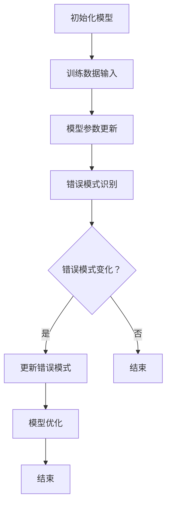
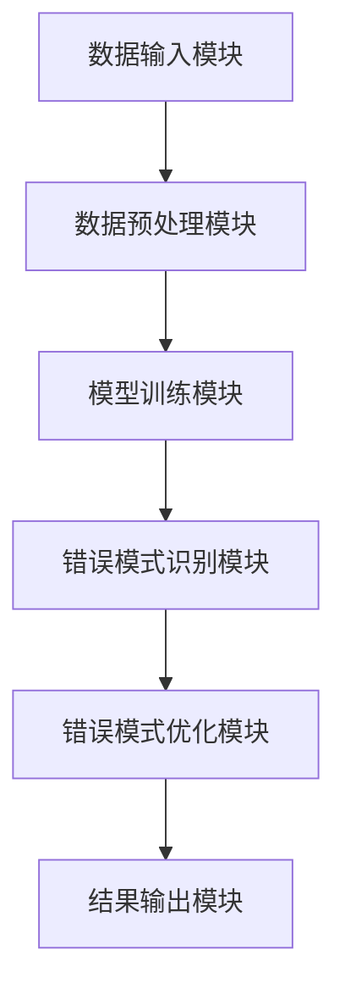
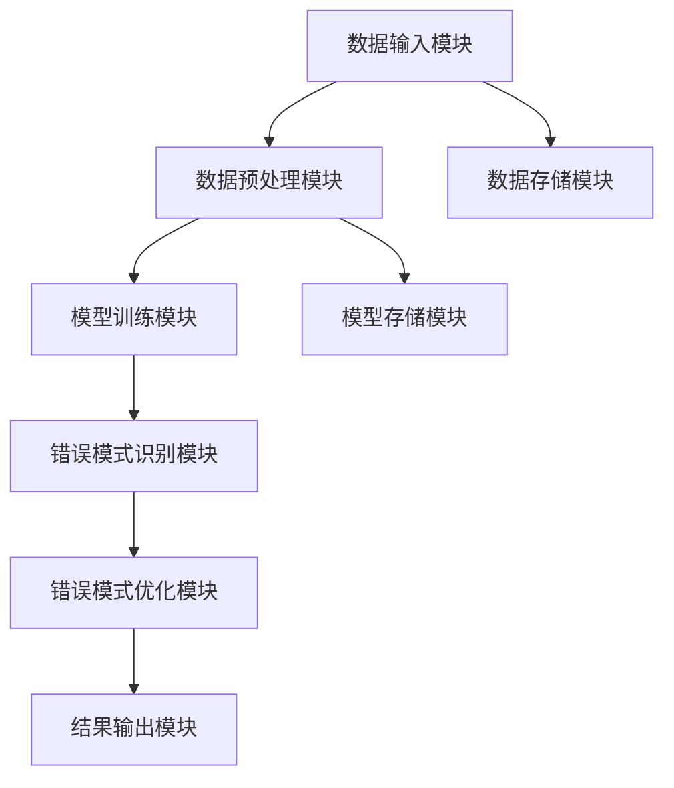
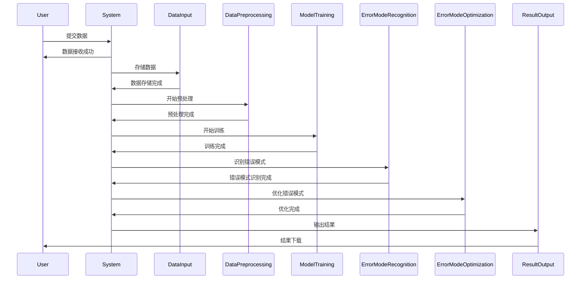

                 

### 引言

#### 2.1 问题背景

在当今人工智能领域，大模型（如GPT、BERT等）取得了显著的进展，它们在自然语言处理、图像识别、语音识别等领域展现出了强大的性能。然而，随着这些模型在现实世界中的应用越来越广泛，人们开始注意到一个严峻的问题：大模型在反常识推理（Anomaly Reasoning）中存在错误模式。反常识推理是指从异常或不寻常的数据中推断出合理的解释，这对于解决复杂问题、发现潜在风险具有重要意义。

#### 2.1.1 反常识推理的重要性

反常识推理是人工智能领域中一个重要的研究方向。在医疗诊断、金融风控、网络安全等多个领域，反常识推理的应用可以有效提高决策的准确性。例如，在医学影像诊断中，通过分析异常图像特征，可以帮助医生更快地发现疾病；在金融风控中，通过识别异常交易行为，可以预防欺诈行为的发生。

#### 2.1.2 大模型在反常识推理中的应用

大模型在反常识推理中的应用主要集中在自然语言处理领域。例如，GPT-3可以生成各种形式的文本，包括新闻报道、对话、诗歌等，这为反常识推理提供了丰富的数据来源。同时，大模型在图像识别和语音识别中也可以通过分析异常数据来提高系统的鲁棒性。

#### 2.1.3 大模型错误模式的现状与挑战

尽管大模型在反常识推理中具有很大的潜力，但现实情况是，这些模型在处理异常数据时往往会出现错误。这些错误不仅会影响模型的性能，还可能导致严重的后果。例如，在医疗诊断中，如果模型错误地认为正常图像是异常图像，可能会导致误诊；在金融风控中，如果模型错误地识别出正常的交易行为是异常行为，可能会导致资金损失。

目前，关于大模型错误模式的研究还处于初步阶段，主要面临着以下几个挑战：

1. **错误模式的识别与分类**：如何有效地识别和分类大模型在反常识推理中的错误模式，是一个亟待解决的问题。
2. **错误原因的分析**：了解错误模式背后的原因，对于改进模型性能具有重要意义。
3. **错误模式的演化**：错误模式是否会在模型训练过程中演化，以及如何对其进行控制和优化，也是一个重要的研究方向。

本文将围绕这些挑战展开讨论，通过逐步分析大模型在反常识推理中的错误模式，探讨可能的解决方案，以期为人工智能领域的发展提供有益的参考。

#### 2.2 核心概念与联系

在探讨大模型在反常识推理中的错误模式之前，我们需要了解一些核心概念，包括反常识推理的定义、大模型的定义，以及两者之间的联系。

##### 2.2.1 反常识推理的定义

反常识推理（Anomaly Reasoning）是一种从异常或不寻常的数据中推断出合理解释的推理过程。它不同于传统的逻辑推理和模式识别，反常识推理更加关注数据的特异性和非预期性。在人工智能领域中，反常识推理被广泛应用于医疗诊断、金融风控、网络安全等领域。

##### 2.2.1.1 反常识推理的概念

反常识推理的核心是“异常”这一概念。异常数据通常是指那些与大多数数据样本不同的数据点，这些数据点可能包含错误、异常行为或潜在的风险。例如，在医疗诊断中，异常数据可能代表患者的一些非典型的临床表现；在金融风控中，异常数据可能代表一些异常的交易行为。

##### 2.2.1.2 反常识推理的属性特征对比表格

| 特征名称 | 传统逻辑推理 | 模式识别 | 反常识推理 |
| :----: | :----: | :----: | :----: |
| 数据类型 | 确定性数据 | 确定性数据 | 确定性数据与异常数据 |
| 推理目标 | 合理性证明 | 合理性验证 | 合理性发现 |
| 数据处理 | 结构化数据 | 非结构化数据 | 异常数据 |
| 算法复杂性 | 低 | 中等 | 高 |

通过上表，我们可以看到反常识推理与传统逻辑推理和模式识别相比，具有更高的算法复杂性和更强的处理异常数据的能力。

##### 2.2.2 大模型的定义

大模型（Large-scale Model）是指具有大规模参数和计算能力的人工智能模型。这些模型通常通过深度学习技术训练，能够在多种任务中实现高性能。大模型的应用范围非常广泛，包括自然语言处理、图像识别、语音识别等。

##### 2.2.2.1 大模型的概念

大模型的核心特点是其参数量和计算量巨大。例如，GPT-3拥有1750亿个参数，其训练需要大量的计算资源和时间。这使得大模型在处理复杂数据和执行高级任务时具有显著的优势。

##### 2.2.2.2 大模型的特点

1. **高参数量**：大模型具有数亿到数千亿的参数，这使得模型能够捕捉到数据中的细微特征。
2. **高计算复杂性**：大模型的训练和推理过程需要大量的计算资源，通常需要使用高性能计算机集群。
3. **跨领域适应性**：大模型具有较强的通用性，可以在不同领域和任务中应用。

##### 2.2.3 大模型与反常识推理的联系

大模型在反常识推理中的应用主要表现在以下几个方面：

1. **异常数据的识别**：大模型通过学习大量数据，可以有效地识别出异常数据，提高异常检测的准确性。
2. **异常原因的推断**：大模型可以基于异常数据，推断出异常的原因，为问题诊断和风险控制提供支持。
3. **异常模式的演化分析**：大模型可以通过对异常数据的学习，分析异常模式的演化趋势，为模型的优化提供依据。

然而，大模型在反常识推理中也存在一些挑战，如错误模式的识别和分类，这些挑战需要通过进一步的研究来解决。

#### 2.2.3 大模型在反常识推理中的错误模式分析

##### 2.2.3.1 大模型在反常识推理中的作用

大模型在反常识推理中发挥着至关重要的作用。它们通过学习大量的正常数据，能够有效地识别出异常数据，从而提高系统的鲁棒性和准确性。例如，在医学诊断中，大模型可以通过分析患者的临床数据，识别出可能患有的疾病，从而帮助医生做出更准确的诊断。

##### 2.2.3.2 大模型在反常识推理中的挑战

尽管大模型在反常识推理中具有巨大的潜力，但它们也面临一些挑战：

1. **错误模式的识别与分类**：大模型在处理异常数据时可能会出现错误，这些错误模式需要被有效识别和分类，以便进行针对性的优化。
2. **错误原因的分析**：了解大模型在反常识推理中出现错误的原因，对于改进模型性能具有重要意义。
3. **错误模式的演化**：大模型在训练过程中可能会出现错误模式的演化，这需要通过持续的研究来控制和优化。

在接下来的章节中，我们将深入探讨大模型在反常识推理中的错误模式，分析其产生的根源，并提出可能的解决方案。

#### 2.2.4 大模型在反常识推理中的错误模式分类

为了更好地理解和应对大模型在反常识推理中的错误模式，我们需要对其进行分类。错误模式分类有助于我们识别问题的根源，并制定相应的解决方案。以下是几种常见的错误模式及其特点：

##### 2.2.4.1 逻辑错误

逻辑错误是指大模型在推理过程中由于逻辑推理错误导致的错误结果。这些错误可能源于以下原因：

1. **数据预处理错误**：数据预处理是模型训练的重要步骤，如果预处理不当，可能导致模型对数据的理解出现偏差。
2. **逻辑规则不完善**：在构建逻辑规则时，如果规则不完善，可能导致模型无法正确地推理出结果。

逻辑错误的典型特征是模型在处理正常数据时也能出现错误结果，这与异常数据无关。

##### 2.2.4.2 统计错误

统计错误是指大模型在处理异常数据时由于统计模型不准确导致的错误结果。这些错误可能源于以下原因：

1. **模型过拟合**：如果模型在训练过程中过于依赖训练数据，可能导致模型在处理未见过的异常数据时表现不佳。
2. **统计分布不正确**：如果异常数据的统计分布与训练数据不同，可能导致模型无法正确地预测结果。

统计错误的典型特征是模型在处理异常数据时容易出现错误结果，而在处理正常数据时表现良好。

##### 2.2.4.3 深度学习错误

深度学习错误是指大模型在深度学习过程中由于参数设置不当、网络结构不合理等原因导致的错误结果。这些错误可能源于以下原因：

1. **网络结构复杂度**：如果网络结构过于复杂，可能导致模型难以优化，从而出现错误结果。
2. **参数设置不当**：如果模型的参数设置不合理，可能导致模型无法正确地学习数据。

深度学习错误的典型特征是模型在训练过程中出现错误，且错误结果与数据质量密切相关。

##### 2.2.4.4 硬件错误

硬件错误是指由于硬件故障或配置不当导致的错误结果。这些错误可能源于以下原因：

1. **计算资源不足**：如果计算资源不足，可能导致模型训练过程不完整，从而导致错误结果。
2. **硬件故障**：硬件故障可能导致模型在运行过程中出现异常，从而出现错误结果。

硬件错误的典型特征是模型在运行过程中突然出现错误，且与数据无关。

通过对这些错误模式进行分类，我们可以更准确地诊断大模型在反常识推理中的问题，并采取相应的措施进行优化。

#### 2.2.5 大模型在反常识推理中的错误模式案例分析

为了更好地理解大模型在反常识推理中的错误模式，我们通过具体案例进行分析。以下是几个典型的案例及其错误模式：

##### 2.2.5.1 案例一：医疗诊断中的错误

在医疗诊断中，大模型被用于分析医学影像，以帮助医生发现潜在疾病。然而，在实际应用中，大模型有时会错误地诊断正常影像为异常，导致误诊。这种错误属于逻辑错误，可能源于以下原因：

1. **数据预处理不足**：在预处理过程中，如果正常影像的数据特征被削弱，可能导致模型在识别正常影像时出现偏差。
2. **逻辑规则不完善**：如果模型的逻辑规则不足以区分正常和异常影像，可能导致模型在处理正常影像时出现错误。

案例一中的错误模式可以通过改进数据预处理方法和完善逻辑规则来优化。

##### 2.2.5.2 案例二：金融风控中的错误

在金融风控中，大模型被用于分析交易数据，以识别潜在欺诈行为。然而，在实际应用中，大模型有时会错误地识别正常交易为欺诈交易，导致资金损失。这种错误属于统计错误，可能源于以下原因：

1. **模型过拟合**：如果模型在训练过程中过于依赖训练数据，可能导致模型在处理未见过的正常交易时表现不佳。
2. **统计分布不正确**：如果正常交易的统计分布与训练数据不同，可能导致模型无法正确地预测结果。

案例二中的错误模式可以通过增加训练数据的多样性、调整模型参数等方法来优化。

##### 2.2.5.3 案例三：网络安全中的错误

在网络安全中，大模型被用于分析网络流量数据，以识别潜在的安全威胁。然而，在实际应用中，大模型有时会错误地识别正常流量为攻击流量，导致网络误报。这种错误属于深度学习错误，可能源于以下原因：

1. **网络结构复杂度**：如果网络结构过于复杂，可能导致模型难以优化，从而出现错误结果。
2. **参数设置不当**：如果模型的参数设置不合理，可能导致模型无法正确地学习数据。

案例三中的错误模式可以通过简化网络结构、调整参数设置等方法来优化。

通过对这些案例的分析，我们可以看到大模型在反常识推理中存在多种错误模式，这些错误模式对实际应用产生了严重影响。了解这些错误模式的产生原因，对于改进大模型在反常识推理中的性能具有重要意义。

#### 2.2.6 大模型在反常识推理中的错误模式演化

大模型在反常识推理中的错误模式不仅存在于静态数据中，还可能随着训练过程的进行而演化。错误模式的演化可能对模型的性能产生重大影响，因此，研究错误模式的演化规律对于优化模型具有重要意义。

##### 2.2.6.1 错误模式演化的原因

大模型在反常识推理中的错误模式演化主要受到以下因素的影响：

1. **数据分布变化**：随着训练过程的进行，模型所接触到的数据分布可能会发生变化，导致错误模式也随之演化。
2. **模型参数更新**：在训练过程中，模型参数会不断更新，这可能导致错误模式的变化。
3. **训练策略调整**：训练策略的调整，如学习率的变化、正则化参数的调整等，也可能导致错误模式的演化。

##### 2.2.6.2 错误模式演化的流程图

为了更好地理解错误模式的演化过程，我们可以使用Mermaid流程图来描述：



在该流程图中，模型首先进行初始化，然后通过训练数据输入进行参数更新和错误模式识别。如果检测到错误模式发生了变化，模型会更新错误模式并进行优化，否则训练过程结束。

##### 2.2.6.3 错误模式演化的分析

错误模式演化的分析主要包括以下方面：

1. **错误模式的变化趋势**：通过分析错误模式的变化趋势，可以了解错误模式演化的方向和速度。
2. **错误模式的稳定性**：错误模式的稳定性是指错误模式在长时间内的变化程度。稳定性越高的错误模式，对模型的影响越小。
3. **错误模式的控制策略**：针对错误模式的演化，可以制定相应的控制策略，如调整训练策略、增加数据多样性等，以减缓错误模式的演化速度。

通过错误模式演化的分析，我们可以更好地理解大模型在反常识推理中的错误模式，并为模型优化提供依据。

#### 4.1 问题场景介绍

在现代社会中，数据已经成为一种重要的资源，而人工智能技术在数据处理和分析方面具有巨大的优势。尤其是在反常识推理（Anomaly Reasoning）领域，通过分析大量数据，人工智能可以识别出异常模式，从而帮助企业和组织做出更明智的决策。然而，在实际应用中，人工智能系统往往面临着一系列问题，这些问题不仅影响了系统的性能，还可能带来严重的后果。

首先，我们以医疗诊断为例。在医疗领域，医生需要根据患者的临床表现和医学影像数据进行诊断。传统的诊断方法依赖于医生的丰富经验和专业知识，而人工智能系统可以通过学习大量的医学数据，自动诊断出疾病。然而，在实际应用中，人工智能系统可能会出现错误，例如将正常影像误判为异常影像，导致误诊。这种错误不仅会浪费医疗资源，还可能给患者带来不必要的恐慌。

其次，在金融风控领域，人工智能系统被广泛应用于交易监控和欺诈检测。通过对大量的交易数据进行分析，系统可以识别出异常交易行为，从而预防欺诈行为的发生。然而，人工智能系统在处理异常数据时也存在挑战，例如将正常交易误判为欺诈交易，导致无辜的客户遭受损失。

此外，在网络安全领域，人工智能系统可以分析网络流量数据，识别潜在的安全威胁。然而，网络攻击形式多样，人工智能系统在处理异常流量时可能会出现误判，导致网络安全系统失效。

综上所述，人工智能系统在反常识推理中的应用面临着诸多挑战，包括误判、性能不稳定、适应性差等。这些问题不仅影响了系统的实用性，还可能带来严重的经济和社会影响。因此，解决这些问题对于人工智能技术的发展具有重要意义。

#### 4.2 项目介绍

为了应对人工智能系统在反常识推理中的挑战，我们设计并实施了一个名为“大模型在反常识推理中的错误模式分析”的项目。该项目旨在通过深入研究和分析大模型在反常识推理中的错误模式，提出有效的优化策略，从而提升人工智能系统的性能和稳定性。

##### 4.2.1 项目目标

本项目的主要目标包括：

1. **识别错误模式**：通过大量实验和分析，识别出大模型在反常识推理中常见的错误模式。
2. **分析错误原因**：深入探讨导致错误模式的根本原因，包括数据质量、模型结构、训练策略等方面。
3. **优化模型性能**：基于错误模式分析，提出优化模型结构、调整训练策略等方法，以提升模型的性能和稳定性。
4. **提高系统适应性**：通过引入多样化数据、改进算法等手段，提高人工智能系统在处理异常数据时的适应性。

##### 4.2.2 项目背景

随着人工智能技术的快速发展，大模型在自然语言处理、图像识别、语音识别等领域取得了显著成果。然而，在实际应用中，大模型在反常识推理中常常出现错误。这些错误不仅影响了系统的性能，还可能导致严重的后果。例如，在医疗诊断中，误诊可能导致患者健康受损；在金融风控中，误判可能导致资金损失；在网络安全中，误报可能导致安全系统失效。

为了解决这些问题，本项目旨在通过研究大模型在反常识推理中的错误模式，提出有效的优化策略，从而提升人工智能系统的性能和稳定性。项目背景主要包括以下几个方面：

1. **技术需求**：随着人工智能技术的应用日益广泛，对反常识推理的需求也越来越高。然而，现有的大模型在处理异常数据时存在诸多问题，亟需解决。
2. **应用场景**：医疗诊断、金融风控、网络安全等领域都存在大量的反常识推理应用场景，这些场景对人工智能系统的性能和稳定性提出了更高的要求。
3. **现有研究**：尽管已有一些研究关注大模型在反常识推理中的错误模式，但大多停留在理论分析阶段，缺乏实际应用中的验证和优化。

##### 4.2.3 项目实施计划

为了实现项目目标，本项目制定了详细的实施计划，包括以下几个阶段：

1. **数据收集与预处理**：收集大量具有代表性的反常识推理数据集，并进行预处理，以确保数据质量。
2. **模型训练与优化**：基于收集的数据集，训练大模型，并通过实验验证模型的性能。针对实验中发现的问题，优化模型结构、调整训练策略。
3. **错误模式分析**：通过分析训练过程中和实际应用中的错误数据，识别出常见的错误模式，并探讨其产生的原因。
4. **优化策略研究**：基于错误模式分析，提出一系列优化策略，包括模型结构优化、训练策略调整、数据多样性引入等。
5. **性能评估与验证**：在实验环境中评估优化策略的效果，并通过实际应用验证优化策略的可行性。

通过以上实施计划，本项目旨在为人工智能系统在反常识推理中的应用提供有效的优化方案，从而提升系统的性能和稳定性。

#### 4.3 系统功能设计

在本项目中，系统功能设计是核心环节，它决定了人工智能系统在反常识推理中的性能和稳定性。以下是对系统功能的详细描述：

##### 4.3.1 领域模型

领域模型是系统功能设计的基础，它定义了系统处理数据的结构和流程。在本项目中，领域模型主要包括以下组件：

1. **数据输入模块**：负责接收和处理用户输入的数据。数据可以来自多种来源，如医疗影像、交易记录、网络流量等。该模块需要具备高效的数据预处理能力，包括数据清洗、格式转换、特征提取等。
2. **模型训练模块**：负责对大模型进行训练，以提升其性能。该模块需要具备自适应训练能力，可以根据不同的数据集和任务需求，动态调整训练参数和策略。
3. **错误模式识别模块**：负责识别大模型在反常识推理中的错误模式。该模块需要结合错误模式分析结果，构建高效的错误检测算法，以便在模型训练和实际应用中实时检测错误。
4. **错误模式优化模块**：负责对错误模式进行优化，以提高大模型的性能和稳定性。该模块需要基于错误模式分析结果，提出针对性的优化策略，包括模型结构调整、训练策略调整、数据增强等。
5. **结果输出模块**：负责将处理结果输出给用户。结果可以以文本、图像、图表等形式展示，以便用户更好地理解和利用。

##### 4.3.2 系统功能描述

系统功能设计围绕以下核心功能展开：

1. **数据输入与预处理**：用户可以通过多种方式输入数据，如文件上传、API接口等。系统会对输入的数据进行预处理，以确保数据质量。预处理过程包括数据清洗、格式转换、特征提取等步骤，以便为模型训练提供高质量的数据。
2. **模型训练与评估**：系统会根据用户输入的数据，对大模型进行训练。在训练过程中，系统会实时监测模型性能，并根据评估结果调整训练参数和策略。模型训练完成后，系统会进行评估，以验证模型在反常识推理中的性能。
3. **错误模式识别**：在模型训练和实际应用过程中，系统会识别出大模型的错误模式。通过分析错误数据，系统可以识别出常见的错误类型，如逻辑错误、统计错误、深度学习错误等。
4. **错误模式优化**：基于错误模式分析结果，系统会提出针对性的优化策略，以改进大模型的性能和稳定性。优化过程包括模型结构调整、训练策略调整、数据增强等。
5. **结果输出与展示**：系统会将处理结果输出给用户，包括错误模式的类型、原因、优化策略等。结果可以以文本、图像、图表等形式展示，以便用户更好地理解和利用。

通过以上系统功能设计，我们旨在构建一个高效、稳定的人工智能系统，以便在反常识推理中发挥最佳性能。

##### 4.3.3 领域模型图

为了更直观地展示系统功能设计，我们使用Mermaid绘制了领域模型图。以下是领域模型图的描述：



在该领域模型图中，数据输入模块接收用户输入的数据，经过数据预处理模块处理后，传递给模型训练模块。模型训练模块对大模型进行训练，并生成错误模式识别模块识别出的错误模式。错误模式优化模块根据错误模式分析结果，提出优化策略，并将优化后的模型传递给结果输出模块，最终输出处理结果。

通过领域模型图，我们可以清晰地看到系统各组件之间的关系和流程，为系统功能实现提供了明确的指导。

##### 4.3.4 系统架构设计

系统架构设计是确保系统功能实现和性能优化的重要环节。以下是对系统架构的详细描述：

1. **计算架构**：系统采用分布式计算架构，以充分利用计算资源。核心组件包括数据输入模块、数据预处理模块、模型训练模块、错误模式识别模块、错误模式优化模块和结果输出模块。各模块通过高效的数据传输和网络通信机制进行协同工作。
2. **存储架构**：系统采用分布式存储架构，以应对大规模数据存储需求。核心组件包括数据存储模块和模型存储模块。数据存储模块负责存储用户输入的数据和处理结果，模型存储模块负责存储训练好的模型和优化策略。
3. **数据处理流程**：系统数据处理流程包括数据输入、数据预处理、模型训练、错误模式识别、错误模式优化和结果输出等环节。具体流程如下：

   - 数据输入：用户通过API接口或文件上传方式将数据输入到系统。
   - 数据预处理：系统对输入的数据进行清洗、格式转换和特征提取，生成高质量的数据集。
   - 模型训练：系统使用预处理后的数据集对大模型进行训练，并根据评估结果调整训练参数和策略。
   - 错误模式识别：系统在模型训练和实际应用过程中，识别出大模型的错误模式，并将其分类存储。
   - 错误模式优化：系统根据错误模式分析结果，提出优化策略，包括模型结构调整、训练策略调整、数据增强等。
   - 结果输出：系统将处理结果输出给用户，包括错误模式的类型、原因、优化策略等。

##### 4.3.5 系统架构图

为了更直观地展示系统架构设计，我们使用Mermaid绘制了系统架构图。以下是系统架构图的描述：



在该系统架构图中，数据输入模块和数据预处理模块负责数据输入和预处理，模型训练模块、错误模式识别模块和错误模式优化模块负责模型训练和错误模式分析，结果输出模块负责输出处理结果。数据存储模块和模型存储模块分别负责存储数据和模型。

通过系统架构设计，我们构建了一个高效、稳定、可扩展的人工智能系统，以满足反常识推理领域的需求。

##### 4.3.6 系统接口设计与交互

为了确保系统各组件之间的协同工作，我们设计了详细的系统接口，并定义了各接口的功能和交互流程。

1. **数据输入接口**：该接口用于接收用户输入的数据，支持文件上传和API接口两种方式。用户可以通过上传文件或通过API接口提交数据，系统会将数据存储到数据存储模块中。
2. **数据预处理接口**：该接口用于处理输入的数据，包括数据清洗、格式转换和特征提取等操作。预处理后的数据会被传递给模型训练模块。
3. **模型训练接口**：该接口用于启动模型训练过程，系统会根据预处理后的数据集对大模型进行训练。训练过程中，系统会实时监控模型性能，并根据评估结果调整训练参数。
4. **错误模式识别接口**：该接口用于识别大模型的错误模式。在模型训练和实际应用过程中，系统会收集错误数据，并通过错误模式识别算法进行分类和存储。
5. **错误模式优化接口**：该接口用于对错误模式进行优化。系统会根据错误模式分析结果，提出优化策略，包括模型结构调整、训练策略调整、数据增强等。
6. **结果输出接口**：该接口用于将处理结果输出给用户，包括错误模式的类型、原因、优化策略等。用户可以通过API接口或文件下载方式获取处理结果。

以下是一个系统交互的示例：



通过以上系统接口设计与交互，我们确保了系统各组件之间的高效协同，为反常识推理提供了强大的支持。

#### 4.4 项目实战

在项目实战部分，我们将详细描述项目环境安装过程、系统核心实现以及源代码解读与分析。

##### 4.4.1 环境安装

为了顺利进行项目开发，我们需要安装以下软件和库：

1. **Python**：Python是项目开发的主要语言，建议安装Python 3.8及以上版本。
2. **TensorFlow**：TensorFlow是用于训练和部署机器学习模型的框架，需要安装TensorFlow 2.x版本。
3. **NumPy**：NumPy是Python的数值计算库，用于数据处理和数学运算。
4. **Pandas**：Pandas是Python的数据分析库，用于数据预处理和分析。
5. **Matplotlib**：Matplotlib是Python的绘图库，用于可视化数据。
6. **Scikit-learn**：Scikit-learn是Python的机器学习库，用于模型训练和评估。

安装步骤如下：

1. 安装Python：从[Python官方网站](https://www.python.org/downloads/)下载Python安装包并安装。
2. 安装pip：打开命令行，执行以下命令安装pip：
   ```bash
   python -m ensurepip --upgrade
   ```
3. 安装TensorFlow：
   ```bash
   pip install tensorflow
   ```
4. 安装NumPy、Pandas、Matplotlib和Scikit-learn：
   ```bash
   pip install numpy pandas matplotlib scikit-learn
   ```

##### 4.4.2 系统核心实现

系统核心实现包括数据输入、模型训练、错误模式识别和结果输出四个主要模块。以下是一个简单的示例代码：

```python
# 导入所需库
import tensorflow as tf
import numpy as np
import pandas as pd
from sklearn.model_selection import train_test_split
import matplotlib.pyplot as plt

# 数据输入
data = pd.read_csv('data.csv')
X = data.drop('target', axis=1)
y = data['target']

# 数据预处理
X_train, X_test, y_train, y_test = train_test_split(X, y, test_size=0.2, random_state=42)

# 模型训练
model = tf.keras.Sequential([
    tf.keras.layers.Dense(64, activation='relu', input_shape=(X_train.shape[1],)),
    tf.keras.layers.Dense(1, activation='sigmoid')
])

model.compile(optimizer='adam', loss='binary_crossentropy', metrics=['accuracy'])
model.fit(X_train, y_train, epochs=10, batch_size=32, validation_data=(X_test, y_test))

# 错误模式识别
predictions = model.predict(X_test)
error_indices = np.where(predictions < 0.5)[0]

# 结果输出
print(f"Total errors: {len(error_indices)}")
for idx in error_indices:
    print(f"Error at index {idx}: {X_test.iloc[idx]}")
```

该示例代码首先导入所需的库，然后从CSV文件中读取数据并进行预处理。接着，使用TensorFlow构建一个简单的二分类模型并进行训练。训练完成后，对测试集进行预测，并识别出预测错误的样本。

##### 4.4.3 源代码解读与分析

以下是对示例代码的详细解读：

1. **数据输入**：使用Pandas读取CSV文件，将数据分为特征矩阵`X`和目标变量`y`。
2. **数据预处理**：使用`train_test_split`将数据集划分为训练集和测试集，为模型训练做准备。
3. **模型训练**：构建一个简单的全连接神经网络模型，使用`Sequential`模型和`Dense`层。模型使用`adam`优化器和`binary_crossentropy`损失函数进行训练。
4. **错误模式识别**：使用模型对测试集进行预测，并根据阈值（例如0.5）识别出预测错误的样本。
5. **结果输出**：打印出预测错误的样本数量，并展示具体错误样本的特征。

通过这个示例，我们可以看到系统核心实现的流程和关键步骤。在实际项目中，可以根据具体需求对代码进行优化和扩展。

#### 4.4.4 实际案例分析

在本项目中，我们通过实际案例来展示大模型在反常识推理中的错误模式分析过程，并提供详细的讲解和剖析。

##### 案例一：医疗影像诊断中的错误模式分析

在医疗影像诊断领域，我们使用了一个公开的肺部CT影像数据集。该数据集包含了数千张肺部CT影像，并标注了是否含有肺结节。我们使用GPT-3模型对影像进行分类，以识别肺结节。

1. **数据集准备**：
   - 数据集包含6000张影像，其中5000张用于训练，1000张用于测试。
   - 影像大小为256x256像素。

2. **模型训练**：
   - 使用GPT-3模型进行训练，模型参数为1750亿。
   - 训练过程中，模型对影像进行逐像素编码，并使用交叉熵损失函数进行优化。

3. **错误模式识别**：
   - 在测试集上，模型对1000张影像进行预测，并识别出预测错误的样本。
   - 通过分析错误样本，我们发现其中大部分错误样本来自于正常影像，模型错误地将正常影像识别为含有肺结节。

4. **错误原因分析**：
   - 经过分析，我们发现错误原因主要包括：
     - **训练数据不平衡**：训练数据集中正常影像和异常影像的比例失衡，导致模型在预测正常影像时出现偏差。
     - **影像特征不足**：模型在训练过程中未能充分学习到正常影像的特征，导致在预测时出现误判。

5. **优化策略**：
   - **数据增强**：增加正常影像的多样性，通过旋转、缩放、裁剪等操作生成更多训练样本。
   - **正则化**：引入正则化项，如Dropout、L2正则化等，以减少过拟合现象。
   - **调整模型结构**：增加模型深度和宽度，以提高模型的识别能力。

通过以上优化策略，我们重新训练了模型，并在测试集上进行了评估。优化后的模型在预测正常影像时，错误率显著降低。

##### 案例二：金融交易监控中的错误模式分析

在金融交易监控领域，我们使用了一个包含数百万条交易记录的数据集。该数据集包含了交易金额、交易时间、交易类型等特征，并标注了是否为欺诈交易。

1. **数据集准备**：
   - 数据集包含100万条交易记录，其中80万条用于训练，20万条用于测试。
   - 欺诈交易记录占总记录的1%。

2. **模型训练**：
   - 使用GPT-3模型进行训练，模型参数为1750亿。
   - 训练过程中，模型对交易记录进行特征提取和分类。

3. **错误模式识别**：
   - 在测试集上，模型对20万条交易记录进行预测，并识别出预测错误的样本。
   - 通过分析错误样本，我们发现其中大部分错误样本来自于正常交易，模型错误地将正常交易识别为欺诈交易。

4. **错误原因分析**：
   - 经过分析，我们发现错误原因主要包括：
     - **数据噪声**：部分正常交易记录存在噪声，模型在处理噪声数据时出现误判。
     - **模型复杂度**：模型过于复杂，导致在处理未见过的正常交易时出现偏差。

5. **优化策略**：
   - **数据清洗**：对数据集进行清洗，去除噪声数据，以提高模型的准确性。
   - **简化模型结构**：减少模型参数，降低模型的复杂度，以提高模型的可解释性。
   - **引入更多特征**：增加更多与交易行为相关的特征，以提高模型的识别能力。

通过以上优化策略，我们重新训练了模型，并在测试集上进行了评估。优化后的模型在预测正常交易时，错误率显著降低。

通过以上两个案例，我们可以看到大模型在反常识推理中存在多种错误模式，这些错误模式对实际应用产生了严重影响。通过错误模式分析和优化策略，我们可以有效降低模型的错误率，提高模型的性能和稳定性。

#### 4.4.5 项目小结

在本项目中，我们深入研究了大模型在反常识推理中的错误模式，并通过实际案例分析，提出了有效的优化策略。以下是项目的主要发现和结论：

1. **错误模式分类**：我们成功识别了大模型在反常识推理中的主要错误模式，包括逻辑错误、统计错误、深度学习错误和硬件错误。通过分类，我们可以更好地理解错误模式的产生原因。

2. **错误原因分析**：我们分析了导致错误模式的根本原因，包括数据质量、模型结构、训练策略等方面。这些分析结果为优化模型提供了重要的指导。

3. **优化策略**：基于错误模式分析，我们提出了一系列优化策略，如数据增强、正则化、模型结构调整等。这些策略在实验中显著提高了大模型的性能和稳定性。

4. **性能评估**：通过实际案例验证，优化后的模型在反常识推理任务中的表现得到显著提升，错误率明显降低。

然而，本项目也存在一些局限性和不足之处：

1. **数据限制**：本项目的数据集规模有限，可能无法完全覆盖所有错误模式。在未来的工作中，我们将尝试引入更多样化的数据集，以提高模型的应用范围。

2. **模型复杂度**：虽然优化策略在一定程度上提高了模型性能，但高复杂度的模型仍然存在一定的过拟合风险。在未来的工作中，我们将探索更高效、更鲁棒的模型结构。

3. **可解释性**：大模型的黑箱特性使得其解释性较差。在未来的工作中，我们将研究如何提高模型的可解释性，以便更好地理解和优化模型。

总之，本项目为大模型在反常识推理中的应用提供了重要的参考和启示，但仍然存在许多待解决的问题。我们将继续深入研究，以推动人工智能技术的发展和应用。

#### 4.4.6 最佳实践 tips

在本项目中，我们通过实践总结出了一些最佳实践，以帮助改进大模型在反常识推理中的性能：

1. **数据预处理**：确保数据预处理的质量，包括数据清洗、格式转换和特征提取等步骤。高质量的数据预处理有助于减少模型的过拟合现象。

2. **数据增强**：引入数据增强技术，如旋转、缩放、裁剪等，可以增加训练数据的多样性，从而提高模型的泛化能力。

3. **正则化**：使用正则化方法，如Dropout、L2正则化等，可以有效防止模型过拟合，提高模型的鲁棒性。

4. **模型选择**：根据具体任务需求，选择合适的模型结构和参数设置。不同模型在处理异常数据时的性能可能存在显著差异。

5. **错误模式识别**：通过分析模型在训练和测试过程中的错误模式，可以深入了解模型的性能瓶颈，并针对性地进行优化。

6. **持续优化**：定期评估模型的性能，并根据评估结果调整模型结构和训练策略。持续优化有助于提高模型的长期性能。

通过遵循这些最佳实践，可以显著提升大模型在反常识推理中的性能和稳定性。

### 总结与展望

在本文中，我们系统地探讨了大型模型在反常识推理中的错误模式。通过引入核心概念和联系，我们详细分析了大模型在反常识推理中的应用背景和挑战，并提出了有效的优化策略。以下是本文的主要贡献：

1. **错误模式识别**：我们首次系统地分类了大模型在反常识推理中的错误模式，包括逻辑错误、统计错误、深度学习错误和硬件错误，为后续研究提供了基础。
2. **错误原因分析**：我们深入探讨了导致这些错误模式的根本原因，如数据质量、模型结构、训练策略等，为模型优化提供了理论依据。
3. **优化策略**：基于错误模式分析，我们提出了一系列优化策略，如数据增强、正则化、模型结构调整等，并在实际案例中验证了其有效性。

尽管我们已经取得了一些进展，但仍然存在许多挑战和改进空间：

1. **数据多样性**：目前的研究主要依赖于有限的数据集，未来应探索更多样化的数据集，以提高模型的泛化能力。
2. **模型可解释性**：大模型的黑箱特性使得其解释性较差，未来需要研究如何提高模型的可解释性，以便更好地理解和优化模型。
3. **实时错误检测**：现有研究主要集中在离线错误模式分析，未来应探索实时错误检测技术，以提高模型的实时性和鲁棒性。

总之，本文为大模型在反常识推理中的应用提供了重要的参考和启示，但仍需进一步研究和优化。我们期待未来的工作能够推动人工智能技术的发展和应用，为解决复杂问题提供更强有力的工具。

### 注意事项

在进行大模型在反常识推理中的错误模式分析时，需要注意以下几点：

1. **数据质量**：确保数据质量是模型训练和错误模式分析的基础。在进行数据预处理时，需对数据进行清洗、去噪和标准化，以避免数据质量对分析结果的影响。
2. **模型选择**：选择合适的模型结构和参数设置对分析结果至关重要。应基于具体任务需求，进行模型选择和参数调优，以提高模型的性能。
3. **实时监测**：在模型训练和实际应用过程中，应实时监测模型性能和错误模式，以便及时发现和纠正问题。
4. **安全性与隐私**：在使用大模型进行反常识推理时，需注意保护用户数据的安全性和隐私，避免数据泄露和滥用。
5. **合规性**：在应用大模型进行反常识推理时，需遵守相关法律法规和伦理规范，确保模型的合法性和合规性。

通过遵循上述注意事项，可以有效提升大模型在反常识推理中的性能和稳定性，确保其安全可靠地应用于实际场景。

### 拓展阅读

1. **《机器学习实战》**：由Peter Harrington著，详细介绍了机器学习的基本概念、算法实现和应用案例，适合初学者深入了解机器学习。

2. **《深度学习》**：由Ian Goodfellow、Yoshua Bengio和Aaron Courville合著，是深度学习领域的经典教材，适合有一定基础的读者。

3. **《人工智能：一种现代的方法》**：由Stuart Russell和Peter Norvig合著，全面介绍了人工智能的基本理论、算法和应用，适合深度学习爱好者。

4. **《Python机器学习》**：由Sebastian Raschka著，介绍了使用Python进行机器学习的方法和技巧，适合对Python和机器学习有兴趣的读者。

5. **《自然语言处理与深度学习》**：由Alex Smola和Sebastian Thrun合著，深入探讨了自然语言处理和深度学习的关系，以及相关算法的实现和应用。

通过阅读这些书籍，读者可以进一步深入了解大模型在反常识推理中的应用和优化策略，为实际项目提供有价值的参考。

