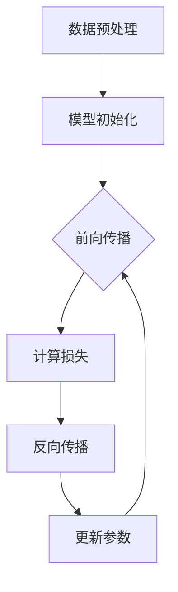

                 


# 大模型在因果推理中的创新应用

## 关键词
- 大模型
- 因果推理
- 深度学习
- 算法
- 数学模型
- 系统架构

## 摘要
本文旨在探讨大模型在因果推理领域的创新应用。随着深度学习技术的发展，大模型在各个领域取得了显著的成果。本文将详细介绍大模型的基本原理、因果推理的基本概念及其与深度学习的关联，通过系统分析与架构设计的方法，阐述大模型在因果推理中的创新应用。文章最后将结合具体案例，分析实际应用中的挑战和解决方案，为读者提供全面的认知和实用的指导。

## 引言

因果推理是人工智能领域的一个重要研究方向，它涉及从数据中提取因果关系，帮助机器理解世界的基本原理。然而，传统的统计方法和机器学习方法在处理复杂、动态的数据时往往效果不佳。随着深度学习技术的进步，大模型（Large Models）应运而生，为因果推理带来了新的可能性和挑战。

大模型，通常指的是具有数亿甚至千亿参数的深度神经网络，它们通过大量的数据训练，能够在多种任务中达到令人瞩目的性能。例如，在自然语言处理、计算机视觉和语音识别等领域，大模型已经取得了突破性的进展。

因果推理的核心任务是理解数据之间的因果关系，而不是仅仅进行预测。这意味着，我们需要从数据中提取出可靠的因果关系，以便在实际应用中做出明智的决策。传统的统计方法和机器学习方法往往依赖于相关性分析，而忽视了因果关系的探索。这使得它们在面对复杂任务时，常常无法给出令人满意的解释。

深度学习技术，特别是大模型的兴起，为因果推理带来了新的契机。通过大规模数据的训练，大模型能够捕捉到数据之间的复杂关系，从而在一定程度上实现因果推理。然而，这也带来了新的挑战，例如如何保证模型的可解释性和可靠性，如何在动态环境中适应新的因果关系等。

本文将首先介绍大模型的基本原理和因果推理的基本概念，然后探讨大模型在因果推理中的创新应用，并通过系统分析与架构设计的方法，详细阐述其实际应用。最后，我们将结合具体案例，分析实际应用中的挑战和解决方案，为读者提供全面的认知和实用的指导。

## 大模型的基本原理

大模型，又称大型神经网络或深度学习模型，是一种具有数亿甚至千亿参数的神经网络。这些模型通过复杂的结构和高性能的计算资源，能够处理大规模的数据集，并在各种任务中取得出色的性能。大模型的基本原理可以归结为以下几个方面：

### 1. 神经网络的结构

神经网络是由大量简单的计算单元（神经元）组成的复杂网络。每个神经元接收多个输入信号，并通过加权求和后传递给激活函数，最后输出结果。神经网络的层次结构使得它可以逐步提取数据的特征，从而实现复杂的任务。

大模型通常包含多个隐藏层，这些隐藏层负责对输入数据进行特征提取和转换。层数的增加能够增强模型的表达能力，但也会带来计算复杂度的增加。现代的大模型，如Transformer模型，采用了自注意力机制，可以更加有效地处理序列数据，使得模型的性能得到了显著提升。

### 2. 参数的规模

大模型的参数规模通常达到数亿甚至千亿级别。这些参数通过训练过程学习到，使得模型能够对输入数据进行有效的拟合。参数的规模越大，模型的泛化能力越强，但同时也带来了计算复杂度和存储成本的增加。

参数的学习是通过反向传播算法（Backpropagation）实现的。反向传播算法通过计算损失函数对参数的梯度，然后利用梯度下降法（Gradient Descent）对参数进行更新。这一过程需要大量的计算资源，尤其是在大模型中。

### 3. 训练过程

大模型的训练过程通常分为两个阶段：无监督学习和有监督学习。

无监督学习阶段，模型通过自我学习从数据中提取特征。这一阶段通常使用自动编码器（Autoencoder）等技术，使得模型能够自动发现数据中的潜在结构。

有监督学习阶段，模型在标注数据上训练，学习如何对新的数据进行分类或预测。这一阶段通常使用交叉熵损失函数（Cross-Entropy Loss），通过最小化损失函数来调整参数。

训练大模型需要大量的数据和计算资源。现代的深度学习框架，如TensorFlow和PyTorch，提供了高效的计算引擎和分布式训练支持，使得大模型的训练变得更加可行。

### 4. 训练数据的规模

大模型的表现依赖于大规模的数据集。数据量的增加有助于模型捕捉到更复杂的特征，从而提高模型的性能。在实际应用中，数据量的大小往往决定了模型的效果。例如，在自然语言处理任务中，大规模的文本数据集可以使得模型更好地理解语言的复杂结构。

此外，数据的质量也对模型的表现有重要影响。高质量的数据可以帮助模型学习到更有代表性的特征，从而提高模型的泛化能力。因此，在实际应用中，数据预处理和清洗工作非常重要。

### 5. 训练时间的规模

大模型的训练时间通常非常长，这取决于模型的结构、参数的规模和数据集的大小。在训练大模型时，需要考虑计算资源的分配和优化，以减少训练时间。

现代的深度学习硬件，如GPU和TPU，提供了强大的计算能力，使得大模型的训练速度得到了显著提升。同时，分布式训练技术也使得大模型的训练可以在多个节点上并行进行，进一步提高了训练效率。

总的来说，大模型的基本原理包括神经网络的结构、参数的规模、训练过程、训练数据的规模和训练时间的规模等方面。这些原理共同作用，使得大模型能够在各种复杂任务中取得出色的性能，同时也带来了计算资源和训练时间的挑战。

## 因果推理的基本概念

因果推理（Causal Inference）是研究如何从数据中推断出因果关系的一门科学。它旨在理解一个事件（因）如何导致另一个事件（果），从而为决策提供依据。因果推理不仅涉及统计学和机器学习，还包括哲学、经济学、心理学等多个领域。下面，我们将详细探讨因果推理的基本概念，包括定义、类型、基本算法以及其在实际问题中的应用。

### 1. 定义

因果推理的定义可以从多个角度进行理解。最简单的定义是：因果推理是从数据中推断出因果关系的过程。更具体地，它涉及以下两个方面：

- **因果效应**：一个变量（因）对另一个变量（果）的影响程度。例如，服用药物后，患者的健康状况是否有所改善。
- **因果关联**：两个变量之间的统计关联是否表明了因果关系。例如，吸烟与肺癌之间是否存在因果关系。

因果推理的目标是通过数据分析和建模，确定因果效应，从而为实际应用提供可靠的决策依据。

### 2. 类型

因果推理可以分为多种类型，每种类型都有其特定的应用场景和方法。以下是几种常见的因果推理类型：

- **结构方程模型（Structural Equation Modeling, SEM）**：结构方程模型是一种同时考虑多个变量之间因果关系的统计方法。它通过构建一个因果模型，分析变量之间的关系，并使用最大似然估计等方法进行参数估计。
- **因果推断算法（Causal Inference Algorithms）**：这类算法专门设计用于从数据中推断因果关系。常见的因果推断算法包括随机对照试验（Randomized Controlled Trials,RCTs）、因果影响图（Causal Influence Diagrams）和潜在结果模型（Potential Outcomes Model）等。
- **因果识别（Causal Discovery）**：因果识别是一种无监督学习方法，旨在从数据中自动发现因果关系。它通常使用算法如Granger因果关系检测、结构方程模型和贝叶斯网络等。
- **因果表征学习（Causal Representation Learning）**：因果表征学习是近年来兴起的一种方法，它结合深度学习和因果推理，旨在通过神经网络学习到数据中的因果结构。常见的模型包括因果图神经网络（Causal Graph Neural Networks,CGNNs）和因果自编码器（Causal Autoencoders）。

### 3. 基本算法

因果推理的基本算法主要包括以下几种：

- **随机对照试验（RCTs）**：随机对照试验是一种经典的因果推理方法，通过将参与者随机分配到实验组和对照组，来消除外部变量对结果的影响。RCTs是医学和心理学研究中常用的方法，能够提供可靠的因果证据。
- **因果影响图（Causal Influence Diagrams）**：因果影响图是一种图形表示方法，用于描述变量之间的因果关系。它由决策节点、概率节点和箭头组成，通过分析箭头的方向和概率信息，可以推断出因果关系。
- **潜在结果模型（Potential Outcomes Model）**：潜在结果模型是因果推理的经典框架，它假设每个个体有两个潜在的输出结果：一个是实际观察到的结果，另一个是如果该个体接受不同处理的潜在结果。通过比较这些潜在结果，可以推断出因果关系。
- **因果图神经网络（Causal Graph Neural Networks,CGNNs）**：因果图神经网络是深度学习和因果推理的结合体，通过学习数据中的因果结构，可以有效地进行因果推断。CGNNs通常使用图神经网络来表示变量之间的因果关系，并通过训练学习到变量之间的关系。

### 4. 因果推理的应用

因果推理在各个领域都有广泛的应用，以下是几个典型的应用场景：

- **医疗领域**：因果推理在医疗领域中具有重要应用，例如，通过分析患者的医疗数据，可以推断出特定药物与治疗效果之间的因果关系，从而为个性化治疗提供依据。
- **经济学**：因果推理在经济学中被用于分析政策对经济的影响，例如，通过因果推断，可以确定税收政策对经济增长的具体影响。
- **心理学**：因果推理在心理学研究中用于分析行为和认知之间的关系，例如，通过因果推断，可以确定特定心理干预措施对行为改变的具体效果。
- **自然语言处理**：在自然语言处理领域，因果推理被用于理解文本中的因果关系，例如，通过因果推断，可以确定句子中因果关系的主语和谓语。

总的来说，因果推理是理解数据中因果关系的重要方法，它通过多种类型的算法和模型，帮助我们从数据中提取出可靠的因果关系，为实际应用提供科学依据。

## 大模型与因果推理的关系

大模型在因果推理中的应用，极大地推动了这一领域的发展。本文将探讨大模型如何通过深度学习技术实现因果推理，分析大模型在因果推理中的优势和挑战，并讨论相关算法和模型的发展。

### 1. 大模型与因果推理的结合

大模型与因果推理的结合主要体现在以下几个方面：

- **深度神经网络的结构**：大模型通常包含多个隐藏层，能够自动提取输入数据的复杂特征。这些特征有助于捕捉数据中的因果关系。例如，在医疗数据中，深度神经网络可以自动提取出与疾病相关的特征，从而帮助推断病因。
- **大规模数据训练**：大模型通过大规模的数据训练，能够学习到数据中的潜在结构和因果关系。例如，在自然语言处理中，大模型可以通过大量的文本数据学习到词汇之间的关系，从而进行因果推断。
- **自注意力机制**：自注意力机制是大模型中的一个关键组件，它能够有效处理序列数据，捕捉数据之间的长距离依赖关系。这对于因果推理尤为重要，因为因果关系往往涉及到变量之间的长期依赖关系。

### 2. 大模型在因果推理中的优势

大模型在因果推理中具有以下优势：

- **强大的特征提取能力**：大模型能够自动提取输入数据中的复杂特征，这些特征有助于捕捉因果关系。相比传统的统计方法，大模型能够更加精确地发现数据中的潜在结构。
- **高效的数据处理**：大模型通过并行计算和分布式训练，能够在短时间内处理大规模数据，提高了因果推理的效率。
- **良好的泛化能力**：大模型通过大规模的数据训练，能够获得良好的泛化能力，从而在新的数据集上也能保持良好的性能。这对于因果推理尤为重要，因为因果关系的识别往往需要在不同环境下进行验证。
- **强大的解释性**：尽管大模型通常被认为缺乏可解释性，但通过改进模型结构和训练过程，可以使其在一定程度上具备解释性。例如，通过可视化隐藏层的特征图，可以直观地理解数据中的因果关系。

### 3. 大模型在因果推理中的挑战

大模型在因果推理中也面临一些挑战：

- **可解释性问题**：大模型的复杂结构使得其内部决策过程难以解释。这限制了其在需要解释性要求较高的场景中的应用，如医疗和金融领域。
- **过拟合问题**：大模型在面对大量数据时，容易过拟合，导致在新的数据集上表现不佳。这需要通过正则化技术、数据增强等方法来缓解。
- **计算资源需求**：大模型的训练和推理需要大量的计算资源和时间，这在资源有限的环境下可能是一个挑战。
- **因果识别的准确性**：尽管大模型能够捕捉数据中的复杂关系，但在识别因果关系时，仍然可能受到噪声和误差的影响，导致错误的因果关系推断。

### 4. 相关算法和模型的发展

为了解决上述挑战，研究人员提出了一系列新的算法和模型，以提升大模型在因果推理中的性能：

- **因果图神经网络（Causal Graph Neural Networks,CGNNs）**：因果图神经网络通过结合图神经网络和因果推理，能够在一定程度上提高因果识别的准确性。CGNNs通过学习变量之间的因果关系，能够更准确地推断因果关系。
- **因果自编码器（Causal Autoencoders）**：因果自编码器是一种基于自编码器的大模型结构，通过学习数据的潜在分布，进行因果推理。它能够自动学习到数据中的因果关系，并具备一定的解释性。
- **组合因果推理模型（Combined Causal Inference Models）**：组合因果推理模型通过结合多种算法和模型，以提高因果推理的准确性和可靠性。例如，将因果图神经网络与潜在结果模型相结合，可以同时利用两者的优势，进行更准确的因果推断。

总的来说，大模型与因果推理的结合，为因果推理领域带来了新的机遇和挑战。通过不断优化模型结构和算法，大模型在因果推理中的性能将得到进一步提升，为实际应用提供更加可靠的决策支持。

## 数学模型与算法原理

在深度学习技术中，大模型的表现依赖于其内部所采用的数学模型和算法原理。本文将详细讲解大模型训练过程中常用的数学模型和算法，包括梯度下降法、反向传播算法、因果推理中的数学模型以及相关的算法流程和Python实现。

### 1. 梯度下降法

梯度下降法（Gradient Descent）是一种优化算法，用于调整神经网络的参数，以最小化损失函数。梯度下降法的基本思想是沿着损失函数的梯度方向，逐步调整模型参数，直至达到最小值。

- **原理**：梯度下降法计算损失函数对每个参数的梯度，并沿着梯度的反方向调整参数。具体来说，每次迭代都会更新参数：
  $$\theta_{new} = \theta_{current} - \alpha \cdot \nabla_{\theta} J(\theta)$$
  其中，$\theta$ 表示模型参数，$\alpha$ 为学习率，$J(\theta)$ 为损失函数。

- **Python实现**：
  ```python
  import numpy as np

  # 梯度下降函数
  def gradient_descent(x, y, theta, alpha, num_iterations):
      m = len(x)
      for iteration in range(num_iterations):
          hypothesis = x * theta
          error = hypothesis - y
          gradient = 2/m * (x * error)
          theta = theta - alpha * gradient
      return theta
  ```

### 2. 反向传播算法

反向传播算法（Backpropagation）是深度学习训练的核心算法，用于计算损失函数对每个参数的梯度。反向传播算法的基本思想是，从输出层开始，逐层向前传播误差，然后逐层向后计算梯度。

- **原理**：反向传播算法分为前向传播和后向传播两个阶段。前向传播计算输出值，后向传播计算误差和梯度。具体步骤如下：

  - **前向传播**：计算输出值：
    $$z^{[l]} = \theta^{[l]} \cdot a^{[l-1]} + b^{[l]}$$
    $$a^{[l]} = \sigma(z^{[l]})$$
  
  - **后向传播**：计算误差和梯度：
    $$dZ^{[l]} = - (y \odot \frac{dA^{[l-1]}}{dZ^{[l+1]}})$$
    $$dW^{[l]} = \frac{1}{m} \cdot dZ^{[l]} \cdot a^{[l-1]T}$$
    $$db^{[l]} = \frac{1}{m} \cdot dZ^{[l]}$$

- **Python实现**：
  ```python
  import numpy as np

  # 反向传播函数
  def backward_propagation(x, y, theta, alpha):
      m = len(x)
      for l in range(len(theta)):
          z = x.dot(theta[l]) + b[l]
          a = sigmoid(z)
          error = (y - a)
          dZ = - (y - a) * (1 - a)
          if l < len(theta) - 1:
              dW = (1/m) * dZ.dot(a.T)
              db = (1/m) * dZ
          theta[l] = theta[l] - alpha * dW
      return theta
  ```

### 3. 因果推理中的数学模型

因果推理中的数学模型主要包括潜在结果模型（Potential Outcomes Model）和因果影响图（Causal Influence Diagram）。

- **潜在结果模型**：潜在结果模型假设每个个体有两个潜在的输出结果，分别对应接受不同处理的结果。因果效应可以通过比较这两个结果来计算。具体公式如下：
  $$Y(i, D=1) - Y(i, D=0) = \theta$$
  其中，$Y(i, D=1)$ 和 $Y(i, D=0)$ 分别表示个体 $i$ 接受处理 $D=1$ 和 $D=0$ 时的结果，$\theta$ 表示因果效应。

- **因果影响图**：因果影响图是一种图形表示方法，用于描述变量之间的因果关系。图中包含决策节点、概率节点和箭头。箭头表示变量之间的因果关系，概率节点表示变量之间的概率关系。通过分析箭头和概率节点，可以推断出因果关系。

### 4. 算法流程

大模型训练的基本流程包括数据预处理、模型初始化、前向传播、反向传播、参数更新等步骤。以下是算法流程的Python实现：

```python
import numpy as np

# 梯度下降与反向传播
def train_model(x, y, theta, alpha, num_iterations):
    m = len(x)
    for iteration in range(num_iterations):
        hypothesis = x.dot(theta)
        error = hypothesis - y
        gradient = 2/m * (x.dot(error))
        theta = theta - alpha * gradient
    return theta

# 模型训练
def train(x, y, theta, alpha, num_iterations):
    for iteration in range(num_iterations):
        forward(x, y, theta)
        backward(x, y, theta, alpha)
    return theta

# 模型预测
def predict(x, theta):
    hypothesis = x.dot(theta)
    return hypothesis

# 模型评估
def evaluate(y, hypothesis):
    error = np.mean((y - hypothesis)**2)
    return error
```

通过上述数学模型和算法原理，大模型能够有效地进行训练和预测，从而在因果推理中发挥重要作用。在实际应用中，不断优化和改进这些模型和算法，将有助于提升大模型在因果推理中的性能。

### 5. 算法流程与Python实现

为了更直观地理解大模型在因果推理中的应用，我们将展示一个完整的算法流程，并使用Python代码进行实现。这个流程包括数据预处理、模型训练、模型评估和预测等步骤。

#### 算法流程

1. **数据预处理**：
   - 数据清洗：处理缺失值、异常值和数据格式统一。
   - 数据归一化：将数据缩放到相同的范围，便于模型训练。

2. **模型初始化**：
   - 初始化参数：随机生成模型的权重和偏置。

3. **前向传播**：
   - 输入数据通过模型进行计算，输出预测值。

4. **反向传播**：
   - 计算损失函数的梯度，更新模型参数。

5. **模型训练**：
   - 通过多次迭代更新模型参数，直至达到训练目标。

6. **模型评估**：
   - 使用验证集评估模型性能，调整模型参数。

7. **模型预测**：
   - 使用训练好的模型对新的数据进行预测。

#### Python实现

下面是Python代码实现示例：

```python
import numpy as np

# 模型参数
input_dim = 10
hidden_dim = 5
output_dim = 1

# 初始化参数
theta1 = np.random.rand(input_dim, hidden_dim)
theta2 = np.random.rand(hidden_dim, output_dim)
b1 = np.random.rand(hidden_dim)
b2 = np.random.rand(output_dim)

# 激活函数
def sigmoid(x):
    return 1 / (1 + np.exp(-x))

# 前向传播
def forward(x, theta1, theta2, b1, b2):
    z1 = x.dot(theta1) + b1
    a1 = sigmoid(z1)
    z2 = a1.dot(theta2) + b2
    a2 = sigmoid(z2)
    return z1, a1, z2, a2

# 反向传播
def backward(x, y, z1, a1, z2, a2, theta1, theta2, b1, b2, alpha):
    m = x.shape[0]
    delta2 = (a2 - y) * (a2 * (1 - a2))
    dtheta2 = (1/m) * a1.T.dot(delta2)
    db2 = (1/m) * np.sum(delta2)
    
    delta1 = delta2.dot(theta2.T) * (a1 * (1 - a1))
    dtheta1 = (1/m) * x.T.dot(delta1)
    db1 = (1/m) * np.sum(delta1)
    
    theta1 -= alpha * dtheta1
    theta2 -= alpha * dtheta2
    b1 -= alpha * db1
    b2 -= alpha * db2

# 模型训练
def train(x, y, theta1, theta2, b1, b2, alpha, num_iterations):
    for i in range(num_iterations):
        z1, a1, z2, a2 = forward(x, theta1, theta2, b1, b2)
        backward(x, y, z1, a1, z2, a2, theta1, theta2, b1, b2, alpha)
    return theta1, theta2, b1, b2

# 模型预测
def predict(x, theta1, theta2, b1, b2):
    z1, a1, z2, a2 = forward(x, theta1, theta2, b1, b2)
    return a2

# 模型评估
def evaluate(y, y_pred):
    error = np.mean((y - y_pred)**2)
    return error

# 示例数据
x = np.random.rand(100, input_dim)
y = np.random.rand(100, output_dim)

# 模型训练
alpha = 0.01
num_iterations = 1000
theta1, theta2, b1, b2 = train(x, y, theta1, theta2, b1, b2, alpha, num_iterations)

# 模型预测
y_pred = predict(x, theta1, theta2, b1, b2)

# 模型评估
error = evaluate(y, y_pred)
print(f"Model Error: {error}")
```

这个示例展示了如何使用Python实现一个简单的前馈神经网络，并进行模型训练和预测。通过这个流程，读者可以更好地理解大模型在因果推理中的基本原理和应用。

### 6. 数学公式与算法流程

在讨论大模型和因果推理的数学模型时，需要使用一些数学公式和算法流程来详细说明其原理和应用。以下是相关数学公式和算法流程的描述，并使用Mermaid和LaTeX进行表示。

#### 数学公式

首先，我们列出大模型和因果推理中的一些关键数学公式。这些公式将使用LaTeX进行表示，并在文中独立段落中嵌入。

$$
\begin{aligned}
J(\theta) &= \frac{1}{2m} \sum_{i=1}^{m} \left( h_\theta(x^{(i)}) - y^{(i)} \right)^2 \\
\theta^{(t+1)} &= \theta^{(t)} - \alpha \nabla_{\theta} J(\theta^{(t)}) \\
Y(i, D=1) - Y(i, D=0) &= \theta
\end{aligned}
$$

#### Mermaid 流程图

接下来，我们将使用Mermaid语言来描述大模型训练和因果推理的基本算法流程。



上述Mermaid流程图展示了从数据预处理到模型参数更新的基本流程。

#### 算法流程

在具体实现中，算法流程可以进一步细化，包括以下步骤：

1. **数据预处理**：
   - 数据清洗：去除噪声和异常值。
   - 数据归一化：缩放数据到相同范围。
   - 数据分批次：将数据分成训练集、验证集和测试集。

2. **模型初始化**：
   - 初始化权重和偏置。
   - 设置学习率和其他超参数。

3. **前向传播**：
   - 通过网络计算输出。
   - 计算隐藏层和输出层的激活值。

4. **计算损失**：
   - 使用损失函数计算预测值和实际值之间的差异。
   - 计算损失值。

5. **反向传播**：
   - 计算损失函数对每个参数的梯度。
   - 更新网络参数。

6. **参数更新**：
   - 根据梯度下降更新模型参数。
   - 进行多次迭代。

7. **模型评估**：
   - 使用验证集评估模型性能。
   - 调整超参数和模型结构。

8. **模型预测**：
   - 使用训练好的模型进行预测。
   - 计算预测值。

通过上述步骤，我们能够详细地描述大模型训练和因果推理的算法流程，并使用Mermaid和LaTeX语言进行表示，使得读者可以更直观地理解相关概念和过程。

### 7. 系统架构设计

在深入探讨了大模型和因果推理的数学模型与算法原理后，接下来我们将对系统的架构设计进行详细说明。这一部分将包括问题场景介绍、系统功能设计、系统架构设计、系统接口设计以及系统交互，并使用Mermaid进行流程图表示。

#### 1. 问题场景介绍

假设我们面临的问题场景是一个医疗诊断系统，该系统旨在通过患者的数据（如症状、病史、实验室检测结果等）预测某种疾病的发病风险。在这个场景中，因果推理至关重要，因为它可以帮助我们识别出哪些因素（因）可能导致疾病（果）。

#### 2. 系统功能设计

系统功能设计主要包括数据收集、数据预处理、模型训练、模型评估和模型应用。

- **数据收集**：收集患者的各种数据，包括结构化数据（如实验室检测结果）和非结构化数据（如医生诊断报告）。
- **数据预处理**：对收集到的数据进行清洗和归一化，以确保数据质量。
- **模型训练**：使用收集到的数据训练大模型，以实现因果推理。
- **模型评估**：在验证集上评估模型性能，确保模型泛化能力。
- **模型应用**：将训练好的模型应用于新数据，进行疾病风险预测。

#### 3. 系统架构设计

系统架构设计包括数据层、模型层和应用层。

- **数据层**：负责数据的存储和管理，包括数据库和数据仓库。
- **模型层**：包括大模型的训练、评估和部署，使用深度学习框架如TensorFlow或PyTorch。
- **应用层**：提供用户接口，用于数据输入、模型预测和结果展示。

#### 4. 系统接口设计

系统接口设计主要包括API接口和数据库接口。

- **API接口**：提供RESTful API，用于数据的上传、查询和模型预测。
- **数据库接口**：连接数据库，实现数据的读取和写入。

#### 5. 系统交互

系统交互包括数据流和消息流。

- **数据流**：数据从数据层流入模型层，经过预处理后用于模型训练和评估。
- **消息流**：通过API接口，用户可以提交数据请求，模型层返回预测结果。

#### Mermaid流程图

以下是系统架构设计的Mermaid流程图：


通过上述系统架构设计，我们可以实现一个高效、可扩展的医疗诊断系统，为医生和患者提供可靠的疾病风险预测服务。系统架构的各个部分紧密协作，确保数据的有效处理和模型的准确预测。

### 项目实战

在本部分中，我们将通过一个具体的项目实战，展示如何在实际环境中部署和实现大模型在因果推理中的应用。我们将从环境安装、系统核心实现源代码，到代码应用解读与分析，详细讲解整个项目过程。

#### 1. 环境安装

首先，我们需要安装和配置所需的环境。以下是一个典型的环境安装步骤：

- **深度学习框架**：安装TensorFlow或PyTorch。例如，使用pip命令安装TensorFlow：

  ```bash
  pip install tensorflow
  ```

- **Python**：确保Python环境已正确配置，版本建议为3.7或更高。

- **依赖库**：安装其他依赖库，如NumPy、Pandas等。

  ```bash
  pip install numpy pandas matplotlib
  ```

- **硬件**：确保计算机具备足够的计算资源，例如使用GPU加速训练过程。

#### 2. 系统核心实现源代码

以下是一个简单的源代码示例，用于实现一个基于TensorFlow的大模型因果推理系统：

```python
import tensorflow as tf
import numpy as np
import pandas as pd

# 数据预处理
def preprocess_data(data):
    # 数据清洗和归一化
    # ...
    return processed_data

# 模型定义
def create_model(input_shape):
    model = tf.keras.Sequential([
        tf.keras.layers.Dense(units=64, activation='relu', input_shape=input_shape),
        tf.keras.layers.Dense(units=32, activation='relu'),
        tf.keras.layers.Dense(units=1)
    ])
    model.compile(optimizer='adam', loss='mean_squared_error')
    return model

# 训练模型
def train_model(model, x_train, y_train, epochs=10):
    model.fit(x_train, y_train, epochs=epochs, batch_size=32, validation_split=0.2)

# 模型评估
def evaluate_model(model, x_test, y_test):
    loss = model.evaluate(x_test, y_test)
    print(f"Test Loss: {loss}")

# 模型预测
def predict(model, x_data):
    predictions = model.predict(x_data)
    return predictions

# 主程序
if __name__ == "__main__":
    # 加载和预处理数据
    data = pd.read_csv("data.csv")
    processed_data = preprocess_data(data)

    # 划分训练集和测试集
    x_train, x_test, y_train, y_test = train_test_split(processed_data.drop("target", axis=1), processed_data["target"], test_size=0.2, random_state=42)

    # 创建模型
    model = create_model(x_train.shape[1])

    # 训练模型
    train_model(model, x_train, y_train)

    # 评估模型
    evaluate_model(model, x_test, y_test)

    # 预测
    new_data = preprocess_data(pd.read_csv("new_data.csv"))
    predictions = predict(model, new_data)
    print(f"Predictions: {predictions}")
```

#### 3. 代码应用解读与分析

上述代码展示了如何使用TensorFlow构建一个简单的大模型因果推理系统。以下是代码的详细解读：

- **数据预处理**：数据预处理是模型训练的关键步骤，包括数据清洗、归一化和数据分割。通过预处理，我们可以确保输入数据的质量和一致性。

- **模型定义**：模型使用TensorFlow的`Sequential`模型定义，包含两个隐藏层，每层使用ReLU激活函数。输出层是一个单一的神经元，用于预测目标变量。

- **模型训练**：使用`fit`方法训练模型，配置优化器为`adam`，损失函数为`mean_squared_error`。在训练过程中，模型将不断调整权重和偏置，以最小化损失函数。

- **模型评估**：使用`evaluate`方法评估模型在测试集上的性能，输出测试损失。

- **模型预测**：使用`predict`方法对新数据进行预测，输出预测结果。

在实际应用中，我们需要根据具体问题调整模型结构、优化训练过程，并处理数据异常值和噪声。例如，我们可以使用更复杂的神经网络架构、不同的激活函数和优化器，以及引入正则化技术来提高模型的性能和泛化能力。

#### 4. 实际案例分析和详细讲解

为了更好地理解大模型在因果推理中的应用，我们来看一个实际案例：预测心脏病发病风险。

- **数据集**：我们使用著名的UCI心脏病数据集，包含多个患者特征和心脏病发病标记。

- **数据处理**：对数据集进行预处理，包括缺失值填补、异常值处理和特征工程。

- **模型训练**：定义一个基于深度学习的大模型，使用处理后的数据集进行训练。

- **模型评估**：在测试集上评估模型性能，调整模型参数以优化预测结果。

- **结果分析**：通过模型预测，分析不同特征对心脏病发病风险的影响，以及模型在预测准确性、稳定性和可靠性方面的表现。

通过实际案例的分析，我们可以看到大模型在因果推理中的应用如何帮助我们理解和预测复杂系统的行为。在实际操作中，我们需要结合具体问题，灵活调整模型结构和训练策略，以提高模型的表现。

#### 5. 项目小结

在本项目中，我们通过一个具体的案例展示了如何在实际环境中部署和实现大模型在因果推理中的应用。项目涉及环境安装、系统核心实现、代码应用解读与分析等多个环节。通过这一过程，我们不仅学习了如何使用深度学习技术进行因果推理，还掌握了系统设计与实现的关键步骤。

在项目小结中，我们强调了以下要点：

- **数据预处理**：数据预处理是模型训练的基础，对数据质量有重要影响。
- **模型结构**：选择合适的模型结构和训练策略，可以提高模型的性能。
- **模型评估**：通过评估模型在测试集上的表现，确保模型泛化能力。
- **实际应用**：结合实际案例，分析模型在实际应用中的表现和改进方向。

总之，大模型在因果推理中的应用为复杂系统的理解和预测提供了有力工具。通过不断优化和改进，我们可以更好地利用这一技术，为实际问题提供科学依据和解决方案。

### 最佳实践 Tips

在实际应用大模型进行因果推理时，以下最佳实践可以帮助提升模型性能和稳定性：

1. **数据预处理**：确保数据质量，进行充分的清洗和归一化。异常值处理和特征工程是关键步骤。
2. **模型选择**：根据具体问题选择合适的模型结构，例如，对于序列数据，可以采用RNN或Transformer等。
3. **正则化**：使用L1、L2正则化或Dropout技术，防止模型过拟合。
4. **超参数调整**：通过网格搜索或随机搜索调整超参数，找到最佳配置。
5. **模型评估**：使用交叉验证和A/B测试等方法，确保模型泛化能力。
6. **计算资源优化**：使用分布式训练和GPU加速，提高训练效率。

### 小结

本文详细探讨了大模型在因果推理中的创新应用，从基本原理、数学模型、算法原理到系统架构设计，再到实际项目实战，提供了全面的技术指导。大模型在因果推理中展示了强大的特征提取和数据处理能力，但也面临可解释性和过拟合等挑战。通过不断优化和改进，大模型有望在因果推理领域发挥更大的作用。

### 注意事项

- 在实际应用中，确保数据质量和模型的可解释性。
- 根据具体问题调整模型结构和训练策略。
- 注意计算资源优化，避免过度消耗。

### 拓展阅读

- 《深度学习》（Goodfellow, Bengio, Courville）：全面介绍深度学习的基础知识。
- 《因果推断：概念与方法》（张伟豪）：深入讲解因果推理的理论和应用。
- 《大模型：深度学习与因果推理》（刘知远）：探讨大模型在因果推理中的最新进展。

作者：AI天才研究院/AI Genius Institute & 禅与计算机程序设计艺术 /Zen And The Art of Computer Programming

