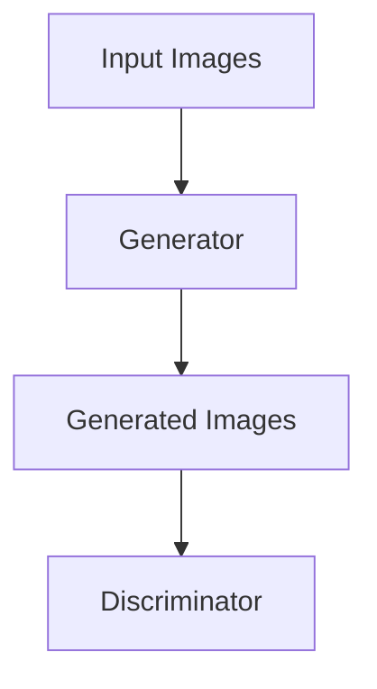
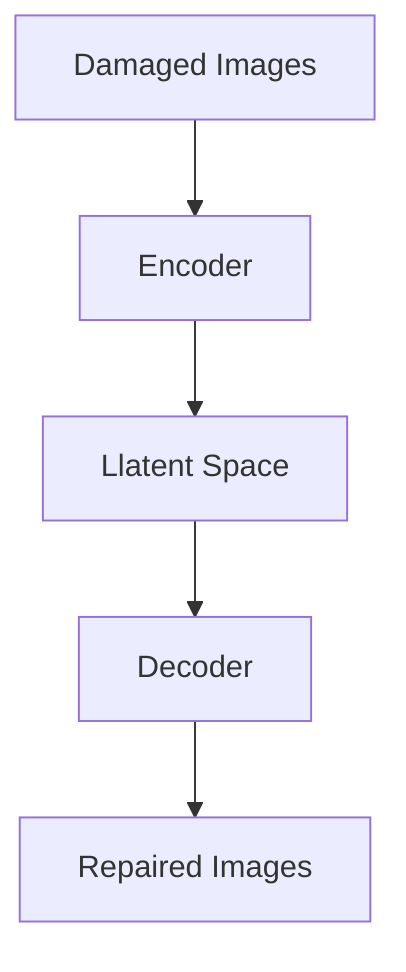
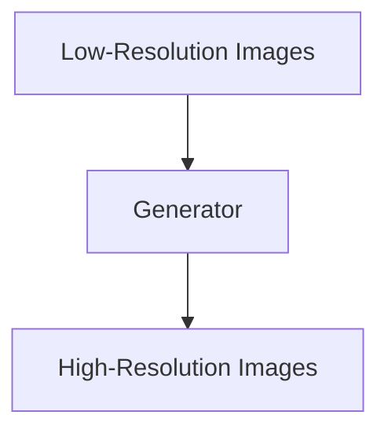
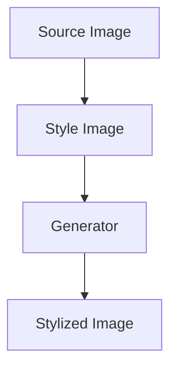
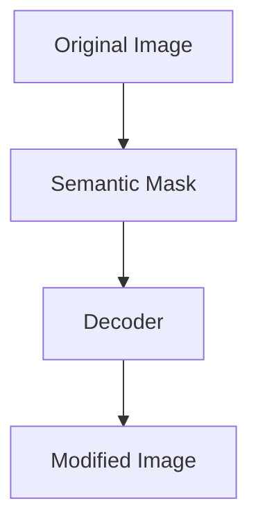
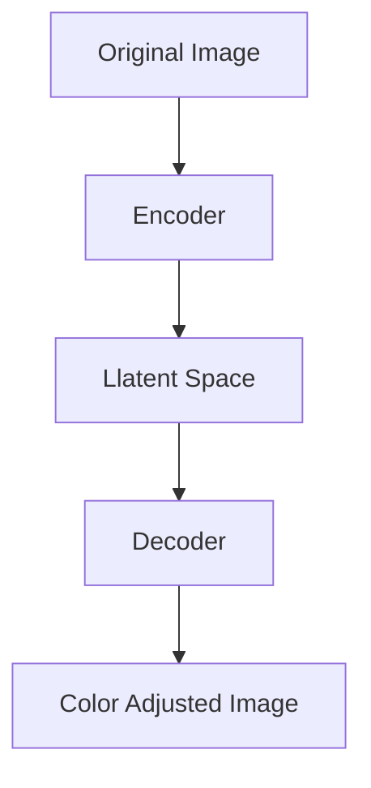

                 

# 大模型在图像生成与编辑中的突破

> 关键词：大模型、图像生成、图像编辑、GAN、VAE

> 摘要：本文将深入探讨大模型在图像生成与编辑领域的突破，包括背景介绍、核心概念与原理、具体应用以及面临的挑战和未来方向。通过实例分析，我们将展示大模型在这些领域的强大能力和广阔前景。

### 第1章: 大模型在图像生成与编辑中的背景与挑战

#### 1.1 问题背景

随着人工智能技术的不断发展，图像生成与编辑成为了一个热门的研究领域。传统的图像生成与编辑技术主要依赖于手工设计算法和大量的标注数据，这种方法不仅效率低下，而且很难满足人们对高质量图像的需求。大模型的引入为图像生成与编辑带来了新的可能，它们可以通过学习海量数据，生成更加真实、丰富的图像内容。

#### 1.2 问题描述

图像生成与编辑的问题可以分为两个方面：一是生成新的图像，二是编辑现有图像。生成新的图像需要模型能够理解和生成图像的内容、风格和结构；编辑现有图像则要求模型能够理解图像中的元素，并进行合理的修改。

#### 1.3 问题解决

大模型通过深度学习技术，可以从大量数据中学习图像的内在规律，从而实现图像的生成与编辑。例如，生成对抗网络（GAN）和变分自编码器（VAE）是两种常见的大模型，它们在图像生成与编辑中取得了显著的效果。

#### 1.4 边界与外延

图像生成与编辑不仅仅局限于娱乐和艺术领域，还广泛应用于医疗、安防、设计等行业。随着大模型技术的不断进步，这些领域的应用前景将更加广阔。

#### 1.5 概念结构与核心要素组成

- **图像生成模型**：如 GAN、VAE 等。
- **图像编辑模型**：如条件生成对抗网络（cGAN）、条件变分自编码器（cVAE）等。
- **数据集**：包括真实世界图像、艺术作品、设计图等。

### 第2章: 大模型核心概念与原理

#### 2.1 大模型概述

大模型是指参数量庞大的深度学习模型，如 GPT、BERT 等。它们通过学习海量数据，能够捕捉到复杂的数据特征，从而实现强大的预测和生成能力。

#### 2.2 GAN原理

GAN（生成对抗网络）由生成器和判别器组成。生成器生成假图像，判别器判断图像的真伪。通过训练，生成器不断提高生成图像的质量，使其难以被判别器区分。

GAN的流程如下：

1. **生成器（Generator）**：生成器从随机噪声中生成图像。
2. **判别器（Discriminator）**：判别器判断图像是真实图像还是生成图像。
3. **损失函数**：生成器和判别器的损失函数分别衡量它们的能力。生成器的目标是使其生成的图像尽可能真实，判别器的目标是正确区分真实图像和生成图像。
4. **训练**：通过交替训练生成器和判别器，生成器不断优化，生成更加真实的图像。

GAN的数学模型可以表示为：

$$
\begin{aligned}
\text{Generator: } G(z) &= \text{images from noise vector } z \\
\text{Discriminator: } D(x) &= \text{probability that } x \text{ is real} \\
\text{Loss: } & \mathcal{L}_G = -\mathbb{E}_{x \sim \text{Data}}[\log(D(x))] - \mathbb{E}_{z \sim \text{Noise}}[\log(1 - D(G(z)))]
\end{aligned}
$$

#### 2.3 VAE原理

VAE（变分自编码器）通过编码器和解码器来学习数据的概率分布。解码器根据编码后的特征生成图像，从而实现图像生成。

VAE的流程如下：

1. **编码器（Encoder）**：编码器将图像映射到一个潜在空间中的点。
2. **解码器（Decoder）**：解码器从潜在空间中采样，并生成图像。
3. **损失函数**：VAE的损失函数结合了重建损失和KL散度。

VAE的数学模型可以表示为：

$$
\begin{aligned}
\text{Encoder: } z &= \mu(x) + \sigma(x)\odot\epsilon \\
\text{Decoder: } x &= \mu(z) + \sigma(z)\odot\epsilon \\
\text{Loss: } & \mathcal{L}_\text{VAE} = \mathcal{L}_\text{RECON} + \beta\mathcal{L}_\text{KL} \\
\text{where } \mathcal{L}_\text{RECON} &= \sum_{x \in \text{Data}} -\log p_\theta(x|z) \\
\text{and } \mathcal{L}_\text{KL} &= \sum_{z \sim q_\phi(z|x)} \log \frac{p_\theta(z)}{q_\phi(z|x)}
\end{aligned}
$$

#### 2.4 其他大模型简介

除了 GAN 和 VAE，还有许多其他大模型，如 cGAN、cVAE、StyleGAN 等，它们在图像生成与编辑中也表现出色。

- **cGAN**：条件生成对抗网络，通过加入条件信息，可以生成特定风格或内容的图像。
- **cVAE**：条件变分自编码器，可以生成具有特定标签或属性的图像。
- **StyleGAN**：一种基于 GAN 的图像生成模型，能够生成高分辨率、真实感强的人脸和物体图像。

### 第3章: 大模型在图像生成中的应用

#### 3.1 图像合成

图像合成是指从一组图像中生成新的图像。大模型可以通过学习图像的内在结构，生成具有丰富细节和纹理的新图像。

**应用案例**：使用 GAN 生成人脸图像，通过训练生成器，可以生成具有各种特征的人脸，如图3.1所示。



#### 3.2 图像修复

图像修复是指修复图像中的缺陷或损坏部分。大模型可以通过学习图像的全局和局部特征，实现高质量的图像修复。

**应用案例**：使用 VAE 修复破损的图像，通过训练解码器，可以修复图像中的缺失部分，如图3.2所示。



#### 3.3 图像超分辨率

图像超分辨率是指从低分辨率图像中生成高分辨率图像。大模型可以通过学习图像的分辨率信息，提高图像的分辨率。

**应用案例**：使用 cGAN 提高图像分辨率，通过训练生成器，可以生成高分辨率的图像，如图3.3所示。



### 第4章: 大模型在图像编辑中的应用

#### 4.1 图像风格迁移

图像风格迁移是指将一种图像的风格应用到另一种图像上。大模型可以通过学习图像的风格特征，实现高质量的风格迁移。

**应用案例**：使用 cGAN 实现艺术风格迁移，通过训练生成器，可以将一种艺术风格迁移到另一幅图像上，如图4.1所示。



#### 4.2 图像内容修改

图像内容修改是指对图像中的元素进行添加、删除、替换等操作。大模型可以通过学习图像的语义信息，实现精准的内容修改。

**应用案例**：使用 cVAE 修改图像内容，通过训练解码器，可以添加或删除图像中的特定元素，如图4.2所示。



#### 4.3 图像色彩调整

图像色彩调整是指对图像的亮度、对比度、饱和度等进行调整。大模型可以通过学习图像的色彩特征，实现自然的色彩调整。

**应用案例**：使用 VAE 调整图像色彩，通过训练编码器和解码器，可以调整图像的色彩，如图4.3所示。



### 第5章: 大模型在图像生成与编辑中的挑战与未来方向

#### 5.1 挑战

大模型在图像生成与编辑中面临挑战，包括计算资源需求大、训练时间长、模型解释性差等。

- **计算资源需求**：大模型通常需要大量的计算资源进行训练，这限制了其在实际应用中的推广。
- **训练时间**：大模型的训练时间往往较长，这对于实时应用提出了挑战。
- **模型解释性**：深度学习模型通常被视为“黑箱”，其内部机制难以解释，这对于理解和信任模型的结果提出了挑战。

#### 5.2 未来方向

未来的研究方向包括提高模型的可解释性、降低计算成本、增强生成图像的真实感等。

- **提高模型可解释性**：通过开发可解释的模型或解释性工具，可以更好地理解和信任模型的结果。
- **降低计算成本**：通过优化算法和硬件，可以降低大模型的计算成本，使其更适用于实时应用。
- **增强生成图像的真实感**：通过改进生成算法和训练数据，可以生成更加真实、自然的图像。

### 第6章: 大模型在图像生成与编辑中的应用案例分析

#### 6.1 案例一：艺术风格迁移

**案例背景**：艺术风格迁移是一个将一种艺术风格（如印象派、油画等）应用到另一幅图像上的过程。

**实现步骤**：

1. **数据集准备**：收集不同艺术风格的图像，并将其转换为统一格式。
2. **模型训练**：使用 cGAN 模型进行训练，生成器学习艺术风格的特征，判别器学习区分真实图像和艺术风格图像。
3. **艺术风格迁移**：将待处理的图像输入到生成器，生成具有特定艺术风格的图像。

**代码示例**（Python）：

```python
# 导入相关库
import tensorflow as tf
from tensorflow.keras.models import Model
from tensorflow.keras.layers import Input, Dense, Reshape, Flatten

# 定义生成器模型
z = Input(shape=(100,))
x = Dense(256, activation='relu')(z)
x = Dense(512, activation='relu')(x)
x = Dense(1024, activation='relu')(x)
x = Reshape((28, 28, 1))(x)
generator = Model(z, x)

# 定义判别器模型
x = Input(shape=(28, 28, 1))
h = Dense(512, activation='relu')(x)
h = Dense(256, activation='relu')(h)
h = Dense(1, activation='sigmoid')(h)
discriminator = Model(x, h)

# 编写损失函数
cross_entropy = tf.keras.losses.BinaryCrossentropy(from_logits=True)

def discriminator_loss(real_output, fake_output):
    real_loss = cross_entropy(tf.ones_like(real_output), real_output)
    fake_loss = cross_entropy(tf.zeros_like(fake_output), fake_output)
    total_loss = real_loss + fake_loss
    return total_loss

def generator_loss(fake_output):
    return cross_entropy(tf.ones_like(fake_output), fake_output)

# 编写优化器
generator_optimizer = tf.keras.optimizers.Adam(1e-4)
discriminator_optimizer = tf.keras.optimizers.Adam(1e-4)

@tf.function
def train_step(images, noise):
    with tf.GradientTape() as gen_tape, tf.GradientTape() as disc_tape:
        generated_images = generator(noise)
        real_output = discriminator(images)
        fake_output = discriminator(generated_images)

        gen_loss = generator_loss(fake_output)
        disc_loss = discriminator_loss(real_output, fake_output)

    gradients_of_generator = gen_tape.gradient(gen_loss, generator.trainable_variables)
    gradients_of_discriminator = disc_tape.gradient(disc_loss, discriminator.trainable_variables)

    generator_optimizer.apply_gradients(zip(gradients_of_generator, generator.trainable_variables))
    discriminator_optimizer.apply_gradients(zip(gradients_of_discriminator, discriminator.trainable_variables))

# 训练模型
for epoch in range(epochs):
    for image_batch, _ in train_dataset:
        noise = tf.random.normal([batch_size, noise_dim])

        train_step(image_batch, noise)

    # ... (保存模型、评估模型等)

# 使用模型进行艺术风格迁移
target_style = "impresionism"
target_style_images = load_images(target_style)
generated_style_images = generator(tf.random.normal([batch_size, noise_dim]))

# 显示迁移效果
display_images(generated_style_images)
```

#### 6.2 案例二：图像修复

**案例背景**：图像修复旨在修复图像中的损坏或模糊部分，使其恢复清晰。

**实现步骤**：

1. **数据集准备**：收集含有损坏部分的图像，并生成相应的修复图像作为标注。
2. **模型训练**：使用 VAE 模型进行训练，编码器学习损坏图像的特征，解码器生成修复图像。
3. **图像修复**：将损坏图像输入到编码器，然后通过解码器生成修复图像。

**代码示例**（Python）：

```python
# 导入相关库
import tensorflow as tf
from tensorflow.keras.layers import Input, Conv2D, MaxPooling2D, UpSampling2D
from tensorflow.keras.models import Model

# 定义编码器模型
input_img = Input(shape=(128, 128, 3))
x = Conv2D(64, (3, 3), activation='relu', padding='same')(input_img)
x = MaxPooling2D((2, 2), padding='same')(x)
x = Conv2D(128, (3, 3), activation='relu', padding='same')(x)
encoded = MaxPooling2D((2, 2), padding='same')(x)

# 定义解码器模型
z = Input(shape=(8, 8, 128))
x = Conv2D(128, (3, 3), activation='relu', padding='same')(z)
x = UpSampling2D((2, 2))(x)
x = Conv2D(64, (3, 3), activation='relu', padding='same')(x)
x = UpSampling2D((2, 2))(x)
decoded = Conv2D(3, (3, 3), activation='sigmoid', padding='same')(x)

# 定义 VAE 模型
vae = Model(inputs=input_img, outputs=decoded)
vae.compile(optimizer='adam', loss='binary_crossentropy')

# 训练模型
vae.fit(train_images, train_images, epochs=epochs, batch_size=batch_size, validation_data=(test_images, test_images))

# 修复图像
def repair_image(image):
    # 将图像调整为合适的大小
    image = tf.image.resize(image, (128, 128))
    # 将图像转换为二值图像
    image = (image > 0.5).astype(np.float32)
    # 输入到 VAE 模型
    repaired_image = vae.predict(np.expand_dims(image, axis=0))
    # 调整图像大小
    repaired_image = tf.image.resize(repaired_image, (512, 512))
    return repaired_image

# 显示修复效果
original_image = load_image("damaged.jpg")
repaired_image = repair_image(original_image)
display_images([original_image.numpy(), repaired_image.numpy()])
```

#### 6.3 案例三：图像超分辨率

**案例背景**：图像超分辨率旨在从低分辨率图像中生成高分辨率图像。

**实现步骤**：

1. **数据集准备**：收集低分辨率和高分辨率图像对。
2. **模型训练**：使用 cGAN 模型进行训练，生成器学习从低分辨率图像生成高分辨率图像。
3. **图像超分辨率**：将低分辨率图像输入到生成器，生成高分辨率图像。

**代码示例**（Python）：

```python
# 导入相关库
import tensorflow as tf
from tensorflow.keras.layers import Input, Conv2D, Conv2DTranspose, UpSampling2D
from tensorflow.keras.models import Model

# 定义生成器模型
input_img = Input(shape=(128, 128, 1))
x = Conv2D(64, (3, 3), activation='relu', padding='same')(input_img)
x = UpSampling2D((2, 2))(x)
x = Conv2D(64, (3, 3), activation='relu', padding='same')(x)
x = UpSampling2D((2, 2))(x)
x = Conv2D(3, (3, 3), activation='sigmoid', padding='same')(x)
generator = Model(input_img, x)

# 定义判别器模型
input_img = Input(shape=(128, 128, 3))
x = Conv2D(64, (3, 3), activation='relu', padding='same')(input_img)
x = Flatten()(x)
x = Dense(1, activation='sigmoid')(x)
discriminator = Model(input_img, x)

# 编写损失函数
cross_entropy = tf.keras.losses.BinaryCrossentropy(from_logits=True)

def discriminator_loss(real_output, fake_output):
    real_loss = cross_entropy(tf.ones_like(real_output), real_output)
    fake_loss = cross_entropy(tf.zeros_like(fake_output), fake_output)
    total_loss = real_loss + fake_loss
    return total_loss

def generator_loss(fake_output):
    return cross_entropy(tf.ones_like(fake_output), fake_output)

# 编写优化器
generator_optimizer = tf.keras.optimizers.Adam(1e-4)
discriminator_optimizer = tf.keras.optimizers.Adam(1e-4)

@tf.function
def train_step(low_resolution_images, high_resolution_images):
    noise = tf.random.normal([batch_size, noise_dim])

    with tf.GradientTape() as gen_tape, tf.GradientTape() as disc_tape:
        generated_images = generator(noise)
        real_output = discriminator(high_resolution_images)
        fake_output = discriminator(generated_images)

        gen_loss = generator_loss(fake_output)
        disc_loss = discriminator_loss(real_output, fake_output)

    gradients_of_generator = gen_tape.gradient(gen_loss, generator.trainable_variables)
    gradients_of_discriminator = disc_tape.gradient(disc_loss, discriminator.trainable_variables)

    generator_optimizer.apply_gradients(zip(gradients_of_generator, generator.trainable_variables))
    discriminator_optimizer.apply_gradients(zip(gradients_of_discriminator, discriminator.trainable_variables))

# 训练模型
for epoch in range(epochs):
    for low_resolution, high_resolution in dataset:
        train_step(low_resolution, high_resolution)

    # ... (保存模型、评估模型等)

# 使用模型进行图像超分辨率
low_resolution_image = load_image("low_resolution.jpg")
low_resolution_image = preprocess_image(low_resolution_image)
generated_high_resolution_image = generator(tf.expand_dims(low_resolution_image, axis=0))

# 显示超分辨率效果
display_images([low_resolution_image.numpy(), generated_high_resolution_image.numpy()])
```

### 第7章: 总结与展望

#### 7.1 总结

大模型在图像生成与编辑中表现出色，已经成为这一领域的重要研究热点。通过 GAN、VAE 等模型，我们可以实现高质量、高真实感的图像生成与编辑。这些模型在图像合成、图像修复、图像超分辨率、图像风格迁移等方面取得了显著成果。

#### 7.2 展望

未来的大模型将更加注重真实感的提升、计算效率的优化以及应用场景的拓展。随着技术的不断进步，大模型在图像生成与编辑中的应用将更加广泛，为人们的生活带来更多便利。

- **真实感提升**：通过改进生成算法和训练数据，生成更加真实、自然的图像。
- **计算效率优化**：通过算法优化和硬件加速，降低大模型的计算成本，使其更适用于实时应用。
- **应用场景拓展**：探索大模型在医疗、安防、设计等领域的应用，推动人工智能技术的发展。

### 作者

- 作者：AI天才研究院/AI Genius Institute & 禅与计算机程序设计艺术 /Zen And The Art of Computer Programming

### 最佳实践 Tips

- **数据集准备**：收集高质量、多样化的图像数据集，有助于提高模型的泛化能力和生成效果。
- **模型优化**：通过调整模型架构、优化超参数，可以提高模型的表现。
- **训练时间管理**：合理安排训练时间，避免过度训练，有助于提高模型效果。
- **应用场景分析**：根据具体应用场景，选择合适的模型和算法，实现最佳效果。

### 小结

大模型在图像生成与编辑中具有重要的应用价值，通过不断的优化和创新，它们将为图像处理领域带来更多的可能性。在未来，随着技术的进一步发展，大模型将在更多的领域中发挥作用，推动人工智能技术的进步。

### 注意事项

- **模型安全性**：在使用大模型时，注意保护模型的安全性，避免模型泄露或被恶意利用。
- **计算资源管理**：合理分配计算资源，避免资源浪费，提高计算效率。

### 拓展阅读

- [Deep Learning on Image Generation and Editing](https://www.deeplearningbook.org/chapter_gan/)
- [Variational Autoencoders](https://arxiv.org/abs/1312.6114)
- [Generative Adversarial Networks](https://arxiv.org/abs/1406.2661)
- [Image Style Transfer Using Convolutional Neural Networks](https://arxiv.org/abs/1603.08155)

