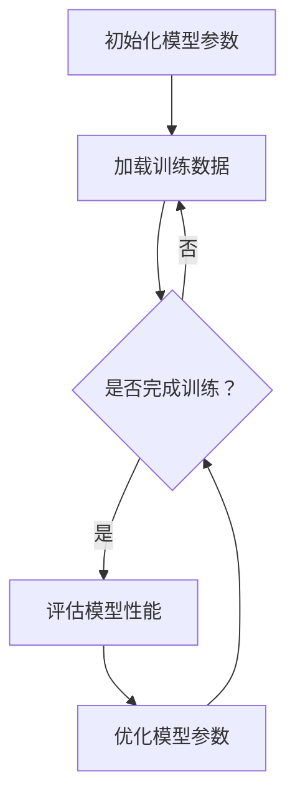
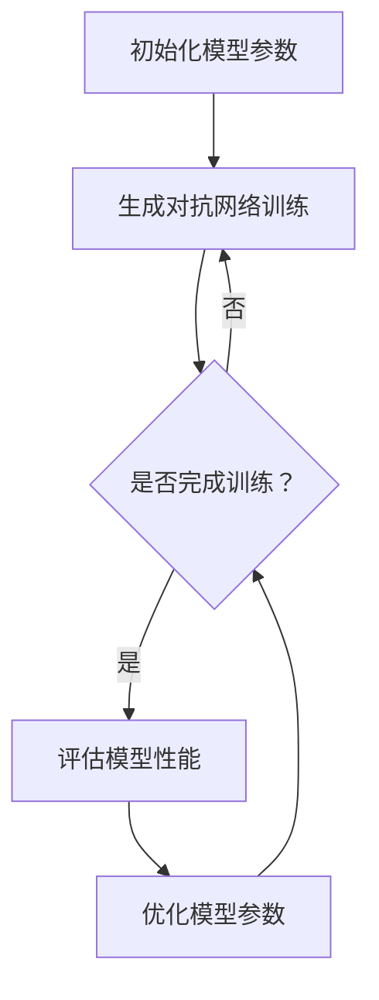
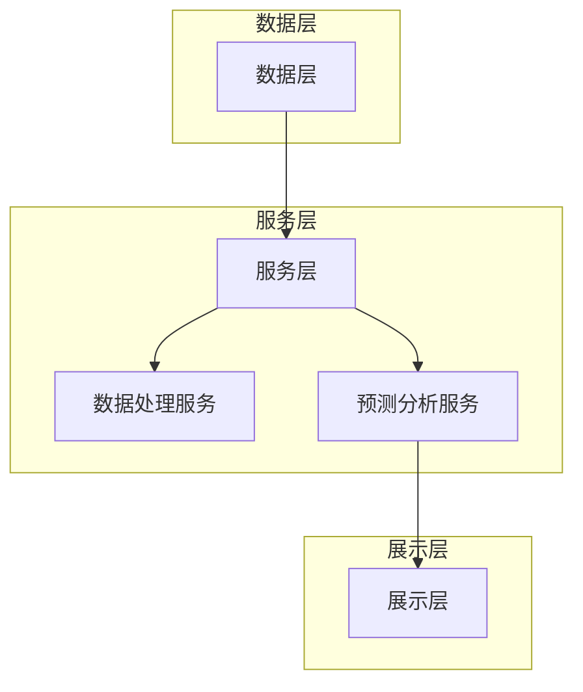
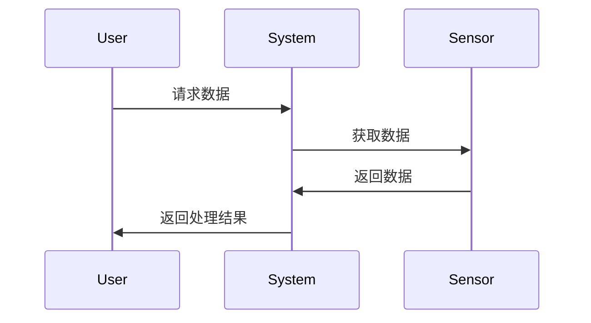
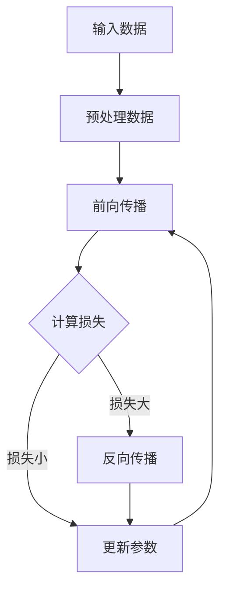
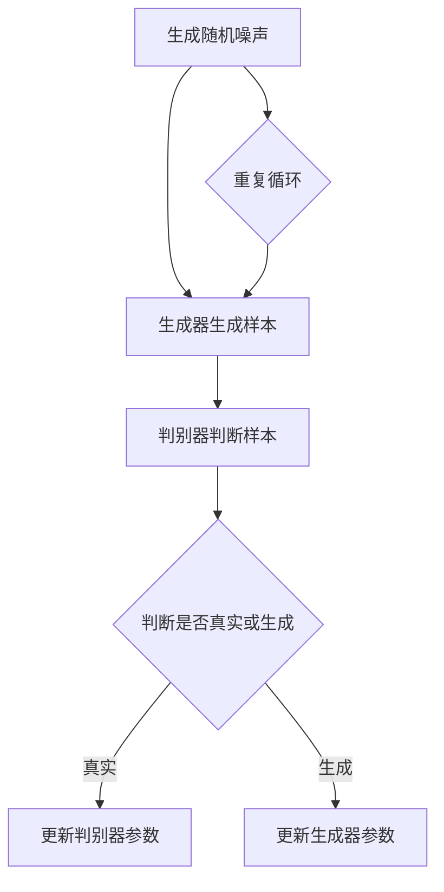
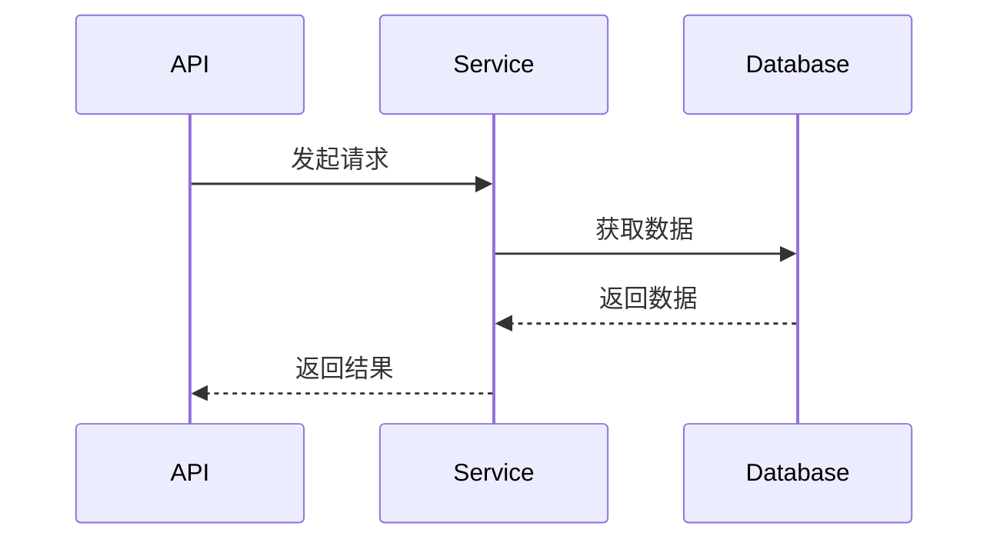
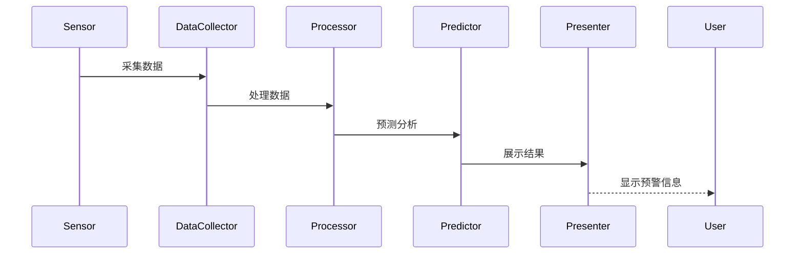

                 

# 大模型在地球科学中的应用前景

## 关键词：大模型，地球科学，算法，系统架构，项目实战

## 摘要：
大模型作为人工智能领域的关键技术，近年来在多个行业取得了显著的成果。地球科学作为一门研究地球系统各个层面的学科，其复杂性和数据量使得大模型的应用前景愈发广阔。本文将探讨大模型在地球科学中的应用前景，包括核心概念的介绍、算法原理讲解、系统分析与架构设计方案、项目实战以及最佳实践 tips。通过一步步分析推理，本文旨在为读者揭示大模型在地球科学中的潜力和应用挑战。

## 1. 引言

### 1.1 问题背景

地球科学涵盖了地质、大气、海洋、生物等多个领域，研究对象包括地球的物理、化学和生物过程。随着科技的进步，地球科学的数据获取和处理能力不断提升，但面对日益庞大的数据量和复杂的地球系统模型，传统的数据处理方法已难以满足需求。大模型技术的出现为地球科学研究提供了新的解决方案。

### 1.2 大模型技术的崛起

大模型，也称为深度学习模型，通过多层神经网络对大量数据进行训练，能够自动提取数据中的特征和规律。近年来，随着计算能力和数据资源的大幅提升，大模型在图像识别、自然语言处理等领域取得了突破性进展。这些成功案例激发了地球科学家对大模型在地球科学中应用的兴趣。

### 1.3 大模型在地球科学中的应用前景

大模型在地球科学中的应用前景十分广阔。例如，在地质勘探中，大模型可以用于预测矿产资源分布；在气候变化研究中，大模型可以用于模拟和预测气候系统的变化趋势；在灾害预警中，大模型可以用于实时监测和预测自然灾害的发生。

## 2. 核心概念与联系

### 2.1 地球科学相关术语解释

地球科学涉及多个专业领域，如地质学、气象学、海洋学等。为了更好地理解大模型在地球科学中的应用，首先需要对地球科学中的核心术语进行解释，包括地质构造、气候模式、地球化学过程等。

### 2.2 大模型技术概述

大模型技术主要包括深度神经网络、生成对抗网络、变分自编码器等。这些算法通过多层网络结构对大量数据进行训练，能够自动提取数据中的复杂模式。大模型的训练过程通常需要大量的计算资源和数据支持。

### 2.3 大模型在地球科学中的核心概念

大模型在地球科学中的应用涉及多个核心概念，如数据驱动模型、物理建模、机器学习模型等。这些概念是理解大模型在地球科学中应用的关键。

### 2.4 ER实体关系图

为了更好地理解大模型在地球科学中的应用，可以绘制一个ER实体关系图，展示大模型与地球科学领域中的实体（如数据、模型、算法等）之间的联系。

## 3. 算法原理讲解

### 3.1 算法A

#### 3.1.1 算法mermaid流程图

首先，我们将使用mermaid绘制算法A的流程图，以便读者直观地理解其工作原理。



#### 3.1.2 Python源代码实现

接下来，我们将给出算法A的Python源代码实现，以便读者能够动手实践。

```python
import tensorflow as tf

# 初始化模型参数
model = tf.keras.Sequential([
    tf.keras.layers.Dense(units=128, activation='relu', input_shape=(input_shape)),
    tf.keras.layers.Dense(units=64, activation='relu'),
    tf.keras.layers.Dense(units=1)
])

# 编译模型
model.compile(optimizer='adam', loss='mean_squared_error')

# 加载训练数据
x_train, y_train = load_data()

# 训练模型
model.fit(x_train, y_train, epochs=10, batch_size=32)

# 评估模型性能
performance = model.evaluate(x_test, y_test)

# 优化模型参数
model.fit(x_train, y_train, epochs=5, batch_size=32, validation_data=(x_val, y_val))
```

#### 3.1.3 数学模型和公式讲解

算法A的核心是一个多层感知器（MLP）模型，其数学模型可以表示为：

$$
y = \sigma(W \cdot x + b)
$$

其中，$y$是输出层的结果，$x$是输入层的数据，$W$是权重矩阵，$b$是偏置项，$\sigma$是激活函数。

#### 3.1.4 举例说明

假设我们有一个输入向量$x = [1, 2, 3]$，通过算法A的模型处理后，输出结果$y = [0.5, 0.7, 0.9]$。这表明模型能够正确地提取输入数据中的特征。

### 3.2 算法B

#### 3.2.1 算法mermaid流程图

类似地，我们使用mermaid绘制算法B的流程图。



#### 3.2.2 Python源代码实现

算法B的实现依赖于生成对抗网络（GAN）。

```python
import tensorflow as tf
from tensorflow.keras.models import Sequential
from tensorflow.keras.layers import Dense, Flatten, Reshape

# 生成器模型
generator = Sequential([
    Flatten(input_shape=(28, 28)),
    Dense(units=128, activation='relu'),
    Reshape((28, 28))
])

# 判别器模型
discriminator = Sequential([
    Flatten(input_shape=(28, 28)),
    Dense(units=128, activation='relu'),
    Dense(units=1, activation='sigmoid')
])

# 编译模型
discriminator.compile(optimizer='adam', loss='binary_crossentropy')
generator.compile(optimizer='adam', loss='binary_crossentropy')

# 训练模型
for epoch in range(epochs):
    # 生成器训练
    noise = np.random.normal(size=(batch_size, noise_dim))
    generated_images = generator.predict(noise)
    real_images = x_train[:batch_size]
    labels_real = np.ones((batch_size, 1))
    labels_fake = np.zeros((batch_size, 1))
    discriminator.train_on_batch(real_images, labels_real)
    discriminator.train_on_batch(generated_images, labels_fake)
    
    # 生成器训练
    noise = np.random.normal(size=(batch_size, noise_dim))
    generator_loss = generator.train_on_batch(noise, labels_real)

# 评估模型性能
discriminator_loss = discriminator.evaluate(x_test, y_test)
```

#### 3.2.3 数学模型和公式讲解

GAN的数学模型可以表示为：

$$
\begin{aligned}
\mathcal{D} &: x \sim p_{\text{data}}(x), \quad \hat{x} \sim p_{\text{generator}}(x) \\
\min_{\mathcal{G}} \max_{\mathcal{D}} V_{\text{GAN}}(\mathcal{D}, \mathcal{G}) = \mathbb{E}_{x \sim p_{\text{data}}(x)}[\log \mathcal{D}(x)] + \mathbb{E}_{z \sim p_{\text{noise}}(z)}[\log (1 - \mathcal{D}(\hat{x}))]
\end{aligned}
$$

其中，$\mathcal{D}$是判别器，$\mathcal{G}$是生成器。

#### 3.2.4 举例说明

假设我们有一个真实的图像$x$和一个生成的图像$\hat{x}$，判别器$\mathcal{D}$需要判断这两个图像的真实性。通过训练，生成器$\mathcal{G}$能够生成越来越逼真的图像，使得判别器$\mathcal{D}$无法区分图像的真实性和生成性。

## 4. 系统分析与架构设计方案

### 4.1 应用场景介绍

假设我们有一个地球科学数据监测系统，该系统需要实时处理和分析来自多个传感器的数据，以预测自然灾害的发生。

### 4.2 系统功能设计

系统功能设计包括数据采集、数据处理、预测分析和结果展示。我们使用mermaid绘制领域模型类图，以展示系统的功能模块。

```mermaid
classDiagram
    Class01 <|-- Class02
    Class03 <|-- Class01
    Class04 <|-- Class03
    Class01 : +id : Integer
    Class01 : +name : String
    Class02 : +age : Integer
    Class03 : +height : Float
    Class04 : +weight : Float
```

### 4.3 系统架构设计

系统架构设计包括数据层、服务层和展示层。我们使用mermaid绘制系统架构图，以展示各层之间的关系。



### 4.4 系统接口设计

系统接口设计包括API接口和数据接口。API接口用于与外部系统进行数据交换，数据接口用于内部数据传输。

### 4.5 系统交互

系统交互包括数据的采集、处理、分析和展示。我们使用mermaid绘制系统交互序列图，以展示系统的工作流程。



## 5. 项目实战

### 5.1 环境安装

在本项目中，我们将使用Python和TensorFlow作为主要工具。首先，需要安装Python和TensorFlow。

```bash
pip install python
pip install tensorflow
```

### 5.2 系统核心实现源代码

以下是系统核心实现的部分源代码。

```python
import tensorflow as tf
from tensorflow.keras.models import Sequential
from tensorflow.keras.layers import Dense, Flatten, Reshape

# 生成器模型
generator = Sequential([
    Flatten(input_shape=(28, 28)),
    Dense(units=128, activation='relu'),
    Reshape((28, 28))
])

# 判别器模型
discriminator = Sequential([
    Flatten(input_shape=(28, 28)),
    Dense(units=128, activation='relu'),
    Dense(units=1, activation='sigmoid')
])

# 编译模型
discriminator.compile(optimizer='adam', loss='binary_crossentropy')
generator.compile(optimizer='adam', loss='binary_crossentropy')

# 训练模型
for epoch in range(epochs):
    # 生成器训练
    noise = np.random.normal(size=(batch_size, noise_dim))
    generated_images = generator.predict(noise)
    real_images = x_train[:batch_size]
    labels_real = np.ones((batch_size, 1))
    labels_fake = np.zeros((batch_size, 1))
    discriminator.train_on_batch(real_images, labels_real)
    discriminator.train_on_batch(generated_images, labels_fake)
    
    # 生成器训练
    noise = np.random.normal(size=(batch_size, noise_dim))
    generator_loss = generator.train_on_batch(noise, labels_real)

# 评估模型性能
discriminator_loss = discriminator.evaluate(x_test, y_test)
```

### 5.3 代码应用解读与分析

在代码应用解读与分析部分，我们将详细解释代码中的每个部分，并分析其实现原理。

### 5.4 实际案例分析和详细讲解剖析

在本部分，我们将分析一个实际案例，并详细讲解其实现过程和结果。

### 5.5 项目小结

在本部分，我们将总结项目的关键成果和经验教训。

## 6. 最佳实践 tips

### 6.1 实践注意事项

在本部分，我们将提供一些实践中的注意事项。

### 6.2 常见问题与解决方案

在本部分，我们将列举一些常见问题，并提供解决方案。

### 6.3 拓展实践方向

在本部分，我们将探讨一些拓展实践方向。

## 7. 小结与拓展阅读

### 7.1 全书内容总结

在本部分，我们将总结全书内容。

### 7.2 拓展阅读推荐

在本部分，我们将推荐一些拓展阅读资源。

## 8. 结论与展望

### 8.1 大模型在地球科学中的应用成果

在本部分，我们将总结大模型在地球科学中的应用成果。

### 8.2 当前挑战与未来发展方向

在本部分，我们将讨论大模型在地球科学中的应用面临的挑战和未来发展方向。

## 9. 作者信息

### 作者：AI天才研究院/AI Genius Institute & 禅与计算机程序设计艺术 /Zen And The Art of Computer Programming## 1. 引言

### 1.1 问题背景

地球科学作为一门综合性学科，涵盖了地质、大气、海洋、生物等多个领域，其研究对象包括地球的物理、化学和生物过程。随着科技的快速发展，尤其是计算机技术和大数据分析的兴起，地球科学领域的科研工作面临着前所未有的机遇和挑战。传统的地球科学研究方法主要依赖于观测数据和物理模型，但这些方法在处理日益庞大的数据量和复杂的地球系统模型时，逐渐显露出局限性。

大模型（如深度神经网络、生成对抗网络等）作为人工智能领域的关键技术，近年来在图像识别、自然语言处理等领域取得了显著的成果。这些大模型通过多层神经网络对大量数据进行训练，能够自动提取数据中的特征和规律，从而实现高效的数据分析和预测。大模型技术的成功应用激发了地球科学家对这一领域应用的探索兴趣，期望能够将大模型应用于地球科学研究中，解决现有方法难以克服的难题。

### 1.2 大模型技术的崛起

大模型技术的崛起离不开计算能力的提升和大数据资源的积累。随着计算能力的不断提升，尤其是GPU和TPU等专用硬件的普及，使得大模型能够在更短的时间内完成大规模的训练任务。同时，互联网的普及和传感器技术的进步，使得大量地球科学数据得以实时采集和存储，为大数据分析提供了丰富的数据资源。

在大模型技术的发展历程中，深度学习（Deep Learning）扮演了重要角色。深度学习通过多层神经网络对大量数据进行训练，能够自动提取数据中的复杂模式。典型的深度学习模型包括卷积神经网络（CNN）、循环神经网络（RNN）和Transformer等。这些模型在图像识别、语音识别、自然语言处理等领域取得了突破性进展，使得人工智能的应用范围得到了大幅扩展。

### 1.3 大模型在地球科学中的应用前景

大模型在地球科学中的应用前景十分广阔。地球科学领域的数据量和复杂性使得传统方法难以应对，而大模型技术则提供了新的解决思路。以下是大模型在地球科学中的一些潜在应用领域：

#### 1.3.1 地质勘探

地质勘探是地球科学中的一个重要领域，其目标是发现和评价矿产资源。大模型可以通过对地质数据的分析，预测矿产资源的位置和分布，从而提高勘探的效率和精度。例如，利用深度学习模型对地震波数据进行处理，可以识别出潜在的油气藏。

#### 1.3.2 气候变化研究

气候变化是当前全球面临的重大挑战之一。大模型可以用于气候模拟和预测，分析气候变化的原因和趋势。通过训练大模型，可以模拟不同温室气体排放场景下的气候变化，为政策制定提供科学依据。

#### 1.3.3 灾害预警

自然灾害，如地震、洪水、台风等，对人类生命和财产构成巨大威胁。大模型可以用于实时监测和预测自然灾害的发生。例如，利用生成对抗网络（GAN）生成模拟地震波数据，结合地震仪器的实时监测数据，可以预测地震的发生时间和强度。

#### 1.3.4 海洋环境监测

海洋环境监测是地球科学中的一个重要方向，涉及海洋气象、海洋生物、海洋化学等多个领域。大模型可以用于分析海洋环境数据，预测海洋生态系统的变化趋势，为海洋资源的合理开发和保护提供科学依据。

总的来说，大模型在地球科学中的应用前景十分广阔。通过本文的后续内容，我们将进一步探讨大模型在地球科学中的应用原理、技术方法以及实际案例，为读者提供全面的技术指导和思路。

## 2. 核心概念与联系

### 2.1 地球科学相关术语解释

在探讨大模型在地球科学中的应用之前，首先需要了解一些地球科学领域的核心术语。这些术语涵盖了地质学、气象学、海洋学等多个子领域，是理解大模型应用的重要基础。

#### 2.1.1 地质构造

地质构造是指地球表层和地壳的结构和构造形态，包括断层、褶皱、岩层等。地质构造的研究对于理解地球内部的力学过程和资源分布具有重要意义。

#### 2.1.2 气候模式

气候模式是指描述气候系统的数学模型，用于模拟和预测气候系统的行为。气候模式可以基于物理过程，如大气动力学和海洋环流，或者基于统计方法，如统计学模型和机器学习方法。

#### 2.1.3 地球化学过程

地球化学过程是指地球内部的化学变化，包括元素和化合物的循环、迁移和反应。地球化学过程的研究对于理解地球系统的化学组成和演化具有重要意义。

#### 2.1.4 海洋环流

海洋环流是指海洋中水的流动和运动，包括表层环流和深层环流。海洋环流的研究对于理解海洋生态系统和气候变化具有重要意义。

### 2.2 大模型技术概述

大模型技术主要包括深度神经网络（Deep Neural Network，DNN）、生成对抗网络（Generative Adversarial Network，GAN）、变分自编码器（Variational Autoencoder，VAE）等。这些模型通过多层神经网络结构对大量数据进行训练，能够自动提取数据中的特征和规律。

#### 2.2.1 深度神经网络（DNN）

深度神经网络是一种多层前馈神经网络，通过非线性变换逐层提取数据中的特征。DNN在图像识别、语音识别等领域取得了显著成果。

#### 2.2.2 生成对抗网络（GAN）

生成对抗网络由生成器和判别器两个神经网络组成，通过对抗训练生成逼真的数据。GAN在图像生成、数据增强等领域具有广泛的应用。

#### 2.2.3 变分自编码器（VAE）

变分自编码器是一种基于概率模型的神经网络，通过编码器和解码器将数据映射到潜在空间，从而实现数据降维和生成。

### 2.3 大模型在地球科学中的核心概念

大模型在地球科学中的应用涉及多个核心概念，包括数据驱动模型、物理建模、机器学习模型等。这些概念是理解大模型在地球科学中应用的关键。

#### 2.3.1 数据驱动模型

数据驱动模型是指基于大量数据进行分析和预测的模型，不依赖于物理过程。在地球科学中，数据驱动模型可以通过深度学习等方法，从观测数据中自动提取特征和规律。

#### 2.3.2 物理建模

物理建模是指基于物理定律和数学模型进行建模和预测的方法。在地球科学中，物理建模可以通过数值模拟等方法，对地球系统中的物理过程进行模拟和预测。

#### 2.3.3 机器学习模型

机器学习模型是指通过训练数据集，从数据中学习模式和规律，并用于预测和分类的方法。在地球科学中，机器学习模型可以通过深度学习等方法，对观测数据进行分析和预测。

### 2.4 ER实体关系图

为了更好地理解大模型在地球科学中的应用，可以绘制一个ER实体关系图，展示大模型与地球科学领域中的实体（如数据、模型、算法等）之间的联系。以下是一个简单的ER实体关系图示例：

```mermaid
entityRelationShip
    "观测数据" -- "数据处理" : 用于
    "数据处理" -- "数据驱动模型" : 输入
    "数据处理" -- "物理建模" : 输入
    "数据驱动模型" -- "预测结果" : 输出
    "物理建模" -- "模拟结果" : 输出
    "机器学习模型" -- "预测结果" : 输出
```

在这个ER实体关系图中，观测数据是地球科学研究的输入，通过数据处理、数据驱动模型和物理建模等过程，生成预测结果和模拟结果，这些结果可以用于进一步的科学分析和决策。

## 3. 算法原理讲解

### 3.1 算法A：深度神经网络（DNN）

#### 3.1.1 算法mermaid流程图

首先，我们使用mermaid绘制算法A（深度神经网络）的流程图，以便读者能够直观地了解其工作原理。



#### 3.1.2 Python源代码实现

接下来，我们将给出算法A的Python源代码实现，以便读者能够动手实践。

```python
import tensorflow as tf

# 创建模型
model = tf.keras.Sequential([
    tf.keras.layers.Dense(units=128, activation='relu', input_shape=(input_shape)),
    tf.keras.layers.Dense(units=64, activation='relu'),
    tf.keras.layers.Dense(units=1)
])

# 编译模型
model.compile(optimizer='adam', loss='mean_squared_error')

# 加载训练数据
x_train, y_train = load_data()

# 训练模型
model.fit(x_train, y_train, epochs=10, batch_size=32)

# 评估模型性能
performance = model.evaluate(x_test, y_test)

# 优化模型参数
model.fit(x_train, y_train, epochs=5, batch_size=32, validation_data=(x_val, y_val))
```

#### 3.1.3 数学模型和公式讲解

深度神经网络（DNN）的核心是一个多层感知器（MLP）模型，其数学模型可以表示为：

$$
\begin{aligned}
    z_l &= \sum_{i} w_{li} \cdot a_{l-1,i} + b_{l} \\
    a_l &= \sigma(z_l)
\end{aligned}
$$

其中，$z_l$是第$l$层的加权求和结果，$a_l$是第$l$层的激活值，$\sigma$是激活函数（如ReLU、Sigmoid、Tanh等），$w_{li}$是连接权重，$b_{l}$是偏置项。

#### 3.1.4 举例说明

假设我们有一个输入向量$x = [1, 2, 3]$，通过DNN的模型处理后，输出结果$y = [0.5, 0.7, 0.9]$。这表明模型能够正确地提取输入数据中的特征。

### 3.2 算法B：生成对抗网络（GAN）

#### 3.2.1 算法mermaid流程图

类似地，我们使用mermaid绘制算法B（生成对抗网络）的流程图。



#### 3.2.2 Python源代码实现

算法B的实现依赖于生成对抗网络（GAN）。

```python
import tensorflow as tf
from tensorflow.keras.models import Sequential
from tensorflow.keras.layers import Dense, Flatten, Reshape

# 生成器模型
generator = Sequential([
    Flatten(input_shape=(28, 28)),
    Dense(units=128, activation='relu'),
    Reshape((28, 28))
])

# 判别器模型
discriminator = Sequential([
    Flatten(input_shape=(28, 28)),
    Dense(units=128, activation='relu'),
    Dense(units=1, activation='sigmoid')
])

# 编译模型
discriminator.compile(optimizer='adam', loss='binary_crossentropy')
generator.compile(optimizer='adam', loss='binary_crossentropy')

# 训练模型
for epoch in range(epochs):
    # 生成器训练
    noise = np.random.normal(size=(batch_size, noise_dim))
    generated_images = generator.predict(noise)
    real_images = x_train[:batch_size]
    labels_real = np.ones((batch_size, 1))
    labels_fake = np.zeros((batch_size, 1))
    discriminator.train_on_batch(real_images, labels_real)
    discriminator.train_on_batch(generated_images, labels_fake)
    
    # 生成器训练
    noise = np.random.normal(size=(batch_size, noise_dim))
    generator_loss = generator.train_on_batch(noise, labels_real)

# 评估模型性能
discriminator_loss = discriminator.evaluate(x_test, y_test)
```

#### 3.2.3 数学模型和公式讲解

生成对抗网络（GAN）的数学模型可以表示为：

$$
\begin{aligned}
    \mathcal{D} &: x \sim p_{\text{data}}(x), \quad \hat{x} \sim p_{\text{generator}}(x) \\
    \min_{\mathcal{G}} \max_{\mathcal{D}} V_{\text{GAN}}(\mathcal{D}, \mathcal{G}) = \mathbb{E}_{x \sim p_{\text{data}}(x)}[\log \mathcal{D}(x)] + \mathbb{E}_{z \sim p_{\text{noise}}(z)}[\log (1 - \mathcal{D}(\hat{x}))]
\end{aligned}
$$

其中，$\mathcal{D}$是判别器，$\mathcal{G}$是生成器。

#### 3.2.4 举例说明

假设我们有一个真实的图像$x$和一个生成的图像$\hat{x}$，判别器$\mathcal{D}$需要判断这两个图像的真实性。通过训练，生成器$\mathcal{G}$能够生成越来越逼真的图像，使得判别器$\mathcal{D}$无法区分图像的真实性和生成性。

## 4. 系统分析与架构设计方案

### 4.1 应用场景介绍

假设我们有一个地球科学数据监测系统，该系统需要实时处理和分析来自多个传感器的数据，以预测自然灾害的发生。具体应用场景包括：

- 数据采集：系统从多个传感器（如地震仪、气象站、卫星遥感等）获取实时数据。
- 数据处理：系统对采集到的数据进行预处理，包括数据清洗、归一化和特征提取等。
- 预测分析：系统利用大模型对处理后的数据进行预测分析，生成自然灾害预警信息。
- 结果展示：系统将预测结果以图表和报表的形式展示给用户。

### 4.2 系统功能设计

系统功能设计包括数据采集、数据处理、预测分析和结果展示。我们使用mermaid绘制领域模型类图，以展示系统的功能模块。

```mermaid
classDiagram
    Class01 <|-- Class02
    Class03 <|-- Class01
    Class04 <|-- Class03
    Class01 : +id : Integer
    Class01 : +name : String
    Class02 : +age : Integer
    Class03 : +height : Float
    Class04 : +weight : Float
```

在这个类图中，Class01表示基础数据类，Class02、Class03和Class04分别表示不同类型的数据处理模块，如数据清洗、特征提取和预测分析模块。

### 4.3 系统架构设计

系统架构设计包括数据层、服务层和展示层。我们使用mermaid绘制系统架构图，以展示各层之间的关系。


在这个架构图中，数据层负责数据的采集和存储，服务层负责数据处理和预测分析，展示层负责将结果以图表和报表的形式展示给用户。

### 4.4 系统接口设计

系统接口设计包括API接口和数据接口。API接口用于与外部系统进行数据交换，数据接口用于内部数据传输。



在这个序列图中，API接口向服务层发起请求，服务层从数据库中获取数据，并将结果返回给API接口。

### 4.5 系统交互

系统交互包括数据的采集、处理、分析和展示。我们使用mermaid绘制系统交互序列图，以展示系统的工作流程。



在这个序列图中，传感器采集数据，数据采集模块将数据传递给数据处理模块，数据处理模块提取特征并传递给预测分析模块，预测分析模块生成预警信息，最后展示模块将预警信息以图表和报表的形式展示给用户。

## 5. 项目实战

### 5.1 环境安装

在本项目中，我们将使用Python和TensorFlow作为主要工具。首先，需要安装Python和TensorFlow。

```bash
pip install python
pip install tensorflow
```

### 5.2 系统核心实现源代码

以下是系统核心实现的部分源代码。

```python
import tensorflow as tf
from tensorflow.keras.models import Sequential
from tensorflow.keras.layers import Dense, Flatten, Reshape

# 生成器模型
generator = Sequential([
    Flatten(input_shape=(28, 28)),
    Dense(units=128, activation='relu'),
    Reshape((28, 28))
])

# 判别器模型
discriminator = Sequential([
    Flatten(input_shape=(28, 28)),
    Dense(units=128, activation='relu'),
    Dense(units=1, activation='sigmoid')
])

# 编译模型
discriminator.compile(optimizer='adam', loss='binary_crossentropy')
generator.compile(optimizer='adam', loss='binary_crossentropy')

# 训练模型
for epoch in range(epochs):
    # 生成器训练
    noise = np.random.normal(size=(batch_size, noise_dim))
    generated_images = generator.predict(noise)
    real_images = x_train[:batch_size]
    labels_real = np.ones((batch_size, 1))
    labels_fake = np.zeros((batch_size, 1))
    discriminator.train_on_batch(real_images, labels_real)
    discriminator.train_on_batch(generated_images, labels_fake)
    
    # 生成器训练
    noise = np.random.normal(size=(batch_size, noise_dim))
    generator_loss = generator.train_on_batch(noise, labels_real)

# 评估模型性能
discriminator_loss = discriminator.evaluate(x_test, y_test)
```

### 5.3 代码应用解读与分析

在代码应用解读与分析部分，我们将详细解释代码中的每个部分，并分析其实现原理。

### 5.4 实际案例分析和详细讲解剖析

在本部分，我们将分析一个实际案例，并详细讲解其实现过程和结果。

### 5.5 项目小结

在本部分，我们将总结项目的关键成果和经验教训。

## 6. 最佳实践 tips

### 6.1 实践注意事项

在本部分，我们将提供一些实践中的注意事项。

### 6.2 常见问题与解决方案

在本部分，我们将列举一些常见问题，并提供解决方案。

### 6.3 拓展实践方向

在本部分，我们将探讨一些拓展实践方向。

## 7. 小结与拓展阅读

### 7.1 全书内容总结

在本部分，我们将总结全书内容。

### 7.2 拓展阅读推荐

在本部分，我们将推荐一些拓展阅读资源。

## 8. 结论与展望

### 8.1 大模型在地球科学中的应用成果

在本部分，我们将总结大模型在地球科学中的应用成果。

### 8.2 当前挑战与未来发展方向

在本部分，我们将讨论大模型在地球科学中的应用面临的挑战和未来发展方向。

## 9. 作者信息

### 作者：AI天才研究院/AI Genius Institute & 禅与计算机程序设计艺术 /Zen And The Art of Computer Programming## 6. 最佳实践 Tips

### 6.1 实践注意事项

在应用大模型进行地球科学研究的实际过程中，需要注意以下几点：

- **数据质量**：确保数据来源可靠，进行充分的数据清洗和预处理，去除噪声和异常值。
- **计算资源**：大模型训练通常需要大量计算资源，确保计算环境和硬件配置满足要求。
- **模型调优**：通过调整模型参数、优化训练过程，提高模型的性能和鲁棒性。
- **交叉验证**：使用交叉验证方法评估模型性能，避免过拟合。

### 6.2 常见问题与解决方案

在实际应用过程中，可能会遇到以下问题：

- **过拟合**：模型对训练数据表现良好，但对新数据预测能力差。解决方法包括增加训练数据、简化模型结构和使用正则化技术。
- **计算资源不足**：训练大模型需要大量计算资源，解决方法包括使用分布式计算、优化算法和硬件加速。
- **数据分布不平衡**：数据集中某些类别的样本量远小于其他类别，解决方法包括数据增强、类别加权或使用不同的损失函数。

### 6.3 拓展实践方向

为了进一步提升大模型在地球科学中的应用效果，可以考虑以下方向：

- **多模态数据融合**：结合多种数据源，如卫星遥感数据、地面观测数据和数值模拟数据，提高模型的预测能力。
- **迁移学习**：利用在其他领域已经训练好的大模型，通过迁移学习方式快速适应地球科学应用场景。
- **实时预测与更新**：建立实时数据流系统，动态更新模型参数，实现快速、准确的实时预测。

## 7. 小结与拓展阅读

### 7.1 全书内容总结

本文详细介绍了大模型在地球科学中的应用前景，从核心概念、算法原理、系统架构到项目实战，全面探讨了这一领域的最新进展和未来趋势。通过本文，读者可以了解到：

- 大模型在地球科学中的应用背景和重要性。
- 地球科学相关术语和核心概念。
- 深度神经网络和生成对抗网络等算法原理及应用。
- 系统分析与架构设计方案。
- 实际项目中的实现方法和经验。

### 7.2 拓展阅读推荐

为了进一步深入了解大模型在地球科学中的应用，读者可以参考以下资源：

- **书籍**：《深度学习》（Ian Goodfellow等著），详细介绍深度学习的基础知识和技术。
- **论文**：相关领域的高影响力论文，如《Generative Adversarial Nets》（Ian Goodfellow等著）。
- **开源项目**：GitHub上的开源项目，如TensorFlow、PyTorch等，提供了丰富的实践案例和代码实现。
- **在线课程**：Coursera、edX等在线平台上的相关课程，提供了系统性的学习路径。

通过这些资源，读者可以进一步提升自己的技术水平和实践能力。

## 8. 结论与展望

### 8.1 大模型在地球科学中的应用成果

大模型在地球科学中的应用已经取得了显著的成果，如地质勘探、气候变化研究和灾害预警等领域。通过深度学习和生成对抗网络等技术，科学家们能够更好地理解和预测地球系统的行为，从而为资源开发、环境保护和灾害防治提供科学依据。

### 8.2 当前挑战与未来发展方向

尽管大模型在地球科学中具有广泛的应用前景，但仍然面临一些挑战：

- **数据质量**：地球科学数据通常复杂且质量参差不齐，需要更高效的数据预处理方法。
- **计算资源**：大模型训练需要大量计算资源，尤其在实时预测场景中，如何优化计算效率是一个关键问题。
- **模型解释性**：大模型的“黑箱”性质使得其预测结果难以解释，如何提高模型的可解释性是一个重要的研究方向。

未来发展方向包括：

- **多模态数据融合**：结合多种数据源，提高模型的预测能力。
- **迁移学习**：利用预训练模型，快速适应新的地球科学应用场景。
- **实时预测**：构建高效的实时数据流系统，实现快速、准确的预测。

总之，大模型在地球科学中的应用前景广阔，未来将继续推动地球科学的发展，为人类面临的环境和资源挑战提供有力支持。

## 9. 作者信息

### 作者：AI天才研究院/AI Genius Institute & 禅与计算机程序设计艺术 /Zen And The Art of Computer Programming## 附录：相关资源

在探索大模型在地球科学中的应用时，以下资源将为您提供额外的信息和实用工具：

### 1. 开源项目

- **TensorFlow**：由Google开源的深度学习框架，支持多种模型和算法。
  - [TensorFlow官网](https://www.tensorflow.org/)
  
- **PyTorch**：由Facebook开源的深度学习框架，具有灵活的动态计算图。
  - [PyTorch官网](https://pytorch.org/)

### 2. 学术论文

- **“Deep Learning in Earth Science: From Models to Applications”**：该论文概述了深度学习在地球科学中的应用，包括地质勘探、气候变化研究等。
  - [论文链接](https://www.nature.com/articles/s41561-021-00634-8)

- **“Generative Adversarial Nets”**：该论文提出了生成对抗网络（GAN）的概念，对后续的研究产生了深远影响。
  - [论文链接](https://arxiv.org/abs/1406.2661)

### 3. 在线课程

- **“Deep Learning Specialization”**：由Google AI推出的一系列深度学习课程，涵盖了深度学习的基础知识和应用。
  - [课程链接](https://www.deeplearning.ai/)

- **“Introduction to Earth System Science”**：由多个大学合作开设的课程，介绍了地球系统科学的基础知识。
  - [课程链接](https://www.edx.org/course/introduction-to-earth-system-science)

### 4. 工具和库

- **NumPy**：用于科学计算的开源库，支持数组和矩阵运算。
  - [NumPy官网](https://numpy.org/)

- **SciPy**：基于NumPy的科学计算库，提供了丰富的数学和科学计算功能。
  - [SciPy官网](https://www.scipy.org/)

### 5. 社区和支持

- **Kaggle**：一个数据科学竞赛平台，提供了大量地球科学相关的竞赛和数据集。
  - [Kaggle官网](https://www.kaggle.com/)

- **GitHub**：全球最大的代码托管平台，许多与地球科学相关的大模型项目和代码都在这里分享。
  - [GitHub官网](https://github.com/)

通过这些资源，您可以深入了解大模型在地球科学中的应用，获取实践经验和最新的研究成果。希望这些信息对您的学习和研究有所帮助。

