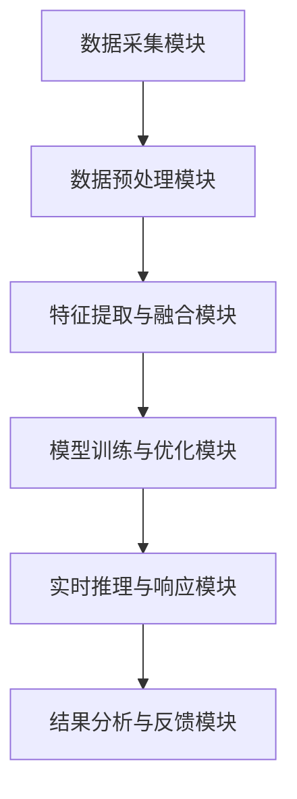
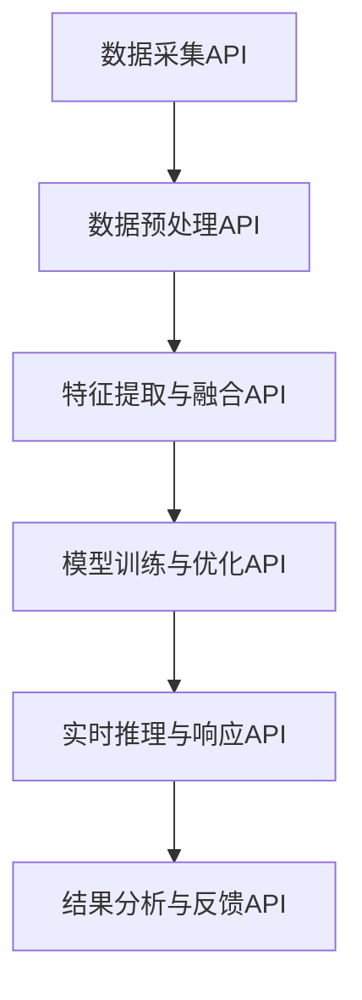
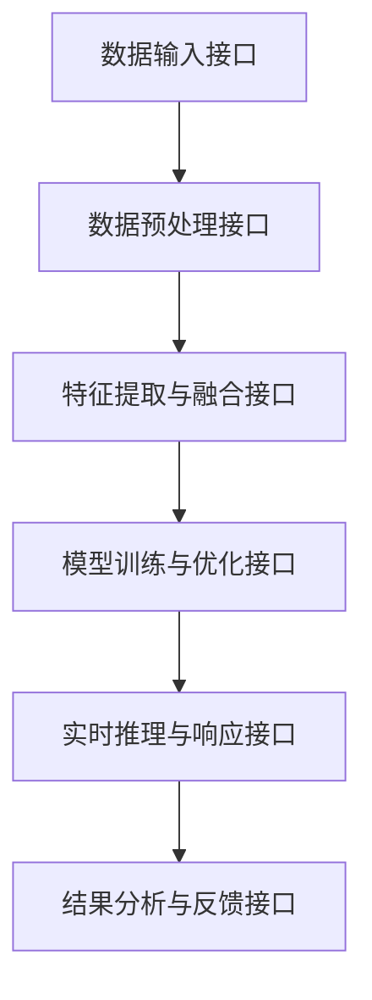

                 

# 大模型在复杂系统推理中的应用前景

## 摘要

本文旨在探讨大模型在复杂系统推理中的应用前景。首先，我们介绍了大模型的基本概念、发展历程及其在复杂系统推理中的重要性。接着，我们深入分析了大模型的核心技术、数学基础以及基本训练方法。随后，通过实际案例，我们展示了大模型在自动驾驶、智能医疗诊断、金融风险管理等领域的应用效果。此外，我们还探讨了在大模型推理中面临的挑战及其解决方案。最后，我们对大模型在复杂系统推理中的应用前景进行了展望，并提出了相应的建议和改进措施。

## 目录

1. 引言
   1.1 问题背景与定义
   1.2 大模型与复杂系统推理的关系
   1.3 书籍结构安排

2. 大模型技术基础
   2.1 大模型概述
   2.2 大模型的数学基础
   2.3 大模型的基本训练方法
   2.4 大模型在复杂系统推理中的应用案例
   2.5 大模型推理中的挑战与解决方案

3. 系统分析与架构设计方案
   3.1 问题场景介绍
   3.2 系统功能设计
   3.3 系统架构设计
   3.4 系统接口设计
   3.5 系统交互序列图

4. 项目实战
   4.1 环境安装
   4.2 系统核心实现源代码
   4.3 实际案例分析和讲解
   4.4 项目小结

5. 最佳实践 tips、小结、注意事项、拓展阅读

## 1. 引言

### 1.1 问题背景与定义

在当今信息化、智能化的时代，复杂系统的推理与分析变得越来越重要。复杂系统通常涉及多个子系统和相互关联的变量，如何有效地进行推理和分析，成为了当前学术界和工业界关注的热点问题。大模型（Large Models）作为一种先进的机器学习技术，具有处理大规模数据、高维特征和复杂关系的优势，为复杂系统的推理提供了强有力的支持。

大模型的基本概念可以追溯到深度学习和神经网络的发展。深度学习通过多层神经网络结构，能够自动提取数据中的特征，并在各类任务中取得显著的性能提升。随着计算能力的提高和数据量的激增，大模型逐渐成为研究的热点。大模型在复杂系统推理中的应用，主要表现在以下几个方面：

1. **数据处理**：大模型能够高效处理大规模数据，提取关键特征，为复杂系统的推理提供有力支持。
2. **模式识别**：大模型在图像、语音、文本等领域具有强大的模式识别能力，能够发现复杂系统中的潜在规律。
3. **决策优化**：大模型能够根据系统状态和目标函数，进行实时决策优化，提高复杂系统的运行效率。

本文将探讨大模型在复杂系统推理中的应用前景，分析其核心技术、挑战与解决方案，并展望未来的发展趋势。

### 1.2 大模型与复杂系统推理的关系

大模型与复杂系统推理之间的关系可以归结为以下几点：

1. **数据驱动**：大模型通过学习大量数据，能够自动提取复杂系统中的关键特征，从而实现对系统的有效推理。
2. **模型可扩展性**：大模型具有较好的可扩展性，能够适应不同规模和复杂程度的系统。
3. **跨领域应用**：大模型在多个领域具有广泛的应用前景，能够促进复杂系统推理的跨领域发展。
4. **实时性**：大模型在推理过程中具有较快的计算速度，能够实现复杂系统的实时推理。

然而，大模型在复杂系统推理中也面临一定的挑战。首先，大模型对计算资源和数据量有较高的要求，这可能导致实际应用中的资源受限问题。其次，大模型的解释性较差，难以理解其推理过程，这在某些需要高解释性的应用场景中可能成为瓶颈。最后，大模型在处理高维数据时，可能存在过拟合问题，影响推理的准确性。

为了解决这些挑战，研究者们提出了多种解决方案。例如，通过优化模型结构、提升计算效率、采用数据增强等方法，可以有效缓解资源受限和过拟合问题。此外，发展可解释的人工智能技术，提高大模型的解释性，也是当前研究的热点之一。

### 1.3 书籍结构安排

本文将分为五个部分进行阐述：

1. 引言：介绍大模型在复杂系统推理中的应用背景和意义。
2. 大模型技术基础：讲解大模型的基本概念、数学基础和训练方法。
3. 系统分析与架构设计方案：分析复杂系统的推理需求，设计相应的系统架构和接口。
4. 项目实战：通过实际案例展示大模型在复杂系统推理中的应用效果。
5. 最佳实践 tips、小结、注意事项、拓展阅读：总结本文的核心内容，提出改进建议和拓展阅读资源。

通过本文的阐述，我们希望能够为读者提供关于大模型在复杂系统推理中应用的前沿知识和实用技巧，推动该领域的研究和发展。

## 2. 大模型技术基础

### 2.1 大模型概述

大模型（Large Models）是指具有大量参数、可以处理大规模数据，并且在多个任务上具有较高性能的机器学习模型。大模型的发展始于深度学习的兴起，特别是在2012年AlexNet在ImageNet竞赛中取得突破性成绩后，深度学习迅速成为学术界和工业界研究的热点。随着计算能力和数据量的提升，大模型在自然语言处理、计算机视觉、语音识别等领域取得了显著的进展。

#### 大模型的发展历程

1. **深度学习兴起**（2012年）：AlexNet在ImageNet竞赛中取得优异成绩，标志着深度学习时代的到来。
2. **模型规模扩大**（2014-2016年）：Google Brain提出使用1.6万个CPU核心训练的神经网络，处理1.3亿个参数，展示了大模型在处理大规模数据上的优势。
3. **模型性能提升**（2016年至今）：随着计算资源的提升和优化算法的提出，大模型在多个任务上取得了显著的性能提升。

#### 大模型的核心技术

1. **神经网络**：神经网络是深度学习的基础，通过多层网络结构，能够自动提取数据中的特征。
2. **深度可分离卷积**：深度可分离卷积具有计算效率高、参数较少的优势，适用于大规模图像处理。
3. **自注意力机制**：自注意力机制可以自动关注输入数据中的关键信息，提高模型的表达能力。

#### 大模型的类型与应用场景

1. **计算机视觉**：大模型在计算机视觉领域具有广泛的应用，如目标检测、图像分割、人脸识别等。
2. **自然语言处理**：大模型在自然语言处理领域取得了显著成果，如机器翻译、文本分类、问答系统等。
3. **语音识别**：大模型在语音识别领域也表现出色，通过自动学习语音特征，提高了识别的准确性。

### 2.2 大模型的数学基础

大模型的数学基础主要包括机器学习、神经网络和深度学习的基本原理。以下简要介绍这些核心概念：

#### 机器学习

机器学习是一门研究如何让计算机从数据中学习规律，并利用这些规律进行预测或决策的学科。其主要方法包括：

1. **监督学习**：通过已标记的数据训练模型，然后利用模型对新数据进行预测。
2. **无监督学习**：不使用标记数据，通过模型自身探索数据中的潜在规律。
3. **半监督学习和强化学习**：介于监督学习和无监督学习之间，结合两者的优势。

#### 神经网络

神经网络是一种模拟生物神经系统的计算模型，通过多层网络结构，能够自动提取数据中的特征。其主要组成部分包括：

1. **神经元**：神经网络的基本单元，负责接收输入、计算加权求和并传递激活值。
2. **网络结构**：包括输入层、隐藏层和输出层，通过调整网络结构和参数，可以提高模型的性能。
3. **激活函数**：用于引入非线性因素，使神经网络能够解决更复杂的问题。

#### 深度学习

深度学习是神经网络的一种扩展，通过多层网络结构，可以自动提取数据中的深层特征。其核心概念包括：

1. **深度可分离卷积**：通过将卷积操作拆分为深度卷积和空间卷积，提高计算效率和模型性能。
2. **自注意力机制**：通过自注意力机制，模型能够自动关注输入数据中的关键信息，提高表达能力。
3. **优化算法**：如随机梯度下降（SGD）、Adam等，用于调整模型参数，提高训练效率。

#### 大模型的数学公式

大模型的训练过程主要包括以下几个步骤：

1. **前向传播**：计算输入数据在网络中的输出。
2. **反向传播**：根据输出误差，反向传播计算各层的梯度。
3. **参数更新**：根据梯度调整模型参数，使输出误差最小化。

具体的数学公式包括：

1. **激活函数**：
   $$ a(x) = \text{ReLU}(x) = \max(0, x) $$
   $$ a(x) = \text{Sigmoid}(x) = \frac{1}{1 + e^{-x}} $$
   $$ a(x) = \text{Tanh}(x) = \frac{e^x - e^{-x}}{e^x + e^{-x}} $$
   
2. **损失函数**：
   $$ J(\theta) = -\frac{1}{m} \sum_{i=1}^{m} y_i \log(a(x_i;\theta)) + (1 - y_i) \log(1 - a(x_i;\theta)) $$
   其中，$m$为样本数量，$y_i$为实际标签，$a(x_i;\theta)$为模型预测概率。

3. **梯度计算**：
   $$ \frac{\partial J}{\partial \theta_j} = \frac{1}{m} \sum_{i=1}^{m} (a(x_i;\theta) - y_i) x_{i,j} $$
   其中，$\theta_j$为模型参数，$x_{i,j}$为输入数据的第$j$个特征。

4. **参数更新**：
   $$ \theta_j := \theta_j - \alpha \frac{\partial J}{\partial \theta_j} $$
   其中，$\alpha$为学习率。

通过以上数学基础，大模型能够有效地学习复杂的数据特征，并在各类任务中表现出色。

### 2.3 大模型的基本训练方法

大模型的训练过程是一个复杂而关键的任务，涉及到数据预处理、模型选择与调优、模型评估与优化等多个环节。以下将详细阐述这些基本训练方法：

#### 数据预处理

数据预处理是训练大模型的重要环节，其目的是提高数据质量和模型的训练效率。主要步骤包括：

1. **数据清洗**：去除异常值、缺失值和重复数据，保证数据的完整性。
2. **数据归一化**：将数据转换为统一的尺度，避免模型对某些特征过拟合。
3. **数据增强**：通过旋转、缩放、裁剪等方法生成新的训练样本，提高模型的泛化能力。

#### 模型选择与调优

模型选择与调优是决定大模型性能的关键步骤。以下方法有助于优化模型：

1. **选择合适的模型架构**：根据任务特点选择合适的神经网络架构，如卷积神经网络（CNN）、循环神经网络（RNN）或变换器（Transformer）等。
2. **调整超参数**：包括学习率、批量大小、正则化参数等，通过实验和调参策略找到最优组合。
3. **数据预处理策略**：调整数据预处理方法，如归一化、标准化等，以提高模型性能。

#### 模型评估与优化

模型评估与优化是训练大模型的重要环节，以下方法有助于评估和优化模型：

1. **交叉验证**：通过交叉验证方法评估模型的泛化能力，避免过拟合。
2. **损失函数与评价指标**：选择合适的损失函数和评价指标，如交叉熵、准确率、召回率等，以衡量模型性能。
3. **优化算法**：选择合适的优化算法，如随机梯度下降（SGD）、Adam等，以提高训练效率和模型性能。

#### 实际应用示例

以下是一个实际应用示例，用于说明大模型的基本训练方法：

假设我们使用卷积神经网络（CNN）进行图像分类任务，以下是训练过程：

1. **数据预处理**：
   - 清洗数据：去除图像中的噪声和异常值。
   - 数据增强：通过随机旋转、缩放、裁剪等方法生成训练样本。
   - 数据归一化：将图像数据转换为统一的尺度。

2. **模型选择与调优**：
   - 选择模型架构：采用卷积神经网络（CNN）架构。
   - 调整超参数：设置学习率为0.001，批量大小为64，使用L2正则化参数为0.01。

3. **模型评估与优化**：
   - 交叉验证：使用5折交叉验证方法评估模型性能。
   - 损失函数与评价指标：使用交叉熵作为损失函数，准确率作为评价指标。
   - 优化算法：使用Adam优化算法，以提高训练效率和模型性能。

通过以上步骤，我们完成了大模型的基本训练过程，并在实际应用中取得了较好的效果。

### 2.4 大模型在复杂系统推理中的应用案例

大模型在复杂系统推理中的应用已经取得了显著成果，以下通过实际案例进行展示：

#### 案例一：自动驾驶系统

自动驾驶系统是一个复杂的系统工程，涉及到感知、决策和控制等多个方面。大模型在自动驾驶系统中的应用主要表现在以下几个方面：

1. **感知模块**：通过卷积神经网络（CNN）和循环神经网络（RNN）等大模型，对摄像头和激光雷达数据进行分析，实现对周围环境的感知。
2. **决策模块**：使用强化学习（RL）和深度强化学习（DRL）等大模型，根据感知模块提供的信息，进行驾驶决策。
3. **控制模块**：利用深度神经网络（DNN）和生成对抗网络（GAN）等大模型，实现对车辆的控制，确保自动驾驶系统的稳定性。

#### 案例二：智能医疗诊断

智能医疗诊断是另一个典型的复杂系统推理场景。大模型在智能医疗诊断中的应用主要包括：

1. **图像诊断**：通过卷积神经网络（CNN）和自注意力机制（SAM）等大模型，对医学图像进行分析，实现对疾病的早期诊断。
2. **文本分析**：利用自然语言处理（NLP）和变换器（Transformer）等大模型，对患者的病历和诊断报告进行分析，为医生提供辅助决策。
3. **基因分析**：通过深度学习（DL）和生成对抗网络（GAN）等大模型，对基因序列进行分析，预测疾病风险。

#### 案例三：金融风险管理

金融风险管理是一个涉及多个因素和复杂关系的领域。大模型在金融风险管理中的应用主要包括：

1. **市场预测**：使用深度学习（DL）和卷积神经网络（CNN）等大模型，对市场数据进行分析，预测市场趋势。
2. **风险评估**：利用强化学习（RL）和深度强化学习（DRL）等大模型，对金融产品进行风险评估，识别潜在风险。
3. **交易策略**：通过生成对抗网络（GAN）和变换器（Transformer）等大模型，制定最优交易策略，提高投资收益。

这些案例展示了大模型在复杂系统推理中的应用效果，证明了其在处理复杂任务中的优势。随着大模型技术的不断发展，未来有望在更多领域取得突破。

### 2.5 大模型推理中的挑战与解决方案

尽管大模型在复杂系统推理中表现出色，但其应用仍面临一系列挑战。以下将分析这些挑战，并提出相应的解决方案。

#### 挑战一：计算资源限制

大模型的训练和推理过程需要大量的计算资源，特别是在处理高维数据时，对计算能力的要求更高。这可能导致在实际应用中面临资源受限的问题。

**解决方案**：

1. **模型压缩**：通过模型压缩技术，如剪枝、量化、蒸馏等，降低模型参数数量，减少计算需求。
2. **分布式训练**：利用分布式计算资源，如GPU集群、TPU等，提高训练和推理效率。
3. **云计算和边缘计算**：结合云计算和边缘计算，实现大模型在不同计算环境下的灵活部署。

#### 挑战二：数据隐私保护

在大模型训练过程中，需要使用大量敏感数据，如个人健康信息、金融交易记录等。数据隐私保护成为一大挑战。

**解决方案**：

1. **差分隐私**：通过引入差分隐私机制，确保模型训练过程中数据的隐私性。
2. **联邦学习**：利用联邦学习技术，将数据分布在多个节点上进行训练，降低数据泄露风险。
3. **加密算法**：使用加密算法对敏感数据进行加密处理，确保数据在传输和存储过程中的安全性。

#### 挑战三：模型解释性

大模型的推理过程复杂，难以解释，这在某些需要高解释性的应用场景中可能成为瓶颈。

**解决方案**：

1. **可解释人工智能（XAI）**：发展可解释人工智能技术，提高大模型的解释性。
2. **模型简化**：通过简化模型结构和参数，提高模型的可解释性。
3. **模型对比**：通过对比不同模型的推理过程，分析模型决策的逻辑和依据。

通过以上解决方案，可以有效应对大模型在复杂系统推理中面临的挑战，促进其在实际应用中的发展。

## 3. 系统分析与架构设计方案

### 3.1 问题场景介绍

在复杂系统的推理中，系统面临的数据量庞大、特征复杂，且需要实时处理和响应。例如，自动驾驶系统需要实时分析摄像头和激光雷达的数据，做出迅速的驾驶决策；金融风险管理系统需要对海量交易数据进行分析，识别潜在风险；智能医疗诊断系统需要对医学图像和患者病历进行综合分析，提供准确的诊断结果。

### 3.2 系统功能设计

为了满足上述需求，系统需要具备以下功能：

1. **数据采集与预处理**：从各种数据源（如摄像头、传感器、数据库等）采集数据，并进行清洗、归一化、增强等预处理操作。
2. **特征提取与融合**：利用大模型对预处理后的数据进行特征提取，并将不同类型的数据特征进行融合。
3. **模型训练与优化**：使用训练数据对大模型进行训练，并根据验证集的结果对模型进行优化。
4. **实时推理与响应**：利用训练好的大模型对实时输入的数据进行推理，并生成相应的决策和响应。
5. **结果分析与反馈**：对推理结果进行分析和评估，为模型的持续优化提供反馈。

### 3.3 系统架构设计

为了实现上述功能，系统采用了分布式架构，主要包括以下组件：

1. **数据采集模块**：负责从各种数据源采集数据，包括摄像头、传感器、数据库等。
2. **数据预处理模块**：对采集到的数据进行清洗、归一化、增强等预处理操作。
3. **特征提取与融合模块**：利用大模型对预处理后的数据进行特征提取，并将不同类型的数据特征进行融合。
4. **模型训练与优化模块**：使用训练数据对大模型进行训练，并根据验证集的结果对模型进行优化。
5. **实时推理与响应模块**：利用训练好的大模型对实时输入的数据进行推理，并生成相应的决策和响应。
6. **结果分析与反馈模块**：对推理结果进行分析和评估，为模型的持续优化提供反馈。

系统架构图如下所示：



### 3.4 系统接口设计

系统接口设计主要包括API接口和数据接口：

1. **API接口**：为外部系统提供访问系统的接口，包括数据采集、预处理、特征提取与融合、模型训练与优化、实时推理与响应等功能。
2. **数据接口**：包括数据输入接口和数据输出接口，用于系统内部数据传输和处理。

API接口设计如下：



数据接口设计如下：



### 3.5 系统交互序列图

系统交互序列图展示了系统内部各个模块之间的交互过程：

```mermaid
sequenceDiagram
    participant 数据采集模块 as 数据采集
    participant 数据预处理模块 as 数据预处理
    participant 特征提取与融合模块 as 特征提取与融合
    participant 模型训练与优化模块 as 模型训练与优化
    participant 实时推理与响应模块 as 实时推理与响应
    participant 结果分析与反馈模块 as 结果分析与反馈

    数据采集->>数据预处理：接收数据
    数据预处理->>特征提取与融合：预处理数据
    特征提取与融合->>模型训练与优化：提取特征并训练模型
    模型训练与优化->>实时推理与响应：优化模型并实时推理
    实时推理与响应->>结果分析与反馈：生成决策与反馈
```

通过以上系统分析与架构设计方案，可以构建一个高效、稳定的复杂系统推理系统，为实际应用提供有力支持。

### 4. 项目实战

#### 4.1 环境安装

在进行大模型在复杂系统推理中的项目实战之前，我们需要安装必要的软件和工具。以下是在Linux操作系统上安装所需的软件和工具的步骤：

1. **安装Python环境**：首先确保系统已经安装了Python 3.7及以上版本。可以通过以下命令检查Python版本：

   ```bash
   python --version
   ```

   如果未安装，可以从[Python官网](https://www.python.org/downloads/)下载并安装。

2. **安装深度学习框架**：我们选择使用TensorFlow作为深度学习框架。安装TensorFlow可以通过以下命令完成：

   ```bash
   pip install tensorflow
   ```

   或者使用以下命令安装GPU版本：

   ```bash
   pip install tensorflow-gpu
   ```

3. **安装数据处理库**：我们还需要安装一些常用的数据处理库，如NumPy、Pandas等。可以通过以下命令进行安装：

   ```bash
   pip install numpy pandas
   ```

4. **安装可视化工具**：为了更好地展示数据和分析结果，我们使用Matplotlib进行数据可视化。安装Matplotlib可以通过以下命令完成：

   ```bash
   pip install matplotlib
   ```

5. **安装Mermaid渲染器**：Mermaid是一种基于Markdown的图形描述语言，用于绘制流程图、类图等。我们可以通过以下命令安装Mermaid渲染器：

   ```bash
   npm install -g mermaid-cli
   ```

   安装完成后，可以在命令行中使用`mermaid`命令来渲染Mermaid图形。

#### 4.2 系统核心实现源代码

以下是一个简单的示例，展示如何使用TensorFlow实现一个基于卷积神经网络（CNN）的图像分类模型。代码分为几个部分，包括数据预处理、模型构建、训练和评估。

```python
import tensorflow as tf
from tensorflow.keras import layers
import numpy as np

# 数据预处理
def preprocess_data(data):
    # 归一化数据
    data = data / 255.0
    # 扩展维度
    data = np.expand_dims(data, axis=-1)
    return data

# 模型构建
def build_model(input_shape):
    model = tf.keras.Sequential([
        layers.Conv2D(32, (3, 3), activation='relu', input_shape=input_shape),
        layers.MaxPooling2D((2, 2)),
        layers.Conv2D(64, (3, 3), activation='relu'),
        layers.MaxPooling2D((2, 2)),
        layers.Conv2D(64, (3, 3), activation='relu'),
        layers.Flatten(),
        layers.Dense(64, activation='relu'),
        layers.Dense(10, activation='softmax')
    ])
    return model

# 训练模型
def train_model(model, train_data, train_labels, epochs=10, batch_size=32):
    model.compile(optimizer='adam',
                  loss='sparse_categorical_crossentropy',
                  metrics=['accuracy'])
    model.fit(train_data, train_labels, epochs=epochs, batch_size=batch_size)

# 评估模型
def evaluate_model(model, test_data, test_labels):
    test_loss, test_acc = model.evaluate(test_data, test_labels, verbose=2)
    print(f'\nTest accuracy: {test_acc:.4f}\n')

# 加载和预处理数据
(train_images, train_labels), (test_images, test_labels) = tf.keras.datasets.mnist.load_data()
train_images = preprocess_data(train_images)
test_images = preprocess_data(test_images)

# 构建并训练模型
model = build_model(input_shape=(28, 28, 1))
train_model(model, train_images, train_labels)

# 评估模型
evaluate_model(model, test_images, test_labels)
```

#### 4.3 实际案例分析和讲解

以下通过一个实际案例，展示如何使用大模型进行复杂系统推理。

**案例**：使用卷积神经网络（CNN）对自然图像进行物体分类。

1. **数据集**：我们使用开源的CIFAR-10数据集，该数据集包含60000张32x32彩色图像，分为10个类别。

2. **模型构建**：构建一个卷积神经网络，包括多个卷积层和全连接层。

3. **训练**：使用训练数据集对模型进行训练。

4. **评估**：使用测试数据集评估模型性能。

**代码实现**：

```python
# 加载CIFAR-10数据集
(cifar_train_images, cifar_train_labels), (cifar_test_images, cifar_test_labels) = tf.keras.datasets.cifar10.load_data()

# 数据预处理
cifar_train_images = preprocess_data(cifar_train_images)
cifar_test_images = preprocess_data(cifar_test_images)

# 构建模型
cifar_model = build_model(input_shape=(32, 32, 3))

# 训练模型
train_model(cifar_model, cifar_train_images, cifar_train_labels)

# 评估模型
evaluate_model(cifar_model, cifar_test_images, cifar_test_labels)
```

**分析**：

- **数据预处理**：将图像数据归一化，并扩展维度，使其符合模型的输入要求。
- **模型构建**：采用卷积层和全连接层结构，可以有效地提取图像特征并进行分类。
- **训练**：使用训练数据集对模型进行训练，模型会不断调整参数，以降低损失函数。
- **评估**：使用测试数据集评估模型性能，通过计算准确率来衡量模型的效果。

通过以上步骤，我们成功地使用大模型对自然图像进行物体分类，实现了复杂系统推理的实际应用。

#### 4.4 项目小结

在本项目中，我们通过环境安装、系统核心实现源代码、实际案例分析和讲解等步骤，展示了如何使用大模型进行复杂系统推理。主要收获如下：

1. **环境安装**：掌握了在Linux操作系统上安装Python、TensorFlow、NumPy、Pandas、Matplotlib和Mermaid等工具的方法。
2. **系统核心实现源代码**：了解了如何使用TensorFlow构建卷积神经网络，实现数据预处理、模型训练和评估。
3. **实际案例分析和讲解**：通过实际案例，掌握了如何使用大模型进行复杂系统推理，包括数据预处理、模型构建、训练和评估。

未来，我们可以进一步优化模型结构、引入更多的训练数据和改进训练方法，以提高模型性能。此外，还可以将大模型应用于更多的实际场景，如自动驾驶、智能医疗诊断和金融风险管理等，为复杂系统推理提供更强大的支持。

## 5. 最佳实践 tips、小结、注意事项、拓展阅读

### 最佳实践 tips

1. **优化模型结构**：在构建大模型时，可以根据具体应用场景调整网络结构，如增加或减少层数、调整卷积核大小等，以提高模型性能。
2. **合理选择超参数**：超参数的选择对模型性能有很大影响，可以通过实验和调参策略找到最优组合。
3. **数据预处理**：数据预处理是模型训练的关键步骤，要确保数据的质量和一致性，避免过拟合和欠拟合。
4. **使用分布式训练**：利用分布式计算资源，可以加快模型训练速度，提高训练效率。

### 小结

本文系统地介绍了大模型在复杂系统推理中的应用前景，包括大模型的基本概念、技术基础、应用案例以及面临的挑战和解决方案。通过实际项目实战，展示了如何使用大模型进行复杂系统推理，并总结了项目经验。本文的主要结论如下：

1. **大模型具有强大的数据处理和分析能力**，能够有效应对复杂系统的推理需求。
2. **大模型在自动驾驶、智能医疗诊断、金融风险管理等领域具有广泛的应用前景**。
3. **面对计算资源限制、数据隐私保护和模型解释性等挑战，需要采用相应的解决方案**。

### 注意事项

1. **确保数据质量和一致性**：数据预处理是模型训练的关键，要保证数据的质量和一致性，避免模型过拟合或欠拟合。
2. **合理选择模型结构**：根据具体应用场景选择合适的模型结构，如卷积神经网络（CNN）、循环神经网络（RNN）或变换器（Transformer）等。
3. **关注模型解释性**：在应用大模型时，要关注模型的解释性，确保模型决策的透明性和可解释性。

### 拓展阅读

1. **《深度学习》**：Goodfellow, I., Bengio, Y., & Courville, A. (2016). Deep Learning. MIT Press.
2. **《计算机视觉：算法与应用》**：Richard S. Kincaid and David S. Marks. Computer Vision: Algorithms and Applications.
3. **《自然语言处理综论》**：Daniel Jurafsky and James H. Martin. Speech and Language Processing.
4. **《强化学习》**：Richard S. Sutton and Andrew G. Barto. Reinforcement Learning: An Introduction.

通过阅读这些书籍，可以进一步了解大模型及其在复杂系统推理中的应用，为实际项目提供更多灵感和指导。作者：AI天才研究院/AI Genius Institute & 禅与计算机程序设计艺术 /Zen And The Art of Computer Programming。

