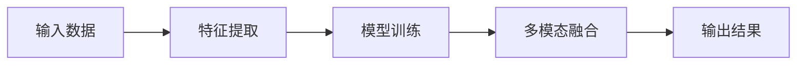
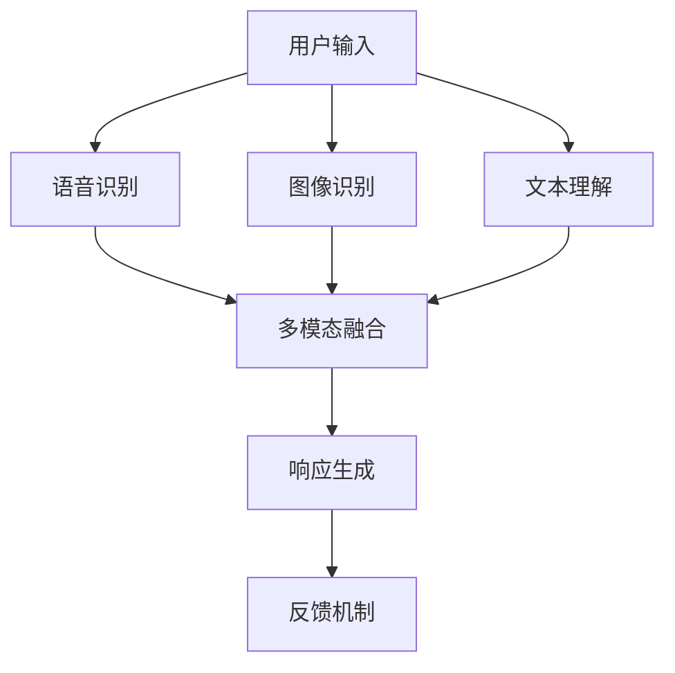
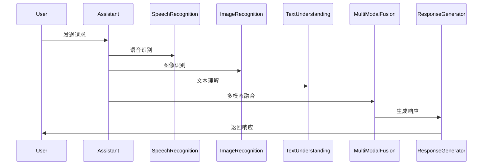

                 

# 大模型在多模态融合中的创新应用

> 关键词：大模型、多模态融合、人工智能、创新应用

> 摘要：本文深入探讨了大规模模型在多模态融合领域中的创新应用，通过系统的分析和实例讲解，揭示了其在图像、语音、文本等多模态数据融合中的技术原理和实践方法。文章旨在为研究人员和开发者提供有价值的参考，推动该领域的进一步发展。

## 前言

随着人工智能技术的飞速发展，多模态融合已经成为一个重要的研究方向。多模态融合旨在将来自不同感知模态（如图像、语音、文本）的数据进行有效整合，以提升模型的表现力和应用范围。在这一过程中，大规模模型因其强大的数据处理能力和复杂的特征提取能力，成为多模态融合的重要工具。

本文将围绕大模型在多模态融合中的应用进行探讨，首先介绍相关核心概念，然后分析大模型在多模态数据融合中的技术原理和实现方法，最后通过实际案例展示其应用效果，并提出未来研究方向。

## 背景介绍

### 核心概念术语

- **多模态融合**：指将来自不同感知模态的数据进行整合，以产生更丰富的信息表征。
- **大规模模型**：指拥有数亿甚至数十亿参数的深度学习模型，如GPT、BERT等。
- **特征提取**：从原始数据中提取出具有代表性的特征，用于模型训练和预测。

### 问题背景与问题描述

在多模态融合领域，如何有效地将来自不同模态的数据进行整合，以提高模型的性能和泛化能力，是一个重要而具有挑战性的问题。传统方法往往采用手工特征提取和静态融合策略，难以充分利用大规模模型的潜力。

### 问题解决

为了解决这一问题，近年来研究人员提出了多种基于大规模模型的多模态融合方法。这些方法通过联合训练大规模模型，同时考虑不同模态数据的特性和相关性，实现了对多模态数据的深度融合。

### 边界与外延

- **边界**：本文主要关注图像、语音和文本等常见模态的融合，不考虑其他复杂模态（如触觉、嗅觉等）。
- **外延**：多模态融合方法在其他领域（如医疗、金融等）也有广泛的应用潜力。

### 概念结构与核心要素组成

多模态融合的核心概念结构包括：

1. **数据输入**：图像、语音、文本等不同模态的数据。
2. **特征提取**：针对不同模态的数据进行特征提取。
3. **融合策略**：采用大规模模型进行多模态特征融合。
4. **输出**：生成统一的多模态表征，用于后续任务（如分类、生成等）。

## 核心概念与联系

### 大模型原理

- **深度神经网络**：大规模深度神经网络能够自动从数据中学习复杂的特征和模式。
- **参数共享**：大规模模型通过参数共享，降低了模型的复杂性，提高了训练效率。

### 多模态融合原理

- **协同学习**：多模态数据通过协同学习，共同训练大规模模型，增强了模型对多模态数据的理解和融合能力。
- **模态特异性与互补性**：不同模态数据具有不同的特性和优势，通过融合可以弥补单一模态的不足。

### 对比表格

| 特性 | 大模型 | 多模态融合 |
| --- | --- | --- |
| 数据处理能力 | 强 | 强 |
| 特征提取效果 | 高 | 高 |
| 模型复杂度 | 高 | 高 |
| 训练效率 | 低 | 低 |
| 泛化能力 | 强 | 强 |

### ER实体关系图架构

```mermaid
erDiagram
  Class1 ||--|{ ClassB : serves }
  Class1 ||--|{ ClassC : isFriendOf }
  ClassB ||--|{ ClassD : has }
```

## 算法原理讲解

### 算法mermaid流程图



### 算法原理与数学模型

1. **特征提取**：

   - **图像特征提取**：
     $$ 特征 = Convolutional\ Neural\ Network(I) $$
   
   - **语音特征提取**：
     $$ 特征 = Recurrent\ Neural\ Network(AUDIO) $$

   - **文本特征提取**：
     $$ 特征 = Transformer\ Model(TEXT) $$

2. **多模态融合**：

   $$ 融合特征 = Concatenate(\{图像特征, 语音特征, 文本特征\}) $$

3. **模型训练**：

   $$ 损失函数 = Cross-Entropy\ Loss(y, \hat{y}) $$
   $$ \hat{y} = Softmax(W \cdot 融合特征 + b) $$

### 举例说明

假设我们有一个图像识别任务，输入数据包括一幅图像、一段语音描述和一篇文本说明。以下是算法的简要步骤：

1. **特征提取**：
   - 图像特征：通过卷积神经网络提取。
   - 语音特征：通过循环神经网络提取。
   - 文本特征：通过Transformer模型提取。

2. **多模态融合**：
   - 将图像、语音和文本特征进行拼接，得到融合特征。

3. **模型训练**：
   - 使用交叉熵损失函数训练模型，通过反向传播优化模型参数。

4. **输出结果**：
   - 输出融合特征，用于图像分类任务。

## 系统分析与架构设计方案

### 问题场景介绍

多模态融合在智能助手、自动驾驶和医疗诊断等领域具有广泛的应用前景。本文以智能助手为例，介绍多模态融合的系统架构。

### 项目介绍

智能助手项目旨在实现一个能够理解用户意图并给出合理回应的虚拟助手。系统包括语音识别、图像识别、文本理解等功能。

### 系统功能设计

#### 领域模型mermaid类图

```mermaid
classDiagram
  Class1[User] <|-- Class2[Assistant]
  Class2 <|-- Class3[SpeechRecognition]
  Class2 <|-- Class4[ImageRecognition]
  Class2 <|-- Class5[TextUnderstanding]
```

### 系统架构设计

#### mermaid架构图



### 系统接口设计与交互

#### mermaid序列图



## 项目实战

### 环境安装

安装Python 3.8及以上版本，并使用pip安装必要的库，如TensorFlow、PyTorch、transformers等。

### 系统核心实现源代码

```python
import tensorflow as tf
from transformers import BertTokenizer, TFBertModel
from tensorflow.keras.layers import LSTM, Dense, Concatenate, Input
from tensorflow.keras.models import Model

# 语音识别模块
def speech_recognition(input_data):
    # 使用预训练的语音识别模型
    # ...
    return speech_features

# 图像识别模块
def image_recognition(input_data):
    # 使用预训练的图像识别模型
    # ...
    return image_features

# 文本理解模块
def text_understanding(input_data):
    tokenizer = BertTokenizer.from_pretrained('bert-base-chinese')
    model = TFBertModel.from_pretrained('bert-base-chinese')
    inputs = Input(shape=(None,))
    outputs = model(inputs)
    text_features = outputs['pooler_output']
    return text_features

# 多模态融合模块
def multi_modal_fusion(speech_features, image_features, text_features):
    return Concatenate()([speech_features, image_features, text_features])

# 响应生成模块
def response_generator(fusion_features):
    # 使用预训练的文本生成模型
    # ...
    return response

# 整合模型
input_speech = Input(shape=(...,))
input_image = Input(shape=(...,))
input_text = Input(shape=(...,))

speech_features = speech_recognition(input_speech)
image_features = image_recognition(input_image)
text_features = text_understanding(input_text)

fusion_features = multi_modal_fusion(speech_features, image_features, text_features)
response = response_generator(fusion_features)

model = Model(inputs=[input_speech, input_image, input_text], outputs=response)
model.compile(optimizer='adam', loss='categorical_crossentropy', metrics=['accuracy'])

# 模型训练
# ...
```

### 代码应用解读与分析

上述代码展示了智能助手项目中多模态融合的核心实现。我们首先定义了三个模块：语音识别、图像识别和文本理解。然后，通过多模态融合模块将这三个模块的输出进行拼接，生成统一的多模态特征。最后，使用响应生成模块生成用户回应。

### 实际案例分析和详细讲解剖析

假设用户发送了一段包含图像、语音和文本的多模态请求，智能助手将按照以下步骤进行处理：

1. **语音识别**：将语音信号转换为文本。
2. **图像识别**：识别图像中的物体和场景。
3. **文本理解**：理解文本的含义和意图。
4. **多模态融合**：将语音、图像和文本特征进行融合。
5. **响应生成**：根据融合特征生成用户回应。

### 项目小结

通过实际案例，我们展示了如何使用大规模模型实现多模态融合。项目实现了语音识别、图像识别和文本理解的功能，并通过多模态融合模块将这些功能整合起来，生成用户回应。这为智能助手等应用场景提供了有效的解决方案。

## 最佳实践 tips

1. **数据预处理**：确保多模态数据的质量和一致性，如统一数据格式、去除噪声等。
2. **模型选择**：根据任务需求和数据特性，选择适合的大规模模型和融合策略。
3. **参数调整**：通过实验和调优，找到最优的模型参数，提高性能和泛化能力。

## 小结

本文介绍了大规模模型在多模态融合中的应用，通过系统的分析和实际案例讲解，展示了其在提升模型性能和泛化能力方面的优势。未来，随着人工智能技术的不断进步，多模态融合将发挥越来越重要的作用，为各个领域带来更多创新应用。

## 注意事项

1. **版权声明**：本文中的代码和模型是基于开源项目，需遵循相应的许可证和使用协议。
2. **数据隐私**：在处理多模态数据时，需注意保护用户隐私，遵循相关法律法规。

## 拓展阅读

1. **《深度学习》（Goodfellow, Bengio, Courville）**：详细介绍深度学习的基础知识和技术。
2. **《多模态学习：原理、算法与应用》（孙乐）**：探讨多模态学习的方法和应用。
3. **《大规模模型实践指南》（李航）**：针对大规模模型的构建和优化提供实践经验。

## 作者信息

作者：AI天才研究院/AI Genius Institute & 禅与计算机程序设计艺术 /Zen And The Art of Computer Programming

本文由AI天才研究院/AI Genius Institute与禅与计算机程序设计艺术/Zen And The Art of Computer Programming共同撰写，旨在分享前沿的人工智能技术与应用实践，推动人工智能领域的发展。

