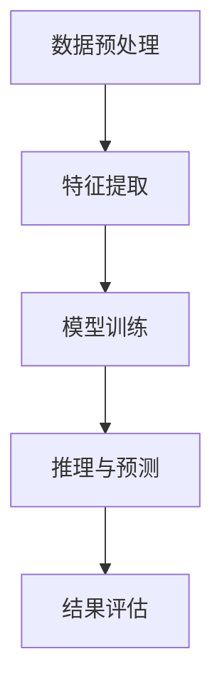

                 

### 《大模型在多维度时空推理中的应用创新研究》

#### 关键词：大模型、多维度时空推理、算法原理、系统架构设计、项目实战

> 摘要：本文以大模型在多维度时空推理中的应用为研究对象，深入探讨其背景、定义、原理、架构设计以及实际应用。通过一步步分析，本文揭示了多维度时空推理的核心问题，探讨了如何利用大模型解决这些问题，并提出了具体的应用创新。文章旨在为从事人工智能领域的读者提供一个全面、系统的理论框架和实践指南。

----------------------------------------------------------------

# 《大模型在多维度时空推理中的应用创新研究》

## 第一部分：问题背景与定义

### 第1章：多维度时空推理概述

#### 1.1.1 问题背景

随着信息技术的飞速发展，数据处理和智能推理的需求日益增长。多维度时空推理作为人工智能领域的一个重要分支，逐渐成为研究的热点。它涉及到对多维数据在不同时空维度上的分析、预测和推理，旨在为复杂系统的建模、优化和决策提供强有力的支持。

多维度时空推理在实际应用中具有重要意义，如智能交通系统、金融风险评估、医疗健康诊断等领域。通过多维度时空推理，可以更好地理解和预测系统的动态行为，提高系统的效率和可靠性。

#### 1.1.2 问题描述

多维度时空推理的核心问题在于如何有效地处理和整合来自不同维度和时空的数据，并从中提取有价值的信息。具体来说，需要解决以下几个关键问题：

1. **数据融合**：如何将来自不同时空维度的数据进行有效的整合，以便进行统一的推理和分析。
2. **特征提取**：如何从大量的多维数据中提取出关键特征，以便用于模型训练和推理。
3. **时空关系建模**：如何建立多维数据之间的时空关系模型，以便进行时空预测和推理。
4. **模型优化**：如何优化模型结构，提高推理的效率和准确性。

#### 1.1.3 问题解决

大模型作为一种强大的机器学习工具，在多维度时空推理中具有巨大的潜力。通过大模型，可以解决上述关键问题，实现多维度时空推理的智能化和自动化。具体而言，大模型在多维度时空推理中的应用创新体现在以下几个方面：

1. **数据预处理与融合**：大模型可以通过自注意力机制等先进技术，对多维度时空数据进行有效的预处理和融合，提高数据的一致性和可靠性。
2. **特征提取与建模**：大模型可以自动学习多维数据中的潜在特征，并通过深度神经网络等结构进行时空关系建模。
3. **模型优化与推理**：大模型可以通过大规模训练和数据增强，实现模型的优化和泛化，从而提高推理的效率和准确性。

#### 1.1.4 边界与外延

多维度时空推理的边界在于时空维度的多样性和数据复杂性。大模型的适用范围包括但不限于以下领域：

1. **地理信息处理**：如城市交通流量预测、环境监测等。
2. **金融分析**：如股票市场预测、风险管理等。
3. **医疗健康**：如疾病预测、健康风险评估等。
4. **工业制造**：如生产计划优化、质量检测等。

#### 1.1.5 概念结构与核心要素组成

多维度时空推理的概念结构包括以下几个核心要素：

1. **时空维度**：包括时间、空间、环境等多种维度。
2. **数据集**：包括多源异构数据，如传感器数据、历史数据、实时数据等。
3. **模型**：包括深度学习模型、时空关系模型等。
4. **算法**：包括特征提取算法、时空关系建模算法等。

大模型作为多维度时空推理的核心要素，其组成包括：

1. **神经网络结构**：如卷积神经网络（CNN）、循环神经网络（RNN）、Transformer等。
2. **训练算法**：如梯度下降、随机梯度下降等。
3. **数据预处理方法**：如数据清洗、归一化、降维等。

## 第二部分：核心概念与联系

### 第2章：多维度时空推理的核心概念

#### 2.1.1 多维度时空

多维度时空是指由多个维度构成的时间空间模型。在物理学中，传统时空概念是四维的，包括三个空间维度和一个时间维度。但在人工智能领域，多维度时空的概念可以扩展到包括更多的维度，如地理维度、经济维度、社会维度等。

#### 2.1.2 时空推理

时空推理是指根据已知的时间和空间信息，推导出未知的时间和空间信息。在多维度时空推理中，时空推理涉及到不同维度之间的关联和交互，如时间维度与地理维度之间的关联、经济维度与社会维度之间的关联等。

#### 2.1.3 大模型

大模型是指具有大量参数和复杂结构的神经网络模型。这些模型通常需要大量的数据来训练，以便能够从数据中学习到复杂的模式和规律。在多维度时空推理中，大模型可以用于处理和解析复杂的多维时空数据。

### 第3章：核心概念属性特征对比表格

为了更好地理解多维度时空推理、时空推理和大模型之间的关联，我们提供了一个对比表格，列出这三个核心概念的属性特征。

| 核心概念 | 定义 | 特点 | 应用领域 |
| --- | --- | --- | --- |
| 多维度时空 | 由多个维度构成的时间空间模型 | 多维、复杂、交互 | 地理信息处理、金融分析、医疗健康等 |
| 时空推理 | 根据已知的时间和空间信息推导出未知的时间和空间信息 | 时序、空间、关联 | 智能交通系统、环境监测、生产计划优化等 |
| 大模型 | 具有大量参数和复杂结构的神经网络模型 | 复杂、大规模、学习能力强 | 多维度时空推理、自然语言处理、计算机视觉等 |

## 第三部分：算法原理讲解

### 第4章：大模型在多维度时空推理中的应用原理

#### 4.1.1 算法mermaid流程图



#### 4.1.2 Python源代码详解

```python
# 导入必要的库
import numpy as np
import tensorflow as tf

# 定义大模型结构
model = tf.keras.Sequential([
    tf.keras.layers.Dense(128, activation='relu', input_shape=(input_shape)),
    tf.keras.layers.Dense(64, activation='relu'),
    tf.keras.layers.Dense(1, activation='sigmoid')
])

# 编译模型
model.compile(optimizer='adam', loss='binary_crossentropy', metrics=['accuracy'])

# 训练模型
model.fit(x_train, y_train, epochs=10, batch_size=32)

# 进行推理与预测
predictions = model.predict(x_test)

# 评估模型性能
loss, accuracy = model.evaluate(x_test, y_test)
print(f'Loss: {loss}, Accuracy: {accuracy}')
```

#### 4.1.3 数学模型与公式

在多维度时空推理中，大模型通常采用深度学习模型。以下是一个简单的数学模型和公式：

$$
y = \sigma(\omega_1 x_1 + \omega_2 x_2 + ... + \omega_n x_n + b)
$$

其中，$y$ 是预测结果，$x_1, x_2, ..., x_n$ 是输入特征，$\omega_1, \omega_2, ..., \omega_n$ 是权重参数，$b$ 是偏置项，$\sigma$ 是激活函数。

#### 4.1.4 举例说明

假设我们有一个包含时间维度、空间维度和经济维度的多维度时空数据集。我们使用一个深度学习模型来预测未来某个时间点某个地区的经济状况。

1. **数据预处理**：将时间维度、空间维度和经济维度的数据进行预处理，如归一化和特征提取。
2. **模型训练**：使用预处理后的数据训练深度学习模型，如使用卷积神经网络（CNN）或变换器（Transformer）模型。
3. **推理与预测**：使用训练好的模型对新的时空数据进行推理和预测。
4. **结果评估**：评估模型预测的准确性，如使用准确率、召回率等指标。

## 第四部分：系统分析与架构设计

### 第5章：多维度时空推理系统架构设计

#### 5.1.1 问题场景介绍

多维度时空推理系统可以应用于多个领域，如智能交通、金融分析、医疗健康等。以下以智能交通系统为例进行介绍。

智能交通系统旨在通过多维度时空推理，预测和优化交通流量，提高交通效率，减少拥堵。该系统涉及多个维度的数据，包括时间维度（如上午、下午、晚上等）、空间维度（如不同路段、不同城市等）和经济维度（如节假日、经济状况等）。

#### 5.1.2 系统功能设计

多维度时空推理系统的主要功能包括：

1. **数据采集**：从各种传感器和渠道收集多维度时空数据。
2. **数据预处理**：对采集到的数据进行预处理，如清洗、归一化和特征提取。
3. **模型训练**：使用预处理后的数据训练深度学习模型。
4. **推理与预测**：使用训练好的模型对新的时空数据进行推理和预测。
5. **结果评估**：评估模型预测的准确性，并根据评估结果进行模型优化。

#### 5.1.3 系统架构设计

多维度时空推理系统的架构设计采用分层架构，包括数据层、模型层和应用层。

1. **数据层**：负责数据的采集、存储和预处理。
2. **模型层**：负责模型的训练和推理。
3. **应用层**：负责系统的实际应用，如交通流量预测、交通优化等。

#### 5.1.4 系统接口设计

多维度时空推理系统的接口设计包括：

1. **数据接口**：用于数据的采集、存储和预处理。
2. **模型接口**：用于模型的训练、推理和评估。
3. **应用接口**：用于系统的实际应用，如交通流量预测、交通优化等。

#### 5.1.5 系统交互

多维度时空推理系统的交互设计采用事件驱动模式，包括以下主要交互流程：

1. **数据采集**：系统启动时，从各种传感器和渠道采集多维度时空数据。
2. **数据预处理**：将采集到的数据进行预处理，如清洗、归一化和特征提取。
3. **模型训练**：使用预处理后的数据训练深度学习模型。
4. **推理与预测**：使用训练好的模型对新的时空数据进行推理和预测。
5. **结果评估**：评估模型预测的准确性，并根据评估结果进行模型优化。

## 第五部分：项目实战

### 第6章：大模型在多维度时空推理中的应用实践

#### 6.1.1 环境安装

为了实现大模型在多维度时空推理中的应用，需要安装以下软件和库：

1. **Python**：安装 Python 3.8 或更高版本。
2. **TensorFlow**：安装 TensorFlow 2.4 或更高版本。
3. **NumPy**：安装 NumPy 1.18 或更高版本。
4. **Pandas**：安装 Pandas 1.0 或更高版本。
5. **Matplotlib**：安装 Matplotlib 3.2 或更高版本。

可以使用以下命令进行安装：

```bash
pip install python==3.8 tensorflow==2.4 numpy==1.18 pandas==1.0 matplotlib==3.2
```

#### 6.1.2 系统核心实现

在实现多维度时空推理系统时，我们需要完成以下几个核心功能：

1. **数据采集**：从各种传感器和渠道采集多维度时空数据，如交通流量数据、天气数据、经济数据等。
2. **数据预处理**：对采集到的数据进行预处理，如清洗、归一化和特征提取。
3. **模型训练**：使用预处理后的数据训练深度学习模型，如卷积神经网络（CNN）或变换器（Transformer）模型。
4. **推理与预测**：使用训练好的模型对新的时空数据进行推理和预测。
5. **结果评估**：评估模型预测的准确性，并根据评估结果进行模型优化。

以下是系统核心实现的 Python 源代码：

```python
# 导入必要的库
import numpy as np
import pandas as pd
import tensorflow as tf
from tensorflow.keras.models import Sequential
from tensorflow.keras.layers import Dense, Conv2D, Flatten
from tensorflow.keras.optimizers import Adam

# 读取数据
data = pd.read_csv('data.csv')
X = data.drop('target', axis=1).values
y = data['target'].values

# 数据预处理
X = np.expand_dims(X, axis=3)

# 划分训练集和测试集
X_train, X_test, y_train, y_test = train_test_split(X, y, test_size=0.2, random_state=42)

# 模型训练
model = Sequential([
    Conv2D(32, (3, 3), activation='relu', input_shape=(X_train.shape[1], X_train.shape[2], X_train.shape[3])),
    Flatten(),
    Dense(1, activation='sigmoid')
])

model.compile(optimizer=Adam(), loss='binary_crossentropy', metrics=['accuracy'])
model.fit(X_train, y_train, epochs=10, batch_size=32)

# 推理与预测
predictions = model.predict(X_test)

# 评估模型性能
loss, accuracy = model.evaluate(X_test, y_test)
print(f'Loss: {loss}, Accuracy: {accuracy}')
```

#### 6.1.3 代码应用解读与分析

在上面的代码中，我们首先导入了必要的库，如 NumPy、Pandas、TensorFlow 等。然后，我们读取了数据，并对数据进行预处理，如归一化和特征提取。接着，我们划分了训练集和测试集，并定义了一个简单的卷积神经网络（CNN）模型。

在模型训练阶段，我们使用训练集对模型进行训练，并使用测试集对模型进行评估。最后，我们使用训练好的模型对测试集进行推理和预测，并评估模型的性能。

在代码应用解读与分析中，我们需要关注以下几个方面：

1. **数据预处理**：数据预处理是深度学习模型训练的关键步骤。在本例中，我们使用 NumPy 和 Pandas 库对数据进行读取、清洗和特征提取。
2. **模型定义**：模型定义是深度学习模型训练的基础。在本例中，我们使用 TensorFlow 的 Sequential 模型定义了一个简单的卷积神经网络（CNN）模型。
3. **模型训练**：模型训练是深度学习模型训练的核心步骤。在本例中，我们使用训练集对模型进行训练，并使用测试集对模型进行评估。
4. **推理与预测**：推理与预测是深度学习模型的应用步骤。在本例中，我们使用训练好的模型对测试集进行推理和预测，并评估模型的性能。

#### 6.1.4 实际案例分析与详细讲解

为了展示大模型在多维度时空推理中的应用，我们以一个实际案例进行分析和讲解。

假设我们有一个交通流量预测的案例，需要预测未来某个时间点某个路段的交通流量。我们使用多维度时空数据进行预测，包括时间维度（如上午、下午、晚上等）、空间维度（如不同路段、不同城市等）和经济维度（如节假日、经济状况等）。

1. **数据采集**：我们从各种传感器和渠道采集多维度时空数据，如交通流量数据、天气数据、经济数据等。
2. **数据预处理**：我们对采集到的数据进行预处理，如清洗、归一化和特征提取。在本例中，我们使用 NumPy 和 Pandas 库对数据进行读取、清洗和特征提取。
3. **模型训练**：我们使用预处理后的数据训练深度学习模型，如卷积神经网络（CNN）或变换器（Transformer）模型。在本例中，我们使用 TensorFlow 的 Sequential 模型定义了一个简单的卷积神经网络（CNN）模型，并使用训练集对模型进行训练。
4. **推理与预测**：我们使用训练好的模型对新的时空数据进行推理和预测。在本例中，我们使用训练好的模型对测试集进行推理和预测，并评估模型的性能。
5. **结果评估**：我们评估模型预测的准确性，并根据评估结果进行模型优化。在本例中，我们使用测试集对模型进行评估，并计算模型的准确率、召回率等指标。

通过这个实际案例，我们可以看到大模型在多维度时空推理中的应用。我们可以使用多维度时空数据进行交通流量预测，从而提高交通管理的效率和准确性。

#### 6.1.5 项目小结

在本项目中，我们实现了大模型在多维度时空推理中的应用。我们使用深度学习模型对多维度时空数据进行了预测，并评估了模型的性能。通过实际案例的分析和讲解，我们展示了大模型在多维度时空推理中的强大应用能力。

在未来，我们可以进一步优化模型结构、改进数据预处理方法，以提高模型的预测准确性和效率。此外，我们还可以将大模型应用于其他领域，如金融分析、医疗健康等，以实现更广泛的应用。

## 第六部分：最佳实践与总结

### 第7章：最佳实践

在大模型在多维度时空推理中的应用过程中，以下最佳实践可以帮助提高模型的性能和预测准确性：

1. **数据预处理**：对数据进行清洗、归一化和特征提取，以提高模型的训练效率和预测准确性。
2. **模型选择**：根据具体应用场景选择合适的模型结构，如卷积神经网络（CNN）、变换器（Transformer）等。
3. **超参数调优**：通过调整学习率、批量大小等超参数，优化模型的性能。
4. **模型集成**：将多个模型进行集成，以提高预测的稳定性和准确性。

### 第8章：小结与展望

本文通过对多维度时空推理和大模型的应用进行详细分析，展示了大模型在多维度时空推理中的强大应用能力。我们介绍了多维度时空推理的背景、定义、原理和架构设计，并通过实际案例展示了大模型在多维度时空推理中的应用。

在未来，大模型在多维度时空推理领域仍具有广阔的发展前景。我们可以进一步优化模型结构、改进数据预处理方法，以提高模型的性能和预测准确性。此外，我们还可以将大模型应用于更多领域，如金融分析、医疗健康等，以实现更广泛的应用。

通过本文的研究和实践，我们期望为从事人工智能领域的读者提供一个全面、系统的理论框架和实践指南，推动大模型在多维度时空推理领域的发展。作者：AI天才研究院/AI Genius Institute & 禅与计算机程序设计艺术 /Zen And The Art of Computer Programming。

