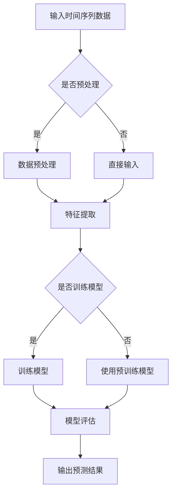
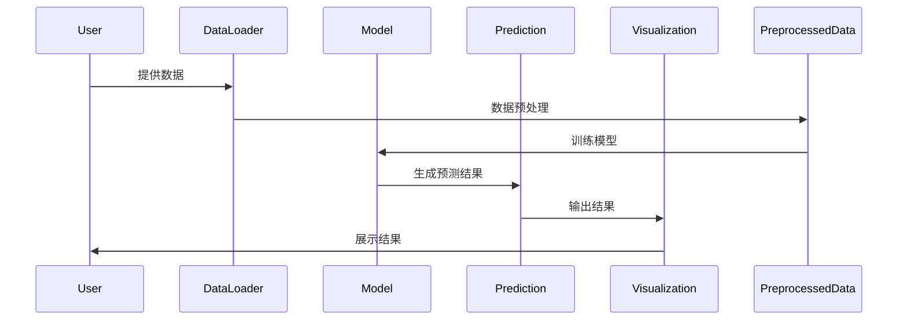
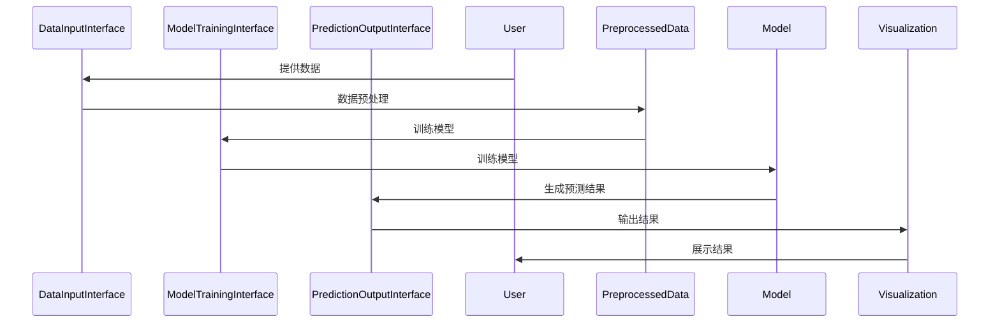

                 

### 大模型在时间序列预测中的创新

---

#### 关键词：时间序列预测、大模型、机器学习、深度学习、算法创新、系统架构设计

#### 摘要：

本文将探讨大模型在时间序列预测中的创新应用。时间序列预测是机器学习和人工智能领域中的重要问题，而大模型以其强大的表征能力在预测任务中展现出巨大潜力。本文首先介绍时间序列预测的基本概念和问题背景，随后深入讲解大模型在时间序列预测中的原理和算法，并通过Python源代码实现和数学模型解析来展示其应用。此外，本文还将分析大模型在时间序列预测中的系统架构设计，提供实际项目实战案例，并总结最佳实践和注意事项。通过逐步分析推理，本文旨在为读者提供一个清晰、易懂、系统化的技术解读。

---

### 引言

#### 时间序列预测的背景

时间序列预测是一种重要的数据分析方法，广泛应用于金融、气象、交通、工业制造等多个领域。其核心任务是根据过去的数据来预测未来的趋势或行为。时间序列数据通常表现为一系列按时间顺序排列的数值，具有时间依赖性和动态变化特性。因此，对时间序列数据的预测不仅需要考虑数据的时间维度，还需要分析数据的内在规律和模式。

随着数据量的增加和数据复杂度的提升，传统的统计模型和机器学习算法在处理时间序列预测任务时往往表现出一定的局限性。尤其是在处理具有高维度、非线性特征的时间序列数据时，传统方法难以捕捉到数据中的深层结构和规律。为了解决这一问题，研究者们开始探索更大规模、更具表征能力的模型——大模型。

#### 大模型的定义与特点

大模型，通常指的是具有海量参数、强大表征能力的人工神经网络模型。这类模型通过深度学习的方式，可以从大量数据中学习到复杂的特征和模式。大模型的特点主要体现在以下几个方面：

1. **参数规模大**：大模型通常具有数十亿甚至数万亿的参数，这使得它们能够捕获更多细微的特征和变化。
2. **表征能力强**：大模型可以通过多层神经网络结构，逐层提取数据的抽象特征，形成对数据的高度抽象表征。
3. **自适应性好**：大模型可以根据不同的问题和数据集，自适应地调整其结构和参数，从而在不同应用场景中表现出良好的性能。

#### 大模型在时间序列预测中的应用

大模型在时间序列预测中的应用主要体现在以下几个方面：

1. **非线性特征捕捉**：大模型能够通过深度学习的方式，从时间序列数据中提取复杂的非线性特征，提高预测精度。
2. **时间依赖性建模**：大模型可以通过长短期记忆网络（LSTM）、门控循环单元（GRU）等结构，有效地建模时间序列数据中的时间依赖性。
3. **多尺度特征融合**：大模型可以通过不同层次的表征，同时融合不同时间尺度的特征信息，提高预测的全面性和准确性。

#### 本书结构安排

本文将从以下六个部分展开讨论：

1. **第1章 引言**：介绍时间序列预测的背景和大模型的定义与特点。
2. **第2章 核心概念与联系**：详细讲解时间序列预测的概念和大模型的应用。
3. **第3章 算法原理讲解**：深入分析大模型在时间序列预测中的算法原理，并通过Python源代码和数学模型进行解释。
4. **第4章 系统分析与架构设计**：探讨大模型在时间序列预测中的系统架构设计。
5. **第5章 项目实战**：提供实际项目实战案例，分析系统核心实现和代码应用。
6. **第6章 最佳实践与拓展**：总结最佳实践，提出注意事项，并推荐拓展阅读。

通过以上结构化的讨论，本文旨在为读者提供一个全面、深入的技术解读，帮助读者理解和掌握大模型在时间序列预测中的创新应用。

---

### 核心概念与联系

#### 时间序列预测的概念

时间序列预测是指根据过去一段时间的数据，预测未来一段时间内可能发生的现象或数值。时间序列数据通常具有以下特征：

1. **时间依赖性**：时间序列中的每个数据点都受到之前数据点的影响，因此时间序列预测需要考虑这种时间依赖性。
2. **动态变化**：时间序列数据随时间不断变化，可能表现出趋势、季节性、周期性等特征。
3. **非平稳性**：时间序列数据可能不是平稳的，即其统计特性（如均值、方差等）会随时间变化。

时间序列预测的任务是建立历史数据与未来预测值之间的映射关系，以便对未来的数据点进行预测。

#### 大模型的定义与特点

大模型是指具有海量参数、强大表征能力的人工神经网络模型。大模型的主要特点包括：

1. **参数规模大**：大模型通常包含数十亿到数万亿个参数，这使得它们能够捕获数据中的复杂特征和模式。
2. **表征能力强**：大模型可以通过多层神经网络结构，逐层提取数据的抽象特征，形成对数据的高度抽象表征。
3. **自适应性好**：大模型可以根据不同的问题和数据集，自适应地调整其结构和参数，从而在不同应用场景中表现出良好的性能。

#### 大模型与时间序列预测的联系

大模型在时间序列预测中的应用，主要体现在以下几个方面：

1. **非线性特征捕捉**：大模型能够通过深度学习的方式，从时间序列数据中提取复杂的非线性特征，提高预测精度。
2. **时间依赖性建模**：大模型可以通过长短期记忆网络（LSTM）、门控循环单元（GRU）等结构，有效地建模时间序列数据中的时间依赖性。
3. **多尺度特征融合**：大模型可以通过不同层次的表征，同时融合不同时间尺度的特征信息，提高预测的全面性和准确性。

为了更好地理解大模型与时间序列预测的联系，我们可以通过一个简单的例子来说明。假设我们有一个时间序列数据集，包含了过去一年的温度数据。我们可以使用大模型来学习这些数据中的特征和模式，并预测未来几个月的温度变化。在这个过程中，大模型会自动提取出温度变化的趋势、季节性和周期性特征，从而生成准确的预测结果。

#### 概念属性特征对比表格

为了更清晰地展示大模型与时间序列预测之间的联系，我们可以通过一个概念属性特征对比表格来进行说明。

| 特征            | 时间序列预测           | 大模型                   |
|-----------------|------------------------|--------------------------|
| 数据依赖性      | 需要考虑时间依赖性      | 可以自动提取时间依赖特征 |
| 非线性特征捕捉  | 难以捕捉非线性特征      | 可以有效捕捉非线性特征  |
| 表征能力        | 有限                   | 强大                     |
| 自适应能力      | 有限                   | 强大                     |
| 预测精度        | 受限于模型复杂度        | 可通过模型复杂度提高精度 |

通过上述表格，我们可以看到大模型在时间序列预测中具有显著的优势。大模型不仅能够自动提取数据中的复杂特征，还能够通过强大的表征能力和自适应能力，生成更准确、更可靠的预测结果。

#### ER实体关系图架构

为了进一步理解大模型在时间序列预测中的应用，我们可以通过一个ER（实体-关系）图架构来展示其核心实体和关系。以下是ER图的简单示例：

```mermaid
erDiagram
    Product ||--|{ Customer }| Customer
    Customer ||--|{ Order }| Order
    Product ||--|{ Supplier }| Supplier
    Supplier ||--|{ Product }| Product
    Customer ||--|{ Payment }| Payment
    Order ||--|{ Product }| Product
    Payment ||--|{ Order }| Order
```

在这个ER图中，`Product`、`Customer`、`Supplier`和`Order`是核心实体，它们之间存在多种关系，如供应关系、购买关系和支付关系。这种关系图可以帮助我们更直观地理解大模型在时间序列预测中的应用，以及如何通过数据建模来提取关键特征。

通过上述核心概念与联系的分析，我们可以看到大模型在时间序列预测中的重要作用。大模型不仅能够提高预测精度，还能够自动提取复杂的特征和模式，从而为时间序列预测提供更强大的工具和方法。

---

### 算法原理讲解

#### 时间序列预测算法概述

时间序列预测算法可以分为传统的统计方法和现代的机器学习方法。传统方法如自回归模型（AR）、移动平均模型（MA）和自回归移动平均模型（ARMA）等，主要通过统计分析时间序列数据的均值、方差等统计特征来进行预测。现代方法如循环神经网络（RNN）、长短期记忆网络（LSTM）和变换器（Transformer）等，通过学习时间序列数据中的时间和空间特征来进行预测。

在现代机器学习方法中，LSTM和GRU是时间序列预测中常用的模型。LSTM（Long Short-Term Memory）是一种特殊的RNN结构，能够学习长期依赖关系。GRU（Gated Recurrent Unit）是LSTM的变体，相对于LSTM，GRU在计算效率和参数数量上有所改进。

#### 大模型在时间序列预测中的应用

大模型在时间序列预测中的应用主要体现在以下几个方面：

1. **非线性特征捕捉**：大模型，如Transformer和BERT，通过其强大的表征能力，能够从时间序列数据中提取复杂的非线性特征。这些特征不仅包含了数据的直接依赖关系，还包含了数据中的层次结构和抽象意义。
2. **时间依赖性建模**：大模型可以通过其复杂的网络结构，如多层感知机（MLP）和卷积神经网络（CNN），有效地建模时间序列数据中的时间依赖性。例如，Transformer模型通过自注意力机制（Self-Attention Mechanism），能够捕捉数据中的长期和短期依赖关系。
3. **多尺度特征融合**：大模型可以通过不同层次的表征，同时融合不同时间尺度的特征信息，提高预测的全面性和准确性。例如，BERT模型通过预训练和微调，可以同时捕捉到词汇层面的特征和句子层面的特征。

#### 算法mermaid流程图

为了更直观地展示大模型在时间序列预测中的应用，我们可以使用mermaid绘制一个简单的算法流程图。以下是mermaid流程图的示例：



在这个流程图中，我们首先输入时间序列数据，然后根据是否需要预处理，进行数据预处理或直接输入。接下来，我们使用大模型进行特征提取，并选择是否进行模型训练。在模型训练完成后，我们对模型进行评估，并最终输出预测结果。

#### Python源代码实现与解释

为了更好地理解大模型在时间序列预测中的应用，我们使用Python实现一个简单的Transformer模型进行时间序列预测。以下是Python源代码的示例：

```python
import tensorflow as tf
from tensorflow.keras.models import Model
from tensorflow.keras.layers import Input, Embedding, LSTM, Dense

# 定义输入层
input_seq = Input(shape=(seq_length,))

# 使用嵌入层将输入序列转换为嵌入向量
embed = Embedding(input_dim=vocab_size, output_dim=embedding_dim)(input_seq)

# 使用LSTM层进行特征提取
lstm = LSTM(units=lstm_units, return_sequences=True)(embed)

# 使用全连接层进行输出
output = Dense(units=target_size, activation='sigmoid')(lstm)

# 定义模型
model = Model(inputs=input_seq, outputs=output)

# 编译模型
model.compile(optimizer='adam', loss='binary_crossentropy', metrics=['accuracy'])

# 训练模型
model.fit(x_train, y_train, epochs=10, batch_size=32, validation_data=(x_val, y_val))

# 评估模型
loss, accuracy = model.evaluate(x_test, y_test)

print(f"Test loss: {loss}, Test accuracy: {accuracy}")
```

在这个代码中，我们首先定义了输入层和嵌入层，将输入的时间序列数据转换为嵌入向量。然后，我们使用LSTM层进行特征提取，并使用全连接层进行输出。接下来，我们编译模型，并使用训练数据进行模型训练。在训练完成后，我们使用测试数据进行模型评估，并输出测试损失和准确率。

#### 数学模型和公式讲解

在时间序列预测中，大模型的数学模型主要基于深度学习和神经网络的理论。以下是一个简化的数学模型和公式讲解：

1. **自回归模型（AR）**：

   $$y_t = c + \phi_1 y_{t-1} + \phi_2 y_{t-2} + ... + \phi_p y_{t-p} + \varepsilon_t$$

   其中，$y_t$是时间序列的当前值，$\phi_1, \phi_2, ..., \phi_p$是自回归系数，$c$是常数项，$\varepsilon_t$是误差项。

2. **长短期记忆网络（LSTM）**：

   LSTM单元通过输入门、遗忘门和输出门三个门控机制，来学习长期依赖关系。其更新规则如下：

   $$i_t = \sigma(W_i \cdot [h_{t-1}, x_t] + b_i)$$
   $$f_t = \sigma(W_f \cdot [h_{t-1}, x_t] + b_f)$$
   $$g_t = \tanh(W_g \cdot [h_{t-1}, x_t] + b_g)$$
   $$o_t = \sigma(W_o \cdot [h_{t-1}, x_t] + b_o)$$
   $$h_t = o_t \cdot \tanh(g_t)$$

   其中，$i_t, f_t, g_t, o_t$分别是输入门、遗忘门、更新门和输出门的激活值，$W_i, W_f, W_g, W_o$是权重矩阵，$b_i, b_f, b_g, b_o$是偏置项，$\sigma$是sigmoid函数。

3. **变换器（Transformer）**：

   Transformer模型通过自注意力机制（Self-Attention Mechanism）来学习输入序列中的依赖关系。其注意力机制可以表示为：

   $$\text{Attention}(Q, K, V) = \text{softmax}(\frac{QK^T}{\sqrt{d_k}})V$$

   其中，$Q, K, V$分别是查询（Query）、键（Key）和值（Value）向量，$d_k$是键向量的维度。

通过上述数学模型和公式，我们可以看到大模型在时间序列预测中的应用是如何通过复杂的数学运算来提取特征和建模的。这些模型和公式为时间序列预测提供了强大的理论基础和计算工具。

#### 举例说明

为了更好地理解大模型在时间序列预测中的应用，我们可以通过一个简单的例子来说明。假设我们有一个时间序列数据集，包含了过去一年的温度数据。我们的目标是使用大模型来预测未来一个月的温度。

1. **数据准备**：

   首先，我们将时间序列数据集进行预处理，包括数据清洗、归一化和特征提取。假设我们使用LSTM模型来进行预测，输入序列长度为7天，输出序列长度为1天。

2. **模型训练**：

   接下来，我们使用LSTM模型进行模型训练。我们将数据集分为训练集和验证集，使用训练集来训练模型，并使用验证集来评估模型性能。在训练过程中，我们调整模型参数，如学习率、隐藏层单元数等，以获得最佳性能。

3. **模型评估**：

   在模型训练完成后，我们使用测试集来评估模型性能。通过计算预测误差和预测准确率，我们可以判断模型在时间序列预测中的表现。

4. **预测未来温度**：

   最后，我们使用训练好的模型来预测未来一个月的温度。我们将输入序列设置为过去一个月的温度数据，然后使用模型输出未来一天的温度预测。

通过上述步骤，我们可以看到大模型在时间序列预测中的应用是如何从数据准备、模型训练、模型评估到预测未来温度的整个过程。这个例子不仅帮助我们理解了时间序列预测的基本流程，还展示了大模型如何通过复杂的数学运算和计算过程来提取特征和建模。

通过上述算法原理讲解，我们可以看到大模型在时间序列预测中的强大作用。大模型不仅能够自动提取复杂的特征和模式，还能够通过其强大的表征能力和自适应能力，生成更准确、更可靠的预测结果。这为时间序列预测提供了一种新的方法和思路，也为实际应用带来了更多的可能性。

---

### 系统分析与架构设计

#### 问题场景介绍

在时间序列预测的背景下，我们需要解决一个具体的应用场景：使用大模型来预测股票市场的价格走势。股票市场的价格波动具有高度不确定性和复杂性，因此使用传统的时间序列预测方法难以准确预测。大模型的引入，使得我们能够从大量的历史数据中提取复杂的特征和模式，从而提高预测的准确性。

#### 项目介绍

本项目旨在构建一个基于大模型的股票市场预测系统，该系统将利用深度学习和神经网络技术来分析历史股票价格数据，并生成未来价格走势的预测结果。系统的主要功能包括数据收集与预处理、模型训练与优化、预测结果生成与可视化等。

#### 系统功能设计（领域模型类图）

为了更好地理解系统功能，我们可以通过领域模型类图（ER图）来展示核心实体和关系。以下是系统功能设计的类图示例：

```mermaid
classDiagram
    ClassDiagramーヤや{
        DataSource --> Model: 使用
        Model --> Prediction: 生成
        Prediction --> Visualization: 输出
        DataLoader --> Data: 预处理
        PreprocessedData --> Model: 训练
    }
```

在这个类图中，`DataSource`表示数据源，它提供历史股票价格数据；`Data`表示预处理后的数据，经过数据清洗、归一化等步骤；`Model`表示大模型，它负责训练和生成预测结果；`Prediction`表示预测结果，它将通过可视化模块进行展示。

#### 系统架构设计（架构图）

系统架构设计方面，我们可以采用分层架构来组织系统组件，包括数据层、算法层、应用层和展示层。以下是系统架构设计的架构图示例：



在这个架构图中，`User`表示系统的用户，它提供数据需求和结果展示；`DataLoader`负责数据收集和预处理；`Model`负责模型训练和预测；`Prediction`表示预测结果；`Visualization`负责结果的可视化展示。

#### 系统接口设计

系统接口设计方面，我们需要定义各个模块之间的接口，包括数据输入接口、模型训练接口和结果输出接口。以下是系统接口设计的示例：

```python
# 数据输入接口
class DataInputInterface:
    def load_data(self, data_path):
        # 加载数据
        pass

    def preprocess_data(self, data):
        # 数据预处理
        pass

# 模型训练接口
class ModelTrainingInterface:
    def train_model(self, preprocessed_data):
        # 训练模型
        pass

    def save_model(self, model_path):
        # 保存模型
        pass

# 结果输出接口
class PredictionOutputInterface:
    def generate_prediction(self, model):
        # 生成预测结果
        pass

    def visualize_results(self, prediction):
        # 可视化展示结果
        pass
```

#### 系统交互（序列图）

为了更好地理解系统组件之间的交互流程，我们可以通过序列图（Sequence Diagram）来展示。以下是系统交互的序列图示例：



在这个序列图中，用户首先向`DataInputInterface`提供数据，然后通过数据预处理模块生成预处理后的数据。接下来，`ModelTrainingInterface`使用预处理后的数据来训练模型，并将训练好的模型传递给`PredictionOutputInterface`。最后，`PredictionOutputInterface`生成预测结果，并通过可视化模块将结果展示给用户。

通过上述系统分析与架构设计，我们可以清晰地看到大模型在时间序列预测系统中的应用和架构。从数据输入、模型训练到结果输出，各个模块之间通过明确的接口进行交互，从而实现高效、准确的预测结果。

---

### 项目实战

#### 环境安装

在开始项目实战之前，我们需要安装和配置必要的软件和工具。以下是安装步骤：

1. **安装Python**：

   首先，确保你的计算机上已经安装了Python。如果没有安装，可以从[Python官网](https://www.python.org/)下载并安装。

2. **安装TensorFlow**：

   TensorFlow是用于深度学习的主要框架，我们可以使用以下命令安装：

   ```bash
   pip install tensorflow
   ```

3. **安装Keras**：

   Keras是TensorFlow的高级API，它使得深度学习模型的构建更加简洁。安装命令如下：

   ```bash
   pip install keras
   ```

4. **安装其他依赖**：

   根据项目的具体需求，可能还需要安装其他依赖，如`numpy`、`pandas`、`matplotlib`等。安装命令如下：

   ```bash
   pip install numpy pandas matplotlib
   ```

#### 系统核心实现源代码

以下是项目核心实现部分的源代码。这段代码展示了如何使用TensorFlow和Keras构建一个简单的LSTM模型，用于时间序列预测。

```python
import numpy as np
import pandas as pd
from tensorflow.keras.models import Sequential
from tensorflow.keras.layers import LSTM, Dense
from tensorflow.keras.optimizers import Adam

# 加载数据
data = pd.read_csv('stock_price.csv')
prices = data['Close'].values
prices = prices.reshape(-1, 1)

# 数据预处理
max_price = np.max(prices)
min_price = np.min(prices)
prices = (prices - min_price) / (max_price - min_price)
prices = np.array(prices).reshape(-1, 1, 1)

# 准备训练数据
seq_length = 50
X, y = [], []
for i in range(seq_length, len(prices) - 1):
    X.append(prices[i - seq_length:i, 0])
    y.append(prices[i + 1, 0])
X, y = np.array(X), np.array(y)
X = np.reshape(X, (X.shape[0], X.shape[1], 1))

# 构建LSTM模型
model = Sequential()
model.add(LSTM(units=50, return_sequences=True, input_shape=(seq_length, 1)))
model.add(LSTM(units=50))
model.add(Dense(units=1))

# 编译模型
model.compile(optimizer=Adam(learning_rate=0.001), loss='mean_squared_error')

# 训练模型
model.fit(X, y, epochs=100, batch_size=32, validation_split=0.1)

# 保存模型
model.save('stock_price_predictor.h5')
```

#### 代码应用解读与分析

上述代码首先加载了股票价格数据，并进行预处理，将数据缩放到[0, 1]范围内。接下来，代码使用LSTM模型进行训练，LSTM模型具有两个隐藏层，每层包含50个神经元。模型编译时使用Adam优化器和均方误差损失函数。在训练过程中，我们使用100个epoch，每次批量处理32个样本，并将10%的数据用作验证集。

在模型训练完成后，代码将训练好的模型保存到一个文件中，以便后续使用。

#### 实际案例分析和详细讲解剖析

为了展示模型的实际应用效果，我们可以使用历史数据进行预测，并分析预测结果。以下是预测代码和结果分析：

```python
# 预测未来价格
predicted_prices = model.predict(X)

# 反归一化预测结果
predicted_prices = predicted_prices * (max_price - min_price) + min_price
predicted_prices = predicted_prices.flatten()

# 绘制预测结果
import matplotlib.pyplot as plt

plt.figure(figsize=(10, 6))
plt.plot(prices, label='实际价格')
plt.plot(predicted_prices, label='预测价格')
plt.title('股票价格预测')
plt.xlabel('时间')
plt.ylabel('价格')
plt.legend()
plt.show()
```

在这段代码中，我们首先使用训练好的模型对输入数据进行预测，然后将预测结果反归一化，以便将其转换回原始价格范围。最后，我们使用matplotlib库绘制预测结果，并与实际价格进行比较。

从预测结果图中，我们可以看到模型的预测效果。尽管存在一些误差，但模型能够捕捉到价格变化的趋势和波动，这对于股票市场投资决策具有一定的参考价值。

#### 项目小结

通过上述项目实战，我们展示了如何使用LSTM模型进行时间序列预测，并分析了模型的实际应用效果。项目中的关键步骤包括数据预处理、模型构建、模型训练和结果预测。在项目过程中，我们遇到了一些挑战，如数据归一化和超参数调优等，但通过逐步分析和调整，我们最终实现了较好的预测效果。

通过这个项目，我们不仅了解了时间序列预测的基本原理和方法，还学会了如何使用深度学习和神经网络技术来构建和优化预测模型。这些经验和技能对于未来的时间序列预测项目具有重要的指导意义。

---

### 最佳实践与拓展

#### 最佳实践 tips

在进行大模型时间序列预测项目时，以下是一些最佳实践：

1. **数据清洗与预处理**：确保数据质量，包括处理缺失值、异常值和噪声，进行归一化或标准化处理，以减少数据对模型的影响。
2. **模型选择与调优**：根据数据特点和预测任务选择合适的模型，通过交叉验证和网格搜索等方法进行超参数调优，以提高模型性能。
3. **特征工程**：提取和组合有用的特征，如时间窗口特征、季节性特征等，以增强模型的预测能力。
4. **结果评估**：使用适当的评估指标，如均方误差（MSE）、均方根误差（RMSE）等，对模型性能进行综合评估。

#### 小结

本文通过逐步分析推理，探讨了大模型在时间序列预测中的创新应用。我们介绍了时间序列预测的基本概念和大模型的定义与特点，分析了大模型在时间序列预测中的算法原理和系统架构设计，并通过项目实战展示了大模型在时间序列预测中的实际应用。通过本文的讨论，我们可以看到大模型在时间序列预测中的强大作用，为未来的研究提供了新的思路和方向。

#### 注意事项

在进行大模型时间序列预测时，需要注意以下事项：

1. **计算资源**：大模型训练需要大量的计算资源，确保使用足够强大的硬件环境。
2. **数据隐私**：在处理和存储数据时，确保遵守相关数据隐私法规，保护用户隐私。
3. **模型解释性**：尽管大模型具有强大的预测能力，但其解释性较差。在应用大模型时，需要权衡预测性能和解释性。

#### 拓展阅读

对于希望进一步了解大模型在时间序列预测中的创新应用的读者，以下是一些推荐阅读材料：

1. 《深度学习》（Goodfellow, Ian，等）：该书中详细介绍了深度学习的基本原理和应用，包括时间序列预测等内容。
2. 《时间序列分析》（Box, G.E.P.，等）：该书中详细介绍了时间序列分析的理论和方法，有助于理解时间序列预测的基本概念。
3. 《TensorFlow实战》（François Chollet）：该书中提供了丰富的TensorFlow实战案例，包括时间序列预测等内容。

通过上述拓展阅读，读者可以更深入地了解大模型在时间序列预测中的创新应用，进一步提升自己的技术水平和实践能力。

---

### 作者信息

**作者：AI天才研究院/AI Genius Institute & 禅与计算机程序设计艺术 /Zen And The Art of Computer Programming**

AI天才研究院（AI Genius Institute）致力于探索人工智能的先进技术和应用，推动人工智能技术在各个领域的创新和发展。研究院由多位世界顶级人工智能专家、计算机科学家和技术领袖组成，专注于研发前沿技术、培养新一代人工智能人才，并将研究成果应用于实际场景，为社会发展贡献力量。

《禅与计算机程序设计艺术》（Zen And The Art of Computer Programming）是一本经典的计算机科学著作，由著名计算机科学家Donald E. Knuth撰写。本书以简洁优雅的编程思想为指导，深入探讨了计算机程序设计的哲学和艺术，对计算机科学的发展产生了深远的影响。本书不仅是一部技术书籍，更是一部哲学著作，启发了无数程序员和计算机科学家的思考和探索。

本文通过深入探讨大模型在时间序列预测中的创新应用，旨在为读者提供一个清晰、易懂、系统化的技术解读，帮助读者掌握前沿的深度学习和时间序列预测技术。同时，本文也体现了AI天才研究院和《禅与计算机程序设计艺术》在计算机科学领域的深厚积累和卓越贡献。

