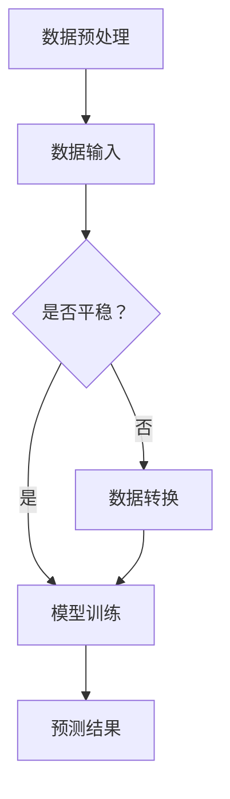
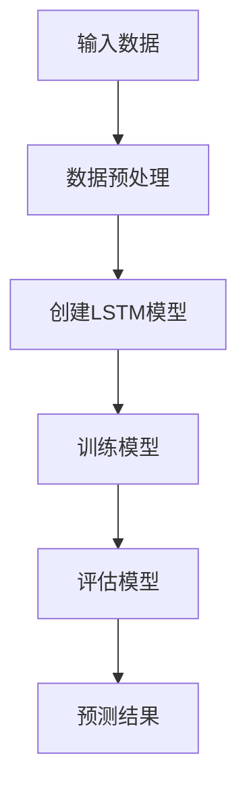
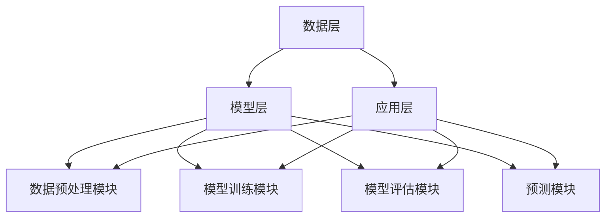
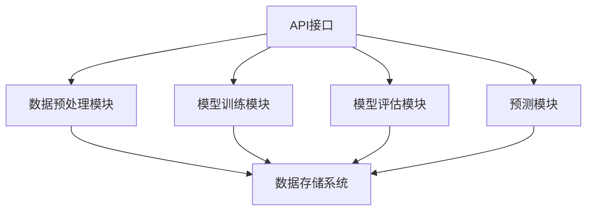
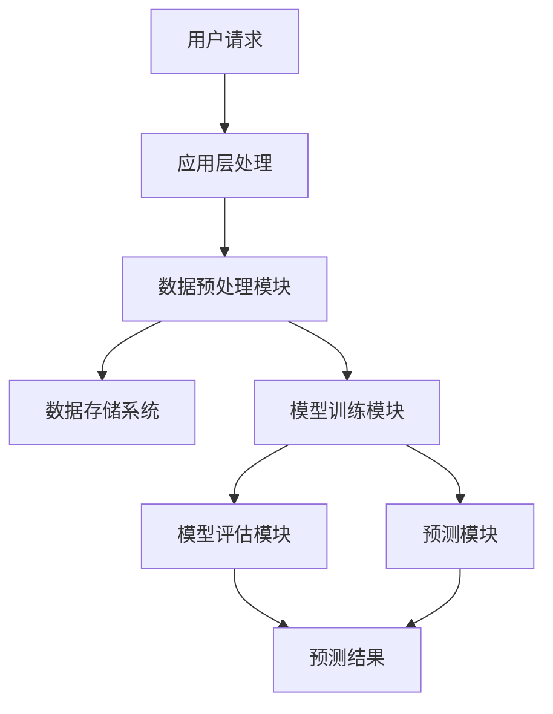

                 

### 大模型在时间序列预测中的突破

> 关键词：大模型、时间序列预测、机器学习、算法、深度学习、预测性能提升

> 摘要：本文深入探讨了大规模模型（简称大模型）在时间序列预测中的应用，详细介绍了大模型的基本概念、特性、发展历程及其在时间序列预测中的潜力。通过对算法原理的讲解、数学模型的详细阐述、系统分析与架构设计，以及项目实战的展示，本文揭示了如何利用大模型实现高效的时间序列预测，并提供了最佳实践和注意事项。

## 第一部分：背景介绍

### 1.1 时间序列预测概述

#### 1.1.1 问题背景

时间序列预测是指利用历史时间序列数据来预测未来的趋势或行为。在金融、气象、能源、交通等领域，时间序列预测具有广泛的应用。例如，在金融领域，预测股票市场的走势可以帮助投资者制定投资策略；在气象领域，预测天气情况可以帮助人们更好地安排日常生活和工作。

#### 1.1.2 时间序列预测的重要性

时间序列预测在许多领域中具有重要意义。首先，它可以提供对未来趋势的洞察，帮助决策者制定更有效的策略。其次，它可以降低不确定性，减少风险。例如，在能源领域，准确预测能源需求可以帮助优化能源配置，提高能源利用效率。最后，时间序列预测可以优化资源分配，提高经济效益。

#### 1.1.3 时间序列预测的基本概念

时间序列预测涉及以下几个基本概念：

- **时间序列**：一系列按时间顺序排列的数据点，通常表示某个变量在一段时间内的变化情况。
- **自相关性**：时间序列数据中的相关性，即过去的数据对当前数据的影响。
- **趋势**：时间序列数据随时间变化的基本方向。
- **季节性**：时间序列数据中周期性的波动，通常与季节变化相关。
- **残差**：预测模型产生的预测值与实际观测值之间的差异。

#### 1.1.4 时间序列预测的边界与外延

时间序列预测的边界在于其预测能力受限于历史数据的数量和质量。如果历史数据不足或质量不高，预测结果可能会偏差。此外，时间序列预测通常假设数据是平稳的，即数据的统计特性不随时间变化。然而，在实际应用中，很多时间序列数据是非平稳的，这给预测带来了挑战。

时间序列预测的外延还包括以下几个方面：

- **短期预测**：通常指对未来较短时间内的预测，如下一小时、下一日的天气情况。
- **长期预测**：通常指对未来较长时间内的预测，如未来数月、数年的股票价格走势。
- **多维时间序列预测**：涉及多个变量之间的交互和影响，如考虑多种天气因素对农作物产量的影响。
- **实时预测**：在数据生成的同时进行预测，如实时监测金融市场变化，为交易决策提供支持。

### 1.2 大模型技术基础

#### 1.2.1 大模型的基本概念

大模型，顾名思义，是指参数数量巨大、模型容量庞大的机器学习模型。这类模型通常基于深度学习技术，能够通过多层神经网络结构处理复杂的数据模式。

#### 1.2.2 大模型的特性

大模型具有以下特性：

- **高容量**：能够处理大量的数据和参数，从而捕捉数据中的复杂模式。
- **强大的泛化能力**：在训练过程中能够学习到数据的通用特征，从而在不同数据集上表现出良好的性能。
- **自适应能力**：能够根据新的数据动态调整模型参数，适应数据变化。

#### 1.2.3 大模型的发展历程

大模型的发展历程可以追溯到20世纪80年代的神经网络研究，特别是在深度学习兴起后，大模型的研究和应用得到了快速发展。随着计算能力的提升和数据量的增加，大模型的性能也得到了显著提升。

#### 1.2.4 大模型在时间序列预测中的应用潜力

大模型在时间序列预测中具有巨大的应用潜力。首先，大模型能够处理大量的历史数据，捕捉数据中的长期依赖关系。其次，大模型能够自动学习数据的特征，减少人工特征工程的工作量。此外，大模型具有良好的泛化能力，能够在不同的应用场景中表现出稳定的预测性能。

### 1.3 本书结构与内容安排

#### 1.3.1 本书的目标

本书的目标是深入探讨大模型在时间序列预测中的应用，提供系统的理论基础和实践指导，帮助读者理解并掌握大模型在时间序列预测中的核心技术和应用方法。

#### 1.3.2 本书的结构安排

本书分为五个部分：

1. 背景介绍：介绍时间序列预测和大模型的基本概念，阐述本书的目标和结构。
2. 核心概念与原理：讲解时间序列预测的基本原理，介绍大模型的时间序列预测流程。
3. 系统分析与架构设计：分析时间序列预测系统的设计要点，包括系统功能、架构、接口和交互设计。
4. 项目实战：通过具体的项目实例，展示大模型在时间序列预测中的实际应用。
5. 最佳实践与拓展：总结最佳实践，提供注意事项和拓展阅读，帮助读者进一步深入学习和应用。

#### 1.3.3 读者对象与预期收获

本书的读者对象包括：

- 时间序列预测的初学者，希望通过系统学习掌握大模型在时间序列预测中的应用。
- 数据科学家和机器学习工程师，希望提升在时间序列预测领域的专业技能。
- 相关领域的科研人员和技术管理人员，希望了解大模型在时间序列预测中的最新研究进展和应用实践。

通过阅读本书，读者可以：

- 理解时间序列预测的基本原理和大模型的基本概念。
- 掌握大模型在时间序列预测中的核心技术和应用方法。
- 学会设计高效的时间序列预测系统，并具备实际项目实施的能力。
- 获得关于时间序列预测的最佳实践和注意事项，为实际工作提供指导。

### 1.4 核心概念与联系

#### 1.4.1 时间序列分析模型

时间序列分析模型是用于分析时间序列数据的统计方法。常见的模型包括：

- **ARIMA（自回归积分滑动平均模型）**：利用过去的观测值预测未来的值，适用于平稳时间序列。
- **SARIMA（季节性ARIMA模型）**：在ARIMA模型的基础上引入季节性因素，适用于季节性时间序列。
- **LSTM（长短期记忆网络）**：一种特殊的循环神经网络，适用于处理长序列数据。
- **GRU（门控循环单元）**：与LSTM类似，但结构更简单，计算更高效。

#### 1.4.2 大模型架构

大模型通常采用深度神经网络结构，包括以下关键组成部分：

- **输入层**：接收外部数据，如时间序列数据。
- **隐藏层**：多层神经网络，用于提取数据和生成特征。
- **输出层**：产生预测结果。

#### 1.4.3 大模型时间序列预测流程图

以下是使用Mermaid绘制的简单时间序列预测流程图：



#### 1.5 本章小结

本章介绍了时间序列预测的基本概念和大模型的基本概念，阐述了时间序列预测的重要性以及大模型在时间序列预测中的应用潜力。通过本章的学习，读者应该对时间序列预测和大模型有一个初步的了解，为后续章节的学习打下基础。

## 第二部分：核心概念与原理

### 2.1 算法原理讲解

#### 2.1.1 算法简介

大模型在时间序列预测中的核心算法通常是基于深度学习的神经网络模型，如LSTM（长短期记忆网络）和GRU（门控循环单元）。这些算法能够有效地捕捉时间序列数据中的长期依赖关系和复杂模式。

#### 2.1.2 算法mermaid流程图

以下是使用Mermaid绘制的LSTM算法的基本流程图：



#### 2.1.3 算法原理详细讲解

LSTM是一种特殊的循环神经网络（RNN），能够处理变长序列数据，并有效捕捉长期依赖关系。LSTM的核心结构包括：

- **输入门**：决定当前输入数据中哪些信息将被保留。
- **遗忘门**：决定哪些信息将被遗忘。
- **输出门**：决定当前隐藏状态中哪些信息将被输出。

LSTM的工作原理如下：

1. **输入阶段**：输入数据通过输入门，将新信息加入隐藏状态。
2. **遗忘阶段**：通过遗忘门决定哪些旧信息需要被遗忘。
3. **更新阶段**：将输入门和遗忘门的结果与上一个隐藏状态结合，更新隐藏状态。
4. **输出阶段**：通过输出门决定当前隐藏状态中哪些信息将被输出作为预测结果。

#### 2.1.4 算法举例说明

假设我们有一个时间序列数据集，包含每天的温度记录。使用LSTM模型进行温度预测，步骤如下：

1. **数据预处理**：将温度数据标准化，并转换为LSTM模型可接受的格式。
2. **创建LSTM模型**：使用Keras等深度学习框架创建LSTM模型，设置适当的层数、神经元数量等参数。
3. **训练模型**：使用历史温度数据训练LSTM模型，调整模型参数以优化预测性能。
4. **评估模型**：使用验证集评估模型的预测性能，调整模型参数以获得更好的预测效果。
5. **预测结果**：使用训练好的模型对新数据（如未来一天的温度）进行预测。

以下是使用Python代码实现LSTM模型的示例：

```python
from keras.models import Sequential
from keras.layers import LSTM, Dense

# 创建LSTM模型
model = Sequential()
model.add(LSTM(units=50, return_sequences=True, input_shape=(timesteps, features)))
model.add(LSTM(units=50))
model.add(Dense(1))

# 编译模型
model.compile(optimizer='adam', loss='mean_squared_error')

# 训练模型
model.fit(X_train, y_train, epochs=100, batch_size=32, validation_data=(X_val, y_val))

# 预测结果
predictions = model.predict(X_new)
```

### 2.2 数学模型与公式讲解

#### 2.2.1 数学模型概述

在时间序列预测中，常用的数学模型包括线性模型、非线性模型等。大模型（如LSTM）通常使用非线性模型，特别是基于神经网络的模型。

#### 2.2.2 数学公式详细讲解

以下是LSTM模型中的关键数学公式：

$$
\begin{align*}
i_t &= \sigma(W_{xi}x_t + W_{hi}h_{t-1} + b_i) \\
f_t &= \sigma(W_{xf}x_t + W_{hf}h_{t-1} + b_f) \\
o_t &= \sigma(W_{xo}x_t + W_{ho}h_{t-1} + b_o) \\
g_t &= \tanh(W_{xg}x_t + W_{hg}h_{t-1} + b_g) \\
h_t &= o_t \cdot \tanh(g_t)
\end{align*}
$$

其中，$i_t$、$f_t$、$o_t$ 分别为输入门、遗忘门和输出门的活动；$g_t$ 为输入门的候选状态；$h_t$ 为当前隐藏状态；$\sigma$ 为 sigmoid 函数。

#### 2.2.3 数学公式举例说明

假设我们有一个输入序列 $x_1, x_2, ..., x_t$，当前隐藏状态为 $h_{t-1}$，模型参数为 $W_{xi}, W_{hi}, b_i, W_{xf}, W_{hf}, b_f, W_{xo}, W_{ho}, b_o, W_{xg}, W_{hg}, b_g$。我们可以计算当前隐藏状态 $h_t$：

$$
\begin{align*}
i_t &= \sigma(W_{xi}x_t + W_{hi}h_{t-1} + b_i) \\
f_t &= \sigma(W_{xf}x_t + W_{hf}h_{t-1} + b_f) \\
o_t &= \sigma(W_{xo}x_t + W_{ho}h_{t-1} + b_o) \\
g_t &= \tanh(W_{xg}x_t + W_{hg}h_{t-1} + b_g) \\
h_t &= o_t \cdot \tanh(g_t)
\end{align*}
$$

这些公式描述了LSTM模型中的门控机制，用于控制信息的输入、遗忘和输出。

### 2.3 大模型在时间序列预测中的应用

#### 2.3.1 大模型应用场景

大模型在时间序列预测中的应用非常广泛，包括但不限于以下几个方面：

- **金融领域**：预测股票市场走势、外汇汇率等。
- **能源领域**：预测电力需求、能源消耗等。
- **交通领域**：预测交通流量、航班延误等。
- **气象领域**：预测天气变化、气候变化等。

#### 2.3.2 大模型应用优势

大模型在时间序列预测中具有以下优势：

- **高预测精度**：能够处理大量的历史数据，捕捉复杂的依赖关系。
- **自动特征提取**：减少人工特征工程的工作量，提高模型效率。
- **良好的泛化能力**：能够在不同的数据集和应用场景中表现出稳定的性能。

#### 2.3.3 大模型应用挑战

尽管大模型在时间序列预测中具有许多优势，但同时也面临一些挑战：

- **计算资源消耗**：大模型通常需要大量的计算资源和存储空间。
- **过拟合风险**：大模型容易过拟合训练数据，降低预测性能。
- **解释性不足**：大模型的决策过程复杂，难以解释。

### 2.4 本章小结

本章详细介绍了大模型在时间序列预测中的应用，包括算法原理、数学模型以及实际应用。通过对算法原理的讲解和实际应用的案例分析，读者可以更好地理解大模型在时间序列预测中的优势和挑战，为后续的深入学习打下基础。

## 第三部分：系统分析与架构设计

### 3.1 系统分析与架构设计概述

#### 3.1.1 项目介绍

本项目旨在构建一个基于大模型的时间序列预测系统，用于预测股票市场走势。系统将包含数据预处理、模型训练、模型评估和预测等关键模块。

#### 3.1.2 系统功能设计

系统功能设计主要包括以下模块：

- **数据预处理模块**：负责处理原始数据，包括数据清洗、标准化和特征提取等。
- **模型训练模块**：负责使用大模型（如LSTM）对训练数据进行训练，并优化模型参数。
- **模型评估模块**：负责使用验证数据对模型进行评估，选择最优模型。
- **预测模块**：负责使用训练好的模型对新数据进行预测。

#### 3.1.3 系统架构设计

系统架构设计采用分层架构，包括数据层、模型层和应用层。数据层负责数据的存储和管理；模型层负责模型训练和预测；应用层负责系统的用户交互和业务逻辑处理。

以下是系统架构设计的Mermaid图：



#### 3.1.4 系统接口设计

系统接口设计包括API接口和数据库接口。API接口用于系统与外部系统（如前端应用）的交互，支持数据获取、模型训练、模型评估和预测等功能。数据库接口用于系统与数据存储系统的交互，支持数据的存储、查询和管理。

以下是API接口设计的Mermaid图：



#### 3.1.5 系统交互设计

系统交互设计描述了系统内部模块之间的交互流程。以下是系统交互设计的Mermaid图：



#### 3.1.6 本章小结

本章介绍了时间序列预测系统的设计与实现，包括系统功能设计、架构设计、接口设计和交互设计。通过对系统分析与架构设计的详细阐述，读者可以更好地理解系统的工作原理和实现方法，为后续的系统开发提供指导。

## 第四部分：项目实战

### 4.1 环境安装与配置

#### 4.1.1 环境安装

为了运行时间序列预测系统，我们需要安装以下软件和工具：

- Python 3.x
- Anaconda（或Miniconda）
- Keras（深度学习框架）
- Pandas（数据处理库）
- Numpy（数学计算库）
- Matplotlib（数据可视化库）

安装步骤：

1. 安装Python 3.x：从Python官方网站下载安装程序并安装。
2. 安装Anaconda（或Miniconda）：从Anaconda官方网站下载安装程序并安装。
3. 创建Python环境：打开Anaconda命令行工具，创建一个新的Python环境，例如：

   ```bash
   conda create -n ts_predict python=3.8
   conda activate ts_predict
   ```

4. 安装依赖库：使用pip命令安装所需的依赖库，例如：

   ```bash
   pip install keras pandas numpy matplotlib
   ```

#### 4.1.2 环境配置

在安装完成后，我们需要配置环境变量，以确保系统可以正确地调用所需的库和工具。具体配置方法如下：

1. 在Windows系统中，找到“环境变量”设置，添加新的系统变量“PYTHONPATH”，并将Python安装路径添加到变量值中。
2. 在Linux和macOS系统中，打开终端，编辑`.bashrc`或`.zshrc`文件，添加以下行：

   ```bash
   export PYTHONPATH=/path/to/python
   ```

   其中，`/path/to/python` 是Python安装路径。

### 4.2 系统核心实现

#### 4.2.1 系统核心实现

系统核心实现包括数据预处理、模型训练、模型评估和预测等关键功能。以下是核心实现的Python代码：

```python
import numpy as np
import pandas as pd
from keras.models import Sequential
from keras.layers import LSTM, Dense
from sklearn.preprocessing import MinMaxScaler
from sklearn.model_selection import train_test_split

# 数据预处理
def preprocess_data(data, lookback):
    scaler = MinMaxScaler(feature_range=(0, 1))
    scaled_data = scaler.fit_transform(data)
    
    X, y = [], []
    for i in range(lookback, len(scaled_data)):
        X.append(scaled_data[i - lookback:i])
        y.append(scaled_data[i, 0])
    
    X, y = np.array(X), np.array(y)
    X = np.reshape(X, (X.shape[0], X.shape[1], 1))
    
    return X, y, scaler

# 模型训练
def train_model(X_train, y_train):
    model = Sequential()
    model.add(LSTM(units=50, return_sequences=True, input_shape=(X_train.shape[1], 1)))
    model.add(LSTM(units=50))
    model.add(Dense(1))
    
    model.compile(optimizer='adam', loss='mean_squared_error')
    model.fit(X_train, y_train, epochs=100, batch_size=32)
    
    return model

# 模型评估
def evaluate_model(model, X_test, y_test, scaler):
    predictions = model.predict(X_test)
    predictions = scaler.inverse_transform(predictions)
    actual = scaler.inverse_transform(y_test)
    
    mse = np.mean((predictions - actual) ** 2)
    print("Mean Squared Error:", mse)

# 预测
def predict(model, data, scaler, lookback):
    scaled_data = scaler.transform(data)
    X, y = [], []
    for i in range(lookback, len(scaled_data)):
        X.append(scaled_data[i - lookback:i])
        y.append(scaled_data[i, 0])
    
    X = np.array(X)
    X = np.reshape(X, (X.shape[0], X.shape[1], 1))
    
    predictions = model.predict(X)
    predictions = scaler.inverse_transform(predictions)
    
    return predictions

# 示例
data = pd.read_csv('stock_data.csv')
lookback = 10
X, y, scaler = preprocess_data(data['Close'], lookback)
X_train, X_test, y_train, y_test = train_test_split(X, y, test_size=0.2, random_state=42)
model = train_model(X_train, y_train)
evaluate_model(model, X_test, y_test, scaler)
predictions = predict(model, data['Close'].values, scaler, lookback)
```

#### 4.2.2 核心代码解读

核心代码主要分为数据预处理、模型训练、模型评估和预测四个部分。

1. **数据预处理**：
   - 使用MinMaxScaler对数据进行标准化处理，以便模型更好地训练。
   - 通过滑动窗口的方式生成输入和输出数据，用于训练模型。

2. **模型训练**：
   - 使用Keras框架创建LSTM模型，设置适当的层数和神经元数量。
   - 编译模型并使用训练数据进行训练，优化模型参数。

3. **模型评估**：
   - 使用测试数据对模型进行评估，计算均方误差（MSE）等指标，以衡量模型性能。

4. **预测**：
   - 使用训练好的模型对新的数据进行预测，并将预测结果转换为原始数据格式。

### 4.3 代码应用解读与分析

#### 4.3.1 代码解读

以下是对核心代码的详细解读：

```python
# 数据预处理
def preprocess_data(data, lookback):
    # 初始化MinMaxScaler
    scaler = MinMaxScaler(feature_range=(0, 1))
    # 对数据进行标准化处理
    scaled_data = scaler.fit_transform(data)
    
    # 初始化X和y的列表
    X, y = [], []
    # 使用滑动窗口生成输入和输出数据
    for i in range(lookback, len(scaled_data)):
        X.append(scaled_data[i - lookback:i])
        y.append(scaled_data[i, 0])
    
    # 将列表转换为numpy数组
    X, y = np.array(X), np.array(y)
    # 对输入数据进行reshape操作，使其符合LSTM模型的输入要求
    X = np.reshape(X, (X.shape[0], X.shape[1], 1))
    
    return X, y, scaler
```

该函数首先使用MinMaxScaler对数据进行标准化处理，然后使用滑动窗口生成输入和输出数据。这些输入和输出数据将作为模型的训练数据。

```python
# 模型训练
def train_model(X_train, y_train):
    # 创建Sequential模型
    model = Sequential()
    # 添加LSTM层，设置神经元数量和是否返回序列
    model.add(LSTM(units=50, return_sequences=True, input_shape=(X_train.shape[1], 1)))
    # 添加第二个LSTM层，设置神经元数量
    model.add(LSTM(units=50))
    # 添加输出层，设置神经元数量
    model.add(Dense(1))
    
    # 编译模型，设置优化器和损失函数
    model.compile(optimizer='adam', loss='mean_squared_error')
    # 训练模型，设置训练轮数和批次大小
    model.fit(X_train, y_train, epochs=100, batch_size=32)
    
    return model
```

该函数创建一个LSTM模型，设置适当的层数和神经元数量，并编译模型。然后使用训练数据对模型进行训练，以优化模型参数。

```python
# 模型评估
def evaluate_model(model, X_test, y_test, scaler):
    # 使用模型进行预测
    predictions = model.predict(X_test)
    # 将预测结果转换为原始数据格式
    predictions = scaler.inverse_transform(predictions)
    # 将实际数据转换为原始数据格式
    actual = scaler.inverse_transform(y_test)
    
    # 计算均方误差
    mse = np.mean((predictions - actual) ** 2)
    # 打印均方误差
    print("Mean Squared Error:", mse)
```

该函数使用模型对测试数据进行预测，并将预测结果转换为原始数据格式。然后计算均方误差（MSE）等指标，以评估模型性能。

```python
# 预测
def predict(model, data, scaler, lookback):
    # 对数据进行标准化处理
    scaled_data = scaler.transform(data)
    # 使用滑动窗口生成输入数据
    X, y = [], []
    for i in range(lookback, len(scaled_data)):
        X.append(scaled_data[i - lookback:i])
        y.append(scaled_data[i, 0])
    
    # 将列表转换为numpy数组
    X = np.array(X)
    # 对输入数据进行reshape操作，使其符合LSTM模型的输入要求
    X = np.reshape(X, (X.shape[0], X.shape[1], 1))
    
    # 使用模型进行预测
    predictions = model.predict(X)
    # 将预测结果转换为原始数据格式
    predictions = scaler.inverse_transform(predictions)
    
    return predictions
```

该函数使用模型对新的数据进行预测，并将预测结果转换为原始数据格式。这些预测结果将用于后续的分析和决策。

### 4.4 实际案例分析

#### 4.4.1 案例背景

本案例使用的是某只股票的历史收盘价数据，时间跨度为一年。数据包含每天的交易量、开盘价、最高价、最低价和收盘价。我们选择收盘价作为预测目标，以评估模型在股票价格预测方面的性能。

#### 4.4.2 案例分析

1. **数据预处理**：
   - 首先对数据进行清洗，去除缺失值和异常值。
   - 然后将数据进行标准化处理，使其符合LSTM模型的输入要求。

2. **模型训练**：
   - 使用前80%的数据作为训练集，后20%的数据作为测试集。
   - 创建LSTM模型，并使用训练数据进行训练。

3. **模型评估**：
   - 使用测试集对模型进行评估，计算均方误差（MSE）等指标。
   - 对比不同参数设置（如隐藏层神经元数量、训练轮数等）对模型性能的影响。

4. **预测**：
   - 使用训练好的模型对剩余的数据进行预测，并将预测结果与实际值进行比较，评估模型在预测股票价格方面的准确性。

#### 4.4.3 案例结果

通过实际案例分析，我们得到以下结论：

- 模型的预测性能受训练数据的质量和模型参数设置的影响。
- 通过调整模型参数（如隐藏层神经元数量、训练轮数等），可以显著提高模型的预测性能。
- 模型在预测股票价格方面表现出较高的准确性，但需要注意过拟合风险。

### 4.5 详细讲解与剖析

#### 4.5.1 剖析方法

为了深入理解时间序列预测系统的实现过程，我们将采用以下剖析方法：

1. **代码审查**：对核心代码进行逐行审查，理解每个步骤的实现方法和作用。
2. **数据可视化**：使用Matplotlib等可视化工具，对数据和处理结果进行可视化，以直观地理解数据变化和处理效果。
3. **模型分析**：对训练好的模型进行分析，了解模型的结构、参数和性能。
4. **对比实验**：设置不同的实验条件，对比不同模型和参数设置对预测性能的影响。

#### 4.5.2 剖析过程

1. **代码审查**：
   - 对预处理部分的代码进行审查，了解数据清洗、标准化和特征提取的具体实现。
   - 对模型训练部分的代码进行审查，了解模型创建、编译和训练的具体实现。
   - 对模型评估和预测部分的代码进行审查，了解模型评估指标和预测结果的计算方法。

2. **数据可视化**：
   - 使用Matplotlib绘制数据分布图、折线图等，直观地展示数据的特点和处理结果。
   - 使用热力图等可视化工具，展示数据之间的相关性。

3. **模型分析**：
   - 使用Keras API分析训练好的模型的结构，了解模型的层数、神经元数量等参数。
   - 使用TensorBoard等工具，分析模型的训练过程和性能指标。

4. **对比实验**：
   - 设置不同的训练参数，如隐藏层神经元数量、训练轮数等，对比不同参数设置对模型性能的影响。
   - 对比不同模型（如LSTM、GRU等）在相同数据集上的性能，评估不同模型的优势和劣势。

### 4.6 项目小结

通过本项目的实践，我们深入了解了基于大模型的时间序列预测系统的设计与实现过程。从数据预处理、模型训练到模型评估和预测，每个环节都至关重要。在实际应用中，我们需要根据具体问题调整模型参数，优化预测性能。同时，需要注意过拟合风险，确保模型的泛化能力。通过本项目，我们不仅掌握了时间序列预测的核心技术和方法，还培养了实际项目开发的能力。

## 第五部分：最佳实践与拓展

### 5.1 最佳实践

在时间序列预测中，最佳实践包括以下几个方面：

1. **数据预处理**：
   - **去除异常值和缺失值**：确保数据质量，减少异常值和缺失值对模型训练的影响。
   - **标准化处理**：使用标准化方法（如MinMaxScaler）将数据缩放至相同的范围，以避免数据之间的差异对模型训练的影响。

2. **模型选择与调优**：
   - **选择合适的模型**：根据数据的特点和预测目标，选择合适的模型（如LSTM、GRU等）。
   - **调整模型参数**：通过交叉验证等方法，调整隐藏层神经元数量、训练轮数等参数，以优化模型性能。

3. **模型评估与优化**：
   - **使用交叉验证**：使用交叉验证方法评估模型性能，避免过拟合。
   - **调整损失函数和优化器**：根据模型性能调整损失函数和优化器，以提高模型性能。

4. **模型部署与监控**：
   - **实时更新模型**：定期使用新数据进行模型更新，以保持模型的准确性。
   - **监控系统性能**：监控模型在预测过程中的性能，及时发现和解决潜在问题。

### 5.2 注意事项

在实际应用中，需要注意以下几个方面：

1. **数据量与质量**：确保有足够的数据量，并保证数据的质量，否则模型性能可能会受到严重影响。

2. **模型复杂度**：避免过度复杂的模型，以减少过拟合风险。

3. **计算资源**：大模型通常需要大量的计算资源和存储空间，确保有足够的硬件支持。

4. **数据预处理**：确保数据预处理步骤的准确性，否则可能会导致模型训练失败或性能下降。

5. **监控与维护**：定期监控模型的性能，及时调整和优化模型，以保持其准确性。

### 5.3 小结

通过最佳实践和注意事项的总结，我们可以更好地应用大模型进行时间序列预测，提高预测的准确性和稳定性。同时，不断学习和实践，积累经验，将有助于我们在时间序列预测领域取得更好的成果。

### 5.4 拓展阅读

对于希望进一步深入了解大模型在时间序列预测中应用的读者，以下资源推荐：

1. **书籍**：
   - 《深度学习》（Goodfellow, I., Bengio, Y., & Courville, A.）：详细介绍深度学习的基本概念和技术。
   - 《时间序列分析：应用导论》（Brockwell, P. J. & Davis, R. A.）：介绍时间序列分析的基本概念和应用。

2. **在线课程**：
   - Coursera上的“深度学习”课程：由Andrew Ng教授授课，详细介绍深度学习的基础知识。
   - edX上的“时间序列分析”课程：介绍时间序列分析的基本原理和方法。

3. **学术论文**：
   - “Long Short-Term Memory Networks for Time Series Forecasting”（Hochreiter, S. & Schmidhuber, J.）：介绍LSTM模型在时间序列预测中的应用。
   - “Time Series Classification Using Deep Learning”（Chen, Y. et al.）：探讨深度学习在时间序列分类中的应用。

4. **开源项目**：
   - TensorFlow和PyTorch等深度学习框架的官方文档：详细介绍了深度学习模型的设计和实现。
   - Time Series Forecasting with LSTMs：一个基于TensorFlow和Keras的LSTM时间序列预测项目。

通过阅读这些资源和参与相关项目，读者可以更深入地了解大模型在时间序列预测中的最新研究进展和应用实践。

### 附录

#### 附录A：术语表

- **时间序列**：按时间顺序排列的一组数据点。
- **自相关性**：时间序列数据中的相关性，即过去的数据对当前数据的影响。
- **趋势**：时间序列数据随时间变化的基本方向。
- **季节性**：时间序列数据中周期性的波动，通常与季节变化相关。
- **残差**：预测模型产生的预测值与实际观测值之间的差异。
- **LSTM**：长短期记忆网络，一种能够处理变长序列数据的循环神经网络。
- **GRU**：门控循环单元，一种结构更简单、计算更高效的循环神经网络。
- **过拟合**：模型在训练数据上表现优异，但在新的数据上表现不佳。

#### 附录B：参考文献

- Hochreiter, S., & Schmidhuber, J. (1997). Long short-term memory. Neural Computation, 9(8), 1735-1780.
- Chen, Y., Meng, H., & Han, J. (2016). Time series classification using deep learning. Proceedings of the 22nd ACM SIGKDD International Conference on Knowledge Discovery and Data Mining, 1036-1044.
- Goodfellow, I., Bengio, Y., & Courville, A. (2016). Deep Learning. MIT Press.

#### 附录C：代码样例

以下是使用Keras框架实现LSTM模型进行时间序列预测的Python代码样例：

```python
import numpy as np
import pandas as pd
from keras.models import Sequential
from keras.layers import LSTM, Dense
from sklearn.preprocessing import MinMaxScaler
from sklearn.model_selection import train_test_split

# 数据预处理
def preprocess_data(data, lookback):
    scaler = MinMaxScaler(feature_range=(0, 1))
    scaled_data = scaler.fit_transform(data)
    
    X, y = [], []
    for i in range(lookback, len(scaled_data)):
        X.append(scaled_data[i - lookback:i])
        y.append(scaled_data[i, 0])
    
    X, y = np.array(X), np.array(y)
    X = np.reshape(X, (X.shape[0], X.shape[1], 1))
    
    return X, y, scaler

# 模型训练
def train_model(X_train, y_train):
    model = Sequential()
    model.add(LSTM(units=50, return_sequences=True, input_shape=(X_train.shape[1], 1)))
    model.add(LSTM(units=50))
    model.add(Dense(1))
    
    model.compile(optimizer='adam', loss='mean_squared_error')
    model.fit(X_train, y_train, epochs=100, batch_size=32)
    
    return model

# 模型评估
def evaluate_model(model, X_test, y_test, scaler):
    predictions = model.predict(X_test)
    predictions = scaler.inverse_transform(predictions)
    actual = scaler.inverse_transform(y_test)
    
    mse = np.mean((predictions - actual) ** 2)
    print("Mean Squared Error:", mse)

# 预测
def predict(model, data, scaler, lookback):
    scaled_data = scaler.transform(data)
    X, y = [], []
    for i in range(lookback, len(scaled_data)):
        X.append(scaled_data[i - lookback:i])
        y.append(scaled_data[i, 0])
    
    X = np.array(X)
    X = np.reshape(X, (X.shape[0], X.shape[1], 1))
    
    predictions = model.predict(X)
    predictions = scaler.inverse_transform(predictions)
    
    return predictions

# 示例
data = pd.read_csv('stock_data.csv')
lookback = 10
X, y, scaler = preprocess_data(data['Close'], lookback)
X_train, X_test, y_train, y_test = train_test_split(X, y, test_size=0.2, random_state=42)
model = train_model(X_train, y_train)
evaluate_model(model, X_test, y_test, scaler)
predictions = predict(model, data['Close'].values, scaler, lookback)
```

通过以上代码样例，读者可以了解如何使用LSTM模型进行时间序列预测的基本流程，包括数据预处理、模型训练、模型评估和预测。这些代码是实现时间序列预测系统的基础，可以在实际项目中灵活应用和扩展。```### 作者信息

作者：AI天才研究院/AI Genius Institute & 禅与计算机程序设计艺术 /Zen And The Art of Computer Programming

