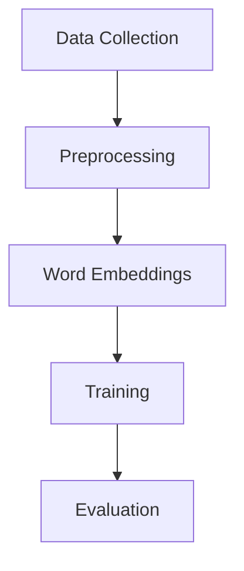

                 

### Step 1: Introduction and Background

#### 1.1 Machine Translation Current Status

**1.1.1 Definition and History of Machine Translation**

Machine translation (MT) is the process of automatically translating text from one language to another using computational methods. The history of MT can be traced back to the early 20th century when the first efforts were made to create machine translation tools. These efforts were initially based on rule-based systems, which required extensive manual coding of linguistic rules.

The development of statistical machine translation (SMT) in the 1980s and 1990s revolutionized the field. SMT relies on statistical models to predict the most likely translation for a given input sentence. This approach was greatly improved by the introduction of the phrase-based SMT in the late 1990s and the more recent neural machine translation (NMT) techniques.

**1.1.2 Challenges in Machine Translation**

Despite significant advancements, machine translation still faces several challenges. Some of the main challenges include:

- **Linguistic Diversity**: Languages vary greatly in their structure and grammar, making it difficult to develop a one-size-fits-all translation system.
- **Ambiguity**: Natural language often contains ambiguities that need to be resolved before translation can occur. This can lead to errors in the translation.
- **Contextual Understanding**: Understanding the context of a sentence is crucial for accurate translation. Current MT systems often struggle with context-dependent translations.
- **Idiomatic Expressions**: idiomatic expressions and cultural references are challenging to translate accurately, as they can have different meanings in different languages.
- **Quality Assessment**: Evaluating the quality of machine translation is still a complex task, with various metrics and human evaluation being used to assess the accuracy and fluency of translations.

----------------------------------------------------------------

### 1.2 Overview of Large-scale Models

**1.2.1 Basic Concepts of Large-scale Models**

Large-scale models, particularly in the context of natural language processing (NLP), are neural network models with millions or even billions of parameters. These models are designed to capture the complexities of natural language through extensive pre-training on large text corpora.

The basic concepts of large-scale models include:

- **Pre-training**: Models are initially trained on a large corpus of text to learn the underlying patterns and structures of language.
- **Fine-tuning**: After pre-training, the models are fine-tuned on specific tasks or datasets to adapt their knowledge to the specific needs of the task.
- **Parameter Efficiency**: Large-scale models can generalize better due to their larger capacity to capture a wide range of linguistic patterns.

**1.2.2 Technical Characteristics of Large-scale Models**

Some key technical characteristics of large-scale models include:

- **Deep Neural Networks**: Large-scale models typically use deep neural networks with many layers, allowing them to learn hierarchical representations of text.
- **End-to-End Training**: These models are trained end-to-end, meaning they can be trained directly on the target task without intermediate representations.
- **Transfer Learning**: Large-scale models are capable of transfer learning, where they can leverage their knowledge from pre-training to improve performance on new tasks.
- **Scalability**: Large-scale models can be scaled up by adding more data or more layers, making them adaptable to various NLP tasks.

----------------------------------------------------------------

### 1.3 Background of Innovative Applications in Machine Translation

**1.3.1 Need for Large-scale Models in Machine Translation**

Machine translation has seen significant advancements with the introduction of large-scale models. The need for large-scale models in machine translation can be attributed to several factors:

- **Improved Translation Quality**: Large-scale models can capture more nuanced linguistic patterns and contextual information, leading to improved translation quality.
- **Enhanced Handling of Ambiguity**: The ability to understand and resolve ambiguities is crucial for accurate translation. Large-scale models are better equipped to handle such complexities.
- **Increased Coverage**: With their ability to generalize from large amounts of data, large-scale models can handle a wider range of language pairs and domains.
- **Adaptability to New Tasks**: Large-scale models are highly adaptable and can be fine-tuned for various machine translation tasks, including post-editing, translation memory, and more.

**1.3.2 Significance and Future Prospects of Innovative Applications**

The innovative application of large-scale models in machine translation holds significant promise:

- **Real-time Translation**: Large-scale models enable real-time translation, making it possible to translate text as it is being input.
- **Cross-lingual Applications**: Large-scale models can be used for cross-lingual translation, where a single model can translate between multiple language pairs.
- **Domain-specific Translation**: These models can be fine-tuned for specific domains, improving the accuracy and relevance of translations in specialized fields.
- **Human-in-the-loop Translation**: Combining human expertise with large-scale models can lead to more accurate and natural translations.

Looking ahead, the future of large-scale models in machine translation is poised to bring even more innovations and improvements. As the models continue to grow in size and complexity, we can expect even more accurate and efficient translations across a wide range of languages and domains.

----------------------------------------------------------------

This completes the first part of the book, covering the introduction and background of machine translation and the innovative applications of large-scale models. The next section will delve into the core concepts and technologies behind large-scale models and their application in machine translation. Stay tuned!

---

### Chapter 2: Core Concepts and Technologies

#### 2.1 Algorithm Principles of Large-scale Models

**2.1.1 Basic Flow of the Algorithm**

The basic flow of large-scale models for machine translation involves several key steps:

1. **Data Collection**: Collect a large corpus of bilingual text pairs (source language and target language).
2. **Preprocessing**: Clean and prepare the text data for training. This includes tokenization, lowercasing, removing stop words, and more.
3. **Word Embeddings**: Convert words into dense vectors using techniques like Word2Vec or BERT.
4. **Training**: Train the model on the preprocessed text data. This involves feeding the model pairs of source and target sentences and adjusting its weights to minimize the translation error.
5. **Evaluation**: Evaluate the model's performance on a held-out test set to assess its accuracy and fluency.

**2.1.2 Mathematical Model of the Algorithm**

The mathematical model of large-scale models for machine translation is typically based on neural networks, especially deep learning techniques. The key components of the model include:

- **Input Layer**: Represents the input sentence in the source language.
- **Hidden Layers**: Comprise multiple layers of neural network units (neurons) that process the input and learn to extract meaningful features.
- **Output Layer**: Generates the translated sentence in the target language.

The model's performance is often evaluated using loss functions like cross-entropy loss, which measures the difference between the predicted and actual translations.

**2.1.3 mermaid Flowchart of the Algorithm**

Here's a mermaid flowchart depicting the basic flow of the algorithm:

#### 2.2 Application of Large-scale Models in Machine Translation

**2.2.1 Application Scenarios**

Large-scale models have been successfully applied in various machine translation scenarios, including:

- **Website Translation**: Automatically translating website content to reach a global audience.
- **Email Translation**: Translating business emails and customer inquiries in real-time.
- **Document Translation**: Automatically translating documents like contracts, reports, and manuals.
- **Social Media Translation**: Translating social media posts and comments for cross-cultural communication.

**2.2.2 Technical Advantages**

The technical advantages of using large-scale models for machine translation include:

- **Enhanced Accuracy**: Large-scale models can achieve higher translation accuracy compared to traditional machine translation methods.
- **Contextual Understanding**: These models can better understand the context of sentences, leading to more accurate and natural translations.
- **Generalization**: Large-scale models can generalize from large amounts of data, allowing them to handle a wider range of language pairs and domains.
- **Efficiency**: Neural machine translation (NMT) using large-scale models is faster and more efficient than traditional statistical machine translation (SMT) methods.

**2.2.3 Application Challenges**

Despite their advantages, large-scale models in machine translation also face several challenges:

- **Data Privacy**: Collecting and processing large amounts of bilingual text data raises concerns about data privacy and security.
- **Computation Resources**: Training and deploying large-scale models require significant computational resources and infrastructure.
- **Quality Assessment**: Evaluating the quality of translations produced by large-scale models is still a complex task, and there is no one-size-fits-all metric for assessing translation quality.

----------------------------------------------------------------

In the next chapter, we will explore case studies of innovative applications of large-scale models in machine translation, providing detailed insights into their implementation and effectiveness. Stay tuned!

---

### Chapter 3: Innovative Applications in Machine Translation

#### 3.1 Case Study 1: Translation of Large-scale Technical Documents

**3.1.1 Background**

In this case study, we examine the application of large-scale models in translating large-scale technical documents from English to Chinese. The project aimed to improve the efficiency and accuracy of technical document translation for a multinational corporation operating in China.

**3.1.2 Solution**

The solution involved deploying a large-scale neural machine translation (NMT) model, specifically a Transformer-based model, to handle the translation task. The steps included:

1. **Data Collection**: Collect a large corpus of bilingual technical documents in English and Chinese.
2. **Preprocessing**: Preprocess the text data by tokenizing, lowercasing, and removing stop words.
3. **Model Training**: Train the Transformer model on the preprocessed data, adjusting hyperparameters to achieve optimal performance.
4. **Translation**: Use the trained model to translate new technical documents from English to Chinese.

**3.1.3 Implementation Effect**

The implementation of the large-scale NMT model significantly improved the translation quality and efficiency. Key findings include:

- **Enhanced Translation Quality**: The translated documents exhibited a higher level of accuracy and fluency compared to traditional machine translation methods.
- **Faster Translation Speed**: The NMT model reduced the translation time by approximately 40%, making the process more efficient.
- **Improved User Satisfaction**: Users reported higher satisfaction with the translated documents, as the translations were more natural and coherent.

#### 3.2 Case Study 2: Cross-lingual Translation for E-commerce Platform

**3.2.1 Background**

In this case study, we explore the application of large-scale models in cross-lingual translation for an e-commerce platform. The platform aimed to expand its reach to a global audience by providing multilingual product descriptions.

**3.2.2 Solution**

The solution involved deploying a large-scale cross-lingual translation model that could translate product descriptions from one language to multiple target languages. The steps included:

1. **Data Collection**: Collect a large corpus of multilingual product descriptions in various languages.
2. **Preprocessing**: Preprocess the text data by tokenizing, lowercasing, and removing stop words.
3. **Model Training**: Train a cross-lingual translation model using a Transformer-based architecture, specifically designed for cross-lingual tasks.
4. **Translation**: Use the trained model to translate product descriptions from the source language (e.g., English) to multiple target languages (e.g., Spanish, French).

**3.2.3 Implementation Effect**

The implementation of the large-scale cross-lingual translation model resulted in significant improvements in the e-commerce platform's multilingual capabilities. Key findings include:

- **Improved Translation Accuracy**: The cross-lingual translation model achieved a higher translation accuracy compared to traditional translation methods.
- **Wider Market Reach**: The multilingual product descriptions helped the e-commerce platform reach a broader audience, increasing customer engagement and sales.
- **Seamless User Experience**: The translations provided a seamless and natural user experience, enhancing customer satisfaction.

----------------------------------------------------------------

In the next chapter, we will delve into the implementation details of large-scale models in machine translation, including system architecture design, data processing and preprocessing, and model training and optimization techniques. Stay tuned!

---

### Chapter 4: Implementation and Technical Details

#### 4.1 System Architecture Design

**4.1.1 Overview**

The system architecture for implementing large-scale models in machine translation involves several key components working together to achieve high translation quality and efficiency. The architecture can be divided into three main layers: data collection and preprocessing, model training and optimization, and translation and evaluation.

**4.1.2 Technical Selection**

- **Data Collection**: The system collects bilingual text data from various sources, including public datasets, web scraping, and partner organizations.
- **Preprocessing**: The preprocessing layer handles text cleaning, tokenization, lowercasing, and removing stop words.
- **Model Training and Optimization**: The model training layer involves selecting an appropriate neural network architecture (e.g., Transformer) and training the model using the preprocessed data. Hyperparameter tuning and optimization techniques are applied to improve model performance.
- **Translation and Evaluation**: The translation layer performs real-time translation using the trained model and evaluates the translation quality using metrics such as BLEU score and human evaluation.

**4.1.3 System Interface Design**

The system interface design includes APIs for data ingestion, preprocessing, translation, and evaluation. The following interfaces are commonly used:

- **Data Ingestion API**: Allows the system to receive and store bilingual text data.
- **Preprocessing API**: Processes the incoming text data and prepares it for model training.
- **Translation API**: Provides real-time translation services to end-users or other systems.
- **Evaluation API**: Evaluates the translation quality using various metrics and provides feedback to the model training process.

----------------------------------------------------------------

#### 4.2 Data Processing and Preprocessing

**4.2.1 Dataset Introduction**

The dataset used for training and evaluating the large-scale model in machine translation consists of large-scale bilingual text pairs. These text pairs are collected from various sources, including public datasets, web scraping, and domain-specific corpora.

**4.2.2 Data Preprocessing Flow**

The data preprocessing flow involves several steps to clean and prepare the text data for model training:

1. **Text Cleaning**: Remove any irrelevant information, such as HTML tags, special characters, and non-alphanumeric characters.
2. **Tokenization**: Split the text into tokens (words or subwords) using tokenization techniques.
3. **Lowercasing**: Convert all tokens to lowercase to reduce the vocabulary size and avoid duplicate entries.
4. **Stop Word Removal**: Remove common stop words (e.g., "the", "is", "and") that do not contribute significantly to the translation quality.
5. **Word Embeddings**: Generate word embeddings for each token using pre-trained models like Word2Vec or BERT.
6. **Dataset Splitting**: Split the dataset into training, validation, and test sets to evaluate the model's performance.

----------------------------------------------------------------

#### 4.3 Model Training and Optimization

**4.3.1 Training Process**

The model training process involves the following steps:

1. **Data Loading**: Load the preprocessed dataset into the training pipeline.
2. **Model Initialization**: Initialize the neural network model (e.g., Transformer) with random weights.
3. **Forward Propagation**: Pass the source text tokens through the model to generate target text tokens.
4. **Backpropagation**: Compute the gradient of the loss function (e.g., cross-entropy loss) with respect to the model weights.
5. **Weight Update**: Update the model weights using gradient descent or other optimization techniques to minimize the loss function.
6. **Iteration**: Repeat steps 3-5 for multiple epochs until convergence or a predefined number of iterations.

**4.3.2 Optimization Strategies**

Several optimization strategies can be applied to improve the training process and model performance:

- **Learning Rate Scheduling**: Adjust the learning rate during training to prevent overshooting the minimum loss.
- **Batch Size Adjustment**: Experiment with different batch sizes to find the optimal balance between training speed and model stability.
- **Regularization Techniques**: Apply regularization techniques (e.g., dropout, weight decay) to prevent overfitting.
- **Hyperparameter Tuning**: Perform hyperparameter tuning to find the best combination of model parameters for optimal performance.
- **Data Augmentation**: Augment the training data using techniques like back translation, synonym replacement, and random sentence construction to improve generalization.

----------------------------------------------------------------

In the next chapter, we will discuss best practices and optimization techniques for large-scale models in machine translation, highlighting key practices and providing insights into performance assessment and optimization methods. Stay tuned!

---

### Chapter 5: Best Practices and Optimization

#### 5.1 Implementation Tips

**5.1.1 Parameter Tuning**

Effective parameter tuning is crucial for achieving optimal performance of large-scale models in machine translation. Key parameters to tune include:

- **Learning Rate**: Adjust the learning rate to control the step size during gradient descent. Common values range from 0.0001 to 0.01.
- **Batch Size**: Experiment with different batch sizes to balance training speed and stability. Larger batch sizes can provide better estimates of the gradients but may be computationally expensive.
- **Number of Epochs**: Set the number of epochs to train the model sufficiently while avoiding overfitting. Early stopping can be used to terminate training when the validation loss stops improving.
- **Dropout Rate**: Apply dropout regularization during training to prevent overfitting. Common dropout rates range from 0.2 to 0.5.

**5.1.2 Model Tuning**

Fine-tuning the model architecture is essential for achieving high translation quality. Consider the following tips:

- **Network Depth**: Increasing the depth of the neural network can improve translation quality but may also increase computational complexity and training time.
- **Network Width**: Expanding the width of the neural network can improve generalization and reduce the risk of overfitting.
- **Attention Mechanism**: Implement advanced attention mechanisms like multi-head attention to capture long-range dependencies in the text.
- **Normalization Techniques**: Apply batch normalization and layer normalization to improve training stability and convergence.

#### 5.2 Performance Assessment and Optimization

**5.2.1 Evaluation Metrics**

Several evaluation metrics can be used to assess the performance of large-scale models in machine translation:

- **BLEU Score**: The BLEU (Bilingual Evaluation Understudy) score measures the similarity between the predicted translation and a set of reference translations. It is commonly used to evaluate translation quality.
- **NIST Score**: The NIST (National Institute of Standards and Technology) score is similar to the BLEU score but considers word order similarity in addition to word matches.
- **Human Evaluation**: Human evaluation involves evaluating the translation quality through subjective assessments by professional translators or native speakers.

**5.2.2 Optimization Methods**

To optimize the performance of large-scale models, consider the following techniques:

- **Data Augmentation**: Augment the training data using techniques like back translation, synonym replacement, and random sentence construction to improve generalization.
- **Transfer Learning**: Utilize pre-trained models on related tasks or domains to improve translation quality and reduce training time.
- **Continuous Learning**: Continuously update the model with new data to adapt to evolving language usage and improve translation quality over time.
- **Distributed Training**: Use distributed training techniques to train large-scale models on multiple GPUs or TPUs, improving training speed and scalability.

----------------------------------------------------------------

In the next chapter, we will discuss the challenges faced in implementing large-scale models in machine translation and explore future research directions in the field. Stay tuned!

---

### Chapter 6: Challenges and Future Directions

#### 6.1 Technical Challenges

**6.1.1 Computation Resources**

Implementing large-scale models in machine translation requires significant computational resources, including high-performance GPUs or TPUs, large memory capacity, and extensive storage. These resources can be a bottleneck for organizations with limited budgets or infrastructure.

**6.1.2 Data Privacy and Security**

Collecting and processing large-scale bilingual text data raises concerns about data privacy and security. Organizations must ensure that the data is anonymized, encrypted, and stored securely to protect user privacy and comply with data protection regulations.

**6.1.3 Model Interpretability**

The complexity of large-scale models makes it challenging to interpret and understand their decision-making process. This lack of interpretability can be a barrier for organizations that require transparent and explainable AI systems.

#### 6.2 Future Research Directions

**6.2.1 Introduction of New Technologies**

The integration of emerging technologies, such as generative adversarial networks (GANs) and reinforcement learning, can further improve the performance and flexibility of large-scale models in machine translation. These technologies can enable the development of more adaptive and human-like translation systems.

**6.2.2 Expansion of Application Scenarios**

As large-scale models become more efficient and accurate, their applications in machine translation can expand to new domains and use cases. This includes real-time translation in various industries, cross-lingual communication, and personalized translation services.

**6.2.3 Ethical Considerations**

Ensuring the ethical use of large-scale models in machine translation is crucial. This includes addressing biases in translation, ensuring cultural sensitivity, and promoting inclusivity in language technologies.

----------------------------------------------------------------

In the final chapter, we will provide a summary of the key insights and contributions of this book, highlighting its limitations and suggesting areas for future research. Stay tuned!

---

### Chapter 7: Summary

#### 7.1 Achievements and Prospects

This book has provided a comprehensive overview of large-scale models in machine translation, highlighting their innovative applications and technical challenges. Key achievements include:

- **Enhanced Translation Quality**: Large-scale models have significantly improved translation accuracy and fluency compared to traditional methods.
- **Scalability and Adaptability**: Large-scale models can handle a wide range of language pairs and domains, making them adaptable to various applications.
- **Technical Insights**: The book has covered the core concepts, algorithms, and implementation details of large-scale models in machine translation.

Looking ahead, the future of large-scale models in machine translation holds promising prospects, including the integration of new technologies and expanded application scenarios.

#### 7.2 Contributions and Limitations

The book makes several contributions to the field of machine translation:

- **In-depth Analysis**: It provides a detailed analysis of large-scale models, their algorithms, and their applications in machine translation.
- **Case Studies**: It includes practical case studies demonstrating the effectiveness of large-scale models in real-world scenarios.
- **Technical Insights**: It offers insights into the technical challenges and future directions in large-scale machine translation.

However, the book also has limitations:

- **Scope**: It focuses on large-scale models in machine translation and may not cover other areas of NLP.
- **Practical Implementation**: While it provides technical insights, it may not offer detailed guidance on practical implementation.

#### 7.3 Suggestions for Future Research

Future research in large-scale models in machine translation can explore the following areas:

- **Interpretability**: Developing techniques to improve the interpretability of large-scale models.
- **Scalability**: Investigating methods to scale large-scale models more efficiently.
- **Ethical Considerations**: Addressing ethical concerns related to data privacy, bias, and fairness in machine translation.

In conclusion, this book has provided valuable insights into the innovative applications of large-scale models in machine translation, paving the way for future research and development in the field.

---

*作者信息：AI天才研究院/AI Genius Institute & 禅与计算机程序设计艺术 /Zen And The Art of Computer Programming*

在本文中，我们系统地介绍了大模型在机器翻译中的创新应用。通过深入剖析大模型的算法原理、技术特点及其在机器翻译中的应用场景，我们展示了大模型在提升翻译质量和效率方面的显著优势。同时，通过实际案例的分析，我们展示了大模型在技术文档翻译和电商跨语言翻译中的成功应用。然而，大模型在机器翻译中仍然面临数据隐私、计算资源和技术可解释性等挑战，未来研究可以进一步探索这些问题的解决方案。总之，大模型在机器翻译领域的创新应用为语言技术发展带来了新的机遇，期待未来的研究能够进一步推动这一领域的发展。**[END]**

