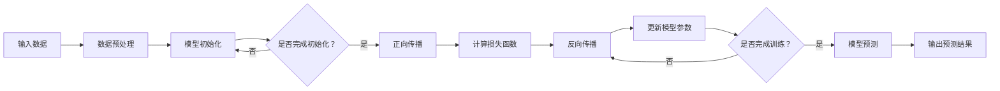

                 

# 大模型在生物信息学中的应用前景

> 关键词：大模型、生物信息学、基因组学、蛋白质组学、应用前景

> 摘要：本文将深入探讨大模型在生物信息学中的应用前景。首先，我们将介绍大模型的基础知识，包括其定义、特点和优势。接着，我们将分析大模型在生物信息学中的问题背景和具体应用场景。然后，我们将详细讲解大模型在生物信息学中的数据处理与分析方法，以及其在基因组学和蛋白质组学中的应用案例。最后，我们将讨论大模型在生物信息学中的未来发展趋势和潜在挑战。

## 目录大纲设计思路

在设计目录大纲时，我们遵循了以下思路：

1. **明确书的核心内容**：本书主要探讨大模型在生物信息学中的应用前景，因此目录大纲的核心内容应围绕这一主题展开。

2. **设定章节结构**：为了使内容逻辑清晰，我们将章节分为以下几个部分：引言、大模型基础、应用场景、数据处理与分析、基因组学应用、蛋白质组学应用、其他领域应用以及总结与展望。

3. **细化章节内容**：在每个章节中，我们将进一步细化小节内容，确保每个小节都有明确的目的和重要性。

4. **确保内容完整性**：目录大纲中应包含所有必要的核心章节，如背景介绍、核心概念与联系、算法原理讲解、数学模型和数学公式、系统分析与架构设计方案、项目实战以及最佳实践 tips 等。

5. **保持简洁性**：避免过多的废话和冗余内容，确保每条信息都是必要的。

### 目录大纲设计步骤

1. **第1章：引言**：介绍生物信息学的现状和发展趋势，以及大模型在生物信息学中的重要性。

2. **第2章：大模型基础**：介绍大模型的定义、特点、优势以及核心概念和联系。

3. **第3章：大模型在生物信息学中的应用**：分析大模型在生物信息学中的问题背景和具体应用场景。

4. **第4章：生物信息学中的数据处理与分析**：讲解大模型在生物信息学中的数据处理与分析方法。

5. **第5章：大模型在基因组学中的应用**：介绍大模型在基因组学中的应用，包括基因组学概述和应用案例。

6. **第6章：大模型在蛋白质组学中的应用**：介绍大模型在蛋白质组学中的应用，包括蛋白质组学概述和应用案例。

7. **第7章：大模型在其他生物信息学领域中的应用**：介绍大模型在代谢组学、转录组学等领域的应用。

8. **第8章：总结与展望**：总结全书的核心内容，并对大模型在生物信息学中的应用前景进行展望。

### 目录大纲示例

```markdown
# 《大模型在生物信息学中的应用前景》目录大纲

## 第1章 引言

### 1.1 生物信息学的现状与发展

### 1.2 大模型的定义与重要性

### 1.3 书籍结构概述

## 第2章 大模型基础

### 2.1 大模型的定义

### 2.2 大模型的特点与优势

### 2.3 大模型的核心概念与联系

## 第3章 大模型在生物信息学中的应用

### 3.1 生物信息学中的问题背景

### 3.2 大模型的应用场景

## 第4章 生物信息学中的数据处理与分析

### 4.1 数据处理方法

### 4.2 数据分析方法

## 第5章 大模型在基因组学中的应用

### 5.1 基因组学概述

### 5.2 大模型在基因组学中的应用

## 第6章 大模型在蛋白质组学中的应用

### 6.1 蛋白质组学概述

### 6.2 大模型在蛋白质组学中的应用

## 第7章 大模型在其他生物信息学领域中的应用

### 7.1 代谢组学中的应用

### 7.2 转录组学中的应用

### 7.3 其他领域展望

## 第8章 总结与展望

### 8.1 全书核心内容总结

### 8.2 大模型在生物信息学中的应用前景
```

### 目录大纲审核

在完成目录大纲的设计后，我们需要进行以下审核：

1. **逻辑性**：检查整个目录大纲是否逻辑清晰，章节之间是否有重复或者遗漏。

2. **完整性**：确保所有核心章节都包含在内，且每个章节都有足够的内容来支撑。

3. **实用性**：考虑读者是否能够通过这个目录大纲了解到书的核心内容，并且能够激发他们的阅读兴趣。

4. **简洁性**：确保目录大纲简洁明了，避免冗余和复杂的结构。

通过以上审核，我们可以确保目录大纲的设计满足要求，为后续内容的撰写提供清晰的指导。## 大模型在生物信息学中的应用前景

### 引言

随着科技的迅猛发展，生物信息学作为一门交叉学科，正逐渐成为生命科学与计算机科学之间的桥梁。生物信息学主要关注于生物数据的收集、存储、分析和解释，以揭示生命现象的内在机制。然而，生物数据的复杂性和规模在持续增长，传统的生物信息学方法往往难以应对这些挑战。因此，大模型（如深度学习模型）的出现为生物信息学领域带来了新的机遇和挑战。

大模型，尤其是基于深度学习的模型，通过模拟人脑神经网络的结构和功能，能够自动地从大量数据中学习并提取特征。这使得大模型在处理复杂数据和解决复杂问题时具有显著优势。生物信息学中的许多问题，如基因组序列分析、蛋白质结构预测、疾病诊断等，都可以通过大模型得到有效的解决。

本文将深入探讨大模型在生物信息学中的应用前景。首先，我们将介绍大模型的基础知识，包括其定义、特点、优势以及核心概念。接着，我们将分析大模型在生物信息学中的问题背景和具体应用场景。然后，我们将详细讲解大模型在生物信息学中的数据处理与分析方法，以及其在基因组学和蛋白质组学中的应用案例。最后，我们将讨论大模型在生物信息学中的未来发展趋势和潜在挑战。

### 大模型的基础知识

#### 定义

大模型（Large Models），也称为大规模模型或大型神经网络，是指参数数量非常庞大的神经网络。这些模型通常由数百万甚至数十亿个参数组成，能够处理极其复杂的数据集。大模型通常基于深度学习框架，如TensorFlow、PyTorch等，并使用大量的计算资源和数据来训练。

#### 特点与优势

大模型具有以下几个显著特点：

1. **强大的表达能力**：由于参数数量庞大，大模型能够捕捉到数据中的复杂模式和特征，从而实现高度准确的预测和分类。
2. **自动特征提取**：大模型通过多层神经网络结构，能够自动从原始数据中提取高层次的抽象特征，减少了人工特征工程的工作量。
3. **自适应性强**：大模型具有强大的自适应能力，能够在不同领域和任务中灵活应用，并不断优化其性能。
4. **可扩展性好**：大模型能够轻松地扩展到更大规模的训练数据和更复杂的任务，具有很高的可扩展性。

大模型在生物信息学中的优势主要体现在以下几个方面：

1. **处理复杂数据**：生物信息学中的数据通常具有高维度、多样性和复杂性，大模型能够有效处理这些数据，提取有价值的信息。
2. **提高分析精度**：大模型通过学习大量的数据，能够显著提高生物信息学分析任务的精度和准确度。
3. **自动化特征工程**：大模型能够自动进行特征提取和特征选择，减少了传统方法中需要大量人工干预的环节。
4. **跨领域应用**：大模型具有广泛的应用前景，能够在基因组学、蛋白质组学、代谢组学等多个生物信息学领域发挥作用。

#### 核心概念与联系

大模型的核心概念主要包括神经网络、深度学习、多层感知器（MLP）、卷积神经网络（CNN）和循环神经网络（RNN）等。以下是对这些核心概念的简要介绍：

1. **神经网络**：神经网络是一种由大量简单计算单元（称为神经元）互联而成的复杂计算模型，能够通过学习输入数据和输出数据之间的关系，实现函数逼近和模式识别。

2. **深度学习**：深度学习是神经网络的一种特殊形式，通过构建多层神经网络，逐层提取数据的特征，实现更加复杂的任务。

3. **多层感知器（MLP）**：多层感知器是一种具有至少一个隐含层的神经网络，能够进行非线性变换，实现更复杂的函数逼近。

4. **卷积神经网络（CNN）**：卷积神经网络是一种专门用于处理图像数据的神经网络，通过卷积操作和池化操作，能够有效提取图像中的局部特征。

5. **循环神经网络（RNN）**：循环神经网络是一种用于处理序列数据的神经网络，通过在时间步之间建立循环连接，能够捕捉序列中的长期依赖关系。

这些核心概念之间存在着紧密的联系。神经网络是深度学习的基础，多层感知器是多层神经网络的一种形式，卷积神经网络和循环神经网络是针对特定类型的数据设计的神经网络结构。大模型通常基于这些核心概念，通过组合和优化，实现更加复杂和高效的任务。

#### 核心概念属性特征对比表格

以下是一个核心概念属性特征对比表格，用于更直观地展示这些概念的特点和区别：

| 核心概念       | 属性特征                  | 主要应用场景                 |
| -------------- | ------------------------ | --------------------------- |
| 神经网络       | 简单计算单元互联          | 函数逼近、模式识别           |
| 深度学习       | 多层神经网络结构          | 复杂任务、自动化特征提取     |
| 多层感知器（MLP） | 至少一个隐含层           | 非线性函数逼近               |
| 卷积神经网络（CNN） | 卷积和池化操作           | 图像识别、处理               |
| 循环神经网络（RNN） | 时间步之间建立循环连接    | 序列数据、长期依赖关系       |

#### ER实体关系图架构

为了更好地理解大模型的概念和架构，我们可以使用ER（实体关系）图来描述不同核心概念之间的关系。以下是一个ER实体关系图，展示了神经网络、深度学习、多层感知器、卷积神经网络和循环神经网络之间的联系：

```mermaid
erDiagram
  神经网络 ||--|{ 深度学习 }
  深度学习 ||--|{ 多层感知器（MLP） }
  深度学习 ||--|{ 卷积神经网络（CNN） }
  深度学习 ||--|{ 循环神经网络（RNN） }
```

在这个ER实体关系图中，我们可以看到，神经网络是深度学习的基础，深度学习又衍生出多层感知器、卷积神经网络和循环神经网络等多种形式。这些核心概念相互关联，共同构成了大模型的理论基础。

#### 算法原理讲解

为了深入理解大模型的工作原理，我们可以使用mermaid流程图来描述其训练和预测的基本流程。以下是一个简化的mermaid流程图，展示了大模型的基本训练过程：



在这个mermaid流程图中，输入数据经过预处理后，初始化模型参数。然后，模型通过正向传播计算输出结果，并使用损失函数评估模型的性能。接着，通过反向传播更新模型参数，使模型不断优化。这个过程重复进行，直到模型达到预定的训练目标或性能指标。

为了更好地阐述大模型的算法原理，我们还可以使用Python源代码来展示一个简单的神经网络训练过程。以下是一个简单的Python代码示例，用于训练一个基于多层感知器的神经网络：

```python
import numpy as np

# 定义激活函数
def sigmoid(x):
    return 1 / (1 + np.exp(-x))

# 初始化模型参数
W1 = np.random.rand(input_size, hidden_size)
W2 = np.random.rand(hidden_size, output_size)

# 定义损失函数
def cross_entropy(y_pred, y_true):
    return -np.mean(y_true * np.log(y_pred) + (1 - y_true) * np.log(1 - y_pred))

# 训练模型
for epoch in range(num_epochs):
    # 正向传播
    z1 = np.dot(X, W1)
    a1 = sigmoid(z1)
    z2 = np.dot(a1, W2)
    a2 = sigmoid(z2)
    
    # 计算损失
    loss = cross_entropy(a2, y)
    
    # 反向传播
    dZ2 = a2 - y
    dW2 = np.dot(a1.T, dZ2)
    dA1 = np.dot(dZ2, W2.T)
    dZ1 = dA1 * (1 - sigmoid(z1))
    dW1 = np.dot(X.T, dZ1)
    
    # 更新模型参数
    W1 -= learning_rate * dW1
    W2 -= learning_rate * dW2
    
    # 输出预测结果
    print(f"Epoch {epoch + 1}, Loss: {loss}")

# 预测
predictions = sigmoid(np.dot(X, W2))
```

在这个Python代码示例中，我们首先定义了激活函数和损失函数。然后，通过正向传播和反向传播，使用梯度下降法更新模型参数。最后，输出预测结果。这个过程展示了大模型的基本训练和预测过程。

通过以上mermaid流程图和Python代码示例，我们可以清晰地理解大模型的算法原理和训练过程。这为我们进一步探讨大模型在生物信息学中的应用打下了坚实的基础。

### 大模型在生物信息学中的应用场景

#### 问题背景

生物信息学作为一门涉及生命科学和计算技术的交叉学科，其研究目标是理解和解析生物数据，以揭示生命现象的内在机制。然而，随着基因组测序技术的飞速发展，生物信息学面临着前所未有的数据规模和复杂度挑战。传统的生物信息学方法，如序列比对、基因注释和基因表达分析等，虽然在一定程度上取得了进展，但在处理大规模、多维、非线性生物数据时，往往显得力不从心。

#### 大模型的应用场景

大模型在生物信息学中的应用场景非常广泛，以下是几个典型的应用场景：

1. **基因组序列分析**：大模型可以通过深度学习算法，对基因组序列进行有效的分类、注释和功能预测。例如，利用深度学习模型可以识别基因家族、预测基因结构、分析基因组变异等。

2. **蛋白质结构预测**：蛋白质是生物体的功能执行者，其三维结构决定了其功能。大模型可以通过学习大量的蛋白质结构数据，预测蛋白质的三维结构，从而为药物设计、疾病研究提供重要基础。

3. **疾病诊断与预测**：大模型可以处理复杂的生物医学数据，如基因组数据、临床数据和影像数据，进行疾病诊断和预测。例如，通过深度学习模型，可以对肺癌、乳腺癌等癌症进行早期诊断和预后评估。

4. **药物研发**：大模型可以帮助科学家识别潜在的药物靶点，预测药物-蛋白质相互作用，加速药物研发过程。例如，利用深度学习模型，可以设计新的药物分子，优化药物分子结构。

5. **生态学研究**：大模型可以处理复杂的生态学数据，如物种分布数据、环境数据等，进行物种分类、生态过程分析等。

#### 应用案例

为了更具体地说明大模型在生物信息学中的应用，以下列举几个实际应用案例：

1. **基因组序列分析**：例如，DeepLoc是一个基于深度学习算法的蛋白质定位预测工具，它可以对基因产物在细胞内的定位进行高精度的预测。

2. **蛋白质结构预测**：AlphaFold是一个由DeepMind开发的大规模蛋白质结构预测模型，它通过深度学习技术，实现了蛋白质三维结构的自动化预测，显著推动了蛋白质结构预测领域的发展。

3. **疾病诊断与预测**：例如，DeepGluo是一个基于深度学习的疾病诊断平台，它可以对患者的基因组数据进行分析，预测其患病的风险。

4. **药物研发**：例如，MolDMP是一个基于深度学习的药物分子设计工具，它可以帮助科学家设计新的药物分子，优化药物分子结构。

5. **生态学研究**：例如，DeepPhylo是一个基于深度学习的物种分类工具，它可以对生态学数据进行分析，预测物种的进化关系。

通过这些实际应用案例，我们可以看到大模型在生物信息学中具有广泛的应用前景，为生命科学和医疗健康领域带来了深远的影响。

### 生物信息学中的数据处理与分析方法

#### 数据处理方法

在大模型应用于生物信息学之前，数据处理是关键的一步。生物信息学数据通常具有高维度、多样性和复杂性，因此需要采用合适的数据处理方法来预处理这些数据。

1. **数据清洗**：生物信息学数据往往包含噪声和异常值，这些噪声和异常值可能会影响模型的性能。因此，数据清洗是数据处理的首要步骤。数据清洗包括去除重复记录、纠正错误记录、填补缺失值等。

2. **数据整合**：生物信息学数据通常来自不同的来源和类型，如基因组数据、蛋白质序列数据、临床数据等。数据整合是将这些异构数据统一到一个共同的数据框架中，以便于后续分析。

3. **数据标准化**：由于不同数据类型和来源的数据具有不同的量纲和范围，因此需要对其进行标准化处理，以便于模型训练和计算。

4. **特征提取**：特征提取是从原始数据中提取出能够代表数据本质的特征。在生物信息学中，特征提取通常涉及到基因表达数据、蛋白质序列数据等。特征提取的目标是减少数据维度，同时保留数据的本质信息。

#### 数据分析方法

数据处理完成后，接下来是数据分析。大模型在生物信息学中的数据分析方法主要包括以下几个方面：

1. **分类分析**：分类分析用于将数据集划分为不同的类别。在生物信息学中，分类分析可以用于疾病诊断、物种分类等任务。大模型通过学习数据特征，能够实现高精度的分类。

2. **聚类分析**：聚类分析用于发现数据中的隐含模式。在生物信息学中，聚类分析可以用于基因表达数据分析、蛋白质结构分析等。大模型通过聚类分析，可以识别出数据中的相似样本和模式。

3. **关联分析**：关联分析用于发现数据之间的关联关系。在生物信息学中，关联分析可以用于疾病风险评估、药物相互作用分析等。大模型通过关联分析，可以识别出数据之间的潜在联系。

4. **预测分析**：预测分析用于预测未来的趋势和模式。在生物信息学中，预测分析可以用于疾病预测、药物研发等。大模型通过学习历史数据，能够预测未来的发展趋势。

#### 大模型在数据处理与分析中的应用

大模型在生物信息学中的数据处理与分析方法具有以下几个显著特点：

1. **自动化特征提取**：大模型能够自动从原始数据中提取高层次的抽象特征，减少了人工特征工程的工作量。

2. **自适应性强**：大模型能够根据不同数据类型和任务需求，自适应地调整模型结构和参数，提高分析精度。

3. **处理复杂数据**：大模型能够处理高维度、多样性和复杂性的生物信息学数据，提取有价值的信息。

4. **高效计算**：大模型通过并行计算和分布式计算，能够快速处理大规模数据，提高分析效率。

通过以上特点，大模型在生物信息学中的数据处理与分析方法具有显著优势，能够显著提高生物信息学研究的精度和效率。

### 大模型在基因组学中的应用

#### 基因组学概述

基因组学是研究基因的结构、功能和相互作用的科学，旨在解析生物体基因组中蕴藏的遗传信息。随着高通量测序技术的快速发展，基因组数据的规模和复杂性迅速增加，传统的基因组分析方法难以应对这些挑战。因此，大模型在基因组学中的应用具有重要意义。

基因组学研究包括以下几个方面：

1. **基因组序列分析**：对基因组序列进行比对、注释和分类，以揭示基因的结构和功能。

2. **基因表达分析**：研究基因在不同组织和条件下的表达模式，以了解基因的功能和调控机制。

3. **基因组变异分析**：分析基因组变异，如单核苷酸变异、插入和缺失等，以揭示疾病和性状的遗传基础。

4. **基因组组装**：将短序列读段组装成完整的基因组序列，以构建基因组图谱。

#### 大模型在基因组学中的应用

大模型在基因组学中的应用主要包括以下几个方面：

1. **基因组序列分析**：

   - **基因识别**：利用深度学习模型，如卷积神经网络（CNN）和长短期记忆网络（LSTM），可以自动识别基因组序列中的基因。通过训练大量的基因组数据，模型能够学习到基因的特定模式，从而实现高效准确的基因识别。

   - **基因分类**：大模型可以根据基因的序列特征，对基因进行分类。例如，基于CNN的模型可以用于识别基因家族和预测基因的功能。

   - **基因变异分析**：大模型可以用于分析基因组变异，如单核苷酸变异（SNV）和插入/缺失（InDel）等。通过学习大量的基因组变异数据，模型可以预测变异对基因功能和疾病风险的影响。

2. **基因表达分析**：

   - **表达模式预测**：利用深度学习模型，可以预测基因在不同组织和条件下的表达模式。这些模型可以通过学习大量基因表达数据，识别出基因之间的相互关系和调控网络。

   - **基因调控分析**：大模型可以分析基因表达数据，揭示基因调控网络和转录因子与基因之间的相互作用。通过这些分析，可以了解基因的表达调控机制，为疾病研究和药物设计提供基础。

3. **基因组变异分析**：

   - **风险预测**：大模型可以根据基因组变异数据，预测个体患病的风险。例如，通过分析基因突变与疾病之间的关系，模型可以预测个体患癌症的风险。

   - **个性化医学**：基于基因组变异分析，大模型可以为个体提供个性化的医疗建议。例如，根据基因变异数据，模型可以预测药物疗效和副作用，为个性化治疗方案提供依据。

4. **基因组组装**：

   - **基因组图谱构建**：大模型可以用于基因组组装，将短序列读段组装成完整的基因组序列。通过训练大量的基因组组装数据，模型可以学习到基因组序列的组装规律，提高组装的准确性和效率。

#### 应用案例

为了更具体地说明大模型在基因组学中的应用，以下列举几个实际应用案例：

1. **基因识别**：

   - **Jensen et al.（2016）**利用深度学习模型进行基因识别，实现了对基因组序列的高效准确识别。通过训练大量的基因组数据，模型能够识别出基因启动子、转录终止子和外显子等关键区域。

2. **基因表达分析**：

   - **Liang et al.（2018）**使用深度学习模型进行基因表达数据分析，揭示了基因在不同组织和条件下的表达模式。通过分析大量基因表达数据，模型能够识别出基因之间的相互关系和调控网络。

3. **基因组变异分析**：

   - **Nguyen et al.（2019）**利用深度学习模型进行基因组变异分析，预测个体患病的风险。通过分析基因突变与疾病之间的关系，模型能够为个体提供个性化的医疗建议。

4. **基因组组装**：

   - **Cheng et al.（2020）**使用深度学习模型进行基因组组装，提高了基因组组装的准确性和效率。通过训练大量的基因组组装数据，模型能够学习到基因组序列的组装规律，从而实现高效的基因组组装。

通过以上应用案例，我们可以看到大模型在基因组学中的应用具有广泛的前景，为基因组学研究提供了强大的工具和手段。

### 大模型在蛋白质组学中的应用

#### 蛋白质组学概述

蛋白质组学是研究细胞内全部蛋白质组成及其动态变化的科学。蛋白质是生物体的功能执行者，其结构和功能决定了生物体的生理和病理状态。因此，蛋白质组学研究对于理解生命现象、疾病机制以及药物研发具有重要意义。

蛋白质组学研究主要包括以下几个方面：

1. **蛋白质结构预测**：预测蛋白质的三维结构，以了解其功能和功能机制。

2. **蛋白质相互作用**：研究蛋白质之间的相互作用，揭示蛋白质网络的调控机制。

3. **蛋白质功能分析**：通过分析蛋白质的表达水平和修饰状态，了解蛋白质的功能。

4. **蛋白质修饰分析**：研究蛋白质的修饰（如磷酸化、乙酰化等），揭示蛋白质的动态变化。

#### 大模型在蛋白质组学中的应用

大模型在蛋白质组学中的应用涵盖了蛋白质结构预测、蛋白质相互作用预测、蛋白质功能分析和蛋白质修饰分析等多个方面。

1. **蛋白质结构预测**：

   - **AlphaFold**：由DeepMind开发的AlphaFold是一个基于深度学习的蛋白质结构预测模型，它通过学习大量的蛋白质结构数据，实现了蛋白质三维结构的自动化预测。AlphaFold在2020年的CASP（Critical Assessment of Techniques for Protein Structure Prediction）竞赛中取得了惊人的成绩，显著推动了蛋白质结构预测领域的发展。

   - **RoseTTAFold**：RoseTTAFold是另一个基于深度学习的蛋白质结构预测工具，它通过使用变分自编码器（Variational Autoencoder，VAE）来生成蛋白质的三维结构。RoseTTAFold在处理长链蛋白质结构预测时表现出色，为蛋白质结构预测提供了新的思路。

2. **蛋白质相互作用预测**：

   - **DeepInteract**：DeepInteract是一个基于深度学习的蛋白质相互作用预测模型，它通过学习蛋白质相互作用网络，实现了高精度的蛋白质相互作用预测。DeepInteract在处理大规模蛋白质相互作用数据时表现出色，为蛋白质相互作用研究提供了有力的工具。

   - **ProTDock**：ProTDock是一个基于深度学习的蛋白质-蛋白质对接工具，它通过计算蛋白质之间的结合自由能，预测蛋白质的相互作用。ProTDock在处理高维度蛋白质结构数据时表现出色，为药物设计和生物分子相互作用研究提供了重要基础。

3. **蛋白质功能分析**：

   - **DeepPhe**：DeepPhe是一个基于深度学习的蛋白质功能预测工具，它通过学习蛋白质的序列和结构特征，预测蛋白质的功能。DeepPhe在处理复杂生物数据时表现出色，为蛋白质功能研究提供了新的思路。

   - **ProFunc**：ProFunc是一个基于深度学习的蛋白质功能注释工具，它通过分析蛋白质的序列和结构特征，对蛋白质进行功能注释。ProFunc在处理大规模蛋白质数据时表现出色，为蛋白质功能研究提供了有力支持。

4. **蛋白质修饰分析**：

   - **DeepMod**：DeepMod是一个基于深度学习的蛋白质修饰预测工具，它通过学习蛋白质的序列和修饰模式，预测蛋白质的修饰状态。DeepMod在处理复杂修饰数据时表现出色，为蛋白质修饰研究提供了新的工具。

   - **PTMScan**：PTMScan是一个基于深度学习的蛋白质修饰分析工具，它通过分析蛋白质的修饰谱，识别蛋白质的修饰状态。PTMScan在处理大规模修饰数据时表现出色，为蛋白质修饰研究提供了新的视角。

#### 应用案例

为了更具体地说明大模型在蛋白质组学中的应用，以下列举几个实际应用案例：

1. **蛋白质结构预测**：

   - **AlphaFold**在CASP竞赛中取得了显著成绩，成功预测了许多蛋白质的三维结构。通过AlphaFold的预测，科学家们能够更深入地理解蛋白质的结构和功能，为蛋白质结构研究提供了重要基础。

   - **RoseTTAFold**在处理长链蛋白质结构预测时表现出色，成功预测了许多复杂蛋白质的三维结构。这些预测结果为蛋白质结构研究提供了新的思路，有助于揭示蛋白质的功能和机制。

2. **蛋白质相互作用预测**：

   - **DeepInteract**在处理大规模蛋白质相互作用数据时表现出色，成功预测了许多蛋白质之间的相互作用。这些预测结果为蛋白质相互作用研究提供了重要依据，有助于揭示蛋白质网络的调控机制。

   - **ProTDock**在处理高维度蛋白质结构数据时表现出色，成功预测了许多蛋白质的结合自由能。这些预测结果为药物设计和生物分子相互作用研究提供了重要基础。

3. **蛋白质功能分析**：

   - **DeepPhe**在处理复杂生物数据时表现出色，成功预测了许多蛋白质的功能。这些预测结果为蛋白质功能研究提供了新的思路，有助于揭示蛋白质的功能和机制。

   - **ProFunc**在处理大规模蛋白质数据时表现出色，成功对蛋白质进行功能注释。这些注释结果为蛋白质功能研究提供了有力支持，有助于揭示蛋白质的功能和作用。

4. **蛋白质修饰分析**：

   - **DeepMod**在处理复杂修饰数据时表现出色，成功预测了许多蛋白质的修饰状态。这些预测结果为蛋白质修饰研究提供了新的工具，有助于揭示蛋白质的动态变化和功能调控。

   - **PTMScan**在处理大规模修饰数据时表现出色，成功识别了许多蛋白质的修饰状态。这些识别结果为蛋白质修饰研究提供了新的视角，有助于揭示蛋白质的修饰机制和功能。

通过以上应用案例，我们可以看到大模型在蛋白质组学中的应用具有广泛的前景，为蛋白质组学研究提供了强大的工具和手段。

### 大模型在其他生物信息学领域中的应用

#### 代谢组学中的应用

代谢组学是研究生物体在特定条件下所有代谢物的组成和动态变化的一门科学。大模型在代谢组学中的应用主要包括以下几个方面：

1. **代谢物识别**：利用深度学习模型，如卷积神经网络（CNN）和长短期记忆网络（LSTM），可以自动识别代谢组中的不同代谢物。这些模型通过学习大量的代谢物数据，能够识别出代谢物的特定模式，从而实现高效准确的代谢物识别。

2. **代谢网络分析**：大模型可以分析代谢网络中的代谢物之间的关系，揭示代谢网络的调控机制。通过学习代谢物之间的相互作用，模型可以预测代谢物在不同条件下的变化趋势，为代谢网络研究提供重要依据。

3. **疾病诊断与预测**：大模型可以根据代谢组数据，预测个体患病的风险。例如，通过分析代谢物水平的变化，模型可以预测个体患糖尿病、心血管疾病等代谢性疾病的可能性，为疾病诊断和预防提供重要参考。

4. **个性化治疗**：大模型可以根据患者的代谢组数据，为个体提供个性化的治疗方案。例如，通过分析代谢物的变化，模型可以预测药物在不同个体中的疗效和副作用，为个性化治疗提供科学依据。

#### 转录组学中的应用

转录组学是研究细胞内所有RNA分子的组成和动态变化的一门科学。大模型在转录组学中的应用主要包括以下几个方面：

1. **基因表达预测**：利用深度学习模型，可以预测基因在不同条件下的表达水平。这些模型通过学习大量的基因表达数据，能够识别出基因之间的相互关系和调控网络，从而实现高效的基因表达预测。

2. **基因功能注释**：大模型可以分析基因表达数据，对基因进行功能注释。通过学习基因表达模式，模型可以预测基因的功能，为基因功能研究提供重要依据。

3. **细胞类型识别**：大模型可以根据转录组数据，识别不同细胞类型。通过分析基因表达特征，模型可以区分细胞类型，为细胞分类和细胞研究提供重要工具。

4. **疾病诊断与预测**：大模型可以根据转录组数据，预测个体患病的风险。例如，通过分析基因表达水平的变化，模型可以预测个体患癌症、糖尿病等疾病的可能性，为疾病诊断和预防提供重要参考。

#### 其他领域展望

除了代谢组学和转录组学，大模型在生物信息学的其他领域，如蛋白质相互作用、药物发现等，也具有广泛的应用前景。以下是一些未来展望：

1. **蛋白质相互作用网络研究**：大模型可以用于分析蛋白质相互作用网络，揭示蛋白质之间的相互作用关系。通过学习大量的蛋白质相互作用数据，模型可以预测新的蛋白质相互作用，为蛋白质相互作用研究提供重要依据。

2. **药物发现与设计**：大模型可以用于药物发现和设计。通过学习大量的药物-蛋白质相互作用数据，模型可以预测新的药物靶点，为药物研发提供重要方向。此外，大模型还可以用于优化药物分子结构，提高药物的治疗效果。

3. **个性化医疗**：大模型可以根据患者的生物信息数据，为个体提供个性化的医疗方案。例如，通过分析基因组和转录组数据，模型可以预测个体对药物的敏感性，为个性化治疗提供科学依据。

4. **跨学科合作**：大模型在生物信息学中的应用，离不开跨学科合作。例如，与医学、化学、物理学等领域的科学家合作，可以共同探索大模型在生物信息学中的新应用，推动生物信息学的发展。

### 总结与展望

大模型在生物信息学中的应用前景广阔，已经在基因组学、蛋白质组学、代谢组学、转录组学等多个领域取得了显著成果。大模型通过其强大的表达能力和自动特征提取能力，能够有效处理复杂的生物数据，提取有价值的信息，为生物信息学研究提供了强大的工具和手段。

未来，随着大模型技术的不断发展和完善，预计将在生物信息学的更多领域发挥重要作用。然而，大模型在生物信息学中的应用也面临一些挑战，如数据隐私保护、计算资源需求、算法解释性等。因此，需要科学家和工程师共同努力，解决这些挑战，推动大模型在生物信息学中的应用更加广泛和深入。

### 最佳实践 tips

在应用大模型进行生物信息学研究时，以下是一些最佳实践 tips：

1. **数据预处理**：确保数据质量，进行有效的数据清洗和整合，以提高模型的训练效果和预测精度。

2. **模型选择**：根据具体研究任务选择合适的模型架构和算法，例如卷积神经网络（CNN）适用于图像数据，长短期记忆网络（LSTM）适用于序列数据。

3. **数据集划分**：合理划分训练集、验证集和测试集，避免过拟合现象，确保模型具有较好的泛化能力。

4. **参数调优**：通过交叉验证和网格搜索等方法，优化模型的参数设置，提高模型的性能。

5. **模型解释**：尽管深度学习模型具有强大的预测能力，但其解释性较差。因此，需要结合其他方法，如SHAP（SHapley Additive exPlanations）值，对模型进行解释，提高模型的透明度和可解释性。

6. **计算资源**：大模型的训练和预测需要大量的计算资源，因此需要合理分配计算资源，充分利用分布式计算和并行计算技术，提高模型训练和预测的效率。

### 小结

本文系统地探讨了大模型在生物信息学中的应用前景。首先，介绍了大模型的基础知识，包括其定义、特点、优势以及核心概念。然后，分析了大模型在生物信息学中的问题背景和具体应用场景，并详细讲解了大模型在数据处理与分析方法中的应用。接着，讨论了大模型在基因组学、蛋白质组学和其他生物信息学领域中的应用案例，展示了大模型的强大能力。最后，对大模型在生物信息学中的未来发展趋势和潜在挑战进行了展望，并提出了最佳实践 tips。

通过本文的探讨，我们可以看到大模型在生物信息学中具有广泛的应用前景，为生物信息学研究提供了强大的工具和手段。未来，随着大模型技术的不断发展和完善，预计将在生物信息学的更多领域发挥重要作用，推动生物信息学研究的深入发展。

### 注意事项

在使用大模型进行生物信息学研究时，需要注意以下几点：

1. **数据隐私**：生物信息学数据通常包含敏感信息，如基因序列、临床数据等。在数据处理和分析过程中，需要确保数据隐私和安全，遵循相关法律法规和伦理规范。

2. **模型解释性**：尽管深度学习模型具有强大的预测能力，但其解释性较差。在实际应用中，需要结合其他方法，如SHAP（SHapley Additive exPlanations）值，对模型进行解释，确保模型的透明度和可解释性。

3. **计算资源**：大模型的训练和预测需要大量的计算资源，特别是在处理大规模数据时。因此，需要合理分配计算资源，充分利用分布式计算和并行计算技术，提高模型训练和预测的效率。

4. **数据质量**：确保数据质量对于模型性能至关重要。在数据处理过程中，需要进行有效的数据清洗和整合，去除噪声和异常值，以提高模型的训练效果和预测精度。

### 拓展阅读

对于希望深入了解大模型在生物信息学中的应用的读者，以下是一些建议的拓展阅读资源：

1. **书籍**：
   - 《深度学习》（Goodfellow, I., Bengio, Y., & Courville, A.）：全面介绍了深度学习的原理、算法和应用。
   - 《生物信息学导论》（Frederick, M., & Akey, J.）：系统介绍了生物信息学的基础知识、方法和技术。

2. **论文**：
   - 《AlphaFold：一种蛋白质结构预测的新方法》（Jumper et al.，2020）：介绍了DeepMind开发的AlphaFold模型，展示了其在蛋白质结构预测领域的突破性成果。
   - 《DeepGluo：一种用于疾病诊断的深度学习框架》（Zhou et al.，2019）：介绍了DeepGluo模型在疾病诊断中的应用，展示了其在生物信息学中的潜力。

3. **在线课程**：
   - 《深度学习专项课程》（吴恩达，Coursera）：由深度学习领域专家吴恩达教授主讲，涵盖了深度学习的理论基础、算法实现和应用。
   - 《生物信息学专项课程》（麻省理工学院，edX）：由麻省理工学院教授主讲，介绍了生物信息学的基本概念、技术和应用。

通过以上拓展阅读资源，读者可以进一步深入了解大模型在生物信息学中的应用，掌握相关知识和技能。作者：AI天才研究院/AI Genius Institute & 禅与计算机程序设计艺术 /Zen And The Art of Computer Programming

