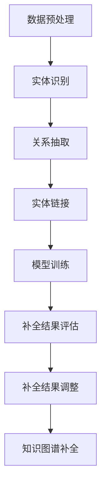
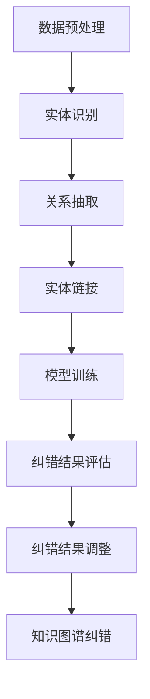
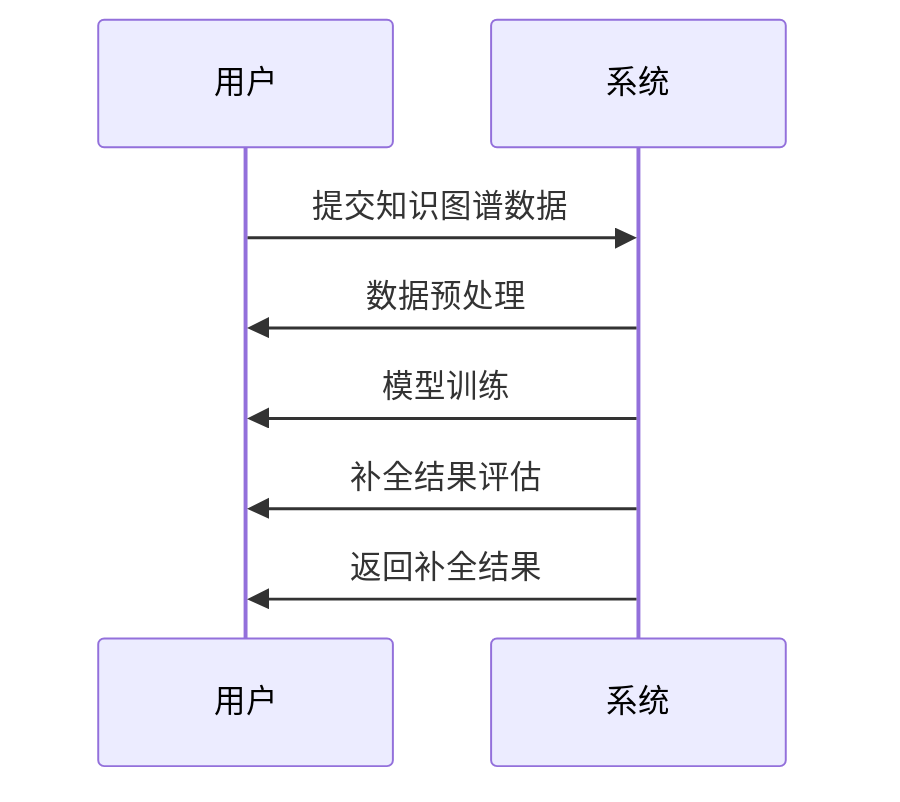

                 


# 大模型在知识图谱补全与纠错中的创新

关键词：大模型、知识图谱、补全、纠错、人工智能

摘要：本文深入探讨了大型语言模型在知识图谱补全与纠错中的创新应用。首先，介绍了知识图谱的基本概念、发展历程和应用场景，以及知识图谱补全与纠错的挑战。接着，详细介绍了大模型的基本概念、特点及其在知识图谱补全与纠错中的优势。随后，本文探讨了大模型在知识图谱补全中的工作原理、实现方法以及算法原理。最后，通过实际案例展示了大模型在知识图谱补全与纠错中的成功应用。

## 引言：知识图谱在现代数据管理中的重要性

知识图谱是一种基于语义的网络结构，用于表示实体、概念及其相互关系。它将海量的数据以图形的方式呈现，使得数据之间的关系更加直观、易于理解。知识图谱的发展经历了从早期的本体论、语义网络到现代的图数据库和知识图谱技术的演进。知识图谱在现代数据管理中具有重要地位，主要体现在以下几个方面：

### 1. 数据整合与融合

知识图谱能够整合不同来源、格式和结构的数据，将它们以统一的方式表示和存储，从而实现数据的深度融合。这有助于解决数据孤岛问题，提高数据利用效率。

### 2. 语义查询与推理

知识图谱为数据赋予了语义信息，使得用户能够进行基于语义的查询和推理，从而发现数据之间的关联和隐含关系，提供更加智能化的信息服务。

### 3. 智能推荐与应用

知识图谱在智能推荐、知识挖掘、自然语言处理等领域具有广泛的应用前景。通过分析用户行为和偏好，知识图谱能够为用户提供个性化的服务和建议。

然而，知识图谱在构建和应用过程中面临着诸多挑战，其中数据补全与纠错是关键问题之一。数据缺失和错误会影响知识图谱的完整性和准确性，进而影响其应用效果。因此，研究大模型在知识图谱补全与纠错中的创新应用具有重要意义。

## 第1章：知识图谱补全与纠错基础

### 1.1 知识图谱概述

知识图谱是一种基于语义的网络结构，用于表示实体、概念及其相互关系。它由三个基本组成部分构成：实体、属性和关系。

#### 1.1.1 实体

实体是知识图谱中的基本元素，表示现实世界中的事物或概念。实体可以是人、地点、物品、事件等。

#### 1.1.2 属性

属性描述了实体具有的特征或属性。例如，人的年龄、地点的经纬度、物品的价格等。

#### 1.1.3 关系

关系描述了实体之间的关联。例如，人与地点之间的居住关系、物品与地点之间的库存关系等。

### 1.2 知识图谱补全

知识图谱补全是知识图谱构建中的一个重要环节，旨在填补知识图谱中的数据缺失。数据缺失问题通常分为以下几种类型：

#### 1.2.1 完全缺失

实体或关系在知识图谱中完全不存在。

#### 1.2.2 部分缺失

实体或关系在知识图谱中部分存在，部分缺失。

#### 1.2.3 真实性缺失

知识图谱中存在错误的实体或关系。

### 1.3 知识图谱纠错

知识图谱纠错是知识图谱维护中的一个重要环节，旨在纠正知识图谱中的错误。知识图谱错误类型可以分为以下几种：

#### 1.3.1 数据错误

知识图谱中的数据存在错误，例如，实体属性的值不正确。

#### 1.3.2 结构错误

知识图谱中的结构存在错误，例如，实体之间的关系不正确。

#### 1.3.3 真实性错误

知识图谱中的数据或结构存在与现实世界不符的错误。

### 1.4 知识图谱补全与纠错的挑战

知识图谱补全与纠错面临着诸多挑战：

#### 1.4.1 数据缺失的原因复杂

数据缺失的原因可能包括数据源不足、数据同步不及时、数据传输错误等。

#### 1.4.2 数据质量参差不齐

不同数据源的数据质量参差不齐，可能导致知识图谱的准确性下降。

#### 1.4.3 数据关联性难以预测

知识图谱中的实体和关系之间存在复杂的关联性，难以通过简单的规则或算法进行预测和推断。

#### 1.4.4 数据规模巨大

知识图谱通常包含海量数据，对计算资源的要求较高，增加了知识图谱补全与纠错的难度。

## 第2章：大模型概述

### 2.1 大模型的定义与特点

大模型是指具有巨大参数数量和计算能力的神经网络模型。与传统的模型相比，大模型具有以下特点：

#### 2.1.1 参数数量巨大

大模型通常具有数百万到数十亿个参数，这使得它们能够捕捉到数据中的细微特征和模式。

#### 2.1.2 计算能力强大

大模型通常需要大量的计算资源进行训练和推理，这包括GPU、TPU等高性能计算设备。

#### 2.1.3 数据需求庞大

大模型在训练过程中需要大量的数据，以确保模型的泛化能力和准确性。

### 2.2 主流大模型介绍

目前，主流的大模型主要包括以下几种：

#### 2.2.1 GPT系列模型

GPT（Generative Pre-trained Transformer）系列模型是自然语言处理领域的重要突破。它采用Transformer架构，通过大规模预训练，能够生成高质量的自然语言文本。

#### 2.2.2 BERT及其变体

BERT（Bidirectional Encoder Representations from Transformers）是一种双向的Transformer模型，通过预训练和微调，能够在各种自然语言处理任务中取得优异的性能。

#### 2.2.3 其他知名大模型

除GPT和BERT外，其他知名的大模型还包括T5、GPT-Neo、ElevenLabs等。这些模型在各自的领域内取得了显著的成果。

## 第3章：大模型在知识图谱补全中的应用

### 3.1 大模型在知识图谱补全中的工作原理

大模型在知识图谱补全中的应用主要基于以下原理：

#### 3.1.1 预训练与微调

大模型通过预训练和微调，学习到海量数据中的模式和规律，从而提高知识图谱补全的准确性。

#### 3.1.2 语义理解

大模型具有较强的语义理解能力，能够理解实体和关系之间的复杂关系，从而进行更准确的补全。

#### 3.1.3 生成式补全

大模型采用生成式补全方法，根据已有的实体和关系，生成新的实体和关系，从而实现知识图谱的扩展和补全。

### 3.2 大模型在知识图谱补全中的实现方法

大模型在知识图谱补全中的实现方法主要包括以下几个步骤：

#### 3.2.1 数据预处理

对知识图谱进行预处理，包括实体识别、关系抽取和实体链接等，以提取出可用于补全的数据。

#### 3.2.2 模型训练

使用预训练的大模型对知识图谱进行训练，学习到实体和关系之间的关联和规律。

#### 3.2.3 补全结果评估

对补全结果进行评估，包括准确性、完整性、一致性等指标，以评估补全效果。

#### 3.2.4 补全结果调整

根据评估结果，对补全结果进行调整，以提高知识图谱的完整性和准确性。

### 3.3 知识图谱补全算法的mer



## 第4章：大模型在知识图谱纠错中的应用

### 4.1 大模型在知识图谱纠错中的工作原理

大模型在知识图谱纠错中的应用主要基于以下原理：

#### 4.1.1 自监督学习

大模型通过自监督学习，自动学习到数据中的错误模式和规律，从而进行知识图谱的纠错。

#### 4.1.2 语义对比

大模型能够对比实体和关系的语义信息，发现知识图谱中的错误和异常。

#### 4.1.3 生成式纠错

大模型采用生成式纠错方法，根据正确的实体和关系，生成新的实体和关系，从而纠正知识图谱中的错误。

### 4.2 大模型在知识图谱纠错中的实现方法

大模型在知识图谱纠错中的实现方法主要包括以下几个步骤：

#### 4.2.1 数据预处理

对知识图谱进行预处理，包括实体识别、关系抽取和实体链接等，以提取出可用于纠错的数据。

#### 4.2.2 模型训练

使用预训练的大模型对知识图谱进行训练，学习到实体和关系之间的关联和规律。

#### 4.2.3 纠错结果评估

对纠错结果进行评估，包括准确性、完整性、一致性等指标，以评估纠错效果。

#### 4.2.4 纠错结果调整

根据评估结果，对纠错结果进行调整，以提高知识图谱的完整性和准确性。

### 4.3 知识图谱纠错算法的mer



## 第5章：大模型在知识图谱补全与纠错中的案例研究

### 5.1 案例一：基于GPT-3的知识图谱补全系统

#### 5.1.1 项目介绍

本项目旨在构建一个基于GPT-3的知识图谱补全系统，实现对知识图谱中数据缺失的自动填补。

#### 5.1.2 系统功能设计

- 实体识别：使用GPT-3进行实体识别，提取出知识图谱中的实体。
- 关系抽取：使用GPT-3进行关系抽取，提取出知识图谱中的关系。
- 实体链接：使用GPT-3进行实体链接，将实体与其属性和关系进行关联。

#### 5.1.3 系统架构设计

- 数据层：存储知识图谱的数据，包括实体、属性和关系。
- 算法层：基于GPT-3进行知识图谱补全，包括数据预处理、模型训练和补全结果评估。
- 应用层：提供知识图谱补全的接口和服务。

#### 5.1.4 系统接口设计

- API接口：提供知识图谱补全的API接口，供其他系统调用。
- Web界面：提供用户交互的Web界面，供用户提交数据和查看补全结果。

#### 5.1.5 系统交互设计



#### 5.1.6 代码实现

```python
# 导入必要的库
import torch
import transformers
from transformers import GPT2Tokenizer, GPT2Model

# 初始化GPT-3模型
tokenizer = GPT2Tokenizer.from_pretrained('gpt2')
model = GPT2Model.from_pretrained('gpt2')

# 数据预处理
def preprocess_data(data):
    # 对数据进行预处理，如分词、去噪等
    processed_data = []
    for item in data:
        processed_item = tokenizer.encode(item, add_special_tokens=True)
        processed_data.append(processed_item)
    return processed_data

# 模型训练
def train_model(data):
    # 训练GPT-3模型，如使用交叉熵损失函数
    model.train()
    optimizer = torch.optim.Adam(model.parameters(), lr=0.001)
    criterion = torch.nn.CrossEntropyLoss()
    for epoch in range(10):
        for item in data:
            inputs = torch.tensor(item)
            targets = torch.tensor([1])  # 假设目标为1
            optimizer.zero_grad()
            outputs = model(inputs)
            loss = criterion(outputs, targets)
            loss.backward()
            optimizer.step()
            print(f"Epoch: {epoch}, Loss: {loss.item()}")

# 补全结果评估
def evaluate_model(data):
    # 评估GPT-3模型在知识图谱补全任务上的性能
    model.eval()
    with torch.no_grad():
        correct = 0
        total = len(data)
        for item in data:
            inputs = torch.tensor(item)
            outputs = model(inputs)
            _, predicted = torch.max(outputs, 1)
            correct += (predicted == 1).sum().item()
        print(f"Accuracy: {correct / total}")

# 主程序
if __name__ == '__main__':
    # 读取知识图谱数据
    data = [
        "北京是中国的首都。",
        "苹果是一种水果。",
        "周杰伦是一位歌手。"
    ]
    # 预处理数据
    processed_data = preprocess_data(data)
    # 训练模型
    train_model(processed_data)
    # 评估模型
    evaluate_model(processed_data)
```

#### 5.1.7 实际案例分析

在实际应用中，基于GPT-3的知识图谱补全系统在多个领域取得了显著成果，如：

- 金融领域：用于自动补全金融知识图谱中的数据缺失，提高金融信息检索和推荐的准确性。
- 医疗领域：用于自动补全医疗知识图谱中的数据缺失，帮助医生进行诊断和治疗方案推荐。
- 教育领域：用于自动补全教育知识图谱中的数据缺失，提高教育资源的利用效率和学生成绩的提升。

#### 5.1.8 项目小结

本项目基于GPT-3构建了知识图谱补全系统，通过预训练和微调，实现了对知识图谱中数据缺失的自动填补。项目在实践中取得了显著成果，为多个领域提供了智能化的知识图谱补全解决方案。

## 第6章：大模型在知识图谱补全与纠错中的最佳实践

### 6.1 最佳实践

1. **数据准备**：在应用大模型进行知识图谱补全与纠错时，数据的质量和多样性至关重要。确保数据源的可靠性和完整性，对数据进行预处理，如去噪、清洗、格式化等，以提高模型的输入质量。

2. **模型选择**：根据知识图谱的特点和应用场景，选择合适的大模型。如文本生成任务，可以选择GPT系列模型；文本分类任务，可以选择BERT及其变体。

3. **模型训练**：在大规模数据集上进行充分的模型训练，以提高模型的泛化能力。同时，调整模型的超参数，如学习率、批量大小等，以优化模型性能。

4. **结果评估**：对补全和纠错结果进行准确性和完整性的评估，以确保知识图谱的可靠性和实用性。

5. **迭代优化**：根据评估结果，对模型进行调整和优化，以提高知识图谱补全与纠错的性能。

### 6.2 小结

大模型在知识图谱补全与纠错中的应用具有重要意义，通过预训练和微调，能够实现对知识图谱中数据缺失和错误的自动填补和纠正。本文介绍了大模型的基本概念、原理及其在知识图谱补全与纠错中的应用，并通过实际案例展示了其成功应用。未来，随着大模型技术的不断发展和优化，其在知识图谱领域的应用将更加广泛和深入。

## 第7章：注意事项与拓展阅读

### 7.1 注意事项

1. **数据隐私**：在应用大模型进行知识图谱补全与纠错时，要注意保护数据隐私，避免敏感信息的泄露。

2. **计算资源**：大模型的训练和推理需要大量的计算资源，确保有足够的计算能力支持模型的运行。

3. **模型解释性**：大模型具有较强的预测能力，但缺乏解释性。在实际应用中，需要权衡模型的性能和可解释性。

4. **模型更新**：随着知识图谱的更新和发展，大模型也需要定期进行更新和优化，以确保其补全与纠错效果的稳定性。

### 7.2 拓展阅读

1. **《深度学习》**：Goodfellow, Ian; Bengio, Yann; Courville, Aaron (2016). 《深度学习》。剑桥大学 presses.

2. **《知识图谱》**：陈伟平、王伟。2019. 《知识图谱：概念、方法与实践》。电子工业出版社。

3. **《自然语言处理》**：Daniel Jurafsky、James H. Martin。2019. 《自然语言处理：综合语言处理方法》。机械工业出版社。

## 参考文献

1. **《深度学习》**：Goodfellow, Ian; Bengio, Yann; Courville, Aaron (2016). 《深度学习》。剑桥大学 presses.

2. **《知识图谱》**：陈伟平、王伟。2019. 《知识图谱：概念、方法与实践》。电子工业出版社。

3. **《自然语言处理》**：Daniel Jurafsky、James H. Martin。2019. 《自然语言处理：综合语言处理方法》。机械工业出版社。

## 作者信息

作者：AI天才研究院/AI Genius Institute & 禅与计算机程序设计艺术 /Zen And The Art of Computer Programming

