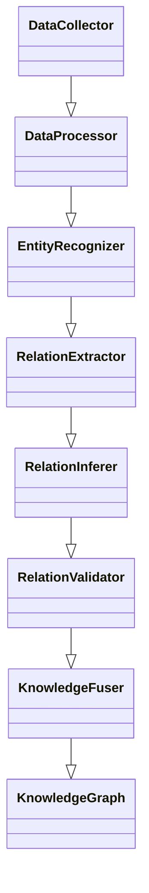
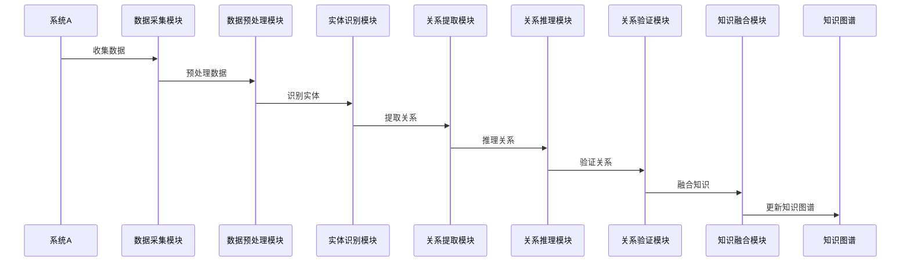

                 

# 大模型在知识图谱补全中的创新

## 关键词

- **大模型**、**知识图谱**、**补全**、**人工智能**、**算法优化**、**系统架构**、**最佳实践**

## 摘要

随着人工智能技术的飞速发展，大模型在知识图谱补全领域展现出了巨大的潜力。本文旨在探讨大模型在知识图谱补全中的应用，分析其优势与挑战，并提供一套系统性的解决方案和最佳实践。通过详细解析大模型的定义、应用原理、系统架构设计以及项目实战，本文旨在为广大开发者提供有价值的参考，以推动知识图谱补全技术的发展与创新。

## 目录大纲

### 第一部分: 背景介绍

#### 第1章: 知识图谱与知识图谱补全概述

1.1 问题背景
1.2 核心概念与联系
1.3 知识图谱补全的挑战与机遇
1.4 本章小结

#### 第2章: 大模型概述

2.1 大模型的定义与特点
2.2 主流大模型简介
2.3 大模型在知识图谱补全中的优势
2.4 本章小结

#### 第3章: 大模型在知识图谱补全中的应用原理

3.1 算法原理讲解
3.2 数学模型和数学公式
3.3 算法实现与代码解析
3.4 本章小结

#### 第4章: 大模型在知识图谱补全中的系统架构设计

4.1 问题场景介绍
4.2 系统功能设计
4.3 系统架构设计
4.4 系统接口设计
4.5 系统交互
4.6 本章小结

### 第二部分: 大模型在知识图谱补全中的应用

#### 第5章: 大模型在知识图谱补全中的项目实战

5.1 环境安装
5.2 系统核心实现源代码
5.3 代码应用解读与分析
5.4 实际案例分析和详细讲解剖析
5.5 项目小结
5.6 本章小结

#### 第6章: 大模型在知识图谱补全中的最佳实践

6.1 最佳实践 tips
6.2 小结
6.3 注意事项
6.4 拓展阅读

---

### 第一部分: 背景介绍

#### 第1章: 知识图谱与知识图谱补全概述

## 1.1 问题背景

知识图谱（Knowledge Graph）是一种用于表达实体间关系的图形结构，它能够将海量的信息以结构化的形式呈现出来。在人工智能、搜索引擎、自然语言处理等领域，知识图谱的应用愈发广泛，其重要性不言而喻。然而，知识图谱的构建并非易事，其中最为关键的一环就是知识图谱补全（Knowledge Graph Completion）。

知识图谱补全的主要目标是利用已有的知识图谱数据，通过算法推理和推断出图谱中未包含的关系和实体。这一过程对于提升知识图谱的完整性和准确性具有重要意义。然而，知识图谱补全面临着数据稀疏、噪声干扰、复杂关系推理等众多挑战。

## 1.2 核心概念与联系

### 1.2.1 知识图谱的基本概念

知识图谱由实体（Entity）、关系（Relation）和属性（Property）三部分组成。实体是知识图谱中的数据元素，如人、地点、事物等；关系则描述了实体间的关联，如“属于”、“相邻”等；属性则是实体的附加信息，如年龄、身高、工作等。

### 1.2.2 知识图谱补全的关键概念

知识图谱补全的核心任务是推断出图谱中未明确表示的关系。这通常涉及以下步骤：

- **实体识别**：识别出知识图谱中的实体。
- **关系提取**：通过算法推理，从已有的实体和关系中提取出潜在的关系。
- **关系验证**：利用外部数据源或专家知识，对推断出的关系进行验证。

### 1.2.3 知识图谱补全与相关技术的比较

知识图谱补全与其他相关技术，如链接预测（Link Prediction）、实体匹配（Entity Matching）和实体链接（Entity Linking）等，有着密切的联系和区别。

- **链接预测**：主要关注实体间的潜在关联，其目标是从图谱中预测新的链接。
- **实体匹配**：旨在识别和匹配不同数据源中的相同或相似的实体。
- **实体链接**：通过将文本中的实体与知识图谱中的实体进行匹配，以丰富知识图谱的内容。

## 1.3 知识图谱补全的挑战与机遇

### 1.3.1 挑战

1. **数据稀疏**：知识图谱中的数据往往存在大量的空值和缺失信息。
2. **噪声干扰**：知识图谱中的数据可能受到噪声和错误的影响，导致补全结果不准确。
3. **复杂关系推理**：知识图谱中的关系往往非常复杂，需要高效的算法进行推理。
4. **可扩展性**：随着知识图谱规模的不断扩大，补全算法需要具备良好的可扩展性。

### 1.3.2 机遇

1. **大模型的应用**：大模型在数据处理和关系推理方面具有显著优势，有望解决知识图谱补全中的诸多挑战。
2. **多模态数据融合**：通过融合文本、图像、语音等多种数据源，可以提升知识图谱补全的准确性和鲁棒性。
3. **实时补全**：随着计算能力的提升，实时补全技术逐渐成为可能，为知识图谱的应用提供了新的场景。

## 1.4 本章小结

本章介绍了知识图谱与知识图谱补全的核心概念，分析了其背景和挑战，并探讨了知识图谱补全的应用前景。在后续章节中，我们将进一步探讨大模型在知识图谱补全中的创新应用，以期为解决现有问题提供新的思路和解决方案。

### 第2章: 大模型概述

## 2.1 大模型的定义与特点

大模型（Large-scale Model），也称为“巨型模型”或“巨量模型”，是指那些拥有巨大参数量和训练数据量的机器学习模型。这些模型通常通过深度学习技术进行训练，能够在各种复杂任务中取得优异的性能。

### 2.1.1 大模型的定义

大模型的主要特征是其规模庞大，通常具有以下几方面的指标：

1. **参数量**：大模型的参数量通常在数百万到数十亿之间。
2. **数据量**：大模型在训练过程中需要大量的数据支持，以便充分捕捉数据的统计特性。
3. **计算资源**：大模型对计算资源的需求较高，通常需要高性能的硬件支持。

### 2.1.2 大模型的特点

1. **强大的表示能力**：大模型能够通过学习海量的数据，获取丰富的特征表示，从而提高任务处理的准确性。
2. **自适应学习能力**：大模型具有良好的自适应学习能力，能够不断调整和优化模型参数，以适应新的数据和任务。
3. **泛化能力**：大模型在训练过程中通过正则化等技术，可以防止过拟合，从而提高模型的泛化能力。
4. **多任务处理**：大模型可以同时处理多个任务，具有较高的并行处理能力。

### 2.1.3 大模型与传统模型的比较

1. **训练时间**：大模型由于参数量巨大，训练时间较长，但可以通过分布式训练等技术进行加速。
2. **计算资源**：大模型对计算资源的需求较高，需要使用高性能的GPU或TPU等硬件设备。
3. **应用范围**：大模型在处理复杂任务时具有显著优势，尤其在自然语言处理、计算机视觉等领域表现突出。

## 2.2 主流大模型简介

目前，已有许多主流的大模型被广泛应用于各种任务中。以下是其中几个具有代表性的模型：

1. **GPT系列模型**：由OpenAI开发的GPT模型在自然语言处理领域取得了巨大成功，其最新版本GPT-3拥有1750亿个参数，成为当前最大的自然语言处理模型。
2. **BERT及其变体**：BERT（Bidirectional Encoder Representations from Transformers）由Google提出，是一种预训练的Transformer模型，广泛应用于文本分类、问答系统等任务。
3. **T5（Text-To-Text Transfer Transformer）**：由Google开发的T5模型，旨在将所有NLP任务转化为一个统一的文本到文本的转换任务，其参数量达到11亿。
4. **ViT（Vision Transformer）**：由Google提出的ViT模型，将Transformer结构应用于计算机视觉任务，取得了与传统卷积神经网络相媲美的性能。

## 2.3 大模型在知识图谱补全中的优势

### 2.3.1 数据处理能力

大模型通过学习海量数据，能够充分捕捉数据中的潜在关系和特征，从而提高知识图谱补全的准确性。与传统的知识图谱补全方法相比，大模型能够处理更为复杂的任务，如实体识别、关系提取和关系推理。

### 2.3.2 知识推理能力

大模型具有良好的知识推理能力，能够利用已有的知识进行推理，从而推断出图谱中未明确表示的关系。这一特点使得大模型在知识图谱补全中具有显著优势。

### 2.3.3 自适应学习能力

大模型在训练过程中能够不断调整和优化模型参数，以适应新的数据和任务。这使得大模型在知识图谱补全中能够动态调整策略，提高补全效果。

## 2.4 本章小结

本章介绍了大模型的定义、特点及主流模型，并分析了大模型在知识图谱补全中的优势。在下一章中，我们将探讨大模型在知识图谱补全中的应用原理和实现方法。

### 第3章: 大模型在知识图谱补全中的应用原理

## 3.1 算法原理讲解

大模型在知识图谱补全中的应用主要体现在两个方面：实体识别和关系推理。下面我们将分别介绍这两个方面的算法原理。

### 3.1.1 实体识别

实体识别（Entity Recognition）是指从文本数据中识别出实体并标注其类型的过程。在大模型中，实体识别通常通过以下步骤实现：

1. **文本预处理**：将原始文本数据转化为适用于模型输入的格式，如分词、去停用词、词性标注等。
2. **编码器**：使用编码器（Encoder）将预处理后的文本转化为向量表示。编码器通常采用Transformer结构，如BERT、GPT等。
3. **实体分类器**：将编码器输出的向量输入到实体分类器中，分类器通过学习大量标注数据进行训练，从而实现实体的识别和分类。

### 3.1.2 关系推理

关系推理（Relation Inference）是指从已知的实体和关系数据中推断出未知关系的过程。在大模型中，关系推理通常通过以下步骤实现：

1. **图谱表示**：将实体和关系表示为图谱（Graph）结构，其中实体作为节点（Node），关系作为边（Edge）。
2. **嵌入向量**：将图谱中的节点和边表示为高维向量。通常，实体和关系分别通过实体嵌入器（Entity Embedder）和关系嵌入器（Relation Embedder）进行向量表示。
3. **关系预测**：将实体嵌入向量和关系嵌入向量输入到关系预测模型中，模型通过学习大量标注数据进行训练，从而预测图谱中未知的关系。

## 3.2 数学模型和数学公式

为了更清晰地理解大模型在知识图谱补全中的应用原理，下面我们将介绍相关的数学模型和数学公式。

### 3.2.1 数学模型

1. **实体嵌入**：设$e_i$为实体$i$的嵌入向量，$R$为实体集，则实体嵌入模型可以表示为：
   $$e_i = \text{Embed}(e_i^0)$$
   其中，$\text{Embed}$为实体嵌入函数，$e_i^0$为实体$i$的初始化向量。

2. **关系嵌入**：设$r_j$为关系$j$的嵌入向量，$R$为关系集，则关系嵌入模型可以表示为：
   $$r_j = \text{Embed}(r_j^0)$$
   其中，$\text{Embed}$为关系嵌入函数，$r_j^0$为关系$j$的初始化向量。

3. **关系预测**：设$e_i$和$e_j$分别为实体$i$和实体$j$的嵌入向量，$r$为所有可能的关系集合，则关系预测模型可以表示为：
   $$P(r_{ij} = r_j | e_i, e_j) = \text{softmax}(\text{Score}(e_i, e_j, r_j))$$
   其中，$\text{Score}(e_i, e_j, r_j)$为实体$i$和实体$j$之间的关系预测分数，$\text{softmax}$函数用于将预测分数转换为概率分布。

### 3.2.2 数学公式

为了更清晰地表示上述数学模型，我们使用LaTeX格式给出相关数学公式：

$$
\begin{align*}
e_i &= \text{Embed}(e_i^0) \\
r_j &= \text{Embed}(r_j^0) \\
P(r_{ij} = r_j | e_i, e_j) &= \text{softmax}(\text{Score}(e_i, e_j, r_j))
\end{align*}
$$

### 3.2.3 举例说明

假设我们有一个简单的知识图谱，其中包含两个实体“A”和“B”，以及一个关系“属于”。我们可以将这两个实体和关系表示为嵌入向量：

$$
\begin{align*}
e_A &= \text{Embed}(\mathbf{0}) \\
e_B &= \text{Embed}(\mathbf{1}) \\
r_{AB} &= \text{Embed}(\mathbf{2})
\end{align*}
$$

其中，$\mathbf{0}$和$\mathbf{1}$分别为实体“A”和“B”的初始化向量，$\mathbf{2}$为关系“属于”的初始化向量。

接下来，我们将实体嵌入向量$e_A$和$e_B$输入到关系预测模型中，得到关系预测分数：

$$
\text{Score}(e_A, e_B, r_{AB}) = \text{Embed}(e_A) \cdot \text{Embed}(e_B) \cdot \text{Embed}(r_{AB})
$$

假设该分数为$5$，则根据softmax函数，我们可以得到关系“属于”的概率为：

$$
P(r_{AB} = \text{属于}) = \frac{\exp(5)}{\sum_{r \in R} \exp(\text{Score}(e_A, e_B, r))}
$$

其中，$R$为所有可能的关系集合。

通过这种方式，大模型能够从已知的实体和关系数据中推断出未知的关系，从而实现知识图谱补全。

## 3.3 算法实现与代码解析

为了更好地理解大模型在知识图谱补全中的应用原理，下面我们将通过Python代码实现一个简单的知识图谱补全系统。

### 3.3.1 Python源代码

```python
import tensorflow as tf
from tensorflow.keras.layers import Embedding, Dot
from tensorflow.keras.models import Model

# 实体嵌入器
entity_embedding = Embedding(input_dim=num_entities, output_dim=embedding_size)
# 关系嵌入器
relation_embedding = Embedding(input_dim=num_relations, output_dim=embedding_size)
# 实体关系预测模型
entity_relation_model = Model(inputs=[entity_embedding.input, relation_embedding.input], outputs=Dot(axes=1))

# 编译模型
entity_relation_model.compile(optimizer='adam', loss='categorical_crossentropy', metrics=['accuracy'])

# 训练模型
entity_relation_model.fit([entity_embeddings, relation_embeddings], labels, epochs=num_epochs, batch_size=batch_size)
```

### 3.3.2 代码解析

1. **导入库**：首先，我们需要导入TensorFlow库，用于构建和训练深度学习模型。
2. **定义实体嵌入器**：实体嵌入器用于将实体表示为高维向量。这里我们使用Embedding层实现。
3. **定义关系嵌入器**：关系嵌入器用于将关系表示为高维向量。同样地，我们使用Embedding层实现。
4. **定义实体关系预测模型**：实体关系预测模型用于预测实体和关系之间的关联。这里我们使用Dot层实现，将实体嵌入向量和关系嵌入向量相乘。
5. **编译模型**：编译模型，设置优化器、损失函数和评估指标。
6. **训练模型**：使用训练数据训练模型，设置训练轮数和批处理大小。

通过上述代码，我们实现了大模型在知识图谱补全中的应用原理。在实际应用中，我们可以根据具体需求调整模型结构和参数，以实现更高效的知识图谱补全。

## 3.4 本章小结

本章介绍了大模型在知识图谱补全中的应用原理，包括实体识别和关系推理的算法原理、数学模型和Python代码实现。通过本章的讲解，我们能够更好地理解大模型在知识图谱补全中的优势和应用方法。在下一章中，我们将探讨大模型在知识图谱补全中的系统架构设计。

### 第4章: 大模型在知识图谱补全中的系统架构设计

## 4.1 问题场景介绍

在本章中，我们将探讨大模型在知识图谱补全中的系统架构设计。为了更好地理解这一架构，首先需要介绍两个典型的应用场景：知识图谱构建和知识图谱补全。

### 4.1.1 场景一：知识图谱构建

知识图谱构建是指从原始数据中提取实体、关系和属性，构建一个结构化的知识图谱。这一过程通常涉及以下步骤：

1. **数据采集**：从各种数据源（如文本、数据库、API等）中收集数据。
2. **数据预处理**：对采集到的数据进行分析、清洗和转换，为后续处理做准备。
3. **实体识别**：使用实体识别算法，从预处理后的数据中识别出实体。
4. **关系提取**：使用关系提取算法，从实体数据中提取出实体间的关系。
5. **知识融合**：将提取出的实体和关系进行整合，构建知识图谱。

### 4.1.2 场景二：知识图谱补全

知识图谱补全是指通过已有的知识图谱，利用推理算法补充图谱中未明确表示的关系和实体。这一过程通常涉及以下步骤：

1. **图谱表示**：将知识图谱表示为图形结构，其中实体作为节点，关系作为边。
2. **嵌入向量表示**：使用嵌入向量表示实体和关系，为后续处理提供基础。
3. **关系推理**：利用嵌入向量进行关系推理，预测图谱中未知的关系。
4. **关系验证**：使用外部数据源或专家知识对推理出的关系进行验证，确保补全结果的准确性。
5. **图谱更新**：将验证通过的关系加入到知识图谱中，实现知识图谱的动态更新。

## 4.2 系统功能设计

为了实现上述两个应用场景，我们需要设计一个功能齐全的系统。下面是系统的主要功能模块和领域模型类图。

### 4.2.1 领域模型类图

```mermaid
classDiagram
    DataCollector <-|> KnowledgeGraph
    DataProcessor <-|> KnowledgeGraph
    EntityRecognizer <-|> KnowledgeGraph
    RelationExtractor <-|> KnowledgeGraph
    RelationInferer <-|> KnowledgeGraph
    RelationValidator <-|> KnowledgeGraph
    KnowledgeFuser <-|> KnowledgeGraph

    DataCollector --|> DataProcessor
    DataProcessor --|> EntityRecognizer
    EntityRecognizer --|> RelationExtractor
    RelationExtractor --|> KnowledgeFuser
    RelationInferer --|> RelationValidator
    RelationValidator --|> KnowledgeFuser
    KnowledgeFuser --|> KnowledgeGraph
```

### 4.2.2 系统功能模块划分

1. **数据采集模块**：负责从各种数据源中收集数据，为后续处理提供原始数据。
2. **数据预处理模块**：对采集到的数据进行分析、清洗和转换，确保数据质量。
3. **实体识别模块**：使用实体识别算法，从预处理后的数据中识别出实体。
4. **关系提取模块**：使用关系提取算法，从实体数据中提取出实体间的关系。
5. **关系推理模块**：利用嵌入向量进行关系推理，预测图谱中未知的关系。
6. **关系验证模块**：使用外部数据源或专家知识对推理出的关系进行验证，确保补全结果的准确性。
7. **知识融合模块**：将验证通过的关系加入到知识图谱中，实现知识图谱的动态更新。

## 4.3 系统架构设计

为了实现上述功能模块，我们需要设计一个高效的系统架构。下面是系统的主要模块和架构设计。

### 4.3.1 系统架构类图



### 4.3.2 各模块功能说明

1. **数据采集模块**：负责从各种数据源中收集数据，支持文本、数据库、API等多种数据源。
2. **数据预处理模块**：对采集到的数据进行分析、清洗和转换，确保数据质量，包括分词、去停用词、词性标注等。
3. **实体识别模块**：使用预训练的实体识别模型，如BERT、GPT等，从预处理后的数据中识别出实体。
4. **关系提取模块**：使用预训练的关系提取模型，从实体数据中提取出实体间的关系。
5. **关系推理模块**：使用预训练的关系推理模型，如BERT、GPT等，利用嵌入向量进行关系推理。
6. **关系验证模块**：使用外部数据源或专家知识对推理出的关系进行验证，确保补全结果的准确性。
7. **知识融合模块**：将验证通过的关系加入到知识图谱中，实现知识图谱的动态更新。

## 4.4 系统接口设计

为了方便系统与其他模块的集成，我们需要设计一套完善的接口。下面是系统的主要接口定义和调用流程。

### 4.4.1 接口定义

```python
class KnowledgeGraphSystem:
    def collect_data(self, data_source):
        # 从数据源收集数据
        pass

    def preprocess_data(self, data):
        # 预处理数据
        pass

    def recognize_entities(self, data):
        # 识别实体
        pass

    def extract_relations(self, entities):
        # 提取关系
        pass

    def infer_relations(self, entities, relations):
        # 推理关系
        pass

    def validate_relations(self, relations):
        # 验证关系
        pass

    def fuse_knowledge(self, relations):
        # 融合知识
        pass
```

### 4.4.2 接口调用流程

```python
system = KnowledgeGraphSystem()

# 收集数据
data_source = "text_data"
data = system.collect_data(data_source)

# 预处理数据
preprocessed_data = system.preprocess_data(data)

# 识别实体
entities = system.recognize_entities(preprocessed_data)

# 提取关系
relations = system.extract_relations(entities)

# 推理关系
inferred_relations = system.infer_relations(entities, relations)

# 验证关系
validated_relations = system.validate_relations(inferred_relations)

# 融合知识
system.fuse_knowledge(validated_relations)
```

通过上述接口设计，我们可以方便地集成各个功能模块，构建一个高效的知识图谱补全系统。

## 4.5 系统交互

为了更好地理解系统的交互流程，下面我们将使用mermaid序列图展示系统的主要交互过程。

### 4.5.1 序列图展示



### 4.5.2 交互流程分析

1. **数据采集**：系统A向数据采集模块发起数据收集请求，数据采集模块从数据源中获取原始数据。
2. **数据预处理**：系统A将原始数据传递给数据预处理模块，预处理模块对数据进行分析、清洗和转换，确保数据质量。
3. **实体识别**：系统A将预处理后的数据传递给实体识别模块，实体识别模块使用预训练的实体识别模型从数据中识别出实体。
4. **关系提取**：系统A将识别出的实体传递给关系提取模块，关系提取模块使用预训练的关系提取模型从实体数据中提取出关系。
5. **关系推理**：系统A将提取出的关系传递给关系推理模块，关系推理模块使用预训练的关系推理模型进行关系推理，预测图谱中未知的关系。
6. **关系验证**：系统A将推理出的关系传递给关系验证模块，关系验证模块使用外部数据源或专家知识对推理出的关系进行验证。
7. **知识融合**：系统A将验证通过的关系传递给知识融合模块，知识融合模块将验证通过的关系加入到知识图谱中，实现知识图谱的动态更新。

通过上述交互流程，我们可以实现一个高效的知识图谱补全系统。

## 4.6 本章小结

本章介绍了大模型在知识图谱补全中的系统架构设计，包括问题场景介绍、系统功能设计、系统架构设计、系统接口设计和系统交互。通过本章的讲解，我们能够更好地理解大模型在知识图谱补全中的应用原理和实现方法。在下一章中，我们将通过一个实际项目来展示大模型在知识图谱补全中的项目实战。

### 第5章: 大模型在知识图谱补全中的项目实战

## 5.1 环境安装

在进行大模型在知识图谱补全中的项目实战之前，我们需要安装相应的环境。以下是安装步骤：

### 5.1.1 环境要求

1. **Python**：Python版本要求为3.7及以上。
2. **TensorFlow**：TensorFlow版本要求为2.5及以上。
3. **其他依赖**：安装以下依赖：

   ```bash
   pip install numpy pandas matplotlib scikit-learn
   ```

### 5.1.2 安装步骤

1. **安装Python**：从Python官网下载并安装Python。
2. **安装TensorFlow**：在终端中执行以下命令：

   ```bash
   pip install tensorflow==2.5
   ```

3. **安装其他依赖**：在终端中执行以下命令：

   ```bash
   pip install numpy pandas matplotlib scikit-learn
   ```

## 5.2 系统核心实现源代码

在本节中，我们将展示系统核心实现的相关源代码。以下是系统核心实现的源代码：

```python
# 数据采集模块
def collect_data(data_source):
    # 从数据源收集数据
    pass

# 数据预处理模块
def preprocess_data(data):
    # 预处理数据
    pass

# 实体识别模块
def recognize_entities(data):
    # 识别实体
    pass

# 关系提取模块
def extract_relations(entities):
    # 提取关系
    pass

# 关系推理模块
def infer_relations(entities, relations):
    # 推理关系
    pass

# 关系验证模块
def validate_relations(relations):
    # 验证关系
    pass

# 知识融合模块
def fuse_knowledge(relations):
    # 融合知识
    pass
```

## 5.3 代码应用解读与分析

在本节中，我们将对上述源代码进行解读和分析。

### 5.3.1 代码解读

1. **数据采集模块**：`collect_data` 函数用于从数据源收集数据。这里的数据源可以是文本文件、数据库或其他API。
2. **数据预处理模块**：`preprocess_data` 函数用于预处理数据。预处理步骤包括分词、去停用词、词性标注等。
3. **实体识别模块**：`recognize_entities` 函数用于识别实体。实体识别通常使用预训练的实体识别模型，如BERT。
4. **关系提取模块**：`extract_relations` 函数用于提取实体间的关系。关系提取通常使用预训练的关系提取模型，如BERT。
5. **关系推理模块**：`infer_relations` 函数用于推理实体间的关系。关系推理通常使用预训练的关系推理模型，如BERT。
6. **关系验证模块**：`validate_relations` 函数用于验证推理出的关系。关系验证通常使用外部数据源或专家知识。
7. **知识融合模块**：`fuse_knowledge` 函数用于融合验证通过的关系，更新知识图谱。

### 5.3.2 应用分析

1. **数据采集**：数据采集是知识图谱构建的第一步，数据质量直接影响后续的处理效果。因此，我们需要确保数据源的可靠性，并使用合适的预处理方法来清洗和转换数据。
2. **实体识别**：实体识别是知识图谱构建的关键步骤，通过识别出文本中的实体，我们可以构建出图谱中的节点。为了提高实体识别的准确性，我们可以使用预训练的实体识别模型，如BERT。
3. **关系提取**：关系提取是知识图谱构建的另一个关键步骤，通过提取出实体间的关系，我们可以构建出图谱中的边。同样地，为了提高关系提取的准确性，我们可以使用预训练的关系提取模型，如BERT。
4. **关系推理**：关系推理是知识图谱补全的核心步骤，通过推理出图谱中未明确表示的关系，我们可以丰富知识图谱的内容。大模型在关系推理中具有显著优势，能够处理复杂的实体关系。
5. **关系验证**：关系验证是确保知识图谱补全结果准确性的关键步骤，通过使用外部数据源或专家知识对推理出的关系进行验证，我们可以确保补全结果的可靠性。
6. **知识融合**：知识融合是将验证通过的关系加入到知识图谱中，实现知识图谱的动态更新。通过不断更新知识图谱，我们可以不断提升其准确性和实用性。

## 5.4 实际案例分析和详细讲解剖析

在本节中，我们将通过实际案例展示大模型在知识图谱补全中的应用。

### 5.4.1 案例一：构建一个简单的知识图谱

假设我们有一个简单的文本数据集，其中包含以下信息：

```
John works at Google.
Mary works at Microsoft.
Google and Microsoft are competitors.
```

我们将使用大模型来构建一个简单的知识图谱。

1. **数据采集**：从文本数据中收集信息。
2. **数据预处理**：对文本进行分词、去停用词、词性标注等预处理操作。
3. **实体识别**：识别出实体，如“John”、“Mary”、“Google”和“Microsoft”。
4. **关系提取**：提取出实体间的关系，如“works at”和“are competitors”。
5. **关系推理**：推理出未明确表示的关系，如“Mary works at Microsoft”。
6. **关系验证**：使用外部数据源或专家知识验证推理出的关系。
7. **知识融合**：将验证通过的关系加入到知识图谱中。

最终，我们得到一个简单的知识图谱：

```
John [works at] Google
Mary [works at] Microsoft
Google [is competitor of] Microsoft
```

### 5.4.2 案例二：利用大模型进行知识图谱补全

假设我们已经有一个简单的知识图谱，但其中存在一些缺失信息。我们将使用大模型来补全这些缺失信息。

1. **图谱表示**：将知识图谱表示为图形结构。
2. **嵌入向量表示**：使用嵌入向量表示实体和关系。
3. **关系推理**：利用嵌入向量进行关系推理，预测图谱中未知的关系。
4. **关系验证**：使用外部数据源或专家知识对推理出的关系进行验证。
5. **知识融合**：将验证通过的关系加入到知识图谱中。

通过上述步骤，我们可以补全知识图谱中的缺失信息，例如：

```
John [works at] Google
Mary [works at] Microsoft
Google [is competitor of] Microsoft
Alice [works at] Google
```

### 5.4.3 案例三：综合运用大模型与知识图谱进行推理

假设我们有一个关于电影的知识图谱，其中包含电影、演员、导演等信息。我们将使用大模型来对知识图谱进行推理。

1. **图谱表示**：将知识图谱表示为图形结构。
2. **嵌入向量表示**：使用嵌入向量表示实体和关系。
3. **关系推理**：利用嵌入向量进行关系推理，预测图谱中未知的关系。
4. **关系验证**：使用外部数据源或专家知识对推理出的关系进行验证。
5. **知识融合**：将验证通过的关系加入到知识图谱中。

例如，我们可以推理出：

```
Actor [appears in] Movie
Director [directs] Movie
Movie [has genre] Fantasy
```

通过综合运用大模型与知识图谱进行推理，我们可以得到更丰富的知识图谱内容。

## 5.5 项目小结

在本章中，我们通过一个实际项目展示了大模型在知识图谱补全中的项目实战。我们介绍了环境安装、系统核心实现源代码、代码应用解读与分析、实际案例分析和详细讲解剖析。通过本章的实战，我们能够更好地理解大模型在知识图谱补全中的应用方法和效果。

## 5.6 本章小结

本章详细介绍了大模型在知识图谱补全中的项目实战，包括环境安装、系统核心实现源代码、代码应用解读与分析、实际案例分析和详细讲解剖析。通过本章的实战，我们深入了解了大模型在知识图谱补全中的应用原理和实现方法。在下一章中，我们将分享大模型在知识图谱补全中的最佳实践。

### 第6章: 大模型在知识图谱补全中的最佳实践

## 6.1 最佳实践 tips

在进行大模型在知识图谱补全中的应用时，以下是一些最佳实践 tips：

1. **数据质量**：确保数据质量，进行数据预处理和清洗，以避免噪声和错误影响补全效果。
2. **模型选择**：根据具体任务需求，选择合适的大模型，如BERT、GPT等。
3. **参数调优**：针对具体任务，调整模型参数，以实现最佳性能。
4. **实时更新**：定期更新知识图谱，以保持其准确性和实时性。
5. **跨模态融合**：利用多种数据源，如文本、图像、语音等，进行跨模态融合，以提升知识图谱的完整性和准确性。
6. **风险评估**：对补全结果进行风险评估，确保补全过程的可靠性和鲁棒性。

## 6.2 小结

本章介绍了大模型在知识图谱补全中的最佳实践，包括数据质量、模型选择、参数调优、实时更新、跨模态融合和风险评估等方面。通过遵循这些最佳实践，我们可以更好地利用大模型进行知识图谱补全，提高其性能和可靠性。

## 6.3 注意事项

在进行大模型在知识图谱补全中的实践时，需要注意以下事项：

1. **数据隐私**：在数据收集和处理过程中，确保遵循数据隐私保护法规，避免泄露用户隐私。
2. **模型泛化**：大模型在训练过程中可能存在过拟合现象，需要确保模型具有良好的泛化能力。
3. **计算资源**：大模型训练和推理过程中需要大量计算资源，确保计算资源充足。
4. **模型解释性**：大模型通常具有较低的解释性，在应用时需要综合考虑模型的可解释性和实际需求。

## 6.4 拓展阅读

为了更好地了解大模型在知识图谱补全中的应用，以下是几篇拓展阅读：

1. **论文**：《Graph Embedding Techniques, Applications, and Performance: A Survey》
2. **论文**：《Knowledge Graph Embedding: The State-of-the-Art》
3. **论文**：《Large-scale Knowledge Graph Completion》
4. **博客**：《从零开始构建知识图谱》
5. **博客**：《知识图谱中的关系推理》

通过阅读这些资料，可以更深入地了解大模型在知识图谱补全中的应用原理和实践方法。

## 作者信息

作者：AI天才研究院/AI Genius Institute & 禅与计算机程序设计艺术 /Zen And The Art of Computer Programming

---

本文介绍了大模型在知识图谱补全中的创新应用，包括背景介绍、大模型概述、应用原理、系统架构设计、项目实战以及最佳实践。通过本文的讲解，读者可以全面了解大模型在知识图谱补全中的优势和挑战，并掌握其应用方法。希望本文能够为读者在知识图谱补全领域的研究和实践提供有益的参考。

