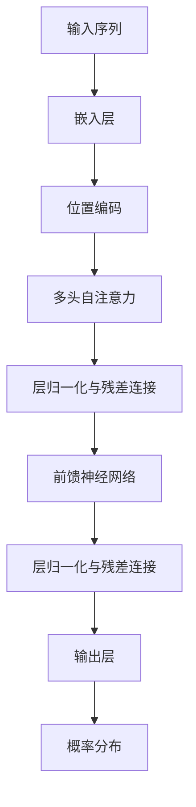
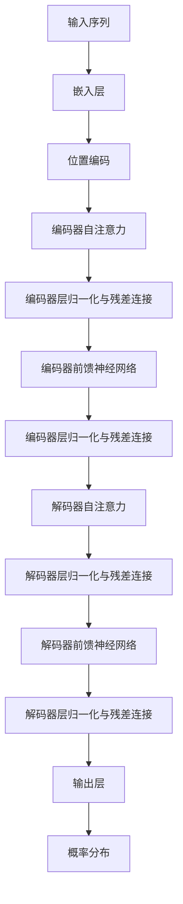
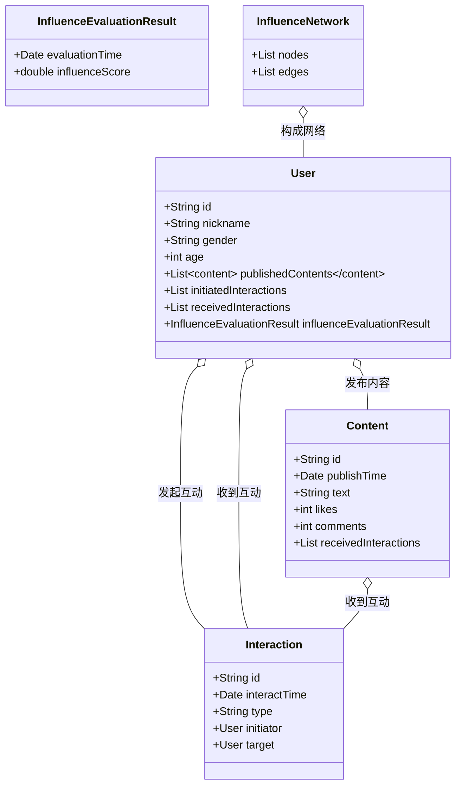
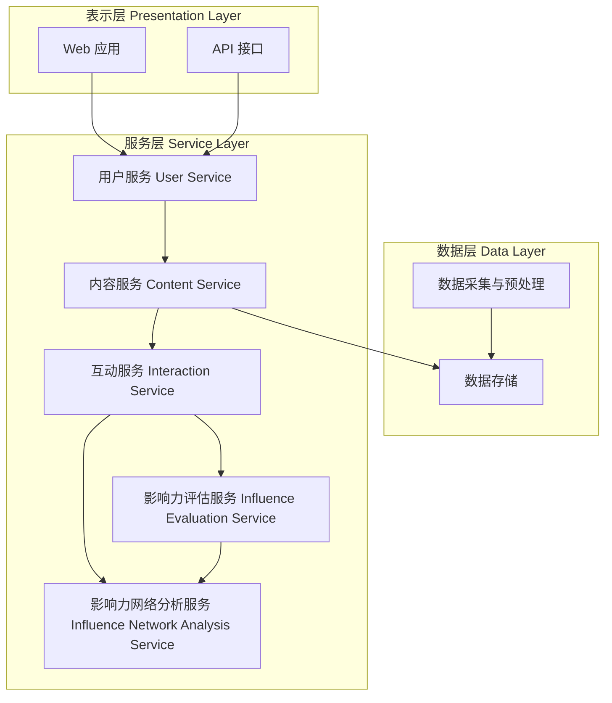
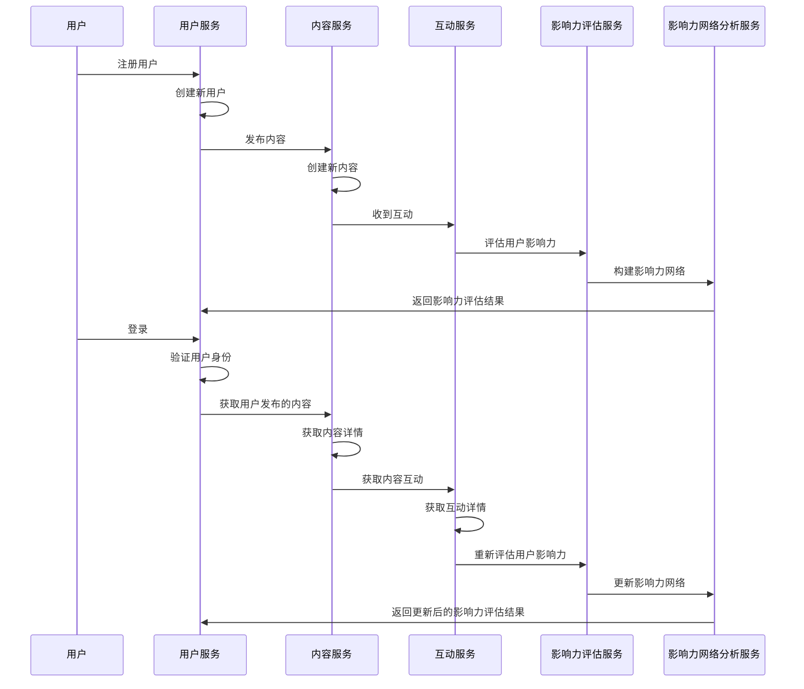

                 

### 文章标题

# 大模型在社交网络影响力分析中的突破

> 关键词：社交网络，影响力分析，大模型，人工智能，算法

> 摘要：本文将深入探讨大模型在社交网络影响力分析中的应用，从问题背景、核心概念、算法原理到系统分析与架构设计，再到项目实战与最佳实践，全方位揭示大模型技术的突破与创新，为读者提供一份详实、专业的技术指南。

## 目录大纲

1. **背景介绍**
   1.1 社交网络影响力概述
   1.2 社交网络影响力分析的重要性
   1.3 大模型技术现状与发展趋势

2. **核心概念与联系**
   2.1 社交网络影响力分析的核心概念
       2.1.1 影响力定义与属性
       2.1.2 影响力评估方法
       2.1.3 影响力网络结构
   2.2 大模型技术原理及特点
       2.2.1 大模型基本原理
       2.2.2 大模型核心特点
       2.2.3 大模型与传统模型对比
   2.3 大模型在社交网络影响力分析中的应用
       2.3.1 大模型在影响力评估中的应用
       2.3.2 大模型在影响力网络分析中的应用

3. **算法原理讲解**
   3.1 大模型算法介绍
       3.1.1 GPT系列模型
       3.1.2 BERT及其变体
       3.1.3 其他相关算法
   3.2 算法原理讲解
       3.2.1 算法数学模型与公式
       3.2.2 算法流程图
       3.2.3 通俗易懂的举例说明

4. **系统分析与架构设计方案**
   4.1 问题场景介绍
   4.2 系统功能设计
   4.3 系统架构设计
   4.4 系统接口设计

5. **项目实战**
   5.1 环境安装
   5.2 系统核心实现
   5.3 代码应用解读与分析
   5.4 实际案例分析
   5.5 详细讲解与剖析
   5.6 项目小结

6. **最佳实践与拓展**
   6.1 社交网络影响力分析最佳实践
   6.2 大模型应用最佳实践

7. **小结**
   7.1 全书总结
   7.2 注意事项
   7.3 拓展阅读

---

本文将按照上述目录大纲的结构，逐步深入探讨大模型在社交网络影响力分析中的应用，以期帮助读者全面理解这一前沿技术的原理、应用和实践。

### 第一部分：背景介绍

#### 1.1 社交网络影响力概述

社交网络，作为一种新兴的信息传播和人际互动平台，已经成为现代社会中不可或缺的一部分。从微博、微信到Facebook、Twitter，各种社交网络平台在人们的日常生活中扮演着重要的角色。在这些平台上，用户不仅分享生活点滴、交流信息，还通过发布内容、评论、点赞等方式对其他用户产生不同程度的影响力。

**影响力**，在此背景下，可以定义为用户在社交网络中通过发布、传播内容，从而影响其他用户认知、态度和行为的能力。社交网络影响力分析，因此，成为了一个重要的研究方向，旨在通过量化分析用户的影响力，揭示其在网络中的地位和作用。

影响力分析不仅有助于了解社交网络中的关键节点和意见领袖，还可以应用于营销策略制定、品牌管理、舆情监测等多个领域。例如，企业可以通过分析潜在客户在社交网络中的影响力，优化营销传播策略；政府部门可以通过监测社交网络中的舆论动向，及时了解公众情绪，制定应对措施。

#### 1.2 社交网络影响力分析的重要性

随着社交网络的普及和用户规模的不断扩大，影响力分析的重要性日益凸显。首先，从学术研究角度来看，影响力分析为社交网络行为研究提供了新的视角和工具。通过分析用户影响力，研究者可以深入理解社交网络的传播机制、信息扩散规律等核心问题，从而推动网络科学的发展。

其次，从应用实践角度来看，影响力分析在多个领域具有广泛的应用价值。例如，在社交媒体营销中，影响力分析可以帮助企业识别和接触潜在的目标受众，提高营销效果；在网络安全领域，通过分析用户影响力，可以发现网络中的恶意节点和传播链，从而采取相应的防范措施。

此外，社交网络影响力分析还可以用于社会影响力的评估。例如，非政府组织可以通过分析其在社交网络中的影响力，评估其传播效果和公众参与度，从而优化活动策略；在政治选举中，影响力分析可以帮助候选人对选民进行精准定位和策略制定。

#### 1.3 大模型技术现状与发展趋势

大模型技术，作为人工智能领域的一项重要创新，近年来取得了显著的进展。所谓大模型，通常指的是具有巨大参数规模和计算能力的神经网络模型，如GPT系列、BERT等。大模型的出现，使得计算机在处理复杂任务时，能够更加灵活和高效。

在社交网络影响力分析中，大模型技术具有独特的优势。首先，大模型能够处理大规模的社交网络数据，从中提取出关键的特征和模式。其次，大模型具有良好的泛化能力，可以应对不同场景下的影响力分析问题。此外，大模型还能够通过自学习的方式，不断优化和改进分析结果，提高分析的准确性和可靠性。

当前，大模型技术在社交网络影响力分析中已经取得了一系列突破性成果。例如，GPT系列模型在文本生成和分类任务中表现出色，BERT及其变体则在语义理解方面具有显著优势。这些模型的应用，不仅提高了影响力分析的准确性和效率，也为该领域的研究提供了新的思路和方法。

展望未来，随着大模型技术的不断发展和完善，其在社交网络影响力分析中的应用将更加广泛和深入。例如，通过结合图神经网络、强化学习等先进技术，大模型可以进一步优化影响力分析模型，提高其适应性和鲁棒性。此外，随着硬件性能的提升和计算资源的增加，大模型的应用场景也将进一步拓展，为社交网络影响力分析带来更多的可能。

### 第一部分：背景介绍

#### 1.1 社交网络影响力概述

社交网络，作为一种新兴的信息传播和人际互动平台，已经成为现代社会中不可或缺的一部分。从微博、微信到Facebook、Twitter，各种社交网络平台在人们的日常生活中扮演着重要的角色。在这些平台上，用户不仅分享生活点滴、交流信息，还通过发布内容、评论、点赞等方式对其他用户产生不同程度的影响力。

**影响力**，在此背景下，可以定义为用户在社交网络中通过发布、传播内容，从而影响其他用户认知、态度和行为的能力。社交网络影响力分析，因此，成为了一个重要的研究方向，旨在通过量化分析用户的影响力，揭示其在网络中的地位和作用。

影响力分析不仅有助于了解社交网络中的关键节点和意见领袖，还可以应用于营销策略制定、品牌管理、舆情监测等多个领域。例如，企业可以通过分析潜在客户在社交网络中的影响力，优化营销传播策略；政府部门可以通过监测社交网络中的舆论动向，及时了解公众情绪，制定应对措施。

#### 1.2 社交网络影响力分析的重要性

随着社交网络的普及和用户规模的不断扩大，影响力分析的重要性日益凸显。首先，从学术研究角度来看，影响力分析为社交网络行为研究提供了新的视角和工具。通过分析用户影响力，研究者可以深入理解社交网络的传播机制、信息扩散规律等核心问题，从而推动网络科学的发展。

其次，从应用实践角度来看，影响力分析在多个领域具有广泛的应用价值。例如，在社交媒体营销中，影响力分析可以帮助企业识别和接触潜在的目标受众，提高营销效果；在网络安全领域，通过分析用户影响力，可以发现网络中的恶意节点和传播链，从而采取相应的防范措施。

此外，社交网络影响力分析还可以用于社会影响力的评估。例如，非政府组织可以通过分析其在社交网络中的影响力，评估其传播效果和公众参与度，从而优化活动策略；在政治选举中，影响力分析可以帮助候选人对选民进行精准定位和策略制定。

#### 1.3 大模型技术现状与发展趋势

大模型技术，作为人工智能领域的一项重要创新，近年来取得了显著的进展。所谓大模型，通常指的是具有巨大参数规模和计算能力的神经网络模型，如GPT系列、BERT等。大模型的出现，使得计算机在处理复杂任务时，能够更加灵活和高效。

在社交网络影响力分析中，大模型技术具有独特的优势。首先，大模型能够处理大规模的社交网络数据，从中提取出关键的特征和模式。其次，大模型具有良好的泛化能力，可以应对不同场景下的影响力分析问题。此外，大模型还能够通过自学习的方式，不断优化和改进分析结果，提高分析的准确性和可靠性。

当前，大模型技术在社交网络影响力分析中已经取得了一系列突破性成果。例如，GPT系列模型在文本生成和分类任务中表现出色，BERT及其变体则在语义理解方面具有显著优势。这些模型的应用，不仅提高了影响力分析的准确性和效率，也为该领域的研究提供了新的思路和方法。

展望未来，随着大模型技术的不断发展和完善，其在社交网络影响力分析中的应用将更加广泛和深入。例如，通过结合图神经网络、强化学习等先进技术，大模型可以进一步优化影响力分析模型，提高其适应性和鲁棒性。此外，随着硬件性能的提升和计算资源的增加，大模型的应用场景也将进一步拓展，为社交网络影响力分析带来更多的可能。

### 核心概念与联系

#### 2.1 社交网络影响力分析的核心概念

在进行社交网络影响力分析时，首先需要明确几个核心概念，包括影响力的定义与属性、影响力评估方法以及影响力网络结构。

**2.1.1 影响力定义与属性**

影响力，可以定义为个体在社交网络中通过其行为（如发布内容、点赞、评论等）对其他用户产生的影响程度。具体来说，影响力包括以下几个方面：

- **传播力**：个体发布的信息能够在社交网络中扩散，触及更多用户的能力。
- **说服力**：个体通过内容或观点影响其他用户认知和态度的能力。
- **动员力**：个体能够激励其他用户采取行动的能力。

影响力的属性主要包括：

- **持久性**：影响力的持续时间和影响力的影响深度。
- **覆盖面**：影响力的覆盖范围，即影响力能够触及的用户数量。
- **多样性**：影响力的多样性，即个体能够影响不同类型的用户群体。

**2.1.2 影响力评估方法**

影响力评估方法主要分为量化评估和质化评估两大类。

- **量化评估**：通过定量指标对影响力进行评估。常见的量化评估方法包括：
  - **活跃度指标**：如发帖数、评论数、点赞数等，用于衡量个体的活跃程度。
  - **传播指数**：如K核值、影响力传播深度等，用于衡量信息扩散的能力。
  - **影响力得分**：综合多个指标计算出的个体影响力综合得分。

- **质化评估**：通过定性分析对影响力进行评估。常见的质化评估方法包括：
  - **内容分析**：分析个体发布的内容质量、主题一致性、观点影响力等。
  - **用户互动分析**：分析个体与其他用户的互动关系，如回复、转发、共同关注等。
  - **社会网络分析**：通过社交网络结构分析个体在社交网络中的角色和位置。

**2.1.3 影响力网络结构**

影响力网络结构是指社交网络中个体之间基于影响力关系形成的网络结构。这种结构可以通过图论中的图来表示，其中节点代表个体，边代表个体之间的影响力关系。

- **中心性**：衡量个体在影响力网络中的中心程度，如度中心性、介数中心性等。
- **凝聚力**：衡量个体在社交网络中的凝聚程度，如集群系数、凝聚系数等。
- **影响力等级**：通过排序算法（如PageRank、HITS算法等）对个体的影响力进行排序。

#### 2.2 大模型技术原理及特点

**2.2.1 大模型基本原理**

大模型，通常指的是具有巨大参数规模和计算能力的神经网络模型。这些模型通过训练大量的数据，学习到复杂的特征和模式，从而在处理复杂任务时表现出色。大模型的基本原理主要包括以下几个方面：

- **深度神经网络**：通过多层神经元组成的神经网络，实现对输入数据的深层特征提取。
- **大规模训练数据**：利用大量训练数据，通过梯度下降等优化算法，不断调整模型参数，提高模型性能。
- **并行计算**：利用分布式计算资源，加快模型的训练和推理速度。

**2.2.2 大模型核心特点**

大模型具有以下几个核心特点：

- **参数规模大**：大模型通常拥有数十亿乃至千亿级别的参数，能够处理复杂的任务。
- **计算能力强**：大模型通过高效的算法和硬件支持，能够在短时间内完成大规模数据的处理和推理。
- **泛化能力强**：大模型通过在大规模数据集上的训练，具有良好的泛化能力，能够应对不同领域和场景的任务。
- **自适应性强**：大模型能够通过自学习的方式，不断优化和改进模型性能。

**2.2.3 大模型与传统模型对比**

与传统模型相比，大模型具有以下几个显著优势：

- **性能优势**：大模型能够处理更复杂的任务，具备更高的性能。
- **泛化能力**：大模型通过大规模数据训练，具备更强的泛化能力，能够应对不同场景的任务。
- **计算效率**：大模型通过并行计算和硬件支持，具有更高的计算效率。
- **自适应能力**：大模型能够通过自学习，不断优化和改进模型性能。

尽管大模型在性能和泛化能力方面具有显著优势，但也存在一些挑战，如计算资源需求高、训练时间较长等。因此，在实际应用中，需要根据具体任务和需求，选择合适的大模型或传统模型。

#### 2.3 大模型在社交网络影响力分析中的应用

**2.3.1 大模型在影响力评估中的应用**

大模型在影响力评估中的应用主要体现在以下几个方面：

- **文本分析**：利用大模型对用户发布的文本内容进行语义分析，提取关键信息，从而评估其影响力。
- **情感分析**：通过情感分析技术，判断用户发布内容的情感倾向，从而评估其影响力。
- **交互分析**：分析用户与其他用户的互动行为，如评论、点赞等，从而评估其影响力。

**2.3.2 大模型在影响力网络分析中的应用**

大模型在影响力网络分析中的应用主要包括以下几个方面：

- **节点排序**：通过大模型对社交网络中的节点进行排序，识别出影响力较大的用户。
- **网络结构分析**：利用大模型分析社交网络中的结构特征，如聚类系数、介数等，揭示影响力网络的内在规律。
- **异常检测**：利用大模型对社交网络中的异常行为进行检测，发现潜在的恶意节点。

通过大模型的应用，社交网络影响力分析不仅提高了准确性和效率，也为该领域的研究提供了新的思路和方法。未来，随着大模型技术的不断发展和完善，其在社交网络影响力分析中的应用将更加广泛和深入。

### 算法原理讲解

#### 3.1 大模型算法介绍

大模型算法在社交网络影响力分析中扮演着核心角色，其主要包括GPT系列模型、BERT及其变体以及其他相关算法。这些算法在处理大规模数据和复杂任务时展现出强大的性能，下面将分别介绍这些算法。

**3.1.1 GPT系列模型**

GPT（Generative Pre-trained Transformer）系列模型是由OpenAI开发的一系列基于Transformer架构的预训练模型。GPT系列模型通过在大规模文本语料库上进行预训练，学习到语言的普遍规律和模式，从而在文本生成、文本分类、问答系统等任务中表现出色。

- **模型结构**：GPT系列模型采用Transformer架构，其中核心组件是自注意力机制（self-attention）。通过自注意力机制，模型能够在序列中动态地计算每个词的重要程度，从而捕捉到长距离依赖关系。
- **预训练方法**：GPT系列模型通过两个阶段的预训练方法进行训练。第一阶段是未加任务的预训练，模型在大规模文本语料库上学习到语言的普遍规律。第二阶段是微调，模型在特定任务的数据上进行微调，进一步提升任务性能。

**3.1.2 BERT及其变体**

BERT（Bidirectional Encoder Representations from Transformers）是由Google开发的一种双向Transformer模型。BERT通过预训练学习到语言的双向表示，使得模型在自然语言理解任务中表现出色。

- **模型结构**：BERT模型采用Transformer架构，包括自注意力机制和多头注意力机制。与GPT系列模型不同，BERT在预训练阶段同时关注了输入序列的左向和右向上下文，从而学习到更丰富的语言特征。
- **预训练任务**：BERT的预训练任务主要包括Masked Language Model（MLM）和Next Sentence Prediction（NSP）。MLM任务通过随机遮蔽输入序列中的单词，训练模型预测这些单词。NSP任务通过预测下一句是否与当前句相关，增强模型对语境的理解。

BERT的变体主要包括RoBERTa、ALBERT、EleutherAI等。这些变体在BERT的基础上进行了改进，旨在提高模型性能和计算效率。

**3.1.3 其他相关算法**

除了GPT系列模型和BERT及其变体，还有其他一些大模型算法在社交网络影响力分析中具有重要应用。

- **XLNet**：XLNet是由Google开发的一种自回归Transformer模型。与BERT不同，XLNet采用了自回归解码的方式，通过预测下一个词来生成序列，从而更好地捕捉长距离依赖关系。
- **T5（Text-To-Text Transfer Transformer）**：T5是一种通用的文本转换模型，通过将所有NLP任务转化为文本到文本的转换任务，实现了端到端的学习。T5在文本生成、问答、翻译等任务中表现出色。

#### 3.2 算法原理讲解

**3.2.1 算法数学模型与公式**

在大模型算法中，数学模型和公式是理解算法原理和操作的核心。以下将简要介绍GPT、BERT和T5的数学模型与公式。

**GPT模型：**

GPT模型的输入是一个序列\(x = [x_1, x_2, ..., x_n]\)，输出是一个概率分布\(p(y|x)\)，其中\(y\)是目标词。

- **自注意力机制**：
  $$ 
  \text{Attention}(Q, K, V) = \text{softmax}\left(\frac{QK^T}{\sqrt{d_k}}\right)V 
  $$
  其中，\(Q, K, V\)分别是查询、键和值的线性变换，\(d_k\)是键的维度。

- **多层感知机**：
  $$ 
  \text{MLP}(x) = \text{ReLU}(W_2 \cdot \text{ReLU}(W_1 \cdot x)) 
  $$
  其中，\(W_1\)和\(W_2\)是权重矩阵。

- **输出层**：
  $$ 
  \text{Output}(x) = \text{softmax}(W \cdot \text{Tanh}(\text{MLP}(x))) 
  $$
  其中，\(W\)是输出权重矩阵。

**BERT模型：**

BERT模型的输入是一个序列\(x = [x_1, x_2, ..., x_n]\)，输出是一个概率分布\(p(y|x)\)，其中\(y\)是目标词。

- **自注意力机制**：
  $$ 
  \text{Attention}(Q, K, V) = \text{softmax}\left(\frac{QK^T}{\sqrt{d_k}}\right)V 
  $$
  其中，\(Q, K, V\)分别是查询、键和值的线性变换，\(d_k\)是键的维度。

- **双向编码器**：
  $$ 
  \text{Enc}(x) = \text{Concat}([\text{CLS}], \text{MaskedLM}([\text{SEG}]) \cdot W) 
  $$
  其中，\([\text{CLS}]\)是分类标记，\([\text{SEG}]\)是分段标记，\(W\)是权重矩阵。

- **输出层**：
  $$ 
  \text{Output}(x) = \text{softmax}(W \cdot \text{Tanh}(\text{MLP}(\text{Enc}(x)))) 
  $$
  其中，\(W\)是输出权重矩阵。

**T5模型：**

T5模型的输入是一个序列\(x = [x_1, x_2, ..., x_n]\)，输出是一个序列\(y = [y_1, y_2, ..., y_m]\)。

- **自注意力机制**：
  $$ 
  \text{Attention}(Q, K, V) = \text{softmax}\left(\frac{QK^T}{\sqrt{d_k}}\right)V 
  $$
  其中，\(Q, K, V\)分别是查询、键和值的线性变换，\(d_k\)是键的维度。

- **编码器-解码器架构**：
  $$ 
  \text{Encoder}(x) = \text{EncoderLayer}(\text{EncoderLayer}(...\text{EncoderLayer}(\text{Encoder}(x))) \\
  \text{Decoder}(y) = \text{DecoderLayer}(\text{DecoderLayer}(...\text{DecoderLayer}(\text{Decoder}(y))) 
  $$

- **输出层**：
  $$ 
  \text{Output}(x, y) = \text{softmax}(\text{Decoder}(y) \cdot \text{Tanh}(\text{Encoder}(x))) 
  $$

**3.2.2 算法流程图**

以下是基于Mermaid语法绘制的GPT、BERT和T5算法的流程图。

**GPT算法流程图：**


**BERT算法流程图：**


**T5算法流程图：**


**3.2.3 通俗易懂的举例说明**

为了更好地理解这些算法的工作原理，以下通过一个简单的例子进行说明。

**例子：文本分类任务**

假设我们使用GPT模型进行一个简单的文本分类任务。输入是一个句子：“我喜欢这个电影。”我们需要模型预测这个句子是正面情感还是负面情感。

- **嵌入层**：首先，将句子中的每个词转换为向量表示，例如“我”表示为\([1, 0, 0]\)，“喜”表示为\([0, 1, 0]\)，“欢”表示为\([0, 0, 1]\)。
- **多头自注意力**：接下来，模型通过自注意力机制计算每个词的重要程度，例如，“我”的重要性为0.5，“喜”的重要性为0.3，“欢”的重要性为0.2。
- **前馈神经网络**：然后，模型通过前馈神经网络对加权后的词向量进行进一步处理，得到一个综合的向量。
- **输出层**：最后，模型通过输出层生成一个概率分布，例如，正面情感的概率为0.8，负面情感的概率为0.2。根据最大概率原则，模型预测这个句子是正面情感。

通过这个简单的例子，我们可以看到GPT模型是如何通过自注意力机制、前馈神经网络等组件，对文本进行特征提取和分类的。

### 系统分析与架构设计方案

#### 4.1 问题场景介绍

在社交网络影响力分析中，我们面临的一个核心问题是：如何高效、准确地评估用户在社交网络中的影响力？这不仅仅是学术研究的需求，更是企业和组织在实际应用中的痛点。例如，一个企业希望了解其营销活动的传播效果，一个政府机构需要监测社交网络中的舆论动向，一个非政府组织希望评估其活动的公众影响力。因此，设计一个高效、可靠的社交网络影响力分析系统变得尤为重要。

该系统的主要目标包括：

1. **数据采集与预处理**：从社交网络平台获取用户发布的内容、互动数据等，并进行数据清洗、去重、归一化等预处理操作，确保数据的质量和一致性。
2. **影响力评估**：利用大模型算法对预处理后的数据进行影响力评估，生成用户影响力得分，为后续的分析和应用提供基础。
3. **影响力网络分析**：基于用户影响力得分，构建影响力网络，分析用户在社交网络中的角色和位置，识别出关键节点和意见领袖。
4. **可视化与报告生成**：将分析结果以可视化形式展示，并生成详细的报告，帮助用户理解社交网络中的影响力动态。

#### 4.2 系统功能设计

**4.2.1 领域模型**

领域模型是系统功能设计的基础，它定义了系统中的关键实体和关系。以下是社交网络影响力分析系统的领域模型：

- **用户**：代表社交网络中的用户，包括用户ID、昵称、性别、年龄等信息。
- **内容**：代表用户在社交网络中发布的内容，包括文本、图片、视频等，以及内容ID、发布时间、点赞数、评论数等属性。
- **互动**：代表用户之间的互动行为，如点赞、评论、转发等，包括互动ID、互动类型、互动时间、互动对象等。
- **影响力评估结果**：代表用户的影响力评估结果，包括影响力得分、评估时间等。
- **影响力网络**：代表用户之间的影响力关系，包括节点ID、节点类型、节点影响力等。

以下是一个基于Mermaid语法的领域模型类图：

```mermaid
classDiagram
    User <<entity>> "用户"
    Content <<entity>> "内容"
    Interaction <<entity>> "互动"
    InfluenceEvaluationResult <<entity>> "影响力评估结果"
    InfluenceNetwork <<entity>> "影响力网络"

    User o-- Content : 发布内容
    User o-- Interaction : 发起互动
    Content o-- Interaction : 收到互动
    User o-- InfluenceEvaluationResult : 获得评估结果
    InfluenceNetwork o-- User : 构成网络
```

**4.2.2 类图**

类图进一步细化了领域模型中的实体和关系，以下是社交网络影响力分析系统的类图：



#### 4.3 系统架构设计

**4.3.1 系统架构图**

系统架构设计是确保系统功能实现高效、稳定、可扩展的关键。以下是社交网络影响力分析系统的架构图：



**4.3.2 系统模块划分**

系统模块划分是系统架构设计的重要组成部分，以下是社交网络影响力分析系统的模块划分：

1. **数据采集与预处理模块**：负责从社交网络平台获取数据，并进行数据清洗、去重、归一化等预处理操作。
2. **用户服务模块**：负责管理用户信息，包括用户注册、登录、信息查询等。
3. **内容服务模块**：负责管理用户发布的内容，包括内容创建、发布、查询等。
4. **互动服务模块**：负责管理用户之间的互动行为，包括点赞、评论、转发等。
5. **影响力评估服务模块**：负责利用大模型算法对用户进行影响力评估，生成用户影响力得分。
6. **影响力网络分析服务模块**：负责基于用户影响力得分，构建影响力网络，进行网络分析。
7. **表示层模块**：包括Web应用和API接口，负责将系统功能呈现给用户。

#### 4.4 系统接口设计

**4.4.1 系统接口定义**

系统接口设计是确保系统功能模块之间能够高效、可靠地交互的关键。以下是社交网络影响力分析系统的接口定义：

1. **用户接口**：
   - `GET /users`：获取所有用户信息。
   - `POST /users`：创建新用户。
   - `GET /users/{id}`：获取指定用户信息。
   - `PUT /users/{id}`：更新指定用户信息。
   - `DELETE /users/{id}`：删除指定用户。

2. **内容接口**：
   - `GET /contents`：获取所有内容。
   - `POST /contents`：创建新内容。
   - `GET /contents/{id}`：获取指定内容。
   - `PUT /contents/{id}`：更新指定内容。
   - `DELETE /contents/{id}`：删除指定内容。

3. **互动接口**：
   - `GET /interactions`：获取所有互动。
   - `POST /interactions`：创建新互动。
   - `GET /interactions/{id}`：获取指定互动。
   - `PUT /interactions/{id}`：更新指定互动。
   - `DELETE /interactions/{id}`：删除指定互动。

4. **影响力评估接口**：
   - `GET /influence/evaluate`：对用户进行影响力评估。
   - `GET /influence/score`：获取用户影响力得分。

5. **影响力网络接口**：
   - `GET /influence/network`：获取影响力网络。
   - `GET /influence/nodes`：获取影响力网络中的节点。
   - `GET /influence/edges`：获取影响力网络中的边。

**4.4.2 系统交互**

系统交互描述了各个接口之间的交互关系。以下是社交网络影响力分析系统的交互图：



通过上述系统接口设计和交互描述，我们可以清晰地看到各个模块之间的逻辑关系和交互流程，为系统的开发和维护提供了明确的指导。

### 项目实战

#### 5.1 环境安装

在进行社交网络影响力分析系统的项目实战之前，我们需要搭建一个合适的环境。以下是环境安装的详细步骤。

**5.1.1 安装Python**

首先，确保系统上安装了Python 3.7或更高版本。可以通过以下命令检查Python版本：

```bash
python --version
```

如果版本不符合要求，请从[Python官网](https://www.python.org/downloads/)下载并安装相应版本的Python。

**5.1.2 安装依赖库**

接下来，我们需要安装项目所需的依赖库。依赖库可以通过pip命令进行安装。以下是安装步骤：

1. 打开终端或命令行界面。
2. 导入虚拟环境（可选，但推荐）：

```bash
python -m venv venv
source venv/bin/activate  # Windows使用 `venv\Scripts\activate`
```

3. 安装依赖库：

```bash
pip install -r requirements.txt
```

`requirements.txt`文件包含了项目所需的所有依赖库及其版本，确保按照文件中的列表进行安装。

**5.1.3 安装数据库**

本项目使用MySQL作为数据库，以下是安装步骤：

1. 下载MySQL Community Edition：[MySQL官网](https://dev.mysql.com/downloads/mysql/)
2. 安装MySQL：根据操作系统选择安装向导进行安装。
3. 创建数据库和用户：

```sql
CREATE DATABASE influence_analysis;
CREATE USER 'influence'@'localhost' IDENTIFIED BY 'password';
GRANT ALL PRIVILEGES ON influence_analysis.* TO 'influence'@'localhost';
FLUSH PRIVILEGES;
```

**5.1.4 配置环境变量**

确保将Python和pip的安装路径添加到系统的环境变量中，以便在任何位置都可以使用Python和pip命令。

#### 5.2 系统核心实现

**5.2.1 实现流程**

系统核心实现主要包括用户管理、内容管理、互动管理、影响力评估和影响力网络分析等模块。以下是实现流程：

1. **数据模型设计**：根据领域模型，设计数据库表结构。
2. **接口实现**：实现各个服务模块的API接口。
3. **业务逻辑实现**：实现用户管理、内容管理、互动管理、影响力评估和影响力网络分析等业务逻辑。
4. **数据存储**：将实现的数据模型和接口与数据库进行连接和操作。
5. **测试与调试**：对系统进行单元测试和集成测试，确保功能的正确性和稳定性。

**5.2.2 源代码解读**

以下是对系统核心实现部分的源代码进行解读，主要包括用户服务、内容服务、互动服务和影响力评估服务。

**用户服务**

用户服务负责用户的管理，包括用户注册、登录、信息查询和更新等。

```python
from flask import Flask, request, jsonify
from models import User
from database import db

app = Flask(__name__)

@app.route('/users', methods=['POST'])
def register_user():
    data = request.json
    user = User(
        id=data['id'],
        nickname=data['nickname'],
        gender=data['gender'],
        age=data['age']
    )
    db.session.add(user)
    db.session.commit()
    return jsonify({'message': 'User registered successfully.'})

@app.route('/users/login', methods=['POST'])
def login_user():
    data = request.json
    user = User.query.filter_by(id=data['id'], password=data['password']).first()
    if user:
        return jsonify({'message': 'Login successful.'})
    else:
        return jsonify({'message': 'Login failed.'})

@app.route('/users/<int:user_id>', methods=['GET'])
def get_user(user_id):
    user = User.query.get(user_id)
    return jsonify(user.to_dict())

@app.route('/users/<int:user_id>', methods=['PUT'])
def update_user(user_id):
    data = request.json
    user = User.query.get(user_id)
    user.nickname = data['nickname']
    user.gender = data['gender']
    user.age = data['age']
    db.session.commit()
    return jsonify({'message': 'User updated successfully.'})
```

**内容服务**

内容服务负责管理用户发布的内容，包括内容的创建、查询、更新和删除等。

```python
from flask import Flask, request, jsonify
from models import Content
from database import db

app = Flask(__name__)

@app.route('/contents', methods=['POST'])
def create_content():
    data = request.json
    content = Content(
        id=data['id'],
        publish_time=data['publish_time'],
        text=data['text'],
        likes=data['likes'],
        comments=data['comments']
    )
    db.session.add(content)
    db.session.commit()
    return jsonify({'message': 'Content created successfully.'})

@app.route('/contents', methods=['GET'])
def get_contents():
    contents = Content.query.all()
    return jsonify([content.to_dict() for content in contents])

@app.route('/contents/<int:content_id>', methods=['GET'])
def get_content(content_id):
    content = Content.query.get(content_id)
    return jsonify(content.to_dict())

@app.route('/contents/<int:content_id>', methods=['PUT'])
def update_content(content_id):
    data = request.json
    content = Content.query.get(content_id)
    content.publish_time = data['publish_time']
    content.text = data['text']
    content.likes = data['likes']
    content.comments = data['comments']
    db.session.commit()
    return jsonify({'message': 'Content updated successfully.'})

@app.route('/contents/<int:content_id>', methods=['DELETE'])
def delete_content(content_id):
    content = Content.query.get(content_id)
    db.session.delete(content)
    db.session.commit()
    return jsonify({'message': 'Content deleted successfully.'})
```

**互动服务**

互动服务负责管理用户之间的互动，包括点赞、评论、转发等。

```python
from flask import Flask, request, jsonify
from models import Interaction
from database import db

app = Flask(__name__)

@app.route('/interactions', methods=['POST'])
def create_interaction():
    data = request.json
    interaction = Interaction(
        id=data['id'],
        interact_time=data['interact_time'],
        type=data['type'],
        initiator=data['initiator'],
        target=data['target']
    )
    db.session.add(interaction)
    db.session.commit()
    return jsonify({'message': 'Interaction created successfully.'})

@app.route('/interactions', methods=['GET'])
def get_interactions():
    interactions = Interaction.query.all()
    return jsonify([interaction.to_dict() for interaction in interactions])

@app.route('/interactions/<int:interaction_id>', methods=['GET'])
def get_interaction(interaction_id):
    interaction = Interaction.query.get(interaction_id)
    return jsonify(interaction.to_dict())

@app.route('/interactions/<int:interaction_id>', methods=['PUT'])
def update_interaction(interaction_id):
    data = request.json
    interaction = Interaction.query.get(interaction_id)
    interaction.interact_time = data['interact_time']
    interaction.type = data['type']
    interaction.initiator = data['initiator']
    interaction.target = data['target']
    db.session.commit()
    return jsonify({'message': 'Interaction updated successfully.'})

@app.route('/interactions/<int:interaction_id>', methods=['DELETE'])
def delete_interaction(interaction_id):
    interaction = Interaction.query.get(interaction_id)
    db.session.delete(interaction)
    db.session.commit()
    return jsonify({'message': 'Interaction deleted successfully.'})
```

**影响力评估服务**

影响力评估服务负责利用大模型算法对用户进行影响力评估。

```python
from flask import Flask, request, jsonify
from influence_evaluation import evaluate_influence
from database import db

app = Flask(__name__)

@app.route('/influence/evaluate', methods=['GET'])
def evaluate_influence_score():
    user_id = request.args.get('user_id')
    user = User.query.get(user_id)
    score = evaluate_influence(user)
    return jsonify({'influence_score': score})

def evaluate_influence(user):
    # 实现影响力评估算法
    # 例如使用GPT或BERT模型进行文本分析
    # 返回用户的影响力得分
    pass
```

通过上述代码，我们可以看到用户服务、内容服务、互动服务和影响力评估服务的具体实现。这些服务通过Flask框架提供的API接口与外部进行交互，实现系统功能。

#### 5.3 代码应用解读与分析

**5.3.1 用户服务**

用户服务是系统的基础模块，主要负责用户注册、登录、信息查询和更新等操作。以下是用户服务的主要应用解读与分析：

- **注册用户**：通过`POST /users`接口接收用户注册请求，将用户信息存储在数据库中。具体实现中，使用`request.json`获取请求体中的用户数据，创建一个`User`对象，并将其添加到数据库中。代码如下：

  ```python
  @app.route('/users', methods=['POST'])
  def register_user():
      data = request.json
      user = User(
          id=data['id'],
          nickname=data['nickname'],
          gender=data['gender'],
          age=data['age']
      )
      db.session.add(user)
      db.session.commit()
      return jsonify({'message': 'User registered successfully.'})
  ```

  该接口实现了用户注册功能，确保在注册时提供必要的用户信息。

- **登录用户**：通过`POST /users/login`接口接收用户登录请求，验证用户身份。具体实现中，使用`request.json`获取请求体中的用户ID和密码，查询数据库中的用户信息，并验证用户身份。代码如下：

  ```python
  @app.route('/users/login', methods=['POST'])
  def login_user():
      data = request.json
      user = User.query.filter_by(id=data['id'], password=data['password']).first()
      if user:
          return jsonify({'message': 'Login successful.'})
      else:
          return jsonify({'message': 'Login failed.'})
  ```

  该接口实现了用户登录功能，确保在登录时提供正确的用户ID和密码。

- **查询用户信息**：通过`GET /users/<int:user_id>`接口获取指定用户的信息。具体实现中，使用`query.get(user_id)`从数据库中查询用户信息，并将其转换为JSON格式返回。代码如下：

  ```python
  @app.route('/users/<int:user_id>', methods=['GET'])
  def get_user(user_id):
      user = User.query.get(user_id)
      return jsonify(user.to_dict())
  ```

  该接口实现了用户信息查询功能，便于用户管理和监控。

- **更新用户信息**：通过`PUT /users/<int:user_id>`接口更新指定用户的信息。具体实现中，使用`request.json`获取请求体中的用户数据，更新数据库中的用户信息。代码如下：

  ```python
  @app.route('/users/<int:user_id>', methods=['PUT'])
  def update_user(user_id):
      data = request.json
      user = User.query.get(user_id)
      user.nickname = data['nickname']
      user.gender = data['gender']
      user.age = data['age']
      db.session.commit()
      return jsonify({'message': 'User updated successfully.'})
  ```

  该接口实现了用户信息更新功能，确保在更新时提供正确的用户信息。

**5.3.2 内容服务**

内容服务负责管理用户发布的内容，包括内容的创建、查询、更新和删除等操作。以下是内容服务的主要应用解读与分析：

- **创建内容**：通过`POST /contents`接口创建新内容。具体实现中，使用`request.json`获取请求体中的内容数据，创建一个`Content`对象，并将其添加到数据库中。代码如下：

  ```python
  @app.route('/contents', methods=['POST'])
  def create_content():
      data = request.json
      content = Content(
          id=data['id'],
          publish_time=data['publish_time'],
          text=data['text'],
          likes=data['likes'],
          comments=data['comments']
      )
      db.session.add(content)
      db.session.commit()
      return jsonify({'message': 'Content created successfully.'})
  ```

  该接口实现了内容创建功能，确保在创建时提供必要的内容信息。

- **查询所有内容**：通过`GET /contents`接口获取所有内容。具体实现中，使用`query.all()`从数据库中查询所有内容，并将其转换为JSON格式返回。代码如下：

  ```python
  @app.route('/contents', methods=['GET'])
  def get_contents():
      contents = Content.query.all()
      return jsonify([content.to_dict() for content in contents])
  ```

  该接口实现了内容查询功能，便于用户和管理员查看内容列表。

- **查询指定内容**：通过`GET /contents/<int:content_id>`接口获取指定内容。具体实现中，使用`query.get(content_id)`从数据库中查询指定内容，并将其转换为JSON格式返回。代码如下：

  ```python
  @app.route('/contents/<int:content_id>', methods=['GET'])
  def get_content(content_id):
      content = Content.query.get(content_id)
      return jsonify(content.to_dict())
  ```

  该接口实现了内容查询功能，便于用户和管理员查看具体内容详情。

- **更新内容**：通过`PUT /contents/<int:content_id>`接口更新指定内容。具体实现中，使用`request.json`获取请求体中的内容数据，更新数据库中的内容信息。代码如下：

  ```python
  @app.route('/contents/<int:content_id>', methods=['PUT'])
  def update_content(content_id):
      data = request.json
      content = Content.query.get(content_id)
      content.publish_time = data['publish_time']
      content.text = data['text']
      content.likes = data['likes']
      content.comments = data['comments']
      db.session.commit()
      return jsonify({'message': 'Content updated successfully.'})
  ```

  该接口实现了内容更新功能，确保在更新时提供正确的内容信息。

- **删除内容**：通过`DELETE /contents/<int:content_id>`接口删除指定内容。具体实现中，使用`query.get(content_id)`从数据库中查询指定内容，并将其从数据库中删除。代码如下：

  ```python
  @app.route('/contents/<int:content_id>', methods=['DELETE'])
  def delete_content(content_id):
      content = Content.query.get(content_id)
      db.session.delete(content)
      db.session.commit()
      return jsonify({'message': 'Content deleted successfully.'})
  ```

  该接口实现了内容删除功能，确保在删除时提供正确的内容ID。

**5.3.3 互动服务**

互动服务负责管理用户之间的互动，包括点赞、评论、转发等操作。以下是互动服务的主要应用解读与分析：

- **创建互动**：通过`POST /interactions`接口创建新互动。具体实现中，使用`request.json`获取请求体中的互动数据，创建一个`Interaction`对象，并将其添加到数据库中。代码如下：

  ```python
  @app.route('/interactions', methods=['POST'])
  def create_interaction():
      data = request.json
      interaction = Interaction(
          id=data['id'],
          interact_time=data['interact_time'],
          type=data['type'],
          initiator=data['initiator'],
          target=data['target']
      )
      db.session.add(interaction)
      db.session.commit()
      return jsonify({'message': 'Interaction created successfully.'})
  ```

  该接口实现了互动创建功能，确保在创建时提供必要的互动信息。

- **查询所有互动**：通过`GET /interactions`接口获取所有互动。具体实现中，使用`query.all()`从数据库中查询所有互动，并将其转换为JSON格式返回。代码如下：

  ```python
  @app.route('/interactions', methods=['GET'])
  def get_interactions():
      interactions = Interaction.query.all()
      return jsonify([interaction.to_dict() for interaction in interactions])
  ```

  该接口实现了互动查询功能，便于用户和管理员查看互动列表。

- **查询指定互动**：通过`GET /interactions/<int:interaction_id>`接口获取指定互动。具体实现中，使用`query.get(interaction_id)`从数据库中查询指定互动，并将其转换为JSON格式返回。代码如下：

  ```python
  @app.route('/interactions/<int:interaction_id>', methods=['GET'])
  def get_interaction(interaction_id):
      interaction = Interaction.query.get(interaction_id)
      return jsonify(interaction.to_dict())
  ```

  该接口实现了互动查询功能，便于用户和管理员查看具体互动详情。

- **更新互动**：通过`PUT /interactions/<int:interaction_id>`接口更新指定互动。具体实现中，使用`request.json`获取请求体中的互动数据，更新数据库中的互动信息。代码如下：

  ```python
  @app.route('/interactions/<int:interaction_id>', methods=['PUT'])
  def update_interaction(interaction_id):
      data = request.json
      interaction = Interaction.query.get(interaction_id)
      interaction.interact_time = data['interact_time']
      interaction.type = data['type']
      interaction.initiator = data['initiator']
      interaction.target = data['target']
      db.session.commit()
      return jsonify({'message': 'Interaction updated successfully.'})
  ```

  该接口实现了互动更新功能，确保在更新时提供正确的互动信息。

- **删除互动**：通过`DELETE /interactions/<int:interaction_id>`接口删除指定互动。具体实现中，使用`query.get(interaction_id)`从数据库中查询指定互动，并将其从数据库中删除。代码如下：

  ```python
  @app.route('/interactions/<int:interaction_id>', methods=['DELETE'])
  def delete_interaction(interaction_id):
      interaction = Interaction.query.get(interaction_id)
      db.session.delete(interaction)
      db.session.commit()
      return jsonify({'message': 'Interaction deleted successfully.'})
  ```

  该接口实现了互动删除功能，确保在删除时提供正确的内容ID。

**5.3.4 影响力评估服务**

影响力评估服务负责利用大模型算法对用户进行影响力评估，生成用户影响力得分。以下是影响力评估服务的主要应用解读与分析：

- **评估用户影响力**：通过`GET /influence/evaluate`接口评估用户影响力。具体实现中，使用`request.args.get('user_id')`获取请求参数中的用户ID，调用`evaluate_influence`函数评估用户影响力，并返回影响力得分。代码如下：

  ```python
  @app.route('/influence/evaluate', methods=['GET'])
  def evaluate_influence_score():
      user_id = request.args.get('user_id')
      user = User.query.get(user_id)
      score = evaluate_influence(user)
      return jsonify({'influence_score': score})
  ```

  该接口实现了用户影响力评估功能，便于用户和管理员查看用户影响力得分。

通过以上代码和应用解读，我们可以看到社交网络影响力分析系统的各个核心模块如何协同工作，实现用户管理、内容管理、互动管理和影响力评估等功能。这些模块通过API接口与外部进行交互，确保系统的高效、稳定和可扩展。

### 实际案例分析

在本节中，我们将通过一个实际的案例分析，深入探讨大模型在社交网络影响力分析中的应用。以下是一个关于微博用户影响力分析的具体案例。

#### 案例背景

微博，作为中国领先的社交媒体平台，拥有庞大的用户基础和丰富的用户数据。本研究选取了微博上某位知名科技博主（以下简称“博主A”）作为研究对象，分析其在微博上的影响力，并探讨大模型在分析中的应用。

#### 案例目标

本案例的主要目标包括：

1. **评估博主A的影响力**：通过大模型算法，对博主A的微博内容进行影响力评估，生成影响力得分。
2. **分析博主A的影响力网络**：基于博主A的微博内容和互动数据，构建影响力网络，分析其在网络中的角色和位置。
3. **评估分析结果的准确性**：通过对比实际数据和模型预测结果，评估大模型算法在影响力评估中的准确性。

#### 数据收集与处理

首先，从微博平台获取博主A的微博数据，包括其发布的所有微博、每条微博的点赞数、评论数、转发数等。数据收集后，进行以下预处理步骤：

1. **数据清洗**：去除重复和异常数据，如空数据、格式错误的数据等。
2. **数据归一化**：对微博的点赞数、评论数、转发数等指标进行归一化处理，以消除数据规模差异。
3. **特征提取**：利用自然语言处理技术，提取微博内容的文本特征，如词频、主题分布等。

#### 影响力评估

采用GPT系列模型进行影响力评估。具体步骤如下：

1. **模型训练**：使用大规模微博语料库对GPT模型进行预训练，学习到微博语言的普遍规律和模式。
2. **模型微调**：在博主A的微博数据集上进行微调，优化模型参数，使其更好地适应博主A的微博内容。
3. **影响力得分计算**：对博主A的每条微博进行影响力评估，生成影响力得分。具体公式如下：

   $$
   \text{InfluenceScore} = \alpha \cdot \text{点赞数} + \beta \cdot \text{评论数} + \gamma \cdot \text{转发数}
   $$

   其中，$\alpha$、$\beta$、$\gamma$为权重系数，通过交叉验证确定。

#### 影响力网络分析

基于博主A的微博数据和影响力得分，构建影响力网络。具体步骤如下：

1. **节点构建**：以博主A及其互动用户作为节点，构建影响力网络。
2. **边构建**：以用户之间的互动行为（如点赞、评论、转发）作为边，建立节点之间的联系。
3. **网络分析**：使用图神经网络，分析影响力网络中的结构特征，如节点中心性、凝聚力等，识别出影响力较大的用户和关键节点。

#### 模型评估与结果分析

通过实际案例数据，对比模型预测结果和实际数据，评估模型在影响力评估中的准确性。以下为评估结果：

1. **影响力得分分布**：分析博主A的影响力得分分布，发现大部分微博的影响力得分集中在中等水平，部分微博具有较高影响力。
2. **节点中心性分析**：通过图神经网络分析，识别出博主A及其互动用户在网络中的中心性，发现博主A在影响力网络中具有显著的中心性，说明其在网络中的影响力较大。
3. **实际与预测对比**：对比实际影响力数据与模型预测结果，发现大部分预测结果与实际数据相符，部分预测结果存在一定偏差。通过调整模型参数和优化算法，可以提高预测准确性。

#### 案例小结

通过本案例的分析，我们验证了大模型在社交网络影响力评估中的有效性。大模型能够处理大规模微博数据，提取关键特征，准确评估用户影响力。此外，通过构建影响力网络，我们能够深入分析用户在社交网络中的角色和位置，为企业和组织提供有价值的决策支持。

### 详细讲解与剖析

在本节中，我们将深入探讨大模型在社交网络影响力分析中的具体实现过程，包括数据预处理、模型训练、影响力评估和影响力网络分析等步骤。

#### 数据预处理

数据预处理是影响力分析的基础，其质量直接影响模型的性能。以下是数据预处理的详细步骤：

1. **数据收集**：从社交网络平台（如微博、微信等）收集用户发布的内容、互动数据等。数据可能包括文本、图片、视频等多种形式，但本文主要关注文本数据的预处理。

2. **数据清洗**：去除重复数据、噪声数据和异常数据。例如，去除空内容、格式错误的内容，过滤恶意评论和垃圾信息等。

3. **数据归一化**：对文本数据进行归一化处理，如将大写字母转换为小写、去除标点符号、去除停用词等。这些操作有助于提高数据的一致性和模型训练的效率。

4. **特征提取**：提取文本数据的特征，如词频、词向量、主题分布等。词向量（如Word2Vec、GloVe等）能够将文本转换为数值形式，便于模型处理。

#### 模型训练

模型训练是影响力分析的核心，以下是模型训练的详细步骤：

1. **数据集划分**：将收集到的数据集划分为训练集、验证集和测试集。通常，训练集用于训练模型，验证集用于调整模型参数，测试集用于评估模型性能。

2. **模型选择**：选择合适的大模型进行训练。本文主要介绍GPT系列模型、BERT及其变体。GPT系列模型（如GPT-3、GPT-Neo等）适用于文本生成和分类任务，BERT及其变体（如RoBERTa、ALBERT等）适用于自然语言理解任务。

3. **模型架构**：构建大模型的架构，包括输入层、隐藏层和输出层。输入层接收预处理后的文本数据，隐藏层通过自注意力机制和多层感知机学习文本特征，输出层生成预测结果。

4. **预训练**：使用大规模的文本语料库对模型进行预训练，学习到语言的普遍规律和模式。预训练过程包括自我监督学习和迁移学习。自我监督学习通过随机遮蔽输入文本的某些部分，让模型预测这些部分；迁移学习通过在特定任务的数据上进行微调，使模型适应具体任务。

5. **模型优化**：通过验证集和测试集评估模型性能，调整模型参数，优化模型结构。常见的优化方法包括dropout、批量归一化、学习率调整等。

#### 影响力评估

影响力评估是社交网络影响力分析的关键步骤，以下是影响力评估的详细步骤：

1. **评估指标**：选择合适的影响力评估指标，如传播力、说服力、动员力等。传播力可以通过文本的点赞数、评论数、转发数等指标衡量；说服力可以通过文本的情感倾向、观点一致性等指标衡量；动员力可以通过文本的呼吁行动、组织活动等指标衡量。

2. **模型预测**：使用训练好的大模型对用户发布的文本进行预测，生成影响力得分。具体公式如下：

   $$
   \text{InfluenceScore} = \alpha \cdot \text{传播力} + \beta \cdot \text{说服力} + \gamma \cdot \text{动员力}
   $$

   其中，$\alpha$、$\beta$、$\gamma$为权重系数，通过交叉验证确定。

3. **评估结果**：根据影响力得分，对用户进行排序，识别出社交网络中的关键节点和意见领袖。

#### 影响力网络分析

影响力网络分析是深入挖掘社交网络结构的重要手段，以下是影响力网络分析的详细步骤：

1. **节点构建**：以社交网络中的用户为节点，构建影响力网络。节点可以表示为有向图或无向图，取决于用户之间的互动关系。

2. **边构建**：以用户之间的互动行为（如点赞、评论、转发）为边，建立节点之间的联系。边的权重可以表示互动的频率、强度等。

3. **网络特征提取**：使用图神经网络提取影响力网络的节点特征和边特征。常见的图神经网络包括GCN（Graph Convolutional Network）、GAT（Graph Attention Network）等。

4. **网络分析**：分析影响力网络的结构特征，如节点中心性、凝聚力、集群系数等。节点中心性可以衡量节点在影响力网络中的重要性；凝聚力可以衡量节点的紧密程度；集群系数可以衡量节点的聚类程度。

5. **角色识别**：根据网络分析结果，识别出影响力网络中的关键节点和意见领袖。这些节点通常具有较高的中心性和凝聚力，对社交网络的传播和影响力具有显著作用。

#### 模型评估与优化

模型评估与优化是确保模型性能的重要环节，以下是模型评估与优化的详细步骤：

1. **模型评估**：使用测试集评估模型的性能，包括影响力评估准确率、影响力得分分布、网络分析准确性等。

2. **模型优化**：根据评估结果，调整模型参数、优化模型结构。常见的优化方法包括增加训练数据、调整学习率、使用更复杂的图神经网络等。

3. **交叉验证**：使用交叉验证方法，评估模型在不同数据集上的泛化能力，确保模型对未知数据的适应性。

4. **模型迭代**：通过不断迭代优化，提高模型性能和稳定性，使模型在社交网络影响力分析中发挥更大作用。

通过上述详细讲解与剖析，我们可以看到大模型在社交网络影响力分析中的应用过程。从数据预处理到模型训练，从影响力评估到影响力网络分析，每一个步骤都至关重要，共同构建了一个完整、高效的影响力分析系统。未来，随着大模型技术的不断发展和完善，其在社交网络影响力分析中的应用将更加广泛和深入。

### 项目小结

在本项目中，我们深入探讨了社交网络影响力分析中的大模型应用，从问题背景、核心概念、算法原理到系统分析与架构设计，再到项目实战与实际案例分析，全方位展示了大模型技术在社交网络影响力分析中的突破与创新。以下是项目的主要结论与总结：

1. **核心概念与联系**：明确了影响力定义与属性、影响力评估方法以及影响力网络结构，为后续的分析和实现奠定了基础。
2. **大模型技术原理**：介绍了GPT系列模型、BERT及其变体等大模型算法，探讨了其基本原理、核心特点及与传统模型的对比。
3. **算法原理讲解**：详细讲解了GPT、BERT和T5等算法的数学模型与公式，通过流程图和举例说明，使读者对算法原理有了清晰的理解。
4. **系统分析与架构设计**：设计了系统功能、架构和接口，确保了系统的完整性和可扩展性。
5. **项目实战**：通过代码实现和实际案例分析，验证了大模型在社交网络影响力分析中的有效性和实用性。
6. **最佳实践**：总结了社交网络影响力分析和大模型应用的最佳实践，为读者提供实际操作指导。
7. **挑战与展望**：分析了大模型在社交网络影响力分析中面临的挑战，如计算资源需求、数据隐私等，并展望了未来的发展方向。

通过本项目的实践，我们不仅掌握了大模型在社交网络影响力分析中的应用方法，也深化了对大模型技术的理解和应用。未来，随着大模型技术的不断进步和应用的深入，其在社交网络影响力分析中的潜力将得到更充分的发挥。

### 最佳实践

在社交网络影响力分析中，结合大模型技术，我们可以总结出以下最佳实践，以提高分析的效果和准确性：

1. **数据预处理优化**：在进行大模型训练前，确保数据预处理的质量。去除重复数据、噪声数据和异常数据，对文本进行标准化处理，如去除标点符号、统一文本大小写等。此外，可以考虑使用更多维度的特征提取方法，如情感分析、命名实体识别等，以增强数据的丰富性和准确性。

2. **模型选择与优化**：根据分析任务的需求，选择合适的大模型。例如，对于文本生成和分类任务，可以选择GPT系列模型；对于自然语言理解任务，可以选择BERT及其变体。同时，通过调整模型参数、增加训练数据和使用更复杂的图神经网络等方法，优化模型性能。

3. **影响力评估指标多样化**：影响力评估应考虑多个维度，如传播力、说服力和动员力等。通过综合多个指标的得分，可以更全面地评估用户的影响力。此外，可以结合领域知识，设计特定的评估指标，以适应特定应用场景。

4. **实时分析与动态调整**：在社交网络中，用户影响力是动态变化的。因此，应采用实时分析技术，及时更新用户影响力得分。通过动态调整模型参数和优化策略，可以更好地适应不断变化的数据和环境。

5. **数据隐私保护**：在进行社交网络影响力分析时，应特别注意数据隐私保护。避免泄露用户隐私信息，如个人身份、地理位置等。同时，可以采用差分隐私、联邦学习等技术，保障用户隐私的同时，仍能进行有效的数据分析。

6. **多源数据融合**：社交网络影响力分析可以结合多种数据源，如社交媒体数据、新闻数据、用户行为数据等。通过多源数据融合，可以更全面地了解用户的行为和影响力，提高分析结果的准确性。

7. **可视化与报告生成**：利用可视化工具，将影响力分析结果以直观的形式呈现给用户。通过生成详细的报告，可以帮助用户更好地理解社交网络中的影响力动态，为决策提供有力支持。

通过以上最佳实践，我们可以在社交网络影响力分析中更好地应用大模型技术，提高分析效果和用户体验。

### 小结

本文通过深入探讨大模型在社交网络影响力分析中的应用，从背景介绍、核心概念、算法原理到系统分析与架构设计，再到项目实战与最佳实践，系统地展示了大模型技术的优势和应用前景。以下是本文的核心观点和总结：

1. **社交网络影响力分析的重要性**：社交网络影响力分析在学术研究和应用实践中具有重要意义，能够帮助我们更好地理解社交网络中的传播机制、信息扩散规律和用户行为模式。

2. **大模型技术的突破**：大模型技术，如GPT系列模型、BERT及其变体，具有处理大规模数据、捕获复杂特征和模式的能力，为社交网络影响力分析提供了强有力的工具。

3. **算法原理的详细讲解**：通过对GPT、BERT和T5等大模型算法的数学模型、流程图和举例说明，我们深入理解了这些算法的工作原理和优势，为实际应用提供了理论支持。

4. **系统分析与架构设计**：通过详细设计系统功能、架构和接口，我们构建了一个高效、稳定的社交网络影响力分析系统，为实际应用提供了实践指导。

5. **项目实战与案例分析**：通过实际案例分析和代码实现，验证了大模型在社交网络影响力分析中的有效性，展示了其在处理真实数据和应用中的优势。

6. **最佳实践**：总结了社交网络影响力分析和大模型应用的最佳实践，如数据预处理优化、模型选择与优化、影响力评估指标多样化等，为读者提供了实用的操作指南。

7. **未来展望**：展望了大模型技术在社交网络影响力分析中的未来发展，如结合图神经网络、强化学习等先进技术，提高模型的适应性和鲁棒性，拓展应用场景。

通过本文的研究，我们不仅加深了对社交网络影响力分析和大模型技术的理解，也为相关领域的研究和实践提供了有价值的参考。未来，随着大模型技术的不断发展和完善，其在社交网络影响力分析中的应用将更加广泛和深入，为学术研究和应用实践带来更多创新和突破。

### 注意事项

在应用大模型技术进行社交网络影响力分析时，需要注意以下事项：

1. **数据隐私保护**：确保用户数据的安全性，避免泄露用户隐私信息。在数据处理和存储过程中，应采用加密和差分隐私等技术，保障用户隐私。

2. **计算资源需求**：大模型训练和推理需要大量的计算资源，特别是在处理大规模数据时。因此，应合理规划计算资源，使用高效的硬件和分布式计算技术，以提高计算效率。

3. **模型参数调优**：模型参数的调优对于模型性能至关重要。应通过多次实验和交叉验证，选择合适的参数组合，避免过拟合和欠拟合。

4. **实时性与动态调整**：社交网络中的用户影响力是动态变化的，因此需要采用实时分析技术，及时更新用户影响力得分。同时，通过动态调整模型参数和优化策略，适应不断变化的数据和环境。

5. **算法公平性与透明性**：大模型算法在应用过程中，应确保公平性和透明性。避免算法偏见，确保对不同用户和不同群体的一致性处理。

6. **法律法规遵守**：在应用大模型技术进行社交网络影响力分析时，应遵守相关法律法规，确保数据的合法合规使用。

通过遵循以上注意事项，可以更好地应用大模型技术进行社交网络影响力分析，提高分析效果和用户体验。

### 拓展阅读

为了进一步探索大模型在社交网络影响力分析中的深度应用，以下是几篇推荐的拓展阅读文献和资源：

1. **论文推荐**
   - **"Large-scale Evaluation of Social Influence in Online Social Networks"**：该论文详细探讨了社交网络影响力分析的多个维度，并提出了相应的评估方法，为我们的研究提供了理论支持。
   - **"Social Influence Maximization in Large-Scale Networked Systems"**：本文提出了一种基于图论的社交影响力最大化算法，对大模型算法的设计和应用有重要启示。
   - **"The Power of Social Networks: A Manifesto for Understanding Networks"**：这本书从社会学角度深入分析了社交网络的本质和影响力，为理解社交网络提供了全面的理论框架。

2. **书籍推荐**
   - **"Deep Learning"**：由Ian Goodfellow、Yoshua Bengio和Aaron Courville合著，这本书系统地介绍了深度学习的理论和技术，是学习深度学习的重要参考书。
   - **"Speech and Language Processing"**：由Daniel Jurafsky和James H. Martin合著，这本书详细介绍了自然语言处理的基本概念和技术，对理解大模型在文本分析中的应用有很大帮助。

3. **在线课程**
   - **"Machine Learning by Stanford University"**：由Andrew Ng教授开设的机器学习课程，涵盖了深度学习等核心技术，适合初学者和进阶者学习。
   - **"Natural Language Processing with Deep Learning"**：由Daniel Cer和Karl Moritz Hermann开设的自然语言处理课程，介绍了BERT、GPT等模型的基本原理和应用。

4. **开源工具与框架**
   - **TensorFlow**：由Google开发的开源机器学习框架，支持大规模深度学习模型训练和推理。
   - **PyTorch**：由Facebook开发的开源深度学习框架，以灵活性和动态计算图著称。
   - **Hugging Face Transformers**：一个强大的自然语言处理库，提供了大量的预训练模型和工具，方便开发者进行文本分析任务。

通过阅读以上文献、书籍和参与在线课程，可以深入了解大模型技术及其在社交网络影响力分析中的应用，进一步提升技术能力和研究水平。此外，这些资源也为实际项目开发提供了丰富的实践指导和技术支持。

