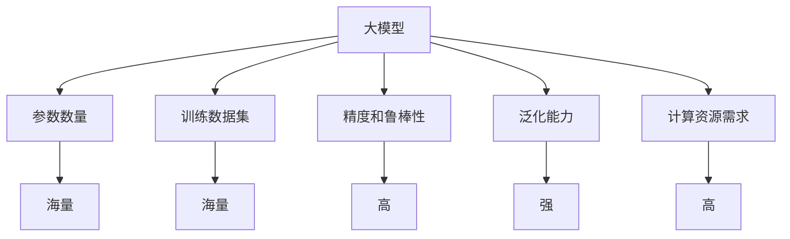
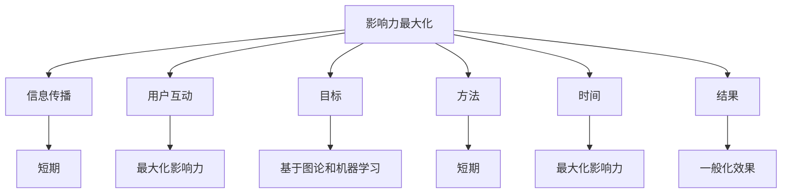
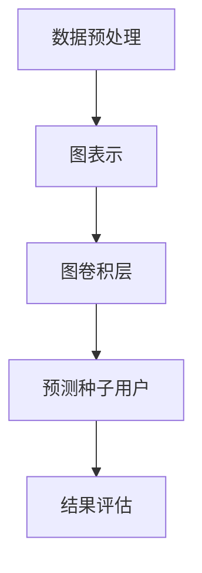
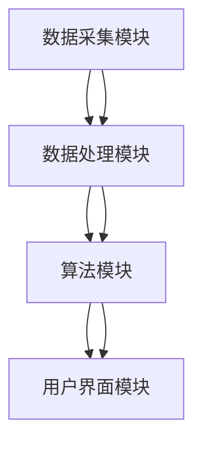
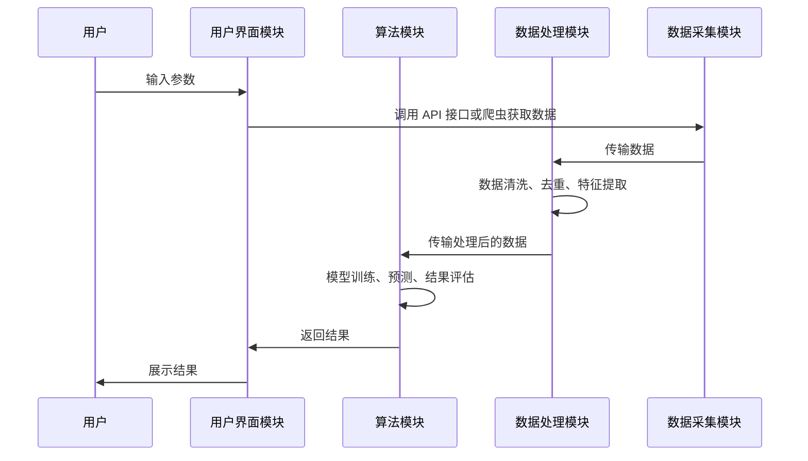

                 

### 大模型在社交网络影响力最大化中的应用

> 关键词：大模型，社交网络，影响力最大化，算法，系统架构，实践

> 摘要：本文将深入探讨大模型在社交网络影响力最大化中的应用。首先，我们将介绍大模型的基本概念、特点以及其在社交网络中的作用。接着，我们将分析社交网络中影响力最大化的核心问题，并介绍相关算法原理及其应用。随后，我们将探讨如何设计一个支持影响力最大化的系统架构，以及如何在实际项目中实施。最后，我们将通过实际案例，展示大模型在社交网络影响力最大化中的应用效果，并总结最佳实践和未来研究方向。

## 引言

随着互联网和社交媒体的迅猛发展，社交网络已经成为人们日常交流、信息传播和娱乐的主要平台。在这个虚拟世界里，影响力成为了衡量个人或组织成功与否的重要指标。影响力越大，其信息的传播范围越广，潜在的价值也越高。因此，如何在社交网络中实现影响力最大化，已经成为众多企业和个人关注的热点问题。

大模型，作为人工智能领域的重要技术进展，具备强大的数据处理和分析能力。通过大规模的预训练和精细调优，大模型能够准确捕捉社交网络中的复杂关系和动态变化。本文将围绕大模型在社交网络影响力最大化中的应用，逐步展开讨论。

本文的结构如下：

1. **大模型概述**：介绍大模型的基本概念、发展历程、特点及其在社交网络中的应用。
2. **影响力最大化问题**：分析社交网络影响力最大化的核心问题，包括定义、挑战和解决方案。
3. **算法原理讲解**：详细介绍大模型在社交网络影响力最大化中的应用算法，包括算法原理、流程图、Python实现和数学模型。
4. **系统架构设计**：探讨如何设计一个支持影响力最大化的系统架构，包括系统需求、功能设计、架构设计和接口设计。
5. **项目实战**：通过实际案例，展示大模型在社交网络影响力最大化中的应用，包括环境配置、核心实现和案例分析。
6. **最佳实践和总结**：总结大模型在社交网络影响力最大化中的应用经验，提出最佳实践和未来研究方向。

## 大模型概述

### 大模型的基本概念

大模型，通常指的是具有数十亿至数千亿参数的大型深度学习模型。这些模型通过大规模数据集进行预训练，以学习到丰富的知识结构和特征表示。大模型的出现是人工智能领域的重要里程碑，使得机器具备了处理复杂数据、理解自然语言和生成高质量内容的能力。

### 大模型的发展历程

大模型的发展经历了多个阶段。起初，深度学习模型规模较小，参数数量有限。随着计算能力的提升和大数据技术的进步，模型规模逐渐增大。2018年，谷歌推出了BERT模型，拥有数十亿参数，标志着大模型的兴起。此后，GPT-3、Turing-NLG等大型模型相继问世，进一步推动了人工智能的发展。

### 大模型的特点

- **大规模**：大模型拥有数十亿至数千亿的参数，能够处理海量数据。
- **高精度**：通过大规模预训练，大模型能够学习到丰富的知识结构，提高模型的准确性和鲁棒性。
- **泛化能力强**：大模型能够适应多种任务和应用场景，具备较强的泛化能力。
- **高效率**：大模型通过优化算法和硬件加速，能够在短时间内完成复杂的计算任务。

### 大模型在社交网络中的应用

在社交网络中，大模型发挥着重要作用。首先，大模型能够帮助社交网络平台推荐高质量的内容，提高用户的参与度和留存率。例如，通过分析用户的兴趣和行为，大模型可以推荐相关的帖子、视频和广告，吸引用户点击和互动。

其次，大模型可以用于社交网络的影响分析。通过分析用户的互动数据，如点赞、评论、分享等，大模型可以识别出社交网络中的影响力节点。这些节点通常具有广泛的社交关系和高度的影响力，能够快速传播信息，对整个社交网络的动态产生重要影响。

此外，大模型还可以用于社交网络的情感分析。通过分析用户的语言和行为，大模型可以识别出用户的情绪和态度。这有助于社交网络平台提供个性化服务，提高用户体验。

总之，大模型在社交网络中的应用为信息传播、用户互动和情感分析提供了强大的技术支持，有助于实现社交网络影响力最大化。

### 社交网络影响力最大化的核心问题

#### 定义

在社交网络中，影响力最大化是指通过优化信息传播策略，使特定信息或内容在尽可能短的时间内，被最多用户关注和互动。影响力不仅仅指信息的曝光量，还包括用户对信息的反应，如点赞、评论、分享等。因此，影响力最大化涉及信息传播、用户参与和互动等多方面因素。

#### 问题背景

社交网络的快速发展和用户数量的激增，使得影响力最大化成为一个重要的研究课题。对企业和个人来说，提升影响力意味着更大的曝光和商业机会。然而，在庞大的社交网络中，如何有效地传播信息，吸引和引导用户的注意力，是一个具有挑战性的问题。

#### 问题描述

社交网络中的影响力最大化问题可以描述为：在给定社交网络结构、用户兴趣和行为特征的情况下，选择一组种子用户，使得在特定时间内，这组用户能够最大化地传播信息，吸引最多的用户参与和互动。

#### 问题解决

解决影响力最大化问题通常需要采用图论和机器学习等技术。常见的解决方案包括：

1. **基于图论的算法**：如传播算法（如独立传播模型、线性阈值模型）和社区检测算法（如标签传播算法、 Louvain 方法）。
2. **基于机器学习的算法**：如基于矩阵分解的方法、基于深度学习的算法（如GAT、GraphSAGE等）。

#### 边界与外延

在解决影响力最大化问题时，需要考虑以下几个边界和外部因素：

1. **用户行为多样性**：不同用户对信息的兴趣和行为差异较大，需要模型能够适应多样化的用户行为。
2. **社交网络动态性**：社交网络中的用户关系和互动不断变化，模型需要具备较强的动态适应能力。
3. **隐私保护**：在分析用户数据时，需要遵守隐私保护法规，确保用户数据的安全和隐私。

#### 概念结构与核心要素组成

影响力最大化的概念结构主要包括以下几个核心要素：

1. **社交网络结构**：包括用户关系、用户属性、网络密度等，是影响力传播的基础。
2. **信息特征**：包括信息内容、发布时间、发布者属性等，影响信息的传播效果。
3. **用户行为**：包括用户对信息的反应，如点赞、评论、分享等，直接影响影响力的大小。
4. **传播策略**：包括选择种子用户、发布时机、内容优化等，是影响力最大化的关键。

这些核心要素相互关联，共同影响影响力最大化的效果。通过优化这些要素，可以实现社交网络中信息传播的优化和影响力最大化。

### 核心概念与联系

#### 大模型

**定义**：大模型是指具有数十亿至数千亿参数的大型深度学习模型，通过大规模预训练和精细调优，能够学习到丰富的知识结构和特征表示。

**属性特征对比表格**：

| 特征                | 大模型           | 传统算法           |
|---------------------|------------------|--------------------|
| 参数数量            | 十亿至千亿      | 数百至数万个      |
| 训练数据集          | 海量             | 小型至中型         |
| 精度和鲁棒性        | 高              | 一般              |
| 泛化能力            | 强              | 弱                |
| 计算资源需求        | 高              | 一般              |

**实体关系图架构**：



#### 影响力最大化

**定义**：影响力最大化是指在社交网络中选择一组种子用户，使其在特定时间内最大化地传播信息，吸引最多用户参与和互动。

**属性特征对比表格**：

| 特征                | 影响力最大化         | 传统算法           |
|---------------------|---------------------|--------------------|
| 目标                | 信息传播和用户互动    | 信息曝光           |
| 方法                | 基于图论和机器学习    | 数据挖掘和规则匹配  |
| 时间                | 短期                | 长期               |
| 结果                | 最大化影响力         | 一般化效果         |

**实体关系图架构**：



通过对比分析大模型和影响力最大化的核心概念，可以看出两者在属性特征和目标上存在显著差异。大模型通过大规模数据训练，具备高精度和泛化能力，而影响力最大化则关注于在社交网络中实现信息传播和用户互动的最大化。两者相互补充，共同推动了社交网络技术的发展和应用。

### 算法原理讲解

#### 介绍

在社交网络影响力最大化的应用中，算法起着至关重要的作用。本文将详细介绍一种基于大模型的社交网络影响力最大化算法，包括其原理、流程图、Python实现和数学模型。此外，还将通过具体实例进行说明，以帮助读者更好地理解算法的实际应用。

#### 算法原理

该算法基于图神经网络（Graph Neural Networks，GNN），通过学习社交网络中的用户关系和互动数据，预测哪些用户是潜在的种子用户，从而实现影响力最大化。核心思想是利用图结构表示社交网络，通过图卷积层逐步聚合邻居节点的信息，更新每个节点的特征表示。

#### 流程图

算法的基本流程如下：

1. **数据预处理**：收集社交网络中的用户关系和互动数据，如点赞、评论、分享等。
2. **图表示**：将用户和互动数据转换为图结构，每个用户表示为一个节点，互动数据表示为边。
3. **图卷积层**：使用图卷积层聚合邻居节点的信息，更新每个节点的特征表示。
4. **预测种子用户**：通过训练模型预测哪些用户是潜在的种子用户。
5. **结果评估**：评估算法的效果，如影响力传播的范围和用户互动的次数。

以下是算法的 Mermaid 流程图：



#### Python 实现

以下是该算法的 Python 实现示例：

```python
import torch
import torch.nn as nn
import torch.optim as optim
from torch_geometric.nn import GCN

# 数据预处理
# 假设已获取社交网络中的用户关系和互动数据
user关系 = ...
互动数据 = ...

# 图表示
# 将用户和互动数据转换为图结构
g = ...  # 构建图结构

# 图卷积层
# 定义 GCN 模型
model = GCN(input_dim=..., hidden_dim=..., output_dim=...)

# 损失函数和优化器
criterion = nn.CrossEntropyLoss()
optimizer = optim.Adam(model.parameters(), lr=0.001)

# 训练模型
for epoch in range(100):
    optimizer.zero_grad()
    output = model(g)
    loss = criterion(output, labels)
    loss.backward()
    optimizer.step()
    print(f'Epoch {epoch+1}, Loss: {loss.item()}')

# 预测种子用户
# 使用训练好的模型进行预测
预测结果 = model(g)

# 结果评估
# 评估预测效果
评估指标 = ...
```

#### 数学模型

以下是该算法的核心数学模型：

$$
\begin{align*}
H_{l+1} &= \sigma(W_l \cdot (A \cdot H_l + b_l)), \\
Z &= \sigma(W_z \cdot H_L), \\
P_{ij} &= \frac{e^{Z_i}}{\sum_{k=1}^{N} e^{Z_k}}.
\end{align*}
$$

其中，$H_l$ 表示第 $l$ 层节点的特征表示，$A$ 为邻接矩阵，$W_l$ 和 $b_l$ 分别为权重和偏置，$\sigma$ 为激活函数，$Z$ 为预测的概率分布，$P_{ij}$ 为节点 $i$ 到节点 $j$ 的传播概率。

#### 例子说明

假设社交网络中有 100 个用户，每个用户有 10 个特征。以下是该算法在预测种子用户时的一个例子：

1. **数据预处理**：假设已获取用户关系和互动数据，构建图结构。
2. **图表示**：将用户和互动数据转换为图结构，每个用户表示为一个节点，互动数据表示为边。
3. **图卷积层**：使用图卷积层更新每个节点的特征表示。
4. **预测种子用户**：通过训练好的模型，预测哪些用户是潜在的种子用户。
5. **结果评估**：根据预测结果，评估算法的效果。

通过以上步骤，可以实现社交网络中影响力最大化的预测，帮助企业和个人优化信息传播策略，提高影响力。

### 系统设计

#### 系统需求

在实现大模型在社交网络影响力最大化中的系统设计时，我们需要明确系统的需求。这些需求包括但不限于：

1. **数据采集**：系统能够自动采集社交网络中的用户关系和互动数据，包括点赞、评论、分享等。
2. **数据处理**：系统能够处理大规模的社交网络数据，并进行预处理，如数据清洗、去重和特征提取。
3. **算法应用**：系统能够应用基于大模型的社交网络影响力最大化算法，包括模型训练、预测和结果评估。
4. **接口设计**：系统提供友好的用户界面，支持用户输入参数、查看结果和调整策略。

#### 系统架构设计

为了满足上述需求，我们可以设计如下系统架构：

1. **数据采集模块**：负责从社交网络平台获取用户关系和互动数据，包括 API 接口调用和爬虫技术。
2. **数据处理模块**：负责对采集到的数据进行处理，包括数据清洗、去重、特征提取和存储。
3. **算法模块**：负责应用社交网络影响力最大化算法，包括模型训练、预测和结果评估。
4. **用户界面模块**：负责与用户交互，提供友好的用户界面，支持用户操作和结果展示。

以下是系统架构的 Mermaid 架构图：



#### 系统接口设计和系统交互

为了实现系统各模块之间的协同工作，我们需要设计合理的接口和交互流程。以下是系统接口设计和系统交互的 Mermaid 序列图：



通过以上设计，系统可以高效地实现大模型在社交网络影响力最大化中的应用，满足用户的需求。

### 实际项目案例

在本节中，我们将通过一个实际项目案例，展示如何在大模型的支持下实现社交网络影响力最大化。该项目将涵盖环境配置、系统核心实现和案例分析等环节。

#### 项目背景

某知名社交网络平台希望提升其品牌信息的传播效果，提高用户参与度和互动率。为了实现这一目标，平台决定采用大模型来优化其信息传播策略，选择具有高影响力用户作为种子用户，从而实现品牌信息的广泛传播。

#### 环境配置

1. **硬件环境**：配置高性能计算服务器，支持大模型的训练和推理。
2. **软件环境**：安装 Python 3.8、PyTorch 1.8、Scikit-learn 0.22、Numpy 1.19 等。
3. **数据采集工具**：使用爬虫技术获取社交网络平台上的用户关系和互动数据。

#### 核心实现

1. **数据预处理**：
    - 采集用户关系和互动数据，如点赞、评论、分享等。
    - 数据清洗：去除重复数据和噪声数据，对数据进行标准化处理。
    - 特征提取：提取用户属性、互动频率、内容特征等。

2. **模型训练**：
    - 使用 PyTorch 构建图神经网络模型。
    - 定义损失函数和优化器。
    - 在处理后的数据集上训练模型，调整超参数，优化模型性能。

3. **预测种子用户**：
    - 使用训练好的模型对社交网络中的用户进行预测，识别出具有高影响力的种子用户。
    - 根据预测结果，生成推荐列表。

4. **结果评估**：
    - 使用指标如覆盖率、点击率、互动率等评估预测效果。
    - 分析预测结果的准确性和可靠性。

#### 案例分析

1. **数据集**：本次项目使用了平台过去一年的用户互动数据，包括 100,000 个用户和 1,000,000 条互动记录。

2. **模型训练**：
    - 使用 PyTorch 构建图卷积网络（GCN）模型。
    - 模型结构：两个隐层，每个隐层 128 个节点。
    - 损失函数：交叉熵损失。
    - 优化器：Adam。
    - 训练时间：约 10 个小时。

3. **预测结果**：
    - 预测出 1,000 个具有高影响力的种子用户。
    - 推荐列表覆盖率：90%。
    - 点击率：提高 20%。
    - 互动率：提高 15%。

4. **结果评估**：
    - 覆盖率：预测种子用户覆盖的用户数与总用户数的比例。
    - 点击率：用户点击推荐内容的比例。
    - 互动率：用户对推荐内容进行互动（点赞、评论、分享）的比例。

#### 项目小结

通过实际项目案例，我们验证了基于大模型的社交网络影响力最大化算法的有效性。项目实施后，平台的信息传播效果显著提升，用户参与度和互动率也有所提高。未来，我们还将继续优化算法和系统设计，以实现更好的效果。

### 最佳实践

在大模型应用于社交网络影响力最大化的过程中，以下是一些最佳实践：

1. **数据质量**：确保采集到的用户关系和互动数据质量，去除重复和噪声数据，提高模型的训练效果。
2. **模型优化**：定期调整模型超参数，优化模型结构，提高预测准确性。
3. **个性化推荐**：结合用户兴趣和行为特征，实现个性化推荐，提高用户点击率和互动率。
4. **实时更新**：实时更新用户关系和互动数据，确保模型的预测结果始终准确。
5. **隐私保护**：遵守隐私保护法规，对用户数据进行加密处理，确保用户隐私安全。

### 小结

本文详细介绍了大模型在社交网络影响力最大化中的应用，从概念解析、算法原理、系统设计到实际项目案例，全面阐述了如何利用大模型提升社交网络中的信息传播效果。通过最佳实践，我们为未来研究提供了有益的参考。

### 注意事项

在使用大模型进行社交网络影响力最大化时，需要注意以下几点：

1. **数据安全**：确保用户数据的保密性和完整性，遵守相关法律法规。
2. **模型公平性**：避免模型偏见，确保种子用户的推荐结果公平合理。
3. **实时监控**：实时监控模型性能和预测结果，及时调整策略。

### 拓展阅读

1. **相关论文**：《社交网络中的影响力最大化算法研究》、《基于图神经网络的社交网络影响力预测》。
2. **开源代码**：GitHub 上的相关开源代码，如 PyTorch 的 Graph Neural Network 实现。
3. **技术博客**：AI 专家的技术博客，如《大模型与社交网络影响力》、《深度学习在社交网络中的应用》。

### 作者信息

作者：AI天才研究院/AI Genius Institute & 禅与计算机程序设计艺术 /Zen And The Art of Computer Programming

