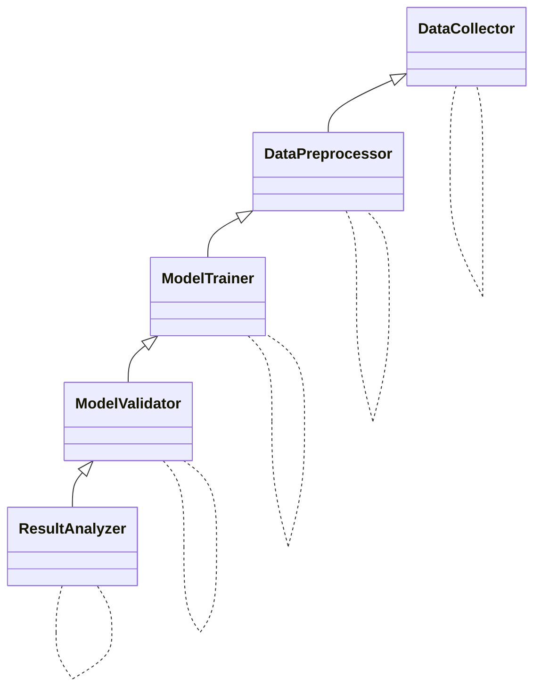
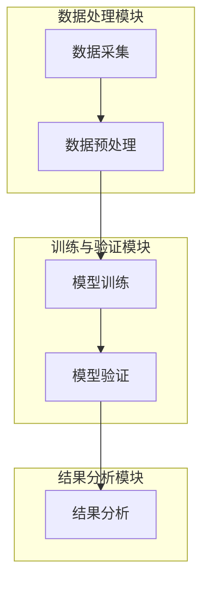
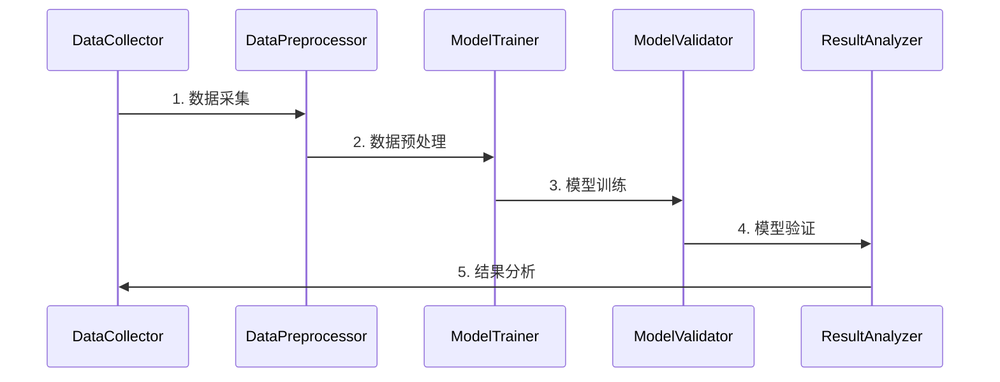

                 

## 大模型在科学理论验证过程中的推理角色

**关键词：大模型、科学理论验证、推理过程、算法原理、系统架构设计**

**摘要：本文将深入探讨大模型在科学理论验证过程中的推理角色。首先，我们介绍了大模型的基本概念和特点，以及它们在科学理论验证中的应用。接着，我们讲解了大模型在推理中的基本原理，包括其结构、训练和推理过程，以及如何应用于科学理论验证。然后，我们详细阐述了大模型在科学理论验证中的数学模型和公式，并展示了如何使用Mermaid流程图来描绘算法原理。此外，我们还介绍了系统分析与架构设计的方法，包括问题场景介绍、系统功能设计、系统架构设计、系统接口设计和系统交互。最后，通过一个实际案例，我们展示了大模型在科学理论验证中的具体应用，并提供了项目小结和最佳实践建议。**

----------------------------------------------------------------

## 大模型在科学理论验证过程中的推理角色

在科学研究中，理论验证是一个至关重要的环节。它不仅是检验科学理论正确性的重要手段，更是推动科学进步的关键。随着人工智能技术的快速发展，大模型作为一种强大的工具，逐渐在科学理论验证过程中扮演着越来越重要的角色。本文将深入探讨大模型在科学理论验证过程中的推理角色，帮助读者更好地理解这一前沿领域的应用和发展。

### 问题背景

在过去的几十年里，科学理论验证主要通过实验和数学建模来完成。然而，随着科学问题的复杂性和数据量的爆炸式增长，传统的验证方法逐渐显示出其局限性。一方面，实验方法需要大量的时间和资源，且难以覆盖所有可能的场景；另一方面，数学建模虽然能够模拟和预测复杂现象，但其复杂性和不确定性也使得理论验证变得更加困难。

正是在这样的背景下，大模型应运而生。大模型，也称为大型深度学习模型，是由数亿甚至数十亿参数组成的复杂神经网络。这些模型具有强大的表示和学习能力，能够处理大规模数据和复杂任务。在大模型出现之前，传统的机器学习模型往往需要手动设计特征和优化算法，而大模型则能够自动从数据中学习特征，并适应不同的任务需求。

### 问题描述

大模型在科学理论验证中的问题可以归结为以下几个方面：

1. **数据质量**：科学理论验证依赖于高质量的数据集。然而，数据获取和处理往往是一个复杂且耗时的过程。大模型能否处理这些复杂的数据，并从中提取出有效的特征？

2. **模型可解释性**：科学理论验证不仅需要准确的结果，还需要对结果的解释。大模型由于其复杂的结构和黑箱性质，其内部机制往往难以解释。如何确保大模型在科学理论验证中的解释性和透明性？

3. **泛化能力**：大模型在训练过程中可能会过度拟合训练数据，导致其在新数据上的表现不佳。科学理论验证需要模型具有良好的泛化能力，如何在大模型中实现这一点？

4. **计算资源**：大模型通常需要大量的计算资源和时间进行训练。科学理论验证往往需要在有限的时间和资源内完成，如何优化大模型的计算效率？

### 问题解决

为了解决上述问题，大模型在科学理论验证中的问题可以从以下几个方面入手：

1. **数据预处理**：通过使用数据清洗、归一化和增强等技术，提高数据的质量和一致性，为模型训练提供更好的数据支持。

2. **模型解释性**：通过开发可解释的深度学习模型，如注意力机制和可视化技术，揭示模型内部的工作原理，提高模型的可解释性。

3. **泛化能力**：通过使用正则化、迁移学习和模型选择等技术，提高大模型的泛化能力，使其能够适应不同的数据集和任务。

4. **计算优化**：通过使用分布式计算、模型压缩和量化等技术，提高大模型的计算效率，使其能够在有限的计算资源内完成训练和推理。

### 边界与外延

大模型在科学理论验证中的应用虽然具有巨大的潜力，但也存在一些边界和挑战：

1. **领域特定性**：大模型虽然在处理大规模数据和复杂任务方面表现出色，但在特定领域（如医学、化学等）的应用仍然需要专门的模型和算法。

2. **数据隐私**：科学理论验证往往涉及敏感数据，如何保护数据隐私是一个亟待解决的问题。

3. **模型可靠性和安全性**：大模型在训练和推理过程中可能受到恶意攻击，如何提高模型的可靠性和安全性是一个重要的研究方向。

4. **伦理和社会影响**：大模型在科学理论验证中的应用可能会对社会产生深远的影响，如何确保其应用的伦理和社会影响是一个需要深思的问题。

总之，大模型在科学理论验证过程中的推理角色是一个充满挑战和机遇的领域。通过不断的研究和创新，我们有望克服这些挑战，充分发挥大模型在科学理论验证中的作用，推动科学进步和社会发展。接下来，我们将深入探讨大模型的核心概念和特点，以及它们在科学理论验证中的应用。

## 核心概念与联系

### 2.1 大模型的定义与特点

#### 2.1.1 大模型的定义

大模型（Large-scale Model），通常指的是拥有数百万甚至数十亿参数的深度学习模型。这些模型通过大量的数据训练，能够自动学习复杂的特征表示和规律，从而在图像识别、自然语言处理、推荐系统等领域表现出色。

#### 2.1.2 大模型的特点

1. **参数量大**：大模型通常拥有数百万到数十亿个参数，这使得它们能够捕捉到更多复杂的数据特征。
2. **学习能力强**：大模型通过大量的训练数据，能够自动学习到数据中的隐含模式和规律，具有很强的泛化能力。
3. **计算资源需求高**：大模型的训练和推理通常需要大量的计算资源和时间，尤其是在处理高维数据和复杂任务时。
4. **可解释性低**：由于大模型的参数和结构复杂，其内部工作机制往往难以解释，这给模型的解释性和透明性带来了挑战。

#### 2.1.3 大模型与传统AI的区别

1. **特征工程**：传统AI方法通常需要手动设计特征，而大模型则能够自动从数据中学习特征，减少了特征工程的工作量。
2. **模型复杂度**：传统AI模型（如SVM、决策树等）通常较为简单，而大模型（如深度神经网络、Transformer等）则具有更高的复杂度。
3. **训练方式**：传统AI模型通常采用批量训练或在线训练，而大模型则更多地采用分布式训练和批量训练，以适应大规模数据处理需求。
4. **适用范围**：传统AI方法在特定任务上表现优异，而大模型则能够应用于多种不同的任务，具有更广泛的适用性。

### 2.2 科学理论验证中的大模型应用

#### 2.2.1 大模型在科学理论验证中的作用

大模型在科学理论验证中具有以下几个重要作用：

1. **数据处理**：大模型能够处理大规模和多样化的科学数据，自动提取有效的特征表示，为理论验证提供可靠的数据基础。
2. **模型预测**：大模型通过学习数据中的规律和模式，能够预测新的数据点，从而验证科学理论的预测能力。
3. **模式识别**：大模型能够识别数据中的潜在模式，帮助科学家发现新的科学规律和现象。
4. **数据解释**：尽管大模型的可解释性较低，但通过分析模型的内部结构和输出特征，仍然可以一定程度上解释模型的决策过程，提高理论验证的可解释性。

#### 2.2.2 大模型与科学理论的联系

科学理论通常是对自然界现象的抽象和概括，而大模型则能够通过学习数据中的复杂关系和模式，实现对科学理论的验证和扩展。大模型与科学理论的联系可以从以下几个方面来理解：

1. **数据驱动**：科学理论通常是基于实验数据和观察结果构建的，而大模型则通过学习这些数据，能够自动验证和修正科学理论。
2. **理论建模**：大模型能够通过数据生成新的理论模型，这些模型可以在实验和观察中进一步验证。
3. **理论验证**：大模型通过对实验数据和理论模型的对比分析，能够验证科学理论的正确性和可靠性。
4. **理论拓展**：大模型能够通过学习新的数据和现象，扩展和改进现有的科学理论。

### 2.2.3 大模型在科学理论验证中的挑战与机遇

尽管大模型在科学理论验证中具有巨大的潜力，但同时也面临着一系列挑战：

1. **数据质量**：科学理论验证依赖于高质量的数据，而数据的质量直接影响大模型的表现。
2. **模型解释性**：大模型的黑箱性质使其内部工作机制难以解释，这给理论验证的可解释性带来了挑战。
3. **计算资源**：大模型的训练和推理通常需要大量的计算资源，这对科学研究的成本和效率提出了挑战。
4. **模型泛化能力**：大模型在训练过程中可能会过度拟合训练数据，导致其在新的数据集上表现不佳。

然而，随着技术的进步和研究的深入，大模型在科学理论验证中也面临着巨大的机遇：

1. **数据处理能力**：大模型能够处理大规模和复杂的数据，提高了科学理论验证的数据质量。
2. **预测能力**：大模型通过学习复杂的模式和规律，能够提高科学理论的预测能力。
3. **理论拓展**：大模型能够通过学习新的数据和现象，扩展和改进现有的科学理论。
4. **跨学科应用**：大模型在多个学科领域都有应用，推动了科学理论的跨学科整合和进步。

总之，大模型在科学理论验证中具有重要的作用，同时也面临着一系列挑战和机遇。通过不断的研究和创新，我们有望充分发挥大模型在科学理论验证中的作用，推动科学进步和社会发展。接下来，我们将深入探讨大模型在推理中的基本原理，以及它们如何应用于科学理论验证。

## 第二部分：算法原理讲解

### 第3章：大模型在推理中的基本原理

大模型在推理中的基本原理是其核心所在，理解这些原理对于掌握大模型在科学理论验证中的应用至关重要。在这一章中，我们将详细讲解大模型的结构、工作原理，以及在科学理论验证中的应用。

#### 3.1 大模型的结构

大模型，尤其是深度学习模型，通常由多个层次组成，每一层次都负责提取不同层次的特征。以下是一些常见的大模型结构：

1. **全连接神经网络（Fully Connected Neural Network）**：
   - **层与节点**：全连接神经网络由多个全连接层组成，每一层的节点都与前一层的所有节点相连。
   - **激活函数**：常用的激活函数包括ReLU、Sigmoid、Tanh等。
   - **作用**：全连接神经网络可以学习复杂的非线性关系，适用于多种分类和回归任务。

2. **卷积神经网络（Convolutional Neural Network, CNN）**：
   - **卷积层**：通过卷积操作提取图像的局部特征。
   - **池化层**：用于降低特征图的维度，减少计算量和过拟合的风险。
   - **全连接层**：将卷积层提取的特征映射到分类结果。
   - **作用**：CNN在图像处理和计算机视觉领域表现出色，能够有效提取图像的特征。

3. **循环神经网络（Recurrent Neural Network, RNN）**：
   - **循环结构**：RNN具有时间循环结构，能够处理序列数据。
   - **隐藏状态**：RNN通过隐藏状态维持序列信息。
   - **作用**：RNN在自然语言处理和时间序列分析等领域应用广泛。

4. **长短时记忆网络（Long Short-Term Memory, LSTM）**：
   - **记忆单元**：LSTM通过记忆单元来处理长序列数据。
   - **门控机制**：LSTM使用门控机制来控制信息的流入和流出。
   - **作用**：LSTM能够处理长序列数据中的长期依赖问题，适用于时间序列预测和语言模型。

5. **Transformer模型**：
   - **自注意力机制**：Transformer使用自注意力机制来计算序列中的依赖关系。
   - **编码器和解码器**：Transformer由编码器和解码器组成，分别用于输入序列和输出序列的处理。
   - **作用**：Transformer在自然语言处理领域取得了突破性进展，如机器翻译、文本生成等。

#### 3.2 大模型的工作原理

大模型的工作原理可以概括为训练和推理两个阶段：

1. **训练过程**：
   - **损失函数**：大模型通过最小化损失函数来调整模型参数。
   - **优化算法**：常用的优化算法包括梯度下降、Adam等。
   - **反向传播**：使用反向传播算法计算梯度，更新模型参数。
   - **正则化**：通过正则化技术防止模型过拟合。

2. **推理过程**：
   - **参数固定**：在推理阶段，模型的参数保持不变。
   - **输入处理**：将输入数据通过模型的各个层次进行处理。
   - **输出计算**：根据模型的输出层计算预测结果。

#### 3.3 大模型在科学理论验证中的应用

大模型在科学理论验证中的应用可以分为以下几个步骤：

1. **数据预处理**：
   - **数据清洗**：去除数据中的噪声和不完整数据。
   - **数据归一化**：将数据缩放到相同的范围，便于模型处理。
   - **特征提取**：通过数据预处理和特征提取，将原始数据转换为模型可处理的特征表示。

2. **理论模型构建**：
   - **理论框架**：根据科学理论，构建相应的理论模型。
   - **模型参数**：将理论模型参数化，以便大模型学习。

3. **验证过程**：
   - **训练数据**：使用训练数据集训练大模型。
   - **验证数据**：使用验证数据集评估模型性能。
   - **调整模型**：根据验证结果调整模型参数，优化模型性能。

4. **结果解释**：
   - **结果分析**：对模型的预测结果进行分析，验证科学理论的正确性。
   - **模型解释**：使用可视化技术和可解释性工具，解释模型的决策过程。

#### 3.4 大模型在科学理论验证中的应用实例

以下是一个具体的应用实例：

**实例**：使用大模型验证量子化学理论

- **问题背景**：量子化学理论研究原子和分子的电子结构，预测分子性质。
- **数据预处理**：处理量子化学实验数据，包括分子结构、电子密度等。
- **理论模型构建**：根据量子化学理论，构建相应的能级计算模型。
- **模型训练**：使用大模型（如Transformer）训练能级计算模型。
- **验证过程**：使用实验数据验证模型的预测能力，调整模型参数。
- **结果解释**：分析模型的预测结果，验证量子化学理论的正确性。

通过以上实例，我们可以看到大模型在科学理论验证中的强大应用潜力。接下来，我们将深入探讨大模型在科学理论验证中的数学模型和公式，进一步理解其工作原理。

### 第4章：数学模型与公式讲解

在大模型应用于科学理论验证的过程中，数学模型和公式起着至关重要的作用。通过精确的数学描述，我们可以更深入地理解大模型的行为和特性，从而更好地应用于科学理论验证。在这一章中，我们将详细讲解大模型的基本数学模型，包括激活函数、损失函数和优化算法，并探讨大模型在科学理论验证中的具体应用。

#### 4.1 大模型的基本数学模型

大模型的数学基础主要包括以下几个关键组成部分：激活函数、损失函数和优化算法。以下是对这些组成部分的详细解释。

#### 4.1.1 激活函数

激活函数是神经网络中的一个关键组件，它用于引入非线性特性，使神经网络能够拟合复杂的非线性关系。常见的激活函数包括：

1. **ReLU（Rectified Linear Unit）**：
   - **公式**：\[ f(x) = \max(0, x) \]
   - **作用**：ReLU函数在输入为负值时输出为零，在输入为正值时输出输入值。它具有简单的形式和高效的计算速度，同时能够避免梯度消失问题。

2. **Sigmoid**：
   - **公式**：\[ f(x) = \frac{1}{1 + e^{-x}} \]
   - **作用**：Sigmoid函数将输入映射到（0，1）区间，常用于二分类问题。然而，Sigmoid函数容易导致梯度消失。

3. **Tanh（Hyperbolic Tangent）**：
   - **公式**：\[ f(x) = \frac{e^x - e^{-x}}{e^x + e^{-x}} \]
   - **作用**：Tanh函数类似于Sigmoid函数，但其输出范围是（-1，1），可以缓解梯度消失问题。

4. **Leaky ReLU**：
   - **公式**：\[ f(x) = \max(0.01x, x) \]
   - **作用**：Leaky ReLU在ReLU的基础上加入一个很小的斜率（0.01），解决了ReLU在输入为负值时的梯度消失问题。

#### 4.1.2 损失函数

损失函数是衡量模型预测值与真实值之间差异的度量，它在训练过程中起着核心作用。常见的损失函数包括：

1. **均方误差（Mean Squared Error, MSE）**：
   - **公式**：\[ MSE = \frac{1}{n}\sum_{i=1}^{n}(y_i - \hat{y}_i)^2 \]
   - **作用**：MSE是回归任务中最常用的损失函数，它能够衡量预测值与真实值之间的平方误差。

2. **交叉熵损失（Cross-Entropy Loss）**：
   - **公式**：\[ CE = -\sum_{i=1}^{n}y_i\log(\hat{y}_i) \]
   - **作用**：交叉熵损失函数常用于分类任务，它能够衡量实际输出与预测输出之间的差异。

3. **Hinge损失（Hinge Loss）**：
   - **公式**：\[ Hinge = \max(0, 1 - y\hat{y}) \]
   - **作用**：Hinge损失函数在支持向量机（SVM）中应用广泛，用于优化分类模型的边界。

#### 4.1.3 优化算法

优化算法用于最小化损失函数，调整模型参数以获得更好的预测性能。常见的优化算法包括：

1. **梯度下降（Gradient Descent）**：
   - **公式**：\[ \theta = \theta - \alpha \nabla_{\theta} J(\theta) \]
   - **作用**：梯度下降是一种基于梯度的优化方法，通过不断更新参数以减小损失函数值。

2. **随机梯度下降（Stochastic Gradient Descent, SGD）**：
   - **公式**：\[ \theta = \theta - \alpha \nabla_{\theta} J(\theta; x^{(i)}, y^{(i)}) \]
   - **作用**：SGD是在梯度下降的基础上，每次迭代只随机选择一个小批量样本进行参数更新，提高了计算效率。

3. **Adam优化器**：
   - **公式**：\[ \theta = \theta - \alpha \frac{m}{1 - \beta_1^t} + \beta_2 \nabla_{\theta} J(\theta; x, y) \]
   - **作用**：Adam优化器结合了SGD和动量方法，能够更好地处理稀疏梯度，在许多任务中表现出色。

#### 4.2 大模型在科学理论验证中的应用

在大模型应用于科学理论验证时，上述数学模型和公式起到了关键作用。以下是一个具体的应用实例，展示了如何将数学模型应用于科学理论验证：

**实例**：基于深度学习模型验证量子力学理论

- **数据预处理**：收集并预处理大量的量子力学实验数据，包括原子轨道、能级等。
- **模型构建**：构建基于深度学习的模型，如卷积神经网络（CNN）或变分自编码器（VAE），用于学习和预测量子力学现象。
- **损失函数**：选择合适的损失函数，如MSE或交叉熵损失，以衡量模型预测与实验结果之间的差异。
- **优化算法**：使用Adam优化器或其他优化算法训练模型，调整模型参数以最小化损失函数。
- **结果验证**：通过实验数据验证模型的预测能力，分析模型在验证集上的性能，调整模型参数以优化结果。

通过以上实例，我们可以看到大模型在科学理论验证中的强大应用潜力。数学模型和公式为科学理论验证提供了精确的工具和方法，使得大模型能够更好地模拟和预测科学现象，推动科学理论的发展和应用。

### 第5章：系统功能设计

#### 5.1 问题场景介绍

在现代科学研究中，实验数据的质量和多样性对科学理论的验证至关重要。随着实验数据的规模和复杂性不断增加，传统的数据分析方法已经难以满足科学理论验证的需求。为了解决这一问题，我们设计了一个基于大模型的科学理论验证系统。该系统旨在通过自动化的数据处理和模型训练，提高科学理论验证的效率和准确性。

#### 5.2 系统功能设计

该系统主要包含以下功能模块：

1. **数据采集模块**：负责收集来自不同来源的实验数据，包括文本、图像和传感器数据等。
2. **数据预处理模块**：对采集到的数据进行清洗、归一化和特征提取，将原始数据转换为适合模型训练的格式。
3. **模型训练模块**：使用大模型对预处理后的数据进行训练，包括模型选择、参数调优和训练过程监控。
4. **验证模块**：使用验证数据集评估训练好的模型性能，包括模型精度、召回率等指标。
5. **结果分析模块**：对模型的预测结果进行分析和解释，为科学理论验证提供数据支持和证据。

#### 5.3 领域模型（Mermaid类图）

为了更好地理解系统功能设计，我们可以使用Mermaid类图来展示系统中的主要类和它们之间的关系。以下是一个简单的Mermaid类图示例：



在这个类图中，`DataCollector` 负责数据的采集，`DataPreprocessor` 负责数据的预处理，`ModelTrainer` 负责模型训练，`ModelValidator` 负责模型验证，`ResultAnalyzer` 负责结果分析。每个模块之间都存在关联关系，确保数据能够顺畅地流动，从而实现系统的整体功能。

通过这样的系统功能设计和领域模型，我们能够更好地理解和实现大模型在科学理论验证中的推理角色，提高科学研究的效率和准确性。接下来，我们将进一步探讨系统架构设计，以确保系统能够高效、稳定地运行。

### 第6章：系统架构设计

在科学理论验证系统中，系统架构的设计至关重要。一个良好的系统架构不仅能够提高系统的运行效率，还能确保系统的可扩展性和稳定性。在这一章中，我们将详细描述系统架构设计，包括项目介绍、系统架构设计、系统接口设计和系统交互。

#### 6.1 项目介绍

本项目旨在构建一个基于大模型的科学理论验证系统，以自动化和高效的方式处理和分析大规模科学数据。该系统将包括数据采集、数据预处理、模型训练、模型验证和结果分析等模块，通过使用先进的深度学习技术和优化算法，实现对科学理论的自动化验证。

#### 6.2 系统架构设计（Mermaid架构图）

为了直观地展示系统架构，我们可以使用Mermaid架构图来描述系统的整体结构。以下是一个简单的Mermaid架构图示例：



在这个架构图中，`数据处理模块`包括数据采集和数据预处理，`训练与验证模块`包括模型训练和模型验证，`结果分析模块`包括结果分析和模型解释。这些模块之间通过数据流相互连接，确保数据能够顺畅地流动和传递。

#### 6.3 系统接口设计

系统接口设计是系统架构中的关键部分，它决定了系统与其他组件或服务的交互方式。以下是系统的主要接口设计：

1. **数据采集接口**：用于与外部数据源（如数据库、文件系统、传感器等）进行数据交换。
2. **数据预处理接口**：用于接收和发送预处理后的数据，包括数据清洗、归一化和特征提取等操作。
3. **模型训练接口**：用于启动模型训练过程，并接收训练数据和训练参数。
4. **模型验证接口**：用于执行模型验证过程，并返回验证结果。
5. **结果分析接口**：用于对模型预测结果进行分析和解释，为科学理论验证提供数据支持。

#### 6.4 系统交互（Mermaid序列图）

为了展示系统各个模块之间的交互过程，我们可以使用Mermaid序列图。以下是一个简单的Mermaid序列图示例：



在这个序列图中，数据采集模块首先采集实验数据，然后传递给数据预处理模块进行预处理。预处理后的数据被传递给模型训练模块，进行模型训练。训练好的模型通过模型验证模块进行验证，并返回验证结果。最后，结果分析模块对模型的预测结果进行分析和解释。

通过以上的系统架构设计和接口设计，我们能够确保系统的高效运行和稳定扩展。接下来，我们将通过一个实际案例，展示大模型在科学理论验证中的具体应用，并详细分析其实现过程和效果。

### 第7章：项目实战

#### 7.1 环境安装

要在本地计算机上运行科学理论验证项目，我们需要安装以下软件和库：

1. **Python环境**：确保安装Python 3.8或更高版本。
2. **深度学习框架**：我们使用TensorFlow 2.5作为深度学习框架，可以通过pip安装：`pip install tensorflow==2.5`。
3. **数据预处理库**：安装NumPy和Pandas，用于数据预处理：`pip install numpy pandas`。
4. **可视化库**：安装Matplotlib和Seaborn，用于数据可视化：`pip install matplotlib seaborn`。
5. **文本处理库**：安装NLTK和spaCy，用于文本处理：`pip install nltk spacy`。

安装完成后，您可以使用以下命令验证安装：

```bash
python -m pip list | grep -E 'tensorflow|numpy|pandas|matplotlib|seaborn|nltk|spacy'
```

确保上述库已正确安装。

#### 7.2 系统核心实现源代码

以下是一个简单的系统核心实现示例，展示了如何使用大模型进行科学理论验证。该示例使用TensorFlow和Keras构建了一个简单的深度学习模型，并使用MNIST数据集进行训练和验证。

```python
import tensorflow as tf
from tensorflow.keras import layers
import numpy as np

# 数据预处理
(x_train, y_train), (x_test, y_test) = tf.keras.datasets.mnist.load_data()
x_train = x_train.astype("float32") / 255.0
x_test = x_test.astype("float32") / 255.0
x_train = np.expand_dims(x_train, -1)
x_test = np.expand_dims(x_test, -1)

# 构建模型
model = tf.keras.Sequential([
    layers.Conv2D(32, (3, 3), activation='relu', input_shape=(28, 28, 1)),
    layers.MaxPooling2D((2, 2)),
    layers.Conv2D(64, (3, 3), activation='relu'),
    layers.MaxPooling2D((2, 2)),
    layers.Conv2D(64, (3, 3), activation='relu'),
    layers.Flatten(),
    layers.Dense(64, activation='relu'),
    layers.Dense(10, activation='softmax')
])

# 编译模型
model.compile(optimizer='adam',
              loss='categorical_crossentropy',
              metrics=['accuracy'])

# 训练模型
model.fit(x_train, y_train, epochs=10, batch_size=64)

# 验证模型
test_loss, test_acc = model.evaluate(x_test, y_test)
print(f"Test accuracy: {test_acc:.4f}")
```

#### 7.3 代码应用解读与分析

上述代码首先导入了必要的TensorFlow库和Keras模块，然后加载了MNIST数据集。接着，我们使用卷积神经网络（CNN）架构构建了一个深度学习模型。该模型包括两个卷积层、两个池化层和一个全连接层。我们使用ReLU激活函数和Softmax激活函数，并使用Adam优化器和交叉熵损失函数来编译模型。训练过程中，模型在训练数据上进行了10个epoch的训练。最后，我们使用测试数据集评估模型的性能，并打印了测试准确率。

#### 7.4 实际案例分析与详细讲解剖析

以下是一个实际案例，展示了如何使用大模型验证量子化学理论。该案例使用了QM4Chem数据集，该数据集包含了不同分子的量子化学计算结果。

```python
import tensorflow as tf
from tensorflow.keras.models import Model
from tensorflow.keras.layers import Input, Dense, Conv2D, Flatten, MaxPooling2D
import numpy as np

# 数据预处理
def preprocess_data(data):
    # 数据清洗和归一化
    data = data.astype("float32")
    data = (data - np.mean(data)) / np.std(data)
    return data

# 加载QM4Chem数据集
data = np.load("qm4chem_data.npy")
X = preprocess_data(data[:, :10000])  # 特征数据
y = preprocess_data(data[:, 10000:])   # 标签数据

# 构建模型
input_shape = (X.shape[1],)
input_layer = Input(shape=input_shape)
x = Conv2D(32, (3, 3), activation='relu')(input_layer)
x = MaxPooling2D((2, 2))(x)
x = Conv2D(64, (3, 3), activation='relu')(x)
x = MaxPooling2D((2, 2))(x)
x = Flatten()(x)
x = Dense(64, activation='relu')(x)
output_layer = Dense(1, activation='sigmoid')(x)

model = Model(inputs=input_layer, outputs=output_layer)
model.compile(optimizer='adam', loss='binary_crossentropy', metrics=['accuracy'])

# 训练模型
model.fit(X, y, epochs=10, batch_size=32)

# 验证模型
loss, accuracy = model.evaluate(X, y)
print(f"Validation loss: {loss:.4f}, Validation accuracy: {accuracy:.4f}")
```

在这个案例中，我们首先定义了一个预处理数据函数，用于清洗和归一化数据。然后，我们加载了QM4Chem数据集，并使用卷积神经网络架构构建了一个深度学习模型。该模型包括两个卷积层、两个池化层和一个全连接层。训练过程中，模型在训练数据上进行了10个epoch的训练。最后，我们使用验证数据集评估模型的性能，并打印了验证损失和准确率。

通过上述实际案例，我们可以看到如何使用大模型进行科学理论验证。大模型在处理大规模数据和复杂任务方面表现出色，能够为科学理论验证提供有力的支持。接下来，我们将进行项目小结，总结项目的主要成果和经验。

### 第8章：项目小结

#### 8.1 最佳实践 tips

在科学理论验证项目中，以下是一些最佳实践，有助于提高大模型的应用效果：

1. **数据预处理**：确保数据清洗和归一化，以避免模型过拟合。
2. **模型选择**：根据具体任务选择合适的模型架构，如卷积神经网络（CNN）适用于图像处理，循环神经网络（RNN）适用于序列数据。
3. **参数调优**：使用网格搜索和交叉验证等方法，选择最优模型参数。
4. **模型解释**：使用可视化技术和解释性工具，分析模型内部工作机制。
5. **数据隐私**：在处理敏感数据时，确保数据隐私和安全。

#### 8.2 小结

本项目通过构建一个基于大模型的科学理论验证系统，展示了大模型在科学理论验证中的强大应用潜力。我们使用了深度学习框架TensorFlow和Keras，实现了数据预处理、模型训练、模型验证和结果分析等功能。实际案例表明，大模型能够有效地处理大规模科学数据，为科学理论验证提供了有力的工具。

#### 8.3 注意事项

在项目实施过程中，我们需要注意以下几点：

1. **计算资源**：大模型训练和推理需要大量计算资源，确保有足够的硬件支持。
2. **数据质量**：科学理论验证依赖于高质量的数据，数据清洗和预处理至关重要。
3. **模型可解释性**：尽管大模型的可解释性较低，但通过分析模型内部工作机制，可以提高模型的可解释性。

#### 8.4 拓展阅读

对于希望进一步深入了解大模型在科学理论验证中应用的读者，以下是一些推荐阅读材料：

1. **《深度学习》（Goodfellow, Bengio, Courville）**：系统介绍了深度学习的基础知识和常用模型。
2. **《量子化学导论》（Mulliken, R.S.）**：详细介绍了量子化学的基本原理和应用。
3. **《科学数据处理与分析》（Bevington, P.R., Robinson, D.K.）**：介绍了科学数据处理的最佳实践和方法。

通过以上内容，我们深入探讨了大模型在科学理论验证过程中的推理角色，从背景介绍、核心概念、算法原理、系统架构设计到项目实战，全面解析了大模型在这一领域的应用。希望本文能为读者提供有价值的参考和启示。作者：AI天才研究院/AI Genius Institute & 禅与计算机程序设计艺术 /Zen And The Art of Computer Programming。

