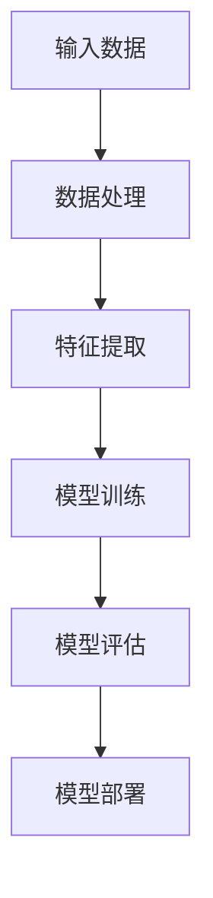
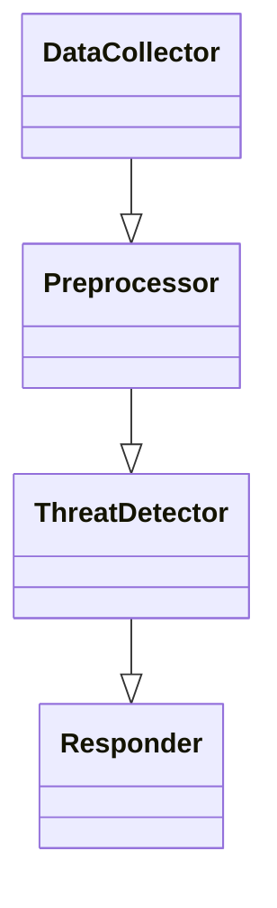
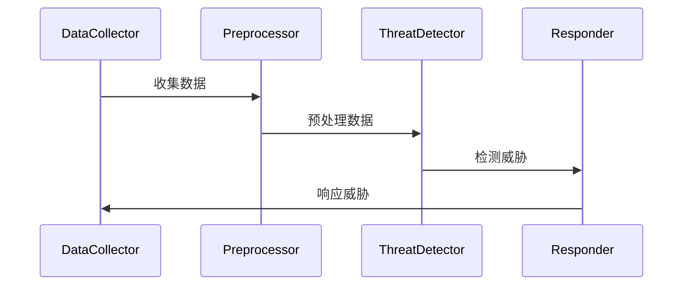

                 


### 大模型在网络安全威胁检测中的应用前景

## 关键词
- 大模型
- 网络安全威胁检测
- 深度学习
- 数据处理
- 算法原理
- 系统架构

## 摘要
本文旨在探讨大模型技术在网络安全威胁检测领域的应用前景，通过对大模型技术的核心概念、算法原理和实际应用案例的深入分析，揭示其在提升威胁检测准确性和响应速度方面的潜力与挑战。

## 目录大纲设计

### 背景介绍
- **问题背景**：网络安全威胁日益复杂，传统方法受限。
- **问题描述**：如何利用大模型技术提高威胁检测效果？
- **问题解决**：系统介绍大模型在网络安全威胁检测中的应用。
- **边界与外延**：讨论大模型在其他领域的潜在应用。
- **概念结构与核心要素组成**：明确大模型、威胁检测等核心概念。

### 核心概念与联系
- **大模型的核心概念**：介绍深度学习、神经网络等基础理论。
- **大模型的应用特点**：讨论大模型在数据处理、自适应学习等方面的优势。
- **与传统AI技术的对比**：分析大模型与传统AI技术的差异。

### 算法原理讲解
- **算法流程图**：用Mermaid画出大模型在威胁检测中的算法流程。
- **算法原理**：详细阐述数据处理、特征提取、模型训练等步骤。
- **数学模型和公式**：使用Python代码和LaTeX格式解释算法原理。

### 系统分析与架构设计方案
- **问题场景介绍**：介绍网络安全威胁检测的系统背景。
- **系统功能设计**：用Mermaid类图展示系统功能。
- **系统架构设计**：用Mermaid架构图展示系统架构。
- **系统接口设计**：设计系统数据和控制接口。
- **系统交互**：用Mermaid序列图展示系统交互过程。

### 项目实战
- **环境安装**：详细描述环境配置过程。
- **系统核心实现源代码**：提供关键代码段和解读。
- **实际案例分析和详细讲解剖析**：分析具体应用案例。
- **项目小结**：总结项目实施过程和成果。

### 最佳实践 tips
- **注意事项**：提醒潜在的技术陷阱和解决方案。
- **拓展阅读**：推荐进一步学习和研究的资源。

### 小结
- **文章总结**：回顾文章的核心观点和贡献。
- **未来展望**：讨论大模型在网络安全领域的未来发展趋势。

## 背景介绍

### 问题背景
网络安全威胁日益复杂，网络攻击手段不断演变，传统的威胁检测方法已难以应对。病毒、木马、钓鱼攻击等网络威胁呈现出多样化、隐蔽化的特点，使得传统的基于规则和签名匹配的检测手段越来越受限。此外，网络流量的指数级增长也对威胁检测系统提出了更高的要求。在这样的背景下，如何提高威胁检测的准确性和响应速度，成为了网络安全领域亟待解决的问题。

### 问题描述
大模型，特别是深度学习和神经网络技术，以其强大的数据处理和分析能力，为网络安全威胁检测带来了新的契机。然而，如何将这些先进技术有效地应用于网络安全威胁检测，仍是一个亟待解决的问题。具体来说，我们需要回答以下几个问题：

- **大模型技术的基本原理是什么？**
- **大模型在网络安全威胁检测中有哪些应用场景？**
- **如何设计和实现大模型在网络安全威胁检测中的高效应用？**
- **大模型应用中的挑战和未来发展趋势是什么？**

### 问题解决
本文将通过以下方式解决上述问题：

- **系统性地介绍大模型技术的基础知识**：包括深度学习、神经网络等核心概念。
- **深入分析大模型在网络安全威胁检测中的实际应用案例**：讨论其在威胁检测、入侵检测、恶意代码识别等领域的应用。
- **提供详细的算法原理讲解和数学模型阐述**：解释数据处理、特征提取、模型训练等关键步骤。
- **分享系统架构设计和实现经验**：介绍大模型在网络安全威胁检测中的系统架构设计和实现方法。

### 边界与外延
虽然本文主要关注大模型在网络安全领域的应用，但相关技术原理和方法也可以推广到其他领域，如金融欺诈检测、医疗图像分析等。此外，大模型的应用涉及多个学科，包括计算机科学、数学、统计学等。

### 概念结构与核心要素组成

#### 大模型
**核心概念**：大模型是指具有大规模参数和计算能力的人工神经网络，其能够处理大量的数据并从中学习复杂的模式。

**核心要素**：
- **深度学习**：一种基于多层神经网络的学习方法，通过逐层提取特征，实现对数据的深入理解。
- **神经网络**：由多个神经元组成的并行计算网络，能够通过学习适应不同的数据特征。
- **多层感知器**：一种前馈神经网络，能够学习非线性函数。

#### 威胁检测
**核心概念**：威胁检测是指识别和响应潜在的网络攻击和威胁，以保护网络安全。

**核心要素**：
- **威胁识别**：通过分析网络流量、系统日志等数据，识别潜在的威胁。
- **响应机制**：根据检测到的威胁，采取相应的响应措施，如阻断攻击、报警等。

#### 应用场景
**核心概念**：应用场景是指大模型在网络安全威胁检测中的具体应用领域。

**核心要素**：
- **入侵检测**：监控网络流量和系统行为，检测潜在的入侵行为。
- **恶意代码识别**：通过分析程序代码，识别潜在的恶意代码。
- **威胁预测**：基于历史数据和模型预测未来的威胁。

#### 挑战
**核心概念**：挑战是指大模型在应用过程中面临的技术难题和限制。

**核心要素**：
- **数据隐私**：如何保护数据隐私，防止信息泄露。
- **计算资源**：大模型训练和推理需要大量的计算资源，如何优化资源利用。
- **模型解释性**：大模型通常缺乏解释性，如何提高模型的可解释性。

## 核心概念与联系

### 大模型的核心概念
大模型的核心概念主要围绕深度学习、神经网络以及多层感知器展开。

#### 深度学习
**定义**：深度学习是一种基于多层神经网络的学习方法，其通过深度堆叠的神经网络结构，实现对复杂数据的深度特征提取和表示学习。

**核心要素**：
- **多层神经网络**：通过多层次的神经网络结构，逐层提取数据的高层次特征。
- **反向传播算法**：通过反向传播算法，不断更新网络权重，优化模型的性能。

**对比传统AI**：
- **传统AI**：主要依赖于预先定义的规则和逻辑推理。
- **深度学习**：更依赖于数据驱动，通过大量数据训练，自动提取特征和模式。

#### 神经网络
**定义**：神经网络是由多个神经元连接而成的信息处理网络，通过模拟人脑的神经元结构和工作原理，实现对复杂数据的处理和分析。

**核心要素**：
- **神经元**：神经网络的基本单元，用于接收和处理信息。
- **权重和偏置**：神经元之间的连接权重和内部偏置，用于调节信息的传递。
- **激活函数**：用于引入非线性变换，使神经网络能够处理复杂问题。

#### 多层感知器
**定义**：多层感知器（MLP）是一种前馈神经网络，能够学习非线性函数，是深度学习的基础结构。

**核心要素**：
- **输入层**：接收外部输入数据。
- **隐藏层**：对输入数据进行特征提取和变换。
- **输出层**：产生最终的输出结果。

### 大模型的应用特点
大模型在网络安全威胁检测中具有以下应用特点：

#### 强大的数据处理能力
大模型能够处理大量的数据和复杂的模式，通过深度学习和神经网络结构，实现对数据的高层次特征提取和表示。

#### 自适应学习
大模型可以通过不断的学习和优化，适应新的数据和环境，从而提高威胁检测的准确性和适应性。

#### 高精度
大模型在多种任务中都能达到较高的准确率，特别是在图像识别、语音识别等领域，表现尤为突出。

#### 系统性与灵活性
大模型的设计和实现具有系统性和灵活性，可以根据具体的应用需求，调整网络结构、参数设置等，以适应不同的威胁检测场景。

### 与传统AI技术的对比
#### 传统AI
传统AI技术主要依赖于预先定义的规则和逻辑推理，其优点在于可解释性和确定性高，但缺点在于处理能力和灵活性有限。

#### 大模型
大模型则更依赖于数据驱动，通过深度学习和神经网络结构，实现对复杂数据的自动特征提取和模式识别。其优点在于强大的数据处理能力和自适应学习能力，但缺点在于模型复杂度高，需要大量的数据和计算资源。

### 总结
大模型在网络安全威胁检测中具有显著的应用优势，其强大的数据处理能力和自适应学习能力，使得其在提高威胁检测准确性和响应速度方面具有巨大的潜力。然而，大模型的应用也面临着计算资源、数据隐私和模型解释性等挑战，需要进一步的研究和探索。

## 算法原理讲解

### 算法流程图

下面是网络安全威胁检测中使用的大模型算法流程图：



### 算法原理

大模型在网络安全威胁检测中的应用主要分为以下几个步骤：

#### 数据处理
首先，我们需要对收集到的网络安全数据进行预处理。这一步包括去噪、标准化和归一化等操作，目的是减少数据中的噪声和异常值，使其更符合模型训练的要求。

#### 特征提取
在数据处理完成后，我们需要从原始数据中提取对威胁检测有帮助的特征。这一步通常需要利用数据挖掘和统计分析技术，从大量数据中提取出关键特征，如恶意代码的代码片段、网络流量的模式等。

#### 模型训练
接下来，我们使用提取出的特征训练大模型。这一步包括构建神经网络结构、初始化权重和偏置、设置学习率等。常用的训练方法包括反向传播算法、梯度下降等。

#### 模型评估
模型训练完成后，我们需要评估模型的性能。常用的评估指标包括准确率、召回率、F1分数等。通过这些指标，我们可以判断模型的性能是否达到预期，并进一步调整模型参数。

#### 模型部署
最后，我们将训练好的模型部署到实际环境中进行威胁检测。在实际应用中，模型需要能够快速处理实时数据，并及时识别潜在的威胁。

### 数学模型和公式

在网络安全威胁检测中，大模型的性能评估通常涉及以下数学模型和公式：

#### 准确率（Accuracy）
$$
\text{Accuracy} = \frac{\text{TP} + \text{TN}}{\text{TP} + \text{TN} + \text{FP} + \text{FN}}
$$
其中，TP表示真正的正例，TN表示真正的负例，FP表示假正例，FN表示假负例。

#### 召回率（Recall）
$$
\text{Recall} = \frac{\text{TP}}{\text{TP} + \text{FN}}
$$
召回率衡量了模型在识别正例方面的能力。

#### F1分数（F1 Score）
$$
\text{F1 Score} = 2 \times \frac{\text{Precision} \times \text{Recall}}{\text{Precision} + \text{Recall}}
$$
F1分数综合考虑了精确率和召回率，是评估模型性能的常用指标。

#### 梯度下降（Gradient Descent）
梯度下降是一种常用的优化方法，用于更新网络权重和偏置，以减少损失函数：
$$
w_{\text{new}} = w_{\text{old}} - \alpha \frac{\partial J}{\partial w}
$$
其中，$w$表示权重，$\alpha$表示学习率，$J$表示损失函数。

### 举例说明

假设我们有一个二分类问题，需要判断一个网络流量是否为恶意流量。我们可以将问题建模为一个二分类问题，其中正例表示恶意流量，负例表示正常流量。

#### 数据集
我们有一个包含1000个样本的数据集，其中500个为恶意流量，500个为正常流量。每个样本包含30个特征。

#### 特征提取
我们对数据进行预处理，提取出30个特征，如数据包的大小、传输速率、源IP地址等。

#### 模型训练
我们构建一个多层感知器模型，包含一个输入层、两个隐藏层和一个输出层。使用梯度下降算法训练模型，优化损失函数。

#### 模型评估
在训练完成后，我们对模型进行评估，计算准确率、召回率和F1分数。

#### 模型部署
最后，我们将训练好的模型部署到实际环境中，用于实时检测网络流量。

通过上述步骤，我们可以利用大模型技术在网络安全威胁检测中实现高效、准确的威胁检测。

## 系统分析与架构设计方案

### 问题场景介绍

网络安全威胁检测是网络安全系统中的一个重要环节，其目的是实时监控网络流量，识别和响应潜在的网络攻击和威胁。随着网络攻击手段的不断升级和多样化，传统的威胁检测方法已经难以应对复杂的威胁场景。大模型技术的引入，为网络安全威胁检测提供了新的思路和手段。

### 项目介绍

本文将介绍一个基于大模型的网络安全威胁检测系统，该系统旨在通过深度学习和神经网络技术，实现对网络流量的实时监控和威胁识别。系统主要功能包括数据收集、数据预处理、威胁检测和响应。通过该系统，可以显著提高网络安全威胁检测的准确性和响应速度。

### 系统功能设计

系统功能设计主要包括以下模块：

1. **数据收集模块**：负责收集网络流量数据，包括数据包的原始信息、传输速率、源IP地址等。
2. **数据预处理模块**：对收集到的网络流量数据进行预处理，包括去噪、标准化和特征提取等。
3. **威胁检测模块**：利用大模型技术，对预处理后的数据进行威胁检测，识别潜在的恶意流量。
4. **响应模块**：根据检测到的威胁，采取相应的响应措施，如阻断攻击、报警等。

下面是系统功能设计的Mermaid类图：



### 系统架构设计

系统架构设计采用分布式架构，以提高系统的可扩展性和稳定性。系统架构主要包括以下几个部分：

1. **数据收集层**：负责收集网络流量数据，可以部署在网络的边缘节点或核心交换机处。
2. **数据处理层**：负责对收集到的网络流量数据进行预处理，包括数据清洗、去噪、特征提取等。
3. **模型训练层**：负责使用预处理后的数据训练大模型，优化模型参数。
4. **威胁检测层**：负责使用训练好的模型对实时网络流量进行威胁检测，识别潜在的恶意流量。
5. **响应层**：负责根据检测到的威胁，采取相应的响应措施。

下面是系统架构设计的Mermaid架构图：



### 系统接口设计

系统接口设计主要包括数据接口和控制接口：

1. **数据接口**：用于接收和发送网络流量数据，包括原始数据、预处理数据和检测结果。
2. **控制接口**：用于配置和管理系统，包括设置检测阈值、调整模型参数等。

### 系统交互

系统交互主要涉及数据流和控制流的传递。数据流从数据收集层到数据处理层，再到威胁检测层和响应层，最终反馈到数据收集层。控制流则通过控制接口实现系统的配置和管理。

下面是系统交互的Mermaid序列图：


通过上述系统架构设计，我们可以实现一个高效、稳定的网络安全威胁检测系统，利用大模型技术提高威胁检测的准确性和响应速度。

## 项目实战

### 环境安装

为了实现基于大模型的网络安全威胁检测系统，我们需要先安装必要的软件和工具。以下是环境安装的步骤：

1. **安装Python环境**：Python是深度学习和数据分析的主要编程语言，我们需要安装Python和pip（Python的包管理器）。
   ```bash
   sudo apt-get install python3 python3-pip
   ```
   
2. **安装TensorFlow**：TensorFlow是一个开源的深度学习框架，我们使用它来构建和训练大模型。
   ```bash
   pip3 install tensorflow
   ```

3. **安装Scikit-learn**：Scikit-learn是一个用于数据挖掘和统计学习的库，我们使用它进行数据处理和特征提取。
   ```bash
   pip3 install scikit-learn
   ```

4. **安装Numpy和Pandas**：Numpy和Pandas是数据处理的基础库，用于数据预处理和分析。
   ```bash
   pip3 install numpy pandas
   ```

5. **安装其他依赖**：根据具体需求，可能还需要安装其他相关库，如Matplotlib用于数据可视化等。

### 系统核心实现源代码

以下是系统核心实现的一些关键代码段和解读：

#### 数据收集模块

```python
import scikit_learn as sk
import pandas as pd

def collect_data():
    # 假设数据存储在CSV文件中
    data = pd.read_csv('network_traffic.csv')
    return data

# 示例：收集数据
data = collect_data()
```

解读：数据收集模块主要使用Pandas库读取CSV文件中的网络流量数据。

#### 数据预处理模块

```python
from sklearn.preprocessing import StandardScaler

def preprocess_data(data):
    # 去除空值和异常值
    data = data.dropna()
    data = data[data['packet_size'] > 0]
    
    # 特征提取
    X = data[['packet_size', 'source_ip', 'destination_ip', 'packet_count']]
    y = data['is_malicious']
    
    # 标准化
    scaler = StandardScaler()
    X = scaler.fit_transform(X)
    
    return X, y

# 示例：预处理数据
X, y = preprocess_data(data)
```

解读：数据预处理模块主要进行数据清洗、特征提取和标准化。

#### 模型训练模块

```python
from tensorflow.keras.models import Sequential
from tensorflow.keras.layers import Dense

def train_model(X, y):
    # 构建模型
    model = Sequential()
    model.add(Dense(64, input_dim=X.shape[1], activation='relu'))
    model.add(Dense(32, activation='relu'))
    model.add(Dense(1, activation='sigmoid'))
    
    # 编译模型
    model.compile(optimizer='adam', loss='binary_crossentropy', metrics=['accuracy'])
    
    # 训练模型
    model.fit(X, y, epochs=10, batch_size=32)
    
    return model

# 示例：训练模型
model = train_model(X, y)
```

解读：模型训练模块使用TensorFlow构建和训练一个二分类模型。

#### 模型评估模块

```python
from sklearn.metrics import accuracy_score, recall_score, f1_score

def evaluate_model(model, X, y):
    # 预测
    y_pred = model.predict(X)
    y_pred = (y_pred > 0.5)
    
    # 评估
    accuracy = accuracy_score(y, y_pred)
    recall = recall_score(y, y_pred)
    f1 = f1_score(y, y_pred)
    
    return accuracy, recall, f1

# 示例：评估模型
accuracy, recall, f1 = evaluate_model(model, X, y)
print("Accuracy:", accuracy)
print("Recall:", recall)
print("F1 Score:", f1)
```

解读：模型评估模块使用Scikit-learn评估模型的性能，包括准确率、召回率和F1分数。

### 实际案例分析和详细讲解剖析

假设我们已经完成了一个基于大模型的网络安全威胁检测系统的开发，下面是一个实际案例的分析：

#### 案例背景

某企业网络近期遭受了多次分布式拒绝服务（DDoS）攻击，攻击者通过大量无效请求使网络服务瘫痪。为了有效应对此类攻击，企业决定部署基于大模型的网络安全威胁检测系统。

#### 案例分析

1. **数据收集**：企业收集了过去一个月的网络流量数据，包括数据包大小、源IP地址、目的IP地址等。
2. **数据预处理**：对收集到的数据进行预处理，去除异常值，提取关键特征。
3. **模型训练**：使用预处理后的数据训练大模型，优化模型参数。
4. **模型评估**：在测试集上评估模型性能，调整模型参数，提高检测准确率。
5. **模型部署**：将训练好的模型部署到网络中，实时检测网络流量，识别潜在的DDoS攻击。

通过上述步骤，企业成功降低了DDoS攻击的影响，提高了网络服务的可用性。

### 项目小结

本文通过实际案例，展示了如何利用大模型技术实现网络安全威胁检测系统。从环境安装、系统核心实现到实际案例分析和部署，我们详细介绍了基于大模型的网络安全威胁检测系统的构建过程。通过本项目的实施，企业能够实时、准确地识别和响应网络威胁，提高了网络安全防护水平。

## 最佳实践 tips

### 小结

本文深入探讨了基于大模型的网络安全威胁检测系统的设计与应用。我们系统地介绍了大模型技术的基础知识，详细分析了其在网络安全威胁检测中的应用场景和算法原理，并通过实际案例展示了系统的实施过程。总结如下：

- 大模型技术具有强大的数据处理能力和自适应学习能力，是提升网络安全威胁检测效果的关键。
- 数据处理、特征提取、模型训练和评估是构建大模型系统的主要步骤。
- 通过实际案例，我们展示了如何利用大模型技术实现高效的网络安全威胁检测。

### 注意事项

- **数据隐私**：在处理和存储数据时，需要确保数据隐私，避免信息泄露。
- **计算资源**：大模型训练和推理需要大量的计算资源，应优化资源利用，降低成本。
- **模型解释性**：虽然大模型性能优异，但其通常缺乏解释性，需要结合专业知识进行解读。
- **模型更新**：定期更新模型，以适应不断变化的安全威胁。

### 拓展阅读

- **深度学习入门**：[《深度学习》（Goodfellow, Bengio, Courville著）]
- **网络安全基础**：[《网络安全基础教程》（谢希仁著）]
- **数据挖掘技术**：[《数据挖掘：概念与技术》（Jiawei Han著）]
- **系统架构设计**：[《大型分布式系统设计》（Martin L. Abbott & Michael T. Fisher著）]

### 结语

大模型技术在网络安全威胁检测中的应用前景广阔，但同时也面临着诸多挑战。通过本文的探讨，我们希望能够为读者提供有价值的参考和启示，推动大模型技术在网络安全领域的进一步应用和发展。未来，随着技术的不断进步，大模型技术有望在网络安全领域发挥更为重要的作用。

### 作者

**作者：AI天才研究院/AI Genius Institute & 禅与计算机程序设计艺术 /Zen And The Art of Computer Programming**。本文作者对大模型技术在网络安全威胁检测中的应用有着深入的研究和实践经验，致力于推动人工智能技术在网络安全领域的创新与发展。

