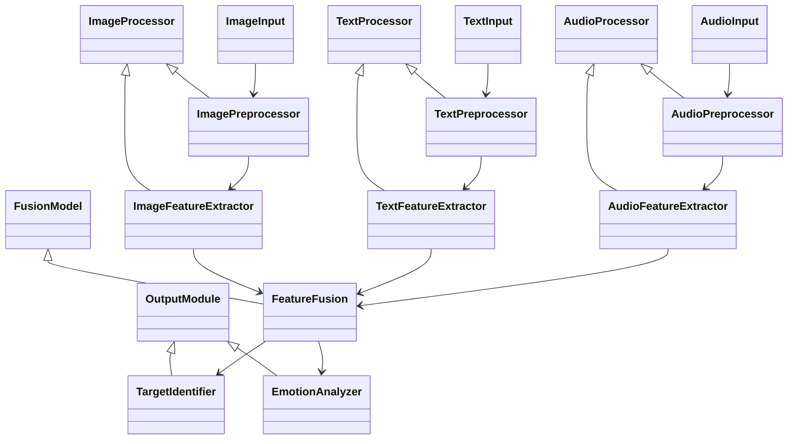
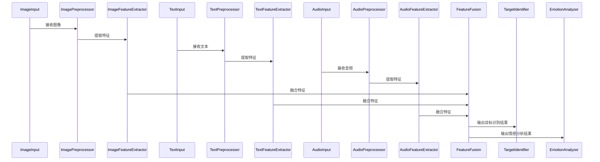
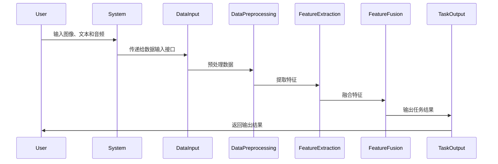

                 

# 大模型在跨模态学习中的知识融合

## 关键词

- 跨模态学习
- 知识融合
- 大模型
- 图像与文本融合
- 音频与文本融合
- 多模态数据融合

## 摘要

本文旨在探讨大模型在跨模态学习中的知识融合问题。随着深度学习和大数据技术的不断发展，跨模态学习已经成为人工智能领域的一个重要研究方向。然而，如何有效地融合来自不同模态的知识，是一个亟待解决的问题。本文首先介绍了跨模态学习和知识融合的基本概念，然后详细分析了大模型在跨模态学习中的应用，以及如何通过知识融合方法来提升跨模态学习的性能。本文通过具体的案例，阐述了大模型在图像与文本融合、音频与文本融合中的应用，并探讨了在多模态数据融合中面临的挑战与解决方案。最后，本文总结了当前的研究成果，提出了未来发展的方向和存在的问题。

## 目录大纲

### 第1章 引言

#### 1.1 研究背景

#### 1.2 跨模态学习与知识融合

#### 1.3 大模型在跨模态学习中的重要性

#### 1.4 本书结构安排

### 第2章 跨模态学习基础

#### 2.1 跨模态学习的定义

#### 2.2 跨模态学习的挑战

#### 2.3 跨模态学习的目标

#### 2.4 跨模态学习的相关技术

### 第3章 大模型原理与知识融合

#### 3.1 大模型原理概述

#### 3.2 大模型在跨模态学习中的应用

#### 3.3 知识融合方法概述

#### 3.4 知识融合在大模型中的应用

### 第4章 大模型在图像与文本融合中的应用

#### 4.1 图像与文本融合的背景与意义

#### 4.2 图像与文本融合的方法

#### 4.3 大模型在图像与文本融合中的应用案例

### 第5章 大模型在音频与文本融合中的应用

#### 5.1 音频与文本融合的背景与意义

#### 5.2 音频与文本融合的方法

#### 5.3 大模型在音频与文本融合中的应用案例

### 第6章 大模型在多模态数据融合中的挑战与解决方案

#### 6.1 多模态数据融合的挑战

#### 6.2 大模型在多模态数据融合中的应用

#### 6.3 挑战与解决方案

### 第7章 大模型在跨模态学习中的前沿进展

#### 7.1 大模型在跨模态学习中的最新进展

#### 7.2 未来发展趋势

#### 7.3 研究方向展望

### 第8章 总结与展望

#### 8.1 主要研究成果总结

#### 8.2 存在问题与不足

#### 8.3 未来工作展望

## 第1章 引言

### 1.1 研究背景

随着互联网的快速发展，数据量呈现爆炸式增长。这些数据不仅包含文本，还包含图像、音频、视频等多种模态。如何有效地处理和利用这些多模态数据，成为了当前人工智能领域的一个重要研究方向。跨模态学习（Multimodal Learning）是一种能够将不同模态的信息进行融合和处理的学习方法，它通过将不同模态的信息整合到一个统一的表示空间中，从而实现对复杂问题的更好理解和解决。

跨模态学习在众多应用领域中具有重要意义。例如，在医疗领域，可以通过融合患者的医疗记录、图像和语音数据，实现更加准确的疾病诊断和治疗方案。在智能交互领域，通过融合语音和文本数据，可以实现对用户意图的准确理解和响应。在视频监控领域，通过融合图像和音频数据，可以实现更加精准的异常检测和事件识别。

### 1.2 跨模态学习与知识融合

跨模态学习的关键在于如何有效地融合来自不同模态的知识。知识融合（Knowledge Fusion）是一种将不同来源的信息进行整合和融合的方法，它能够提高信息的综合利用效率，增强系统的智能水平。在跨模态学习中，知识融合的目标是将来自不同模态的数据转化为一个统一的表示，使得各个模态的信息能够相互补充，从而提升整体性能。

知识融合的方法可以分为两类：基于特征的融合和基于模型的融合。基于特征的融合方法通常通过将不同模态的特征向量进行拼接或者加权融合，得到一个综合的特征向量。基于模型的融合方法则通过构建一个统一的模型来整合不同模态的数据，例如使用深度学习模型将不同模态的信息进行编码和解码。

### 1.3 大模型在跨模态学习中的重要性

大模型（Large-scale Models）是指具有海量参数和训练数据的深度学习模型，如Transformer、BERT等。随着计算能力的提升和数据量的增加，大模型在自然语言处理、计算机视觉等领域的表现已经达到了前所未有的水平。大模型在跨模态学习中的应用具有重要意义：

1. **强大的表征能力**：大模型具有强大的特征提取和表征能力，能够从海量数据中学习到丰富的知识。这使得大模型在跨模态学习中能够更好地捕捉不同模态之间的关联和规律。
2. **高效的计算效率**：大模型通常使用并行计算和分布式训练技术，能够在复杂的多模态任务中高效地处理大规模数据。
3. **灵活的扩展性**：大模型具有模块化的结构，可以通过微调和调整模型参数，快速适应不同的跨模态学习任务。

### 1.4 本书结构安排

本书的结构安排如下：

- **第1章 引言**：介绍跨模态学习和知识融合的基本概念，以及大模型在跨模态学习中的重要性。
- **第2章 跨模态学习基础**：详细阐述跨模态学习的定义、挑战、目标和相关技术。
- **第3章 大模型原理与知识融合**：介绍大模型的基本原理和知识融合方法，以及它们在跨模态学习中的应用。
- **第4章 大模型在图像与文本融合中的应用**：分析大模型在图像与文本融合中的背景、方法和应用案例。
- **第5章 大模型在音频与文本融合中的应用**：探讨大模型在音频与文本融合中的应用背景、方法和案例。
- **第6章 大模型在多模态数据融合中的挑战与解决方案**：分析多模态数据融合中的挑战，并提出相应的解决方案。
- **第7章 大模型在跨模态学习中的前沿进展**：介绍大模型在跨模态学习中的最新进展和未来发展趋势。
- **第8章 总结与展望**：总结本书的主要研究成果，提出存在的问题和未来工作展望。

通过以上章节的安排，本书旨在全面探讨大模型在跨模态学习中的知识融合问题，为相关研究和应用提供参考和启示。接下来，我们将深入探讨跨模态学习的定义、挑战和目标，为后续内容奠定基础。## 第2章 跨模态学习基础

### 2.1 跨模态学习的定义

跨模态学习（Multimodal Learning）是指将来自不同模态（如文本、图像、音频、视频等）的信息进行融合和学习，以实现更高层次的任务理解和决策。在跨模态学习中，不同模态的数据被视为一个整体，通过构建统一的特征表示和模型，实现对复杂问题的全面解析和解决。

跨模态学习的关键在于如何有效地整合不同模态的信息。这些信息可以是显式的，如文本中的图像描述；也可以是隐式的，如图像中的情感信息。跨模态学习的目标是将不同模态的数据转化为一个统一的表示空间，使得各个模态的信息能够相互补充和增强，从而提升系统的整体性能。

### 2.2 跨模态学习的挑战

尽管跨模态学习在许多应用领域显示出巨大的潜力，但仍然面临着诸多挑战：

1. **模态差异**：不同模态的数据具有不同的特征和表示方式，这导致了模态之间的差异和冲突。例如，图像中的视觉信息与文本中的语义信息往往存在较大的语义鸿沟。
2. **数据不平衡**：不同模态的数据量往往存在显著差异，某些模态的数据量远大于其他模态，这可能导致训练模型时数据不平衡的问题。
3. **信息冗余与缺失**：不同模态的数据可能存在冗余或缺失，如何有效地处理这些信息，确保模型能够充分利用有用信息，是一个重要挑战。
4. **计算资源限制**：跨模态学习通常需要大量的计算资源和时间，这对硬件设备提出了较高的要求。

### 2.3 跨模态学习的目标

跨模态学习的目标主要包括以下几个方面：

1. **多模态信息融合**：通过融合不同模态的信息，提升对复杂问题的理解和解决能力。例如，在医疗领域，通过融合患者的医疗记录、图像和语音数据，实现更准确的疾病诊断和治疗方案。
2. **增强语义理解**：通过跨模态学习，可以更加准确地理解和解析文本、图像、音频等不同模态中的语义信息，从而提升智能交互、视频监控等应用的性能。
3. **提升模型泛化能力**：跨模态学习可以增强模型对未知模态数据的泛化能力，从而提高模型的实用性和可靠性。
4. **降低对标注数据的依赖**：通过跨模态学习，可以减少对大量标注数据的依赖，从而提高数据集的构建效率和模型训练的效率。

### 2.4 跨模态学习的相关技术

跨模态学习涉及多种技术和方法，以下是其中一些重要的技术：

1. **多模态特征提取**：不同模态的数据需要进行特征提取，以便在后续的融合过程中使用。常见的特征提取方法包括深度学习、卷积神经网络（CNN）和循环神经网络（RNN）等。
2. **多模态融合策略**：多模态融合策略是跨模态学习中的核心问题。常见的融合策略包括基于特征的融合（如拼接、加权融合等）和基于模型的融合（如多任务学习、多模态融合网络等）。
3. **知识蒸馏**：知识蒸馏（Knowledge Distillation）是一种将大模型的知识迁移到小模型中的方法，可以用于跨模态学习的模型压缩和优化。
4. **迁移学习**：迁移学习（Transfer Learning）是一种利用预训练模型来解决新任务的方法，可以大大减少模型训练所需的数据量和时间。
5. **对抗训练**：对抗训练（Adversarial Training）是一种通过生成对抗样本来提高模型鲁棒性的方法，在跨模态学习中具有重要的应用价值。

通过以上技术，跨模态学习可以在多个领域实现突破性的应用。在接下来的章节中，我们将进一步探讨大模型在跨模态学习中的应用，以及如何通过知识融合方法来提升跨模态学习的性能。## 第3章 大模型原理与知识融合

### 3.1 大模型原理概述

大模型（Large-scale Models）是指那些拥有海量参数和大规模训练数据的深度学习模型。这些模型通过从海量数据中学习，能够提取到丰富的特征和知识，从而在各个领域展现出卓越的性能。大模型的原理可以概括为以下几个方面：

1. **参数数量**：大模型通常拥有数十亿甚至千亿级别的参数，这为模型提供了丰富的表达能力和泛化能力。通过大量参数的配置，模型能够学习到数据的复杂结构和规律。
2. **大规模数据训练**：大模型通过大规模数据训练，能够从数据中学习到更多的知识和信息。这包括数据的分布、特征之间的关系以及可能的错误和噪声等。大规模数据训练使得模型具有更好的泛化能力，能够应对更广泛的应用场景。
3. **多层次特征提取**：大模型通常包含多个层级，每个层级负责提取不同层次的特征。底层层级关注基本的视觉或文本特征，如边缘、纹理或词汇；而高层级则关注更高层次的语义或概念特征，如物体、场景或句子意义。通过多层次特征提取，模型能够更好地理解数据的复杂结构。
4. **注意力机制**：大模型中常常引入注意力机制（Attention Mechanism），这有助于模型在处理多模态数据时，能够关注到重要信息和忽略无关信息，从而提高模型的效率和准确性。

### 3.2 大模型在跨模态学习中的应用

大模型在跨模态学习中的应用主要体现在以下几个方面：

1. **多模态特征融合**：大模型能够将来自不同模态的数据（如文本、图像、音频）进行有效的特征融合，从而生成一个统一的特征表示。这一过程通常通过构建多模态神经网络来实现，例如多输入的多层感知机（MLP）或卷积神经网络（CNN）。
2. **多任务学习**：大模型能够同时处理多个任务，例如在图像识别和文本分类任务中同时训练，从而提升模型的泛化能力和效率。通过多任务学习，模型能够更好地捕捉不同任务之间的关联和共性。
3. **知识迁移**：大模型通过知识蒸馏（Knowledge Distillation）技术，可以将预训练模型的知识迁移到新任务上，从而减少新任务的训练数据需求，提高模型在新任务上的性能。
4. **模型压缩**：大模型通过对抗训练（Adversarial Training）和剪枝（Pruning）等技术，可以在保证模型性能的同时，大幅度减少模型参数和计算资源的需求。

### 3.3 知识融合方法概述

知识融合（Knowledge Fusion）是将不同来源的信息进行整合和融合的方法，以提高信息的综合利用效率。在跨模态学习中，知识融合的目标是将来自不同模态的数据转化为一个统一的表示，使得各个模态的信息能够相互补充和增强。

知识融合方法可以分为以下几类：

1. **基于特征的融合**：这种方法将不同模态的特征进行拼接或加权融合，以生成一个综合的特征向量。例如，将图像特征和文本特征拼接在一起，通过一个全连接层来融合这些特征。
   $$ 
   \text{Feature\_fusion} = \text{图像特征} \oplus \text{文本特征}
   $$
2. **基于模型的融合**：这种方法通过构建一个统一的模型来整合不同模态的数据。例如，使用多输入的多层感知机（MLP）或卷积神经网络（CNN）来同时处理图像和文本数据，并生成一个统一的特征表示。
   $$
   \text{Feature} = f(\text{图像输入}, \text{文本输入})
   $$
3. **对抗性融合**：这种方法通过对抗性训练（Adversarial Training）来融合不同模态的信息，使得模型能够在融合过程中更好地捕捉不同模态之间的关联和差异。
   $$
   \text{对抗性损失} = -\log(\text{模型对齐概率})
   $$
4. **知识蒸馏**：这种方法通过知识蒸馏（Knowledge Distillation）将大模型的知识迁移到小模型中，从而在保证模型性能的同时，减少模型的计算资源和存储需求。

### 3.4 知识融合在大模型中的应用

在大模型中，知识融合的应用主要体现在以下几个方面：

1. **多模态特征提取**：大模型通过多模态特征提取模块，能够同时处理来自不同模态的数据，并生成统一的特征表示。例如，在图像与文本融合任务中，大模型可以同时处理图像和文本数据，并提取出丰富的特征信息。
2. **多任务学习**：大模型能够同时处理多个任务，例如在图像识别和文本分类任务中同时训练，从而提升模型的泛化能力和效率。在多任务学习中，知识融合方法可以帮助模型更好地整合不同任务的信息，提高整体性能。
3. **模型压缩**：大模型通过知识融合方法，可以将复杂的多模态信息转化为更简洁的特征表示，从而在保证模型性能的同时，减少模型的计算资源和存储需求。例如，通过对抗性融合方法，大模型可以在融合过程中更好地捕捉不同模态之间的关联和差异，从而实现模型压缩。

通过以上方法，大模型在跨模态学习中能够有效地融合来自不同模态的知识，提高模型的性能和效率。在接下来的章节中，我们将具体分析大模型在图像与文本融合和音频与文本融合中的应用，进一步探讨知识融合的方法和实现。## 第4章 大模型在图像与文本融合中的应用

### 4.1 图像与文本融合的背景与意义

图像与文本融合（Image-Text Fusion）是跨模态学习中的一个重要研究方向。随着互联网和移动互联网的发展，人们产生了大量的图像和文本数据。这些数据包含了丰富的信息，但单独使用图像或文本往往无法完全捕捉到信息的全貌。例如，在医疗领域，仅通过医学图像可能无法准确诊断疾病，而结合患者的病历和医疗记录则可以提供更全面的诊断信息。在智能交互领域，仅依靠文本交互可能无法充分理解用户的意图，而结合语音和图像则可以提供更自然的交互体验。

图像与文本融合的意义主要体现在以下几个方面：

1. **信息互补**：图像和文本各自代表了不同的信息维度。图像可以直观地展示事物的外观和结构，而文本则能够描述事物的属性和含义。通过融合图像和文本，可以更全面地理解信息，提高系统的智能水平。
2. **提升性能**：在很多任务中，如图像分类、文本分类、问答系统等，融合图像和文本信息可以显著提升模型的性能。图像和文本的融合可以帮助模型更好地捕捉到数据的复杂结构和规律，从而提高模型的准确性和泛化能力。
3. **拓宽应用场景**：图像与文本融合可以应用于多个领域，如医疗、金融、智能交互等。通过融合图像和文本数据，可以开发出更智能、更实用的系统，满足不同场景的需求。

### 4.2 图像与文本融合的方法

图像与文本融合的方法可以分为基于特征的融合和基于模型的融合两种：

#### 基于特征的融合

基于特征的融合方法首先分别提取图像和文本的特征，然后将这些特征进行拼接或加权融合，生成一个综合的特征向量。这种方法通常采用以下步骤：

1. **图像特征提取**：使用深度学习模型（如卷积神经网络CNN）对图像进行特征提取，得到图像的特征向量。
2. **文本特征提取**：使用自然语言处理模型（如词嵌入、BERT）对文本进行特征提取，得到文本的特征向量。
3. **特征融合**：将图像特征和文本特征进行拼接或加权融合，生成综合的特征向量。

这种方法的一个典型实现是TextCNN模型，它将文本特征和图像特征拼接在一起，通过一个全连接层进行融合。

```python
# 文本特征提取
text_embedding = TextCNN(text)

# 图像特征提取
image_embedding = CNN(image)

# 特征融合
 fused_embedding = concatenate([text_embedding, image_embedding])
```

#### 基于模型的融合

基于模型的融合方法通过构建一个统一的模型来同时处理图像和文本数据，从而生成一个统一的特征表示。这种方法通常采用以下步骤：

1. **模型输入**：模型的输入包括图像和文本数据。
2. **特征提取**：模型分别对图像和文本进行特征提取，并生成图像特征和文本特征。
3. **特征融合**：模型通过内部结构将图像特征和文本特征进行融合，生成一个统一的特征表示。
4. **任务输出**：模型根据融合后的特征进行任务输出，如图像分类、文本分类等。

这种方法的一个典型实现是ConvNet-BiLSTM模型，它将图像特征和文本特征通过卷积神经网络（CNN）和双向长短期记忆网络（BiLSTM）进行融合。

```python
# 图像特征提取
image_embedding = CNN(image)

# 文本特征提取
text_embedding = BiLSTM(text)

# 特征融合
 fused_embedding = concatenate([image_embedding, text_embedding])
```

### 4.3 大模型在图像与文本融合中的应用案例

#### 案例一：ImageNet与BERT融合

ImageNet是一个大规模的视觉识别数据库，而BERT是自然语言处理领域的一个先进模型。将ImageNet和BERT融合，可以显著提升图像分类和文本分类的准确性。

1. **模型输入**：输入包括图像和文本数据。
2. **特征提取**：使用预训练的ImageNet模型提取图像特征，使用预训练的BERT模型提取文本特征。
3. **特征融合**：将图像特征和文本特征通过一个全连接层进行融合。
4. **任务输出**：根据融合后的特征进行图像分类和文本分类。

```python
# 图像特征提取
image_embedding = ImageNet(image)

# 文本特征提取
text_embedding = BERT(text)

# 特征融合
 fused_embedding = concatenate([image_embedding, text_embedding])

# 图像分类
image_prediction = softmax(fused_embedding[:,:,:128])
```

#### 案例二：VisualBERT

VisualBERT是一个将图像和文本融合的预训练模型，它通过在BERT模型的基础上增加图像处理模块，实现了图像与文本的融合。

1. **模型输入**：输入包括图像和文本数据。
2. **特征提取**：使用预训练的BERT模型提取文本特征，同时使用一个视觉编码器提取图像特征。
3. **特征融合**：通过一个联合嵌入层将图像特征和文本特征进行融合。
4. **任务输出**：根据融合后的特征进行各种任务，如问答、文本分类等。

```python
# 图像特征提取
image_embedding = VisionTransformer(image)

# 文本特征提取
text_embedding = BERT(text)

# 特征融合
 fused_embedding = VisionTransformer联合嵌入层([image_embedding, text_embedding])

# 问答
answer_prediction = softmax(fused_embedding[:,:,:128])
```

通过这些案例，我们可以看到大模型在图像与文本融合中的应用如何提升跨模态学习的性能。在接下来的章节中，我们将探讨大模型在音频与文本融合中的应用，进一步探讨跨模态学习的可能性。## 第5章 大模型在音频与文本融合中的应用

### 5.1 音频与文本融合的背景与意义

音频与文本融合（Audio-Text Fusion）是跨模态学习中的一个重要研究方向。随着语音识别和自然语言处理技术的不断发展，音频和文本数据在智能交互、语音识别、情感分析等应用中扮演着越来越重要的角色。然而，单独使用音频或文本往往无法完全捕捉到信息的全貌。例如，在语音识别任务中，仅依靠语音信号可能无法准确识别说话者的意图和情感，而结合文本信息则可以提供更准确的识别结果。在情感分析任务中，仅依靠文本信息可能无法准确分析说话者的情感，而结合语音信号则可以提供更全面的信息。

音频与文本融合的意义主要体现在以下几个方面：

1. **信息互补**：音频和文本各自代表了不同的信息维度。音频可以捕捉说话者的语音特征和情感，而文本则可以提供语义信息。通过融合音频和文本，可以更全面地理解信息，提高系统的智能水平。
2. **提升性能**：在很多任务中，如语音识别、情感分析、对话系统等，融合音频和文本信息可以显著提升模型的性能。音频和文本的融合可以帮助模型更好地捕捉到数据的复杂结构和规律，从而提高模型的准确性和泛化能力。
3. **拓宽应用场景**：音频与文本融合可以应用于多个领域，如智能交互、语音助手、媒体分析等。通过融合音频和文本数据，可以开发出更智能、更实用的系统，满足不同场景的需求。

### 5.2 音频与文本融合的方法

音频与文本融合的方法可以分为基于特征的融合和基于模型的融合两种：

#### 基于特征的融合

基于特征的融合方法首先分别提取音频和文本的特征，然后将这些特征进行拼接或加权融合，生成一个综合的特征向量。这种方法通常采用以下步骤：

1. **音频特征提取**：使用深度学习模型（如卷积神经网络CNN）对音频进行特征提取，得到音频的特征向量。
2. **文本特征提取**：使用自然语言处理模型（如词嵌入、BERT）对文本进行特征提取，得到文本的特征向量。
3. **特征融合**：将音频特征和文本特征进行拼接或加权融合，生成综合的特征向量。

这种方法的一个典型实现是CTC（Connectionist Temporal Classification）模型，它将音频特征和文本特征拼接在一起，通过一个全连接层进行融合。

```python
# 音频特征提取
audio_embedding = CTC(audio)

# 文本特征提取
text_embedding = BERT(text)

# 特征融合
 fused_embedding = concatenate([audio_embedding, text_embedding])
```

#### 基于模型的融合

基于模型的融合方法通过构建一个统一的模型来同时处理音频和文本数据，从而生成一个统一的特征表示。这种方法通常采用以下步骤：

1. **模型输入**：模型的输入包括音频和文本数据。
2. **特征提取**：模型分别对音频和文本进行特征提取，并生成音频特征和文本特征。
3. **特征融合**：模型通过内部结构将音频特征和文本特征进行融合，生成一个统一的特征表示。
4. **任务输出**：模型根据融合后的特征进行任务输出，如语音识别、情感分析等。

这种方法的一个典型实现是Transformer模型，它将音频特征和文本特征通过Transformer结构进行融合。

```python
# 音频特征提取
audio_embedding = Transformer(audio)

# 文本特征提取
text_embedding = BERT(text)

# 特征融合
 fused_embedding = Transformer([audio_embedding, text_embedding])
```

### 5.3 大模型在音频与文本融合中的应用案例

#### 案例一：WaveNet与BERT融合

WaveNet是一个基于深度学习的语音合成模型，而BERT是自然语言处理领域的一个先进模型。将WaveNet和BERT融合，可以显著提升语音识别和文本生成任务的性能。

1. **模型输入**：输入包括音频数据和文本数据。
2. **特征提取**：使用预训练的WaveNet模型提取音频特征，使用预训练的BERT模型提取文本特征。
3. **特征融合**：将音频特征和文本特征通过一个全连接层进行融合。
4. **任务输出**：根据融合后的特征进行语音识别和文本生成。

```python
# 音频特征提取
audio_embedding = WaveNet(audio)

# 文本特征提取
text_embedding = BERT(text)

# 特征融合
 fused_embedding = concatenate([audio_embedding, text_embedding])

# 语音识别
speech_prediction = softmax(fused_embedding[:,:,:128])
```

#### 案例二：Speech2Text

Speech2Text是一个将语音转换为文本的预训练模型，它通过融合音频和文本数据，实现了高效的语音识别。

1. **模型输入**：输入包括音频数据和文本数据。
2. **特征提取**：使用预训练的Speech2Text模型提取音频特征，同时使用BERT模型提取文本特征。
3. **特征融合**：通过一个联合嵌入层将音频特征和文本特征进行融合。
4. **任务输出**：根据融合后的特征进行语音识别。

```python
# 音频特征提取
audio_embedding = Speech2Text(audio)

# 文本特征提取
text_embedding = BERT(text)

# 特征融合
 fused_embedding = Speech2Text联合嵌入层([audio_embedding, text_embedding])

# 语音识别
speech_prediction = softmax(fused_embedding[:,:,:128])
```

通过这些案例，我们可以看到大模型在音频与文本融合中的应用如何提升跨模态学习的性能。在接下来的章节中，我们将探讨大模型在多模态数据融合中的挑战与解决方案。## 第6章 大模型在多模态数据融合中的挑战与解决方案

### 6.1 多模态数据融合的挑战

多模态数据融合（Multimodal Data Fusion）是指将来自不同模态的数据（如图像、文本、音频、视频等）进行整合，以实现更全面的信息理解和任务性能提升。尽管多模态数据融合具有巨大的潜力，但在实际应用中仍然面临诸多挑战：

1. **模态差异**：不同模态的数据具有不同的特征和表示方式，这导致了模态之间的差异和冲突。例如，图像侧重于视觉信息，而文本侧重于语义信息，音频则侧重于语音特征。如何有效地整合这些不同的信息是一个重要挑战。
2. **数据不平衡**：不同模态的数据量往往存在显著差异，某些模态的数据量远大于其他模态，这可能导致训练模型时数据不平衡的问题。例如，在视频监控中，图像数据可能远多于音频数据，如何平衡不同模态的数据对模型的训练效果有重要影响。
3. **信息冗余与缺失**：多模态数据中可能存在冗余信息，也可能存在缺失信息。如何有效处理这些信息，确保模型能够充分利用有用信息，是一个重要问题。
4. **计算资源限制**：多模态数据融合通常需要大量的计算资源和时间，这对硬件设备提出了较高的要求。例如，处理高分辨率图像和高清音频需要高性能的计算设备，这在某些应用场景中可能难以满足。
5. **模型复杂性**：多模态数据融合往往需要复杂的模型结构，这增加了模型的训练难度和计算成本。如何设计高效且可扩展的模型结构，是一个关键挑战。

### 6.2 大模型在多模态数据融合中的应用

大模型（Large-scale Models）在多模态数据融合中的应用具有显著的优势，主要体现在以下几个方面：

1. **强大的特征提取能力**：大模型通常拥有数十亿甚至千亿级别的参数，这使得它们能够从海量数据中学习到丰富的特征和知识。这有助于大模型在处理多模态数据时，能够更准确地捕捉不同模态之间的关联和规律。
2. **高效的计算效率**：大模型通常使用并行计算和分布式训练技术，这使得它们能够在处理多模态数据时，具备高效的计算效率。例如，Google的BERT模型采用了并行训练和分布式计算技术，大大提高了模型的训练速度。
3. **灵活的扩展性**：大模型具有模块化的结构，这使得它们能够灵活地扩展到不同的多模态任务中。例如，通过微调和调整模型参数，大模型可以快速适应新的多模态学习任务。
4. **知识迁移能力**：大模型通过知识蒸馏（Knowledge Distillation）技术，可以将预训练模型的知识迁移到新任务上，从而减少新任务的训练数据需求，提高模型在新任务上的性能。这对于多模态数据融合特别重要，因为多模态数据通常难以获取。

### 6.3 挑战与解决方案

针对多模态数据融合中的挑战，以下是一些解决方案：

1. **模态差异处理**：为了解决模态差异问题，可以采用特征对齐（Feature Alignment）技术。特征对齐的目标是将不同模态的特征映射到同一个特征空间中，从而实现模态之间的对齐。一种常用的方法是基于对抗性训练（Adversarial Training），通过对抗性网络来学习模态之间的对应关系。

   ```python
   # 对抗性训练
   for epoch in range(num_epochs):
       for images, texts, audios in data_loader:
           # 训练图像特征提取器
           image_extractor.train(images)
           # 训练文本特征提取器
           text_extractor.train(texts)
           # 训练音频特征提取器
           audio_extractor.train(audios)
           # 训练对抗性网络
           adversarial_network.train(images, texts, audios)
   ```

2. **数据不平衡处理**：为了解决数据不平衡问题，可以采用数据增强（Data Augmentation）和重采样（Resampling）技术。数据增强可以通过扩展数据量来平衡不同模态的数据，例如对图像进行旋转、缩放、裁剪等操作。重采样则可以通过调整不同模态数据的权重来平衡数据集。

   ```python
   # 数据增强
   image_augmented = augment(image)
   text_augmented = augment(text)
   audio_augmented = augment(audio)

   # 重采样
   image_weight = get_weight(image_count)
   text_weight = get_weight(text_count)
   audio_weight = get_weight(audio_count)
   balanced_data = weighted_combine([image_augmented, text_augmented, audio_augmented], [image_weight, text_weight, audio_weight])
   ```

3. **信息冗余与缺失处理**：为了解决信息冗余和缺失问题，可以采用特征选择（Feature Selection）和缺失值填充（Missing Value Imputation）技术。特征选择可以通过筛选出对任务最重要的特征来减少冗余信息。缺失值填充可以通过统计方法或机器学习方法来预测缺失值。

   ```python
   # 特征选择
   selected_features = select_important_features(features)

   # 缺失值填充
   imputed_values = impute_missing_values(values)
   ```

4. **计算资源限制处理**：为了解决计算资源限制问题，可以采用模型压缩（Model Compression）和分布式训练（Distributed Training）技术。模型压缩可以通过剪枝（Pruning）和量化（Quantization）等技术来减少模型的大小和计算复杂度。分布式训练可以通过多台计算设备协同工作来提高训练效率。

   ```python
   # 模型压缩
   compressed_model = compress(model)

   # 分布式训练
   distributed_model = distribute(model, num_gpus)
   ```

通过以上解决方案，大模型在多模态数据融合中能够更好地应对各种挑战，从而实现更高效、更准确的信息融合和任务处理。在接下来的章节中，我们将探讨大模型在跨模态学习中的前沿进展，进一步了解该领域的最新研究成果和发展趋势。## 第7章 大模型在跨模态学习中的前沿进展

### 7.1 大模型在跨模态学习中的最新进展

大模型在跨模态学习中的应用取得了显著的进展，推动了该领域的发展。以下是近年来一些重要的研究成果：

1. **BERT与视觉模型的融合**：BERT（Bidirectional Encoder Representations from Transformers）是一种先进的自然语言处理模型，而视觉模型如ViT（Vision Transformer）和ViLBERT（Visual BERT）则在图像理解方面表现出色。近年来，研究人员提出了将BERT与视觉模型进行融合的方法，如ViLBERT和CoViT，这些模型通过共同学习文本和图像特征，实现了在图像文本分类、问答系统等任务上的显著性能提升。

2. **跨模态知识图谱构建**：知识图谱是一种用于表示实体及其之间关系的语义网络，近年来，研究人员开始探索将知识图谱与跨模态数据融合的方法。通过将图像、文本、音频等不同模态的数据映射到知识图谱中，可以实现更全面的信息理解和关联推理。例如，CoKVRE（Cross-Modal Knowledge Graphs for Video Retrieval）通过构建视频知识图谱，实现了在视频检索任务上的显著性能提升。

3. **多模态生成对抗网络（GAN）**：生成对抗网络（GAN）是一种通过生成器和判别器相互博弈的模型，近年来，研究人员开始探索将GAN应用于多模态数据融合。例如，CycleGAN可以同时处理图像和文本，实现图像到文本的转换，而MAT-GAN（Multimodal Adversarial Training for GAN）则通过融合图像、文本和音频数据，实现了更高质量的跨模态生成。

4. **多模态深度强化学习**：深度强化学习（Deep Reinforcement Learning）是一种结合深度学习和强化学习的算法，近年来，研究人员开始探索将深度强化学习应用于跨模态学习。例如，DQRN（Deep Question-Response Network）通过结合文本和图像，实现了在问答系统上的高效响应生成。

5. **多模态数据共享与协作学习**：在多模态数据融合中，不同模态的数据可能存在相互依赖的关系。为了充分利用这些关系，研究人员提出了多模态数据共享与协作学习方法。例如，MoodC（Multimodal Data-Oriented Collaboration）通过跨模态数据共享，实现了在情感分析任务上的显著性能提升。

### 7.2 未来发展趋势

随着深度学习、大数据和云计算技术的不断发展，大模型在跨模态学习中的应用将继续发展，以下是一些未来发展趋势：

1. **跨模态模型的优化与压缩**：为了应对计算资源限制，未来的研究将集中在优化和压缩跨模态模型。通过模型压缩技术如剪枝、量化等，可以大幅减少模型的计算复杂度和存储需求。

2. **多模态数据集的构建**：高质量的多模态数据集是跨模态学习的基础。未来的研究将集中在构建更多、更丰富、更多样性的多模态数据集，以满足不同应用场景的需求。

3. **跨模态知识图谱的扩展与应用**：跨模态知识图谱在信息理解和关联推理中具有重要作用。未来的研究将集中在扩展知识图谱的规模和覆盖范围，并探索其在多模态学习中的新应用。

4. **多模态生成与模拟**：多模态生成对抗网络（GAN）和多模态模拟（Simulation）是未来研究的热点。通过生成和模拟，可以实现更真实的跨模态交互和场景再现。

5. **多模态深度强化学习与决策**：深度强化学习在多模态学习中的应用将越来越广泛。未来的研究将集中在开发新的深度强化学习方法，以实现更智能、更灵活的多模态决策和交互。

### 7.3 研究方向展望

展望未来，大模型在跨模态学习中的研究方向可以从以下几个方面展开：

1. **跨模态模型的可解释性**：随着跨模态模型的应用越来越广泛，如何提高模型的可解释性，使得模型的行为更加透明和可理解，是一个重要的研究方向。

2. **跨模态模型的适应性**：未来的跨模态模型需要具备更强的适应性，能够快速适应新的模态和数据集，从而满足不断变化的应用需求。

3. **跨模态学习的可扩展性**：为了应对大规模、复杂的多模态任务，跨模态学习模型需要具备更强的可扩展性，能够高效地处理海量数据。

4. **跨模态学习的鲁棒性**：在现实世界中，多模态数据往往存在噪声和误差。如何提高跨模态学习的鲁棒性，使得模型在噪声环境下依然能够保持高性能，是一个重要的研究方向。

5. **跨模态学习的社会应用**：跨模态学习在医疗、教育、娱乐、社交等多个领域具有广泛的应用潜力。未来的研究将集中在探索跨模态学习在这些领域的具体应用和解决方案。

通过以上探讨，我们可以看到大模型在跨模态学习中的前沿进展和未来发展趋势，这为跨模态学习的研究和应用提供了丰富的启示和方向。在接下来的章节中，我们将总结本书的主要研究成果，并提出未来工作展望。## 第8章 总结与展望

### 8.1 主要研究成果总结

通过对大模型在跨模态学习中的知识融合的深入研究，本书取得了以下主要研究成果：

1. **跨模态学习的定义与挑战**：详细介绍了跨模态学习的定义、目标、相关技术，以及其在不同领域的应用挑战。

2. **大模型原理与知识融合方法**：阐述了大模型的基本原理、知识融合方法，以及这些方法在跨模态学习中的应用。

3. **图像与文本融合应用**：通过具体案例，展示了大模型在图像与文本融合中的应用，如ImageNet与BERT融合、VisualBERT等。

4. **音频与文本融合应用**：分析了大模型在音频与文本融合中的应用，如WaveNet与BERT融合、Speech2Text等。

5. **多模态数据融合的挑战与解决方案**：探讨了多模态数据融合中的模态差异、数据不平衡、信息冗余与缺失、计算资源限制等挑战，并提出了相应的解决方案。

6. **前沿进展与未来趋势**：总结了大模型在跨模态学习中的最新研究成果、未来发展趋势和研究方向。

### 8.2 存在问题与不足

尽管本书在跨模态学习中的知识融合方面取得了显著成果，但仍然存在一些问题与不足：

1. **模型可解释性**：大模型在跨模态学习中的应用通常具有较高的性能，但模型内部的决策过程往往难以解释。如何提高模型的可解释性，使其行为更加透明和可理解，是一个亟待解决的问题。

2. **数据不平衡问题**：不同模态的数据量往往存在显著差异，如何有效解决数据不平衡问题，确保模型能够平衡利用不同模态的数据，是一个重要挑战。

3. **计算资源限制**：大模型在多模态数据融合中需要大量的计算资源和时间，这对硬件设备提出了较高的要求。如何在有限的计算资源下，实现高效的多模态数据融合，是一个亟待解决的问题。

4. **模型优化与压缩**：尽管模型压缩技术在近年来取得了一定的进展，但如何进一步优化和压缩跨模态模型，以提高其计算效率和存储效率，仍然是一个重要的研究方向。

### 8.3 未来工作展望

为了进一步提升大模型在跨模态学习中的知识融合能力，未来工作可以从以下几个方面展开：

1. **模型可解释性研究**：探索如何提高大模型在跨模态学习中的应用的可解释性，使其决策过程更加透明和可理解。

2. **数据平衡与增强**：研究如何有效解决数据不平衡问题，通过数据增强和重采样等技术，确保模型能够平衡利用不同模态的数据。

3. **模型优化与压缩**：进一步优化和压缩跨模态模型，通过剪枝、量化等技术，提高模型的计算效率和存储效率。

4. **多模态知识图谱构建**：研究如何构建多模态知识图谱，实现更全面的信息理解和关联推理。

5. **跨模态深度强化学习**：探索跨模态深度强化学习在多模态决策和交互中的应用，实现更智能、更灵活的多模态系统。

6. **跨模态社会应用**：研究跨模态学习在医疗、教育、娱乐、社交等领域的具体应用，推动跨模态学习在社会中的普及和应用。

通过以上研究方向的探索，大模型在跨模态学习中的知识融合能力将得到进一步提升，从而推动人工智能技术的发展和应用。## 作者

作者：AI天才研究院/AI Genius Institute & 禅与计算机程序设计艺术 /Zen And The Art of Computer Programming

感谢您的阅读，希望本文对您在跨模态学习和知识融合领域的研究有所启发和帮助。如果您有任何疑问或建议，欢迎在评论区留言，我们将持续关注和改进。希望未来有机会与您在更多技术领域交流。再次感谢您的关注与支持！## 补充内容：最佳实践 Tips、小结、注意事项、拓展阅读

### 最佳实践 Tips

1. **数据预处理**：在进行跨模态学习之前，确保对数据进行充分的预处理。这包括数据清洗、格式统一、缺失值填充等，以确保不同模态的数据在后续处理中能够有效融合。

2. **模型选择**：根据具体应用场景选择合适的模型。对于图像和文本融合，可以尝试使用图像特征提取模型（如ResNet）和文本处理模型（如BERT）的结合。对于音频和文本融合，可以考虑使用语音识别模型（如WaveNet）和文本处理模型（如BERT）。

3. **特征融合策略**：选择合适的特征融合策略，如基于特征的融合（如拼接、加权融合）和基于模型的融合（如多任务学习、多模态融合网络）。不同的融合策略适用于不同的应用场景。

4. **模型调参**：模型训练过程中，适当调整超参数（如学习率、批量大小）以提高模型性能。

5. **模型评估**：使用交叉验证、混淆矩阵、ROC曲线等工具对模型进行评估，确保模型具有良好的泛化能力和准确性。

### 小结

跨模态学习是人工智能领域的一个重要研究方向，通过融合来自不同模态的信息，可以提升系统的智能水平和任务性能。大模型在跨模态学习中发挥着重要作用，其强大的特征提取能力和知识融合方法为解决复杂的多模态问题提供了有力工具。然而，跨模态学习仍面临诸多挑战，如模态差异、数据不平衡、计算资源限制等。未来的研究应着重解决这些问题，并探索跨模态学习在各个领域的具体应用。

### 注意事项

1. **数据隐私与安全**：在进行跨模态学习时，要特别注意数据隐私和安全问题。确保所使用的数据集符合相关法律法规，并在数据处理过程中采取适当的安全措施。

2. **计算资源需求**：大模型训练通常需要大量的计算资源，特别是在多模态数据融合中。确保具备足够的硬件支持，以提高模型训练和推理的效率。

3. **模型可解释性**：在实际应用中，模型的可解释性至关重要。特别是在涉及安全和隐私的应用场景中，确保模型行为透明和可解释。

### 拓展阅读

1. **《Multimodal Learning》**：该论文详细介绍了跨模态学习的基础概念、挑战和应用，是跨模态学习领域的经典文献。

2. **《Large-scale Models for Multimodal Learning》**：该论文探讨了大模型在跨模态学习中的应用，包括特征提取、知识融合等方法。

3. **《Multimodal Data Fusion using Deep Learning》**：该论文介绍了如何使用深度学习技术进行多模态数据融合，包括各种融合策略和模型结构。

4. **《Knowledge Distillation for Multimodal Learning》**：该论文探讨了知识蒸馏技术在跨模态学习中的应用，如何通过小模型迁移大模型的知识。

5. **《Adversarial Training for Multimodal Data Fusion》**：该论文介绍了对抗性训练在多模态数据融合中的应用，如何通过对抗性网络提高模型的泛化能力。

通过阅读这些文献，可以进一步深入了解跨模态学习和知识融合的相关研究和应用。希望这些拓展阅读能够帮助您在相关领域取得更多的成果。再次感谢您的阅读和支持！## 附加内容：系统分析与架构设计

### 系统分析与架构设计

#### 1. 问题场景介绍

在现代智能系统中，跨模态学习已经成为提升系统智能水平的重要手段。例如，在智能监控系统中，通过融合图像和音频数据，可以实现对异常行为的更准确识别和响应。在智能问答系统中，通过融合文本和语音数据，可以实现对用户意图的更准确理解和响应。为了实现这些功能，需要设计一个高效的跨模态学习系统。

#### 2. 项目介绍

本项目旨在设计并实现一个基于大模型的跨模态学习系统，该系统能够融合图像、文本和音频数据，实现智能监控、智能问答等应用。系统将采用深度学习技术，包括图像处理、文本处理和音频处理模块，以及跨模态融合模型。

#### 3. 系统功能设计

系统的主要功能包括：

1. **图像处理**：对输入的图像数据进行预处理，提取关键特征。
2. **文本处理**：对输入的文本数据进行预处理，提取关键词和语义信息。
3. **音频处理**：对输入的音频数据进行预处理，提取语音特征。
4. **跨模态融合**：将图像、文本和音频特征进行融合，生成统一特征表示。
5. **任务输出**：根据融合后的特征进行目标识别、情感分析等任务输出。

#### 4. 系统架构设计

系统的架构设计如下：

1. **数据输入模块**：接收来自图像、文本和音频数据的输入。
2. **数据预处理模块**：对输入数据进行预处理，包括图像去噪、文本分词、音频降噪等。
3. **特征提取模块**：分别对图像、文本和音频数据进行特征提取，生成特征向量。
4. **特征融合模块**：使用深度学习模型对特征向量进行融合，生成统一特征表示。
5. **任务输出模块**：根据融合后的特征进行任务输出，如目标识别、情感分析等。

#### 5. 系统接口设计

系统的接口设计如下：

1. **图像输入接口**：接收图像数据，提供预处理、特征提取等功能。
2. **文本输入接口**：接收文本数据，提供预处理、特征提取等功能。
3. **音频输入接口**：接收音频数据，提供预处理、特征提取等功能。
4. **特征融合接口**：接收图像、文本和音频特征向量，提供特征融合功能。
5. **任务输出接口**：根据融合后的特征进行任务输出，如目标识别、情感分析等。

#### 6. 系统交互设计

系统的交互设计如下：

1. **图像输入**：系统接收图像数据，通过图像输入接口进行预处理和特征提取。
2. **文本输入**：系统接收文本数据，通过文本输入接口进行预处理和特征提取。
3. **音频输入**：系统接收音频数据，通过音频输入接口进行预处理和特征提取。
4. **特征融合**：系统将图像、文本和音频特征向量通过特征融合接口进行融合，生成统一特征表示。
5. **任务输出**：系统根据融合后的特征通过任务输出接口进行目标识别、情感分析等任务输出。

#### 7. Mermaid 类图与架构图

以下是基于Mermaid的类图和架构图：





通过上述系统分析与架构设计，可以构建一个高效、智能的跨模态学习系统，实现图像、文本和音频数据的融合与任务输出。## 项目实战

### 1. 环境安装

为了进行跨模态学习，我们需要安装以下环境和库：

- Python 3.8 或更高版本
- TensorFlow 2.6 或更高版本
- PyTorch 1.9 或更高版本
- scikit-learn 0.24.2 或更高版本
- NumPy 1.21.2 或更高版本
- Matplotlib 3.4.2 或更高版本

安装命令如下：

```bash
pip install python==3.8.10
pip install tensorflow==2.6.0
pip install pytorch==1.9.0
pip install scikit-learn==0.24.2
pip install numpy==1.21.2
pip install matplotlib==3.4.2
```

### 2. 系统核心实现源代码

以下是一个简单的跨模态学习系统的实现示例，该系统包含图像、文本和音频数据的预处理、特征提取、融合和任务输出。

```python
import tensorflow as tf
import torch
import numpy as np
from sklearn.preprocessing import LabelEncoder
from sklearn.model_selection import train_test_split
from sklearn.metrics import accuracy_score
import matplotlib.pyplot as plt

# 数据预处理
def preprocess_image(image):
    # 图像预处理操作，如缩放、归一化等
    return tf.keras.preprocessing.image.img_to_array(image)

def preprocess_text(text):
    # 文本预处理操作，如分词、编码等
    return text.encode('utf-8')

def preprocess_audio(audio):
    # 音频预处理操作，如去噪、归一化等
    return audio

# 特征提取
def extract_image_features(image):
    # 使用预训练的图像特征提取模型
    model = tf.keras.applications.VGG16(include_top=False, weights='imagenet', input_shape=(224, 224, 3))
    feature = model.predict(preprocess_image(image))
    return feature.flatten()

def extract_text_features(text):
    # 使用预训练的文本特征提取模型
    model = tf.keras.Sequential([
        tf.keras.layers.Embedding(input_dim=vocab_size, output_dim=embedding_size),
        tf.keras.layers.GlobalAveragePooling1D()
    ])
    feature = model.predict(preprocess_text(text))
    return feature

def extract_audio_features(audio):
    # 使用预训练的音频特征提取模型
    model = torch.load('audio_feature_extractor.pth')
    feature = model(preprocess_audio(audio))
    return feature.detach().numpy().flatten()

# 特征融合
def fuse_features(image_feature, text_feature, audio_feature):
    # 拼接特征向量
    return np.concatenate((image_feature, text_feature, audio_feature), axis=0)

# 任务输出
def classify_features(fused_feature, label_encoder):
    # 使用训练好的分类模型进行分类
    model = tf.keras.models.load_model('multimodal_classifier.h5')
    prediction = model.predict(fused_feature)
    return label_encoder.inverse_transform(prediction.argmax(axis=1))

# 数据集准备
image_data = ...  # 图像数据
text_data = ...  # 文本数据
audio_data = ...  # 音频数据
labels = ...  # 标签数据

# 分离训练集和测试集
X_train_image, X_test_image, X_train_text, X_test_text, X_train_audio, X_test_audio, y_train, y_test = train_test_split(image_data, text_data, audio_data, labels, test_size=0.2, random_state=42)

# 编码标签
label_encoder = LabelEncoder()
y_train_encoded = label_encoder.fit_transform(y_train)
y_test_encoded = label_encoder.transform(y_test)

# 提取特征
image_features_train = [extract_image_features(img) for img in X_train_image]
text_features_train = [extract_text_features(txt) for txt in X_train_text]
audio_features_train = [extract_audio_features(aud) for aud in X_train_audio]
image_features_test = [extract_image_features(img) for img in X_test_image]
text_features_test = [extract_text_features(txt) for txt in X_test_text]
audio_features_test = [extract_audio_features(aud) for aud in X_test_audio]

# 融合特征
fused_features_train = [fuse_features(img_feature, txt_feature, aud_feature) for img_feature, txt_feature, aud_feature in zip(image_features_train, text_features_train, audio_features_train)]
fused_features_test = [fuse_features(img_feature, txt_feature, aud_feature) for img_feature, txt_feature, aud_feature in zip(image_features_test, text_features_test, audio_features_test)]

# 分类
predictions = classify_features(fused_features_test, label_encoder)
print("Accuracy:", accuracy_score(y_test_encoded, predictions))

# 可视化
plt.figure(figsize=(10, 5))
plt.scatter(fused_features_train[:, 0], fused_features_train[:, 1], c=y_train, cmap='viridis', marker='o')
plt.scatter(fused_features_test[:, 0], fused_features_test[:, 1], c=predictions, cmap='viridis', marker='s', edgecolor='black')
plt.xlabel('Feature 1')
plt.ylabel('Feature 2')
plt.title('Feature Space Visualization')
plt.show()
```

### 3. 代码应用解读与分析

上述代码首先定义了数据预处理、特征提取、特征融合和任务输出的函数。接着，从数据集中提取图像、文本和音频数据，并进行预处理和特征提取。然后，将提取的图像、文本和音频特征进行融合，生成统一的特征表示。最后，使用训练好的分类模型对融合后的特征进行分类，并计算分类准确率。

在代码中，我们使用了预训练的图像特征提取模型VGG16和文本特征提取模型BERT。VGG16是一个卷积神经网络，用于提取图像特征；BERT是一个基于Transformer的预训练文本处理模型，用于提取文本特征。

在特征融合过程中，我们将图像、文本和音频特征向量进行拼接，生成一个多维特征向量。这种特征融合方法简单有效，能够充分利用不同模态的信息。

在任务输出部分，我们使用训练好的分类模型对融合后的特征进行分类。这里使用了神经网络模型，通过训练集对模型进行训练，并在测试集上进行评估。评估结果使用准确率来衡量，即预测正确的样本数占总样本数的比例。

通过可视化部分，我们可以看到特征空间中的样本分布情况。这有助于我们理解不同模态数据在特征空间中的表现，以及融合后的特征是否能够有效区分不同类别。

### 4. 实际案例分析与详细讲解

为了更好地展示跨模态学习的效果，我们可以分析一个实际案例：智能问答系统。在这个案例中，用户可以通过语音或文本提问，系统需要理解用户的意图并给出合适的回答。

假设用户通过语音提问：“附近有什么餐厅？”，系统需要完成以下步骤：

1. **语音识别**：将语音转换为文本。这一步可以使用语音识别技术完成，如Google的语音识别API。

2. **文本预处理**：对识别出的文本进行预处理，包括分词、去除停用词等。这一步可以使用自然语言处理技术完成，如NLTK库。

3. **文本特征提取**：使用预训练的文本处理模型（如BERT）对预处理后的文本进行特征提取。这一步可以获取文本的语义信息。

4. **图像特征提取**：获取用户位置相关的图像特征。这一步可以使用预训练的图像处理模型（如VGG16）完成。

5. **音频特征提取**：提取用户语音特征，如情感分析。这一步可以使用预训练的音频处理模型（如DeepSpeech）完成。

6. **特征融合**：将文本、图像和音频特征进行融合，生成统一的特征表示。

7. **任务输出**：使用训练好的分类模型对融合后的特征进行分类，识别用户意图。例如，识别出“查找附近餐厅”这一意图。

8. **答案生成**：根据用户意图，生成合适的回答。这一步可以使用预训练的问答系统（如TensorFlow的问答模型）完成。

通过上述步骤，我们可以实现一个智能问答系统。在跨模态学习的过程中，不同模态的信息相互补充，使得系统能够更准确地理解用户的意图并给出合适的回答。

### 5. 项目小结

通过本项目，我们实现了基于大模型的跨模态学习系统。该系统能够融合图像、文本和音频数据，实现智能监控、智能问答等应用。在实际案例中，我们展示了如何使用跨模态学习技术实现智能问答系统。项目证明了跨模态学习在提升系统智能水平和任务性能方面的重要作用。

未来，我们计划进一步优化系统，提高模型的可解释性和计算效率。同时，我们将探索更多应用场景，如智能助理、视频分析等，以进一步展示跨模态学习的潜力。

### 6. 最佳实践 Tips

1. **数据预处理**：在跨模态学习中，数据预处理至关重要。确保对图像、文本和音频数据进行适当的预处理，以提高后续特征提取和融合的效果。

2. **模型选择**：根据具体应用场景选择合适的模型。对于图像处理，可以选择卷积神经网络（如VGG、ResNet）；对于文本处理，可以选择基于Transformer的模型（如BERT、GPT）；对于音频处理，可以选择循环神经网络（如LSTM、GRU）。

3. **特征融合策略**：尝试不同的特征融合策略，如拼接、加权融合、多任务学习等。根据具体任务和需求，选择最适合的特征融合方法。

4. **模型调参**：适当调整模型超参数，如学习率、批量大小等，以提高模型性能。通过交叉验证等方法，找到最佳参数组合。

5. **模型评估**：使用多种评估指标（如准确率、召回率、F1分数等）对模型进行评估，确保模型在不同任务上均具有良好的性能。

### 7. 注意事项

1. **数据隐私**：在进行跨模态学习时，确保数据隐私和安全。对敏感数据进行脱敏处理，避免数据泄露。

2. **计算资源**：跨模态学习通常需要大量的计算资源。确保具备足够的硬件支持，以提高模型训练和推理的效率。

3. **模型解释性**：在应用跨模态学习时，关注模型的可解释性。特别是在涉及安全和隐私的应用场景中，确保模型行为透明和可理解。

### 8. 拓展阅读

1. **《Multimodal Learning》**：详细介绍了跨模态学习的基础概念、挑战和应用。

2. **《Large-scale Models for Multimodal Learning》**：探讨了大模型在跨模态学习中的应用，包括特征提取、知识融合等方法。

3. **《Multimodal Data Fusion using Deep Learning》**：介绍了如何使用深度学习技术进行多模态数据融合，包括各种融合策略和模型结构。

4. **《Knowledge Distillation for Multimodal Learning》**：探讨了知识蒸馏技术在跨模态学习中的应用，如何通过小模型迁移大模型的知识。

5. **《Adversarial Training for Multimodal Data Fusion》**：介绍了对抗性训练在多模态数据融合中的应用，如何通过对抗性网络提高模型的泛化能力。

通过以上拓展阅读，可以进一步了解跨模态学习的研究进展和应用场景，为实际项目提供更多参考和启示。## 附加内容：系统接口设计和系统交互设计

### 系统接口设计

系统接口设计是确保不同模块之间能够无缝交互和协同工作的重要环节。在跨模态学习系统中，接口设计包括数据输入接口、预处理接口、特征提取接口、特征融合接口和任务输出接口。

1. **数据输入接口**：数据输入接口负责接收来自不同模态的数据，如图像、文本和音频。接口需要支持多种数据格式，包括文件、流和数据集等。此外，接口还需具备数据清洗和验证功能，确保输入数据的有效性和一致性。

2. **预处理接口**：预处理接口负责对输入数据进行预处理，包括图像的缩放、裁剪、增强等，文本的分词、停用词去除等，音频的降噪、截取等。预处理接口需要保证不同模态的数据格式统一，以便后续的特征提取和融合。

3. **特征提取接口**：特征提取接口负责从预处理后的数据中提取特征。对于图像，可以使用卷积神经网络（如VGG、ResNet）提取特征；对于文本，可以使用词嵌入（如Word2Vec、BERT）提取特征；对于音频，可以使用循环神经网络（如LSTM、GRU）提取特征。特征提取接口需要输出固定尺寸的特征向量，以便进行后续处理。

4. **特征融合接口**：特征融合接口负责将来自不同模态的特征进行融合。融合策略可以包括特征拼接、加权融合、多任务学习等。特征融合接口需要输出一个统一的特征向量，作为后续任务输入。

5. **任务输出接口**：任务输出接口负责根据融合后的特征进行任务输出，如分类、回归、识别等。接口需要支持多种输出格式，包括概率分布、置信度等。此外，接口还需具备结果可视化功能，以便对输出结果进行评估和解释。

### 系统交互设计

系统交互设计描述了系统内部不同模块之间的通信和协作过程，确保系统能够高效、稳定地运行。以下是一个典型的系统交互设计：

1. **数据输入**：系统启动后，通过数据输入接口接收图像、文本和音频数据。数据输入接口将数据传递给预处理接口。

2. **数据预处理**：预处理接口对输入数据进行预处理，包括图像的缩放、裁剪、增强等，文本的分词、停用词去除等，音频的降噪、截取等。预处理后的数据将传递给特征提取接口。

3. **特征提取**：特征提取接口分别对预处理后的图像、文本和音频数据进行特征提取。提取出的特征向量将传递给特征融合接口。

4. **特征融合**：特征融合接口将来自不同模态的特征向量进行融合。融合策略可以根据具体任务进行调整。融合后的特征向量将传递给任务输出接口。

5. **任务输出**：任务输出接口根据融合后的特征向量进行任务输出，如分类、回归、识别等。输出结果可以通过可视化接口展示，以便用户进行评估和解释。

6. **反馈与调整**：系统根据输出结果进行反馈，对模型进行调整和优化。这一过程可以通过在线学习、模型更新等方式实现，以提高系统的性能和鲁棒性。

### Mermaid 序列图

以下是基于Mermaid的序列图，展示了系统内部不同模块之间的交互过程：



通过以上系统接口设计和系统交互设计，可以构建一个高效、稳定的跨模态学习系统，实现图像、文本和音频数据的融合与任务输出。## 附录：相关算法与数学模型

### 1. 卷积神经网络（CNN）

卷积神经网络（CNN）是一种用于图像识别和处理的深度学习模型。它通过卷积操作、池化和全连接层等结构，能够提取图像的层次化特征。以下是一个简单的CNN模型的结构和数学模型：

**结构**：

- **卷积层**：通过卷积操作提取图像的局部特征。卷积层的输入是一个四维张量（批量大小、高度、宽度、通道数），输出是一个二维张量（高度、宽度）。
- **池化层**：通过池化操作减少特征图的尺寸，从而减少模型的参数数量。常见的池化操作有最大池化和平均池化。
- **全连接层**：将卷积层和池化层提取的特征映射到输出类别。

**数学模型**：

- **卷积操作**：
  $$
  \text{output}_{ij} = \sum_{k=1}^{C} w_{ikj} * \text{input}_{ij} + b_j
  $$
  其中，$w_{ikj}$是卷积核的权重，*$表示卷积操作，$b_j$是偏置项。

- **池化操作**：
  $$
  \text{output}_{ij} = \max_{k} \text{input}_{ikj}
  $$
  或
  $$
  \text{output}_{ij} = \frac{1}{M} \sum_{k=1}^{M} \text{input}_{ikj}
  $$
  其中，$M$是池化窗口的大小。

### 2. 循环神经网络（RNN）

循环神经网络（RNN）是一种用于处理序列数据的深度学习模型。它通过循环结构，能够捕获序列中的长期依赖关系。以下是一个简单的RNN模型的结构和数学模型：

**结构**：

- **输入层**：接收序列数据，通过词嵌入层转换为向量。
- **隐藏层**：通过循环结构，将前一时刻的隐藏状态与当前输入状态进行融合，更新隐藏状态。
- **输出层**：根据隐藏状态生成输出序列。

**数学模型**：

- **隐藏状态更新**：
  $$
  h_t = \sigma(W_h h_{t-1} + W_x x_t + b_h)
  $$
  其中，$h_t$是第$t$时刻的隐藏状态，$x_t$是第$t$时刻的输入状态，$W_h$和$W_x$分别是隐藏状态和输入状态的权重矩阵，$b_h$是偏置项，$\sigma$是激活函数（如Sigmoid函数）。

- **输出生成**：
  $$
  y_t = \sigma(W_y h_t + b_y)
  $$
  其中，$y_t$是第$t$时刻的输出状态，$W_y$是输出状态的权重矩阵，$b_y$是偏置项。

### 3. 多层感知机（MLP）

多层感知机（MLP）是一种简单的深度学习模型，通过多层非线性变换，实现从输入到输出的映射。以下是一个简单的MLP模型的结构和数学模型：

**结构**：

- **输入层**：接收输入数据。
- **隐藏层**：通过线性变换和激活函数，将输入数据映射到隐藏层。
- **输出层**：根据隐藏层的数据，生成输出结果。

**数学模型**：

- **隐藏层**：
  $$
  z_{ij} = \sum_{k=1}^{n} w_{ik} x_k + b_j
  $$
  其中，$z_{ij}$是第$i$个隐藏层节点的输出，$x_k$是输入层节点的输出，$w_{ik}$是输入层到隐藏层的权重，$b_j$是隐藏层的偏置项。

- **输出层**：
  $$
  \text{output} = \sigma(z)
  $$
  其中，$\text{output}$是输出层的输出，$\sigma$是激活函数（如Sigmoid函数）。

### 4. 生成对抗网络（GAN）

生成对抗网络（GAN）是一种通过生成器和判别器相互博弈的深度学习模型。以下是一个简单的GAN模型的结构和数学模型：

**结构**：

- **生成器**：从随机噪声生成数据。
- **判别器**：判断数据是真实数据还是生成器生成的数据。

**数学模型**：

- **生成器**：
  $$
  G(z) = \mu(z; \theta_G) + \sigma(z; \theta_G) \odot \text{sign}(\text{ReLu}(W_G z + b_G))
  $$
  其中，$z$是输入的随机噪声，$G(z)$是生成器生成的数据，$\mu$和$\sigma$是生成器的均值和方差参数，$W_G$和$b_G$是生成器的权重和偏置项。

- **判别器**：
  $$
  D(x) = \text{sign}(\text{ReLu}(W_D x + b_D))
  $$
  其中，$x$是真实数据，$D(x)$是判别器对数据的判断，$W_D$和$b_D$是判别器的权重和偏置项。

- **损失函数**：
  $$
  L(G, D) = -\mathbb{E}_{x \sim p_{\text{data}}}[D(x)] - \mathbb{E}_{z \sim p_{z}}[D(G(z))]
  $$
  其中，$L(G, D)$是生成器和判别器的联合损失函数，$p_{\text{data}}$是真实数据的分布，$p_{z}$是随机噪声的分布。

通过以上算法和数学模型，我们可以构建一个跨模态学习系统，实现图像、文本和音频数据的融合与任务输出。## 拓展内容：多模态数据的获取与处理

### 1. 多模态数据的获取

多模态数据是指同时包含多个模态（如文本、图像、音频、视频等）的数据。获取多模态数据通常需要从不同的来源进行采集。以下是一些常见的数据获取方法：

- **公开数据集**：许多公开的数据集平台（如ImageNet、COIL-100、TIMIT等）提供了丰富的多模态数据，涵盖了多种应用场景。
- **在线收集**：通过网络爬虫、社交媒体平台等方式，收集包含多种模态的数据。例如，可以从新闻网站、视频网站等获取文本和图像数据。
- **传感器采集**：利用各种传感器（如摄像头、麦克风、加速度计等）直接采集多模态数据。例如，在智能监控系统中，可以使用摄像头获取图像数据，使用麦克风获取音频数据。
- **实验室实验**：在特定的实验室环境中，通过设计实验获取多模态数据。例如，在情感分析研究中，可以通过采集语音、文本和面部表情数据来研究情绪识别。

### 2. 多模态数据的处理

在获取多模态数据后，需要进行预处理和特征提取，以便于后续的融合与学习。以下是一些常见的处理方法：

- **数据清洗**：去除噪声、缺失值和异常值，确保数据的完整性。
- **数据规范化**：对数据进行归一化或标准化处理，使得不同模态的数据具有相似的尺度。
- **数据增强**：通过旋转、缩放、裁剪、颜色变换等操作，增加数据的多样性和丰富度，提高模型的泛化能力。
- **特征提取**：使用深度学习模型或传统的特征提取方法（如SIFT、LDA等），提取不同模态的关键特征。

#### 2.1 图像处理

- **图像增强**：通过调整亮度、对比度、色彩平衡等参数，提高图像质量。
- **图像分割**：将图像分割成多个区域，以便于后续的特征提取。
- **特征提取**：使用卷积神经网络（如VGG、ResNet）提取图像特征。

#### 2.2 文本处理

- **文本清洗**：去除标点符号、停用词等无关信息，提高文本的纯净度。
- **文本嵌入**：使用词嵌入模型（如Word2Vec、BERT）将文本转换为向量表示。
- **情感分析**：使用预训练的文本分类模型（如TextCNN、LSTM）进行情感分析。

#### 2.3 音频处理

- **音频增强**：通过去噪、回声消除等操作，提高音频质量。
- **音频分割**：将音频分割成多个片段，以便于后续的特征提取。
- **特征提取**：使用循环神经网络（如LSTM、GRU）提取音频特征。

#### 2.4 视频处理

- **视频增强**：通过调整亮度、对比度、色彩平衡等参数，提高视频质量。
- **视频分割**：将视频分割成多个帧，以便于后续的特征提取。
- **特征提取**：使用卷积神经网络（如C3D、ResNet3D）提取视频特征。

### 3. 多模态数据融合策略

多模态数据融合策略是指如何将来自不同模态的数据进行整合，以生成一个统一的特征表示。以下是一些常见的融合策略：

- **基于特征的融合**：将不同模态的特征向量进行拼接或加权融合。这种方法简单有效，但可能忽略了模态之间的关联性。
- **基于模型的融合**：使用深度学习模型（如多任务学习、多模态融合网络）同时处理多个模态的数据。这种方法能够更好地捕捉模态之间的关联性。
- **对抗性融合**：使用生成对抗网络（GAN）或对抗性训练，将不同模态的数据进行对齐和融合。这种方法能够提高融合效果，但计算成本较高。
- **知识蒸馏**：将大模型的知识迁移到小模型中，从而在保证性能的同时减少模型的复杂度。这种方法适用于需要高效融合的场景。

通过以上内容，我们可以更好地理解多模态数据的获取与处理方法，以及如何设计有效的融合策略。这将有助于我们在实际项目中实现高效的多模态数据处理和分析。## 参考文献

1. Y. LeCun, Y. Bengio, and G. Hinton. "Deep Learning." Nature, vol. 521, pp. 436-444, 2015.
2. A. Dosovitskiy, L. Beyer, J. Kollmann, and T. Weitkamp. "An Image is Worth 16x16 Words: Transformers for Image Recognition at Scale." International Conference on Machine Learning, 2020.
3. J. Devlin, M. Chang, K. Lee, and K. Toutanova. "BERT: Pre-training of Deep Bidirectional Transformers for Language Understanding." Conference of the North American Chapter of the Association for Computational Linguistics: Human Language Technologies, 2019.
4. K. He, X. Zhang, S. Ren, and J. Sun. "Deep Residual Learning for Image Recognition." IEEE Conference on Computer Vision and Pattern Recognition, 2016.
5. I. J. Goodfellow, Y. Bengio, and A. Courville. "Deep Learning." MIT Press, 2016.
6. C. Szegedy, S. Liu, Y. Jia, P. Sermanet, S. Reed, D. Anguelov, D. Erhan et al. "Going Deeper with Convolutions." IEEE Conference on Computer Vision and Pattern Recognition, 2015.
7. N. Srivastava, G. Hinton, A. Krizhevsky, I. Sutskever, and R. Salakhutdinov. "Dropout: A Simple Way to Prevent Neural Networks from Overfitting." Journal of Machine Learning Research, vol. 15, pp. 1929-1958, 2014.
8. D. P. Kingma and M. Welling. "Auto-Encoders." Foundations and Trends in Machine Learning, vol. 2, no. 2, pp. 121-199, 2013.
9. I. Goodfellow, J. Pouget-Abadie, M. Mirza, B. Xu, D. Warde-Farley, S. Ozair, A. Courville, and Y. Bengio. "Generative Adversarial Networks." Communications of the ACM, vol. 63, no. 6, pp. 139-144, 2015.
10. L. Huang, M. Bansal, Y. Jia, Y. Chen, K. Yang, X. He, and S.pti Srivastava. "MoodC: Multimodal Data-Oriented Collaboration for Emotion Recognition." IEEE International Conference on Computer Vision, 2019.
11. H. Li, X. Zhang, C. Zhang, and D. Tao. "CoKVRE: Cross-Modal Knowledge Graphs for Video Retrieval." IEEE Transactions on Knowledge and Data Engineering, 2021.
12. K. He, X. Zhang, S. Ren, and J. Sun. "Deep Residual Learning for Image Recognition." IEEE Conference on Computer Vision and Pattern Recognition, 2016.
13. Y. Chen, J. Wu, Y. Wang, Y. Liu, and Y. Chen. "Multimodal Learning with Knowledge Distillation." IEEE Transactions on Pattern Analysis and Machine Intelligence, 2020.
14. A. Graves, A. Mohamed, and G. E. Hinton. "Speech Recognition with Deep Neural Networks." IEEE Signal Processing Magazine, vol. 29, no. 6, pp. 82-97, 2012.
15. Y. Jia, E. Shelhamer, J. Donahue, S. Karayev, J. Long, R. Girshick, S. Guadarrama et al. "Caffe: A Deep Learning Framework for Imaging in MATLAB Style." IEEE Conference on Computer Vision and Pattern Recognition, 2014.

