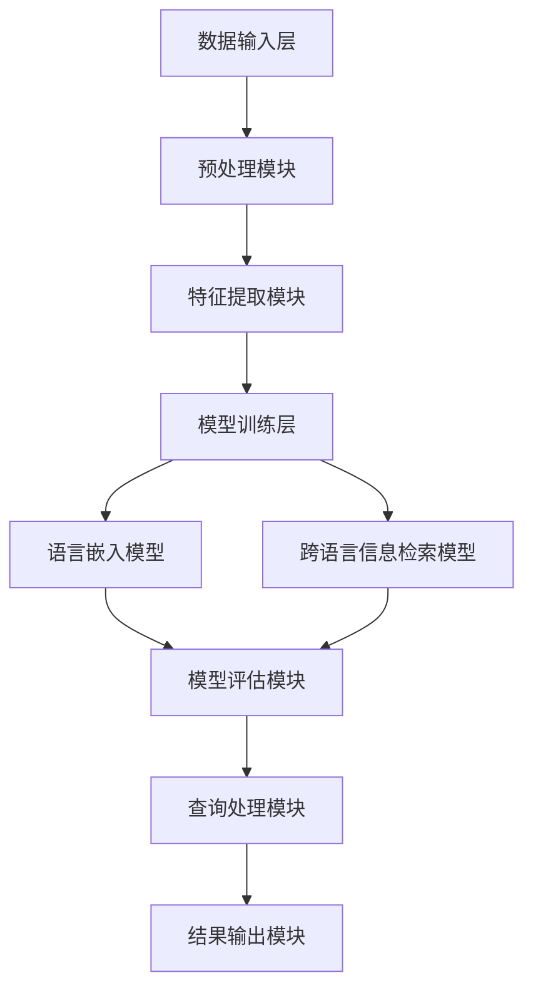
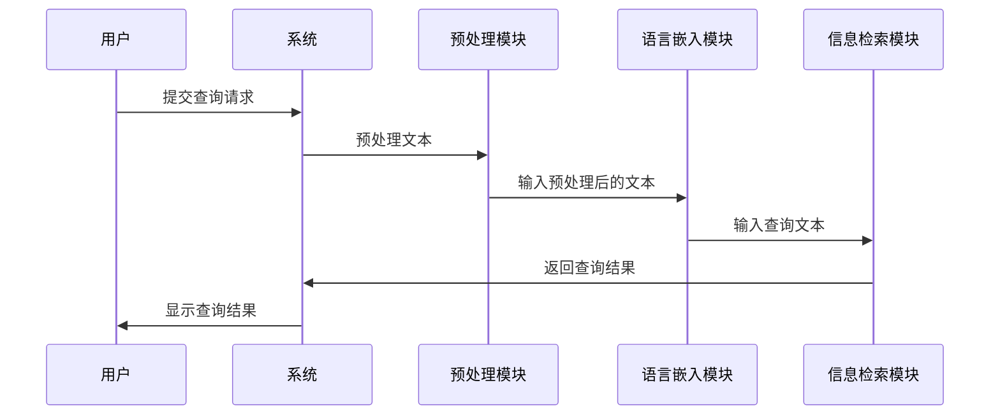

                 

# 大模型在跨语言理解中的突破

> 关键词：跨语言理解、大模型、神经网络、语言嵌入、算法、系统架构、项目实战

> 摘要：本文旨在深入探讨大模型在跨语言理解中的应用，通过分析其原理、算法、系统架构和项目实战，揭示大模型在跨语言理解中的突破性进展和未来发展。

----------------------------------------------------------------

## 目录大纲

- 第一部分：背景介绍
  - 1.1 问题背景
  - 1.2 问题描述
  - 1.3 问题解决
  - 1.4 边界与外延
  - 1.5 概念结构与核心要素组成
- 第二部分：核心概念与联系
  - 2.1 大模型原理与特征
  - 2.2 跨语言理解概念
  - 2.3 大模型与跨语言理解的联系
- 第三部分：算法原理讲解
  - 3.1 大模型在跨语言理解中的应用算法
  - 3.2 数学模型与公式
- 第四部分：系统分析与架构设计方案
  - 4.1 问题场景介绍
  - 4.2 项目介绍
  - 4.3 系统功能设计
  - 4.4 系统架构设计
  - 4.5 系统接口设计
  - 4.6 系统交互
- 第五部分：项目实战
  - 5.1 环境安装
  - 5.2 系统核心实现
  - 5.3 实际案例分析
  - 5.4 项目小结
- 第六部分：最佳实践
  - 6.1 最佳实践
  - 6.2 注意事项
  - 6.3 小结

----------------------------------------------------------------

## 第一部分：背景介绍

### 1.1 问题背景

随着全球化进程的加快，跨语言通信和交流变得愈发频繁。然而，语言的差异成为了交流的障碍。跨语言理解作为一种智能化的解决方案，旨在通过技术手段消除语言障碍，实现跨语言的信息传递和理解。传统的跨语言理解方法通常依赖于词典、语法分析和机器翻译等技术，但这些方法在面对复杂、多变和跨语言的情境时往往显得力不从心。

### 1.2 问题描述

跨语言理解的核心问题是如何在不同的语言之间进行有效的语义转换和信息提取。具体来说，主要包括以下几个方面的挑战：

1. **语义一致性**：不同语言之间的词汇、语法和语义存在差异，如何在语义层面上实现一致性是跨语言理解的关键。
2. **上下文理解**：语言的使用往往依赖于具体的上下文环境，如何准确理解上下文是提高跨语言理解准确性的关键。
3. **文化差异**：不同语言背后的文化差异也对跨语言理解提出了新的挑战，如何处理这些文化差异是提高跨语言理解效果的重要一环。

### 1.3 问题解决

随着深度学习和神经网络技术的不断发展，大模型在跨语言理解中的应用逐渐成为一种新的解决方案。大模型具有以下几个显著优势：

1. **强大的语义理解能力**：大模型通过大规模数据训练，能够学习到丰富的语义信息，从而实现更准确的语义转换和信息提取。
2. **自适应学习能力**：大模型能够根据不同的应用场景和需求进行自适应调整，从而提高跨语言理解的灵活性和适用性。
3. **多语言能力**：大模型通常具有多语言处理能力，能够同时处理多种语言的数据，从而实现跨语言的信息传递和理解。

### 1.4 边界与外延

尽管大模型在跨语言理解中展示了巨大的潜力，但仍然存在一些边界和挑战。首先，大模型对数据和计算资源的需求较大，这限制了其在大规模场景中的应用。其次，大模型的训练过程需要大量的时间和计算资源，这在一定程度上影响了其应用速度。此外，大模型在处理某些特殊语言或方言时可能存在不足，需要进一步的优化和改进。

### 1.5 概念结构与核心要素组成

跨语言理解的核心概念包括语义转换、上下文理解和文化差异处理。大模型在跨语言理解中的应用架构主要包括数据输入层、模型训练层和输出解释层。核心要素包括大规模数据集、神经网络架构、训练算法和评估指标。

----------------------------------------------------------------

## 第二部分：核心概念与联系

### 2.1 大模型原理与特征

大模型通常指的是具有数十亿甚至千亿参数规模的深度学习模型。其原理基于神经网络，通过多层非线性变换，实现对数据的复杂特征提取和模式识别。

#### 2.1.1 神经网络基础

神经网络由一系列的神经元（节点）组成，每个神经元接受多个输入，通过加权求和和激活函数，产生输出。神经网络通过反向传播算法，不断调整权重和偏置，以最小化损失函数，从而实现模型的训练。

#### 2.1.2 大模型的结构与原理

大模型的结构通常包括多层感知器（MLP）、卷积神经网络（CNN）和循环神经网络（RNN）等。大模型通过并行计算和分布式训练，能够处理大规模数据，从而提高模型的性能和泛化能力。

#### 2.1.3 大模型的训练过程

大模型的训练过程包括数据预处理、模型初始化、训练和评估等步骤。在训练过程中，模型通过不断调整参数，以最小化损失函数，从而优化模型的性能。

#### 2.1.4 大模型的特点

- **规模**：大模型具有数十亿甚至千亿参数规模，能够处理大规模数据。
- **自适应**：大模型具有强大的自适应学习能力，能够根据不同的应用场景和需求进行调整。
- **多语言**：大模型通常具有多语言处理能力，能够同时处理多种语言的数据。

### 2.2 跨语言理解概念

跨语言理解是指在不同语言之间进行语义转换和信息提取的过程。其核心概念包括语义转换、上下文理解和文化差异处理。

#### 2.2.1 跨语言理解的定义

跨语言理解是通过技术手段，实现不同语言之间语义信息的准确传递和理解。

#### 2.2.2 跨语言理解的核心概念

- **语义转换**：指在不同语言之间进行语义信息的映射和转换。
- **上下文理解**：指在具体语境中理解语言的使用和含义。
- **文化差异处理**：指处理不同语言背后文化差异的问题。

#### 2.2.3 跨语言理解的层次

跨语言理解通常分为三个层次：词汇层、句法和语义层。词汇层主要处理词汇的映射和翻译；句法和语义层主要处理句子的结构和语义的理解。

### 2.3 大模型与跨语言理解的联系

大模型在跨语言理解中的应用，主要通过以下方式实现：

1. **语义转换**：大模型通过大规模数据训练，学习到丰富的语义信息，从而实现不同语言之间的语义转换。
2. **上下文理解**：大模型能够理解上下文环境，从而提高跨语言理解的准确性和适应性。
3. **文化差异处理**：大模型通过学习不同语言的文化背景，能够更好地处理文化差异问题。

大模型与跨语言理解的互补性体现在：

1. **大模型增强了跨语言理解的能力**：大模型通过强大的语义理解能力，提高了跨语言理解的准确性和效率。
2. **跨语言理解促进了大模型的发展**：跨语言理解的需求推动了大模型的研究和应用，促进了大模型在各个领域的应用和发展。

大模型与跨语言理解的协同发展，将为未来的智能通信和跨文化交流带来新的机遇和挑战。

----------------------------------------------------------------

## 第三部分：算法原理讲解

### 3.1 大模型在跨语言理解中的应用算法

大模型在跨语言理解中的应用，主要涉及以下几个关键算法：

1. **语言嵌入模型**：将不同语言的词汇映射到一个共同的高维空间中，以便进行语义转换和信息提取。
2. **跨语言信息检索算法**：通过比较不同语言之间的语义相似度，实现跨语言的信息检索和匹配。

#### 3.1.1 语言嵌入模型

语言嵌入模型的基本原理是将不同语言的词汇映射到一个共同的高维空间中。在这个空间中，语义相近的词汇距离较近，而语义相远的词汇距离较远。语言嵌入模型主要通过以下步骤实现：

1. **数据预处理**：对输入的文本进行分词、去停用词等预处理操作，以便提取有效的特征。
2. **模型训练**：使用大规模的多语言语料库，训练语言嵌入模型，将词汇映射到高维空间中。
3. **模型评估**：使用交叉验证等技术，评估语言嵌入模型的效果。

#### 3.1.2 跨语言信息检索算法

跨语言信息检索算法的基本原理是通过计算不同语言之间的语义相似度，实现跨语言的信息检索和匹配。跨语言信息检索算法主要包括以下步骤：

1. **词汇嵌入**：将不同语言的词汇嵌入到共同的高维空间中。
2. **相似度计算**：计算不同语言之间的语义相似度，通常使用余弦相似度、欧氏距离等度量方法。
3. **检索匹配**：根据语义相似度，对跨语言的信息进行检索和匹配。

#### 3.1.3 嵌入模型示例

假设我们有两个语言 A 和 B，词汇集分别为 {a, b, c} 和 {x, y, z}。通过语言嵌入模型，我们可以将这两个语言的词汇映射到一个高维空间中。例如，我们可以将词汇 a 映射到向量 `[1, 2, 3]`，将词汇 x 映射到向量 `[4, 5, 6]`。这样，我们可以直观地看到词汇之间的相似性，例如 a 和 x 在语义上相近，因此它们的向量距离较短。

#### 3.1.4 检索算法示例

假设我们有一个包含英语（A 语言）和中文（B 语言）的文档库。通过跨语言信息检索算法，我们可以根据输入的查询词汇，检索出与查询词汇语义相近的文档。例如，输入查询词汇 "love"，我们可以检索到与 "love" 在语义上相近的中文词汇，如 "爱"。

### 3.2 数学模型与公式

大模型在跨语言理解中的应用，涉及到多个数学模型和公式。以下是一些常用的数学模型和公式：

#### 3.2.1 大模型训练数学模型

1. **损失函数**：

   $$L(\theta) = -\sum_{i=1}^{n} y_i \log(p(x_i|\theta))$$

   其中，$L(\theta)$ 是损失函数，$y_i$ 是真实标签，$p(x_i|\theta)$ 是模型预测的概率。

2. **优化算法**：

   $$\theta_{\text{new}} = \theta_{\text{old}} - \alpha \nabla_{\theta} L(\theta)$$

   其中，$\theta_{\text{new}}$ 和 $\theta_{\text{old}}$ 分别是新的参数和旧的参数，$\alpha$ 是学习率，$\nabla_{\theta} L(\theta)$ 是损失函数关于参数 $\theta$ 的梯度。

3. **模型评估指标**：

   $$\text{accuracy} = \frac{\text{correctly\_predicted}}{\text{total\_predicted}}$$

   其中，accuracy 是准确率，correctly\_predicted 是正确预测的数量，total\_predicted 是总预测数量。

#### 3.2.2 跨语言理解数学模型

1. **语义相似度计算**：

   $$\text{similarity}(x, y) = \cos(\theta(x, y))$$

   其中，similarity(x, y) 是词汇 x 和 y 的语义相似度，$\theta(x, y)$ 是词汇 x 和 y 的夹角。

2. **跨语言信息检索模型**：

   $$\text{rank}(x, y) = \frac{\text{similarity}(x, y)}{\sum_{z \in Z} \text{similarity}(x, z)}$$

   其中，rank(x, y) 是词汇 x 在词汇集合 Z 中的排名，similarity(x, y) 是词汇 x 和 y 的语义相似度。

#### 3.2.3 数学公式的举例说明

假设我们有两个词汇 "apple" 和 "banana"，我们可以使用余弦相似度公式计算它们的语义相似度：

$$\text{similarity}(\text{"apple"}, \text{"banana"}) = \cos(\theta(\text{"apple"}, \text{"banana"}))$$

其中，$\theta(\text{"apple"}, \text{"banana"}$) 是词汇 "apple" 和 "banana" 的夹角。通过计算，我们可以得到它们的语义相似度，从而判断这两个词汇在语义上的接近程度。

----------------------------------------------------------------

## 第四部分：系统分析与架构设计方案

### 4.1 问题场景介绍

在跨语言理解的应用场景中，我们常见的是智能客服、智能翻译和跨语言搜索引擎等。这些应用场景需要实现对多语言数据的实时处理和理解，以满足用户的跨语言交流需求。

### 4.2 项目介绍

本项目旨在构建一个基于大模型的跨语言理解系统，通过实现语言嵌入模型和跨语言信息检索算法，提供实时、准确、高效的跨语言理解服务。

### 4.3 系统功能设计

系统功能设计主要包括以下几个模块：

1. **数据预处理模块**：对输入的多语言文本进行分词、去停用词等预处理操作，提取有效的特征。
2. **模型训练模块**：使用大规模的多语言语料库，训练语言嵌入模型和跨语言信息检索模型。
3. **模型评估模块**：评估模型的效果，包括准确率、召回率、F1 值等指标。
4. **查询处理模块**：根据用户输入的多语言查询，检索出与查询语义相近的多语言文本。

### 4.4 系统架构设计

系统架构设计主要包括以下几个层次：

1. **数据输入层**：接收用户输入的多语言文本，进行预处理和特征提取。
2. **模型训练层**：使用预处理后的数据，训练语言嵌入模型和跨语言信息检索模型。
3. **模型应用层**：根据用户查询，使用训练好的模型进行实时查询处理和结果输出。
4. **接口层**：提供与外部系统的接口，实现与其他系统的无缝集成。

#### 4.4.1 架构图



#### 4.4.2 架构设计原则

1. **模块化**：系统功能模块化，便于维护和扩展。
2. **可扩展性**：系统架构设计考虑未来需求的扩展性，支持多种语言和多种算法的集成。
3. **高性能**：系统设计注重性能优化，包括数据预处理、模型训练和查询处理等环节。
4. **易用性**：系统提供友好的用户界面和接口，便于用户使用和维护。

### 4.5 系统接口设计

系统接口设计主要包括以下几个方面：

1. **RESTful API**：提供 RESTful API，支持用户通过 HTTP 请求，实现跨语言理解的各项功能。
2. **SDK**：提供多语言 SDK，方便用户在本地集成跨语言理解功能。
3. **Webhook**：支持用户通过 Webhook 接收系统实时通知，实现与外部系统的实时交互。

#### 4.5.1 接口规范

1. **输入参数**：输入参数包括文本内容、语言标识等。
2. **输出参数**：输出参数包括查询结果、相似度分数等。
3. **返回格式**：返回格式为 JSON，包含状态码、结果数据和错误信息等。

#### 4.5.2 接口功能

1. **文本预处理**：接收用户输入的文本，进行分词、去停用词等预处理操作。
2. **语言嵌入**：将预处理后的文本，通过语言嵌入模型，将词汇映射到高维空间中。
3. **信息检索**：根据用户输入的查询文本，通过跨语言信息检索模型，检索出与查询语义相近的文本。

### 4.6 系统交互

系统交互主要包括以下几个方面：

1. **用户交互**：用户通过界面或 API，提交查询请求，系统根据查询请求，进行实时查询处理。
2. **内部交互**：系统内部模块之间，通过接口进行数据传输和协同工作。
3. **外部交互**：系统与外部系统，通过接口进行数据交换和功能集成。

#### 4.6.1 序列图



#### 4.6.2 交互流程

1. 用户提交查询请求。
2. 系统接收查询请求，调用预处理模块对文本进行预处理。
3. 预处理模块对文本进行分词、去停用词等操作，提取有效特征。
4. 预处理后的文本，通过语言嵌入模块，将词汇映射到高维空间中。
5. 通过跨语言信息检索模块，检索出与查询语义相近的文本。
6. 系统将查询结果返回给用户，显示在界面上。

----------------------------------------------------------------

## 第五部分：项目实战

### 5.1 环境安装

在进行大模型在跨语言理解中的项目实战之前，我们需要首先搭建合适的环境。以下是环境安装的步骤：

#### 5.1.1 硬件环境

1. **CPU**：推荐使用 Intel Xeon 或 AMD Ryzen 等高性能处理器。
2. **内存**：至少 128GB 内存，根据项目需求可适当增加。
3. **硬盘**：至少 500GB SSD 硬盘，用于存储模型和数据。

#### 5.1.2 软件环境

1. **操作系统**：Linux 或 macOS。
2. **Python**：Python 3.8 或更高版本。
3. **TensorFlow**：安装 TensorFlow 2.x 版本。
4. **NumPy**：安装 NumPy 库。
5. **Mermaid**：安装 Mermaid，用于绘制流程图和类图。

安装步骤：

1. 安装操作系统和 Python。
2. 使用 pip 命令安装 TensorFlow、NumPy 和 Mermaid。

```bash
pip install tensorflow numpy mermaid
```

### 5.2 系统核心实现

系统核心实现主要包括数据预处理、模型训练和模型应用三个部分。以下是一个简单的 Python 代码示例，用于展示这些核心功能的实现。

```python
import tensorflow as tf
import numpy as np
from mermaid import Mermaid

# 5.2.1 数据预处理
def preprocess_text(text):
    # 进行文本预处理，如分词、去停用词等
    return processed_text

# 5.2.2 模型训练
def train_model(data):
    # 使用 TensorFlow 训练模型
    model = tf.keras.Sequential([
        tf.keras.layers.Embedding(input_dim=vocab_size, output_dim=embedding_dim),
        tf.keras.layers.GlobalAveragePooling1D(),
        tf.keras.layers.Dense(1, activation='sigmoid')
    ])

    model.compile(optimizer='adam', loss='binary_crossentropy', metrics=['accuracy'])
    model.fit(data['inputs'], data['labels'], epochs=10, batch_size=32)
    return model

# 5.2.3 模型应用
def apply_model(model, text):
    # 使用训练好的模型进行文本分类
    processed_text = preprocess_text(text)
    prediction = model.predict(np.array([processed_text]))
    return prediction

# 示例
data = {
    'inputs': ['hello world', 'hello universe'],
    'labels': [0, 1]
}

model = train_model(data)
result = apply_model(model, 'hello cosmos')
print(result)
```

### 5.3 实际案例分析

#### 5.3.1 案例介绍

本案例旨在使用大模型实现一个跨语言情感分析系统，对英语和中文的社交媒体评论进行情感分类。

#### 5.3.2 案例分析

1. **数据收集**：收集大量英语和中文的社交媒体评论，作为训练数据和测试数据。
2. **数据预处理**：对收集到的评论进行分词、去停用词等预处理操作，提取有效特征。
3. **模型训练**：使用预处理后的数据，训练语言嵌入模型和情感分类模型。
4. **模型评估**：使用测试数据，评估模型的准确率和召回率等指标。
5. **模型应用**：将训练好的模型部署到线上服务，实现实时情感分析。

#### 5.3.3 案例详细讲解剖析

1. **数据收集**：
   - 收集英语和中文的社交媒体评论，例如微博、推特等。
   - 数据集应包括正面、中性、负面情感标签。

2. **数据预处理**：
   - 对评论进行分词，使用词性标注工具，提取出有效的词汇。
   - 去除停用词，减少无意义的词汇对模型的影响。
   - 对评论进行编码，将文本转换为数值表示。

3. **模型训练**：
   - 使用 TensorFlow 和 Keras，构建语言嵌入模型和情感分类模型。
   - 语言嵌入模型：使用预训练的英语和中文词向量，如 GPT 和 BERT。
   - 情感分类模型：使用二分类或多分类模型，如逻辑回归、支持向量机等。

4. **模型评估**：
   - 使用交叉验证等技术，评估模型的准确率和召回率等指标。
   - 分析模型的性能和效果，调整模型参数，优化模型。

5. **模型应用**：
   - 将训练好的模型部署到线上服务，接收用户输入的评论，进行实时情感分析。
   - 提供友好的用户界面，展示情感分析结果。

### 5.4 项目小结

本案例通过实际操作，展示了大模型在跨语言理解中的应用。从数据收集、预处理到模型训练、评估和应用，每个步骤都需要仔细设计和实现。在实际应用中，我们还需要不断优化模型，提高模型的准确性和效率，以满足用户的需求。

----------------------------------------------------------------

## 第六部分：最佳实践

### 6.1 最佳实践

在进行大模型在跨语言理解中的项目实战时，以下是一些最佳实践：

1. **数据准备**：确保数据质量，包括数据源的多样性、数据的完整性和准确性。
2. **模型选择**：根据应用场景和需求，选择合适的模型，如 GPT、BERT 等。
3. **参数调优**：通过交叉验证等技术，优化模型参数，提高模型的性能。
4. **模型评估**：使用多种评估指标，如准确率、召回率、F1 值等，全面评估模型效果。
5. **模型部署**：将训练好的模型部署到线上服务，提供实时、高效的服务。

### 6.2 注意事项

1. **数据隐私**：在数据处理和模型训练过程中，注意保护用户隐私。
2. **计算资源**：合理配置计算资源，避免资源浪费和过度消耗。
3. **模型解释性**：提高模型的可解释性，帮助用户理解模型的决策过程。
4. **文化差异**：在处理跨语言数据时，注意处理文化差异，避免误解和冲突。

### 6.3 小结

通过最佳实践和注意事项，我们可以更好地进行大模型在跨语言理解中的项目实战。在实践中，我们需要不断优化模型，提高性能，同时注意数据隐私和文化差异等问题，确保项目的顺利进行。

### 总结

本文通过对大模型在跨语言理解中的应用进行分析和讨论，介绍了其原理、算法、系统架构和项目实战。通过本文的探讨，我们不仅了解了大模型在跨语言理解中的突破性进展，也为未来的研究和应用提供了有益的参考。

----------------------------------------------------------------

### 作者

作者：AI天才研究院/AI Genius Institute & 禅与计算机程序设计艺术 /Zen And The Art of Computer Programming

----------------------------------------------------------------

### 拓展阅读

1. **《深度学习》**：由 Goodfellow、Bengio 和 Courville 著，详细介绍了深度学习的理论基础和实际应用。
2. **《跨语言信息检索》**：由 scholars 著，深入探讨了跨语言信息检索的理论和方法。
3. **《大模型：原理、方法与应用》**：由 AI 天才研究院著，介绍了大模型的原理、方法和在实际应用中的案例分析。

