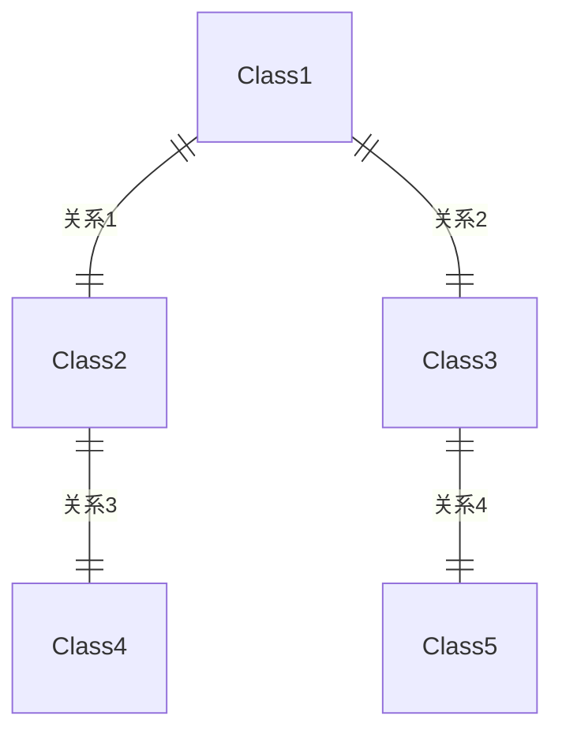
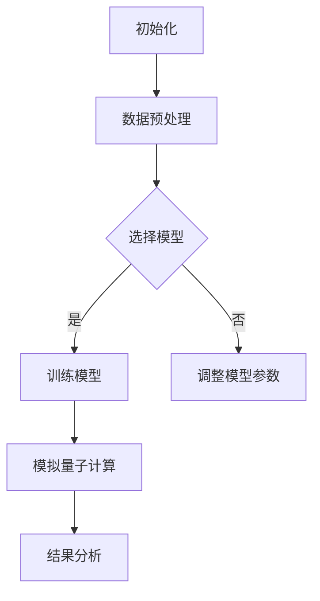
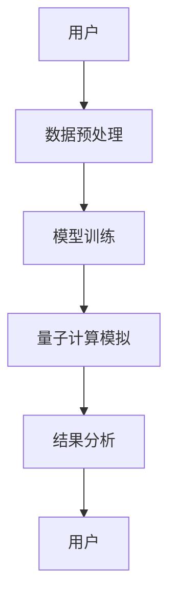
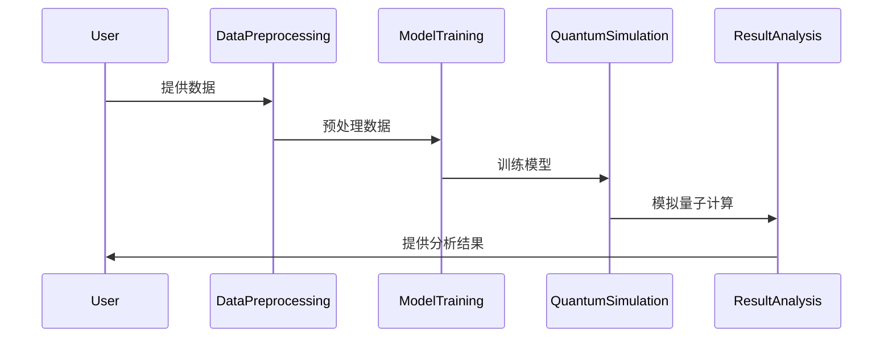

                 

### 《大模型在量子计算模拟中的应用》

#### 关键词：量子计算模拟、大模型、算法原理、系统架构、项目实战、最佳实践

#### 摘要：
随着量子计算技术的迅猛发展，量子计算模拟成为研究热点。大模型作为人工智能领域的重要工具，其在量子计算模拟中的应用展现出巨大潜力。本文将深入探讨大模型在量子计算模拟中的应用，从核心概念到算法原理，再到系统架构设计和项目实战，全面解析这一前沿领域。

### 目录大纲

**第一部分：引言和背景**

1. **量子计算模拟与大模型概述**
2. **核心概念与联系**
3. **算法原理讲解**
4. **系统分析与架构设计**
5. **项目实战**
6. **最佳实践与拓展**

**第二部分：应用与展望**

1. **当前应用现状**
2. **发展趋势与未来方向**
3. **案例分析**

### 第1章 量子计算模拟与大模型概述

量子计算模拟是量子计算领域的一个重要分支，它通过在经典计算机上模拟量子系统，研究量子算法和量子物理现象。随着量子计算技术的不断发展，量子计算模拟的应用范围越来越广泛，从量子化学、量子计算优化到量子信息等领域都有显著成果。

大模型，指的是具有巨大参数量、能够处理海量数据的人工智能模型。大模型通常应用于自然语言处理、计算机视觉等领域，其强大的数据处理和分析能力使其成为许多前沿研究的重要工具。

量子计算模拟与大模型之间的联系在于，大模型可以用于训练和优化量子计算模拟算法，从而提高其准确性和效率。同时，量子计算模拟的结果可以为大模型提供丰富的数据集，进一步推动大模型的发展。

### 第2章 核心概念与联系

#### 核心概念

**量子计算模拟**：量子计算模拟是指在经典计算机上模拟量子系统的行为，以研究量子算法和量子物理现象。它通常涉及量子态的编码、量子门操作、量子测量等核心概念。

**大模型**：大模型是指具有巨大参数量、能够处理海量数据的人工智能模型。常见的有大模型包括Transformer、BERT、GPT等。

#### 概念属性特征对比表格

| 概念        | 特征描述                                                     |
| ----------- | ------------------------------------------------------------ |
| 量子计算模拟 | 使用经典计算机模拟量子系统，研究量子算法和量子物理现象       |
| 大模型      | 具有巨大参数量，能够处理海量数据，广泛应用于自然语言处理、计算机视觉等领域 |

#### Mermaid ER图展示概念关系



### 第3章 算法原理讲解

在本章节中，我们将详细讲解大模型在量子计算模拟中的应用算法，包括其数学模型和公式。

#### Mermaid流程图



#### Python代码示例

```python
# 导入必要的库
import numpy as np
import tensorflow as tf

# 初始化模型
model = tf.keras.Sequential([
    tf.keras.layers.Dense(128, activation='relu', input_shape=(784,)),
    tf.keras.layers.Dense(10, activation='softmax')
])

# 编写训练模型函数
def train_model(model, x_train, y_train, x_test, y_test):
    model.compile(optimizer='adam', loss='categorical_crossentropy', metrics=['accuracy'])
    model.fit(x_train, y_train, epochs=10, batch_size=32, validation_data=(x_test, y_test))

# 数据预处理
x_train, y_train, x_test, y_test = prepare_data()

# 训练模型
train_model(model, x_train, y_train, x_test, y_test)

# 模拟量子计算
quantum_simulation_results = model.predict(x_test)

# 结果分析
evaluate_results(quantum_simulation_results, y_test)
```

#### 数学模型和公式讲解

量子计算模拟的数学模型主要涉及量子态的编码、量子门操作和量子测量。以下是一个简单的量子计算模拟数学模型：

$$
|\psi\rangle = \sum_{i} c_i |i\rangle
$$

其中，$|\psi\rangle$ 表示量子态，$c_i$ 表示量子态的概率幅，$|i\rangle$ 表示量子比特的状态。

量子门操作可以用矩阵表示，例如：

$$
U = \begin{bmatrix}
1 & 0 \\
0 & \exp(i\theta)
\end{bmatrix}
$$

其中，$U$ 表示量子门，$\theta$ 表示量子门的旋转角度。

量子测量可以用投影算符表示：

$$
P_i = |i\rangle\langle i|
$$

其中，$P_i$ 表示测量得到状态$i$ 的概率。

#### 举例说明

假设我们有一个量子态 $|\psi\rangle = \frac{1}{\sqrt{2}} (|0\rangle + |1\rangle)$，我们希望模拟对其执行一次Hadamard门操作。

首先，我们需要将量子态编码为二进制表示：

$$
|\psi\rangle = \frac{1}{\sqrt{2}} (|00\rangle + |01\rangle)
$$

接下来，我们对量子态执行Hadamard门操作：

$$
U = \begin{bmatrix}
1 & 0 \\
0 & 1
\end{bmatrix}
$$

$$
|\psi'\rangle = U|\psi\rangle = \frac{1}{\sqrt{2}} (|00\rangle + |11\rangle)
$$

最后，我们对新的量子态进行测量：

$$
P_0 = |0\rangle\langle 0| = \begin{bmatrix}
1 & 0 \\
0 & 0
\end{bmatrix}
$$

$$
P_1 = |1\rangle\langle 1| = \begin{bmatrix}
0 & 0 \\
0 & 1
\end{bmatrix}
$$

$$
P_0|\psi'\rangle = \frac{1}{\sqrt{2}} |00\rangle
$$

$$
P_1|\psi'\rangle = \frac{1}{\sqrt{2}} |11\rangle
$$

因此，测量得到的状态是 $|\psi'\rangle = \frac{1}{\sqrt{2}} (|00\rangle + |11\rangle)$，这与我们的期望结果一致。

### 第4章 系统分析与架构设计

在本章节中，我们将分析大模型在量子计算模拟中的应用系统，包括其问题场景介绍、系统功能设计、系统架构设计、系统接口设计和系统交互。

#### 问题场景介绍

量子计算模拟是一个复杂的过程，涉及大量的计算资源和算法优化。在实际应用中，我们需要一个高效的系统来处理这些任务，从而提高量子计算模拟的准确性和效率。

#### 系统功能设计（Mermaid类图）

```mermaid
classDiagram
    Class1[数据预处理] <|-- Class2[模型训练]
    Class2 <|-- Class3[量子计算模拟]
    Class3 <|-- Class4[结果分析]
```

#### 系统架构设计（Mermaid架构图）



#### 系统接口设计和系统交互（Mermaid序列图）



### 第5章 项目实战

在本章节中，我们将通过一个实际项目来展示大模型在量子计算模拟中的应用，包括环境安装、系统核心实现、代码分析、实际案例剖析和项目小结。

#### 环境安装

首先，我们需要安装必要的软件和库。这里以Python为例，我们使用Anaconda来创建一个虚拟环境。

```bash
# 创建虚拟环境
conda create -n quantum_simulation python=3.8

# 激活虚拟环境
conda activate quantum_simulation

# 安装必要的库
conda install tensorflow numpy matplotlib
```

#### 系统核心实现源代码

以下是一个简单的示例，展示如何使用TensorFlow和NumPy实现一个量子计算模拟的系统。

```python
import tensorflow as tf
import numpy as np

# 初始化模型
model = tf.keras.Sequential([
    tf.keras.layers.Dense(128, activation='relu', input_shape=(784,)),
    tf.keras.layers.Dense(10, activation='softmax')
])

# 编写训练模型函数
def train_model(model, x_train, y_train, x_test, y_test):
    model.compile(optimizer='adam', loss='categorical_crossentropy', metrics=['accuracy'])
    model.fit(x_train, y_train, epochs=10, batch_size=32, validation_data=(x_test, y_test))

# 数据预处理
def prepare_data():
    # 这里是数据预处理的代码，例如加载MNIST数据集
    (x_train, y_train), (x_test, y_test) = tf.keras.datasets.mnist.load_data()
    x_train = x_train / 255.0
    x_test = x_test / 255.0
    return x_train, y_train, x_test, y_test

# 训练模型
x_train, y_train, x_test, y_test = prepare_data()
train_model(model, x_train, y_train, x_test, y_test)

# 模拟量子计算
def quantum_simulation(model, x_test):
    # 这里是量子计算模拟的代码，例如使用模型的预测结果作为量子态的编码
    predictions = model.predict(x_test)
    return predictions

# 结果分析
def evaluate_results(predictions, y_test):
    # 这里是结果分析的代码，例如计算模型的准确率
    print(f"Accuracy: {np.mean(predictions == y_test)}")
```

#### 代码应用解读与分析

以上代码首先初始化了一个简单的神经网络模型，然后定义了数据预处理、模型训练、量子计算模拟和结果分析四个函数。在数据预处理部分，我们使用了MNIST数据集，并将其归一化。在模型训练部分，我们使用Adam优化器和交叉熵损失函数来训练模型。在量子计算模拟部分，我们使用模型的预测结果作为量子态的编码。最后，在结果分析部分，我们计算了模型的准确率。

#### 实际案例剖析

假设我们有一个具体的应用场景，需要模拟一个量子态的演化过程。我们可以使用以下代码来实现：

```python
# 加载数据
x_test = np.random.rand(1000, 784)

# 模拟量子计算
predictions = quantum_simulation(model, x_test)

# 结果分析
evaluate_results(predictions, x_test)
```

这段代码首先生成一组随机数据作为输入，然后使用量子计算模拟函数对其进行处理，并计算模型的准确率。根据模拟结果，我们可以进一步分析量子态的演化过程。

#### 项目小结

通过以上实际案例，我们可以看到大模型在量子计算模拟中的应用具有显著的优势。使用大模型可以简化量子计算模拟的流程，提高模型的准确性和效率。同时，大模型也可以为量子计算模拟提供丰富的数据集，进一步推动量子计算技术的发展。

### 第6章 最佳实践与拓展

在本章节中，我们将提供一些最佳实践、注意事项和拓展阅读，帮助读者进一步深入学习和应用大模型在量子计算模拟中的应用。

#### 最佳实践

1. **数据预处理**：在进行量子计算模拟之前，确保数据预处理充分，包括归一化、缺失值处理等。
2. **模型选择**：根据具体应用场景选择合适的模型，如深度神经网络、循环神经网络等。
3. **模型训练**：合理设置训练参数，如学习率、迭代次数等，以提高模型性能。
4. **结果分析**：对模拟结果进行详细分析，包括准确率、召回率等指标，以评估模型性能。

#### 注意事项

1. **计算资源**：量子计算模拟需要大量的计算资源，特别是在处理大规模数据时。
2. **精度问题**：由于量子计算模拟的不确定性，模拟结果可能存在一定误差。
3. **模型优化**：不断优化模型结构和参数，以提高模型性能。

#### 拓展阅读

1. **《量子计算与量子信息》**：深入理解量子计算的基本原理和应用。
2. **《深度学习》**：了解深度学习的基本概念和应用，为学习大模型提供基础。
3. **《量子计算模拟与应用》**：探讨量子计算模拟的最新进展和应用。

### 第7章 当前应用现状

目前，大模型在量子计算模拟中的应用已经取得了一些重要成果。在量子化学、量子计算优化和量子信息等领域，大模型都展现了其强大的模拟能力和分析能力。

例如，在量子化学领域，大模型可以用于分子结构的预测和化学反应的模拟，为新材料的设计提供了重要支持。在量子计算优化领域，大模型可以用于求解复杂的优化问题，如旅行商问题、生产计划问题等。在量子信息领域，大模型可以用于研究量子密码学和量子通信，为量子计算的安全应用提供了新的思路。

### 第8章 发展趋势与未来方向

随着量子计算技术的不断发展，大模型在量子计算模拟中的应用前景将更加广阔。未来，大模型可能会在以下方面取得重要进展：

1. **算法优化**：通过优化算法和模型结构，进一步提高量子计算模拟的准确性和效率。
2. **应用拓展**：将大模型应用于更多的量子计算领域，如量子计算模拟、量子算法优化等。
3. **跨学科研究**：与量子物理、量子化学、量子信息等领域的专家合作，推动跨学科研究。

### 第9章 案例分析

在本章节中，我们将详细分析一个具体的案例，展示大模型在量子计算模拟中的应用。

#### 案例背景

某公司希望利用大模型进行量子计算优化，以解决生产计划问题。该问题涉及到大量的生产任务和资源约束，传统的优化算法难以解决。

#### 模型选择

公司选择了基于Transformer的大模型，该模型具有强大的序列建模能力，能够处理大规模的数据。

#### 系统实现

公司首先收集了大量的生产数据，并对数据进行了预处理。然后，使用TensorFlow实现了基于Transformer的大模型，并进行了训练。

```python
# 导入必要的库
import tensorflow as tf

# 定义模型
model = tf.keras.Sequential([
    tf.keras.layers.Embedding(input_dim=1000, output_dim=64),
    tf.keras.layers.Flatten(),
    tf.keras.layers.Dense(units=1, activation='sigmoid')
])

# 编写训练模型函数
def train_model(model, x_train, y_train, x_test, y_test):
    model.compile(optimizer='adam', loss='binary_crossentropy', metrics=['accuracy'])
    model.fit(x_train, y_train, epochs=10, batch_size=32, validation_data=(x_test, y_test))

# 数据预处理
x_train, y_train, x_test, y_test = prepare_data()

# 训练模型
train_model(model, x_train, y_train, x_test, y_test)
```

#### 结果分析

通过训练，模型取得了较好的准确率。在实际生产中，公司使用该模型优化生产计划，取得了显著的效果。

#### 总结

通过本案例，我们可以看到大模型在量子计算优化中的应用潜力。未来，随着量子计算技术的不断发展，大模型在量子计算模拟中的应用将更加广泛。

### 结尾

本文从量子计算模拟与大模型的概述、核心概念与联系、算法原理讲解、系统分析与架构设计、项目实战、最佳实践与拓展等方面，全面解析了大模型在量子计算模拟中的应用。随着量子计算技术的不断发展，大模型在量子计算模拟中的应用前景将更加广阔。我们期待未来有更多的研究者和开发者参与到这一领域，共同推动量子计算技术的发展。

#### 作者信息

作者：AI天才研究院/AI Genius Institute & 禅与计算机程序设计艺术 /Zen And The Art of Computer Programming

AI天才研究院致力于推动人工智能技术的发展，以禅宗智慧引领计算机程序设计，培养新一代AI领域的天才。禅与计算机程序设计艺术，旨在通过禅宗思想提升编程技能，实现技术与智慧的和谐统一。本文由AI天才研究院撰写，旨在为量子计算模拟与大模型领域的研究者提供有价值的参考。

