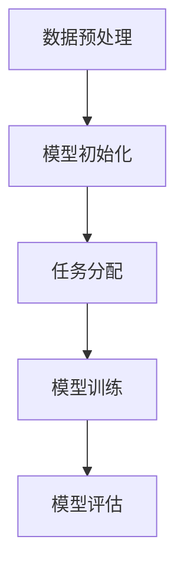
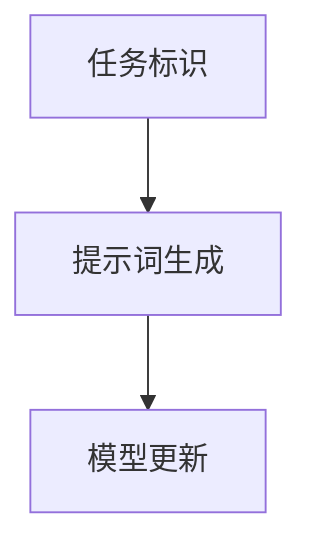
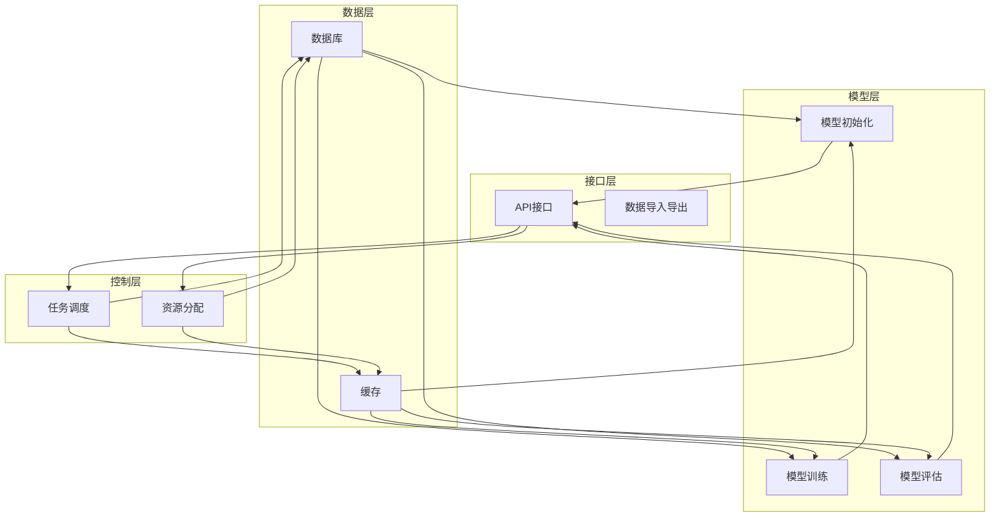
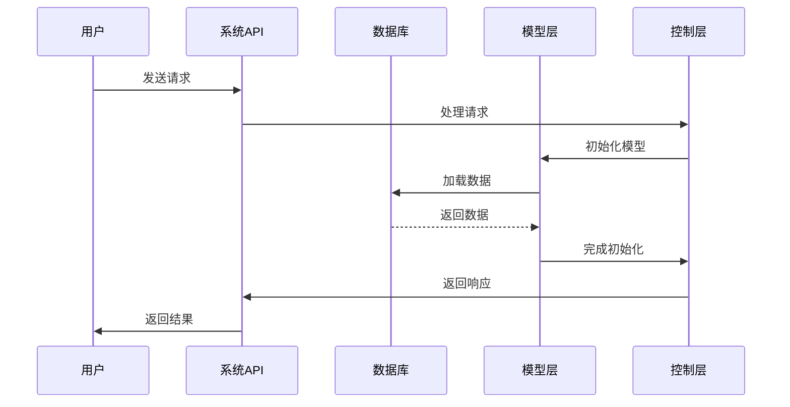

                 

# 大模型多任务学习：提示词的任务切换策略

关键词：大模型，多任务学习，提示词，任务切换策略，人工智能

摘要：本文将深入探讨大模型多任务学习的概念、原理及其应用，重点阐述提示词在任务切换策略中的作用，以及如何通过提示词优化多任务学习的效果。文章将以清晰的逻辑和详细的步骤，帮助读者理解这一复杂但极具前景的技术。

## 《大模型多任务学习：提示词的任务切换策略》目录大纲

### 第一部分：背景介绍与核心概念

#### 第1章：问题背景与核心概念

1.1 问题背景

- 人工智能领域发展趋势
- 大模型多任务学习的重要性

1.2 核心概念

1.2.1 大模型

- 定义
- 特点

1.2.2 多任务学习

- 定义
- 与单任务学习的对比

1.2.3 提示词的任务切换策略

- 定义
- 作用与意义

### 第二部分：算法原理与模型讲解

#### 第2章：算法原理讲解

2.1 大模型多任务学习算法原理

2.1.1 算法原理概述

2.1.2 算法数学模型

- 数学公式与说明

2.1.3 算法流程图

- 使用 mermaid 画出算法流程图

2.2 提示词的任务切换策略

2.2.1 切换策略原理

2.2.2 切换策略模型

- 数学公式与说明

2.2.3 切换策略流程图

- 使用 mermaid 画出切换策略流程图

### 第三部分：系统分析与架构设计

#### 第3章：系统架构设计

3.1 问题场景介绍

- 多任务学习场景

3.2 系统功能设计

3.2.1 领域模型

- 使用 mermaid 画出领域模型类图

3.2.2 系统功能模块划分

3.3 系统架构设计

3.3.1 系统架构概述

3.3.2 系统架构图

- 使用 mermaid 画出系统架构图

3.3.3 系统接口设计

3.3.4 系统交互序列图

- 使用 mermaid 画出系统交互序列图

### 第四部分：项目实战与案例分析

#### 第4章：环境安装与系统核心实现

4.1 环境安装

4.1.1 软件与硬件环境要求

4.1.2 安装步骤详解

4.2 系统核心实现

4.2.1 代码解读与分析

4.2.2 实现细节讲解

#### 第5章：实际案例分析与讲解

5.1 案例选择与介绍

5.2 案例分析与讲解

5.3 案例总结与反思

### 第五部分：最佳实践与拓展

#### 第6章：最佳实践

6.1 实践建议

6.2 注意事项

#### 第7章：小结与拓展

7.1 本书小结

7.2 拓展阅读建议

## 第一部分：背景介绍与核心概念

### 第1章：问题背景与核心概念

#### 1.1 问题背景

随着人工智能技术的飞速发展，多任务学习（Multi-Task Learning，MTL）逐渐成为研究者们关注的焦点。多任务学习旨在通过一个统一的模型同时学习多个相关任务，从而提高模型的泛化能力和效率。近年来，大模型（如GPT、BERT等）的兴起为多任务学习带来了新的机遇和挑战。

大模型具有强大的表征能力和学习能力，这使得它们在处理复杂数据和任务时表现出色。然而，如何有效地利用大模型进行多任务学习，并确保任务之间的平衡和协作，仍然是一个亟待解决的关键问题。提示词（Prompt）作为任务切换策略的核心元素，在这其中起到了至关重要的作用。

#### 1.2 核心概念

1.2.1 大模型

大模型是指具有大规模参数和复杂结构的人工神经网络，通常采用深度学习技术训练。大模型的主要特点包括：

- **参数规模大**：大模型的参数数量通常在数十亿到千亿级别，这使得它们具有强大的表征能力。
- **深度结构**：大模型通常具有较深的网络结构，能够捕捉数据中的深层次特征。
- **自适应能力**：大模型能够通过自我调整和优化，适应不同的学习任务和数据分布。

1.2.2 多任务学习

多任务学习是指同时学习多个相关任务的机器学习方法。多任务学习的核心目的是通过共享模型结构和参数，提高模型的泛化能力和效率。与单任务学习相比，多任务学习具有以下优势：

- **共享表示**：多任务学习通过共享模型表示，可以减少参数冗余，提高模型效率。
- **协同学习**：多任务学习可以促使模型在不同任务之间进行知识共享和迁移，从而提高任务表现。
- **提高泛化能力**：多任务学习可以增强模型对未知任务的泛化能力。

1.2.3 提示词的任务切换策略

提示词（Prompt）是一种用于引导模型执行特定任务的输入信息。在多任务学习中，提示词的作用至关重要，主要体现在以下几个方面：

- **任务区分**：通过使用不同的提示词，模型可以明确区分不同的任务，从而避免混淆。
- **任务引导**：提示词可以为模型提供执行特定任务的指导，帮助模型更好地理解和完成任务。
- **调整模型表现**：通过调整提示词的内容和形式，可以优化模型在不同任务上的表现。

## 第二部分：算法原理与模型讲解

### 第2章：算法原理讲解

#### 2.1 大模型多任务学习算法原理

2.1.1 算法原理概述

大模型多任务学习算法的核心思想是通过一个统一的模型同时学习多个相关任务，从而提高模型的泛化能力和效率。具体来说，算法可以分为以下几个步骤：

1. 数据预处理：对输入数据进行预处理，包括数据清洗、归一化等操作。
2. 模型初始化：初始化大模型，包括参数初始化和网络结构设置。
3. 任务分配：将多个任务分配给大模型，每个任务对应一组参数。
4. 模型训练：使用联合损失函数对大模型进行训练，优化模型参数。
5. 模型评估：对训练完成的大模型进行评估，比较不同任务的表现。

2.1.2 算法数学模型

大模型多任务学习的数学模型主要包括以下部分：

1. **模型表示**：大模型通常采用深度神经网络结构，其表示可以表示为：

   $$ 
   \text{Model} = f(\text{Parameters}, \text{Inputs}) 
   $$

   其中，`Parameters` 表示模型的参数，`Inputs` 表示模型的输入。

2. **损失函数**：多任务学习的损失函数通常为联合损失函数，其形式如下：

   $$ 
   \text{Loss} = \sum_{i=1}^{N} \frac{1}{2} \left( \text{Model}_i(\text{Inputs}_i) - \text{Labels}_i \right)^2 
   $$

   其中，$N$ 表示任务的数量，$\text{Model}_i$ 和 $\text{Inputs}_i$ 分别表示第 $i$ 个任务的模型和输入，$\text{Labels}_i$ 表示第 $i$ 个任务的标签。

3. **优化算法**：常用的优化算法包括梯度下降（Gradient Descent）和其变体，如随机梯度下降（Stochastic Gradient Descent，SGD）和Adam优化器。

2.1.3 算法流程图



#### 2.2 提示词的任务切换策略

2.2.1 切换策略原理

提示词的任务切换策略主要通过以下步骤实现：

1. **任务标识**：为每个任务分配一个唯一的标识，用于区分不同的任务。
2. **提示词生成**：根据任务标识生成相应的提示词，提示词的内容和形式可以根据任务的特点进行调整。
3. **模型更新**：使用生成的提示词更新模型参数，使得模型能够适应新的任务。

2.2.2 切换策略模型

提示词的任务切换策略的数学模型可以表示为：

$$ 
\text{Prompt} = g(\text{TaskID}, \text{Inputs}) 
$$

其中，`Prompt` 表示生成的提示词，`TaskID` 表示任务标识，`Inputs` 表示模型的输入。

2.2.3 切换策略流程图



## 第三部分：系统分析与架构设计

### 第3章：系统架构设计

#### 3.1 问题场景介绍

在多任务学习场景中，我们通常面临以下问题：

- **数据多样性**：不同任务的数据来源和格式可能存在差异，导致数据处理和整合的复杂性。
- **模型容量限制**：大模型的参数数量庞大，如何有效地利用有限资源进行训练和部署是一个关键问题。
- **任务平衡**：如何保证每个任务在模型训练过程中得到足够的关注，避免某些任务被忽视。

为了解决上述问题，我们需要设计一个高效、可扩展的多任务学习系统。

#### 3.2 系统功能设计

3.2.1 领域模型

领域模型用于描述系统的核心功能及其之间的关系。以下是一个简单的领域模型类图：

```mermaid
classDiagram
    Class01 <|-- Class02
    Class03 <|-- Class01
    Class04 <|-- Class02
    Class05 <|-- Class03
    Class06 <|-- Class04

    Class01[数据预处理]
    Class02[模型初始化]
    Class03[任务分配]
    Class04[模型训练]
    Class05[模型评估]
    Class06[提示词生成]
```

3.2.2 系统功能模块划分

系统功能模块可以分为以下几个部分：

1. **数据预处理模块**：负责对输入数据进行清洗、归一化等预处理操作，确保数据的一致性和规范性。
2. **模型初始化模块**：负责初始化大模型的参数和网络结构，为后续训练做好准备。
3. **任务分配模块**：负责将多个任务分配给大模型，并确保每个任务得到适当的关注。
4. **模型训练模块**：负责使用联合损失函数对大模型进行训练，优化模型参数。
5. **模型评估模块**：负责对训练完成的大模型进行评估，比较不同任务的表现。
6. **提示词生成模块**：负责生成不同任务的提示词，用于任务切换和模型更新。

#### 3.3 系统架构设计

3.3.1 系统架构概述

系统架构设计主要包括以下几个方面：

1. **数据层**：负责数据的存储、管理和共享，包括数据库、缓存等。
2. **模型层**：负责大模型的初始化、训练和评估，包括模型选择、参数调整等。
3. **接口层**：负责系统与外部环境的交互，包括API接口、数据导入导出等。
4. **控制层**：负责系统的整体控制和管理，包括任务调度、资源分配等。

3.3.2 系统架构图



3.3.3 系统接口设计

系统接口设计主要包括以下部分：

1. **API接口**：提供系统的访问入口，包括数据接口、模型接口和任务接口等。
2. **数据导入导出**：负责数据的导入和导出，包括CSV、JSON、数据库等格式。

3.3.4 系统交互序列图



## 第四部分：项目实战与案例分析

### 第4章：环境安装与系统核心实现

#### 4.1 环境安装

4.1.1 软件与硬件环境要求

为了确保系统正常运行，需要满足以下软件与硬件环境要求：

- **操作系统**：Linux或Windows
- **CPU**：Intel或AMD处理器
- **内存**：至少16GB
- **硬盘**：至少200GB空闲空间
- **GPU**：NVIDIA GPU，支持CUDA 11.0及以上版本

4.1.2 安装步骤详解

1. **安装Python**：从Python官方网站下载并安装Python 3.8及以上版本。
2. **安装依赖库**：使用pip命令安装所需的依赖库，如TensorFlow、PyTorch等。
   ```bash
   pip install tensorflow
   pip install torch
   ```
3. **配置GPU支持**：确保已安装CUDA工具包和cuDNN库，并配置环境变量。

#### 4.2 系统核心实现

4.2.1 代码解读与分析

以下是一个简单的多任务学习系统核心实现的Python代码示例：

```python
import tensorflow as tf
from tensorflow.keras.layers import Dense, Flatten
from tensorflow.keras.models import Model

# 模型定义
input_layer = tf.keras.Input(shape=(784,))
flat_layer = Flatten()(input_layer)
dense_layer = Dense(128, activation='relu')(flat_layer)

# 任务定义
task1_output = Dense(1, activation='sigmoid', name='task1_output')(dense_layer)
task2_output = Dense(1, activation='softmax', name='task2_output')(dense_layer)

# 模型构建
model = Model(inputs=input_layer, outputs=[task1_output, task2_output])

# 模型编译
model.compile(optimizer='adam',
              loss={'task1_output': 'binary_crossentropy', 'task2_output': 'categorical_crossentropy'},
              metrics=['accuracy'])

# 模型训练
model.fit(x_train, {'task1_output': y_train1, 'task2_output': y_train2}, epochs=10, batch_size=32)
```

上述代码首先定义了一个输入层，然后通过展开层和全连接层构建了两个任务输出层。模型使用二元交叉熵和分类交叉熵作为损失函数，并使用Adam优化器进行训练。

4.2.2 实现细节讲解

1. **模型定义**：使用`tf.keras.Input`函数定义输入层，使用`Flatten`函数将输入层展开，使用`Dense`函数构建全连接层。每个任务输出层使用不同的激活函数，`sigmoid`用于二分类任务，`softmax`用于多分类任务。
2. **模型编译**：使用`compile`函数编译模型，指定优化器、损失函数和评价指标。
3. **模型训练**：使用`fit`函数训练模型，将训练数据和标签作为输入，指定训练周期和批次大小。

### 第5章：实际案例分析与讲解

#### 5.1 案例选择与介绍

本节选择了一个常见的多任务学习案例——图像分类与目标检测。在这个案例中，我们使用一个统一的深度神经网络同时进行图像分类和目标检测。

#### 5.2 案例分析与讲解

1. **数据集**：使用COCO数据集作为训练数据，该数据集包含大量图像和标签，包括图像分类标签和目标检测框。
2. **模型结构**：使用Faster R-CNN作为模型结构，该模型包含一个卷积神经网络（CNN）和一个区域建议网络（RPN）。
3. **任务分配**：将图像分类任务和目标检测任务分配给不同的输出层，使用`sigmoid`函数和`softmax`函数分别计算分类损失和检测损失。
4. **模型训练**：使用COCO数据集进行模型训练，通过调整学习率和迭代次数来优化模型表现。

#### 5.3 案例总结与反思

通过实际案例的分析与讲解，我们发现多任务学习在图像分类与目标检测任务中具有显著的优势。统一模型结构能够有效利用数据，提高模型表现。然而，多任务学习也面临挑战，如任务平衡、模型容量等。未来，我们还需进一步研究如何优化多任务学习算法，提高其性能和稳定性。

## 第五部分：最佳实践与拓展

### 第6章：最佳实践

#### 6.1 实践建议

1. **数据预处理**：确保输入数据的一致性和规范性，进行数据清洗、归一化等预处理操作。
2. **模型选择**：根据任务特点和数据规模选择合适的大模型，如GPT、BERT等。
3. **提示词设计**：设计简洁明了、具有区分度的提示词，提高模型在不同任务上的表现。

#### 6.2 注意事项

1. **计算资源限制**：在训练大模型时，合理分配计算资源，避免过度的资源消耗。
2. **模型可解释性**：关注模型的可解释性，确保模型在不同任务上的表现是可解释的。
3. **任务平衡**：在多任务学习过程中，确保每个任务得到适当的关注，避免某些任务被忽视。

### 第7章：小结与拓展

#### 7.1 本书小结

本文从背景介绍、核心概念、算法原理、系统架构、项目实战等多个角度，详细阐述了大模型多任务学习的相关内容。通过提示词的任务切换策略，我们能够优化多任务学习的效果，提高模型的泛化能力和效率。

#### 7.2 拓展阅读建议

1. **深度学习基础**：《深度学习》（Goodfellow, Bengio, Courville 著）
2. **多任务学习**：《多任务学习：算法与应用》（Japkowicz, Shah 著）
3. **大模型研究**：《大型神经网络：理论、算法与应用》（Lions' Way 著）

## 作者信息

作者：AI天才研究院/AI Genius Institute & 禅与计算机程序设计艺术 /Zen And The Art of Computer Programming

## 总结

在本文中，我们详细探讨了大模型多任务学习的概念、原理及其应用，重点介绍了提示词在任务切换策略中的作用。通过实际案例分析和最佳实践建议，我们帮助读者理解了如何利用大模型进行多任务学习，并优化任务切换策略。希望本文能为读者在人工智能领域的研究和应用提供有益的参考。

