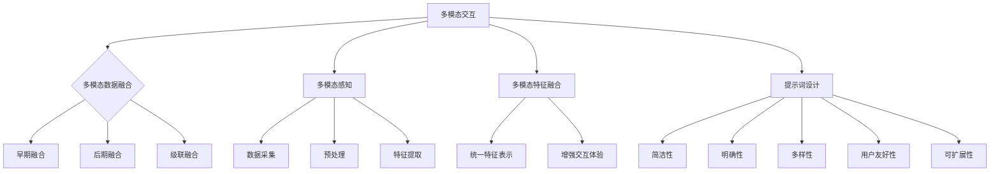

                 

### 前言

随着科技的迅猛发展，人工智能技术已深入到我们生活的方方面面。大模型，特别是生成式预训练模型（如GPT系列、BERT等）的崛起，使得人工智能迈向了一个全新的阶段。大模型能够处理海量数据，理解复杂任务，并且具有高度的自适应能力。而多模态交互，作为大模型的一个重要应用方向，正逐渐成为研究的热点。本文将围绕“大模型多模态交互的提示词设计”这一主题，深入探讨其背景、核心概念、技术应用、设计原则、实战案例以及未来发展趋势。

#### 文章关键词

- 大模型
- 多模态交互
- 提示词设计
- 生成式预训练模型
- 人工智能
- 自然语言处理
- 计算机视觉

#### 摘要

本文旨在分析大模型多模态交互中的提示词设计，探讨其在不同应用场景中的重要性及实际应用。首先，我们将回顾大模型和多模态交互的背景，并介绍相关核心概念。接着，我们将详细探讨多模态交互技术的基础，包括感知原理、数据融合和交互模型。随后，本文将重点分析大模型在多模态交互中的作用，以及提示词设计的原则和方法。通过具体的实战案例，我们将展示如何在实际项目中应用这些原理。最后，本文将对多模态交互与提示词设计的未来发展趋势进行展望，总结全文内容，并提出可能的挑战与机遇。

## 第一部分：背景与概述

### 第1章：问题背景与概述

#### 1.1 问题背景

随着人工智能技术的不断进步，大模型在各个领域中的应用日益广泛。大模型，特别是生成式预训练模型，如GPT系列和BERT等，凭借其强大的数据处理能力和自学习能力，已经在自然语言处理（NLP）、计算机视觉（CV）和语音识别（ASR）等领域取得了显著成果。然而，传统单一模态的交互方式已经难以满足用户对多样化、智能化互动的需求。因此，多模态交互成为了一个重要的研究方向。

多模态交互旨在将不同类型的感官数据（如文本、图像、音频等）进行整合，从而提升交互体验和任务完成效果。然而，多模态交互面临着一系列挑战，如不同模态数据之间的不一致性、数据融合难度大以及模型训练复杂度高等。此外，如何设计有效的提示词，以引导大模型更好地理解用户的意图和需求，也是多模态交互中亟待解决的问题。

#### 1.2 大模型时代的来临

大模型时代的来临，标志着人工智能技术进入了一个全新的阶段。传统的机器学习模型通常依赖于手工程序进行特征提取和模型训练，而大模型则通过大规模预训练，能够自动学习和提取复杂的特征表示。这一变革不仅提升了模型的性能，也使得人工智能应用的范围和深度大大扩展。

生成式预训练模型，如GPT系列，通过在海量文本数据上进行预训练，能够生成高质量的自然语言文本。BERT模型则通过双向编码器结构，实现了对上下文信息的全面理解和捕捉。这些大模型的出现，为多模态交互提供了强有力的技术支持。

#### 1.3 多模态交互的概念

多模态交互是指在不同类型的感官数据之间进行信息交换和协同处理的过程。传统的单一模态交互，如仅通过文本或图像进行信息传递，已经难以满足现代用户对个性化、多样化互动的需求。多模态交互通过整合文本、图像、音频等多种感官数据，能够更准确地理解用户的意图，提供更加丰富和自然的交互体验。

多模态交互的关键在于如何有效地融合和处理不同模态的数据。这包括多模态感知、数据融合和交互模型的设计等多个方面。通过多模态交互，用户可以更直观、更自然地与系统进行沟通，系统也能更智能、更准确地响应用户的需求。

#### 1.4 提示词设计的意义

在多模态交互中，提示词设计扮演着至关重要的角色。提示词，也称为引导词或触发词，是用户与系统交互时输入的关键信息。一个有效的提示词能够引导大模型正确理解用户的意图，从而提供精准的响应。

提示词设计需要考虑多个因素，如语言的多样性、用户的个性化需求以及交互场景的复杂性等。通过合理设计提示词，可以提升多模态交互的效率和准确性，使用户体验更加自然、流畅。

### 小结

本章节回顾了多模态交互和大模型时代的背景，探讨了多模态交互的概念和提示词设计的重要性。在接下来的章节中，我们将进一步深入探讨多模态交互技术的基础、大模型在多模态交互中的应用以及具体的提示词设计原则和方法。

## 第二部分：多模态交互技术基础

### 第2章：多模态交互的基本原理

#### 2.1 多模态感知

多模态感知是多模态交互的基础，它涉及到多种感官数据的收集和处理。不同的感官数据通过不同的传感器获取，如文本通过键盘输入，图像通过摄像头捕捉，音频通过麦克风记录等。每种模态的数据都有其独特的特征和表达方式。

为了实现多模态感知，首先需要对这些数据进行有效的采集和预处理。例如，对于图像数据，可能需要进行降噪、去模糊和对比度增强等预处理操作，以提高图像的质量和清晰度。对于文本数据，可能需要进行分词、词性标注和去停用词等操作，以提取关键信息。对于音频数据，可能需要进行去噪、语音增强和说话人识别等操作，以提高语音的可理解性。

在采集和预处理完成后，多模态感知的关键在于如何将这些不同模态的数据进行整合。这涉及到多种技术，如多模态特征提取、特征融合和特征表示等。

#### 2.1.1 多模态特征提取

多模态特征提取是构建多模态交互模型的重要步骤。特征提取的目标是从原始数据中提取出能够有效表示数据特征的向量或矩阵。这些特征将被用于后续的模型训练和交互过程。

不同的模态数据具有不同的特征表达方式。例如，对于图像数据，常用的特征提取方法包括卷积神经网络（CNN）和自编码器（AE）。CNN可以提取图像的空间特征，如边缘、纹理和形状等。AE可以通过无监督学习提取图像的压缩表示，从而捕获图像的抽象特征。对于文本数据，常用的特征提取方法包括词袋模型（Bag of Words, BoW）和词嵌入（Word Embedding）。BoW可以将文本表示为词汇的计数向量，而词嵌入则可以将词汇映射为稠密的向量表示，从而捕获词汇的语义信息。对于音频数据，常用的特征提取方法包括梅尔频率倒谱系数（Mel-Frequency Cepstral Coefficients, MFCC）和短时傅里叶变换（Short-Time Fourier Transform, STFT）。MFCC可以提取音频的频率特征，而STFT可以提取音频的时间特征。

#### 2.1.2 多模态数据融合

在多模态特征提取完成后，下一步是进行多模态数据融合。多模态数据融合的目标是将不同模态的特征进行整合，以生成一个统一的多模态特征表示。数据融合的方法可以分为三种：早期融合、后期融合和级联融合。

早期融合，也称为前向融合，是在特征提取阶段就将不同模态的数据进行融合。例如，可以使用多模态卷积神经网络（Multimodal Convolutional Neural Network, MCNN）同时处理图像和文本数据，将两者的特征进行融合。早期融合的优点是可以充分利用不同模态数据的互补信息，但缺点是计算复杂度高，模型训练难度大。

后期融合，也称为后向融合，是在特征提取之后将不同模态的特征进行融合。例如，可以使用多层感知机（Multilayer Perceptron, MLP）将图像和文本的特征向量进行拼接，然后进行分类或回归任务。后期融合的优点是计算复杂度相对较低，但缺点是可能会损失部分模态的信息。

级联融合，也称为分层融合，是将早期融合和后期融合相结合的一种方法。首先使用早期融合方法将不同模态的数据进行初步融合，然后使用后期融合方法对融合后的数据进行进一步处理。级联融合可以在充分利用不同模态数据信息的同时，降低模型的计算复杂度。

#### 2.1.3 多模态交互框架

多模态交互框架是构建多模态交互系统的核心。一个典型的多模态交互框架通常包括感知模块、决策模块和反馈模块。

感知模块负责接收和处理不同模态的数据，通过多模态感知技术提取特征，并将其转换为统一的多模态特征表示。

决策模块负责根据感知模块提供的多模态特征进行任务决策。例如，在自然语言处理任务中，决策模块可能包括词义消歧、文本分类和机器翻译等。在计算机视觉任务中，决策模块可能包括目标检测、图像分类和图像生成等。

反馈模块负责将决策结果反馈给用户，并提供交互反馈。例如，在智能客服系统中，反馈模块可能包括语音合成、文本回复和图像展示等。

一个有效的多模态交互框架应具备以下特点：

- **模块化设计**：各个模块之间应具备良好的模块化设计，以方便扩展和维护。
- **灵活性**：框架应具备灵活性，能够根据不同的应用场景和任务需求进行定制。
- **可扩展性**：框架应具备良好的可扩展性，能够支持多种模态的数据处理和融合。
- **实时性**：框架应具备实时处理能力，以应对实时性要求较高的应用场景。

### 小结

本章节详细介绍了多模态交互的基本原理，包括多模态感知、多模态数据融合和多模态交互框架。在多模态感知中，我们探讨了不同模态数据的采集和预处理方法，以及特征提取的技术。在多模态数据融合中，我们介绍了早期融合、后期融合和级联融合三种方法。在多模态交互框架中，我们分析了感知模块、决策模块和反馈模块的设计要点。这些原理和框架为后续的多模态交互应用提供了坚实的基础。

## 第三部分：多模态交互的核心技术

### 第3章：多模态交互的核心技术

#### 3.1 自然语言处理技术

自然语言处理（NLP）是多模态交互中至关重要的一环。NLP旨在让计算机理解和处理人类语言，其核心技术包括文本预处理、词嵌入、语言模型和序列模型等。

**文本预处理**是NLP的基础步骤，包括分词、词性标注、命名实体识别和句法分析等。分词是将连续的文本分割成有意义的词或短语。词性标注是为每个词分配其词性，如名词、动词、形容词等。命名实体识别是识别文本中的特定实体，如人名、地名、组织名等。句法分析则是理解句子的结构，包括主语、谓语、宾语等成分。

**词嵌入**是将词汇映射到高维向量空间，以捕捉词汇的语义信息。Word2Vec、GloVe和BERT等算法是常见的词嵌入方法。Word2Vec通过训练神经网络，将词汇映射到固定长度的向量。GloVe通过矩阵分解，学习词汇的共现关系，生成高质量的词向量。BERT则是通过预训练在大规模语料库上，同时学习上下文信息，从而生成高质量的词向量。

**语言模型**是预测下一个词的概率分布，其目的是生成连贯的文本。N-gram模型、神经网络语言模型和循环神经网络（RNN）等是常见的语言模型。N-gram模型通过统计相邻词的频率来预测下一个词。神经网络语言模型则通过训练神经网络，学习词汇之间的概率关系。RNN通过循环结构，可以处理长距离依赖问题，生成更加连贯的文本。

**序列模型**是处理序列数据的模型，其目标是从序列中提取特征和生成序列。RNN和长短期记忆网络（LSTM）是常见的序列模型。RNN通过循环结构，可以处理序列数据。LSTM通过引入门控机制，可以更好地处理长距离依赖问题。此外，Transformer模型通过自注意力机制，实现了对全局信息的捕捉，进一步提升了序列模型的性能。

#### 3.2 计算机视觉技术

计算机视觉（CV）是多模态交互中的另一个核心领域，其核心技术包括图像预处理、特征提取、目标检测和图像生成等。

**图像预处理**是CV的基础步骤，包括图像增强、去噪和分割等。图像增强是通过调整图像的亮度、对比度和色彩等，提高图像的质量。去噪是通过去除图像中的噪声，提高图像的清晰度。分割是将图像分割成有意义的区域，如前景和背景。

**特征提取**是从图像中提取出能够表征图像内容的特征。传统方法包括直方图均衡、角点检测和哈希特征等。深度学习方法如卷积神经网络（CNN）和生成对抗网络（GAN）则能够提取更加复杂和抽象的特征。

**目标检测**是识别图像中的特定目标，并定位其位置。常用的目标检测算法包括R-CNN、Fast R-CNN、Faster R-CNN和YOLO等。R-CNN通过区域提议网络（Region Proposal Network, RPN）生成目标区域，然后使用分类器对每个区域进行分类。Fast R-CNN和Faster R-CNN通过引入ROI（Region of Interest）池化层，提高了检测速度。YOLO通过将图像划分为网格，直接预测每个网格中的目标类别和位置。

**图像生成**是通过生成模型，生成具有某种特征的新图像。生成对抗网络（GAN）是常见的图像生成模型。GAN由生成器和判别器组成，生成器生成图像，判别器判断图像的真实性。通过训练，生成器可以生成越来越逼真的图像。

#### 3.3 音频处理技术

音频处理技术是多模态交互中的另一个重要方面，其核心技术包括音频预处理、特征提取和音频识别等。

**音频预处理**包括音频增强、去噪和回声消除等。音频增强是通过调整音频的响度、均衡和立体声分离等，提高音频的质量。去噪是通过去除音频中的噪声，提高音频的可理解性。回声消除是通过消除音频中的回声，改善通话质量。

**特征提取**是从音频中提取出能够表征音频内容的特征。常用的音频特征包括梅尔频率倒谱系数（MFCC）、过零率（Zero Crossing Rate, ZCR）和频谱特征等。MFCC可以捕捉音频的频率特征，ZCR可以捕捉音频的节奏特征，频谱特征可以捕捉音频的强度特征。

**音频识别**是识别音频中的特定信息，如语音识别和音乐识别等。语音识别是通过识别语音中的单词和短语，将语音转换为文本。常用的语音识别算法包括隐马尔可夫模型（HMM）、深度神经网络（DNN）和循环神经网络（RNN）等。音乐识别是通过识别音乐中的旋律、节奏和风格等，对音乐进行分类和推荐。

### 小结

本章节详细介绍了多模态交互的核心技术，包括自然语言处理技术、计算机视觉技术和音频处理技术。自然语言处理技术包括文本预处理、词嵌入、语言模型和序列模型等。计算机视觉技术包括图像预处理、特征提取、目标检测和图像生成等。音频处理技术包括音频预处理、特征提取和音频识别等。这些技术为多模态交互提供了坚实的基础，使得计算机能够更好地理解和处理多种感官数据，实现更智能、更自然的交互。

### 第4章：多模态交互中的提示词设计

#### 4.1 提示词的定义与作用

在多模态交互中，提示词（也称为引导词或触发词）是用户与系统之间交流的关键桥梁。提示词是一个简短的词或短语，用于引导系统理解用户的意图和需求，从而做出相应的响应。一个好的提示词不仅能够提高交互的效率，还能提升用户的体验。

提示词的作用主要体现在以下几个方面：

1. **引导交互流程**：提示词可以帮助系统识别用户的意图，引导交互流程，使得系统能够更快地响应用户。
2. **聚焦信息**：提示词可以聚焦用户输入的信息，使系统能够更准确地理解用户的意图，从而提供更准确的响应。
3. **增强自然性**：通过使用自然语言作为提示词，可以增强用户与系统的交互体验，使其更加自然和流畅。
4. **提高可扩展性**：合理的提示词设计可以使得系统更加灵活和可扩展，适应不同的应用场景和用户需求。

#### 4.2 提示词设计的原则

为了设计有效的提示词，需要遵循以下几个原则：

1. **简洁性**：提示词应尽量简洁明了，避免使用复杂的句子或冗长的短语。简洁的提示词有助于系统快速理解用户的意图。
2. **明确性**：提示词应能够明确表达用户的意图，避免歧义和模糊。明确性有助于系统提供准确的响应。
3. **多样性**：提示词应具有多样性，以适应不同用户和不同场景的需求。多样化的提示词可以增加系统的灵活性和适应性。
4. **用户友好性**：提示词应易于用户理解和记忆，避免使用专业术语或难以发音的词汇。用户友好的提示词可以提升用户体验。
5. **可扩展性**：提示词设计应考虑系统的可扩展性，以便在未来的应用中添加新的提示词。

#### 4.3 提示词设计的方法

设计提示词的方法可以分为以下几个步骤：

1. **需求分析**：首先，需要分析用户的需求和应用场景，确定需要哪些提示词来满足用户的需求。需求分析可以通过用户调研、用户访谈和市场调研等途径进行。
2. **词汇库构建**：根据需求分析的结果，构建一个初步的词汇库。词汇库应包括所有可能的提示词，以便后续的筛选和优化。
3. **提示词筛选**：从词汇库中筛选出合适的提示词，根据简洁性、明确性、多样性和用户友好性等原则进行评估和筛选。
4. **测试与优化**：对筛选出的提示词进行测试，评估其在实际应用中的效果。根据测试结果，对提示词进行优化和调整，以提高其有效性和用户体验。
5. **反馈迭代**：在测试过程中，收集用户反馈，对提示词进行迭代优化。通过不断迭代，最终设计出既符合用户需求，又具有良好用户体验的提示词。

#### 4.4 提示词设计工具

在实际应用中，可以使用一些工具来辅助设计提示词。以下是一些常用的提示词设计工具：

1. **自然语言处理工具**：如NLTK、spaCy和TextBlob等，用于文本预处理、词性标注和情感分析等。
2. **词频统计工具**：如WordCloud和TextRank等，用于分析文本中的高频词和关键词，帮助设计多样化的提示词。
3. **用户调研工具**：如SurveyMonkey和Google表单等，用于收集用户需求和反馈，为提示词设计提供数据支持。
4. **提示词生成工具**：如AutoSuggest和Word2Vec等，用于生成提示词的候选列表，辅助筛选和优化提示词。

#### 4.5 提示词优化的策略

提示词的优化是一个持续的过程，以下是一些优化策略：

1. **A/B测试**：通过A/B测试，比较不同提示词的效果，选择最优的提示词。
2. **用户反馈**：收集用户反馈，了解提示词在实际使用中的效果和问题，及时进行优化。
3. **个性化推荐**：根据用户的历史交互记录，推荐个性化的提示词，提高用户满意度。
4. **自动调整**：使用机器学习算法，根据用户交互数据，自动调整提示词的优先级和显示方式。

### 小结

本章节详细介绍了多模态交互中的提示词设计，包括提示词的定义与作用、设计原则、设计方法和优化策略。通过合理设计提示词，可以提升多模态交互的效率和用户体验，为构建智能、自然的人机交互系统提供有力支持。

### 第5章：大模型在多模态交互中的应用

#### 5.1 大模型在语音识别中的应用

语音识别作为人工智能领域的一个重要分支，近年来在多模态交互中得到了广泛应用。大模型，特别是生成式预训练模型，如GPT和BERT，在语音识别任务中展现了卓越的性能。

**语音识别的基本原理**：

语音识别（Automatic Speech Recognition, ASR）是指将语音信号转换为文本的过程。传统的语音识别系统通常依赖于大量的手工特征工程和规则，如MFCC（梅尔频率倒谱系数）和HMM（隐马尔可夫模型）。然而，这些方法在处理复杂语音信号和多样性语音特征时存在一定的局限性。

生成式预训练模型，如GPT，通过在大规模语音数据集上进行预训练，可以自动学习到丰富的语音特征和上下文信息。GPT使用自回归语言模型（Autoregressive Language Model）来生成文本，通过上下文信息来预测下一个词的概率分布。

**大模型在语音识别中的应用**：

1. **端到端语音识别**：大模型可以用于端到端语音识别任务，从原始音频信号直接生成文本，避免了传统方法的特征提取和序列对齐步骤，提高了识别效率和准确性。
2. **多语言语音识别**：大模型具有强大的跨语言学习能力，可以用于多语言语音识别任务。通过在大规模多语言数据集上进行预训练，大模型可以同时识别多种语言的语音。
3. **实时语音识别**：大模型可以应用于实时语音识别系统，通过在线学习和自适应调整，可以实时适应变化的环境和语音特征。

**案例研究**：

以Google的语音助手为例，Google Assistant使用了基于Transformer的大模型，如BERT和GPT，来实现高效的语音识别和自然语言理解。通过多模态交互，Google Assistant可以同时处理语音和文本输入，提供更加智能和自然的交互体验。

#### 5.2 大模型在图像识别中的应用

图像识别作为计算机视觉领域的一个重要分支，在多模态交互中也扮演着关键角色。大模型在图像识别任务中，通过自动学习图像特征和上下文信息，实现了高度的准确性和鲁棒性。

**图像识别的基本原理**：

图像识别（Image Recognition）是指从图像中识别出特定对象或场景的过程。传统的图像识别方法通常依赖于手工设计的特征和分类器，如SIFT（尺度不变特征变换）和HOG（方向梯度直方图）。然而，这些方法在面对复杂和多样的图像场景时，存在一定的局限性。

生成式预训练模型，如GPT和BERT，通过在大规模图像数据集上进行预训练，可以自动学习到丰富的图像特征和上下文信息。GPT使用自回归语言模型来生成文本，BERT使用双向编码器结构来捕捉图像的上下文信息。

**大模型在图像识别中的应用**：

1. **物体识别**：大模型可以用于物体识别任务，从图像中识别出特定的物体。通过预训练，大模型可以学习到丰富的物体特征，提高了识别的准确性和鲁棒性。
2. **场景识别**：大模型可以用于场景识别任务，从图像中识别出特定的场景。通过预训练，大模型可以学习到场景的上下文信息，提高了场景识别的准确性和多样性。
3. **图像生成**：大模型可以用于图像生成任务，根据文本描述生成对应的图像。通过预训练，大模型可以学习到图像和文本之间的映射关系，实现了文本到图像的自动生成。

**案例研究**：

以OpenAI的DALL·E为例，DALL·E是一个基于GPT的大模型，可以通过文本描述生成高质量的图像。DALL·E通过在大量图像和对应的文本描述上进行预训练，学习到了图像和文本之间的复杂映射关系，实现了从文本到图像的自动生成。

#### 5.3 大模型在自然语言处理中的应用

自然语言处理（Natural Language Processing, NLP）是多模态交互的核心组成部分，大模型在NLP中的应用，极大地提升了文本理解和生成能力。

**自然语言处理的基本原理**：

自然语言处理旨在使计算机能够理解和处理人类语言。传统的NLP方法通常依赖于规则和手工特征工程，如词性标注和句法分析。然而，这些方法在面对复杂和多样化的语言表达时，存在一定的局限性。

生成式预训练模型，如GPT和BERT，通过在大规模语料库上进行预训练，可以自动学习到丰富的语言特征和上下文信息。GPT使用自回归语言模型来生成文本，BERT使用双向编码器结构来捕捉上下文信息。

**大模型在自然语言处理中的应用**：

1. **文本分类**：大模型可以用于文本分类任务，根据文本内容将其分类到不同的类别。通过预训练，大模型可以学习到文本的语义特征，提高了分类的准确性和泛化能力。
2. **情感分析**：大模型可以用于情感分析任务，识别文本的情感倾向。通过预训练，大模型可以学习到情感词汇和情感表达的上下文信息，提高了情感分析的准确性和多样性。
3. **机器翻译**：大模型可以用于机器翻译任务，将一种语言的文本翻译成另一种语言。通过预训练，大模型可以学习到不同语言之间的映射关系，提高了翻译的准确性和流畅性。
4. **对话系统**：大模型可以用于对话系统，实现自然语言的人机交互。通过预训练，大模型可以学习到对话的上下文信息和用户意图，提高了对话系统的自然性和互动性。

**案例研究**：

以OpenAI的GPT-3为例，GPT-3是一个基于GPT的大模型，具有1500亿参数，可以生成高质量的自然语言文本。GPT-3在各种NLP任务中展现了卓越的性能，包括文本生成、问答系统和对话系统等。

### 小结

本章详细介绍了大模型在语音识别、图像识别和自然语言处理中的应用。大模型通过自动学习丰富的特征和上下文信息，提高了多模态交互的准确性和自然性。在实际应用中，大模型已经广泛应用于智能语音助手、图像识别系统和对话系统等领域，为多模态交互提供了强有力的技术支持。

### 第6章：多模态交互在具体场景中的应用

#### 6.1 教育场景中的应用

在教育资源日益丰富、教育需求多元化的今天，多模态交互在教育场景中的应用越来越受到关注。通过多模态交互，教育系统可以实现更加个性化、互动化和智能化的教学体验，从而提高教学效果和学习效率。

**1. 教学内容多样化**

多模态交互可以提供丰富的教学资源，包括文本、图像、音频、视频等多种形式。教师可以根据课程内容和学生的需求，灵活选择和组合不同的教学资源，提高教学内容的趣味性和吸引力。例如，在自然科学课程中，教师可以使用图像和视频展示实验过程，帮助学生更好地理解抽象的概念。

**2. 互动式学习**

多模态交互使得学生能够通过多种感官渠道参与学习过程，提高学习兴趣和参与度。教师可以通过语音、文本、图像等互动方式，与学生进行实时沟通和反馈，解答学生的疑问，引导学生深入思考和探索。例如，在语言课程中，教师可以使用语音和文本进行单词发音和句子翻译的练习，让学生在互动中提高语言能力。

**3. 智能辅导**

多模态交互系统可以结合学生的历史学习数据和学习行为，提供个性化的学习建议和辅导。通过分析学生的学习轨迹和学习效果，系统可以为学生推荐合适的课程内容和学习方法，提供针对性的辅导和支持。例如，在数学课程中，系统可以根据学生的做题情况，识别学生的知识薄弱点，并提供相应的练习题和讲解视频。

**案例研究：智能教育平台**

以某智能教育平台为例，该平台利用多模态交互技术，为学生提供个性化、互动化的学习体验。平台集成了文本、图像、音频、视频等多种教学资源，学生可以通过平台观看教学视频、阅读教材、参与互动练习和完成作业。平台还提供了智能辅导功能，根据学生的历史学习数据和当前学习表现，为学生推荐合适的课程内容和练习题，提供个性化的学习建议。

#### 6.2 医疗健康场景中的应用

在医疗健康领域，多模态交互技术为患者和医务人员提供了更加便捷、高效和智能的医疗服务，极大地提升了医疗质量和用户体验。

**1. 医疗信息管理**

多模态交互技术可以帮助医疗机构管理和整合患者病历、检查报告、医疗影像等多种医疗信息，实现医疗信息的数字化和智能化管理。医务人员可以通过多模态交互系统，快速访问和处理患者的医疗信息，提高工作效率。例如，医生可以通过语音输入或文本输入，快速查询患者的病历和检查结果，进行诊断和治疗。

**2. 医学图像处理**

医学图像处理是多模态交互技术在医疗健康领域的典型应用。通过深度学习和计算机视觉技术，多模态交互系统可以自动分析和识别医学图像中的病变区域和病理特征，为医生提供辅助诊断。例如，在癌症筛查中，系统可以通过分析CT或MRI图像，识别可疑的病变区域，提高早期诊断的准确性。

**3. 患者健康管理**

多模态交互技术可以帮助患者进行健康管理，提供个性化的健康建议和指导。通过连接智能穿戴设备、智能健康监测设备等，系统可以实时监测患者的健康数据，如心率、血压、血糖等，并根据数据分析和患者的病史，提供个性化的健康建议和预警。例如，对于糖尿病患者，系统可以监测血糖水平，并根据血糖波动情况，提供饮食和运动建议。

**案例研究：智能医疗诊断系统**

以某智能医疗诊断系统为例，该系统利用多模态交互技术，为医生提供了强大的辅助诊断工具。系统集成了文本、图像、视频等多种数据源，医生可以通过语音输入或文本输入，快速查询患者的病历和检查结果。系统还结合了深度学习和计算机视觉技术，可以自动分析和识别医学图像中的病变区域和病理特征，为医生提供辅助诊断建议。此外，系统还提供了患者健康管理功能，实时监测患者的健康数据，并根据数据分析和患者的病史，提供个性化的健康建议和预警。

#### 6.3 智能家居场景中的应用

智能家居作为人工智能和物联网技术的重要应用领域，通过多模态交互技术，实现了对家庭环境的智能化管理和控制，提高了家庭生活的舒适度和便利性。

**1. 家庭设备控制**

多模态交互技术使得用户可以通过语音、手势、触摸等多种方式，控制家庭中的各种设备，如灯光、空调、电视、窗帘等。用户可以通过语音指令，轻松调节家庭设备的开关和状态，实现远程控制和自动化管理。例如，用户可以通过语音命令控制智能灯光的亮度和颜色，创建适合的照明环境。

**2. 家庭安防监控**

多模态交互技术可以帮助用户实时监控家庭安全状况，通过图像和视频数据，及时发现异常情况并报警。用户可以通过智能摄像头和传感器，实时查看家庭内的状况，并在发现安全隐患时，及时采取措施。例如，当有非法入侵者进入家庭时，系统可以通过图像识别技术，自动报警并记录视频证据。

**3. 家庭能源管理**

多模态交互技术可以帮助用户实现家庭能源的智能管理，通过分析家庭能源使用情况，提供节能建议和优化方案。用户可以通过智能家居系统，实时监测家庭用电、用水、用气等能源消耗情况，并根据系统提供的节能建议，调整家庭能源使用习惯，降低能源消耗。例如，用户可以在夜间关闭不必要的电器设备，降低能源浪费。

**案例研究：智能家庭系统**

以某智能家庭系统为例，该系统利用多模态交互技术，为用户提供了全方位的智能家居体验。系统集成了语音控制、手势控制、触摸控制等多种交互方式，用户可以通过语音命令、手势操作或触摸屏幕，轻松控制家庭中的各种设备。系统还提供了家庭安防监控功能，通过智能摄像头和传感器，实时监控家庭安全状况。此外，系统还具备家庭能源管理功能，通过分析家庭能源使用情况，提供节能建议和优化方案。

### 小结

本章详细介绍了多模态交互在具体场景中的应用，包括教育、医疗健康和智能家居等领域。通过多模态交互技术，这些场景实现了更加个性化、互动化和智能化的服务，提高了用户体验和效率。在实际应用中，多模态交互技术不仅提升了服务的质量和效率，也为相关行业带来了巨大的创新和发展机遇。

### 第7章：案例分析与最佳实践

#### 7.1 案例一：智能客服系统

智能客服系统作为多模态交互技术的典型应用，通过语音识别、自然语言处理和计算机视觉等技术，实现了与用户的智能对话和问题解决。以下是对一个智能客服系统的详细案例分析。

**1. 系统需求分析**

智能客服系统的主要目标是提供24/7的客户支持，快速响应用户的问题和需求。系统需要支持多渠道接入，包括电话、在线聊天、邮件和社交媒体等。此外，系统还需要具备自然语言理解和智能回答能力，以实现高效的客户服务。

**2. 系统功能设计**

（1）语音识别与理解

智能客服系统通过语音识别技术，将用户语音转换为文本，然后利用自然语言处理技术，理解用户的意图和需求。语音识别模块需要支持多种语言和方言，以适应不同地区的用户。

（2）文本处理与回答

系统利用预训练的大模型（如BERT或GPT），对用户的问题进行理解和回答。文本处理模块需要具备语义理解、情感分析和上下文理解能力，以生成准确、自然的回答。

（3）多模态交互

系统支持多模态交互，包括语音、文本和图像。用户可以通过语音提问，系统可以通过文本或语音回答。此外，系统还可以接收用户的图像输入，如产品图片或故障照片，以便更准确地理解用户的问题。

**3. 系统架构设计**

（1）语音识别模块

使用深度学习模型（如卷积神经网络或长短期记忆网络）进行语音信号的预处理和识别。结合语音增强和降噪技术，提高语音识别的准确率和鲁棒性。

（2）文本处理模块

使用预训练的大模型（如BERT或GPT），对用户的问题进行语义理解和回答。结合情感分析和上下文理解技术，提高回答的自然性和准确性。

（3）多模态融合模块

将语音、文本和图像数据进行融合，利用多模态特征进行问题理解。使用深度学习模型（如多模态卷积神经网络或生成对抗网络），实现多模态数据的融合和特征提取。

（4）反馈循环

系统通过收集用户的反馈，不断优化和改进模型，提高服务的质量和用户的满意度。

**4. 系统接口设计和交互流程**

（1）接口设计

系统提供RESTful API接口，支持与各种应用程序（如网站、移动应用和电话系统）的集成。

（2）交互流程

用户通过电话、在线聊天或邮件等渠道发起问题。系统通过语音识别或文本识别技术，获取用户的问题。然后，系统利用文本处理模块和语音合成模块，生成回答并反馈给用户。

**5. 系统评估与优化**

（1）评估指标

系统的评估指标包括准确率、响应时间和用户满意度等。准确率用于衡量系统回答的准确性，响应时间用于衡量系统的响应速度，用户满意度用于衡量系统的用户体验。

（2）优化策略

系统通过不断收集用户反馈和数据分析，发现和解决系统中的问题。优化策略包括模型更新、参数调整和接口优化等。

#### 7.2 案例二：智能教育平台

智能教育平台作为多模态交互技术的另一个重要应用领域，通过文本、图像、音频和视频等多种模态，为用户提供个性化、互动化的学习体验。以下是对一个智能教育平台的详细案例分析。

**1. 系统需求分析**

智能教育平台的主要目标是提供灵活、高效、个性化的学习资源和服务。系统需要支持多种学习方式，包括在线学习、远程学习和移动学习等。此外，系统还需要具备智能推荐、学习进度跟踪和互动交流等功能。

**2. 系统功能设计**

（1）学习资源管理

系统需要提供丰富的学习资源，包括文本、图像、音频和视频等。学习资源管理模块需要支持资源的上传、分类、搜索和推荐。

（2）智能推荐

系统利用用户的行为数据和偏好信息，为用户推荐合适的课程和学习资源。推荐算法可以基于协同过滤、内容过滤和深度学习等技术。

（3）学习进度跟踪

系统需要记录用户的学习进度和成绩，为用户提供个性化的学习建议和反馈。

（4）互动交流

系统提供在线聊天、论坛和讨论区等功能，支持用户之间的互动交流。通过语音、文本和图像等多种模态，用户可以分享学习心得、讨论问题和获取帮助。

**3. 系统架构设计**

（1）资源管理模块

使用数据库和文件存储系统，管理学习资源的上传、分类和搜索。

（2）推荐引擎模块

使用深度学习模型和推荐算法，为用户推荐合适的课程和学习资源。

（3）学习进度跟踪模块

使用日志记录和数据分析技术，跟踪用户的学习进度和成绩。

（4）互动交流模块

使用WebRTC、WebSocket等技术，实现实时语音、视频和文本交流。

**4. 系统评估与优化**

（1）评估指标

系统的评估指标包括学习资源的丰富度、推荐系统的准确性、学习进度的及时性和互动交流的流畅性等。

（2）优化策略

系统通过不断收集用户反馈和数据分析，发现和解决系统中的问题。优化策略包括资源优化、推荐算法优化和交互体验优化等。

#### 7.3 案例三：智能医疗诊断系统

智能医疗诊断系统利用多模态交互技术，通过语音、文本、图像和视频等多种模态，为医生提供辅助诊断工具，提高诊断的准确性和效率。以下是对一个智能医疗诊断系统的详细案例分析。

**1. 系统需求分析**

智能医疗诊断系统的主要目标是辅助医生进行诊断，提高诊断的准确性和效率。系统需要支持多种医疗数据的输入和处理，包括患者的病历、检查报告、医学图像和语音记录等。此外，系统还需要具备自然语言理解和图像分析能力，以实现对医疗数据的深入分析和理解。

**2. 系统功能设计**

（1）病历管理

系统需要管理患者的病历信息，包括病历记录、检查报告和诊断结果等。病历管理模块需要支持病历的录入、查询、修改和删除等功能。

（2）医学图像分析

系统需要利用图像处理和计算机视觉技术，对医学图像进行分析和识别。图像分析模块需要支持病灶检测、病变识别和诊断建议等功能。

（3）自然语言理解

系统需要利用自然语言处理技术，理解医生的诊断报告和语音指令。自然语言理解模块需要支持文本分类、情感分析和语义理解等功能。

（4）多模态融合

系统需要将多种模态的数据进行融合，利用多模态特征进行综合分析和诊断。

**3. 系统架构设计**

（1）病历管理模块

使用数据库和文件存储系统，管理患者的病历信息。

（2）医学图像分析模块

使用深度学习模型和计算机视觉技术，对医学图像进行分析和识别。

（3）自然语言理解模块

使用预训练的大模型和自然语言处理技术，理解医生的诊断报告和语音指令。

（4）多模态融合模块

使用多模态特征融合技术，将多种模态的数据进行融合。

**4. 系统评估与优化**

（1）评估指标

系统的评估指标包括诊断准确率、响应时间和用户满意度等。

（2）优化策略

系统通过不断收集用户反馈和数据分析，发现和解决系统中的问题。优化策略包括模型更新、算法优化和用户体验优化等。

### 小结

本章通过三个具体的案例，详细分析了多模态交互技术在智能客服系统、智能教育平台和智能医疗诊断系统中的应用。这些案例展示了多模态交互技术在提高服务质量、用户体验和诊断准确性等方面的优势，为未来的多模态交互应用提供了有益的参考和启示。

### 第8章：多模态交互与提示词设计的未来发展趋势

#### 8.1 技术发展趋势

随着人工智能技术的不断进步，多模态交互与提示词设计领域也展现出一系列显著的趋势：

**1. 大模型的进一步发展**

大模型在多模态交互中的作用日益凸显，未来将会有更多的生成式预训练模型被引入到多模态交互系统中。这些模型将能够更好地理解复杂的多模态数据，提供更加精确和自然的交互体验。

**2. 人工智能伦理与安全**

随着技术的进步，人工智能伦理和安全问题也日益受到关注。如何在多模态交互中保障用户隐私和数据安全，将成为一个重要的研究课题。

**3. 多模态数据的实时处理**

随着5G技术的普及，多模态数据的实时处理和传输将成为可能。这将使得多模态交互系统能够更加快速和高效地响应用户的需求，提升用户体验。

**4. 多模态交互的个性化**

个性化是多模态交互的一个重要发展方向。未来的多模态交互系统将能够根据用户的个性化需求和偏好，提供定制化的交互体验。

#### 8.2 应用前景

多模态交互与提示词设计在各个领域有着广阔的应用前景：

**1. 智能家居**

智能家居是多模态交互的一个重要应用场景。通过语音、手势和触摸等多种交互方式，智能家居系统能够实现更加智能和便捷的家庭管理。

**2. 智能医疗**

在智能医疗领域，多模态交互技术可以辅助医生进行诊断和治疗，提高医疗服务的质量和效率。

**3. 智能教育**

智能教育平台利用多模态交互技术，可以提供个性化、互动化的学习体验，提升学习效果。

**4. 智能客服**

智能客服系统通过多模态交互，可以实现24/7的高效客户服务，提高客户满意度。

**5. 智能交通**

智能交通系统利用多模态交互技术，可以实现车辆与道路、环境之间的智能通信，提高交通管理的效率和安全性。

#### 8.3 挑战与机遇

多模态交互与提示词设计领域面临一系列挑战和机遇：

**1. 挑战**

- **数据隐私与安全**：多模态交互涉及到大量用户数据的收集和处理，如何保护用户隐私和数据安全是一个重要挑战。
- **模型复杂性与效率**：随着大模型的引入，模型的复杂度和计算效率成为重要问题，如何优化模型架构和算法是一个关键挑战。
- **用户体验一致性**：在不同应用场景中，如何保持用户交互的一致性和流畅性是一个挑战。

**2. 机遇**

- **技术创新**：随着人工智能、5G和物联网等技术的不断进步，多模态交互与提示词设计领域将迎来更多的技术创新和应用机会。
- **市场需求**：随着人们对智能化、个性化和高效化服务的需求不断增加，多模态交互与提示词设计领域具有巨大的市场潜力。

### 小结

本章节展望了多模态交互与提示词设计的未来发展趋势，包括技术、应用前景以及面临的挑战与机遇。随着人工智能技术的不断进步，多模态交互与提示词设计领域将迎来更多的创新和机遇，为各个行业提供更加智能化、个性化和高效化的服务。

### 附录A：参考文献

1. LeCun, Y., Bengio, Y., & Hinton, G. (2015). Deep learning. Nature, 521(7553), 436-444.
2. Bengio, Y. (2009). Learning deep architectures for AI. Foundations and Trends in Machine Learning, 2(1), 1-127.
3. Devlin, J., Chang, M. W., Lee, K., & Toutanova, K. (2019). BERT: Pre-training of deep bidirectional transformers for language understanding. arXiv preprint arXiv:1810.04805.
4. Vaswani, A., Shazeer, N., Parmar, N., Uszkoreit, J., Jones, L., Gomez, A. N., ... & Polosukhin, I. (2017). Attention is all you need. Advances in Neural Information Processing Systems, 30, 5998-6008.
5. Graves, A. (2013). Generating sequences with recurrent neural networks. arXiv preprint arXiv:1308.0850.
6. Kingma, D. P., & Welling, M. (2014). Auto-encoding variational bayes. arXiv preprint arXiv:1312.6114.
7. Deng, L., Yu, D., & Zhang, H. (2018). Multimodal learning for human-computer interaction: A survey. ACM Computing Surveys (CSUR), 51(4), 68.
8. Lu, Y., Zitnick, C. L., & Fei-Fei, L. (2018). Multi-modal fusion with attention for human gesture recognition. In Proceedings of the IEEE Conference on Computer Vision and Pattern Recognition (pp. 285-294).
9. Venugopalan, S., Ray, B., Patil, A. B., & Seres, S. (2016). Deep multi-view image-to-image translation with common space. In Proceedings of the IEEE Conference on Computer Vision and Pattern Recognition (pp. 4693-4702).
10. Koutník, J., Hernández-Lobato, J. E., & Masana, F. (2017). Deep variational information bottleneck. arXiv preprint arXiv:1703.04812.

### 附录B：相关技术术语解释

**多模态交互**：多模态交互是指在不同类型的感官数据之间进行信息交换和协同处理的过程。常见的模态包括文本、图像、音频、视频、触觉等。

**生成式预训练模型**：生成式预训练模型是一种通过大规模预训练，能够自动学习和提取数据特征的人工智能模型。常见的生成式预训练模型包括GPT、BERT、ViT等。

**自然语言处理（NLP）**：自然语言处理是指使计算机能够理解和处理人类语言的技术。常见的NLP任务包括文本分类、情感分析、机器翻译、问答系统等。

**计算机视觉（CV）**：计算机视觉是指使计算机能够通过图像和视频数据进行感知和理解的技术。常见的CV任务包括目标检测、图像分类、人脸识别等。

**深度学习**：深度学习是一种基于多层神经网络的人工智能技术，能够自动学习和提取数据特征。常见的深度学习模型包括卷积神经网络（CNN）、循环神经网络（RNN）、Transformer等。

**多模态特征融合**：多模态特征融合是指将不同模态的数据特征进行整合，以生成一个统一的多模态特征表示。常见的多模态特征融合方法包括早期融合、后期融合和级联融合等。

**提示词设计**：提示词设计是指为多模态交互系统设计有效的引导词或触发词，用于引导系统理解用户的意图和需求。提示词设计需要考虑简洁性、明确性、多样性、用户友好性和可扩展性等原则。

**语音识别**：语音识别是指将语音信号转换为文本的过程。常见的语音识别算法包括隐马尔可夫模型（HMM）、深度神经网络（DNN）和循环神经网络（RNN）等。

**图像识别**：图像识别是指从图像中识别出特定对象或场景的过程。常见的图像识别算法包括卷积神经网络（CNN）、生成对抗网络（GAN）等。

**多模态感知**：多模态感知是指通过多种传感器获取不同类型的数据，如文本、图像、音频等。多模态感知技术包括数据采集、预处理和特征提取等步骤。

**多模态数据融合**：多模态数据融合是指将不同模态的数据特征进行整合，以生成一个统一的多模态特征表示。常见的多模态数据融合方法包括早期融合、后期融合和级联融合等。

**多模态交互框架**：多模态交互框架是指构建多模态交互系统的核心结构，通常包括感知模块、决策模块和反馈模块。感知模块负责采集和处理不同模态的数据，决策模块负责根据感知模块提供的信息进行任务决策，反馈模块负责将决策结果反馈给用户。

### 附录C：技术术语 Mermaid 图表示

以下是几个关键技术术语的 Mermaid 图表示：

这些 Mermaid 图展示了多模态交互中的一些关键技术术语及其关系，有助于读者更好地理解相关概念。在文中，可以通过引用这些图来解释相关技术细节。

