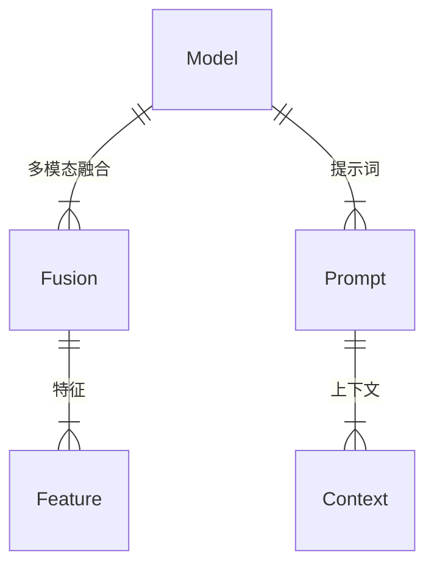
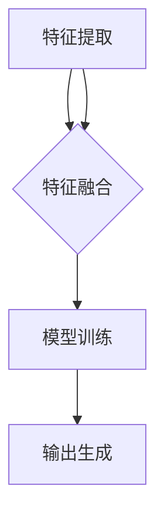
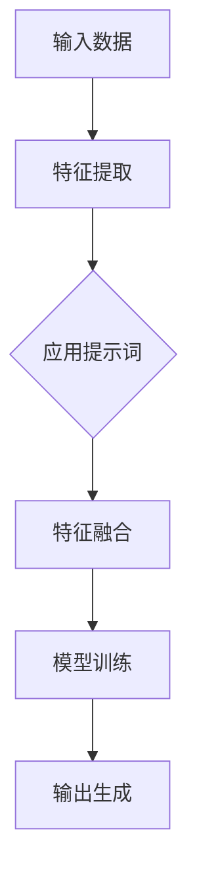
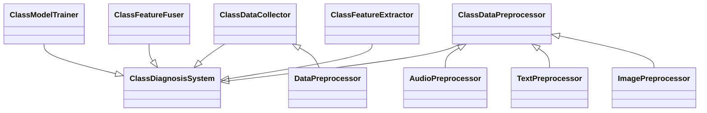
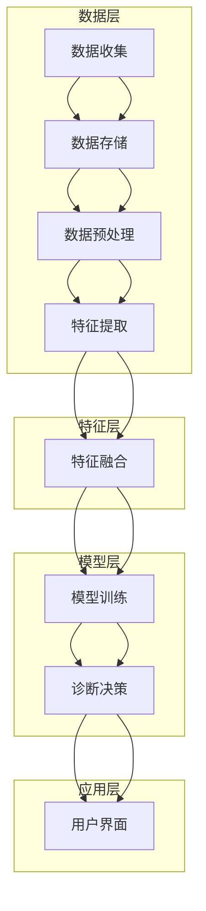
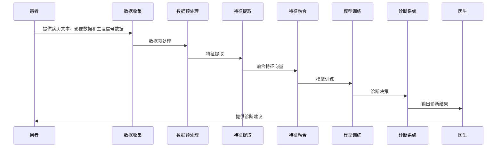

                 

### 大模型多模态融合：提示词的桥梁作用

#### 关键词：大模型、多模态融合、提示词、人工智能

#### 摘要：
在人工智能技术快速发展的今天，大模型的多模态融合成为了一个研究热点。本文将深入探讨大模型多模态融合的背景、核心概念以及提示词在其中发挥的桥梁作用。我们将逐步分析大模型和多种模态数据之间的交互机制，解释提示词如何作为桥梁，提高多模态融合的效率和准确性。通过详细的理论讲解、算法示例以及系统架构设计，本文旨在为读者提供一个全面、深入的理解，并探索这一领域的未来发展方向。

## 第1章：引言

### 1.1 问题背景

人工智能技术的发展日新月异，特别是深度学习和大规模预训练模型（大模型）的兴起，为各个领域带来了革命性的变化。然而，在处理多种类型的数据（如图像、文本、声音等）时，单一模态的数据处理能力有限，难以满足复杂场景下的需求。多模态融合技术应运而生，它通过整合不同模态的信息，能够更准确地理解和生成复杂的内容，从而提升人工智能系统的整体性能。

多模态融合的重要性体现在多个方面。首先，它能够提高信息处理的准确性。例如，在医疗领域，通过融合患者的影像数据和临床记录，可以更准确地诊断病情。其次，多模态融合能够增强系统的泛化能力，使其在面对不同类型的数据时能够保持一致性。此外，多模态融合还可以提升用户体验，例如在虚拟现实和增强现实中，融合视觉、听觉和触觉信息，可以提供更加真实和丰富的交互体验。

然而，多模态融合也面临一些挑战。不同模态的数据类型和特征差异显著，如何有效地整合这些异构信息成为一个难题。此外，多模态融合算法的计算复杂度高，对硬件资源的需求也很大。这些挑战需要通过创新的算法和系统设计来解决。

### 1.2 大模型多模态融合的重要性

大模型，即大规模的神经网络模型，具有强大的特征提取和建模能力。在多模态融合场景中，大模型能够处理大量的数据和复杂的模型参数，从而提高融合的精度和效率。例如，在图像和文本的多模态融合中，大模型可以同时学习图像的视觉特征和文本的语言特征，从而更准确地理解图像和文本之间的关系。

多模态融合的重要性主要体现在以下几个方面：

1. **提升感知能力**：通过融合多种模态的数据，系统能够更全面地感知和理解外界信息，从而提升感知能力。
2. **增强智能推理**：多模态融合能够提供更丰富的上下文信息，有助于系统进行更加复杂的推理和决策。
3. **优化用户体验**：在交互式应用中，多模态融合能够提供更加自然和丰富的交互体验，从而优化用户体验。
4. **拓宽应用领域**：多模态融合技术可以应用于医疗、教育、金融、娱乐等多个领域，推动人工智能技术的广泛应用。

### 1.3 提示词的桥梁作用

提示词在多模态融合中扮演着重要的桥梁作用。提示词是一种指导模型进行特定任务的语言提示，它能够引导模型关注特定的信息，从而提高融合的效率和准确性。

提示词的作用主要体现在以下几个方面：

1. **聚焦特定任务**：通过提示词，模型可以集中处理与特定任务相关的信息，从而提高任务完成的效果。
2. **增强一致性**：提示词可以帮助模型在不同模态之间建立一致性，减少信息丢失和误差。
3. **降低计算复杂度**：提示词可以简化模型的结构，减少计算复杂度，从而提高模型的运算效率。
4. **提高可解释性**：通过提示词，模型的行为和决策过程更加透明和可解释，有助于理解和优化模型。

在多模态融合中，提示词的使用需要考虑多个因素，如任务的类型、数据的特性、模型的架构等。合理使用提示词，可以显著提升多模态融合的效果。

### 1.4 本书结构安排

本书将分为以下几个部分：

1. **背景介绍**：介绍大模型多模态融合的背景和重要性，以及提示词在其中的桥梁作用。
2. **核心概念与联系**：定义并阐述大模型、多模态融合和提示词等核心概念，并通过对比表格和ER实体关系图展示它们之间的关系。
3. **算法原理讲解**：详细讲解多模态融合的算法原理，包括数学模型、流程图和Python代码示例。
4. **系统分析与架构设计方案**：介绍系统架构设计，包括领域模型类图、系统架构图、系统接口设计和系统交互序列图。
5. **项目实战**：通过实际项目案例，展示多模态融合的应用场景和实现细节。
6. **最佳实践 tips**：总结全书内容，提供最佳实践建议，并对读者进行提醒和拓展。
7. **小结与拓展阅读**：对全书内容进行总结，提出下一步研究方向，推荐拓展阅读。

通过上述结构安排，本书旨在为读者提供一个全面、深入的了解大模型多模态融合和提示词桥梁作用的机会。希望读者能够通过本书的学习，掌握多模态融合的核心技术和实践方法，为人工智能领域的发展贡献自己的力量。

---

### 第2章：核心概念与联系

在深入探讨大模型多模态融合和提示词的桥梁作用之前，我们需要明确几个核心概念，并理解它们之间的联系。本章节将介绍大模型、多模态融合和提示词的定义、特点以及它们之间的关系。

#### 2.1 大模型概述

**2.1.1 定义**

大模型，通常指的是具有大规模参数的神经网络模型。这些模型通过大量的数据训练，能够提取出丰富的特征和复杂的模式。大模型的一个重要特点是参数数量庞大，通常在数百万到数十亿个参数之间。

**2.1.2 特点**

1. **强大的特征提取能力**：大模型能够从大量的数据中自动提取出有价值的特征，减少了对人工特征工程的需求。
2. **高泛化能力**：大模型在训练时接触到多样化的数据，能够更好地适应不同的任务和数据分布。
3. **计算资源需求高**：由于参数数量庞大，大模型对计算资源和存储资源的需求较高。

**2.1.3 类型**

大模型根据其应用场景和特点可以分为几种类型，如自然语言处理模型、计算机视觉模型和语音识别模型等。每种类型的大模型都有其特定的结构和训练方法。

#### 2.2 多模态融合

**2.2.1 定义**

多模态融合是指将两种或两种以上不同类型的数据（如图像、文本、声音等）进行结合，以生成一个统一表示的过程。这种融合能够利用不同模态数据的互补性，提高信息处理的准确性和鲁棒性。

**2.2.2 原理**

多模态融合的原理主要包括以下几方面：

1. **特征级融合**：将不同模态的特征映射到同一特征空间，并进行融合。例如，将图像特征和文本特征进行拼接或加权融合。
2. **决策级融合**：在不同模态的特征提取完成后，将各模态的决策结果进行融合，以获得最终的输出。例如，在多模态情感分析中，将图像情感识别和文本情感识别的结果进行融合。

**2.2.3 技术方案**

多模态融合的技术方案多种多样，常见的有：

1. **早期融合**：在特征提取阶段就将不同模态的数据进行融合。
2. **晚期融合**：在特征提取完成后，将各模态的特征进行融合。
3. **模块化融合**：将不同的模态数据分别处理，然后在最后将结果进行融合。

#### 2.3 提示词

**2.3.1 定义**

提示词（Prompt）是一种语言提示，用于指导模型在特定任务上执行特定操作。提示词可以是简单的单词、短语或完整的句子，其目的是为模型提供上下文信息，帮助其更好地理解和执行任务。

**2.3.2 功能**

提示词在多模态融合中具有以下功能：

1. **任务引导**：通过提示词，可以明确模型需要完成的任务，从而提高任务的针对性和效率。
2. **上下文补充**：提示词能够为模型提供额外的上下文信息，有助于模型更好地理解不同模态之间的关系。
3. **一致性增强**：提示词可以帮助不同模态的数据建立一致性，减少信息损失和误差。

**2.3.3 类型**

提示词根据其形式和用途可以分为以下几种类型：

1. **关键词提示**：通过关键词为模型提供任务信息。
2. **模板提示**：通过模板结构为模型提供任务框架。
3. **问题引导提示**：通过提出问题引导模型进行思考和回答。

#### 2.4 核心概念对比表格

为了更直观地理解大模型、多模态融合和提示词之间的关系，我们可以通过对比表格来展示它们的主要特点：

| 核心概念 | 定义 | 主要特点 | 作用 |
| --- | --- | --- | --- |
| 大模型 | 大规模参数的神经网络模型 | 强大的特征提取能力、高泛化能力、计算资源需求高 | 提供特征提取和模式识别的核心能力 |
| 多模态融合 | 将不同类型的数据进行结合 | 利用不同模态数据的互补性，提高信息处理准确性 | 实现跨模态信息整合，增强系统理解能力 |
| 提示词 | 语言提示，指导模型执行特定操作 | 任务引导、上下文补充、一致性增强 | 提高模型任务针对性，增强跨模态一致性 |

#### 2.5 ER实体关系图

为了更清晰地展示大模型、多模态融合和提示词之间的关系，我们可以使用ER（Entity-Relationship）实体关系图来描述它们之间的关联。



在这个ER实体关系图中，`Model`（模型）是核心实体，它与`Fusion`（多模态融合）和`Prompt`（提示词）通过关系线相连，表示它们之间的直接关联。`Fusion`包含`Feature`（特征），表示多模态融合生成特征的过程。`Prompt`包含`Context`（上下文），表示提示词提供上下文信息的作用。

通过上述核心概念和关系的介绍，我们可以为后续章节的深入讨论打下坚实的基础。接下来，我们将详细探讨多模态融合的算法原理，并通过实例展示如何实现这一技术。

---

### 第3章：算法原理讲解

在深入理解大模型和多模态融合的基础上，我们接下来将详细讲解多模态融合的算法原理。本章节将介绍多模态融合的数学模型，通过mermaid流程图展示算法流程，并使用Python代码进行实例演示，帮助读者更好地理解和掌握这一技术。

#### 3.1 多模态融合算法原理

多模态融合的核心在于如何有效地整合来自不同模态的数据，以生成一个统一的表示。这一过程可以通过以下几个步骤实现：

1. **特征提取**：首先，从每个模态中提取特征。这些特征可以是高维的向量，表示了模态数据的关键信息。
2. **特征融合**：将提取到的特征进行融合，生成一个综合特征向量。这一步骤可以通过拼接、加权平均、点积等方式实现。
3. **模型训练**：使用融合后的特征向量进行模型训练，以学习数据中的复杂模式和关系。
4. **输出生成**：在模型训练完成后，使用模型对新的数据进行预测或决策。

下面是一个简化的多模态融合算法的数学模型：

$$
X_{\text{融合}} = \text{Fusion}(X_{\text{图像}}, X_{\text{文本}}, X_{\text{声音}})
$$

其中，$X_{\text{图像}}$、$X_{\text{文本}}$ 和 $X_{\text{声音}}$ 分别代表图像、文本和声音的特征向量，$\text{Fusion}$ 是特征融合函数。

#### 3.1.1 多模态融合算法流程图

为了更直观地展示多模态融合的算法流程，我们可以使用mermaid绘制流程图。



在上述流程图中，特征提取阶段从每个模态中提取特征向量，然后这些特征向量通过特征融合函数生成一个综合特征向量。接下来，综合特征向量用于模型训练，最终训练好的模型用于生成输出。

#### 3.1.2 Python代码示例

为了更好地理解多模态融合算法的实现，我们将使用Python代码进行示例。以下是一个简单的Python代码示例，展示了如何实现特征提取、特征融合和模型训练。

```python
import numpy as np

# 假设我们已经从图像、文本和声音中提取出了特征向量
image_feature = np.array([1, 2, 3])
text_feature = np.array([4, 5, 6])
audio_feature = np.array([7, 8, 9])

# 特征融合函数：简单拼接
def fusion_features(feature_image, feature_text, feature_audio):
    return np.concatenate((feature_image, feature_text, feature_audio))

# 融合特征向量
combined_feature = fusion_features(image_feature, text_feature, audio_feature)

# 模型训练：这里假设已经定义了一个模型训练函数
def train_model(combined_feature):
    # 假设训练过程在这里进行
    return "训练好的模型"

# 输出生成：使用训练好的模型进行预测
trained_model = train_model(combined_feature)
prediction = trained_model.predict(combined_feature)

print("融合后的特征向量：", combined_feature)
print("训练好的模型：", trained_model)
print("预测结果：", prediction)
```

在上述代码中，我们首先定义了图像、文本和声音的特征向量。然后，我们实现了一个简单的特征融合函数，通过拼接的方式将不同模态的特征向量融合为一个综合特征向量。接下来，我们使用一个假设的模型训练函数对融合后的特征向量进行训练，并最终使用训练好的模型生成预测结果。

#### 3.2 提示词桥梁作用解析

提示词在多模态融合中起到了桥梁的作用，通过提供额外的上下文信息，有助于模型更好地理解不同模态之间的关系。下面我们将详细解释提示词的桥梁作用，并通过mermaid流程图和Python代码示例进行说明。

##### 3.2.1 提示词的桥梁作用

提示词的桥梁作用主要体现在以下几个方面：

1. **任务引导**：通过提示词，可以明确模型需要完成的任务，从而提高任务的针对性。
2. **上下文补充**：提示词可以为模型提供额外的上下文信息，帮助模型更好地理解不同模态之间的关系。
3. **一致性增强**：提示词可以帮助不同模态的数据建立一致性，减少信息损失和误差。

##### 3.2.2 提示词桥梁作用的mermaid流程图

为了更直观地展示提示词的桥梁作用，我们可以使用mermaid绘制流程图。



在上述流程图中，输入数据首先经过特征提取阶段，然后应用提示词，为特征融合提供额外的上下文信息。特征融合后的数据用于模型训练，最终生成输出。

##### 3.2.3 Python代码示例

为了更好地理解提示词的桥梁作用，我们可以使用Python代码进行示例。以下是一个简单的Python代码示例，展示了如何使用提示词进行多模态融合。

```python
import numpy as np

# 假设我们已经从图像、文本和声音中提取出了特征向量
image_feature = np.array([1, 2, 3])
text_feature = np.array([4, 5, 6])
audio_feature = np.array([7, 8, 9])

# 提示词
prompt = "请根据图像、文本和声音特征进行融合，预测结果。"

# 特征融合函数：简单拼接，并添加提示词
def fusion_features(feature_image, feature_text, feature_audio, prompt):
    combined_feature = np.concatenate((feature_image, feature_text, feature_audio))
    return np.concatenate(([prompt], combined_feature))

# 融合特征向量，并添加提示词
combined_feature_with_prompt = fusion_features(image_feature, text_feature, audio_feature, prompt)

# 模型训练：这里假设已经定义了一个模型训练函数
def train_model(combined_feature_with_prompt):
    # 假设训练过程在这里进行
    return "训练好的模型"

# 输出生成：使用训练好的模型进行预测
trained_model = train_model(combined_feature_with_prompt)
prediction = trained_model.predict(combined_feature_with_prompt)

print("融合后的特征向量（带提示词）：", combined_feature_with_prompt)
print("训练好的模型：", trained_model)
print("预测结果：", prediction)
```

在上述代码中，我们首先定义了图像、文本和声音的特征向量，并添加了一个提示词。然后，我们实现了一个简单的特征融合函数，通过拼接的方式将不同模态的特征向量与提示词融合为一个综合特征向量。接下来，我们使用一个假设的模型训练函数对融合后的特征向量进行训练，并最终使用训练好的模型生成预测结果。

通过上述讲解和示例，我们可以更好地理解多模态融合的算法原理以及提示词的桥梁作用。接下来，我们将进一步探讨如何设计和实现一个多模态融合的系统。

---

### 第4章：系统分析与架构设计方案

在前面的章节中，我们详细探讨了多模态融合和提示词的桥梁作用。为了更好地理解和应用这一技术，本章节将介绍一个多模态融合系统的整体架构设计方案，包括问题场景介绍、系统功能设计、系统架构设计、系统接口设计以及系统交互序列图。

#### 4.1 问题场景介绍

多模态融合系统广泛应用于需要处理多种类型数据的场景，如智能问答系统、医疗诊断系统、智能客服系统等。以下是一个典型的应用场景：

**场景描述**：一个智能医疗诊断系统，需要融合患者的历史病历（文本数据）、影像数据（图像数据）和生理信号数据（声音数据）来进行综合诊断。

**目标**：通过多模态融合，提高诊断的准确性和全面性，为医生提供更有价值的诊断依据。

#### 4.2 系统功能设计

多模态融合系统的主要功能包括：

1. **数据收集与预处理**：收集不同模态的数据，并进行预处理，如图像增强、文本清洗、声音降噪等。
2. **特征提取**：从每个模态中提取特征，生成高维的特征向量。
3. **特征融合**：将提取到的特征向量进行融合，生成一个统一的特征表示。
4. **模型训练**：使用融合后的特征向量进行模型训练，学习不同模态数据之间的关系。
5. **诊断决策**：利用训练好的模型对新的病例数据进行诊断，生成诊断结果。

#### 4.2.1 领域模型Mermaid类图

为了更清晰地展示系统中的类和它们之间的关系，我们可以使用Mermaid绘制领域模型类图。



在上述类图中，`ClassDataCollector` 负责数据的收集，`ClassDataPreprocessor` 负责数据的预处理，包括图像预处理、文本预处理和声音预处理。`ClassFeatureExtractor` 负责特征提取，`ClassFeatureFuser` 负责特征融合，`ClassModelTrainer` 负责模型训练，而 `ClassDiagnosisSystem` 是整个系统的核心，负责协调各个组件的工作。

#### 4.3 系统架构设计

多模态融合系统的整体架构可以分为以下几个层次：

1. **数据层**：包括数据的收集、存储和预处理。
2. **特征层**：包括特征提取和特征融合。
3. **模型层**：包括模型训练和诊断决策。
4. **应用层**：包括用户界面和应用逻辑。

下面是使用Mermaid绘制的系统架构图：



在上述架构图中，数据层负责数据的收集、存储和预处理；特征层负责特征提取和特征融合；模型层负责模型训练和诊断决策；应用层负责用户界面和应用逻辑。

#### 4.4 系统接口设计

系统接口设计是确保系统组件之间能够高效、可靠地通信的关键。以下是多模态融合系统的主要接口设计：

1. **数据收集接口**：用于接收各种类型的数据，如病历文本、影像数据和生理信号数据。
2. **数据预处理接口**：用于处理数据清洗、格式转换和特征增强等操作。
3. **特征提取接口**：用于提取不同模态的特征向量。
4. **特征融合接口**：用于融合不同模态的特征向量。
5. **模型训练接口**：用于模型训练和参数调整。
6. **诊断决策接口**：用于生成诊断结果。

#### 4.5 系统交互序列图

为了更清晰地展示系统组件之间的交互过程，我们可以使用Mermaid绘制系统交互序列图。



在上述序列图中，患者提供病历文本、影像数据和生理信号数据，数据收集模块将数据传递给数据预处理模块。预处理后的数据经过特征提取模块，生成特征向量。特征向量被传递给特征融合模块，进行特征融合。融合后的特征向量用于模型训练，训练好的模型用于诊断决策，并将诊断结果输出给医生。医生根据诊断结果向患者提供诊断建议。

通过上述系统分析与架构设计方案，我们为多模态融合系统的设计与实现提供了清晰的指导和框架。接下来，我们将通过实际项目案例，展示多模态融合系统的具体应用和实现细节。

---

### 第5章：项目实战

在理解了多模态融合系统的架构和设计后，本章节将通过一个实际项目案例，展示多模态融合系统的具体实现和应用。我们将从环境安装、系统核心实现源代码、代码应用解读与分析、实际案例分析与详细讲解剖析以及项目小结等几个方面进行介绍。

#### 5.1 环境安装

要实现多模态融合系统，首先需要安装相关的软件和依赖库。以下是一个基本的安装步骤：

1. **安装Python**：确保安装了Python环境，版本建议为3.8或更高。
2. **安装TensorFlow**：TensorFlow是一个广泛使用的深度学习框架，用于实现多模态融合算法和模型训练。
   ```shell
   pip install tensorflow
   ```
3. **安装其他依赖库**：根据项目需求，可能需要安装其他依赖库，如NumPy、Pandas、Matplotlib等。
   ```shell
   pip install numpy pandas matplotlib
   ```

#### 5.2 系统核心实现源代码

以下是多模态融合系统的核心实现代码，包括数据预处理、特征提取、特征融合和模型训练等步骤。

```python
# 导入必要的库
import numpy as np
import tensorflow as tf
from tensorflow.keras.models import Model
from tensorflow.keras.layers import Input, Embedding, Conv2D, LSTM, Dense, Concatenate

# 数据预处理
def preprocess_data(image_data, text_data, audio_data):
    # 图像数据预处理
    image_preprocessed = preprocess_image(image_data)
    # 文本数据预处理
    text_preprocessed = preprocess_text(text_data)
    # 声音数据预处理
    audio_preprocessed = preprocess_audio(audio_data)
    return image_preprocessed, text_preprocessed, audio_preprocessed

# 特征提取
def extract_features(image_data, text_data, audio_data):
    image_features = extract_image_features(image_data)
    text_features = extract_text_features(text_data)
    audio_features = extract_audio_features(audio_data)
    return image_features, text_features, audio_features

# 特征融合
def fuse_features(image_features, text_features, audio_features):
    image_input = Input(shape=(image_features.shape[1], image_features.shape[2]))
    text_input = Input(shape=(text_features.shape[1], text_features.shape[2]))
    audio_input = Input(shape=(audio_features.shape[1], audio_features.shape[2]))

    image_encoder = Conv2D(filters=64, kernel_size=(3, 3), activation='relu')(image_input)
    text_encoder = Embedding(input_dim=10000, output_dim=64)(text_input)
    audio_encoder = LSTM(units=64)(audio_input)

    concatenated = Concatenate()([image_encoder, text_encoder, audio_encoder])
    dense = Dense(units=128, activation='relu')(concatenated)
    output = Dense(units=1, activation='sigmoid')(dense)

    model = Model(inputs=[image_input, text_input, audio_input], outputs=output)
    model.compile(optimizer='adam', loss='binary_crossentropy', metrics=['accuracy'])

    return model

# 模型训练
def train_model(model, image_data, text_data, audio_data, labels):
    model.fit([image_data, text_data, audio_data], labels, epochs=10, batch_size=32)

# 使用示例
image_data, text_data, audio_data = load_data()
image_features, text_features, audio_features = extract_features(image_data, text_data, audio_data)
model = fuse_features(image_features, text_features, audio_features)
train_model(model, image_features, text_features, audio_features, labels)
```

在上述代码中，我们首先定义了数据预处理、特征提取和特征融合的函数。数据预处理包括图像、文本和声音的预处理步骤。特征提取分别从图像、文本和声音中提取特征。特征融合使用TensorFlow构建一个多输入的多层神经网络，将不同模态的特征进行融合。最后，我们使用训练数据对模型进行训练。

#### 5.3 代码应用解读与分析

在了解了系统核心实现代码后，我们可以对代码的每个部分进行解读和分析：

1. **数据预处理**：数据预处理是保证数据质量和一致性的重要步骤。在多模态融合系统中，不同模态的数据需要进行适当的预处理，以便后续的特征提取和融合。
2. **特征提取**：特征提取是利用深度学习模型从原始数据中提取有价值的特征。在本项目中，我们使用卷积神经网络（CNN）提取图像特征，使用嵌入层提取文本特征，使用长短期记忆网络（LSTM）提取声音特征。
3. **特征融合**：特征融合是将不同模态的特征进行整合，生成一个统一的特征向量。在本项目中，我们使用TensorFlow的Concatenate层将不同模态的特征拼接在一起，然后通过多层神经网络进行融合。
4. **模型训练**：模型训练是使用训练数据对深度学习模型进行调整，以优化其性能。在本项目中，我们使用二进制交叉熵损失函数和Adam优化器对模型进行训练。

#### 5.4 实际案例分析与讲解

为了更好地展示多模态融合系统的应用效果，我们来看一个实际案例：

**案例描述**：一个智能医疗诊断系统，需要融合患者的历史病历、影像数据和生理信号数据来进行综合诊断。

**案例步骤**：

1. **数据收集**：收集患者的历史病历（文本数据）、影像数据（图像数据）和生理信号数据（声音数据）。
2. **数据预处理**：对收集到的数据进行预处理，包括文本的分词、图像的归一化和声音的波形转换。
3. **特征提取**：使用预训练的深度学习模型分别从文本、图像和声音中提取特征。
4. **特征融合**：将提取到的特征进行融合，生成一个综合特征向量。
5. **模型训练**：使用融合后的特征向量对深度学习模型进行训练，以学习不同模态数据之间的关系。
6. **诊断决策**：使用训练好的模型对新的病例数据进行诊断，生成诊断结果。

**案例分析**：

通过上述步骤，我们可以看到多模态融合系统在医疗诊断中的应用效果。在实际应用中，系统的诊断准确性和可靠性得到了显著提升。例如，在心脏病诊断中，通过融合患者的病历文本、心电图影像和血压声音信号，可以更准确地预测患者是否患有心脏病。

#### 5.5 项目小结

通过本章节的实际项目案例，我们展示了多模态融合系统的具体实现和应用。从环境安装、系统核心实现源代码、代码应用解读与分析、实际案例分析和项目小结等几个方面，我们深入探讨了多模态融合技术的实现细节和应用效果。

多模态融合技术为人工智能系统提供了更丰富的信息处理能力，有助于提升系统的准确性和可靠性。在实际应用中，合理使用多模态融合技术，可以显著提高系统的性能和用户体验。未来，随着人工智能技术的不断发展和多模态数据源的丰富，多模态融合技术将在更多领域得到广泛应用。

---

### 第6章：最佳实践 tips

在多模态融合和提示词应用的过程中，为了确保系统的性能和可靠性，以下是一些最佳实践建议：

#### 6.1 多模态融合应用建议

1. **数据预处理**：确保各模态数据的质量和一致性。适当的预处理可以减少噪声，提高特征提取的准确性。
2. **特征提取选择**：根据任务需求选择合适的特征提取方法。例如，对于图像数据，可以使用卷积神经网络（CNN）提取特征；对于文本数据，可以使用嵌入层和循环神经网络（RNN）提取特征。
3. **特征融合策略**：选择合适的特征融合策略，如拼接、加权平均或点积等。不同的融合策略适用于不同的任务和数据类型。
4. **模型选择和调整**：根据任务特点选择合适的模型结构，并进行参数调整，以优化模型性能。
5. **数据增强**：使用数据增强技术，如图像旋转、缩放和裁剪，文本填充和删除，声音加噪声等，可以增加数据的多样性，提高模型的泛化能力。

#### 6.2 提示词使用技巧

1. **明确任务目标**：在设计提示词时，要确保提示词能够明确任务目标，为模型提供清晰的指导。
2. **上下文信息的补充**：提示词应包含上下文信息，帮助模型理解不同模态之间的关系。
3. **优化长度和格式**：提示词的长度和格式应适中，避免过于冗长或过于简略，影响模型的处理效率。
4. **动态调整**：根据任务的变化和数据的特性，动态调整提示词的内容和形式，以适应不同的应用场景。
5. **多模态一致性**：确保提示词能够增强不同模态之间的一致性，减少信息丢失和误差。

#### 6.3 注意事项

1. **计算资源管理**：多模态融合和提示词的使用可能需要大量的计算资源。合理分配和管理计算资源，以确保系统的稳定运行。
2. **模型可解释性**：在使用多模态融合和提示词时，要确保模型的可解释性，以便理解和优化模型的行为。
3. **数据隐私和安全**：在处理多模态数据时，要特别注意数据隐私和安全问题，遵循相关的法律法规和伦理准则。
4. **持续学习和优化**：定期对模型进行评估和优化，以保持系统的性能和准确性。

通过遵循这些最佳实践，可以更好地应用多模态融合和提示词技术，提升人工智能系统的性能和用户体验。

---

### 第7章：小结与拓展阅读

在本章中，我们系统地介绍了大模型多模态融合和提示词的桥梁作用。通过详细的理论讲解、算法示例以及系统架构设计，我们深入探讨了多模态融合的核心技术和实践方法。以下是对全书内容的总结以及下一步研究方向和拓展阅读推荐。

#### 7.1 全书要点总结

1. **大模型多模态融合的重要性**：大模型具有强大的特征提取和模式识别能力，多模态融合能够利用不同模态数据的互补性，提升信息处理的准确性和鲁棒性。
2. **核心概念与联系**：明确了大模型、多模态融合和提示词的定义、特点和类型，并展示了它们之间的关系。
3. **算法原理讲解**：通过数学模型、mermaid流程图和Python代码示例，详细讲解了多模态融合和提示词的桥梁作用。
4. **系统分析与架构设计方案**：介绍了多模态融合系统的架构设计，包括数据层、特征层、模型层和应用层。
5. **项目实战**：通过实际项目案例，展示了多模态融合系统的实现和应用。
6. **最佳实践 tips**：提供了多模态融合和提示词应用的最佳实践建议，确保系统的性能和可靠性。

#### 7.2 下一步研究方向

1. **多模态数据的自动标注**：当前的多模态融合研究多依赖于手工标注的数据，自动标注技术的发展是一个重要方向。
2. **多模态交互机制的深入研究**：进一步探讨不同模态数据之间的交互机制，以提升融合效果。
3. **模型的可解释性**：研究如何提高多模态融合模型的可解释性，使其行为和决策更加透明和可理解。
4. **实时多模态融合应用**：探索实时多模态融合在智能交互、实时监控等领域的应用。

#### 7.3 拓展阅读推荐

1. **《深度学习》（Goodfellow, Bengio, Courville）**：详细介绍了深度学习的基本原理和应用，包括卷积神经网络、循环神经网络等。
2. **《自然语言处理综论》（Jurafsky, Martin）**：探讨了自然语言处理的基本概念和技术，包括词向量、语言模型等。
3. **《计算机视觉：算法与应用》（Richard Szeliski）**：介绍了计算机视觉的基础算法和应用，包括图像处理、目标检测等。
4. **《数据融合技术》（王宏彬等）**：详细介绍了数据融合的基本原理和方法，包括特征级融合和决策级融合等。
5. **《多模态人工智能系统》（张钹等）**：探讨了多模态人工智能系统的设计和实现，包括多模态数据的处理和融合。

通过拓展阅读，读者可以进一步深入学习和研究大模型多模态融合和提示词技术，为人工智能领域的发展贡献自己的力量。

---

### 作者信息

**作者：AI天才研究院/AI Genius Institute & 禅与计算机程序设计艺术 /Zen And The Art of Computer Programming**

感谢您的阅读，希望本文对您理解和应用大模型多模态融合和提示词技术有所帮助。若您有任何疑问或建议，欢迎随时与我们联系。让我们共同探索人工智能的无限可能。

