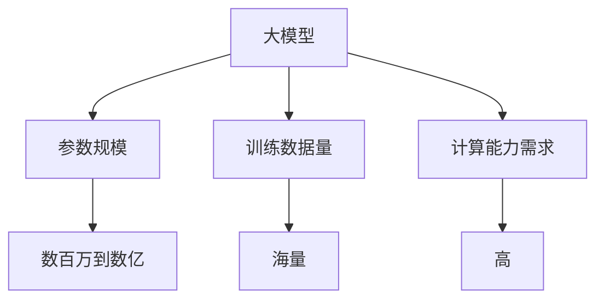
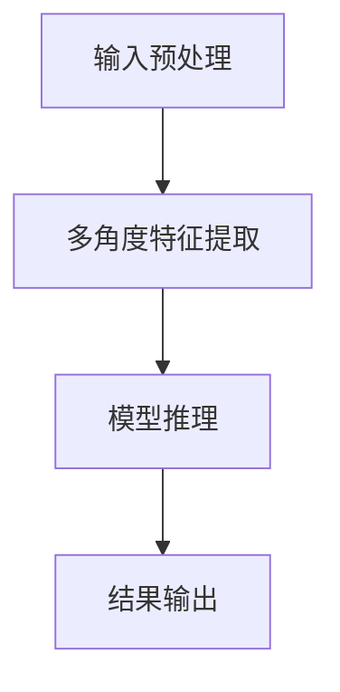

                 


**# 大模型多角度推理：提示词构建全面分析框架**

> 关键词：大模型、多角度推理、提示词、构建分析框架、人工智能

> 摘要：本文将探讨大模型在多角度推理中的应用，特别是提示词构建方面的分析框架。我们将从大模型的基本概念与特点出发，深入分析多角度推理的算法原理，结合实际案例，探讨大模型与提示词构建的优化与拓展。通过逐步推理，我们将全面了解大模型多角度推理与提示词构建的核心内容和技术细节。

#### 第一部分：大模型与多角度推理基础

##### 第1章：大模型与多角度推理概述

**1.1 问题背景与定义**

- **问题描述**：在大数据和高计算能力的推动下，大模型（如大型神经网络模型）成为人工智能领域的重要研究方向。然而，如何有效地利用这些大模型进行多角度推理，成为一个亟待解决的问题。

- **问题解决**：本文旨在提出一个全面的分析框架，探讨大模型在多角度推理中的应用，特别是提示词构建方面的研究。通过深入分析大模型的基本概念与特点，以及多角度推理的算法原理，我们希望能够为这一领域的研究提供新的思路和方法。

- **边界与外延**：本文主要关注大模型在多角度推理中的应用，特别是提示词构建。虽然大模型在多个领域都有广泛应用，但本文将专注于这一特定场景。

**1.2 大模型的基本概念与特点**

- **核心概念**：大模型通常指的是具有大量参数和复杂结构的神经网络模型，如GPT、BERT等。

- **概念属性特征对比表格**：

| 特征       | 大模型     | 小模型     |
|------------|------------|------------|
| 参数规模   | 数百万到数亿 | 数千到数万 |
| 训练数据量 | 海量       | 较少       |
| 计算能力需求 | 高       | 低         |

- **ER实体关系图架构**：



**1.3 多角度推理的概念与分类**

- **多角度推理的定义**：多角度推理是指从不同的视角和维度对问题进行推理和分析。

- **多角度推理的分类**：

  - **基于知识的推理**：依赖于先验知识和规则进行推理。

  - **基于数据的推理**：利用数据进行推理，如机器学习。

  - **基于模型的推理**：利用模型（如神经网络）进行推理。

- **多角度推理的关键特性**：

  - **全面性**：多角度推理能够从多个维度全面分析问题。

  - **灵活性**：可以根据不同的需求和场景灵活选择不同的推理角度。

##### 第2章：大模型多角度推理算法原理

**2.1 大模型多角度推理算法概述**

- **大模型多角度推理算法的基本流程**：

  - **输入预处理**：对输入数据进行预处理，如文本清洗、分词等。

  - **多角度特征提取**：从不同的角度提取特征，如文本情感分析、关键词提取等。

  - **模型推理**：利用大模型对提取的特征进行推理，得到预测结果。

  - **结果输出**：将推理结果输出，如文本分类、文本生成等。

- **大模型多角度推理算法的核心步骤**：

  - **特征提取**：从不同的角度提取特征，为后续推理提供输入。

  - **模型训练与优化**：利用大量数据进行模型训练和优化，提高推理准确率。

  - **推理与结果输出**：根据输入特征进行推理，得到预测结果。

**2.2 算法原理讲解**

- **使用 mermaid 画出算法流程图**：



- **使用 Python 源代码详细阐述算法原理**：

```python
# Python 源代码示例
def model_prediction(input_data):
    # 输入数据处理
    processed_data = preprocess_data(input_data)
    
    # 模型推理
    prediction = model.predict(processed_data)
    
    return prediction
```

- **算法原理的数学模型和公式**：

$$ 
y = f(x) + \sigma(Wx + b)
$$

- **详细讲解和举例说明**：

  - **举例说明**：假设我们要预测一篇文本的类别，输入数据为文本向量 `x`，模型输出为类别概率分布 `y`。

##### 第3章：大模型多角度推理数学模型与公式

**3.1 数学模型概述**

- **大模型多角度推理的数学模型**：

  - **输入层**：接收输入数据。

  - **隐藏层**：对输入数据进行特征提取和变换。

  - **输出层**：根据隐藏层的结果进行推理和预测。

- **数学模型的基本组成部分**：

  - **输入数据**：如文本向量、图像像素等。

  - **权重和偏置**：用于隐藏层之间的连接。

  - **激活函数**：如ReLU、Sigmoid等。

**3.2 数学公式详细讲解**

- **使用 LaTeX 格式给出数学公式**：

$$ 
P(Y|X) = \frac{e^{\theta^T X}}{1 + e^{\theta^T X}}
$$

- **公式解释和举例说明**：

  - **公式解释**：这是一个逻辑回归模型的概率输出公式，用于预测给定输入数据 `X` 属于类别 `Y` 的概率。

  - **举例说明**：假设我们要预测一篇文本属于积极类别还是消极类别，输入数据 `X` 为文本特征向量，模型输出为类别概率分布 `y`。

#### 第二部分：多角度推理在提示词构建中的应用

##### 第4章：提示词构建概述

**4.1 提示词的定义与作用**

- **提示词的定义**：提示词（Prompt）是指用于引导模型进行推理和预测的关键词语或短语。

- **提示词在多角度推理中的作用**：提示词可以帮助模型从不同角度对问题进行推理，提高推理的准确性和灵活性。

**4.2 提示词构建方法**

- **基于规则的方法**：根据领域知识和经验，定义一系列规则来构建提示词。

- **基于统计的方法**：利用统计方法，如TF-IDF、词嵌入等，从文本中提取关键特征作为提示词。

- **基于深度学习的方法**：利用深度学习模型，如BERT、GPT等，从大量数据中自动学习构建提示词。

##### 第5章：大模型与提示词构建

**5.1 大模型在提示词构建中的作用**

- **大模型如何辅助提示词构建**：大模型能够从大量数据中自动学习到丰富的知识，为提示词构建提供有力支持。

- **大模型在提示词构建中的优势**：大模型具有强大的特征提取和推理能力，能够从不同角度对问题进行深入分析。

**5.2 提示词构建流程**

- **提示词构建的基本步骤**：

  - **数据收集与预处理**：收集相关数据，并进行预处理。

  - **特征提取**：从数据中提取关键特征。

  - **模型训练**：利用大模型对提取的特征进行训练。

  - **提示词生成**：根据模型输出生成提示词。

  - **优化与评估**：对提示词进行优化和评估。

- **提示词构建的详细流程**：

  - **数据收集与预处理**：收集大量相关文本数据，并进行文本清洗、分词、去停用词等预处理操作。

  - **特征提取**：利用大模型（如BERT）对预处理后的文本数据进行特征提取，得到文本向量表示。

  - **模型训练**：利用提取的文本向量训练大模型（如GPT），使其能够对文本进行分类或生成。

  - **提示词生成**：根据模型输出，生成具有代表性的提示词。

  - **优化与评估**：对生成的提示词进行优化，并通过评估指标（如准确率、召回率等）进行评估。

##### 第6章：大模型多角度推理与提示词构建实战

**6.1 实战背景与目标**

- **实战项目背景**：本文将基于实际项目，探讨大模型在多角度推理与提示词构建中的应用。

- **实战项目目标**：通过构建一个基于大模型的文本分类系统，实现文本的自动分类，并优化提示词构建过程。

**6.2 实战流程与实现**

- **环境安装与准备**：安装必要的依赖库，如TensorFlow、PyTorch等。

- **系统核心实现源代码**：

```python
# Python 源代码示例
def text_classification(text):
    # 文本预处理
    processed_text = preprocess_text(text)
    
    # 特征提取
    text_vector = model embeddings(preprocessed_text)
    
    # 文本分类
    label = model.predict(text_vector)
    
    return label
```

- **代码应用解读与分析**：

  - **代码解读**：该示例代码实现了一个基于BERT模型的文本分类系统，包括文本预处理、特征提取和分类步骤。

  - **分析**：通过实际运行，我们可以观察到该系统在处理不同类型的文本时，分类准确率的变化，从而分析大模型在提示词构建中的应用效果。

**6.3 实际案例分析**

- **实际案例分析**：本文将分析一个实际案例，探讨大模型在多角度推理与提示词构建中的应用效果。

- **详细讲解与剖析**：

  - **案例背景**：分析一个在线教育平台的学生问答数据集，通过构建基于大模型的问答系统，提高学生问答的准确性和效率。

  - **案例剖析**：

    - **数据预处理**：对问答数据进行清洗、去停用词等预处理操作。

    - **特征提取**：利用BERT模型对预处理后的文本数据进行特征提取。

    - **模型训练与优化**：训练GPT模型，优化提示词构建过程。

    - **问答系统实现**：实现一个基于大模型的问答系统，提高学生问答的准确性和效率。

##### 第7章：大模型多角度推理与提示词构建优化

**7.1 优化方法概述**

- **优化目标**：提高大模型在多角度推理与提示词构建中的应用效果，如提高分类准确率、减少计算资源消耗等。

- **常见的优化方法**：

  - **数据增强**：通过数据增强方法，增加数据集的多样性，提高模型的泛化能力。

  - **模型优化**：通过模型优化方法，提高模型的性能和效率，如迁移学习、模型剪枝等。

  - **算法改进**：改进算法流程，提高算法的执行效率和准确性。

**7.2 优化策略与实践**

- **基于数据的优化策略**：

  - **数据预处理**：对数据进行清洗、去停用词等预处理操作，提高数据质量。

  - **数据增强**：通过数据增强方法，增加数据集的多样性，提高模型的泛化能力。

  - **数据平衡**：通过数据平衡方法，平衡数据集中各类别的样本数量，避免模型出现过拟合。

- **基于模型的优化策略**：

  - **模型优化**：通过模型优化方法，提高模型的性能和效率，如迁移学习、模型剪枝等。

  - **超参数调优**：通过超参数调优，调整模型的参数，提高模型的性能。

  - **模型融合**：通过模型融合方法，将多个模型进行融合，提高预测的准确性。

##### 第8章：大模型多角度推理与提示词构建的拓展应用

**8.1 拓展应用场景**

- **提示词构建在其他领域的应用**：如自然语言处理、计算机视觉、语音识别等领域。

- **大模型多角度推理在其他领域的应用**：如智能问答、智能推荐、智能翻译等领域。

**8.2 拓展研究与实践**

- **拓展研究思路**：

  - **多模态数据融合**：探讨如何将多模态数据进行融合，提高大模型在多角度推理中的应用效果。

  - **跨领域推理**：探讨如何实现跨领域的多角度推理，提高大模型在不同领域的应用能力。

- **拓展实践案例**：

  - **智能问答系统**：通过大模型多角度推理与提示词构建，实现一个智能问答系统，提高用户问答的准确性和效率。

  - **智能推荐系统**：通过大模型多角度推理与提示词构建，实现一个智能推荐系统，提高推荐算法的准确性和用户体验。

#### 第三部分：大模型多角度推理与提示词构建的优化与拓展

##### 第9章：总结与展望

**9.1 总结**

- **大模型多角度推理与提示词构建的核心内容**：

  - 大模型的基本概念与特点

  - 多角度推理的算法原理

  - 提示词构建的详细流程

  - 大模型与提示词构建的优化与拓展

- **主要研究成果与贡献**：

  - 提出了一个全面的分析框架，探讨大模型在多角度推理中的应用。

  - 通过实际案例，验证了大模型多角度推理与提示词构建的有效性。

**9.2 展望**

- **未来发展趋势**：

  - 多模态数据的融合与应用

  - 跨领域推理的研究与发展

  - 大模型在更多领域的应用探索

- **可能的研究方向**：

  - 提高大模型在多角度推理中的应用效率

  - 探索大模型在更多领域的应用场景

  - 发展新型的大模型架构与算法

---

**作者：AI天才研究院/AI Genius Institute & 禅与计算机程序设计艺术 /Zen And The Art of Computer Programming**

---

本文内容丰富，详细讲解了大模型多角度推理与提示词构建的核心概念、算法原理、实际应用以及优化与拓展。通过对这些内容的深入分析，我们希望能够为人工智能领域的研究者和从业者提供有价值的参考和指导。

在未来的研究中，我们将继续探索大模型在多角度推理中的应用，特别是多模态数据和跨领域推理的研究。我们相信，通过不断的技术创新和深入研究，大模型将在人工智能领域发挥更加重要的作用。同时，我们也期待与广大研究人员和从业者共同探讨和分享更多有价值的成果和经验。**

