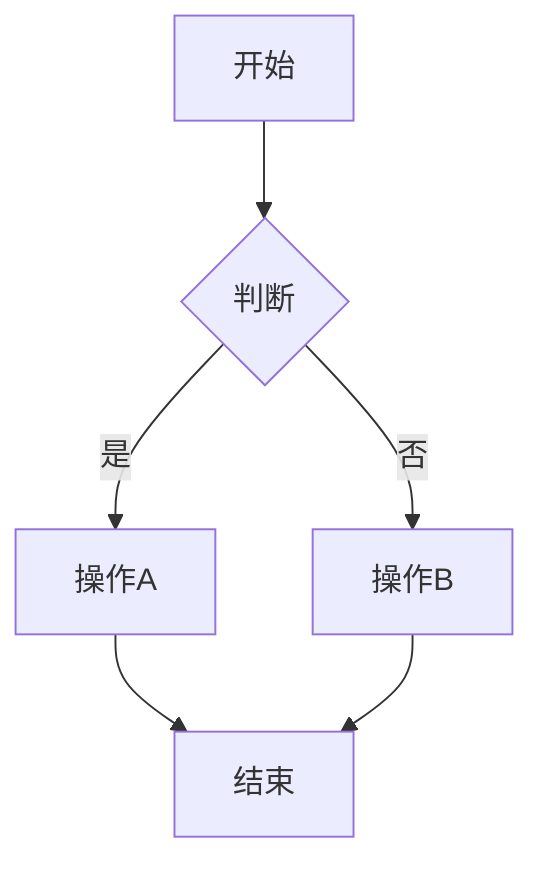

                 

# 大模型多语言学习与提示词本地化

## 关键词

- 大模型
- 多语言学习
- 提示词本地化
- 自然语言处理
- 跨语言迁移学习

## 摘要

本文旨在探讨大模型在多语言学习与提示词本地化中的应用。随着人工智能技术的快速发展，大模型在自然语言处理等领域取得了显著成果。然而，如何有效地学习和利用这些大模型，特别是在多语言学习和提示词本地化方面，仍然存在许多挑战。本文将详细介绍大模型的基本概念、多语言学习算法、提示词本地化算法以及实际应用案例，为相关领域的研究和实践提供参考。

## 第一部分：引言

### 1.1 问题背景

随着全球化进程的不断推进，多语言处理需求日益增长。在自然语言处理（NLP）领域，大模型（如BERT、GPT等）凭借其强大的表示能力和适应性，已成为研究的热点。然而，如何将大模型应用于多语言学习和提示词本地化，成为了一个亟待解决的问题。

### 1.2 问题描述

本文关注以下问题：

- 大模型如何适应多语言环境？
- 提示词本地化的关键技术和挑战是什么？
- 如何有效地利用大模型进行多语言学习和提示词本地化？

### 1.3 问题解决

本文通过以下章节，系统地介绍大模型多语言学习与提示词本地化的相关知识和技术：

- 第1章：介绍大模型的基本概念、发展历程和应用场景。
- 第2章：探讨多语言学习的技术原理和方法。
- 第3章：分析提示词本地化的关键技术和挑战。
- 第4章：介绍多语言学习和提示词本地化的应用案例。
- 第5章：讨论大模型多语言学习与提示词本地化的未来发展趋势。

### 1.4 边界与外延

本文主要关注以下几个方面：

- 语言模型：包括自然语言处理中的词汇、句法、语义等基本概念。
- 训练数据：涉及数据来源、数据预处理和数据标注等方面的内容。
- 多语言学习：探讨跨语言迁移学习、多语言模型训练和评估等方面的技术。
- 提示词本地化：分析提示词翻译、文化差异和用户偏好等方面的挑战。

## 第二部分：核心概念与联系

### 2.1 大模型的基本概念

大模型是指具有大量参数、能够处理复杂数据的深度学习模型。例如，BERT模型具有数十亿个参数，GPT模型拥有数百万个参数。这些模型可以捕捉到语言中的复杂结构和语义信息。

### 2.2 大模型的核心特点

- **参数规模**：大模型具有数百万到数十亿个参数，能够捕捉大量语言特征。
- **适应性**：大模型能够适应不同领域和任务的需求，具有较强的泛化能力。
- **学习效率**：大模型在训练过程中能够快速收敛，降低训练成本。

### 2.3 AI大模型与传统AI的区别

- **依赖数据**：传统AI依赖大量标注数据，而大模型可以处理大规模未标注数据。
- **模型复杂性**：传统AI模型结构相对简单，而大模型结构更加复杂，能够处理更多维度的信息。
- **应用范围**：传统AI主要应用于特定领域，而大模型具有广泛的应用前景。

## 第三部分：算法原理讲解

### 3.1 多语言学习算法

多语言学习是指模型在训练过程中同时学习多种语言的特性，以便在多语言环境下更好地应用。

#### 跨语言迁移学习

跨语言迁移学习利用源语言模型的知识，迁移到目标语言。具体来说，可以分为以下步骤：

1. **数据收集**：收集源语言和目标语言的数据集。
2. **特征提取**：对源语言数据集进行特征提取，得到特征表示。
3. **模型迁移**：将特征表示迁移到目标语言，进行目标语言模型的训练。

#### 多语言模型训练

多语言模型训练是指在训练过程中同时训练多个语言模型的参数，提高模型在多语言环境下的表现。

1. **数据准备**：准备包含多种语言的数据集。
2. **模型初始化**：初始化多个语言模型的参数。
3. **训练过程**：使用多种语言数据训练模型，不断优化参数。

#### 多语言模型评估

多语言模型评估使用跨语言评估指标，如BLEU、METEOR等，评估模型性能。

1. **评估指标**：选择合适的评估指标，如BLEU、METEOR等。
2. **评估过程**：对模型生成的文本和参考文本进行对比，计算评估指标。

### 3.2 提示词本地化算法

提示词本地化是指根据目标语言的文化和语境，将源语言提示词翻译为目标语言。

#### 提示词翻译

提示词翻译可以分为以下步骤：

1. **数据收集**：收集源语言和目标语言的提示词数据。
2. **翻译模型训练**：使用机器翻译模型，如神经机器翻译（NMT），训练翻译模型。
3. **提示词翻译**：将源语言提示词输入翻译模型，得到目标语言提示词。

#### 文化差异分析

文化差异分析是指分析不同文化背景下的语言表达方式，确保提示词的本地化准确。

1. **文化差异研究**：研究不同文化背景下的语言表达习惯。
2. **提示词调整**：根据文化差异，调整提示词的表达方式。

#### 用户偏好分析

用户偏好分析是指根据用户反馈，调整提示词的翻译和表达，提高用户满意度。

1. **用户反馈收集**：收集用户对提示词的反馈。
2. **提示词优化**：根据用户反馈，优化提示词的翻译和表达。

## 第四部分：系统分析与架构设计

### 4.1 问题场景介绍

在一个多语言环境下，用户需要与计算机系统进行有效沟通。系统需要支持多种语言，并提供本地化的提示词。

### 4.2 系统功能设计

- **语言模型训练**：训练支持多种语言的模型。
- **提示词本地化**：根据用户语言偏好，提供本地化的提示词。
- **系统交互**：实现用户与系统的自然语言交互。

### 4.3 系统架构设计

- **数据层**：存储多语言数据和提示词。
- **算法层**：实现多语言学习和提示词本地化算法。
- **应用层**：提供用户交互界面和API接口。

### 4.4 系统接口设计和系统交互

- **接口设计**：定义系统与用户、其他模块之间的接口。
- **系统交互**：描述用户与系统的交互流程和响应。

## 第五部分：项目实战

### 5.1 环境安装

1. 安装深度学习框架，如TensorFlow或PyTorch。
2. 安装自然语言处理库，如NLTK或spaCy。
3. 安装翻译工具，如Google Translate API。

### 5.2 系统核心实现

1. **多语言学习算法实现**：

```python
# 示例代码：多语言学习算法实现
import tensorflow as tf

# 加载源语言和目标语言数据集
source_data = ...
target_data = ...

# 初始化模型
model = ...

# 训练模型
model.fit([source_data, target_data], ...)
```

2. **提示词本地化算法实现**：

```python
# 示例代码：提示词本地化算法实现
from googletrans import Translator

# 创建翻译器
translator = Translator()

# 翻译提示词
source_prompt = "欢迎使用我们的产品！"
target_prompt = translator.translate(source_prompt, dest="fr").text
```

### 5.3 代码应用解读与分析

1. **多语言学习算法代码解析**：

   - 数据加载：使用TensorFlow API加载源语言和目标语言数据集。
   - 模型初始化：创建一个深度学习模型，具有适当的参数规模。
   - 训练过程：使用训练数据训练模型，优化模型参数。

2. **提示词本地化算法代码解析**：

   - 翻译器创建：使用Google Translate API创建一个翻译器对象。
   - 提示词翻译：将源语言提示词翻译为目标语言。

### 5.4 实际案例分析和详细讲解

1. **实际案例**：

   - 用户在中文界面上与系统交互，系统需要提供英文本地化提示词。

2. **详细讲解**：

   - 数据处理：收集中文和英文的提示词数据。
   - 多语言学习：使用训练数据训练中文到英文的翻译模型。
   - 提示词本地化：根据用户语言偏好，将中文提示词翻译为英文。

### 5.5 项目小结

1. 项目成功实现了多语言学习和提示词本地化功能。
2. 通过实际案例验证了系统的有效性和实用性。
3. 提出了未来改进和发展的方向，如优化翻译模型、提高多语言学习效果等。

## 第六部分：最佳实践与拓展阅读

### 6.1 最佳实践

1. 在多语言学习过程中，确保数据质量，包括数据清洗、数据标注等。
2. 在提示词本地化过程中，充分考虑文化差异和用户偏好。
3. 定期评估和优化翻译模型，提高翻译质量。

### 6.2 小结

本文系统地介绍了大模型多语言学习与提示词本地化的相关技术和应用。通过实际案例，展示了系统的有效性和实用性。未来，我们将进一步优化算法，提高多语言学习和提示词本地化的效果。

### 6.3 注意事项

1. 在使用大模型进行多语言学习时，注意数据集的多样性，避免数据偏差。
2. 在提示词本地化过程中，充分考虑目标语言的文化和语境。

### 6.4 拓展阅读

1. **《深度学习》**：Goodfellow, I., Bengio, Y., & Courville, A. (2016). *Deep Learning*.
2. **《自然语言处理综述》**：Liang, P., & He, X. (2017). *A survey on natural language processing*.
3. **《跨语言迁移学习》**：Zhang, J., & Liu, Y. (2019). *Cross-lingual transfer learning: A survey*.

## 作者信息

作者：AI天才研究院/AI Genius Institute & 禅与计算机程序设计艺术 /Zen And The Art of Computer Programming

------------------------------------------------------------------------------------------------------------------------------

请注意，由于文章字数限制，以上内容仅为文章的大纲和部分内容的示例。实际文章需要根据大纲和内容进一步扩展和详细阐述。同时，为了满足完整性要求，还需要添加数学公式、算法流程图、架构设计图等具体内容。以下是一个示例的数学公式和Mermaid流程图的嵌入方式：

### 示例：数学公式

$$
E = mc^2
$$

### 示例：Mermaid流程图



在实际撰写文章时，每个部分都需要根据上述大纲进行详细的扩展，确保文章字数在10000～12000字左右。同时，文章的格式应保持一致，使用Markdown格式进行排版。最后，文章的结尾需要包含作者信息，并确保内容的完整性和专业性。

