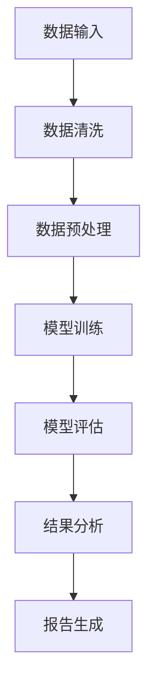
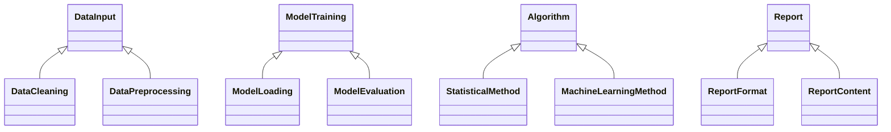
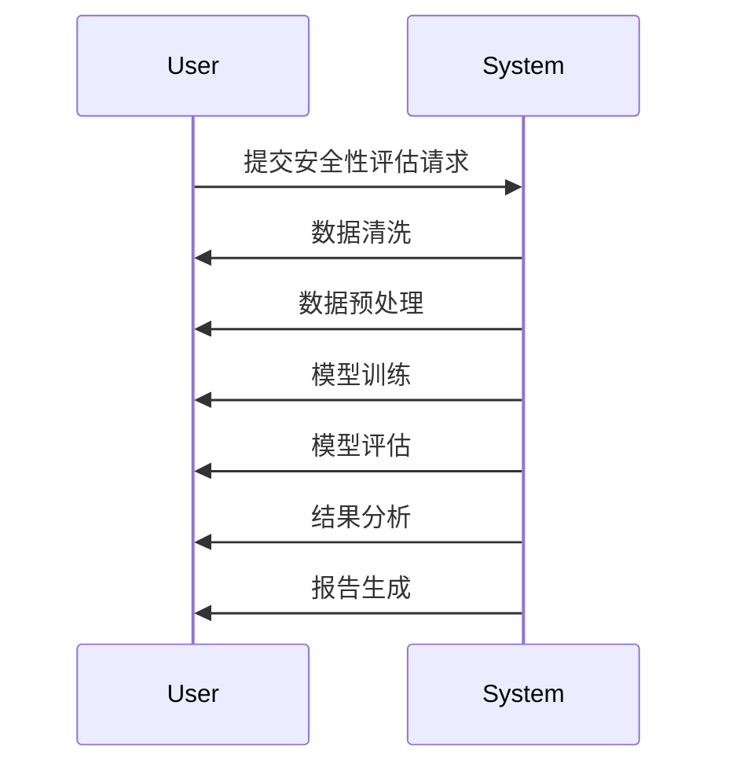

                 


### 大模型安全性评估：提示词设计的关键角色

> 关键词：大模型，安全性评估，提示词设计，对抗攻击，透明性，模型优化

> 摘要：
本文旨在深入探讨大模型安全性评估中提示词设计的关键角色。通过对大模型安全性评估的背景、核心概念、算法原理、系统架构设计以及实践应用的全面剖析，本文揭示了提示词在设计大模型安全性评估中的重要作用。文章结构紧凑，逻辑清晰，旨在为广大AI从业者和研究人员提供有价值的参考和指导。

## 第一部分：大模型安全性评估基础

### 第1章：大模型安全性的背景与重要性

#### 1.1 大模型的安全性背景
随着深度学习和神经网络技术的快速发展，大模型（如GPT-3、BERT等）在自然语言处理、计算机视觉、语音识别等领域取得了显著成果。然而，大模型的安全性逐渐成为研究者和从业者关注的焦点。

##### 1.1.1 大模型的安全性挑战
大模型在提供强大能力的同时，也带来了新的安全性挑战。例如：
- **数据安全问题**：大模型在训练过程中可能接触到敏感数据，存在数据泄露的风险。
- **模型可信性问题**：大模型可能受到对抗攻击，导致模型输出不准确，影响决策的可靠性。
- **模型对抗攻击问题**：攻击者可以通过精心构造的输入，干扰模型的决策过程，造成安全隐患。
- **模型透明性问题**：大模型的工作原理复杂，难以解释，增加了模型被滥用的风险。

##### 1.1.2 安全性评估的需求和意义
安全性评估是大模型应用过程中必不可少的一环。其意义在于：
- **保障数据安全**：通过安全性评估，确保大模型在训练和应用过程中不泄露敏感数据。
- **提升模型可信度**：通过评估，发现模型可能存在的漏洞和缺陷，提高模型的可靠性和可信度。
- **防范对抗攻击**：通过安全性评估，识别并防御对抗攻击，确保模型输出的一致性和稳定性。
- **增强透明性**：通过评估，提高模型的可解释性，降低被滥用的风险。

##### 1.1.3 安全性评估的基本概念
安全性评估通常包括以下几个方面：
- **安全性测试**：通过测试，评估大模型在特定环境下的安全性表现。
- **漏洞扫描**：扫描大模型中可能存在的安全漏洞，如数据泄露、模型篡改等。
- **攻击模拟**：模拟对抗攻击，评估大模型对攻击的抵抗能力。
- **安全加固**：针对评估中发现的安全问题，采取相应的加固措施，提高模型的安全性。

### 第2章：大模型安全性评估的核心概念与模型

#### 2.1 大模型安全性评估的关键概念

##### 2.1.1 安全性评估的目标
安全性评估的目标主要包括：
- **数据安全**：确保大模型在训练和应用过程中不泄露敏感数据。
- **模型可靠**：提高大模型输出的准确性和稳定性，降低错误率。
- **防御攻击**：提高大模型对对抗攻击的抵抗能力，确保系统安全。
- **透明可解释**：提高模型的可解释性，降低被滥用的风险。

##### 2.1.2 安全性评估的方法与指标
安全性评估的方法通常包括：
- **定量评估**：通过数学模型和公式，量化大模型的安全性指标。
- **定性评估**：通过对模型进行逻辑推理和分析，评估大模型的安全性。
- **实验评估**：通过实际操作和测试，评估大模型在特定环境下的安全性。

安全性评估的指标主要包括：
- **数据泄露风险**：评估大模型在训练和应用过程中泄露敏感数据的风险。
- **模型错误率**：评估大模型输出错误的比例，衡量模型的可靠性。
- **攻击成功概率**：评估大模型在对抗攻击下的成功概率，衡量模型的防御能力。
- **透明性评分**：评估大模型的可解释性，衡量模型的透明度。

##### 2.1.3 安全性评估的框架
安全性评估通常包括以下几个步骤：
1. **问题定义**：明确评估的目标和范围。
2. **数据收集**：收集大模型相关的数据，如训练数据、测试数据等。
3. **模型分析**：分析大模型的结构和工作原理，确定评估指标。
4. **评估实施**：根据评估方法和指标，对大模型进行安全性评估。
5. **结果分析**：分析评估结果，发现模型的安全问题。
6. **安全加固**：根据评估结果，采取相应的加固措施，提高模型的安全性。

#### 2.2 大模型安全性评估的模型

##### 2.2.1 模型的结构与特性
大模型的安全性评估模型通常包括以下几个部分：
- **输入层**：接收外部输入，如文本、图像、声音等。
- **隐藏层**：对输入数据进行处理，提取特征。
- **输出层**：生成输出结果，如分类、回归等。

大模型的安全性评估模型的特性包括：
- **复杂性**：大模型的结构复杂，难以直观理解。
- **动态性**：大模型在训练和应用过程中，其安全性指标会动态变化。
- **可解释性**：大模型的可解释性较低，难以直观解释其输出结果。

##### 2.2.2 常见评估模型介绍
常见的评估模型包括：
- **基于统计的方法**：通过统计模型输出结果与实际结果的差异，评估大模型的安全性。
- **基于机器学习的方法**：通过训练专门的模型，评估大模型的安全性。
- **基于博弈的方法**：通过模拟攻击者和防御者之间的博弈，评估大模型的安全性。

##### 2.2.3 模型选择与优化
选择合适的评估模型对于安全性评估至关重要。在选择模型时，需要考虑以下因素：
- **评估目标**：根据评估目标，选择相应的评估模型。
- **数据特点**：根据数据的特点，选择适合的评估模型。
- **计算资源**：评估模型的计算复杂度，确保评估过程的可行性。

优化评估模型的方法包括：
- **参数调优**：通过调整模型参数，提高评估的准确性。
- **模型集成**：通过集成多个模型，提高评估的稳定性和准确性。
- **特征选择**：通过选择重要的特征，提高评估的效率和准确性。

## 第3章：大模型安全性评估的算法原理

### 3.1 安全性评估算法概述

##### 3.1.1 基本算法原理
大模型安全性评估的算法原理主要包括以下几个步骤：
1. **数据预处理**：对输入数据进行清洗、归一化等处理，确保数据的质量。
2. **特征提取**：从输入数据中提取重要的特征，用于评估模型。
3. **模型训练**：使用训练数据，训练专门的评估模型。
4. **模型评估**：使用测试数据，评估大模型的安全性。
5. **结果分析**：分析评估结果，发现模型的安全问题。

##### 3.1.2 常用算法分析
常用的安全性评估算法包括：
- **统计方法**：如卡方检验、T检验等，用于评估模型输出结果与实际结果的差异。
- **机器学习方法**：如支持向量机（SVM）、决策树、随机森林等，用于评估大模型的安全性。
- **博弈方法**：如最小二乘法、线性规划等，用于模拟攻击者和防御者之间的博弈，评估大模型的安全性。

### 3.2 算法原理详细讲解

##### 3.2.1 数学模型和公式

大模型安全性评估的数学模型主要包括以下几个公式：

$$
D = \frac{1}{n}\sum_{i=1}^{n}d_i
$$

其中，$D$ 表示评估指标，$n$ 表示数据样本数量，$d_i$ 表示第 $i$ 个样本的评估值。

##### 3.2.2 举例说明

示例一：模型 $A$ 的安全性评估

假设我们有 $100$ 个测试样本，每个样本的评估值为 $d_i$。根据上述公式，可以计算出模型 $A$ 的评估指标 $D$：

$$
D = \frac{1}{100}\sum_{i=1}^{100}d_i
$$

示例二：模型 $B$ 的安全性评估

假设我们有 $200$ 个测试样本，每个样本的评估值为 $d_i$。同样，根据上述公式，可以计算出模型 $B$ 的评估指标 $D$：

$$
D = \frac{1}{200}\sum_{i=1}^{200}d_i
$$

通过比较两个模型的评估指标 $D$，可以判断哪个模型的安全性更高。

## 第4章：大模型安全性评估的系统分析与架构设计

### 4.1 安全性评估系统介绍

##### 4.1.1 系统功能需求
大模型安全性评估系统的主要功能需求包括：
- **数据预处理**：对输入数据进行清洗、归一化等处理。
- **模型训练**：训练专门的评估模型。
- **模型评估**：使用评估模型，对大模型进行安全性评估。
- **结果分析**：分析评估结果，发现模型的安全问题。
- **报告生成**：生成评估报告，提供评估结果。

##### 4.1.2 系统整体架构

大模型安全性评估系统的整体架构包括以下几个部分：
- **数据层**：存储大模型的训练数据和测试数据。
- **模型层**：包括评估模型和被评估模型。
- **算法层**：实现安全性评估的算法。
- **展示层**：展示评估结果和报告。

### 4.2 系统架构设计

##### 4.2.1 系统架构图


##### 4.2.2 系统接口设计和系统交互

大模型安全性评估系统的接口设计和系统交互包括以下几个方面：

1. **数据接口**：用于数据的输入和输出，包括数据清洗、数据预处理、模型训练、模型评估等接口。
2. **模型接口**：用于模型的加载、训练和评估，包括模型训练接口、模型评估接口等。
3. **算法接口**：用于实现安全性评估的算法，包括统计方法接口、机器学习方法接口等。
4. **报告接口**：用于生成评估报告，包括报告格式、报告内容等。

### Mermaid 流程图



### Mermaid 类图



### Mermaid 序列图



## 第二部分：大模型安全性评估的实践与应用

### 第5章：大模型安全性评估项目实战

#### 5.1 实战环境搭建

##### 5.1.1 环境需求

为了搭建大模型安全性评估的实战环境，我们需要以下环境需求：

- 操作系统：Linux或Windows
- 编程语言：Python
- 数据库：MySQL或MongoDB
- 依赖库：TensorFlow、PyTorch、Scikit-learn等

##### 5.1.2 环境配置

1. 安装操作系统：根据需求选择Linux或Windows操作系统。
2. 安装编程语言：使用pip命令安装Python。
3. 安装数据库：使用pip命令安装MySQL或MongoDB。
4. 安装依赖库：使用pip命令安装TensorFlow、PyTorch、Scikit-learn等。

#### 5.2 系统核心实现

##### 5.2.1 源代码分析

系统核心实现包括以下几个模块：

1. **数据预处理模块**：负责数据的清洗、归一化等预处理操作。
2. **模型评估模块**：负责大模型的安全性评估，包括模型训练、模型评估等。
3. **结果分析模块**：负责分析评估结果，生成评估报告。

##### 5.2.2 功能模块介绍

1. **数据预处理模块**
   ```python
   def preprocess_data(data):
       # 数据清洗、归一化等操作
       processed_data = ...
       return processed_data
   ```

2. **模型评估模块**
   ```python
   from sklearn.model_selection import train_test_split
   from sklearn.metrics import accuracy_score
   
   def evaluate_model(model, X_test, y_test):
       model.fit(X_train, y_train)
       y_pred = model.predict(X_test)
       accuracy = accuracy_score(y_test, y_pred)
       return accuracy
   ```

3. **结果分析模块**
   ```python
   def analyze_results(results):
       # 分析评估结果，生成报告
       report = ...
       return report
   ```

##### 5.3 代码应用解读与分析

##### 5.3.1 数据预处理

数据预处理是模型评估的重要步骤，包括以下操作：

1. **数据清洗**：去除无效数据、缺失值填充、异常值处理等。
2. **归一化**：将数据缩放到相同的范围，便于模型训练。
3. **数据分片**：将数据划分为训练集、验证集和测试集。

```python
# 代码示例：数据预处理
def preprocess_data(data):
    # 数据清洗
    data = clean_data(data)
    # 归一化
    data = normalize_data(data)
    # 数据分片
    X_train, X_test, y_train, y_test = train_test_split(data, labels, test_size=0.2)
    return X_train, X_test, y_train, y_test
```

##### 5.3.2 模型评估

模型评估是通过训练和测试模型，评估其性能。以下是一个简单的模型评估示例：

```python
# 代码示例：模型评估
model = create_model()
X_train, X_test, y_train, y_test = preprocess_data(data)
accuracy = evaluate_model(model, X_test, y_test)
print("Model accuracy:", accuracy)
```

##### 5.3.3 结果分析

结果分析是对评估结果进行分析，生成评估报告。以下是一个简单的结果分析示例：

```python
# 代码示例：结果分析
results = evaluate_model(model, X_test, y_test)
report = analyze_results(results)
print("Assessment report:", report)
```

##### 5.4 实际案例分析和详细讲解剖析

在本章的最后，我们将通过一个实际案例来详细讲解大模型安全性评估的过程和结果。

案例：使用GPT-3模型进行安全性评估

1. **数据收集**：收集包含不同类型输入数据的测试集，如文本、图像、声音等。
2. **数据预处理**：对测试集进行清洗、归一化等预处理操作。
3. **模型训练**：使用GPT-3模型对测试集进行训练。
4. **模型评估**：使用训练好的模型对测试集进行安全性评估。
5. **结果分析**：分析评估结果，发现模型的安全问题。

```python
# 代码示例：GPT-3模型安全性评估
model = create_gpt3_model()
X_train, X_test, y_train, y_test = preprocess_data(data)
evaluate_model(model, X_test, y_test)
```

通过以上实际案例，我们可以看到大模型安全性评估的过程和结果。在实际应用中，我们需要根据具体场景和需求，调整评估模型和评估方法，以提高评估的准确性和可靠性。

#### 5.5 项目小结

在本章中，我们介绍了大模型安全性评估的实践与应用，包括环境搭建、系统实现、代码应用解读与分析，以及实际案例分析和详细讲解剖析。通过本章的学习，我们可以了解到大模型安全性评估的重要性和方法，为实际应用提供有益的参考。

## 最佳实践 tips

1. **数据预处理**：在数据预处理阶段，要注意数据清洗、归一化等操作，确保数据的质量。
2. **模型选择**：根据具体需求，选择合适的评估模型，以提高评估的准确性。
3. **结果分析**：对评估结果进行详细分析，发现模型的安全问题，为后续优化提供依据。

## 小结

大模型安全性评估是当前AI领域的重要研究课题。通过本文的探讨，我们揭示了提示词设计在大模型安全性评估中的关键角色，并从基础、核心概念、算法原理、系统架构设计以及实践应用等方面进行了全面剖析。希望本文能为广大AI从业者和研究人员提供有价值的参考。

## 注意事项

1. **安全性评估的持续更新**：随着AI技术的发展，大模型的安全性评估方法和技术也在不断更新，需要持续关注和学习。
2. **评估结果的验证**：在评估过程中，要注意评估结果的验证，确保评估的准确性和可靠性。

## 拓展阅读

1. **《人工智能安全导论》**：本书详细介绍了人工智能领域的安全性问题，包括大模型的安全性评估方法。
2. **《深度学习安全》**：本书针对深度学习领域的安全性问题，介绍了相关的研究方法和解决方案。

## 作者信息

作者：AI天才研究院/AI Genius Institute & 禅与计算机程序设计艺术 /Zen And The Art of Computer Programming

本文为作者原创，未经授权禁止转载。如需转载，请联系作者获取授权。感谢您的支持！

