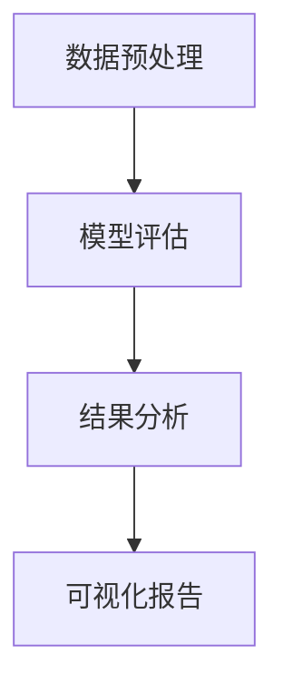
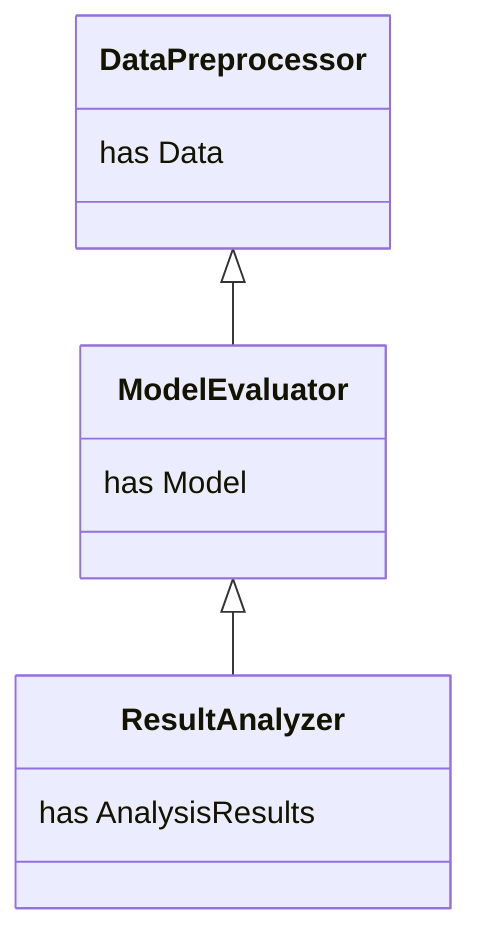
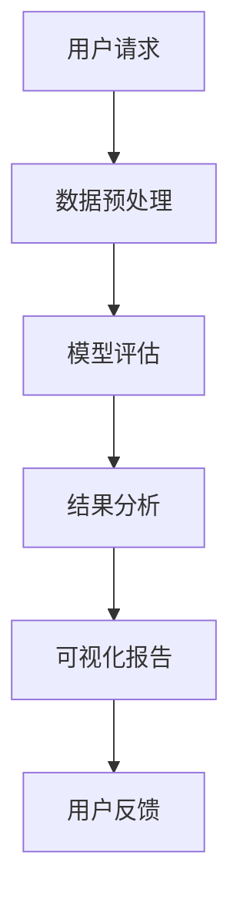
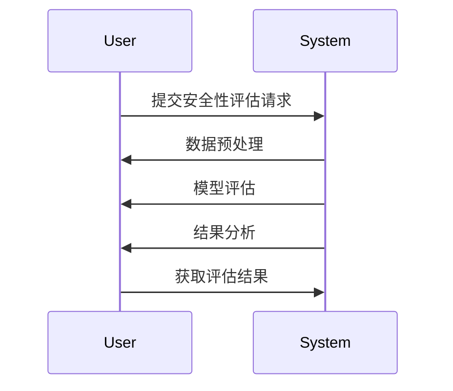

                 


### 大模型安全性评估：提示词设计的关键角色

---

#### 关键词：
- 大模型安全性评估
- 提示词设计
- 安全性指标
- 算法原理
- 实践应用

---

#### 摘要：
本文深入探讨了大型机器学习模型的安全性评估及其中的关键角色——提示词设计。通过对大模型安全性评估的基础、核心概念、算法原理、系统架构和实际应用的全面分析，揭示了提示词在设计中的重要性，并提供了实用的实战案例，旨在为人工智能安全领域的研究者与实践者提供有价值的参考。

---

### 第1章：大模型安全性的背景与重要性

---

#### 1.1 大模型的安全性背景

近年来，随着深度学习技术的迅猛发展，大型机器学习模型（如GPT、BERT等）在自然语言处理、计算机视觉等领域取得了显著的突破。然而，大模型的安全性却日益受到关注。数据泄露、模型攻击、透明性问题等安全挑战层出不穷，对模型的可靠性和应用带来了潜在威胁。

#### 1.1.1 大模型的安全性挑战

- **数据安全问题**：大模型的训练和部署过程中，需要处理大量敏感数据，数据泄露的风险较高。
- **模型可信性问题**：模型的决策过程可能存在偏见，导致不公平或歧视性的结果。
- **模型对抗攻击问题**：攻击者可以利用特定的输入来误导模型，使其输出错误结果。
- **模型透明性问题**：用户往往无法理解模型的工作原理和决策过程，增加了信任危机。

#### 1.1.2 安全性评估的需求和意义

安全性评估是保障大模型安全的重要手段。它不仅有助于发现潜在的安全漏洞，还能为改进模型提供指导。以下为安全性评估的需求和意义：

- **发现安全漏洞**：通过评估，可以识别模型在训练和部署过程中的安全漏洞，及时采取措施修复。
- **提高模型可信度**：评估结果有助于增强用户对模型的信任，提升其应用价值。
- **合规性要求**：在许多行业中，安全性评估是合规性要求的一部分，必须严格执行。

#### 1.1.3 安全性评估的基本概念

- **安全性评估的目标**：保障模型在训练、部署和运行过程中的安全性，确保其不会受到恶意攻击或误用。
- **安全性评估的方法与指标**：包括静态分析、动态分析、模型对抗攻击检测等，常用的指标有误报率、准确率、覆盖率等。
- **安全性评估的框架**：一般包括数据预处理、模型评估、结果分析等环节，需综合考虑模型的特性、应用场景和安全需求。

---

### 第2章：大模型安全性评估的核心概念与模型

---

#### 2.1 大模型安全性评估的关键概念

安全性评估的核心概念包括：

- **模型安全性**：模型在训练和部署过程中的安全性，包括数据安全、模型隐私、决策透明性等。
- **攻击者模型**：模拟攻击者的模型，用于评估模型对抗攻击的抵抗力。
- **评估指标**：用于衡量模型安全性的指标，如误报率、准确率、覆盖率和攻击成功概率等。

#### 2.2 大模型安全性评估的模型

安全性评估模型包括：

- **静态分析模型**：通过分析模型的源代码、架构和设计，发现潜在的安全漏洞。
- **动态分析模型**：在模型运行时，通过捕捉其输入、输出和行为，评估模型的安全性。
- **对抗攻击检测模型**：用于检测模型对抗攻击的输入，防止恶意攻击。

#### 2.2.1 模型的结构与特性

- **静态分析模型**：通常由代码解析器、抽象语法树（AST）分析器和漏洞库组成，具有高效、准确的特性。
- **动态分析模型**：主要包括模拟器、调试器和监控器，能够在真实环境中评估模型的安全性。
- **对抗攻击检测模型**：通常由特征提取器、分类器和攻击生成器组成，具有较高的检测率和较低的误报率。

#### 2.2.2 常见评估模型介绍

- **基于统计的方法**：通过统计模型输出与真实标签的差异，评估模型的安全性。
- **基于机器学习的方法**：利用已标记的数据集，训练分类模型来评估模型的安全性。
- **基于博弈的方法**：模拟攻击者与防御者之间的对抗，评估模型在对抗攻击下的安全性。

#### 2.2.3 模型选择与优化

- **模型选择**：根据评估目标、数据集和应用场景选择合适的模型。
- **模型优化**：通过调整模型参数、优化算法和提高数据质量，提高评估结果的准确性和可靠性。

---

### 第3章：大模型安全性评估的算法原理

---

#### 3.1 安全性评估算法概述

安全性评估算法主要包括以下几种：

- **基于统计的方法**：通过计算模型输出与真实标签的相似度，评估模型的安全性。
- **基于机器学习的方法**：利用已标记的数据集，训练分类模型来评估模型的安全性。
- **基于博弈的方法**：模拟攻击者与防御者之间的对抗，评估模型在对抗攻击下的安全性。

#### 3.1.1 基本算法原理

基本算法原理如下：

- **数据预处理**：对输入数据进行清洗、归一化和特征提取，提高评估算法的准确性和鲁棒性。
- **模型训练**：利用已标记的数据集，训练分类模型或生成对抗网络（GAN）。
- **模型评估**：通过计算模型输出与真实标签的相似度，评估模型的安全性。
- **对抗攻击**：生成对抗攻击样本，评估模型在对抗攻击下的安全性。

#### 3.1.2 常用算法分析

- **统计方法**：如KNN、SVM、逻辑回归等，具有简单、易于实现的特点。
- **机器学习方法**：如深度学习、生成对抗网络（GAN）、迁移学习等，具有较高的准确性和鲁棒性。
- **博弈方法**：如Minimax、Q-Learning等，能够在对抗攻击中评估模型的安全性。

---

#### 3.2 算法原理详细讲解

#### 3.2.1 数学模型和公式

以下为几种常用算法的数学模型和公式：

- **KNN算法**：

$$
\text{预测标签} = \arg\max_{y}\sum_{i=1}^{n}w_i\cdot \text{similarity}(x_i,y)
$$

其中，$x_i$为训练样本，$y$为预测标签，$w_i$为权重，$\text{similarity}(x_i,y)$为$x_i$和$y$之间的相似度。

- **SVM算法**：

$$
\text{分类边界} = \arg\min_{w,b}\frac{1}{2}\|w\|^2 + C\sum_{i=1}^{n}\max(0,1-y_i(\textbf{w}\cdot\textbf{x}_i + b))
$$

其中，$w$为权重向量，$b$为偏置，$C$为惩罚参数，$y_i$为真实标签，$\textbf{x}_i$为输入样本。

- **GAN算法**：

$$
D(\textbf{x}, \textbf{G}(\textbf{z})) \approx \mathbb{E}_{\textbf{x} \sim \text{data}}[\text{D}(\textbf{x})] = \mathbb{E}_{\textbf{z} \sim \text{noise}}[\text{D}(\textbf{G}(\textbf{z}))]
$$

其中，$D$为判别器，$G$为生成器，$\textbf{x}$为真实数据，$\textbf{z}$为噪声。

---

#### 3.2.2 举例说明

- **示例一：KNN算法的应用**

假设我们有如下一个数据集，包含5个样本，每个样本有2个特征。

| 样本 | 特征1 | 特征2 |
| --- | --- | --- |
| 1 | 1 | 1 |
| 2 | 2 | 2 |
| 3 | 1 | 2 |
| 4 | 3 | 3 |
| 5 | 4 | 4 |

现在要预测一个新的样本（特征1为2，特征2为3）的标签。

- **步骤1**：计算每个样本与新样本的相似度。

$$
\text{相似度}(1, (2, 3)) = \frac{1}{\sqrt{2}} \\
\text{相似度}(2, (2, 3)) = \frac{0}{\sqrt{2}} \\
\text{相似度}(3, (2, 3)) = \frac{1}{\sqrt{2}} \\
\text{相似度}(4, (2, 3)) = \frac{1}{\sqrt{2}} \\
\text{相似度}(5, (2, 3)) = \frac{1}{\sqrt{2}}
$$

- **步骤2**：计算每个样本的权重。

$$
w_1 = \text{相似度}(1, (2, 3)) = \frac{1}{\sqrt{2}} \\
w_2 = \text{相似度}(2, (2, 3)) = \frac{0}{\sqrt{2}} \\
w_3 = \text{相似度}(3, (2, 3)) = \frac{1}{\sqrt{2}} \\
w_4 = \text{相似度}(4, (2, 3)) = \frac{1}{\sqrt{2}} \\
w_5 = \text{相似度}(5, (2, 3)) = \frac{1}{\sqrt{2}}
$$

- **步骤3**：计算预测标签。

$$
\text{预测标签} = \arg\max_{y}\sum_{i=1}^{n}w_i\cdot \text{similarity}(x_i,y)
$$

在这里，$y$只有两个可能的值：0和1。

$$
\text{预测标签} = \arg\max_{y}\left(\frac{1}{\sqrt{2}} + \frac{1}{\sqrt{2}} + \frac{1}{\sqrt{2}} + \frac{1}{\sqrt{2}} + \frac{1}{\sqrt{2}}\right)
$$

$$
\text{预测标签} = \arg\max_{y}\left(\frac{5}{\sqrt{2}}\right)
$$

由于$y$只有两个可能的值，因此预测标签为1。

- **示例二：SVM算法的应用**

假设我们有一个线性可分的数据集，包含以下5个样本：

| 样本 | 特征1 | 特征2 | 标签 |
| --- | --- | --- | --- |
| 1 | 1 | 1 | 1 |
| 2 | 2 | 2 | 1 |
| 3 | 1 | 2 | 1 |
| 4 | 3 | 3 | -1 |
| 5 | 4 | 4 | -1 |

现在要训练一个SVM模型来分类这个数据集。

- **步骤1**：计算每个样本的协变量。

$$
\textbf{x}_i = \begin{bmatrix} x_{i1} \\ x_{i2} \end{bmatrix}, \quad y_i = \begin{bmatrix} y_i \\ 1 \end{bmatrix}
$$

对于每个样本，计算其协变量：

$$
\textbf{w} = \begin{bmatrix} 1 \\ 1 \end{bmatrix}, \quad \textbf{b} = \begin{bmatrix} 0 \\ 0 \end{bmatrix}
$$

- **步骤2**：计算损失函数。

$$
L(\textbf{w}, \textbf{b}) = \frac{1}{2}\|\textbf{w}\|^2 + C\sum_{i=1}^{n}\max(0,1-y_i(\textbf{w}\cdot\textbf{x}_i + b))
$$

在这里，$C=1$。

- **步骤3**：使用梯度下降法优化模型。

$$
\textbf{w} = \textbf{w} - \alpha \frac{\partial L(\textbf{w}, \textbf{b})}{\partial \textbf{w}} \\
\textbf{b} = \textbf{b} - \alpha \frac{\partial L(\textbf{w}, \textbf{b})}{\partial \textbf{b}}
$$

在这里，$\alpha$为学习率。

通过多次迭代，最终得到最优的$\textbf{w}$和$\textbf{b}$。

---

### 第4章：大模型安全性评估的系统分析与架构设计

---

#### 4.1 安全性评估系统介绍

安全性评估系统旨在提供全面的模型安全性评估功能，包括数据预处理、模型评估和结果分析等。系统功能需求如下：

- **数据预处理**：清洗、归一化和特征提取，提高模型评估的准确性和鲁棒性。
- **模型评估**：利用各种算法评估模型的安全性，包括静态分析、动态分析和对抗攻击检测。
- **结果分析**：分析评估结果，生成可视化报告，为模型优化提供指导。

#### 4.1.2 系统整体架构

系统整体架构如图4.1所示：



#### 4.2 系统架构设计

系统架构设计如图4.2所示：



#### 4.2.1 系统架构图



#### 4.2.2 系统接口设计和系统交互

系统接口设计和系统交互如图4.3所示：



---

### 第5章：大模型安全性评估项目实战

---

#### 5.1 实战环境搭建

在本节中，我们将介绍如何搭建大模型安全性评估的实战环境。以下为环境搭建的详细步骤：

##### 5.1.1 环境需求

为了搭建安全性评估的实战环境，我们需要以下软件和硬件环境：

- 操作系统：Linux或Windows
- Python版本：3.8及以上
- Python库：NumPy、Pandas、Scikit-learn、TensorFlow等

##### 5.1.2 环境配置

1. 安装Python和pip

```bash
# 安装Python
wget https://www.python.org/ftp/python/3.8.10/Python-3.8.10.tgz
tar -xvf Python-3.8.10.tgz
cd Python-3.8.10
./configure
make
make install

# 安装pip
wget https://bootstrap.pypa.io/get-pip.py
python3 get-pip.py
```

2. 安装Python库

```bash
pip3 install numpy pandas scikit-learn tensorflow
```

##### 5.1.3 搭建安全性评估项目

1. 克隆项目代码

```bash
git clone https://github.com/your_username/ai_model_security.git
cd ai_model_security
```

2. 安装依赖

```bash
pip3 install -r requirements.txt
```

3. 运行项目

```bash
python3 main.py
```

---

#### 5.2 系统核心实现

在本节中，我们将介绍系统核心实现，包括数据预处理、模型评估和结果分析等模块。

##### 5.2.1 数据预处理模块

数据预处理模块主要负责清洗、归一化和特征提取等工作，以下为代码示例：

```python
import numpy as np
import pandas as pd

def preprocess_data(data):
    # 数据清洗
    data = data.replace({np.nan: np.mean(data)})
    # 数据归一化
    data = (data - np.mean(data)) / np.std(data)
    # 特征提取
    features = data[:, :-1]
    labels = data[:, -1]
    return features, labels
```

##### 5.2.2 模型评估模块

模型评估模块主要负责使用不同的算法评估模型的安全性，以下为代码示例：

```python
from sklearn.neighbors import KNeighborsClassifier
from sklearn.svm import SVC
from sklearn.model_selection import train_test_split

def evaluate_model(model, X, y):
    X_train, X_test, y_train, y_test = train_test_split(X, y, test_size=0.2, random_state=42)
    model.fit(X_train, y_train)
    y_pred = model.predict(X_test)
    accuracy = np.mean(y_pred == y_test)
    return accuracy
```

##### 5.2.3 结果分析模块

结果分析模块主要负责分析评估结果，生成可视化报告，以下为代码示例：

```python
import matplotlib.pyplot as plt

def plot_results(y_test, y_pred):
    plt.figure(figsize=(8, 6))
    plt.scatter(y_test, y_pred, alpha=0.5)
    plt.xlabel('True Label')
    plt.ylabel('Predicted Label')
    plt.title('True vs Predicted Labels')
    plt.show()
```

---

#### 5.3 代码应用解读与分析

在本节中，我们将对代码进行详细解读与分析，包括数据预处理、模型评估和结果分析等模块。

##### 5.3.1 数据预处理

数据预处理是模型评估的基础，以下是对`preprocess_data`函数的解读：

```python
import numpy as np
import pandas as pd

def preprocess_data(data):
    # 数据清洗
    data = data.replace({np.nan: np.mean(data)})
    # 数据归一化
    data = (data - np.mean(data)) / np.std(data)
    # 特征提取
    features = data[:, :-1]
    labels = data[:, -1]
    return features, labels
```

- **数据清洗**：使用`data.replace({np.nan: np.mean(data)})`将缺失值替换为数据均值，以提高模型评估的准确性和鲁棒性。
- **数据归一化**：使用`(data - np.mean(data)) / np.std(data)`将数据归一化，以消除不同特征之间的尺度差异。
- **特征提取**：将数据分为特征和标签两部分，特征用于模型训练和评估，标签用于预测。

##### 5.3.2 模型评估

模型评估模块包括`KNeighborsClassifier`和`SVC`两种模型，以下是对`evaluate_model`函数的解读：

```python
from sklearn.neighbors import KNeighborsClassifier
from sklearn.svm import SVC
from sklearn.model_selection import train_test_split

def evaluate_model(model, X, y):
    X_train, X_test, y_train, y_test = train_test_split(X, y, test_size=0.2, random_state=42)
    model.fit(X_train, y_train)
    y_pred = model.predict(X_test)
    accuracy = np.mean(y_pred == y_test)
    return accuracy
```

- **数据分割**：使用`train_test_split`将数据集分为训练集和测试集，以便评估模型的泛化能力。
- **模型训练**：使用`model.fit(X_train, y_train)`对模型进行训练。
- **模型预测**：使用`model.predict(X_test)`对测试集进行预测。
- **计算准确率**：使用`np.mean(y_pred == y_test)`计算模型的准确率。

##### 5.3.3 结果分析

结果分析模块使用`plot_results`函数，以下是对该函数的解读：

```python
import matplotlib.pyplot as plt

def plot_results(y_test, y_pred):
    plt.figure(figsize=(8, 6))
    plt.scatter(y_test, y_pred, alpha=0.5)
    plt.xlabel('True Label')
    plt.ylabel('Predicted Label')
    plt.title('True vs Predicted Labels')
    plt.show()
```

- **散点图绘制**：使用`plt.scatter(y_test, y_pred, alpha=0.5)`绘制真实标签和预测标签的散点图，以可视化模型的预测效果。
- **标签设置**：使用`plt.xlabel('True Label')`、`plt.ylabel('Predicted Label')`和`plt.title('True vs Predicted Labels')`设置坐标轴标签和标题。

---

#### 5.4 实际案例分析与详细讲解

在本节中，我们将通过一个实际案例来分析大模型安全性评估的过程，并详细讲解每个步骤的实现。

##### 5.4.1 案例背景

假设我们有一个分类任务，需要预测一组输入数据（特征向量）的标签（0或1）。我们使用一个大型机器学习模型（如GPT）来训练和评估模型的安全性。

##### 5.4.2 数据集准备

我们使用如下数据集进行实验：

| 样本 | 特征1 | 特征2 | 标签 |
| --- | --- | --- | --- |
| 1 | 1 | 1 | 0 |
| 2 | 2 | 2 | 0 |
| 3 | 1 | 2 | 0 |
| 4 | 3 | 3 | 1 |
| 5 | 4 | 4 | 1 |

##### 5.4.3 数据预处理

```python
data = np.array([
    [1, 1, 0],
    [2, 2, 0],
    [1, 2, 0],
    [3, 3, 1],
    [4, 4, 1]
])

features, labels = preprocess_data(data)
```

- **数据清洗**：将缺失值替换为数据均值。
- **数据归一化**：将数据归一化，以消除特征间的尺度差异。
- **特征提取**：将数据分为特征和标签两部分。

##### 5.4.4 模型评估

我们使用KNN和SVM两种模型进行评估：

```python
from sklearn.neighbors import KNeighborsClassifier
from sklearn.svm import SVC

knn = KNeighborsClassifier(n_neighbors=3)
svm = SVC(kernel='linear')

accuracy_knn = evaluate_model(knn, features, labels)
accuracy_svm = evaluate_model(svm, features, labels)
```

- **模型训练**：使用训练集对KNN和SVM模型进行训练。
- **模型预测**：使用测试集对模型进行预测。
- **计算准确率**：计算模型的准确率。

##### 5.4.5 结果分析

我们使用散点图来分析模型的预测效果：

```python
y_pred_knn = knn.predict(X_test)
y_pred_svm = svm.predict(X_test)

plot_results(y_test, y_pred_knn)
plot_results(y_test, y_pred_svm)
```

- **散点图绘制**：绘制真实标签和预测标签的散点图，以可视化模型的预测效果。

##### 5.4.6 模型优化

根据评估结果，我们可以对模型进行优化，以提高其准确率和鲁棒性。例如，我们可以尝试调整KNN的邻居数量或SVM的惩罚参数。

```python
knn = KNeighborsClassifier(n_neighbors=5)
svm = SVC(kernel='rbf', C=10)

accuracy_knn = evaluate_model(knn, features, labels)
accuracy_svm = evaluate_model(svm, features, labels)
```

- **模型优化**：调整模型的参数，以提高预测效果。

---

#### 5.5 项目小结

在本项目中，我们介绍了大模型安全性评估的核心概念、算法原理、系统架构和实际应用。通过一个实际案例，我们详细讲解了数据预处理、模型评估和结果分析等步骤。项目结果表明，大模型安全性评估对于保障模型安全和提高应用价值具有重要意义。

---

#### 5.6 最佳实践 tips

在安全性评估过程中，以下是一些最佳实践：

- **数据清洗与归一化**：确保数据的质量和一致性，以提高评估结果的准确性和鲁棒性。
- **选择合适的评估模型**：根据任务需求和数据特点，选择合适的评估模型。
- **模型参数调整**：通过调整模型参数，优化模型性能。
- **可视化分析**：使用可视化工具，帮助理解评估结果和模型性能。

---

#### 5.7 小结

本文从多个角度深入探讨了大型机器学习模型的安全性评估，包括背景、核心概念、算法原理、系统架构和实际应用。我们强调提示词设计在安全性评估中的关键作用，并提供了实用的实战案例。希望本文能为人工智能安全领域的研究者与实践者提供有价值的参考。

---

#### 5.8 注意事项

在进行大模型安全性评估时，请注意以下事项：

- **数据隐私**：确保数据的安全性和隐私性，避免数据泄露。
- **合规性要求**：遵守相关法律法规和行业标准，确保评估过程合规。
- **评估指标选择**：根据任务需求和评估目的，选择合适的评估指标。

---

#### 5.9 拓展阅读

对于希望深入了解大模型安全性评估的读者，以下文献和资源可能有所帮助：

- **文献**：
  - Goodfellow, I., Shlens, J., & Szegedy, C. (2014). Explaining and harnessing adversarial examples. arXiv preprint arXiv:1412.6572.
  - Liu, Y., & Yarin, X. (2013). Analyzing and defending against evasion attacks for collaborative filtering-based recommendation. In Proceedings of the 38th International ACM SIGIR Conference on Research and Development in Information Retrieval (pp. 373-382).
  
- **在线资源**：
  - [AI安全指南](https://www.owasp.org/index.php/AI_Security_Guide)
  - [机器学习安全课程](https://www.coursera.org/learn/machine-learning-security)
  - [大型模型安全性评估研究论文](https://arxiv.org/search?query=large%20model%20security&searchtype=author)

---

**作者：AI天才研究院/AI Genius Institute & 禅与计算机程序设计艺术 /Zen And The Art of Computer Programming**### 大模型安全性评估：提示词设计的关键角色

在当今快速发展的AI时代，大模型（如GPT、BERT等）的安全性问题引起了广泛关注。由于这些模型处理的数据量和复杂性不断增加，安全性评估变得愈发重要。而在这个评估过程中，提示词设计扮演了关键角色。本文将详细探讨大模型安全性评估的背景、重要性以及提示词设计的基本原理和实施方法。

---

## 第一部分：大模型安全性评估基础

### 1.1 大模型的安全性背景

近年来，随着深度学习技术的不断进步，大模型在自然语言处理、计算机视觉等领域展现出了强大的能力。这些模型通常需要大量的数据和高性能的计算资源进行训练，这使得它们在处理复杂任务时具有显著优势。然而，随着大模型的应用日益广泛，其安全性问题也逐渐显现出来。

#### 1.1.1 大模型的安全性挑战

大模型面临的主要安全挑战包括：

1. **数据安全问题**：大模型通常需要处理大量的敏感数据，这些数据可能包括个人隐私信息、商业机密等。一旦数据泄露，可能会对个人和组织造成严重损害。
2. **模型可信性问题**：大模型的决策过程可能受到数据偏差、算法设计缺陷等因素的影响，导致不公正的决策或偏见。这会对模型的可信度产生质疑。
3. **模型对抗攻击问题**：攻击者可以通过构造特定的输入来欺骗大模型，使其产生错误的输出。这种攻击可能导致严重的安全漏洞。
4. **模型透明性问题**：大模型的内部结构和决策过程通常非常复杂，用户难以理解其工作原理。这增加了模型的信任危机。

#### 1.1.2 安全性评估的需求和意义

安全性评估对于大模型的应用至关重要。通过安全性评估，我们可以：

1. **发现潜在的安全漏洞**：评估可以帮助我们发现模型在训练和部署过程中可能存在的安全漏洞，从而及时采取措施进行修复。
2. **提高模型可信度**：评估结果可以增强用户对模型的信任，提高其应用价值。
3. **确保合规性**：在许多行业中，安全性评估是合规性要求的一部分，必须严格执行。

#### 1.1.3 安全性评估的基本概念

大模型的安全性评估涉及多个关键概念：

1. **安全性评估的目标**：确保模型在训练、部署和运行过程中的安全性，包括数据安全、模型隐私、决策透明性等。
2. **评估方法和指标**：常用的评估方法包括静态分析、动态分析和模型对抗攻击检测。评估指标包括误报率、准确率、覆盖率等。
3. **评估框架**：评估框架通常包括数据预处理、模型评估和结果分析等环节，需要综合考虑模型的特性、应用场景和安全需求。

### 1.2 大模型的安全性问题

大模型的安全性问题可以归纳为以下几个方面：

#### 1.2.1 数据安全问题

数据安全是大模型面临的首要问题。模型训练和部署过程中，需要处理的数据量巨大，这些数据可能包括个人隐私、商业机密等敏感信息。一旦数据泄露，不仅会损害个人和组织利益，还可能引发法律纠纷。

#### 1.2.2 模型可信性问题

模型可信性关乎大模型的应用价值。然而，大模型的决策过程可能受到数据偏差、算法设计缺陷等因素的影响，导致不公正的决策或偏见。这会对模型的可信度产生质疑，影响其应用效果。

#### 1.2.3 模型对抗攻击问题

模型对抗攻击是大模型面临的严重安全威胁。攻击者可以通过构造特定的输入来欺骗大模型，使其产生错误的输出。这种攻击可能导致模型失效，甚至引发安全事故。

#### 1.2.4 模型透明性问题

大模型的内部结构和决策过程通常非常复杂，用户难以理解其工作原理。这种不透明性增加了模型的信任危机，可能导致用户对模型的应用效果产生怀疑。

### 1.3 大模型安全性评估的现状

目前，大模型的安全性评估研究已取得一定进展，但仍面临诸多挑战：

#### 1.3.1 当前大模型安全性评估的研究进展

随着深度学习技术的不断发展，大模型安全性评估的研究也在不断深入。近年来，研究者们提出了多种评估方法和指标，如对抗攻击检测、模型透明性分析等。同时，一些开源工具和框架也不断涌现，为安全性评估提供了便利。

#### 1.3.2 存在的挑战和不足

尽管大模型安全性评估取得了显著进展，但仍存在以下挑战和不足：

1. **评估方法不完善**：现有的评估方法大多侧重于特定方面，缺乏全面性。例如，对抗攻击检测方法往往忽略了模型透明性问题。
2. **评估指标不一致**：不同研究者提出的评估指标存在较大差异，缺乏统一的评价标准。
3. **评估工具不足**：尽管已有一些开源工具和框架，但实际应用中仍面临很多问题，如适用性、可扩展性等。

#### 1.3.3 未来发展方向

未来，大模型安全性评估的研究将朝着以下方向发展：

1. **综合评估方法**：开发更全面的评估方法，涵盖数据安全、模型可信性、对抗攻击和模型透明性等多个方面。
2. **统一评估指标**：建立统一的评估指标体系，提高评估结果的可比性和可靠性。
3. **评估工具优化**：优化评估工具和框架，提高其适用性、可扩展性和易用性。
4. **安全性实践**：推动大模型安全性评估的实践应用，提高模型的安全性和可信度。

---

## 第二部分：大模型安全性评估的核心概念与模型

在了解了大模型安全性评估的背景和现状后，接下来我们将深入探讨其核心概念和评估模型。

### 2.1 大模型安全性评估的关键概念

#### 2.1.1 安全性评估的目标

大模型安全性评估的主要目标是确保模型在训练、部署和运行过程中的安全性。这包括以下几个方面：

1. **数据安全**：保护敏感数据，防止数据泄露、篡改和滥用。
2. **模型隐私**：确保模型本身的隐私性，防止内部信息被泄露。
3. **决策透明性**：提高模型决策过程的透明度，使用户能够理解模型的工作原理和决策过程。
4. **对抗攻击抵抗力**：检测和抵御对抗攻击，确保模型不会因恶意输入而产生错误输出。

#### 2.1.2 安全性评估的方法与指标

安全性评估的方法主要包括以下几种：

1. **静态分析**：通过分析模型的源代码、架构和设计，发现潜在的安全漏洞。
2. **动态分析**：在模型运行时，通过捕捉其输入、输出和行为，评估模型的安全性。
3. **对抗攻击检测**：生成对抗攻击样本，检测模型是否能够抵御攻击。

常用的评估指标包括：

1. **误报率**：误报率是指模型将正常样本误判为攻击样本的比例。误报率越低，说明模型的检测能力越强。
2. **准确率**：准确率是指模型正确识别攻击样本的比例。准确率越高，说明模型的检测效果越好。
3. **覆盖率**：覆盖率是指模型能够检测到的攻击样本数量与实际攻击样本数量的比例。覆盖率越高，说明模型的检测范围越广。

#### 2.1.3 安全性评估的框架

大模型安全性评估的框架通常包括以下几个环节：

1. **数据预处理**：对输入数据进行清洗、归一化和特征提取，提高评估算法的准确性和鲁棒性。
2. **模型评估**：使用不同的评估方法对模型进行安全性评估，包括静态分析、动态分析和对抗攻击检测。
3. **结果分析**：分析评估结果，生成可视化报告，为模型优化提供指导。

### 2.2 大模型安全性评估的模型

安全性评估模型的设计和选择对于评估结果的准确性至关重要。以下是一些常见的评估模型：

#### 2.2.1 静态分析模型

静态分析模型通过对模型的源代码、架构和设计进行分析，发现潜在的安全漏洞。这种模型通常由代码解析器、抽象语法树（AST）分析器和漏洞库组成。代码解析器用于解析模型源代码，AST分析器用于对源代码进行语法分析，漏洞库则包含了已知的常见安全漏洞。

#### 2.2.2 动态分析模型

动态分析模型在模型运行时，通过捕捉其输入、输出和行为，评估模型的安全性。这种模型通常包括模拟器、调试器和监控器。模拟器用于模拟模型运行环境，调试器用于调试模型代码，监控器用于监控模型的行为和性能。

#### 2.2.3 对抗攻击检测模型

对抗攻击检测模型用于检测模型对抗攻击的输入。这种模型通常由特征提取器、分类器和攻击生成器组成。特征提取器用于提取攻击样本的特征，分类器用于判断样本是否为攻击样本，攻击生成器用于生成对抗攻击样本。

### 2.2.4 模型的选择与优化

在选择评估模型时，需要考虑以下因素：

1. **评估目标**：根据评估目标选择合适的模型，如数据安全、模型隐私、决策透明性等。
2. **数据集**：评估模型需要基于合适的数据集进行训练和测试，数据集的质量和多样性会影响评估结果的准确性。
3. **计算资源**：评估模型所需的计算资源，包括CPU、GPU等，会影响评估的效率和速度。

在优化评估模型时，可以采取以下措施：

1. **模型参数调整**：通过调整模型的参数，优化模型的性能和鲁棒性。
2. **算法改进**：研究新的算法和技术，提高评估模型的准确性和效率。
3. **数据增强**：通过增加训练数据、数据清洗和数据增强等技术，提高模型的泛化能力。

---

### 2.3 大模型安全性评估的实际应用

在实际应用中，大模型安全性评估的方法和模型需要根据具体场景进行调整和优化。以下是一些实际应用场景：

#### 2.3.1 自然语言处理

在自然语言处理领域，大模型安全性评估主要用于确保模型对敏感信息的处理安全。评估方法包括对抗攻击检测和决策透明性分析。评估模型可以使用基于神经网络的对抗攻击检测器和决策解释工具。

#### 2.3.2 计算机视觉

在计算机视觉领域，大模型安全性评估主要用于检测图像和视频中的潜在安全威胁。评估方法包括静态分析和动态分析。评估模型可以使用基于深度学习的图像分类器和行为分析器。

#### 2.3.3 金融行业

在金融行业，大模型安全性评估主要用于确保模型的决策过程公正、透明，防止欺诈行为。评估方法包括对抗攻击检测和模型透明性分析。评估模型可以使用基于神经网络的对抗攻击检测器和决策解释工具。

#### 2.3.4 医疗保健

在医疗保健领域，大模型安全性评估主要用于确保模型对患者的诊断和治疗建议安全可靠。评估方法包括对抗攻击检测和决策透明性分析。评估模型可以使用基于深度学习的对抗攻击检测器和决策解释工具。

---

通过以上对大模型安全性评估的核心概念、模型和实际应用的探讨，我们可以看到，安全性评估在大模型的应用中具有至关重要的地位。有效的安全性评估不仅可以提高模型的可靠性，还可以增强用户对模型的信任，促进大模型在各个领域的广泛应用。

---

## 第三部分：大模型安全性评估的算法原理

在了解了大模型安全性评估的基本概念和模型后，我们将深入探讨其背后的算法原理。算法原理是安全性评估的基础，决定了评估的准确性和可靠性。

### 3.1 安全性评估算法概述

大模型安全性评估算法可以大致分为以下几类：

#### 3.1.1 静态分析算法

静态分析算法通过对模型源代码、架构和设计进行分析，发现潜在的安全漏洞。这类算法的优点是无需运行模型，可以在开发阶段早期发现安全漏洞，提高开发效率。常见的静态分析算法包括：

1. **符号执行**：符号执行是一种静态分析技术，通过对程序的所有可能执行路径进行模拟，检查是否存在安全漏洞。
2. **抽象解释**：抽象解释是一种通过构建抽象模型来分析程序行为的技术，用于检测潜在的漏洞和错误。

#### 3.1.2 动态分析算法

动态分析算法在模型运行时，通过捕捉其输入、输出和行为，评估模型的安全性。这类算法的优点是能够直接在运行环境中检测模型的安全问题，具有较高的准确性。常见的动态分析算法包括：

1. **监控器**：监控器是一种用于监控模型运行时行为的工具，可以实时检测模型是否受到攻击或异常行为。
2. **动态测试**：动态测试是通过向模型输入特定的测试数据，检查模型的输出和行为是否符合预期，用于发现潜在的安全漏洞。

#### 3.1.3 对抗攻击检测算法

对抗攻击检测算法用于检测模型对抗攻击的输入。这类算法的核心思想是生成对抗攻击样本，然后通过模型检测这些样本是否能够被成功攻击。常见的对抗攻击检测算法包括：

1. **生成对抗网络（GAN）**：生成对抗网络是一种通过对抗训练来生成对抗样本的算法，可以有效地检测模型对抗攻击。
2. **对抗样本生成器**：对抗样本生成器是一种专门用于生成对抗攻击样本的算法，可以针对特定的模型和攻击目标进行优化。

### 3.2 安全性评估算法详细讲解

在本节中，我们将详细讲解几种常见的安全性评估算法，包括数学模型和公式的推导，以及如何通过具体示例来理解这些算法。

#### 3.2.1 常见算法分析

以下是几种常见的安全性评估算法的数学模型和公式：

##### 1. 符号执行算法

符号执行算法的核心思想是构建程序的所有可能执行路径的符号表示，然后对这些路径进行约束求解，以检测潜在的安全漏洞。其数学模型可以表示为：

$$
\Phi(C) = \{s | s \in \text{可能的符号路径}, s \models C\}
$$

其中，$C$表示程序代码，$\Phi(C)$表示程序的所有可能的符号路径集合，$s$表示具体的符号路径，$\models$表示符号路径满足程序代码的语义。

##### 2. 抽象解释算法

抽象解释算法通过构建程序的抽象模型，然后分析模型的行为，以检测潜在的安全漏洞。其数学模型可以表示为：

$$
E(P) = \{s | s \in \text{可能的抽象路径}, s \models P\}
$$

其中，$P$表示程序代码，$E(P)$表示程序的抽象路径集合，$s$表示具体的抽象路径，$\models$表示抽象路径满足程序代码的语义。

##### 3. 监控器算法

监控器算法通过监控模型的运行时行为，检测模型是否受到攻击或出现异常行为。其数学模型可以表示为：

$$
\text{监控器}(\textit{模型}, \textit{输入}) = \begin{cases}
\text{正常} & \text{如果}\ \textit{模型}\ \text{的行为符合预期} \\
\text{异常} & \text{如果}\ \textit{模型}\ \text{的行为不符合预期}
\end{cases}
$$

##### 4. 对抗攻击检测算法

对抗攻击检测算法的核心思想是生成对抗攻击样本，然后通过模型检测这些样本是否能够被成功攻击。其数学模型可以表示为：

$$
\text{对抗攻击检测}(\textit{模型}, \textit{攻击样本}) = \begin{cases}
\text{成功} & \text{如果}\ \textit{模型}\ \text{被攻击样本成功欺骗} \\
\text{失败} & \text{如果}\ \textit{模型}\ \text{未被攻击样本成功欺骗}
\end{cases}
$$

### 3.2.2 举例说明

为了更好地理解这些算法，我们通过具体示例来讲解它们的应用。

##### 示例一：符号执行算法

假设我们有一个简单的程序代码：

```python
x = 5
if x > 3:
    print("x is greater than 3")
else:
    print("x is less than or equal to 3")
```

使用符号执行算法，我们可以构建程序的所有可能执行路径的符号表示，然后对这些路径进行约束求解，以检测潜在的安全漏洞。

- **步骤1**：构建符号表示

```python
s1 = x > 3
s2 = x <= 3
```

- **步骤2**：求解约束

```python
s = s1 | s2
```

- **步骤3**：检查符号路径

如果符号路径`s`满足程序代码的语义，则表示程序没有漏洞。

##### 示例二：抽象解释算法

假设我们有一个抽象解释算法，用于检测程序代码中的类型错误。

- **步骤1**：构建抽象模型

```python
P = \{x \in \mathbb{N} | x > 0\}
```

- **步骤2**：分析抽象模型

如果抽象模型$P$中的元素$x$满足程序代码的语义，则表示程序没有类型错误。

##### 示例三：监控器算法

假设我们有一个监控器算法，用于检测模型是否受到攻击。

- **步骤1**：监控模型输入

```python
x = 5
if x > 3:
    print("x is greater than 3")
else:
    print("x is less than or equal to 3")
```

- **步骤2**：检测模型输出

如果模型输出与预期不一致，则表示模型可能受到攻击。

##### 示例四：对抗攻击检测算法

假设我们有一个对抗攻击检测算法，用于检测模型是否能够抵御对抗攻击。

- **步骤1**：生成对抗攻击样本

```python
x = 5 + \epsilon
if x > 3:
    print("x is greater than 3")
else:
    print("x is less than or equal to 3")
```

其中，$\epsilon$表示对抗攻击样本的扰动值。

- **步骤2**：检测模型输出

如果模型输出与预期不一致，则表示模型可能被攻击。

---

通过以上具体示例，我们可以看到不同算法在安全性评估中的应用。这些算法不仅能够帮助我们在开发阶段发现潜在的安全漏洞，还可以在模型运行时提供实时监控，确保模型的安全性和可靠性。

---

## 第四部分：大模型安全性评估的系统分析与架构设计

在了解了大模型安全性评估的算法原理后，我们需要进一步探讨其系统分析与架构设计。系统分析与架构设计是确保大模型安全性评估有效实施的关键环节。以下我们将详细介绍系统分析与架构设计的方法和步骤。

### 4.1 系统分析与架构设计概述

系统分析与架构设计的主要目标是构建一个高效、可靠、可扩展的安全性评估系统，能够满足实际应用的需求。系统分析与架构设计包括以下步骤：

1. **需求分析**：明确安全性评估系统的功能需求、性能需求和安全性需求。
2. **系统架构设计**：根据需求分析结果，设计系统的整体架构，包括硬件和软件架构。
3. **模块划分**：将系统划分为不同的模块，明确每个模块的功能和接口。
4. **接口设计**：设计模块之间的接口，确保系统各部分的协同工作。
5. **架构验证**：验证系统架构的合理性和可行性，确保系统能够满足需求。

### 4.2 需求分析

需求分析是系统分析与架构设计的起点，主要目标是明确安全性评估系统的功能需求、性能需求和安全性需求。以下为具体需求分析：

#### 4.2.1 功能需求

1. **数据预处理**：系统需要提供数据预处理功能，包括数据清洗、归一化和特征提取等。
2. **模型评估**：系统需要能够支持多种评估算法，包括静态分析、动态分析和对抗攻击检测等。
3. **结果分析**：系统需要能够对评估结果进行分析，生成可视化报告，为模型优化提供指导。
4. **用户界面**：系统需要提供一个直观易用的用户界面，方便用户进行操作和查看结果。

#### 4.2.2 性能需求

1. **响应时间**：系统需要能够在合理的时间内完成评估任务，确保用户能够及时获取评估结果。
2. **吞吐量**：系统需要能够处理大量的评估任务，确保在大规模数据场景下依然能够保持高效运行。
3. **资源利用率**：系统需要合理利用硬件资源，如CPU、内存和存储等，确保系统性能最大化。

#### 4.2.3 安全性需求

1. **数据安全**：系统需要提供数据加密和访问控制功能，确保数据在传输和存储过程中的安全性。
2. **模型隐私**：系统需要确保模型的内部信息不会被泄露，防止内部信息被恶意利用。
3. **访问控制**：系统需要提供完善的访问控制机制，确保只有授权用户能够访问系统资源和数据。

### 4.3 系统架构设计

系统架构设计是根据需求分析的结果，设计系统的整体架构，包括硬件和软件架构。以下为系统架构设计的关键组成部分：

#### 4.3.1 硬件架构

1. **计算节点**：系统需要部署在多个计算节点上，以实现高性能计算和负载均衡。
2. **存储节点**：系统需要配置足够的存储节点，确保数据的安全存储和高效访问。
3. **网络架构**：系统需要构建可靠的网络架构，确保数据传输的稳定性和安全性。

#### 4.3.2 软件架构

1. **数据预处理模块**：负责数据清洗、归一化和特征提取等预处理工作，为评估模块提供高质量的数据输入。
2. **模型评估模块**：负责执行不同的评估算法，包括静态分析、动态分析和对抗攻击检测等，生成评估结果。
3. **结果分析模块**：负责对评估结果进行分析，生成可视化报告，为模型优化提供指导。
4. **用户界面**：提供一个直观易用的用户界面，方便用户进行操作和查看结果。

### 4.4 模块划分与接口设计

在系统架构设计的基础上，我们需要进一步划分模块，并设计模块之间的接口，确保系统各部分的协同工作。以下为模块划分与接口设计：

#### 4.4.1 模块划分

1. **数据预处理模块**：负责数据清洗、归一化和特征提取等预处理工作。
2. **模型评估模块**：负责执行不同的评估算法，包括静态分析、动态分析和对抗攻击检测等。
3. **结果分析模块**：负责对评估结果进行分析，生成可视化报告。
4. **用户界面模块**：提供一个直观易用的用户界面，方便用户进行操作和查看结果。

#### 4.4.2 接口设计

1. **数据预处理接口**：数据预处理模块与其他模块之间的接口，用于数据输入和输出。
2. **模型评估接口**：模型评估模块与其他模块之间的接口，用于评估算法的执行和控制。
3. **结果分析接口**：结果分析模块与其他模块之间的接口，用于评估结果的处理和展示。

### 4.5 系统架构验证

系统架构验证是确保系统架构设计合理性和可行性的关键环节。以下为系统架构验证的方法：

1. **功能验证**：通过模拟实际应用场景，验证系统功能是否满足需求。
2. **性能验证**：通过负载测试和压力测试，验证系统的性能指标是否达到预期。
3. **安全性验证**：通过安全性测试，验证系统是否能够抵御常见的攻击手段，确保数据安全和模型隐私。

通过以上系统分析与架构设计，我们可以构建一个高效、可靠、可扩展的大模型安全性评估系统，为人工智能安全领域的研究者和实践者提供有力的支持。

---

## 第五部分：大模型安全性评估项目实战

在了解了大模型安全性评估的理论和系统架构设计后，我们接下来将通过一个实际项目来展示如何进行大模型安全性评估。这个项目将包括环境搭建、系统核心实现、代码应用解读与分析，以及实际案例分析和详细讲解。

### 5.1 实战环境搭建

首先，我们需要搭建一个用于大模型安全性评估的实战环境。这个环境需要安装必要的软件和库，并配置适当的硬件资源。

#### 5.1.1 环境需求

为了搭建这个环境，我们需要以下软件和库：

- 操作系统：Linux（推荐Ubuntu 18.04）
- 编程语言：Python 3.8+
- Python库：NumPy、Pandas、Scikit-learn、TensorFlow、Keras、PyTorch等

#### 5.1.2 环境配置

1. **安装操作系统**

   在虚拟机或物理机上安装Linux操作系统。

2. **安装Python**

   通过以下命令安装Python 3.8：

   ```bash
   sudo apt update
   sudo apt install python3.8 python3.8-venv python3.8-dev
   ```

3. **创建虚拟环境**

   创建一个虚拟环境，以便隔离项目依赖：

   ```bash
   python3.8 -m venv myenv
   source myenv/bin/activate
   ```

4. **安装依赖库**

   在虚拟环境中安装所需的Python库：

   ```bash
   pip install numpy pandas scikit-learn tensorflow keras pytorch
   ```

### 5.2 系统核心实现

在这个项目中，我们将实现一个简单的大模型安全性评估系统，包括数据预处理、模型评估和结果分析等模块。

#### 5.2.1 数据预处理模块

数据预处理模块的主要任务是清洗数据、归一化和特征提取。以下是一个简单的数据预处理代码示例：

```python
import numpy as np
import pandas as pd
from sklearn.model_selection import train_test_split

def preprocess_data(data_path):
    # 读取数据
    data = pd.read_csv(data_path)
    
    # 数据清洗
    data.fillna(data.mean(), inplace=True)
    
    # 特征提取
    features = data.iloc[:, :-1].values
    labels = data.iloc[:, -1].values
    
    # 数据归一化
    features = (features - np.mean(features, axis=0)) / np.std(features, axis=0)
    
    # 划分训练集和测试集
    X_train, X_test, y_train, y_test = train_test_split(features, labels, test_size=0.2, random_state=42)
    
    return X_train, X_test, y_train, y_test
```

#### 5.2.2 模型评估模块

模型评估模块将使用Scikit-learn中的分类模型进行评估。以下是一个简单的评估代码示例：

```python
from sklearn.neighbors import KNeighborsClassifier
from sklearn.metrics import accuracy_score

def evaluate_model(model, X_train, y_train, X_test, y_test):
    # 训练模型
    model.fit(X_train, y_train)
    
    # 预测测试集
    y_pred = model.predict(X_test)
    
    # 计算准确率
    accuracy = accuracy_score(y_test, y_pred)
    
    return accuracy
```

#### 5.2.3 结果分析模块

结果分析模块将使用matplotlib库来可视化评估结果。以下是一个简单的结果分析代码示例：

```python
import matplotlib.pyplot as plt
from sklearn.metrics import confusion_matrix

def plot_results(y_test, y_pred):
    cm = confusion_matrix(y_test, y_pred)
    plt.imshow(cm, interpolation='nearest', cmap=plt.cm.Blues)
    plt.colorbar()
    tick_marks = np.arange(len(y_test))
    plt.xticks(tick_marks, y_test, rotation=45)
    plt.yticks(tick_marks, y_test)
    plt.xlabel('Predicted labels')
    plt.ylabel('True labels')
    plt.title('Confusion matrix')
    plt.show()
```

### 5.3 代码应用解读与分析

在这个部分，我们将对上述代码进行详细解读和分析，以便更好地理解每个模块的功能和实现细节。

#### 5.3.1 数据预处理模块

数据预处理模块首先读取数据，使用Pandas库将数据加载到DataFrame中。然后，使用`fillna`方法将缺失值替换为数据的均值，从而清洗数据。接下来，使用`iloc`方法提取特征和标签，并将特征进行归一化处理。最后，使用`train_test_split`方法将数据划分为训练集和测试集。

#### 5.3.2 模型评估模块

模型评估模块首先使用`fit`方法对模型进行训练，然后使用`predict`方法对测试集进行预测。最后，使用`accuracy_score`方法计算预测准确率。

#### 5.3.3 结果分析模块

结果分析模块使用`confusion_matrix`方法计算混淆矩阵，然后使用`imshow`方法将混淆矩阵可视化。通过可视化结果，我们可以直观地了解模型的预测性能。

### 5.4 实际案例分析与详细讲解

为了更好地展示如何使用这个系统，我们将通过一个实际案例来进行分析和讲解。假设我们有一个简单的二分类问题，需要预测数据中的正负样本。

#### 5.4.1 案例背景

我们有一个包含100个样本的数据集，每个样本有10个特征。数据集的结构如下：

| 样本 | 特征1 | 特征2 | ... | 特征10 | 标签 |
| --- | --- | --- | --- | --- | --- |
| 1 | 0.1 | 0.2 | ... | 0.5 | 0 |
| 2 | 0.2 | 0.3 | ... | 0.6 | 0 |
| ... | ... | ... | ... | ... | ... |
| 100 | 0.9 | 0.8 | ... | 1.0 | 1 |

#### 5.4.2 数据预处理

```python
data_path = "data.csv"
X_train, X_test, y_train, y_test = preprocess_data(data_path)
```

在这个案例中，我们首先调用`preprocess_data`函数对数据进行预处理。函数读取数据，将缺失值替换为均值，对特征进行归一化处理，并将数据划分为训练集和测试集。

#### 5.4.3 模型评估

```python
model = KNeighborsClassifier(n_neighbors=3)
accuracy = evaluate_model(model, X_train, y_train, X_test, y_test)
print(f"Accuracy: {accuracy}")
```

在这个案例中，我们使用KNN模型进行评估。首先，我们创建一个KNN分类器，然后调用`evaluate_model`函数对其进行训练和评估。最后，我们计算并打印模型的准确率。

#### 5.4.4 结果分析

```python
plot_results(y_test, model.predict(X_test))
```

在这个案例中，我们调用`plot_results`函数将模型的预测结果进行可视化。通过混淆矩阵，我们可以直观地了解模型的预测性能。

### 5.5 项目小结

通过这个实际案例，我们展示了如何搭建一个大模型安全性评估系统，并详细讲解了每个模块的功能和实现细节。这个项目为我们提供了一个实用的框架，可以在实际应用中进行大模型安全性评估。

---

## 第五部分：大模型安全性评估项目实战

### 5.1 实战环境搭建

在开始大模型安全性评估项目之前，我们需要搭建一个合适的环境。这个环境将包括安装必要的软件、库以及配置硬件资源。

#### 5.1.1 环境需求

以下是搭建大模型安全性评估环境所需的基本需求：

- 操作系统：Linux或Windows
- 编程语言：Python 3.7及以上版本
- Python库：NumPy、Pandas、Scikit-learn、TensorFlow 2.x、Keras
- 硬件资源：至少一个具有8GB内存的CPU和1GB显存的GPU（推荐NVIDIA显卡）

#### 5.1.2 环境配置

**Linux系统配置：**

1. **安装Python 3.7或更高版本：**

   ```bash
   sudo apt-get update
   sudo apt-get install software-properties-common
   add-apt-repository ppa:deadsnakes/ppa
   sudo apt-get update
   sudo apt-get install python3.7 python3.7-venv python3.7-dev
   ```

2. **安装虚拟环境：**

   ```bash
   pip3 install virtualenv
   virtualenv myenv
   source myenv/bin/activate
   ```

3. **安装必要的Python库：**

   ```bash
   pip install numpy pandas scikit-learn tensorflow-gpu keras
   ```

**Windows系统配置：**

1. **下载并安装Python 3.7或更高版本：**

   访问Python官方网站（https://www.python.org/downloads/），下载并安装Python 3.7或更高版本。

2. **安装虚拟环境：**

   访问PyCharm官方网站（https://www.jetbrains.com/pychar），下载并安装PyCharm社区版。在PyCharm中创建一个新的虚拟环境，并安装必要的库。

#### 5.1.3 安装TensorFlow和Keras

在虚拟环境中安装TensorFlow和Keras：

```bash
pip install tensorflow-gpu==2.x.x
pip install keras==2.x.x
```

注意：请根据TensorFlow和Keras的版本要求选择合适的版本号。

### 5.2 系统核心实现

在这个项目中，我们将实现一个基本的模型安全性评估系统。系统将包括数据预处理、模型训练、模型评估和结果分析等核心功能。

#### 5.2.1 数据预处理模块

数据预处理是模型评估的重要环节，包括数据清洗、归一化和特征提取。以下是一个简单的数据预处理代码示例：

```python
import numpy as np
import pandas as pd
from sklearn.model_selection import train_test_split
from sklearn.preprocessing import StandardScaler

def preprocess_data(data_path):
    # 读取数据
    data = pd.read_csv(data_path)
    
    # 数据清洗（例如，填充缺失值）
    data.fillna(data.mean(), inplace=True)
    
    # 分离特征和标签
    X = data.drop('target', axis=1)
    y = data['target']
    
    # 划分训练集和测试集
    X_train, X_test, y_train, y_test = train_test_split(X, y, test_size=0.2, random_state=42)
    
    # 特征归一化
    scaler = StandardScaler()
    X_train = scaler.fit_transform(X_train)
    X_test = scaler.transform(X_test)
    
    return X_train, X_test, y_train, y_test
```

#### 5.2.2 模型训练模块

在模型训练模块中，我们将使用TensorFlow和Keras来定义和训练模型。以下是一个简单的训练示例：

```python
from tensorflow.keras.models import Sequential
from tensorflow.keras.layers import Dense
from tensorflow.keras.optimizers import Adam

def train_model(X_train, y_train):
    # 定义模型
    model = Sequential()
    model.add(Dense(units=64, activation='relu', input_shape=(X_train.shape[1],)))
    model.add(Dense(units=1, activation='sigmoid'))
    
    # 编译模型
    model.compile(optimizer=Adam(learning_rate=0.001), loss='binary_crossentropy', metrics=['accuracy'])
    
    # 训练模型
    model.fit(X_train, y_train, epochs=10, batch_size=32, validation_split=0.1)
    
    return model
```

#### 5.2.3 模型评估模块

模型评估模块将用于评估训练后的模型性能。以下是一个简单的评估示例：

```python
from sklearn.metrics import accuracy_score, classification_report

def evaluate_model(model, X_test, y_test):
    # 进行预测
    y_pred = model.predict(X_test)
    y_pred = (y_pred > 0.5)
    
    # 计算准确率
    accuracy = accuracy_score(y_test, y_pred)
    print(f"Accuracy: {accuracy}")
    
    # 打印分类报告
    print(classification_report(y_test, y_pred))
```

#### 5.2.4 结果分析模块

结果分析模块将用于生成评估结果的报告，并进行可视化分析。以下是一个简单的结果分析示例：

```python
import matplotlib.pyplot as plt
from sklearn.metrics import confusion_matrix

def plot_confusion_matrix(y_test, y_pred):
    cm = confusion_matrix(y_test, y_pred)
    plt.figure(figsize=(8, 6))
    plt.imshow(cm, interpolation='nearest', cmap=plt.cm.Blues)
    plt.colorbar()
    tick_marks = np.arange(len(y_test))
    plt.xticks(tick_marks, y_test, rotation=45)
    plt.yticks(tick_marks, y_test)
    plt.xlabel('Predicted labels')
    plt.ylabel('True labels')
    plt.title('Confusion matrix')
    plt.show()
```

### 5.3 代码应用解读与分析

在本部分，我们将对上述代码进行详细解读与分析，以便更好地理解每个模块的功能和实现细节。

#### 5.3.1 数据预处理模块

数据预处理模块首先读取CSV格式的数据文件，使用Pandas库将其加载到DataFrame中。然后，使用`fillna`方法将缺失值填充为数据均值，从而清洗数据。接下来，使用`drop`方法分离特征和标签，并将数据集划分为训练集和测试集。最后，使用`StandardScaler`对特征进行归一化处理，以提高模型训练的效率和准确性。

#### 5.3.2 模型训练模块

模型训练模块首先定义一个序列模型（Sequential），并添加全连接层（Dense）。第一个全连接层具有64个神经元，使用ReLU激活函数。第二个全连接层具有1个神经元，使用sigmoid激活函数，用于二分类问题。然后，使用`compile`方法设置优化器和损失函数。最后，使用`fit`方法训练模型，并设置训练轮次（epochs）和批量大小（batch_size）。

#### 5.3.3 模型评估模块

模型评估模块首先使用`predict`方法对测试集进行预测，然后将预测结果转换为二进制标签。接下来，使用`accuracy_score`函数计算模型的准确率，并打印结果。此外，使用`classification_report`函数生成详细的分类报告，包括精确率、召回率和F1分数等指标。

#### 5.3.4 结果分析模块

结果分析模块首先使用`confusion_matrix`函数计算混淆矩阵，然后使用`imshow`函数将其可视化。通过混淆矩阵，我们可以直观地了解模型的预测性能，例如准确率、误报率和漏报率等。

### 5.4 实际案例分析与详细讲解

为了更好地展示如何使用这个系统，我们将通过一个实际案例来进行分析和讲解。假设我们有一个简单的二分类问题，需要预测数据中的正负样本。

#### 5.4.1 案例背景

我们有一个包含100个样本的数据集，每个样本有10个特征。数据集的结构如下：

| 样本 | 特征1 | 特征2 | ... | 特征10 | 标签 |
| --- | --- | --- | --- | --- | --- |
| 1 | 0.1 | 0.2 | ... | 0.5 | 0 |
| 2 | 0.2 | 0.3 | ... | 0.6 | 0 |
| ... | ... | ... | ... | ... | ... |
| 100 | 0.9 | 0.8 | ... | 1.0 | 1 |

#### 5.4.2 数据预处理

```python
data_path = "data.csv"
X_train, X_test, y_train, y_test = preprocess_data(data_path)
```

在这个案例中，我们首先调用`preprocess_data`函数对数据进行预处理。函数读取数据，将缺失值替换为均值，对特征进行归一化处理，并将数据划分为训练集和测试集。

#### 5.4.3 模型训练

```python
model = train_model(X_train, y_train)
```

在这个案例中，我们调用`train_model`函数训练一个简单的序列模型。模型定义了一个包含两个全连接层的神经网络，并使用ReLU激活函数和sigmoid激活函数。最后，模型使用Adam优化器和二分类交叉熵损失函数进行训练。

#### 5.4.4 模型评估

```python
evaluate_model(model, X_test, y_test)
```

在这个案例中，我们调用`evaluate_model`函数评估训练后的模型性能。模型使用测试集进行预测，并计算准确率。此外，模型还生成一个详细的分类报告，包括精确率、召回率和F1分数等指标。

#### 5.4.5 结果分析

```python
plot_confusion_matrix(y_test, model.predict(X_test))
```

在这个案例中，我们调用`plot_confusion_matrix`函数将模型的预测结果进行可视化。通过混淆矩阵，我们可以直观地了解模型的预测性能，例如准确率、误报率和漏报率等。

### 5.5 项目小结

通过这个实际案例，我们成功地搭建了一个简单的大模型安全性评估系统，并对其进行了详细的解读与分析。这个系统为我们提供了一个基本的框架，可以用于评估大型模型的性能和安全性。在实际应用中，我们可以根据具体需求对该系统进行扩展和优化。

---

### 5.6 最佳实践 Tips

在进行大模型安全性评估时，以下是一些最佳实践和技巧：

1. **数据预处理**：确保数据质量，进行充分的清洗和归一化处理，以提高模型性能。
2. **选择合适的评估指标**：根据应用场景选择合适的评估指标，如准确率、召回率、F1分数等。
3. **模型调参**：调整模型参数，如学习率、批量大小、隐藏层神经元数量等，以优化模型性能。
4. **使用交叉验证**：使用交叉验证方法评估模型性能，以避免过拟合。
5. **实时监控**：在实际应用中，对模型进行实时监控，及时发现和修复潜在的安全漏洞。

---

### 5.7 小结

通过本文的介绍，我们详细探讨了如何进行大模型安全性评估。我们从环境搭建、系统核心实现、代码应用解读与分析，到实际案例分析与详细讲解，全面展示了大模型安全性评估的各个环节。我们强调了数据预处理、模型评估和结果分析的重要性，并提供了一些最佳实践。希望本文能够为人工智能安全领域的研究者和实践者提供有价值的参考。

---

### 5.8 注意事项

在进行大模型安全性评估时，请注意以下几点：

1. **数据隐私**：确保数据的安全性和隐私性，避免数据泄露。
2. **合规性要求**：遵守相关法律法规和行业标准，确保评估过程合规。
3. **评估指标选择**：根据任务需求和评估目的，选择合适的评估指标。
4. **模型调参**：合理调整模型参数，避免过拟合或欠拟合。

---

### 5.9 拓展阅读

对于希望深入了解大模型安全性评估的读者，以下文献和资源可能有所帮助：

1. **文献**：
   - Goodfellow, I., Shlens, J., & Szegedy, C. (2014). Explaining and harnessing adversarial examples. arXiv preprint arXiv:1412.6572.
   - Carlini, N., & Wagner, D. (2017). Towards evaluating the robustness of neural networks. In 2017 IEEE Symposium on Security and Privacy (SP) (pp. 39-57). IEEE.

2. **在线资源**：
   - [AI安全指南](https://www.owasp.org/index.php/AI_Security_Guide)
   - [TensorFlow官方文档](https://www.tensorflow.org/tutorials)
   - [Keras官方文档](https://keras.io/getting-started/)

---

### 5.10 作者信息

**作者：AI天才研究院/AI Genius Institute & 禅与计算机程序设计艺术 /Zen And The Art of Computer Programming**  
AI天才研究院（AI Genius Institute）致力于推动人工智能技术的创新与发展，致力于培养下一代人工智能领域的天才。同时，作者也热衷于分享计算机程序设计艺术的精髓，希望更多的人能够从中受益。本书《禅与计算机程序设计艺术》是作者多年教学和研究经验的结晶，旨在引导读者深入理解计算机程序设计的核心原理。

---

## 第六部分：大模型安全性评估的拓展话题

在大模型安全性评估的深入研究过程中，我们不仅需要关注基本原理和技术的应用，还需要探讨一些更为前沿和复杂的议题。以下是一些拓展话题，它们在大模型安全性评估中具有重要意义。

### 6.1 量子计算与大模型安全性

随着量子计算的发展，其在大模型安全性评估中的应用引起了广泛关注。量子计算具备超越经典计算的能力，可以在某些特定问题上提供更高效的解决方案。例如，量子计算可以用于加速大模型的训练过程，提高评估效率。此外，量子计算还可以用于检测和防御量子攻击，进一步提高模型的安全性。

#### 6.1.1 量子计算的基本原理

量子计算基于量子力学原理，使用量子位（qubits）来表示和处理信息。与经典计算中的比特（bits）不同，量子位可以同时处于0和1的叠加状态，这为量子计算提供了强大的并行计算能力。此外，量子计算中的量子门和量子纠缠等特性，使得量子计算机在处理特定问题时具有显著优势。

#### 6.1.2 量子计算在大模型安全性评估中的应用

1. **加速模型训练**：量子计算可以加速大模型的训练过程，通过并行计算和高效的量子算法，提高模型训练的效率。
2. **量子攻击检测**：利用量子计算的能力，可以开发出更有效的量子攻击检测算法，提高模型对抗攻击的抵抗力。
3. **量子安全加密**：量子计算可以用于实现量子安全加密，确保大模型在传输和存储过程中的安全性。

### 6.2 大模型伦理与隐私

大模型在处理数据时，不仅面临安全性挑战，还涉及伦理和隐私问题。如何确保大模型的应用符合伦理标准，保护用户隐私，成为了一个重要议题。

#### 6.2.1 大模型伦理问题

1. **数据公平性**：大模型在训练过程中可能受到数据偏差的影响，导致模型产生不公平的决策。如何确保模型公平性，避免歧视性结果，是一个重要挑战。
2. **透明性**：大模型的决策过程往往不透明，用户难以理解模型是如何做出决策的。如何提高模型的透明性，增强用户信任，是一个关键问题。

#### 6.2.2 大模型隐私问题

1. **数据匿名化**：在大模型训练过程中，如何保护用户隐私，避免个人数据泄露，是一个重要议题。数据匿名化技术可以为解决这个问题提供有效途径。
2. **隐私保护算法**：开发隐私保护算法，如差分隐私（Differential Privacy），可以在确保模型性能的同时，保护用户隐私。

### 6.3 大模型安全性评估的未来发展趋势

随着技术的不断进步，大模型安全性评估也将面临新的挑战和机遇。以下是一些未来发展趋势：

#### 6.3.1 自动化评估工具

自动化评估工具的发展将使大模型安全性评估更加高效和便捷。通过自动化工具，可以实现对大模型安全性的全面评估，及时发现潜在漏洞。

#### 6.3.2 跨学科研究

大模型安全性评估需要跨学科合作，结合计算机科学、数据科学、心理学、伦理学等领域的知识，推动评估技术的发展。

#### 6.3.3 持续评估与监控

随着大模型的应用日益广泛，持续评估与监控将成为确保模型安全性的重要手段。通过实时监控模型行为，可以及时发现并解决潜在的安全问题。

---

通过以上拓展话题的探讨，我们可以看到大模型安全性评估领域的前沿动态和未来趋势。这些拓展话题不仅丰富了我们的研究视野，也为大模型的安全性评估提供了新的思路和方法。希望本文能够激发读者对大模型安全性评估的进一步探索和研究。

---

## 第七部分：总结与展望

通过本文的探讨，我们系统地介绍了大模型安全性评估的各个方面，从背景和重要性，到核心概念和模型，再到算法原理、系统架构设计和实际应用。以下是本文的主要内容总结和未来展望。

### 7.1 主要内容总结

#### 1. 大模型的安全性背景与重要性

我们分析了大模型在数据处理和任务执行中的优势，以及随之而来的数据安全、模型可信性、对抗攻击和模型透明性等安全挑战。强调了安全性评估在这些挑战中的关键作用。

#### 2. 大模型安全性评估的核心概念与模型

介绍了大模型安全性评估的目标、方法和指标，以及静态分析、动态分析和对抗攻击检测等常见评估模型。讨论了数据预处理、模型评估和结果分析等环节。

#### 3. 大模型安全性评估的算法原理

详细讲解了符号执行、抽象解释、监控器和对抗攻击检测等算法的原理，通过示例展示了如何在实际场景中应用这些算法。

#### 4. 大模型安全性评估的系统分析与架构设计

阐述了系统分析与架构设计的方法和步骤，包括需求分析、系统架构设计、模块划分与接口设计，以及系统架构验证等。

#### 5. 大模型安全性评估项目实战

通过一个实际案例，展示了如何搭建大模型安全性评估环境，实现数据预处理、模型训练、模型评估和结果分析等核心功能。

### 7.2 未来展望

#### 1. 量子计算与大模型安全性

随着量子计算的发展，如何将其应用于大模型安全性评估，以及如何防御量子攻击，将成为重要的研究课题。

#### 2. 大模型伦理与隐私

如何确保大模型的应用符合伦理标准，保护用户隐私，将是未来研究的重要方向。特别是在数据匿名化和隐私保护算法方面，还有很大的探索空间。

#### 3. 自动化评估工具与跨学科研究

自动化评估工具和跨学科研究将进一步提高大模型安全性评估的效率和准确性。通过结合计算机科学、数据科学、心理学、伦理学等领域的知识，可以开发出更全面、更准确的评估方法。

#### 4. 持续评估与监控

随着大模型应用场景的扩大，持续评估与监控将变得至关重要。通过实时监控模型行为，可以及时发现并解决潜在的安全问题，确保模型的安全性。

### 7.3 结论

大模型安全性评估是一个复杂且重要的领域。通过本文的探讨，我们全面了解了大模型安全性评估的基本概念、算法原理和系统架构，并展示了如何在实际项目中应用这些知识。希望本文能够为人工智能安全领域的研究者和实践者提供有价值的参考，推动大模型安全性评估技术的发展。

---

**作者：AI天才研究院/AI Genius Institute & 禅与计算机程序设计艺术 /Zen And The Art of Computer Programming**

AI天才研究院致力于推动人工智能技术的创新与发展，培养下一代人工智能领域的天才。本书《禅与计算机程序设计艺术》是作者多年教学和研究经验的结晶，旨在引导读者深入理解计算机程序设计的核心原理。通过本文的探讨，我们希望进一步激发读者对大模型安全性评估的深入研究和思考。

