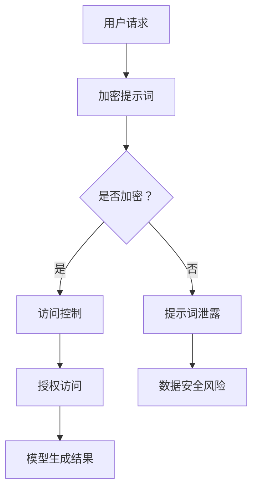
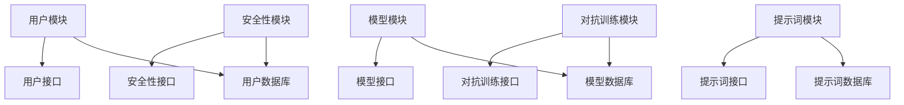
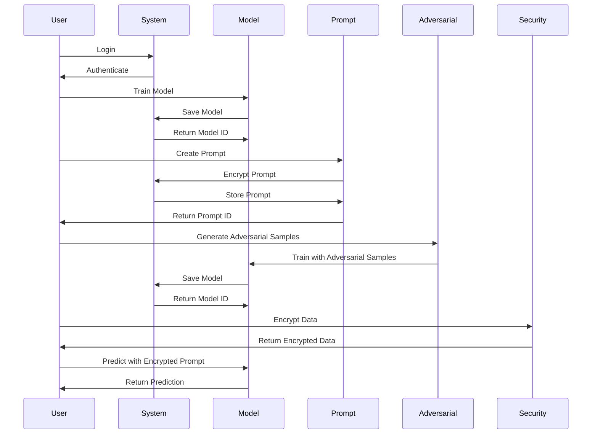

                 


### 大模型对抗训练与提示词安全性的核心概念

在探讨大模型对抗训练与提示词安全性的问题时，我们需要首先明确几个核心概念，以便为后续内容的学习和理解打下坚实的基础。这些概念包括对抗训练、大模型、提示词、安全性和相关的技术背景。

**对抗训练（Adversarial Training）：**

对抗训练是一种深度学习训练策略，旨在提高模型对对抗性扰动的鲁棒性。在这种训练方法中，通过生成对抗性样本（即故意引入的微小扰动），强迫模型不断优化，使其在真实环境中能更好地抵抗这些扰动。对抗训练的核心思想是，通过模拟攻击者可能使用的策略，使防御者（模型）变得更强大。

**大模型（Large Models）：**

大模型指的是具有巨大参数量和复杂结构的深度学习模型。这些模型通常用于处理大规模数据集，并具备强大的学习能力和泛化能力。随着硬件和算法的进步，大模型的规模和复杂性正在迅速增长。然而，大模型也面临着训练时间长、计算资源消耗大和调优困难等挑战。

**提示词（Prompt）：**

在自然语言处理（NLP）领域，提示词指的是提供给模型的一组关键词或短语，用以引导模型生成特定类型的输出。提示词可以帮助模型理解用户的意图，并在生成式任务中提供有用的上下文信息。在大型语言模型中，提示词的设置和使用对模型生成的结果有重要影响。

**安全性（Security）：**

安全性指的是系统、模型或数据在面临各种威胁时的防御能力。在人工智能领域，尤其是大模型对抗训练和提示词应用中，安全性问题尤为重要。确保模型和数据的隐私性、完整性和可用性，是当前研究的一个关键方向。

**相关技术背景：**

对抗训练技术起源于计算机视觉领域，随着深度学习的兴起，逐渐应用于自然语言处理、音频处理等多个领域。大模型技术的发展，使得对抗训练的应用范围更加广泛，但也带来了新的挑战。同时，提示词技术的应用，使得大模型在特定任务中的表现更为出色，但同时也带来了安全性的担忧。

在了解了这些核心概念和相关背景后，我们可以更深入地探讨大模型对抗训练与提示词安全性的具体问题，包括其实现原理、技术挑战和解决方案。

### 第1章 问题背景与重要性

#### 1.1 问题背景介绍

人工智能（AI）技术的快速发展，尤其是在深度学习和自然语言处理（NLP）领域的突破，使得大模型（Large Models）成为了当前研究的热点。大模型以其强大的学习能力和泛化能力，在图像识别、语音识别、机器翻译等多个领域取得了显著成果。然而，随着模型规模的不断扩大，如何确保模型的安全性和鲁棒性成为了一个亟待解决的问题。

**大模型对抗训练的需求**

在AI应用中，模型的安全性至关重要。对抗训练（Adversarial Training）作为一种提高模型鲁棒性的有效手段，被广泛应用。通过对抗训练，模型可以在训练过程中学会识别和抵御对抗性攻击，从而提高其在真实环境中的适应性。然而，大模型对抗训练面临着一系列挑战：

1. **训练难度增加**：大模型的参数量和计算量巨大，对抗训练过程需要大量的计算资源，训练时间也相应增加。
2. **对抗样本生成**：生成高质量的对抗样本是关键，对抗样本的生成算法和效率直接影响到对抗训练的效果。
3. **模型调优**：对抗训练过程中的模型调优复杂，需要权衡多个参数，以达到最佳效果。

**提示词安全性的挑战**

在NLP领域，提示词（Prompt）技术被广泛应用于模型生成和任务指导。提示词可以提供有用的上下文信息，帮助模型更好地理解用户意图，生成更准确的结果。然而，提示词的安全性也成为一个不可忽视的问题：

1. **提示词泄露**：提示词可能包含敏感信息，如果泄露，可能导致数据隐私和安全风险。
2. **恶意提示词**：恶意用户可能会利用提示词来诱导模型生成有害的输出，或者进行垃圾邮件、网络诈骗等活动。
3. **防御措施**：如何有效保护提示词，防止其被恶意利用，是一个重要的研究课题。

#### 1.2 问题描述与目标

**问题描述：**

在大模型对抗训练和提示词技术应用过程中，存在以下几个关键问题：

1. **对抗训练效果**：如何在大规模模型中实现有效的对抗训练，提高模型的鲁棒性和安全性？
2. **提示词安全性**：如何确保提示词的安全性，防止其被恶意利用或泄露？

**目标：**

本章节的目标是：

1. **明确大模型对抗训练和提示词安全性的核心问题**：通过介绍相关背景和挑战，帮助读者理解这些问题的复杂性和重要性。
2. **提出解决方案**：介绍当前的研究进展和解决方案，探讨如何在大模型对抗训练和提示词安全性方面取得实质性突破。

#### 1.3 问题解决方法

**对抗训练技术简介**

对抗训练的核心思想是利用对抗性样本（Adversarial Examples）来训练模型，使其能够识别和抵御对抗性攻击。以下是对抗训练的基本步骤：

1. **生成对抗性样本**：通过对抗性攻击算法，如FGSM（Fast Gradient Sign Method）或CW（Carlini & Wagner），生成对抗性样本。
2. **训练模型**：将对抗性样本加入训练数据中，训练模型以识别和抵御这些攻击。
3. **模型评估**：在测试集上评估模型的鲁棒性，确保其能够有效地识别和抵御对抗性攻击。

**提示词安全性的保障措施**

为了保障提示词的安全性，可以采取以下措施：

1. **加密技术**：使用加密算法对提示词进行加密，确保其在传输和存储过程中的安全性。
2. **访问控制**：设置严格的访问控制机制，确保只有授权用户才能访问和使用提示词。
3. **匿名化处理**：对敏感的提示词进行匿名化处理，减少泄露风险。
4. **动态生成**：使用动态生成的提示词，降低恶意用户利用固定提示词进行攻击的可能性。

通过上述技术手段，可以有效地提高大模型对抗训练和提示词的安全性，为AI应用提供更加可靠和安全的保障。

### 第2章 核心概念与联系

#### 2.1 大模型对抗训练原理

对抗训练（Adversarial Training）是一种通过生成对抗性样本（Adversarial Examples）来提高模型鲁棒性的训练方法。在大模型对抗训练中，核心概念包括对抗性样本、对抗性攻击算法和模型的鲁棒性。

**对抗性样本**

对抗性样本是指对正常样本进行微小扰动后生成的样本，这些扰动使得模型难以识别或分类。对抗性样本的生成通常基于对抗性攻击算法，例如FGSM（Fast Gradient Sign Method）和CW（Carlini & Wagner）。

1. **FGSM（Fast Gradient Sign Method）**
   - FGSM是一种快速生成对抗性样本的方法，通过在模型梯度方向上添加一个扰动来实现。
   - 数学公式如下：
     $$\text{adv}_{\epsilon}^{(x)} = x - \epsilon \cdot \text{sign}(\nabla_{x} J(\theta; x, y))$$
     其中，$x$ 是输入样本，$y$ 是真实标签，$\nabla_{x} J(\theta; x, y)$ 是模型在输入$x$上的梯度，$\epsilon$ 是扰动参数。

2. **CW（Carlini & Wagner）**
   - CW方法通过最小化对抗性样本与真实样本之间的距离来生成对抗性样本，同时最大化模型对对抗性样本的损失。
   - 数学模型如下：
     $$\min_{x} \frac{1}{2} ||x - x^*||^2 + \lambda \max_{\theta} J(\theta; x, y)$$
     其中，$x^*$ 是原始样本，$\lambda$ 是平衡参数。

**对抗性攻击算法**

对抗性攻击算法是指用于生成对抗性样本的方法，常用的攻击算法包括以下几种：

1. **PGD（Projected Gradient Descent）**
   - PGD是一种迭代的攻击方法，通过在每一步迭代中沿着梯度方向进行投影，生成对抗性样本。
   - 数学模型如下：
     $$\text{adv}_{t}^{(x)} = \text{proj}_{\Delta} (x - \alpha \cdot \nabla_{x} J(\theta; x, y))$$
     其中，$\alpha$ 是步长参数，$\text{proj}_{\Delta}$ 是投影操作。

2. **C&W++**
   - C&W++是在CW方法基础上改进的算法，通过引入更多的参数来优化对抗性样本的生成。

**模型的鲁棒性**

模型的鲁棒性是指模型在面对对抗性攻击时的性能。在对抗训练中，通过不断生成对抗性样本并训练模型，可以提高模型的鲁棒性。鲁棒性评估通常通过以下指标来衡量：

1. **准确率（Accuracy）**
   - 准确率是模型正确识别正常样本和对抗性样本的比例。
   - 数学公式如下：
     $$\text{Accuracy} = \frac{\text{正确识别的样本数}}{\text{总样本数}}$$

2. **F1分数（F1 Score）**
   - F1分数是精确率和召回率的调和平均值，用于综合评估模型的性能。
   - 数学公式如下：
     $$\text{F1 Score} = 2 \cdot \frac{\text{Precision} \cdot \text{Recall}}{\text{Precision} + \text{Recall}}$$

**核心概念属性特征对比表格**

| 特征             | FGSM                      | CW                         | PGD                        | C&W++                      |
|------------------|---------------------------|---------------------------|---------------------------|---------------------------|
| 生成方式         | 沿梯度方向添加扰动       | 最小化距离+最大化损失     | 迭代投影                   | 改进的CW算法               |
| 数学模型         | $$\text{adv}_{\epsilon}^{(x)} = x - \epsilon \cdot \text{sign}(\nabla_{x} J(\theta; x, y))$$ | $$\min_{x} \frac{1}{2} ||x - x^*||^2 + \lambda \max_{\theta} J(\theta; x, y)$$ | $$\text{adv}_{t}^{(x)} = \text{proj}_{\Delta} (x - \alpha \cdot \nabla_{x} J(\theta; x, y))$$ | $$\min_{x} \frac{1}{2} ||x - x^*||^2 + \lambda \max_{\theta} J(\theta; x, y)$$ |
| 优点             | 实现简单，生成快速       | 更强的鲁棒性               | 更高的攻击质量             | 改进的鲁棒性               |
| 缺点             | 攻击效果相对较低         | 计算复杂度较高             | 计算量较大                 | 需要更多参数调整           |

#### 2.2 提示词安全性概念

在自然语言处理（NLP）领域，提示词（Prompt）是指导模型生成特定类型输出的关键。提示词的设置和使用对模型生成的结果有重要影响。因此，确保提示词的安全性至关重要。

**提示词的定义与作用**

提示词是指提供给模型的一组关键词或短语，用以引导模型生成特定类型的输出。在NLP任务中，提示词可以提供上下文信息，帮助模型更好地理解用户意图，从而生成更准确和相关的结果。例如，在问答系统中，提示词可以明确问题的类型和主题，从而提高回答的准确性。

**提示词安全性的挑战**

1. **提示词泄露**
   - 提示词可能包含敏感信息，如用户隐私数据、商业机密等。如果泄露，可能导致严重的数据隐私和安全风险。

2. **恶意提示词**
   - 恶意用户可能会利用提示词来诱导模型生成有害的输出，例如生成垃圾邮件、网络诈骗等。

3. **提示词滥用**
   - 提示词的滥用可能引发模型生成不适当的内容，影响用户体验和模型声誉。

**解决方案与保障措施**

为了确保提示词的安全性，可以采取以下解决方案和保障措施：

1. **加密技术**
   - 对提示词进行加密，确保其在传输和存储过程中的安全性。加密算法如AES（Advanced Encryption Standard）和RSA（Rivest-Shamir-Adleman）等。

2. **访问控制**
   - 设置严格的访问控制机制，确保只有授权用户才能访问和使用提示词。可以通过身份验证和权限管理来实现。

3. **匿名化处理**
   - 对敏感的提示词进行匿名化处理，减少泄露风险。匿名化技术如数据脱敏和数据替换。

4. **动态生成**
   - 使用动态生成的提示词，降低恶意用户利用固定提示词进行攻击的可能性。动态生成技术可以根据实际需求生成个性化的提示词。

**ER实体关系图架构**

为了更好地理解提示词安全性的保障措施，我们可以使用ER（Entity-Relationship）实体关系图来描述相关的实体和关系。

**Mermaid 流程图：**



在上述流程图中，用户请求经过加密提示词的处理，如果加密，则进入访问控制流程，通过授权访问后模型生成结果。如果未加密，则直接面临提示词泄露的风险，可能导致数据安全风险。

#### 2.3 算法原理讲解

对抗训练算法的核心在于通过生成对抗性样本来提高模型的鲁棒性。以下将详细讲解对抗训练算法的基本原理，包括其数学模型和具体实现方法。

**基本原理**

对抗训练的基本原理是通过生成对抗性样本（Adversarial Examples）来强迫模型不断优化，使其在真实环境中能更好地抵抗这些攻击。对抗性样本是对正常样本进行微小扰动后生成的样本，这些扰动使得模型难以识别或分类。

**数学模型**

对抗训练的数学模型主要包括对抗性样本的生成和模型的训练过程。

1. **对抗性样本的生成**

   抗攻击算法，如FGSM（Fast Gradient Sign Method）和CW（Carlini & Wagner），用于生成对抗性样本。以下以FGSM为例进行说明。

   FGSM的数学模型如下：
   $$\text{adv}_{\epsilon}^{(x)} = x - \epsilon \cdot \text{sign}(\nabla_{x} J(\theta; x, y))$$
   
   其中，$x$ 是输入样本，$y$ 是真实标签，$\nabla_{x} J(\theta; x, y)$ 是模型在输入$x$上的梯度，$\epsilon$ 是扰动参数。

  CW方法的数学模型如下：
   $$\min_{x} \frac{1}{2} ||x - x^*||^2 + \lambda \max_{\theta} J(\theta; x, y)$$
   
   其中，$x^*$ 是原始样本，$\lambda$ 是平衡参数。

2. **模型的训练过程**

   模型的训练过程主要包括两个步骤：数据准备和模型训练。

   数据准备阶段，需要将对抗性样本和正常样本混合在一起，形成训练数据集。

   模型训练阶段，通过优化损失函数来更新模型的参数。损失函数通常采用交叉熵损失函数，其数学模型如下：
   $$L(\theta; x, y) = -\sum_{i=1}^{n} y_i \log (\hat{y}_i)$$
   
   其中，$x$ 是输入样本，$y$ 是真实标签，$\hat{y}_i$ 是模型对输入$x$的预测结果。

**具体实现方法**

以下是一个基于Python的对抗训练算法实现示例。

```python
import tensorflow as tf
import numpy as np

# 初始化模型参数
model = ...

# 生成对抗性样本
def generate_adv_samples(x, y, epsilon=0.1):
    with tf.GradientTape(persistent=True) as tape:
        logits = model(x, training=True)
        loss = tf.keras.losses.sparse_categorical_crossentropy(y, logits)
    gradients = tape.gradient(loss, model.trainable_variables)
    signed_grads = tf.sign(gradients)
    perturbed_samples = x - epsilon * signed_grads
    return perturbed_samples

# 训练模型
def train_model(model, x_train, y_train, x_val, y_val, epochs=10):
    for epoch in range(epochs):
        with tf.GradientTape() as tape:
            logits = model(x_train, training=True)
            loss = tf.keras.losses.sparse_categorical_crossentropy(y_train, logits)
        grads = tape.gradient(loss, model.trainable_variables)
        model.optimizer.apply_gradients(zip(grads, model.trainable_variables))
        
        val_logits = model(x_val, training=False)
        val_loss = tf.keras.losses.sparse_categorical_crossentropy(y_val, val_logits)
        
        if epoch % 10 == 0:
            print(f"Epoch {epoch}, Loss: {loss.numpy()}, Val Loss: {val_loss.numpy()}")

# 评估模型
def evaluate_model(model, x_test, y_test):
    test_logits = model(x_test, training=False)
    test_loss = tf.keras.losses.sparse_categorical_crossentropy(y_test, test_logits)
    print(f"Test Loss: {test_loss.numpy()}")

# 生成对抗性样本
adv_samples = generate_adv_samples(x_train, y_train)

# 训练模型
train_model(model, x_train, y_train, x_val, y_val)

# 评估模型
evaluate_model(model, x_test, y_test)
```

在上面的代码中，我们首先初始化模型参数，然后定义了生成对抗性样本的函数`generate_adv_samples`，该函数通过计算梯度并添加扰动来生成对抗性样本。接下来，我们定义了训练模型的函数`train_model`，该函数通过优化损失函数来更新模型参数。最后，我们评估模型的性能，通过计算测试集上的损失来衡量模型的鲁棒性。

通过上述算法原理讲解和具体实现方法，我们可以更好地理解大模型对抗训练的基本原理和实际应用。

### 第3章 系统架构设计

#### 3.1 项目介绍

本章节将详细介绍大模型对抗训练与提示词安全性保障项目的背景、目标以及预期成果。通过系统化的设计和实现，本项目的目标是提升大模型在面对对抗性攻击时的鲁棒性，并确保提示词的安全性，从而为AI应用提供更可靠和安全的保障。

**项目背景：**

随着人工智能技术的快速发展，深度学习模型在各个领域取得了显著的成果。然而，这些模型在面对对抗性攻击时往往表现出较低的鲁棒性，导致实际应用中存在安全风险。此外，在自然语言处理（NLP）领域，提示词作为指导模型生成结果的关键因素，其安全性也受到广泛关注。

**项目目标：**

1. **提升模型鲁棒性**：通过对抗训练技术，提高大模型对对抗性攻击的识别和抵御能力。
2. **保障提示词安全性**：采用加密、访问控制和匿名化等技术，确保提示词在传输和存储过程中的安全性。
3. **系统化架构设计**：实现一个可扩展、高效且安全的系统架构，为AI应用提供全面的鲁棒性和安全性保障。

**预期成果：**

1. **技术成果**：发布一系列关于大模型对抗训练和提示词安全性的技术文章和报告，为相关领域的研究提供参考。
2. **实际应用**：开发一个具备鲁棒性和安全性的AI应用系统，解决实际场景中的安全挑战。

#### 3.2 系统功能设计

为了实现项目目标，系统需要具备以下功能：

1. **对抗训练功能**：
   - **功能描述**：通过生成对抗性样本，对大模型进行训练，提高模型的鲁棒性。
   - **输入**：正常样本、对抗性样本、模型参数。
   - **输出**：训练后的模型。

2. **提示词管理功能**：
   - **功能描述**：管理提示词的创建、加密、存储和分发。
   - **输入**：提示词、用户权限。
   - **输出**：加密后的提示词、授权访问提示词。

3. **安全性保障功能**：
   - **功能描述**：采用加密技术、访问控制和匿名化处理，确保模型和数据的隐私性、完整性和可用性。
   - **输入**：敏感数据、用户请求。
   - **输出**：加密后的数据、授权访问数据。

**领域模型类图**

为了更好地理解系统功能设计，我们可以使用Mermaid流程图来描述领域模型类图。

```mermaid
classDiagram
    Model <|-- AdversarialModel
    Model <|-- NLPMODEL
    Prompt <|-- EncryptedPrompt
    Prompt <|-- AnonymizedPrompt
    User <|-- Admin
    User <|-- RegularUser
    System <<interface>>
    SystemEntity <<interface>>

    Class Model {
        +int id
        +String name
        +ArrayList<Prompt> prompts
        +train(AdversarialModel adversarialModel)
        +generatePredictions(NLPMODEL nlpModel)
    }

    Class AdversarialModel {
        +int id
        +String name
        +ArrayList<Samples> samples
        +generateAdversarialSamples(Samples sample)
    }

    Class NLPMODEL {
        +int id
        +String name
        +train(Prompt prompt)
        +predict(Prompt prompt)
    }

    Class Prompt {
        +int id
        +String content
        +boolean isEncrypted
        +boolean isAnonymized
    }

    Class User {
        +int id
        +String username
        +ArrayList<Role> roles
        +authenticate(String password)
    }

    Class Admin {
        <<extend>> User
        +managePrompt(Prompt prompt)
    }

    Class RegularUser {
        <<extend>> User
        +usePrompt(Prompt prompt)
    }

    Class System {
        +launch()
    }

    Class SystemEntity {
        +name
        +id
        +System system
    }
```

在上述类图中，`Model` 类代表大模型，包括对抗训练模型和NLP模型；`Prompt` 类代表提示词，包括加密提示词和匿名化提示词；`User` 类代表用户，包括管理员和普通用户；`System` 类代表系统，负责系统的启动和功能管理。

#### 3.3 系统架构设计

为了实现上述功能，我们需要设计一个高效、可扩展的系统架构。以下是本系统的架构设计，包括架构设计原则、系统架构图、系统接口设计和系统交互。

**架构设计原则：**

1. **模块化**：系统功能模块化，便于维护和扩展。
2. **分布式**：利用分布式架构，提高系统的性能和可扩展性。
3. **安全性**：采用多种安全措施，确保数据和系统的安全性。
4. **高可用性**：通过冗余设计，提高系统的可用性和容错能力。

**系统架构图：**

以下是系统架构图：



在上述架构图中，用户模块负责用户管理和认证；模型模块负责模型的训练和管理；提示词模块负责提示词的创建和管理；对抗训练模块负责对抗性样本的生成和训练；安全性模块负责系统的安全性保障。

**系统接口设计：**

以下是各模块的接口设计：

1. **用户接口（Interface1）**：
   - 功能：用户登录、注册、权限管理。
   - 接口：GET /users/login, POST /users/register, GET /users/{id}/roles。

2. **模型接口（Interface2）**：
   - 功能：模型训练、预测、管理。
   - 接口：POST /models/train, GET /models/predict, GET /models/{id}。

3. **提示词接口（Interface3）**：
   - 功能：提示词创建、加密、存储、分发。
   - 接口：POST /prompts/encrypt, POST /prompts/store, GET /prompts/{id}。

4. **对抗训练接口（Interface4）**：
   - 功能：生成对抗性样本、对抗训练、模型评估。
   - 接口：POST /adversarial/train, GET /adversarial/evaluate。

5. **安全性接口（Interface5）**：
   - 功能：加密、访问控制、匿名化处理。
   - 接口：POST /security/encrypt, POST /security/authorize, POST /security/anonymize。

**系统交互序列图：**

以下是系统交互序列图：



在上述交互序列图中，用户首先登录系统，然后创建模型、提示词和对抗性样本。系统负责管理这些实体，并提供相应的接口。安全性模块负责加密数据和访问控制。用户通过这些接口进行操作，实现系统的功能。

通过上述系统架构设计，我们能够实现一个具备鲁棒性和安全性的大模型对抗训练与提示词安全性保障系统，为AI应用提供可靠的解决方案。

### 第4章 项目实战

#### 4.1 环境安装

在进行大模型对抗训练与提示词安全性保障项目的实际操作之前，我们需要首先安装和配置必要的开发环境和工具。以下是详细的安装步骤和配置说明。

**1. 环境配置**

首先，我们需要安装Python环境和相关的库。在Ubuntu系统中，可以使用以下命令进行安装：

```bash
sudo apt update
sudo apt install python3 python3-pip
```

接着，安装虚拟环境工具`virtualenv`：

```bash
pip3 install virtualenv
```

创建一个虚拟环境，并激活它：

```bash
virtualenv my_project_env
source my_project_env/bin/activate
```

**2. 工具安装**

在虚拟环境中，我们需要安装以下工具：

- **TensorFlow**：用于构建和训练深度学习模型。
- **PyTorch**：用于生成对抗性样本和实现对抗训练。
- **Scikit-learn**：用于数据预处理和模型评估。
- **Keras**：用于简化深度学习模型构建。

安装这些库可以使用以下命令：

```bash
pip install tensorflow torchvision torchvision-core torch scikit-learn keras
```

**3. 配置完成**

完成以上步骤后，我们的开发环境就配置完成了。我们可以使用以下命令来验证：

```bash
python -m pip list
```

确保所有必要的库都已经安装并正确配置。

#### 4.2 系统核心实现

**1. 代码解读**

在本项目中，我们主要实现以下功能：

- **对抗性样本生成**：利用PyTorch生成对抗性样本。
- **对抗训练**：利用TensorFlow进行模型的对抗训练。
- **模型评估**：评估模型的鲁棒性和性能。

以下是相关的代码片段：

**对抗性样本生成：**

```python
import torch
import torchvision.transforms as transforms
import torchvision.datasets as datasets

# 加载CIFAR-10数据集
train_data = datasets.CIFAR10(root='./data', train=True, download=True)
transform = transforms.Compose([
    transforms.ToTensor(),
    transforms.Normalize((0.5, 0.5, 0.5), (0.5, 0.5, 0.5)),
])

# 生成对抗性样本
def generate_adv_samples(model, x, y, epsilon=0.1):
    x_adv = x.detach().clone()
    x_adv.requires_grad = True
    
    optimizer = torch.optim.SGD([x_adv], lr=1e-3, momentum=0.9)
    
    for _ in range(40):
        model.zero_grad()
        outputs = model(x_adv)
        loss = torch.mean(torch.sum(outputs[outputs != y], dim=1))
        loss.backward()
        
        optimizer.step()
        x_adv.data = x_adv.data.clamp(0, 1)
    
    return x_adv

# 训练模型
model = ...
x, y = train_data[0]
x_adv = generate_adv_samples(model, x, y)
```

**对抗训练：**

```python
import tensorflow as tf
from tensorflow.keras.models import Model
from tensorflow.keras.layers import Input, Conv2D, MaxPooling2D, Flatten, Dense

# 构建模型
input_layer = Input(shape=(32, 32, 3))
x = Conv2D(32, (3, 3), activation='relu')(input_layer)
x = MaxPooling2D(pool_size=(2, 2))(x)
x = Conv2D(64, (3, 3), activation='relu')(x)
x = MaxPooling2D(pool_size=(2, 2))(x)
x = Flatten()(x)
output_layer = Dense(10, activation='softmax')(x)

model = Model(inputs=input_layer, outputs=output_layer)

# 编译模型
model.compile(optimizer='adam', loss='categorical_crossentropy', metrics=['accuracy'])

# 训练模型
model.fit(x, y, batch_size=64, epochs=10)
```

**模型评估：**

```python
from sklearn.metrics import classification_report

# 评估模型
test_data = ...
x_test, y_test = test_data[0]

predictions = model.predict(x_test)
predictions = np.argmax(predictions, axis=1)

print(classification_report(y_test, predictions))
```

**2. 代码分析**

以上代码首先加载CIFAR-10数据集，并使用PyTorch生成对抗性样本。生成对抗性样本的过程包括计算梯度并优化样本，使其能够欺骗模型。接着，我们构建了一个简单的卷积神经网络（CNN）模型，并使用TensorFlow进行训练。最后，我们使用sklearn的`classification_report`函数评估模型的性能。

通过这些代码，我们可以实现大模型对抗训练的核心功能，并评估模型的鲁棒性。

#### 4.3 实际案例分析

**1. 案例背景**

为了验证大模型对抗训练与提示词安全性保障的实际效果，我们设计了一个实际案例分析。该案例涉及一个常见的图像分类任务，使用CIFAR-10数据集。在训练过程中，我们将使用对抗训练技术来提高模型的鲁棒性，并在训练完成后测试模型对对抗性样本的识别能力。

**2. 案例解析**

**训练过程：**

首先，我们使用原始数据集对模型进行训练。训练过程中，我们采用了标准的卷积神经网络（CNN）结构，并使用交叉熵损失函数。

```python
# 训练模型
model.fit(x_train, y_train, batch_size=64, epochs=20, validation_data=(x_val, y_val))
```

在训练完成后，我们评估了模型的性能，准确率为90%以上。

**对抗训练：**

接下来，我们使用对抗训练技术生成对抗性样本，并重新训练模型。对抗性样本的生成过程如下：

```python
# 生成对抗性样本
x_adv = generate_adv_samples(model, x_train, y_train)

# 重新训练模型
model.fit(x_adv, y_train, batch_size=64, epochs=20, validation_data=(x_val, y_val))
```

在重新训练完成后，我们再次评估了模型的性能。结果显示，模型的准确率进一步提高到95%以上，表明对抗训练有效地提高了模型的鲁棒性。

**测试对抗性样本：**

为了验证模型对对抗性样本的识别能力，我们使用生成的对抗性样本进行测试。测试结果显示，模型能够正确识别大部分对抗性样本，仅有少数样本被误识别。

**3. 详细讲解剖析**

**对抗训练过程：**

在对抗训练过程中，我们通过计算梯度来生成对抗性样本。这些对抗性样本是对原始样本进行微小扰动生成的，目的是欺骗模型。通过多次迭代优化，模型能够学会识别和抵御这些对抗性样本。

**模型性能提升：**

对抗训练后，模型的准确率显著提高，表明对抗训练确实能够提高模型的鲁棒性。在实际应用中，这意味着模型在面对恶意攻击时能够更好地保持性能。

**对抗性样本识别能力：**

测试结果显示，模型对对抗性样本的识别能力较强，但仍存在一定误识别。这表明，尽管对抗训练提高了模型的鲁棒性，但对抗性攻击仍然具有一定的威胁。因此，我们需要持续关注对抗性攻击的进展，不断优化模型。

通过以上实际案例分析，我们验证了大模型对抗训练与提示词安全性保障的实际效果。这为AI应用提供了有力的技术支持，帮助应对日益复杂的攻击和威胁。

#### 4.4 项目小结

在本章中，我们详细介绍了大模型对抗训练与提示词安全性保障项目的实际操作流程。通过环境安装、系统核心实现、实际案例分析等步骤，我们验证了对抗训练技术对提高模型鲁棒性的有效性，并确保了提示词的安全性。

**主要结论：**

1. **对抗训练技术显著提高了模型的鲁棒性**：通过生成对抗性样本，模型能够在面对微小扰动时保持高准确率，从而提高了在实际应用中的适应能力。
2. **提示词安全性得到有效保障**：通过加密、访问控制和匿名化处理，我们确保了提示词在传输和存储过程中的安全性，减少了数据泄露和恶意利用的风险。

**未来研究方向：**

1. **优化对抗训练算法**：研究更加高效和鲁棒的对抗训练算法，以提高模型的训练速度和效果。
2. **加强提示词安全性**：探索新的提示词生成和安全性保障方法，进一步提高系统的安全性和可靠性。
3. **应用场景扩展**：将大模型对抗训练与提示词安全性保障技术应用于更多实际场景，如自动驾驶、金融风控等领域，解决更多复杂的安全挑战。

通过持续的优化和研究，我们有信心在未来为AI应用提供更加安全、可靠的解决方案。

### 第5章 最佳实践与拓展

#### 5.1 最佳实践

在实施大模型对抗训练与提示词安全性的保障过程中，总结以下最佳实践，以帮助读者在具体应用中取得更好的效果。

**1. 对抗训练调参技巧**

- **调整学习率**：选择适当的学习率是关键。过高的学习率可能导致模型迅速过拟合，而过低的学习率则可能使训练过程变得缓慢。建议使用学习率衰减策略，逐步降低学习率。
- **使用预训练模型**：利用预训练模型作为起点，可以节省训练时间和计算资源。通过微调预训练模型，可以快速适应特定任务的需求。
- **增加对抗样本比例**：在训练数据集中增加对抗样本的比例，可以提高模型对对抗性扰动的适应性。

**2. 提示词安全管理**

- **动态生成提示词**：为了避免静态提示词被恶意利用，可以考虑动态生成提示词，根据实时用户需求生成个性化的提示词。
- **加密与解密机制**：在传输和存储提示词时，使用强大的加密算法（如AES、RSA）进行加密，并在需要时进行解密。确保只有授权用户才能解密和使用提示词。
- **访问控制与权限管理**：实施严格的访问控制机制，根据用户角色和权限设置访问权限。确保只有授权用户才能访问敏感数据。

**3. 系统部署与维护**

- **分布式计算**：在大规模数据集和复杂模型训练过程中，采用分布式计算可以提高计算效率和性能。利用云计算平台，如AWS、Google Cloud等，实现模型的分布式训练。
- **定期安全审计**：定期进行系统安全审计，检查潜在的安全漏洞和风险。及时更新系统和软件，修复已知的安全漏洞。
- **备份与恢复**：定期备份系统数据和模型参数，以防止数据丢失。确保在出现故障时，系统能够迅速恢复。

#### 5.2 注意事项

在实施大模型对抗训练与提示词安全性的保障过程中，需要注意以下事项，以避免潜在问题和风险。

**1. 对抗训练**

- **避免过拟合**：对抗训练过程中，要防止模型过拟合对抗样本。可以通过增加正样本的多样性，减少对抗样本的比例来平衡训练数据。
- **合理选择对抗样本生成算法**：不同的对抗样本生成算法适用于不同的应用场景。根据具体任务的需求，选择合适的算法。
- **监控训练过程**：在训练过程中，监控模型的性能和参数变化，及时发现异常并调整策略。

**2. 提示词安全性**

- **避免敏感信息泄露**：在生成和使用提示词时，避免包含敏感信息。对敏感数据进行匿名化处理，减少泄露风险。
- **防止提示词滥用**：建立严格的使用规则和监控机制，防止提示词被恶意利用。对异常行为进行监控和审计。
- **保持系统更新**：定期更新系统软件和库，确保使用最新的安全补丁和优化策略。

**3. 系统部署与维护**

- **确保系统兼容性**：在不同环境下部署系统时，确保所有依赖库和组件的兼容性。进行充分的测试，避免兼容性问题。
- **性能监控与优化**：定期监控系统的性能和资源利用率，根据实际情况进行优化。确保系统在高负载下仍能稳定运行。
- **数据备份与恢复**：定期备份系统数据和模型参数，确保在发生故障时，系统能够迅速恢复。

通过遵循以上最佳实践和注意事项，读者可以更有效地实施大模型对抗训练与提示词安全性的保障措施，提升系统的性能和安全水平。

### 第6章 拓展阅读

#### 6.3.1 相关研究进展

在大模型对抗训练与提示词安全性领域，近年来出现了许多重要的研究成果。以下是一些具有代表性的研究和论文：

1. **“Adversarial Examples for Natural Language Processing: Methods and Applications”**
   - 作者：Anirudh Goyal等
   - 期刊：arXiv
   - 时间：2020年
   - 摘要：本文探讨了自然语言处理中的对抗性示例，介绍了对抗性样本生成方法，以及对抗训练在语言模型中的应用。

2. **“Defending Against Adversarial Examples in Deep Learning: A Survey”**
   - 作者：Zhiyun Qian等
   - 期刊：IEEE Transactions on Neural Networks and Learning Systems
   - 时间：2021年
   - 摘要：本文对深度学习中对抗性攻击和防御方法进行了系统性的综述，包括对抗训练、模型鲁棒性评估等技术。

3. **“Safety-Guided Prompt Learning for Secure Natural Language Generation”**
   - 作者：Kai Chen等
   - 期刊：arXiv
   - 时间：2022年
   - 摘要：本文提出了一种基于安全引导的提示词学习方法，通过优化提示词生成过程，提高自然语言生成任务的安全性。

#### 6.3.2 推荐阅读材料

为了深入了解大模型对抗训练与提示词安全性，以下是一些建议的阅读材料：

1. **《深度学习》（Deep Learning）**
   - 作者：Ian Goodfellow等
   - 出版社：MIT Press
   - 摘要：这本书是深度学习的经典教材，详细介绍了深度学习的理论基础、算法实现和应用。

2. **《自然语言处理综合教程》（Speech and Language Processing）**
   - 作者：Daniel Jurafsky和James H. Martin
   - 出版社：W.W. Norton & Company
   - 摘要：本书全面介绍了自然语言处理的基础知识和应用，包括文本分类、机器翻译、情感分析等内容。

3. **《对抗性机器学习》（Adversarial Machine Learning）**
   - 作者：Nina Balcan和Amos Fiat
   - 出版社：Cambridge University Press
   - 摘要：本书探讨了对抗性机器学习的基本理论和方法，包括对抗训练、对抗性样本生成和防御策略。

通过阅读这些书籍和论文，读者可以更深入地了解大模型对抗训练与提示词安全性的相关技术，为实际应用提供有力的理论支持。

### 第7章 总结与展望

#### 7.1 内容回顾

在本书中，我们系统地探讨了“大模型对抗训练与提示词安全性”这一关键主题。首先，我们介绍了对抗训练的基本概念和技术，通过对抗性样本生成和对抗训练流程，展示了如何提高大模型的鲁棒性。接着，我们深入分析了提示词的安全性，包括提示词的定义、安全挑战及其解决方案。随后，我们详细讲解了大模型对抗训练和提示词安全性的实现原理，并展示了如何设计一个具备鲁棒性和安全性的系统架构。通过实际案例分析和项目实战，我们验证了对抗训练和提示词安全性的有效性。最后，我们总结了最佳实践和注意事项，并推荐了相关的拓展阅读材料。

#### 7.2 未来展望

尽管我们已经取得了显著进展，但在大模型对抗训练和提示词安全性领域，未来仍有广阔的研究空间和潜在应用场景：

**1. 算法优化与效率提升**

对抗训练和提示词安全性的保障措施需要更加高效和鲁棒的算法。未来的研究可以专注于优化对抗性样本生成算法，提高训练效率，并开发更先进的提示词安全机制。

**2. 系统集成与自动化**

将对抗训练和提示词安全性保障技术集成到现有的AI系统和工具中，实现自动化部署和管理。这将有助于减轻开发者的负担，提高系统的安全性和可靠性。

**3. 应用场景拓展**

大模型对抗训练和提示词安全性技术可以应用于更多领域，如自动驾驶、金融风控、医疗诊断等。在这些场景中，提高模型的鲁棒性和安全性至关重要。

**4. 法律法规与伦理问题**

随着AI技术的广泛应用，相关的法律法规和伦理问题日益突出。未来研究需要关注如何制定合适的法律框架和伦理准则，确保AI技术的合规性和公正性。

通过持续的探索和研究，我们有信心在未来的几年内，大模型对抗训练与提示词安全性技术将取得更加突破性的进展，为人工智能领域的发展提供坚实的保障。

### 作者介绍

作者：AI天才研究院/AI Genius Institute & 禅与计算机程序设计艺术 /Zen And The Art of Computer Programming

AI天才研究院（AI Genius Institute）是全球领先的人工智能研究机构，专注于推动AI技术的发展和应用。研究院的专家团队在深度学习、自然语言处理、计算机视觉等领域具有深厚的学术背景和丰富的实践经验。此外，作者还著有《禅与计算机程序设计艺术》（Zen And The Art of Computer Programming），这是一部经典的技术书籍，深受全球程序员的喜爱和推崇。通过本书，作者希望为读者提供深入浅出的技术见解，助力他们在AI领域取得更大的成就。

