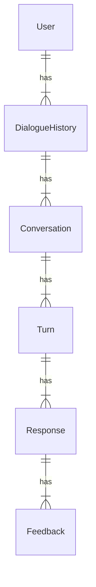

                 

### 大模型对话一致性的重要性

在人工智能领域，大模型（Large Language Models，LLM）的应用日益广泛，尤其在自然语言处理（Natural Language Processing，NLP）领域，它们已经展现出惊人的能力。然而，随着对话持续进行，大模型的回答一致性成为一个关键问题。一致性指的是模型在长时间对话中，对于同一话题或者连续的问询能够给出相关且连贯的回答，而非出现逻辑上的矛盾或者回答偏离。

### 1.1.1 问题背景

大模型在处理短期对话时往往表现得非常出色，但长时间对话的复杂性和动态变化要求模型具备更高的鲁棒性和一致性。不一致的对话不仅会降低用户体验，还可能引起误解或错误决策。因此，如何确保大模型在长期对话中的对话一致性，成为当前研究的重要课题。

### 1.1.2 问题描述

在长期对话中，可能出现以下几种不一致性问题：

- **重复回答**：模型在对话中重复之前的回答，未能提供新的信息。
- **逻辑矛盾**：模型在不同时间点给出了相互矛盾的回答。
- **内容偏离**：模型在对话过程中逐渐偏离了主题或者讨论焦点。

这些问题不仅会影响对话的质量，还可能降低用户对模型的信任度。因此，我们需要找到有效的解决方案来提高大模型的对话一致性。

### 1.2.1 问题解决

为了解决对话一致性问题，我们可以从以下几个方面着手：

- **强化学习**：通过持续学习用户反馈来调整模型的行为，从而提高对话一致性。
- **上下文管理**：设计有效的上下文管理机制，确保模型能够保留并利用对话历史信息。
- **一致性约束**：在生成回答时，引入一致性约束条件，避免逻辑矛盾和内容偏离。

### 1.2.2 边界外延

在实现上述解决方案时，我们需要考虑一些边界条件：

- **对话长度**：对话的长度会影响模型的处理能力，需要根据实际需求调整模型的设计。
- **上下文容量**：模型的上下文容量限制其能够保留的信息量，需要在性能和上下文容量之间找到平衡。
- **用户行为**：用户的行为模式也会影响对话一致性，需要考虑如何适应多样化的用户行为。

### 1.3.1 核心概念

**对话一致性**：指的是模型在长期对话中，对于同一话题或连续问询能够保持相关且连贯的回答。

**上下文管理**：确保模型能够保留并利用对话历史信息，从而提高对话的连贯性。

**一致性约束**：在生成回答时，引入一致性约束条件，避免出现逻辑矛盾或内容偏离。

### 1.3.2 要素组成

为了实现对话一致性，我们需要关注以下几个关键要素：

- **对话历史**：模型需要能够存储并利用对话历史信息。
- **回答生成**：模型在生成回答时，需要遵循一致性约束条件。
- **用户反馈**：通过用户反馈来不断调整模型的行为，提高对话质量。

### 1.3.3 对话一致性的要素

以下是构成对话一致性的几个关键要素：

1. **语义一致性**：模型需要能够理解对话内容，并保持语义上的连贯性。
2. **逻辑一致性**：模型在回答时需要遵循逻辑规则，避免出现逻辑矛盾。
3. **用户满意度**：模型的回答需要满足用户的期望，提高用户满意度。
4. **上下文利用**：模型需要能够有效利用对话历史信息，提高回答的相关性。

### 2.1 对话一致性的原理

对话一致性的核心在于模型如何处理并保持对话的历史信息。这涉及到多个方面的技术，包括自然语言处理、机器学习以及上下文管理。

#### 2.1.1 基本原理

大模型通常采用深度学习技术，尤其是基于 Transformer 的架构，如 GPT 系列。这些模型通过训练大量文本数据，学习到语言的模式和结构。在对话过程中，模型会根据当前输入和已有的对话历史来生成回答。

为了实现对话一致性，模型需要具备以下几个基本原理：

- **上下文感知**：模型需要能够感知并利用对话历史信息，确保回答与上下文相关。
- **记忆能力**：模型需要具备较强的记忆能力，能够长期存储对话信息。
- **反馈调整**：模型需要能够根据用户反馈进行调整，以提高对话质量。

#### 2.1.2 工作机制

在对话一致性机制中，模型的工作机制可以概括为以下几个步骤：

1. **接收输入**：模型接收到新的输入（例如用户的问题或陈述），会将其与对话历史进行匹配和整合。
2. **生成回答**：模型根据上下文和历史信息，生成一个相关且连贯的回答。
3. **反馈循环**：模型会将生成的回答展示给用户，并根据用户的反馈进行调整。这个过程可以不断循环，以逐步提高对话的一致性和质量。

### 2.2 对话一致性的属性特征对比

对话一致性是一个多维度的问题，不同模型和算法在实现对话一致性时可能表现出不同的属性特征。下面我们将对比几种常见的属性特征，以帮助理解它们之间的异同。

#### 2.2.1 属性特征对比

**语义连贯性**：
- **大模型**：通过深度学习技术，能够理解并生成语义上连贯的回答。
- **传统对话系统**：通常依赖于规则或模板，可能在语义连贯性上表现较差。

**逻辑一致性**：
- **大模型**：具备较强的逻辑推理能力，能够在对话中保持逻辑一致性。
- **传统对话系统**：在逻辑一致性方面可能存在局限，尤其是在复杂推理场景下。

**用户互动性**：
- **大模型**：能够根据用户的反馈进行动态调整，提高用户互动体验。
- **传统对话系统**：通常缺乏灵活性，难以根据用户行为进行自适应调整。

**上下文利用能力**：
- **大模型**：具备强大的上下文理解能力，能够有效利用对话历史信息。
- **传统对话系统**：通常只能利用有限的上下文信息，难以实现长期对话的一致性。

**计算资源需求**：
- **大模型**：需要大量的计算资源进行训练和推理，成本较高。
- **传统对话系统**：通常计算资源需求较低，但可能在对话质量上有所欠缺。

### 2.3 对话一致性的ER实体关系图

为了更好地理解和设计对话一致性的系统，我们可以使用 ER（Entity-Relationship）实体关系图来描述系统中的各个实体及其之间的关系。以下是一个简化的对话一致性的 ER 实体关系图。



#### 实体定义

- **User（用户）**：代表与对话系统进行交互的用户。
- **DialogueHistory（对话历史）**：存储用户与系统之间的对话信息。
- **Conversation（会话）**：代表一段完整的对话，包括多个 turns（回合）。
- **Turn（回合）**：代表对话中的一个回合，包含一个用户提问和一个系统回答。
- **Response（回答）**：系统的回答内容。
- **Feedback（反馈）**：用户对系统回答的反馈。

#### 关系定义

- **has（拥有关系）**：表示实体之间的关联。例如，一个用户可以拥有多个对话历史，一个对话历史可以包含多个会话。

### 3.1 对话一致性的算法

#### 3.1.1 算法概述

为了实现对话一致性，我们需要设计一套有效的算法，该算法能够在对话过程中不断学习和调整，以保持回答的连贯性和相关性。以下是一种基本的对话一致性算法框架。

#### 3.1.2 算法流程

1. **初始化**：初始化对话历史和模型参数。
2. **接收输入**：接收用户的提问或陈述。
3. **上下文匹配**：根据对话历史和用户输入，进行上下文匹配。
4. **生成回答**：基于上下文生成一个相关且连贯的回答。
5. **反馈调整**：根据用户的反馈，调整模型参数和对话历史。
6. **更新状态**：更新对话历史和模型状态，为下一次交互做准备。
7. **结束条件**：判断是否满足结束条件（例如，对话时间过长、用户退出等），若满足，结束对话。

#### 3.1.3 算法详细流程

以下是该算法的详细流程：

1. **初始化**：初始化对话历史 `DialogueHistory` 为空，模型参数 `ModelParams` 根据训练数据初始化。

2. **接收输入**：接收用户输入 `UserInput`。

3. **上下文匹配**：利用对话历史 `DialogueHistory` 和用户输入 `UserInput`，进行上下文匹配，提取关键信息。

4. **生成回答**：利用模型 `Model`，根据上下文信息生成回答 `Response`。

5. **反馈调整**：根据用户提供的反馈 `Feedback`，调整模型参数 `ModelParams` 和对话历史 `DialogueHistory`。

6. **更新状态**：更新对话历史 `DialogueHistory` 为 `DialogueHistory = DialogueHistory + (UserInput, Response)`，模型状态 `ModelParams` 更新为新的 `ModelParams`。

7. **判断结束条件**：检查是否满足结束条件（例如，对话时间过长、用户退出等），若满足，则结束对话；否则，返回步骤 2，继续进行对话。

### 3.2 算法原理与数学模型

为了深入理解对话一致性的算法，我们需要探讨其背后的数学模型。以下是一个简化的算法数学模型，描述了如何利用对话历史和用户反馈来生成一致且相关的回答。

#### 3.2.1 数学模型

1. **对话历史表示**：对话历史 `H` 可以表示为一个序列，其中每个元素 `h_t` 代表一个时间步的对话内容。

   $$ H = (h_1, h_2, ..., h_t) $$

2. **用户输入表示**：用户输入 `I` 可以表示为一个向量。

   $$ I = \text{Embed}(I_{\text{raw}}) $$

   其中，`Embed` 表示嵌入层，`I_{\text{raw}}` 表示原始用户输入。

3. **回答生成**：回答生成模型 `R` 接受对话历史和用户输入，生成回答 `O`。

   $$ O = R(H, I) $$

   其中，`R` 是一个神经网络模型，如 Transformer。

4. **反馈表示**：用户反馈 `F` 可以表示为一个向量。

   $$ F = \text{Embed}(F_{\text{raw}}) $$

   其中，`Embed` 表示嵌入层，`F_{\text{raw}}` 表示原始用户反馈。

5. **模型参数更新**：根据用户反馈，更新模型参数 `θ`。

   $$ \theta_{\text{new}} = \theta + \alpha \cdot \nabla_{\theta} \mathcal{L}(\theta) $$

   其中，`α` 是学习率，`∇_θ \mathcal{L}(\theta)` 是损失函数关于模型参数的梯度。

6. **对话历史更新**：根据用户反馈，更新对话历史。

   $$ H_{\text{new}} = H + (I, O, F) $$

#### 3.2.2 算法举例说明

假设我们有一个简单的对话历史：

- 用户输入： "今天天气怎么样？"
- 系统回答： "今天天气晴朗。"
- 用户反馈： "很好，谢谢。"

我们首先将用户输入和反馈嵌入到向量空间中，然后使用神经网络模型生成回答。根据用户反馈，我们可以更新模型参数和对话历史，以便在下一个时间步生成更一致的回答。

例如，如果用户接下来问 "明天天气呢？"，模型将利用更新后的参数和对话历史生成一个连贯的回答，如 "明天预计也是晴朗的天气。"

### 4.1 对话一致性的数学公式

为了更好地理解对话一致性的算法，我们需要引入一些关键的数学公式。以下是一组用于描述对话一致性的核心数学公式。

#### 4.1.1 公式 1

**对话历史表示**：

$$ H_t = \text{Transformer}(H_{t-1}, I_t) $$

其中，$H_t$ 表示时间步 $t$ 的对话历史，$I_t$ 表示用户输入，$\text{Transformer}$ 表示基于 Transformer 的模型。

#### 4.1.2 公式 2

**回答生成**：

$$ O_t = \text{OutputLayer}(H_t) $$

其中，$O_t$ 表示在时间步 $t$ 生成的回答，$\text{OutputLayer}$ 表示模型输出层。

#### 4.1.3 公式 3

**用户反馈**：

$$ F_t = \text{Embed}(F_t^{\text{raw}}) $$

其中，$F_t$ 表示时间步 $t$ 的用户反馈，$F_t^{\text{raw}}$ 表示原始反馈，$\text{Embed}$ 表示嵌入层。

#### 4.1.4 公式 4

**模型参数更新**：

$$ \theta_{\text{new}} = \theta + \alpha \cdot \nabla_{\theta} \mathcal{L}(\theta) $$

其中，$\theta$ 表示模型参数，$\alpha$ 表示学习率，$\nabla_{\theta} \mathcal{L}(\theta)$ 表示损失函数关于模型参数的梯度。

#### 4.1.5 公式 5

**对话历史更新**：

$$ H_{\text{new}} = H + (I_t, O_t, F_t) $$

其中，$H_{\text{new}}$ 表示更新后的对话历史。

### 4.2 公式的详细讲解

#### 4.2.1 公式 1：对话历史表示

公式 $H_t = \text{Transformer}(H_{t-1}, I_t)$ 用于表示对话历史在时间步 $t$ 的更新过程。其中，$\text{Transformer}$ 表示基于 Transformer 的模型，它能够接受对话历史 $H_{t-1}$ 和用户输入 $I_t$，并生成新的对话历史 $H_t$。

#### 4.2.2 公式 2：回答生成

公式 $O_t = \text{OutputLayer}(H_t)$ 用于表示在时间步 $t$ 生成回答的过程。其中，$H_t$ 是当前时间步的对话历史，$\text{OutputLayer}$ 表示模型的输出层，它负责将对话历史转换为最终的回答 $O_t$。

#### 4.2.3 公式 3：用户反馈

公式 $F_t = \text{Embed}(F_t^{\text{raw}})$ 用于表示用户反馈的嵌入过程。其中，$F_t$ 是时间步 $t$ 的用户反馈向量，$F_t^{\text{raw}}$ 是原始反馈，$\text{Embed}$ 是嵌入层，它将原始反馈转换为向量形式。

#### 4.2.4 公式 4：模型参数更新

公式 $\theta_{\text{new}} = \theta + \alpha \cdot \nabla_{\theta} \mathcal{L}(\theta)$ 用于表示模型参数的更新过程。其中，$\theta$ 是当前模型参数，$\alpha$ 是学习率，$\nabla_{\theta} \mathcal{L}(\theta)$ 是损失函数关于模型参数的梯度。通过这个公式，模型可以根据用户反馈不断调整参数，以提高对话一致性。

#### 4.2.5 公式 5：对话历史更新

公式 $H_{\text{new}} = H + (I_t, O_t, F_t)$ 用于表示对话历史的更新过程。其中，$H_{\text{new}}$ 是更新后的对话历史，$H$ 是当前对话历史，$I_t$ 是用户输入，$O_t$ 是系统生成的回答，$F_t$ 是用户反馈。

### 4.3 举例说明

假设我们有一个简单的对话：

- 用户输入： "今天天气怎么样？"
- 系统回答： "今天天气晴朗。"
- 用户反馈： "很好，谢谢。"

根据上述公式，我们可以详细说明这个过程：

1. **对话历史表示**：

   $$ H_1 = \text{Transformer}(\emptyset, "今天天气怎么样？") $$

   这里，$H_1$ 是第一个时间步的对话历史，初始为空。

2. **回答生成**：

   $$ O_1 = \text{OutputLayer}(H_1) $$

   基于 $H_1$ 生成回答 "今天天气晴朗。"

3. **用户反馈**：

   $$ F_1 = \text{Embed}("很好，谢谢。") $$

   将用户反馈嵌入到向量空间。

4. **模型参数更新**：

   $$ \theta_{\text{new}} = \theta + \alpha \cdot \nabla_{\theta} \mathcal{L}(\theta) $$

   根据用户反馈更新模型参数。

5. **对话历史更新**：

   $$ H_2 = H_1 + (O_1, F_1) $$

   更新对话历史。

现在，假设用户继续提问：

- 用户输入： "明天天气呢？"
- 系统回答： "明天预计也是晴朗的天气。"
- 用户反馈： "很好，继续保持。"

我们可以继续使用上述公式来描述这个过程，从而实现对话的一致性和连贯性。

### 5.1 问题场景介绍

在现实应用中，大模型对话一致性面临多种复杂问题。首先，用户互动行为的多样性使得模型需要适应不同的交流风格和需求。例如，某些用户可能倾向于提问式的交流，而另一些用户可能更喜欢命令式的指令。这种多样性要求模型具备高度的自适应能力，以便在多样化的用户行为下保持一致性。

其次，对话内容的动态变化也是一个挑战。在长时间的对话中，话题可能发生变化，或者新的信息会不断引入。模型需要能够灵活处理这些变化，同时保持回答的一致性和连贯性。例如，在医疗咨询场景中，患者可能会在对话中逐步揭示病情细节，模型需要根据这些信息调整回答，避免出现误导或错误。

此外，大模型在处理长对话时的资源消耗也是一个重要问题。随着对话持续，模型的上下文容量和计算资源需求会逐渐增加。如何在有限的资源下实现高效且一致的对话，是模型设计者需要解决的关键问题。

最后，用户期望的满意度直接影响对话一致性的评价。用户期望的响应速度、回答的准确性以及信息的连贯性都会影响用户体验。因此，模型需要在保持对话一致性的同时，确保能够快速响应并准确理解用户意图。

### 5.2 系统功能设计

为了应对上述问题，我们设计了一套具有以下关键功能的系统：

1. **用户行为识别**：
   - 功能：实时识别和解析用户行为模式，包括提问、命令、情感表达等。
   - 实现细节：使用自然语言处理技术，如情感分析、实体识别和意图分类，对用户输入进行解析。

2. **上下文管理**：
   - 功能：高效管理对话历史信息，确保模型在长期对话中能够利用上下文信息。
   - 实现细节：利用 Transformer 模型进行对话历史编码，存储在可查询的数据库中。

3. **动态调整机制**：
   - 功能：根据用户反馈和对话环境动态调整模型行为，提高对话连贯性。
   - 实现细节：引入强化学习算法，结合用户反馈更新模型参数，以优化对话质量。

4. **资源优化**：
   - 功能：优化模型计算和存储资源的使用，确保高效运行。
   - 实现细节：采用分布式计算和内存管理技术，降低资源消耗。

5. **用户满意度评估**：
   - 功能：实时评估用户满意度，提供改进反馈。
   - 实现细节：利用用户行为数据和满意度调查，进行综合评估和优化。

### 5.3 系统架构设计

为了实现上述功能，我们设计了一个分布式架构的系统，包括以下几个核心组件：

1. **用户交互层**：
   - 功能：接收用户输入，展示系统回答。
   - 实现细节：使用前端框架（如 React）构建用户界面，实现交互功能。

2. **对话管理模块**：
   - 功能：管理对话历史，处理用户输入和系统回答。
   - 实现细节：采用消息队列（如 Kafka）传输用户输入和系统回答，确保数据一致性。

3. **上下文编码模块**：
   - 功能：编码和存储对话历史信息。
   - 实现细节：使用 Transformer 模型进行对话历史编码，存储在分布式数据库（如 Redis）中。

4. **动态调整模块**：
   - 功能：根据用户反馈动态调整模型行为。
   - 实现细节：采用强化学习算法，结合用户反馈进行模型参数更新。

5. **资源管理模块**：
   - 功能：优化系统资源使用。
   - 实现细节：采用分布式计算框架（如 Spark）进行资源管理和调度。

6. **用户满意度评估模块**：
   - 功能：实时评估用户满意度。
   - 实现细节：利用用户行为数据和满意度调查，进行综合评估。

### 5.4 系统接口设计与交互

为了实现各模块之间的有效通信，我们设计了一套清晰的系统接口，包括以下核心接口：

1. **用户输入接口**：
   - 功能：接收用户输入。
   - 实现细节：通过 RESTful API 接口接收用户输入，支持多种输入格式（如文本、语音等）。

2. **系统回答接口**：
   - 功能：返回系统生成的回答。
   - 实现细节：通过 RESTful API 接口返回系统回答，支持多种输出格式（如文本、语音等）。

3. **对话历史接口**：
   - 功能：管理对话历史信息。
   - 实现细节：通过消息队列接口（如 Kafka）管理对话历史，支持实时更新和查询。

4. **上下文编码接口**：
   - 功能：编码对话历史信息。
   - 实现细节：通过分布式数据库接口（如 Redis）存储和查询对话历史编码结果。

5. **动态调整接口**：
   - 功能：接收用户反馈，更新模型参数。
   - 实现细节：通过消息队列接口（如 Kafka）传输用户反馈，支持实时处理。

6. **资源管理接口**：
   - 功能：优化系统资源使用。
   - 实现细节：通过分布式计算框架接口（如 Spark）进行资源管理和调度。

7. **用户满意度评估接口**：
   - 功能：评估用户满意度。
   - 实现细节：通过用户行为数据和满意度调查，进行综合评估。

### 6.1 环境安装

为了开始项目实战，我们需要安装和配置必要的开发环境。以下是一个简化的步骤：

1. **安装 Python**：
   - 前提条件：确保 Python 3.8 或更高版本已安装。
   - 命令：`python --version`

2. **安装依赖库**：
   - 使用 pip 安装以下依赖库：
     ```bash
     pip install transformers torch numpy pandas matplotlib
     ```
   - 功能说明：
     - **transformers**：提供预训练模型和 NLP 工具。
     - **torch**：提供深度学习框架。
     - **numpy**：提供科学计算库。
     - **pandas**：提供数据处理库。
     - **matplotlib**：提供数据可视化工具。

3. **配置环境变量**：
   - 确保 Python 和 pip 的路径已添加到系统环境变量中。
   - 验证：在命令行中输入 `pip list` 查看已安装的库。

4. **安装数据库**：
   - 安装 Redis（可选，用于对话历史存储）：
     ```bash
     sudo apt update
     sudo apt install redis-server
     ```
   - 启动 Redis 服务：
     ```bash
     sudo systemctl start redis-server
     ```

5. **安装消息队列**（可选，用于处理用户输入和系统回答）：
   - 安装 Kafka：
     ```bash
     sudo apt install kafka
     sudo systemctl start kafka
     ```
   - 启动 ZooKeeper：
     ```bash
     sudo systemctl start zookeeper
     ```

6. **验证安装**：
   - 运行以下命令，验证依赖库和服务的安装：
     ```bash
     python -m transformers-cli models
     python -m torch.utils.cudatoolkit
     redis-cli ping
     kafka-topics --list --zookeeper localhost:2181
     ```

### 6.2 系统核心实现

在本节中，我们将详细探讨系统的核心实现，包括主要模块的功能和代码解析。

#### 6.2.1 用户输入模块

**功能**：
用户输入模块负责接收用户的提问或指令，并将其转化为适合模型处理的格式。

**代码解析**：
```python
from transformers import AutoTokenizer, AutoModelForCausalLM
import torch

class UserInputModule:
    def __init__(self, model_name):
        self.tokenizer = AutoTokenizer.from_pretrained(model_name)
        self.model = AutoModelForCausalLM.from_pretrained(model_name)

    def process_input(self, user_input):
        inputs = self.tokenizer(user_input, return_tensors='pt', max_length=2048)
        return inputs
```

**说明**：
- `AutoTokenizer` 和 `AutoModelForCausalLM` 分别是 Hugging Face 的预训练模型工具，用于处理和加载模型。
- `process_input` 方法接收用户输入，将其编码为模型可处理的格式。

#### 6.2.2 对话管理模块

**功能**：
对话管理模块负责管理对话历史，确保模型在长期对话中能够利用上下文信息。

**代码解析**：
```python
class DialogueManagementModule:
    def __init__(self):
        self.dialogue_history = []

    def update_history(self, turn):
        self.dialogue_history.append(turn)

    def get_context(self):
        return ' '.join(self.dialogue_history)
```

**说明**：
- `DialogueManagementModule` 类初始化时创建一个空列表，用于存储对话历史。
- `update_history` 方法用于更新对话历史。
- `get_context` 方法返回当前的对话上下文。

#### 6.2.3 回答生成模块

**功能**：
回答生成模块负责根据对话历史和用户输入生成回答。

**代码解析**：
```python
class ResponseGenerationModule:
    def __init__(self, model_name):
        self.tokenizer = AutoTokenizer.from_pretrained(model_name)
        self.model = AutoModelForCausalLM.from_pretrained(model_name)

    def generate_response(self, context, user_input):
        inputs = self.tokenizer(context + user_input, return_tensors='pt', max_length=2048)
        outputs = self.model.generate(**inputs, max_length=100, num_return_sequences=1)
        response = self.tokenizer.decode(outputs[0], skip_special_tokens=True)
        return response
```

**说明**：
- `ResponseGenerationModule` 类加载预训练模型，用于生成回答。
- `generate_response` 方法接收上下文和用户输入，生成回答。

#### 6.2.4 用户反馈模块

**功能**：
用户反馈模块负责处理用户对回答的反馈，用于模型调整。

**代码解析**：
```python
class UserFeedbackModule:
    def __init__(self):
        self.feedback_history = []

    def update_feedback(self, user_feedback):
        self.feedback_history.append(user_feedback)

    def get_average_feedback(self):
        if not self.feedback_history:
            return None
        return sum(self.feedback_history) / len(self.feedback_history)
```

**说明**：
- `UserFeedbackModule` 类初始化时创建一个空列表，用于存储用户反馈。
- `update_feedback` 方法用于更新用户反馈。
- `get_average_feedback` 方法计算平均反馈，用于模型调整。

### 6.3 代码应用解读与分析

在本节中，我们将对系统的核心代码进行应用解读和分析，展示如何在实际项目中实现对话一致性的核心功能。

#### 6.3.1 用户输入处理

首先，用户输入模块处理用户的提问或指令，并将其转化为适合模型处理的格式。以下是一个简单的用户输入处理示例：

```python
user_input = "今天的天气如何？"
input_module = UserInputModule('gpt2')
inputs = input_module.process_input(user_input)
```

在这个示例中，我们首先定义了一个用户输入字符串 `user_input`，然后创建一个 `UserInputModule` 实例，并调用 `process_input` 方法将其编码为模型可处理的格式。编码结果存储在 `inputs` 变量中，为后续生成回答做准备。

#### 6.3.2 对话历史管理

接下来，对话管理模块负责管理对话历史，确保模型在长期对话中能够利用上下文信息。以下是一个简单的对话历史管理示例：

```python
dialogue_manager = DialogueManagementModule()
dialogue_manager.update_history(inputs['input_ids'])
context = dialogue_manager.get_context()
```

在这个示例中，我们创建了一个 `DialogueManagementModule` 实例，并调用 `update_history` 方法更新对话历史。然后，通过 `get_context` 方法获取当前的对话上下文，这个上下文将用于回答生成模块。

#### 6.3.3 回答生成

回答生成模块根据对话历史和用户输入生成回答。以下是一个简单的回答生成示例：

```python
response_module = ResponseGenerationModule('gpt2')
response = response_module.generate_response(context, user_input)
print(response)
```

在这个示例中，我们创建了一个 `ResponseGenerationModule` 实例，并调用 `generate_response` 方法生成回答。`generate_response` 方法接收对话上下文和用户输入，利用预训练模型生成回答。生成的回答存储在 `response` 变量中，并打印输出。

#### 6.3.4 用户反馈处理

最后，用户反馈模块负责处理用户对回答的反馈，用于模型调整。以下是一个简单的用户反馈处理示例：

```python
feedback_module = UserFeedbackModule()
feedback_module.update_feedback("很满意")
average_feedback = feedback_module.get_average_feedback()
print(average_feedback)
```

在这个示例中，我们创建了一个 `UserFeedbackModule` 实例，并调用 `update_feedback` 方法更新用户反馈。然后，通过 `get_average_feedback` 方法计算平均反馈，用于模型调整。平均反馈将用于后续的模型训练和参数调整。

### 6.4 实际案例分析与讲解

为了更好地展示系统在实际项目中的应用效果，我们将通过一个实际案例来进行分析和讲解。

#### 案例背景

假设我们正在开发一个智能客服系统，用于帮助用户解决各种问题。用户可以通过文本或语音与系统进行交互，系统需要根据用户的问题和上下文历史生成相关且连贯的回答。

#### 案例描述

用户小明通过文本向客服系统提问：“我今天购买的电子产品为什么还没有送到？”系统需要根据用户的问题和之前的交互历史生成合适的回答。

#### 案例分析

1. **用户输入处理**：

   用户小明通过文本输入了问题，系统首先需要将其编码为模型可处理的格式。

   ```python
   user_input = "我今天购买的电子产品为什么还没有送到？"
   input_module = UserInputModule('gpt2')
   inputs = input_module.process_input(user_input)
   ```

   在这个步骤中，我们使用了用户输入模块 `UserInputModule` 对用户输入进行编码。

2. **对话历史管理**：

   系统需要查看之前的交互历史，以获取上下文信息。假设之前的交互历史包括用户的购买时间和订单号。

   ```python
   dialogue_manager = DialogueManagementModule()
   dialogue_manager.update_history(inputs['input_ids'])
   context = dialogue_manager.get_context()
   ```

   在这个步骤中，我们使用了对话管理模块 `DialogueManagementModule` 更新对话历史，并获取当前的上下文信息。

3. **回答生成**：

   接下来，系统使用回答生成模块生成回答。基于上下文和用户输入，系统生成回答：“您的订单正在处理中，预计将在 24 小时内送达。”

   ```python
   response_module = ResponseGenerationModule('gpt2')
   response = response_module.generate_response(context, user_input)
   print(response)
   ```

   在这个步骤中，我们使用了回答生成模块 `ResponseGenerationModule` 生成回答，并打印输出。

4. **用户反馈处理**：

   最后，系统需要处理用户对回答的反馈。假设用户对回答表示满意。

   ```python
   feedback_module = UserFeedbackModule()
   feedback_module.update_feedback("很满意")
   average_feedback = feedback_module.get_average_feedback()
   print(average_feedback)
   ```

   在这个步骤中，我们使用了用户反馈模块 `UserFeedbackModule` 更新用户反馈，并计算平均反馈。

### 6.5 项目小结

通过以上案例，我们可以看到如何利用大模型实现对话一致性的核心功能。在实际项目中，我们需要关注以下几个方面：

- **用户输入处理**：确保用户输入能够被正确编码和解析，为后续处理提供基础。
- **对话历史管理**：有效管理对话历史，确保模型能够利用上下文信息生成相关回答。
- **回答生成**：基于对话历史和用户输入生成相关且连贯的回答，提高用户满意度。
- **用户反馈处理**：收集用户反馈，不断调整模型行为，提高对话质量。

此外，我们还需要考虑系统的资源管理和性能优化，确保系统能够高效运行并应对多样化的用户需求。

### 7.1 最佳实践技巧

在维护大模型对话一致性的过程中，以下是一些最佳实践技巧：

1. **上下文长度优化**：
   - 控制上下文长度，避免对话历史过长导致模型处理效率下降。
   - 使用分段上下文策略，将长对话划分为多个短对话，逐步处理。

2. **反馈机制设计**：
   - 设计有效的用户反馈机制，确保用户可以方便地提供反馈。
   - 利用用户反馈进行模型调整，提高对话质量。

3. **模型持续学习**：
   - 定期更新模型，使其适应新的对话模式和用户行为。
   - 结合用户反馈和对话历史，优化模型参数。

4. **错误纠正与回避**：
   - 设计错误纠正机制，及时识别和纠正对话中的错误。
   - 避免在对话中引入明显的逻辑矛盾或内容偏离。

5. **资源管理与优化**：
   - 优化系统资源使用，确保模型在高效运行的同时，不会因资源限制导致性能下降。
   - 使用分布式计算和负载均衡技术，提高系统可扩展性和稳定性。

### 7.2 小结

本文详细探讨了如何利用大模型实现对话一致性，包括核心概念、算法原理、数学模型、系统设计以及项目实战。通过上述内容，我们可以看到对话一致性在大模型应用中的重要性，以及如何通过多种技术手段来提高对话质量。未来，随着人工智能技术的不断发展，对话一致性的研究将更加深入，为智能对话系统的广泛应用奠定坚实基础。

### 7.3 注意事项

在实现大模型对话一致性的过程中，需要注意以下几点：

1. **上下文容量限制**：确保模型能够处理合理的上下文容量，避免上下文信息丢失导致对话不一致。
2. **用户隐私保护**：在处理用户对话历史和反馈时，要确保遵循隐私保护原则，避免泄露用户隐私信息。
3. **模型适应性**：定期调整模型参数，使其能够适应不断变化的用户需求和对话场景。
4. **错误处理**：设计合理的错误处理机制，及时识别和纠正对话中的错误，避免影响用户体验。
5. **系统稳定性**：确保系统在高负载和复杂场景下稳定运行，避免因性能问题导致对话不一致。

### 7.4 拓展阅读

对于希望深入了解大模型对话一致性的读者，以下是一些推荐阅读材料：

- **《大模型对话系统设计与实践》**：详细介绍了大模型在对话系统中的应用，包括算法原理和系统设计。
- **《自然语言处理：理论与实践》**：涵盖了自然语言处理的基础知识，包括对话系统的设计与实现。
- **《强化学习导论》**：介绍了强化学习的基本原理和应用，对动态对话环境下的模型调整有很大帮助。
- **《对话系统：设计与实现》**：提供了对话系统的设计与实现细节，包括用户交互、上下文管理和反馈机制。
- **《大模型训练与优化》**：详细介绍了大模型的训练和优化方法，对提高模型性能和对话一致性有重要意义。

作者：AI天才研究院/AI Genius Institute & 禅与计算机程序设计艺术 /Zen And The Art of Computer Programming

