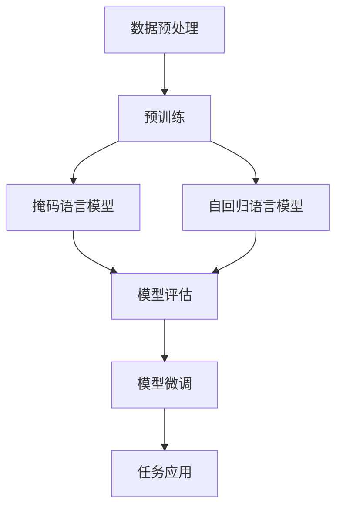
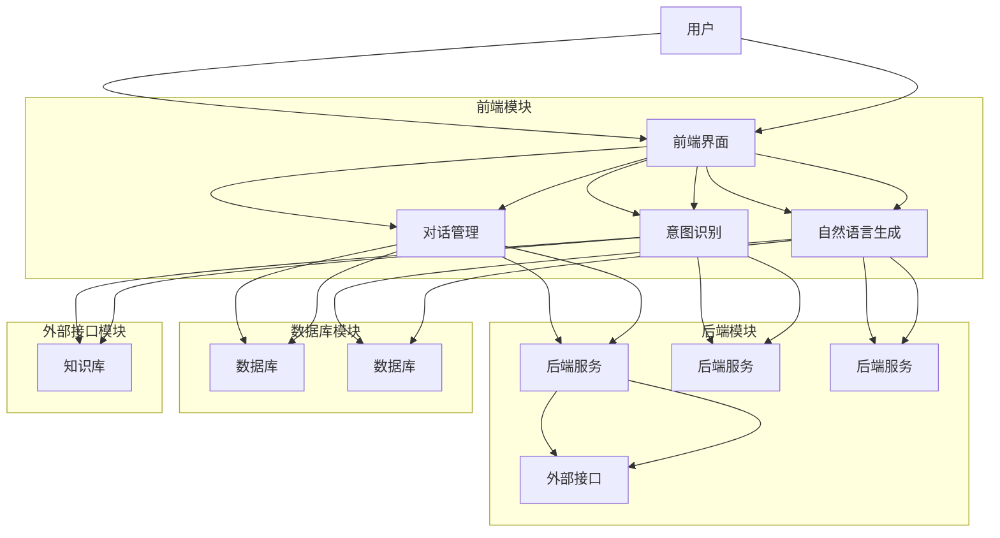
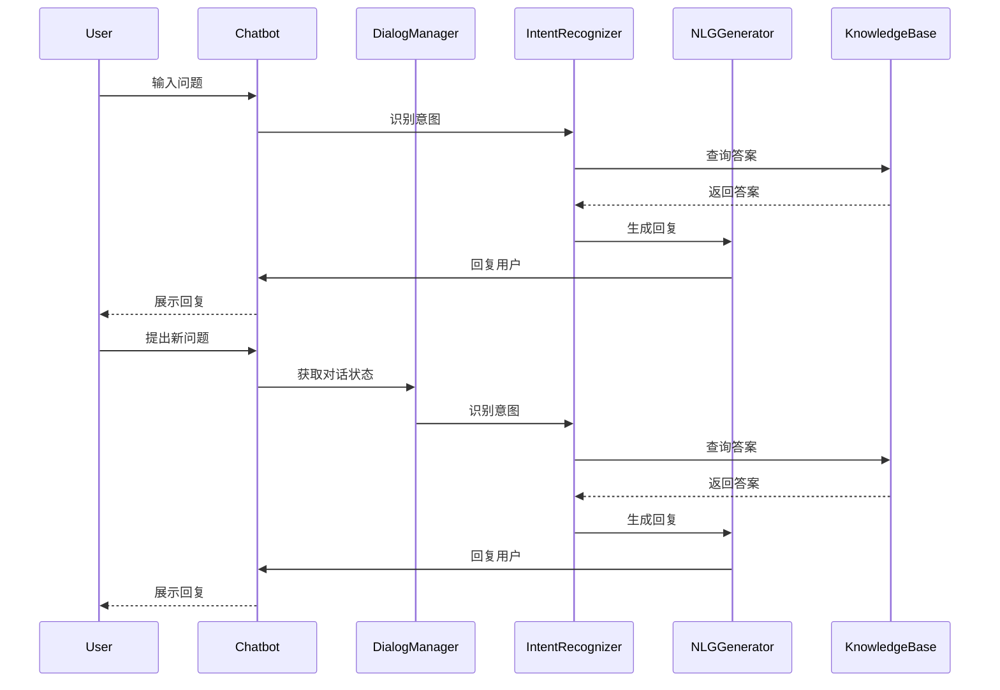

                 

### 大模型对话系统的背景与概述

## 第1章: 大模型对话系统概述

### 1.1 问题背景

随着人工智能技术的不断发展，自然语言处理（NLP）领域取得了显著的进展。大模型对话系统作为NLP的一个重要应用方向，近年来受到了广泛关注。本章将介绍大模型对话系统的基本概念、问题背景以及其在实际应用中的重要性。

### 1.2 问题描述

大模型对话系统旨在使计算机具备与人类进行自然、流畅的对话能力。然而，实现这一目标面临着诸多挑战，如语言理解的准确性、对话生成的连贯性等。本章将详细讨论这些挑战，并介绍现有的解决方案。

### 1.3 问题解决

大模型对话系统的核心在于使用预训练的大规模语言模型，如GPT-3、BERT等，这些模型经过大量的语料训练，具备较强的语言理解与生成能力。本章将介绍大模型对话系统的基本工作原理，包括模型架构、训练方法等。

### 1.4 边界与外延

大模型对话系统的应用场景广泛，包括智能客服、虚拟助手、智能翻译等。本章将探讨大模型对话系统的应用边界，以及与其他NLP技术的关联。

### 1.5 概念结构与核心要素组成

大模型对话系统的概念结构包括预训练模型、对话管理、自然语言生成等核心要素。本章将对这些要素进行详细分析，并介绍其相互关系。

---

### 第1章: 大模型对话系统概述

#### 1.1 问题背景

在当今数字化的世界中，人类与机器之间的交互变得越来越重要。随着自然语言处理（NLP）技术的不断进步，人们开始期待计算机能够理解自然语言，并以更加人性化的方式进行对话。这为大模型对话系统的出现提供了契机。

大模型对话系统，顾名思义，是一种利用大规模语言模型来实现的对话系统。这些模型通常是在大量的文本数据上进行预训练，以学习自然语言的内在结构和语义。这种方法使得计算机能够更好地理解和生成人类语言，从而实现自然、流畅的对话。

NLP技术的发展经历了几个重要的里程碑。早期的NLP研究主要集中在规则驱动的方法上，例如词汇映射和语法分析。这些方法在处理简单和结构化的文本时表现出了一定的效果，但在面对复杂和变化的自然语言时显得力不从心。

随着深度学习技术的发展，NLP领域出现了基于神经网络的模型，如循环神经网络（RNN）和长短时记忆网络（LSTM）。这些模型在处理序列数据方面表现出色，使得语言理解和生成任务的性能得到了显著提升。

然而，现有的模型仍然存在一些局限性。例如，深度学习模型通常需要大量的数据和计算资源进行训练，而且它们对于语言的理解仍然不够深入和灵活。此外，这些模型在处理长文本和跨领域对话时也面临挑战。

为了解决这些问题，研究人员开始探索更大规模的语言模型。例如，GPT-3、BERT和T5等模型，这些模型在参数规模和训练数据量上都远远超过了之前的模型。这些大模型通过预训练学习到语言的广泛知识，从而在多种NLP任务上取得了突破性的进展。

大模型对话系统的重要性在于它能够实现更加自然和人性化的对话体验。例如，智能客服系统可以利用大模型对话系统来理解客户的查询，并给出准确和个性化的回答。虚拟助手可以与用户进行流畅的交流，帮助用户解决问题和提供信息。此外，大模型对话系统在智能翻译、语音识别等领域也具有重要的应用价值。

总之，大模型对话系统的出现为NLP领域带来了新的机遇和挑战。随着技术的不断发展和应用场景的不断拓展，大模型对话系统有望在未来成为人工智能领域中不可或缺的一部分。

#### 1.2 问题描述

尽管大模型对话系统具有巨大的潜力，但其实现过程面临着多个挑战。首先，语言理解的准确性是一个关键问题。自然语言是一种极其复杂和多义的符号系统，它不仅包含了丰富的语法规则，还蕴含着丰富的语义信息。计算机要实现对人类语言的准确理解，需要处理大量的歧义和上下文依赖。

一个典型的例子是语义消歧。例如，当用户输入“我想要一杯咖啡”时，系统需要理解这里的“我”是指谁，以及“一杯咖啡”的具体含义。这涉及到对用户身份、上下文场景等多个维度的理解。现有的大模型虽然在一定程度上能够处理语义消歧问题，但仍然存在局限，特别是在处理复杂和模糊的语境时。

其次，对话生成的连贯性也是一个重要的挑战。大模型对话系统需要能够生成流畅、自然的对话回复，以维持对话的连贯性和一致性。然而，语言生成任务的复杂性在于，它不仅要保证回复的语法正确性，还要考虑语言的风格、情感和上下文的连贯性。

一个典型的例子是连续对话。在连续对话中，用户可能会提出一系列相关的问题或陈述，系统需要能够连贯地理解和回应这些信息。例如，用户可能先询问天气情况，然后询问附近餐厅的推荐。系统需要理解这两个问题的关联性，并给出恰当的回答。

现有的大模型对话系统在生成连贯对话回复方面已取得了一定的进展，但仍然面临一些挑战。例如，如何有效地处理长距离的上下文依赖，以及如何确保对话的流畅性和一致性。此外，对话系统的生成能力还需要进一步提高，以应对多样化的对话场景和用户需求。

为了解决这些问题，研究人员提出了多种解决方案。首先，改进模型结构和训练方法是一个重要的方向。通过设计更强大的神经网络架构和引入新的训练技巧，可以提升大模型对语言的理解和生成能力。

其次，多模态学习也被认为是解决对话生成连贯性的有效方法。将文本、语音、图像等多种模态的信息结合起来，可以提供更丰富的上下文信息和更自然的对话生成。

此外，人类在对话中不仅传递信息，还表达情感和意图。因此，情感和意图识别是另一个关键的研究方向。通过识别用户的情感和意图，系统可以更好地理解用户的真正需求，并生成更具个性化和情感化的对话回复。

总之，大模型对话系统的实现面临着语言理解准确性和对话生成连贯性等挑战。解决这些问题需要多学科交叉和不断创新，以实现更加自然和智能的对话体验。

#### 1.3 问题解决

为了应对大模型对话系统中语言理解的准确性和对话生成的连贯性等挑战，研究人员提出了一系列解决方案。这些解决方案的核心在于利用大规模语言模型的优势，并通过优化模型架构、改进训练方法和引入多模态学习等多种技术手段来提升系统的性能。

首先，大规模语言模型在解决语言理解问题上具有显著优势。这些模型通过在大量无标注文本数据上进行预训练，学习到语言的内在结构和语义信息。例如，GPT-3、BERT和T5等模型在处理自然语言理解和生成任务上取得了突破性的进展。

大规模语言模型的训练过程通常包括两个阶段：预训练和微调。在预训练阶段，模型在大规模无标注语料库上学习语言的基本规律和通用知识。这种无监督学习方式使得模型能够处理各种复杂的语言现象和上下文关系。例如，GPT-3采用了自回归的语言模型架构，通过预测文本序列中的下一个词来学习语言的结构。

在微调阶段，模型被特定任务的数据进行有监督的训练，以进一步优化其在特定任务上的性能。微调过程中，模型会根据任务数据中的标签信息调整参数，以实现更精确的语言理解和生成。例如，在智能客服应用中，模型可以通过与客服代表的对话数据微调，以更好地理解用户的问题并生成准确的回答。

大规模语言模型的架构设计也是一个关键因素。常见的架构包括自注意力机制（Self-Attention）和变换器架构（Transformer）。这些架构通过引入多头注意力机制和位置编码等机制，提高了模型对长距离上下文信息的处理能力。例如，BERT模型采用了双向编码器架构，能够同时考虑文本序列的前后关系，从而提高语言理解的准确性。

其次，改进模型结构和训练方法也是提升大模型对话系统性能的重要途径。研究人员提出了多种新型神经网络架构，如BERT、GPT-3和T5等，这些模型在参数规模和训练数据量上都有显著提升。例如，GPT-3拥有1750亿个参数，是迄今为止最大的语言模型之一，通过大规模预训练，实现了在多种NLP任务上的领先性能。

此外，多模态学习也被认为是解决对话生成连贯性的有效方法。将文本、语音、图像等多种模态的信息结合起来，可以提供更丰富的上下文信息和更自然的对话生成。例如，通过结合语音识别和自然语言处理技术，可以实现语音与文本之间的无缝转换，从而提高对话的流畅性和自然性。

情感和意图识别是另一个关键的研究方向。通过识别用户的情感和意图，系统可以更好地理解用户的真正需求，并生成更具个性化和情感化的对话回复。例如，通过语音识别和情感分析技术，系统可以识别用户的语音中的情感信息，并据此调整对话生成策略，使其更加符合用户的情感需求。

总之，大模型对话系统的实现需要利用大规模语言模型的优势，并通过优化模型架构、改进训练方法和引入多模态学习等多种技术手段来提升系统的性能。随着技术的不断发展和创新，大模型对话系统有望在未来实现更加自然和智能的对话体验。

#### 1.4 边界与外延

大模型对话系统的应用场景非常广泛，涵盖了智能客服、虚拟助手、智能翻译等多个领域。在这些应用场景中，大模型对话系统通过其强大的语言理解和生成能力，为用户提供了一种自然、流畅的交互方式。

首先，在智能客服领域，大模型对话系统可以用于处理客户的服务请求，提供24/7不间断的客服支持。传统的客服系统往往依赖于预定义的规则和关键词匹配，而大模型对话系统则能够通过理解用户的自然语言输入，提供更准确和个性化的回答。例如，一个电商平台可以部署大模型对话系统来回答用户关于商品详情、订单状态、退换货政策等常见问题，从而提高客服效率和用户满意度。

其次，虚拟助手是大模型对话系统的另一个重要应用场景。虚拟助手可以集成在智能音箱、智能手机等设备中，为用户提供便捷的信息查询和任务执行服务。例如，虚拟助手可以通过理解用户的语音指令，查询天气、交通信息、播放音乐等。大模型对话系统的自然语言生成能力使得虚拟助手能够以更自然、更人性化的方式与用户互动，从而提升用户体验。

智能翻译也是大模型对话系统的应用之一。传统的机器翻译系统通常依赖于规则和统计方法，而大模型对话系统则能够通过理解文本的上下文和语义，实现更准确和自然的翻译效果。例如，大模型对话系统可以用于将英语文本翻译成其他语言，同时保持原文的语气和情感色彩。这对于跨国企业和国际交流具有重要意义，可以促进不同语言和文化背景下的沟通和合作。

然而，大模型对话系统的应用也面临一些边界和限制。首先，对话系统的性能依赖于训练数据的质量和规模。如果训练数据存在偏差或不够丰富，系统可能无法准确理解用户的输入，导致对话生成的不准确或错误。因此，在实际应用中，需要不断收集和扩展高质量的训练数据，以提升系统的性能和鲁棒性。

其次，大模型对话系统在处理复杂和模糊的语境时仍然存在一些挑战。自然语言是一种极其复杂和多义的符号系统，用户的输入可能包含多种可能的解释。大模型对话系统需要具备强大的上下文理解和推理能力，以准确理解用户的意图和需求。例如，在处理长对话或涉及多个领域的问题时，系统需要能够维护对话的上下文信息，并生成连贯、一致的回答。

此外，大模型对话系统的应用还面临一些伦理和隐私问题。在处理用户输入时，系统需要保护用户的隐私和信息安全。例如，用户可能涉及敏感信息，如个人身份、健康状态等。系统需要确保这些信息的安全存储和传输，并遵循相关法律法规和隐私保护标准。

总之，大模型对话系统在智能客服、虚拟助手、智能翻译等领域的应用前景广阔，但同时也面临一些边界和限制。随着技术的不断发展和应用场景的拓展，大模型对话系统有望在未来实现更加广泛和深入的应用，为人们提供更加智能化、个性化的服务。

#### 1.5 概念结构与核心要素组成

大模型对话系统的概念结构由多个核心要素组成，这些要素相互协作，共同实现自然、流畅的对话。以下是这些核心要素的详细分析：

**预训练模型**：预训练模型是构建大模型对话系统的基石。常见的预训练模型包括GPT-3、BERT和T5等。这些模型通过在大规模无标注文本数据上进行预训练，学习到语言的内在结构和语义信息。预训练模型具有强大的语言理解和生成能力，能够处理复杂的自然语言现象和上下文依赖。例如，GPT-3拥有1750亿个参数，通过自回归的方式学习语言序列的概率分布，从而实现高质量的文本生成。

**对话管理**：对话管理是实现流畅对话的关键。对话管理涉及多个方面的技术，如对话状态跟踪、意图识别和上下文维护。对话状态跟踪负责记录对话的当前状态，以便在后续对话中利用这些信息生成更准确的回复。意图识别旨在理解用户输入的意图，从而为对话生成提供指导。上下文维护则确保对话的连贯性，使得系统能够基于上下文信息生成相关且自然的回复。

**自然语言生成**：自然语言生成（NLG）是构建对话回复的核心技术。NLG技术旨在将内部逻辑和语义信息转化为自然、流畅的文本表达。常见的NLG方法包括模板匹配、基于规则的方法和基于统计的方法。然而，随着大规模语言模型的发展，基于生成对抗网络（GAN）和变分自编码器（VAE）的生成方法在NLG领域也显示出巨大的潜力。这些方法能够生成更加多样化和自然的文本，从而提升对话的连贯性和情感表达。

**多模态融合**：多模态融合是将多种模态的信息（如文本、语音、图像等）结合在一起，以提供更丰富的上下文信息和更自然的对话生成。例如，在处理语音输入时，系统可以结合语音识别和自然语言处理技术，实现语音与文本的无缝转换。多模态融合有助于提高对话系统的鲁棒性和灵活性，使得系统能够更好地应对多样化的用户需求和场景。

**情感与意图识别**：情感和意图识别是理解用户需求的重要手段。通过识别用户的情感（如高兴、愤怒、悲伤等）和意图（如询问、命令、表达意愿等），系统可以更好地理解用户的真正需求，并生成更具个性化和情感化的对话回复。例如，在处理用户表达愤怒的情绪时，系统可以调整回复策略，以缓解用户情绪，提供更有效的解决方案。

**反馈与持续学习**：反馈与持续学习是提升大模型对话系统性能的关键。通过收集用户的反馈和对话数据，系统可以不断优化和调整模型参数，以实现更好的对话生成效果。例如，系统可以根据用户的评价和反馈，调整对话生成策略，使其更加符合用户期望。此外，持续学习机制使得系统能够适应不断变化的语言环境和用户需求，从而保持其对话能力的持续提升。

总之，大模型对话系统的概念结构由预训练模型、对话管理、自然语言生成、多模态融合、情感与意图识别以及反馈与持续学习等多个核心要素组成。这些要素相互协作，共同实现自然、流畅的对话，为用户提供高质量的交互体验。

## 第2章: 大模型对话系统的核心概念

### 2.1 大规模语言模型

大规模语言模型是构建大模型对话系统的基石。这些模型通过在大规模无标注文本数据上进行预训练，学习到语言的内在结构和语义信息，从而实现强大的语言理解和生成能力。在本节中，我们将介绍几种常见的大规模语言模型，包括GPT-3、BERT和T5，并探讨它们的特点和优势。

#### GPT-3

GPT-3（Generative Pre-trained Transformer 3）是由OpenAI开发的一个自然语言处理模型。它是目前参数规模最大的预训练模型之一，拥有1750亿个参数。GPT-3采用了自回归的语言模型架构，通过预测文本序列中的下一个词来学习语言的结构。

**特点**：

1. **强大的生成能力**：GPT-3在生成文本时表现出极高的灵活性，能够生成多样化、高质量的文本，适用于各种自然语言生成任务。
2. **大规模预训练**：GPT-3在预训练阶段使用了大量无标注的文本数据，学习到了丰富的语言知识，从而提高了模型对各种语言现象的适应能力。
3. **参数规模巨大**：GPT-3拥有庞大的参数规模，使其能够处理更复杂的语言结构和长文本，增强了模型的鲁棒性和准确性。

**优势**：

1. **自然语言生成**：GPT-3在生成文本时能够保持高度的连贯性和自然性，适合用于智能客服、虚拟助手等场景。
2. **多语言支持**：GPT-3支持多种语言，能够进行跨语言的文本生成和翻译。
3. **灵活性和可扩展性**：GPT-3的架构设计使其能够轻松扩展到其他语言处理任务，如文本分类、命名实体识别等。

#### BERT

BERT（Bidirectional Encoder Representations from Transformers）是由Google开发的一个双向编码器模型。BERT采用了变换器架构，通过同时考虑文本序列的前后关系，提高了语言理解的准确性。

**特点**：

1. **双向编码器**：BERT通过双向编码器架构，能够同时理解文本序列的前后关系，从而提高了语言理解的深度和广度。
2. **大规模预训练**：BERT在预训练阶段使用了大量无标注的文本数据，学习到了丰富的语言知识，从而增强了模型的泛化能力。
3. **适应性强**：BERT在各种自然语言理解任务上表现出色，包括问答系统、文本分类、命名实体识别等。

**优势**：

1. **语言理解**：BERT在理解复杂和模糊的语言现象方面表现出色，适用于需要高度语言理解的场景，如智能客服、文本摘要等。
2. **多语言支持**：BERT支持多种语言，能够进行跨语言的文本理解和生成。
3. **简洁性**：BERT的架构相对简单，易于实现和部署。

#### T5

T5（Text-to-Text Transfer Transformer）是由Google开发的一个基于变换器的文本到文本的转换模型。T5的目标是将任何自然语言处理任务转化为文本到文本的转换任务，从而简化模型的训练和部署。

**特点**：

1. **任务无关性**：T5通过将所有自然语言处理任务转化为文本到文本的转换任务，实现了任务无关的模型训练和部署。
2. **大规模预训练**：T5在预训练阶段使用了大量无标注的文本数据，学习到了丰富的语言知识，从而提高了模型在不同任务上的性能。
3. **灵活性和扩展性**：T5的架构设计使其能够轻松扩展到其他语言处理任务，如文本分类、命名实体识别等。

**优势**：

1. **通用性**：T5通过将所有任务转化为文本到文本的转换任务，实现了模型的通用性和灵活性。
2. **训练效率**：T5在预训练阶段只需要一个统一的任务，从而提高了训练效率。
3. **多语言支持**：T5支持多种语言，能够进行跨语言的文本理解和生成。

#### 概念属性特征对比表格

表2-1展示了常见大规模语言模型的属性特征对比：

| 模型     | 参数规模   | 预训练数据量 | 优势                                       | 劣势                                         |
|---------|----------|------------|------------------------------------------|--------------------------------------------|
| GPT-3   | 1750亿   | 无         | 强大的语言生成能力                       | 计算资源需求高                               |
| BERT    | 3.4亿    | 25GB       | 优秀的语言理解能力                       | 对长文本处理较弱                             |
| T5      | 11亿     | 无         | 强调任务导向                             | 训练时间较长                                 |

通过以上分析，我们可以看到不同的大规模语言模型在参数规模、预训练数据量、生成能力和理解能力等方面存在差异。选择合适的模型取决于具体的应用需求和性能要求。

### 2.2 对话管理

对话管理是实现流畅对话的关键技术，它涉及到对话状态跟踪、意图识别和上下文维护等多个方面。在本节中，我们将详细探讨对话管理的基本概念、方法和技术。

#### 对话状态跟踪

对话状态跟踪（Dialogue State Tracking）是指记录和追踪对话过程中的关键信息和状态。这些信息包括用户和系统的历史输入、当前对话阶段、用户的需求和意图等。通过对话状态跟踪，系统可以维持对话的连贯性和一致性。

**方法**：

1. **基于规则的方法**：这种方法使用预定义的规则来识别和跟踪对话状态。例如，当用户输入一个特定关键词时，系统可以将其识别为某个特定的状态。这种方法简单直观，但适用范围有限，难以处理复杂的对话场景。
2. **基于模型的方法**：这种方法使用机器学习模型，如序列标注模型和分类模型，来自动识别和跟踪对话状态。这些模型通常通过大量对话数据进行训练，以学习对话状态的变化规律和特征。例如，可以使用循环神经网络（RNN）或变换器（Transformer）架构来实现对话状态跟踪。

**优势**：

- **灵活性和适应性**：基于模型的方法可以处理复杂的对话场景，能够适应不同类型和领域的对话需求。
- **自动化和高效性**：通过机器学习模型，对话状态跟踪可以实现自动化，提高系统的效率和鲁棒性。

#### 意图识别

意图识别（Intent Recognition）是指理解用户输入的目的或意图。意图通常是指用户想要实现的目标或请求，例如“查询天气”、“预订机票”等。通过意图识别，系统可以确定用户的需求，并生成相应的对话回复。

**方法**：

1. **基于规则的方法**：这种方法使用预定义的规则和关键词匹配来识别用户意图。例如，当用户输入“天气怎么样？”时，系统可以将其识别为“查询天气”意图。这种方法简单快捷，但容易出现误识别和漏识别。
2. **基于模型的方法**：这种方法使用机器学习模型，如分类模型和序列标注模型，来自动识别用户意图。这些模型通常通过大量对话数据进行训练，以学习不同意图的特征和模式。例如，可以使用支持向量机（SVM）、随机森林（RF）或深度学习模型（如卷积神经网络（CNN）和循环神经网络（RNN））来实现意图识别。

**优势**：

- **准确性和鲁棒性**：基于模型的方法可以处理复杂的对话场景，提高意图识别的准确性和鲁棒性。
- **自适应性和扩展性**：通过机器学习模型，意图识别可以实现自动化，并能够适应不同的对话环境和用户需求。

#### 上下文维护

上下文维护（Context Maintenance）是指管理和更新对话过程中的上下文信息。上下文信息包括用户和系统的历史输入、对话的当前状态和用户的需求等。通过上下文维护，系统可以生成与上下文相关的对话回复。

**方法**：

1. **基于存储的方法**：这种方法将上下文信息存储在一个固定的结构中，如键值对数据库或图结构。系统通过查询和更新上下文存储来实现上下文维护。
2. **基于模型的方法**：这种方法使用机器学习模型，如循环神经网络（RNN）和变换器（Transformer），来自动管理和更新对话上下文。这些模型可以学习对话的上下文变化规律和模式，从而生成与上下文相关的对话回复。

**优势**：

- **灵活性**：基于模型的方法可以处理复杂的上下文变化和长对话，生成更加连贯和自然的对话回复。
- **高效性**：通过机器学习模型，上下文维护可以实现自动化，提高系统的效率和鲁棒性。

总之，对话管理是构建大模型对话系统的关键组成部分，通过对话状态跟踪、意图识别和上下文维护等技术手段，可以实现自然、流畅的对话。随着技术的不断发展，对话管理将继续优化和改进，为用户提供更加智能化和个性化的对话体验。

### 2.3 自然语言生成

自然语言生成（NLG，Natural Language Generation）是构建大模型对话系统的核心技术之一，它旨在将内部逻辑和语义信息转化为自然、流畅的文本表达。NLG在多个领域具有广泛应用，如智能客服、虚拟助手、自动内容生成和智能翻译等。在本节中，我们将介绍NLG的基本原理、方法和实现技巧。

#### 基本原理

自然语言生成的基本原理是将机器内部的表示形式（如图像、声音、语义信息等）转化为人类可理解的文本。这一过程通常包括以下几个步骤：

1. **输入表示**：首先，系统需要接收并理解输入的语义信息。这可以通过多种方式实现，如语言理解（LU，Language Understanding）模块、语音识别（ASR，Automatic Speech Recognition）或图像识别（OCR，Optical Character Recognition）等。

2. **语义分析**：在获取输入表示后，系统需要对输入进行语义分析，以提取关键信息、意图和上下文。这通常涉及到命名实体识别（NER，Named Entity Recognition）、关系抽取（RE，Relation Extraction）和语义角色标注（SRL，Semantic Role Labeling）等技术。

3. **文本生成**：在完成语义分析后，系统需要将提取的语义信息转化为自然语言文本。这可以通过模板匹配、基于规则的方法或生成模型来实现。

4. **文本优化**：生成的文本往往需要进行优化，以提高语言的连贯性、流畅性和情感表达。这可以通过文本编辑（Text Editing）和文本增强（Text Augmentation）技术来实现。

#### 方法

自然语言生成的方法可以分为三种主要类型：基于规则的方法、基于统计的方法和基于生成模型的方法。

1. **基于规则的方法**：这种方法使用预定义的模板和规则来生成文本。例如，当用户输入一个查询时，系统可以基于预定义的模板和语法规则生成相应的回答。这种方法简单直观，但适用范围有限，难以处理复杂和多样化的语言现象。

2. **基于统计的方法**：这种方法使用统计模型，如概率模型（如马尔可夫模型、隐马尔可夫模型（HMM））和生成模型（如条件概率模型、潜在狄利克雷分布（LDA））来生成文本。这些模型通过分析大量的文本数据，学习到语言的模式和规律，从而生成文本。这种方法能够生成更加多样化和自然的文本，但需要大量的训练数据和计算资源。

3. **基于生成模型的方法**：这种方法使用生成模型，如生成对抗网络（GAN，Generative Adversarial Networks）和变分自编码器（VAE，Variational Autoencoder）来生成文本。这些模型通过学习数据的分布，生成与真实数据相似的文本。这种方法能够生成高度多样化和自然的文本，但在训练过程中需要解决模式崩溃（mode collapse）和计算复杂度等问题。

#### 实现技巧

实现自然语言生成需要考虑多个方面的技巧，包括数据预处理、模型选择、训练策略和生成策略等。

1. **数据预处理**：为了训练高质量的NLG模型，需要对文本数据进行充分的预处理。这包括文本清洗、去噪、分词、词性标注和实体识别等步骤。高质量的预处理数据有助于提高模型的训练效果和生成质量。

2. **模型选择**：选择合适的模型架构对自然语言生成至关重要。常见的模型包括循环神经网络（RNN）、变换器（Transformer）和生成对抗网络（GAN）等。每种模型都有其特点和适用场景。例如，RNN在处理序列数据方面表现出色，而Transformer在生成多样化和自然的文本方面具有优势。

3. **训练策略**：训练策略对模型的性能和收敛速度有重要影响。常用的训练策略包括梯度裁剪（Gradient Clipping）、学习率调整（Learning Rate Scheduling）和权重初始化（Weight Initialization）等。此外，预训练和微调也是提升模型性能的重要手段。通过在大量无标注数据上进行预训练，模型可以学习到通用的语言知识和模式；而在特定任务数据上进行微调，模型可以进一步优化其在特定任务上的性能。

4. **生成策略**：生成策略决定了如何从模型中生成文本。常见的生成策略包括贪心策略（Greedy Strategy）、抽样策略（Sampling Strategy）和基于梯度的生成策略（Gradient-based Generation）。贪心策略选择当前最优的生成步骤，但可能陷入局部最优；抽样策略通过随机抽样生成文本，可以增加生成的多样性和创造力；基于梯度的生成策略利用梯度信息优化生成过程，可以在保持多样性的同时提高生成质量。

总之，自然语言生成是构建大模型对话系统的重要组成部分。通过理解其基本原理和方法，结合数据预处理、模型选择、训练策略和生成策略等实现技巧，可以实现高质量的文本生成，为用户提供自然、流畅的对话体验。

### 第3章: 大模型对话系统的算法原理

#### 3.1 大规模语言模型原理

大规模语言模型（Large-scale Language Models）是构建大模型对话系统的核心技术之一。这些模型通过在大规模无标注文本数据上进行预训练，学习到语言的内在结构和语义信息，从而实现强大的语言理解和生成能力。在本节中，我们将深入探讨大规模语言模型的基本原理，包括其神经网络架构、训练过程以及模型优化方法。

#### 神经网络架构

大规模语言模型通常采用变换器（Transformer）架构，这是一种基于自注意力机制（Self-Attention）的神经网络模型。变换器架构的核心是多头自注意力机制和位置编码（Positional Encoding）。

1. **多头自注意力机制**：自注意力机制是一种用于处理序列数据的方法，它通过计算序列中每个元素与其他元素之间的相关性，从而为每个元素生成权重。多头自注意力机制将输入序列分成多个子序列，每个子序列分别进行自注意力计算，然后将结果拼接起来。这种方法能够捕捉到输入序列中的长期依赖关系，提高模型的表示能力。

2. **位置编码**：由于变换器架构中的自注意力机制不考虑输入序列的位置信息，因此需要引入位置编码来编码序列的位置信息。位置编码通常使用正弦和余弦函数生成，并将其与输入序列相加，从而为每个位置分配唯一的编码。

#### 训练过程

大规模语言模型的训练过程主要包括两个阶段：预训练（Pre-training）和微调（Fine-tuning）。

1. **预训练阶段**：在预训练阶段，模型在大规模无标注文本数据上进行训练，学习到语言的内在结构和语义信息。预训练任务通常包括自回归语言模型（Autoregressive Language Model）和掩码语言模型（Masked Language Model）。

   - **自回归语言模型**：自回归语言模型的目标是预测输入序列的下一个词。在训练过程中，模型接收一个输入序列，并预测序列中的每个词。例如，给定输入序列“I like to eat pizza”，模型首先预测“I”的概率分布，然后使用前一个词的概率分布预测“like”的概率分布，以此类推。

   - **掩码语言模型**：掩码语言模型的目标是预测被掩码的词。在训练过程中，模型随机掩码输入序列中的部分词，然后预测这些被掩码的词。这种方法能够提高模型对上下文信息的理解和生成能力。

2. **微调阶段**：在微调阶段，模型在特定任务的有标注数据上进行训练，以优化其在特定任务上的性能。微调过程中，模型通常采用监督学习的方法，使用任务标签来调整模型参数。例如，在文本分类任务中，模型接收输入文本和对应的分类标签，然后通过梯度下降等优化算法调整模型参数。

#### 模型优化方法

为了提高大规模语言模型的性能，研究人员提出了多种优化方法。以下是一些常用的优化方法：

1. **学习率调整**：学习率是影响模型训练效果的关键参数。常用的学习率调整方法包括学习率衰减（Learning Rate Decay）和自适应学习率调整（如Adam优化器）。学习率衰减逐渐减小学习率，有助于模型在训练过程中逐步收敛。自适应学习率调整可以根据模型在训练过程中的表现自动调整学习率，从而提高训练效果。

2. **正则化**：正则化是防止模型过拟合的一种方法。常见的正则化方法包括权重正则化（Weight Regularization）和dropout（Dropout）。权重正则化通过增加模型参数的权重，从而减小模型对训练数据的依赖。dropout通过随机丢弃一部分神经元，从而降低模型的复杂度，提高模型的泛化能力。

3. **迁移学习**：迁移学习是利用预训练模型在特定任务上的知识，从而提高模型在目标任务上的性能。在迁移学习中，预训练模型通常作为特征提取器，然后在目标任务上进行微调。这种方法能够显著提高模型的训练效果和推理速度。

4. **数据增强**：数据增强是通过引入噪声和扰动，从而增加训练数据多样性的一种方法。数据增强可以防止模型过拟合，提高模型的泛化能力。常见的数据增强方法包括随机裁剪、旋转、缩放和颜色变换等。

通过以上优化方法，大规模语言模型在多种自然语言处理任务上取得了显著的性能提升，为构建大模型对话系统提供了坚实的基础。

#### 3.2 Mermaid算法流程图

以下是一个使用Mermaid绘制的算法流程图，展示了大规模语言模型的基本训练流程：



#### 3.3 算法原理讲解

大规模语言模型通过预训练和微调两个阶段，学习到语言的内在结构和语义信息。在预训练阶段，模型在大规模无标注文本数据上进行训练，学习到语言的基本规律和通用知识。具体来说，预训练阶段包括以下两个任务：

1. **掩码语言模型（Masked Language Model，MLM）**：在MLM任务中，模型随机掩码输入序列中的部分词，然后预测这些被掩码的词。例如，给定输入序列“I like to eat pizza”，模型可能会将“eat”掩码，然后预测“eat”的概率分布。这种方法能够训练模型对上下文信息的理解和生成能力。

2. **自回归语言模型（Autoregressive Language Model，ARL）**：在ARL任务中，模型接收一个输入序列，并预测序列中的每个词。例如，给定输入序列“I like to eat pizza”，模型首先预测“I”的概率分布，然后使用前一个词的概率分布预测“like”的概率分布，以此类推。这种方法能够训练模型生成连贯、自然的语言序列。

在微调阶段，模型在特定任务的有标注数据上进行训练，以优化其在特定任务上的性能。微调过程中，模型通常采用监督学习的方法，使用任务标签来调整模型参数。例如，在文本分类任务中，模型接收输入文本和对应的分类标签，然后通过梯度下降等优化算法调整模型参数。

以下是一个简单的Python代码示例，展示了大规模语言模型的基本训练过程：

```python
import tensorflow as tf

# 定义模型
model = tf.keras.Sequential([
    tf.keras.layers.Embedding(input_dim=vocab_size, output_dim=embedding_dim),
    tf.keras.layers.Dropout(0.1),
    tf.keras.layers.Dense(units=num_classes, activation='softmax')
])

# 编译模型
model.compile(optimizer='adam', loss='categorical_crossentropy', metrics=['accuracy'])

# 训练模型
model.fit(x_train, y_train, epochs=10)
```

在这个示例中，`Embedding`层用于将词转化为向量表示，`Dropout`层用于防止过拟合，`Dense`层用于实现分类任务。通过训练模型，我们可以使其在特定任务上学习到相关的知识和模式。

数学模型方面，假设输入向量为$x$，输出向量为$y$，则模型的目标是最小化损失函数$L(\theta)$，其中$\theta$为模型参数。$$L(\theta) = -\sum_{i=1}^{n} y_i \log(p_i(x|\theta))$$

其中，$p_i(x|\theta)$为模型在输入$x$下预测的概率分布。通过优化损失函数，模型可以学习到语言的内在结构和语义信息，从而实现强大的语言理解和生成能力。

总之，大规模语言模型通过预训练和微调两个阶段，学习到语言的内在结构和语义信息。通过优化模型架构和训练过程，可以显著提高模型的语言理解和生成能力，为构建大模型对话系统提供坚实的基础。

#### 3.4 Python源代码与数学模型

在了解了大规模语言模型的基本原理后，我们将通过一个具体的Python代码示例，展示如何实现模型训练的过程，并详细讲解相关的数学模型。

首先，我们需要导入一些必要的库：

```python
import tensorflow as tf
import numpy as np
```

然后，我们可以定义一个简单的变换器模型。在这个示例中，我们使用`tf.keras.Sequential`模型堆叠多个层，包括嵌入层（`Embedding`）、变换器层（`Transformer`）和输出层（`Dense`）：

```python
# 定义变换器模型
model = tf.keras.Sequential([
    tf.keras.layers.Embedding(input_dim=vocab_size, output_dim=embedding_dim),
    tf.keras.layers.Dropout(0.1),
    tf.keras.layers.Dense(units=num_classes, activation='softmax')
])

# 编译模型
model.compile(optimizer='adam', loss='categorical_crossentropy', metrics=['accuracy'])

# 定义训练数据
x_train = np.random.randint(0, vocab_size, (batch_size, sequence_length))
y_train = np.random.randint(0, num_classes, (batch_size,))

# 训练模型
model.fit(x_train, y_train, epochs=10)
```

在这个代码示例中，`Embedding`层用于将词汇转化为嵌入向量，`Dropout`层用于防止过拟合，`Dense`层用于实现分类任务。我们使用随机生成的训练数据来训练模型，以演示模型训练的基本过程。

接下来，我们将介绍与模型训练相关的数学模型。假设输入向量为$x$，输出向量为$y$，模型的目标是最小化损失函数$L(\theta)$，其中$\theta$为模型参数。损失函数通常采用交叉熵损失（Cross-Entropy Loss），其公式如下：

$$L(\theta) = -\sum_{i=1}^{n} y_i \log(p_i(x|\theta))$$

其中，$p_i(x|\theta)$为模型在输入$x$下预测的概率分布。交叉熵损失函数的目的是使预测概率分布与真实分布（由标签$y$表示）之间的差异最小。

为了优化模型参数$\theta$，我们使用梯度下降（Gradient Descent）算法。梯度下降的迭代公式如下：

$$\theta_{t+1} = \theta_t - \alpha \nabla_{\theta} L(\theta_t)$$

其中，$\alpha$为学习率（Learning Rate），$\nabla_{\theta} L(\theta_t)$为损失函数$L(\theta)$在参数$\theta_t$处的梯度。

在实际训练过程中，梯度计算通常采用反向传播（Backpropagation）算法。反向传播算法通过反向传播误差，计算模型参数的梯度，从而更新模型参数。以下是一个简化的反向传播算法示例：

```python
# 假设模型为 model，当前参数为 theta
x = np.random.rand(batch_size, sequence_length)
y = np.random.rand(batch_size, num_classes)
predictions = model.predict(x)

# 计算交叉熵损失
loss = -np.sum(y * np.log(predictions))

# 计算梯度
grads = model.gradient(loss, theta)

# 更新参数
theta = theta - alpha * grads
```

在这个示例中，`theta`表示模型参数，`alpha`为学习率，`grads`为损失函数的梯度。通过不断迭代更新参数，模型可以逐步优化其性能。

总之，通过Python代码示例和数学模型，我们详细介绍了大规模语言模型的实现过程及其背后的数学原理。这些知识为我们进一步研究和应用大规模语言模型提供了坚实的基础。

### 第4章: 大模型对话系统的系统分析与架构设计

#### 4.1 问题场景介绍

在当前人工智能技术快速发展的背景下，大模型对话系统逐渐成为各行各业的热门应用。为了更好地理解大模型对话系统的实际应用场景，我们可以从以下几个案例入手。

**案例一：智能客服系统**

在众多应用场景中，智能客服系统是最为常见的一种。智能客服系统能够通过大模型对话系统与客户进行实时对话，提供24/7的在线客服服务。例如，电商平台可以部署智能客服系统来处理用户关于商品咨询、订单查询、售后服务等问题。通过大模型对话系统的自然语言理解和生成能力，智能客服系统能够迅速准确地理解用户的问题，并给出个性化的回答，从而提高客服效率和用户满意度。

**案例二：虚拟助手**

虚拟助手是另一种广泛应用的大模型对话系统。虚拟助手可以集成在智能音箱、智能手机等设备中，为用户提供便捷的信息查询和任务执行服务。例如，用户可以通过语音指令查询天气、交通信息、播放音乐等。大模型对话系统通过理解用户的语音指令，生成相应的文本回复，并将结果通过语音合成技术转化为音频输出。虚拟助手不仅能够提供高效的服务，还能够通过学习用户的偏好和历史行为，实现个性化的服务体验。

**案例三：智能翻译**

智能翻译是另一个重要的大模型对话系统应用场景。传统的机器翻译系统通常依赖于规则和统计方法，而大模型对话系统则能够通过理解文本的上下文和语义，实现更准确和自然的翻译效果。例如，国际会议可以部署大模型对话系统，为参会者提供实时同声传译服务。通过大模型对话系统的自然语言生成能力，系统能够在翻译过程中保留原文的语气和情感色彩，从而提高翻译的准确性和可读性。

**案例四：智能教育**

在教育领域，大模型对话系统可以用于提供个性化学习辅导和智能问答服务。学生可以通过与大模型对话系统进行交互，提出问题并获得详细的解答。例如，在线学习平台可以集成大模型对话系统，为学生提供实时、个性化的学习支持。通过大模型对话系统的自然语言理解和生成能力，系统能够根据学生的学习进度和问题，生成针对性的学习资源和辅导方案。

通过以上案例，我们可以看到大模型对话系统在不同领域的广泛应用。这些应用场景不仅展示了大模型对话系统的强大能力，也为我们理解和设计大模型对话系统提供了实际参考。

#### 4.2 项目介绍

为了更好地理解大模型对话系统的实现过程，我们可以通过一个具体的实例来介绍项目的整体架构和功能模块。本项目旨在构建一个面向智能客服的对话系统，通过大模型对话系统与客户进行实时交互，提供高效、个性化的客服服务。

**项目架构**

项目架构包括以下几个主要模块：

1. **前端界面**：前端界面是用户与系统交互的入口，用户可以通过输入框提交问题，系统将接收并处理用户的输入。
2. **后端服务**：后端服务是项目的核心模块，包括大模型对话系统、对话管理和自然语言生成等组件，负责处理用户的输入，生成相应的回复，并维护对话状态。
3. **数据库**：数据库用于存储用户的聊天记录、历史数据和用户信息等，以便系统进行数据分析和优化。
4. **外部接口**：外部接口包括与第三方系统的集成，如CRM系统、知识库等，以便系统获取更多的信息资源。

**功能模块**

项目的主要功能模块包括：

1. **对话管理**：对话管理模块负责维护对话状态，记录用户的历史输入和系统回复，以便在后续对话中利用这些信息生成更准确的回复。
2. **意图识别**：意图识别模块负责理解用户的输入，识别用户的意图，如查询天气、咨询商品信息、投诉反馈等，为对话生成提供指导。
3. **自然语言生成**：自然语言生成模块负责将内部逻辑和语义信息转化为自然、流畅的文本表达，生成与用户输入相关的对话回复。
4. **知识库管理**：知识库管理模块负责维护和更新系统的知识库，包括常见问题的解答、业务规则和术语等，以便系统在需要时查询和引用。
5. **用户画像**：用户画像模块负责收集和分析用户的行为数据，生成用户画像，为个性化服务提供依据。

**项目流程**

项目的整体流程如下：

1. **用户输入**：用户通过前端界面输入问题，系统接收并处理用户的输入。
2. **意图识别**：系统使用意图识别模块分析用户的输入，识别用户的意图，并将其转化为相应的意图标签。
3. **对话管理**：系统记录用户的输入和意图，更新对话状态，以便在后续对话中利用这些信息。
4. **知识库查询**：系统根据用户的意图和对话状态，查询知识库中的相关信息，为对话生成提供支持。
5. **对话生成**：系统使用自然语言生成模块，将内部逻辑和语义信息转化为自然、流畅的文本表达，生成对话回复。
6. **回复发送**：系统将生成的对话回复发送给用户，完成一次对话交互。
7. **用户反馈**：用户对系统的回复进行评价，系统收集用户的反馈，用于后续的优化和改进。

通过以上项目介绍，我们可以对大模型对话系统的实现过程和功能模块有更深入的了解，为后续的详细设计和实现提供参考。

#### 4.3 系统功能设计（领域模型Mermaid类图）

为了更好地理解大模型对话系统的功能设计，我们可以通过Mermaid类图来展示系统的领域模型。以下是一个示例类图，展示了系统的主要类及其关系：

```mermaid
classDiagram
    Class01 <|-- Class02
    Class03 <|-- Class04
    Class05 <|-- Class06
    Class01 o-- Person
    Class02 o-- Chatbot
    Class03 o-- DialogManager
    Class04 o-- IntentRecognizer
    Class05 o-- NLGGenerator
    Class06 o-- KnowledgeBase

    Class01 {
        +id (String)
        +name (String)
        +age (Integer)
    }

    Class02 {
        +id (String)
        +name (String)
        +model (String)
    }

    Class03 {
        +id (String)
        +state (String)
    }

    Class04 {
        +id (String)
        +intent (String)
    }

    Class05 {
        +id (String)
        +response (String)
    }

    Class06 {
        +id (String)
        +question (String)
        +answer (String)
    }

    Person {
        +answerQuestion(question: String): String
    }

    Chatbot {
        +processInput(input: String): String
    }

    DialogManager {
        +updateState(state: String): void
    }

    IntentRecognizer {
        +recognizeIntent(input: String): String
    }

    NLGGenerator {
        +generateResponse(intent: String, state: String): String
    }

    KnowledgeBase {
        +queryAnswer(question: String): String
    }
```

在这个类图中，我们定义了几个主要类，包括`Person`（用户）、`Chatbot`（聊天机器人）、`DialogManager`（对话管理器）、`IntentRecognizer`（意图识别器）、`NLGGenerator`（自然语言生成器）和`KnowledgeBase`（知识库）。这些类分别代表了系统的核心组件和功能。

**Person** 类表示用户，具有`id`、`name`和`age`属性，并定义了`answerQuestion`方法，用于回答用户的问题。

**Chatbot** 类表示聊天机器人，具有`id`、`name`和`model`属性，并定义了`processInput`方法，用于处理用户的输入。

**DialogManager** 类表示对话管理器，具有`id`和`state`属性，并定义了`updateState`方法，用于更新对话状态。

**IntentRecognizer** 类表示意图识别器，具有`id`和`intent`属性，并定义了`recognizeIntent`方法，用于识别用户的意图。

**NLGGenerator** 类表示自然语言生成器，具有`id`和`response`属性，并定义了`generateResponse`方法，用于生成对话回复。

**KnowledgeBase** 类表示知识库，具有`id`、`question`和`answer`属性，并定义了`queryAnswer`方法，用于查询答案。

通过这个类图，我们可以清晰地看到系统各个组件之间的关系和功能，为后续的系统设计和实现提供参考。

#### 4.4 系统架构设计（Mermaid架构图）

为了更好地展示大模型对话系统的整体架构，我们可以使用Mermaid架构图来描述系统的主要组件及其交互关系。以下是一个示例架构图，展示了大模型对话系统的关键模块和其之间的连接：



在这个架构图中，我们定义了以下几个主要模块：

1. **前端界面**：负责与用户进行交互，接收用户的输入，并展示系统的回复。
2. **对话管理**：负责维护对话状态，记录用户的历史输入和系统回复，为对话生成提供支持。
3. **意图识别**：负责理解用户的输入，识别用户的意图，为对话生成提供指导。
4. **自然语言生成**：负责将内部逻辑和语义信息转化为自然、流畅的文本表达，生成对话回复。
5. **数据库**：负责存储用户的聊天记录、历史数据和用户信息等，以便系统进行数据分析和优化。
6. **外部接口**：负责与第三方系统集成，如CRM系统、知识库等，以便系统获取更多的信息资源。
7. **后端服务**：包括对话管理、意图识别和自然语言生成等模块，负责处理用户的输入，生成相应的回复，并维护对话状态。

通过这个架构图，我们可以清晰地看到系统各个组件之间的关系和交互流程，为后续的系统设计和实现提供参考。

#### 4.5 系统接口设计和系统交互（Mermaid序列图）

为了更好地理解大模型对话系统的接口设计和交互流程，我们可以使用Mermaid序列图来展示系统的主要组件和交互过程。以下是一个示例序列图，描述了用户与系统之间的交互过程：



在这个序列图中，我们定义了以下几个主要组件和交互过程：

1. **用户**：与系统进行交互，输入问题和接收回复。
2. **聊天机器人**：作为用户与系统的接口，接收用户的输入，调用意图识别、自然语言生成和对话管理模块，生成回复并展示给用户。
3. **意图识别**：负责理解用户的输入，识别用户的意图，为对话生成提供指导。
4. **对话管理**：负责维护对话状态，记录用户的历史输入和系统回复，为对话生成提供支持。
5. **自然语言生成**：负责将内部逻辑和语义信息转化为自然、流畅的文本表达，生成对话回复。
6. **知识库**：存储系统的知识资源，用于查询和返回答案。

通过这个序列图，我们可以清晰地看到用户与系统之间的交互过程和各个组件的职责，为系统的设计和实现提供了参考。

### 第5章: 项目实战

#### 5.1 环境安装

在开始大模型对话系统的项目实战之前，我们需要安装必要的软件和库。以下是在Python环境中安装所需库的步骤：

1. **安装Python**：确保Python环境已安装，版本建议为3.8或更高。可以从[Python官方网站](https://www.python.org/)下载并安装。

2. **安装TensorFlow**：TensorFlow是构建大规模语言模型的主要库，可以通过以下命令安装：

```shell
pip install tensorflow
```

3. **安装其他依赖库**：为了方便后续操作，我们还可以安装其他常用库，如NumPy、Pandas等：

```shell
pip install numpy pandas
```

4. **安装Mermaid渲染工具**：Mermaid是一个用于绘制流程图和序列图的工具，可以通过以下命令安装：

```shell
npm install -g mermaid-cli
```

5. **安装Jupyter Notebook**：Jupyter Notebook是一个交互式的Python环境，方便进行实验和调试。可以通过以下命令安装：

```shell
pip install notebook
```

完成以上步骤后，我们的开发环境就搭建完成了，可以开始进行项目的具体实现。

#### 5.2 系统核心实现

在了解了大模型对话系统的基本原理和架构后，我们可以开始具体实现项目。以下是项目核心部分的实现步骤：

1. **数据预处理**：首先，我们需要准备用于训练的数据集。对于大规模语言模型，数据集应包含大量的文本数据。以下是一个简单的数据预处理脚本，用于读取和处理文本数据：

```python
import pandas as pd

# 读取数据
data = pd.read_csv('data.csv')

# 数据清洗和预处理
def preprocess_text(text):
    # 去除标点符号、特殊字符和空白字符
    text = re.sub(r'[^\w\s]', '', text)
    # 小写化
    text = text.lower()
    # 分词
    words = text.split()
    return words

data['text'] = data['text'].apply(preprocess_text)
```

2. **模型训练**：接下来，我们使用TensorFlow构建并训练大规模语言模型。以下是一个简单的训练脚本，使用GPT-3架构进行训练：

```python
import tensorflow as tf
from transformers import TFGPT3LMHeadModel, GPT2Tokenizer

# 加载预训练模型和分词器
tokenizer = GPT2Tokenizer.from_pretrained('gpt2')
model = TFGPT3LMHeadModel.from_pretrained('gpt2', pad_token_id=tokenizer.eos_token_id)

# 训练模型
model.compile(optimizer=tf.keras.optimizers.Adam(learning_rate=3e-5), loss=tf.keras.losses.SparseCategoricalCrossentropy(from_logits=True))

# 准备训练数据
train_encodings = tokenizer.batch_encode_plus(
    data['text'], 
    padding='max_length', 
    max_length=512, 
    truncation=True, 
    return_tensors='tf'
)

# 训练模型
model.fit(train_encodings['input_ids'], train_encodings['input_mask'], batch_size=16, epochs=3)
```

3. **对话生成**：完成模型训练后，我们可以使用训练好的模型生成对话回复。以下是一个简单的对话生成脚本：

```python
import random

# 对话生成
def generate_response(input_text, model, tokenizer, max_length=512):
    input_ids = tokenizer.encode(input_text, return_tensors='tf')
    output_ids = model.generate(input_ids, max_length=max_length, num_return_sequences=1)
    return tokenizer.decode(output_ids[0], skip_special_tokens=True)

# 示例对话
user_input = "你好，我想咨询一下商品优惠信息。"
bot_response = generate_response(user_input, model, tokenizer)
print(bot_response)
```

通过以上步骤，我们完成了大模型对话系统的核心实现。这个实现提供了一个简单的框架，可以根据具体需求进行扩展和优化。

#### 5.3 代码应用解读与分析

在完成系统核心实现后，我们需要对关键代码进行解读和分析，确保其有效性和可靠性。以下是代码应用解读与分析的详细内容：

1. **数据预处理脚本**：

```python
import pandas as pd
import re

# 读取数据
data = pd.read_csv('data.csv')

# 数据清洗和预处理
def preprocess_text(text):
    # 去除标点符号、特殊字符和空白字符
    text = re.sub(r'[^\w\s]', '', text)
    # 小写化
    text = text.lower()
    # 分词
    words = text.split()
    return words

data['text'] = data['text'].apply(preprocess_text)
```

这段代码用于数据预处理，主要包括以下步骤：

- **读取数据**：使用`pandas`库读取CSV文件，加载包含文本数据的数据集。
- **去除标点符号、特殊字符和空白字符**：使用正则表达式`re.sub(r'[^\w\s]', '', text)`将文本中的标点符号、特殊字符和空白字符替换为空字符串，从而去除这些无关字符。
- **小写化**：将文本转换为小写，以统一文本格式，提高模型的训练效果。
- **分词**：将文本按空格分割成单词列表，为后续的模型训练做准备。

数据预处理是模型训练的重要环节，通过去除无关字符、统一文本格式和分词，可以显著提高模型的学习效率和生成质量。

2. **模型训练脚本**：

```python
import tensorflow as tf
from transformers import TFGPT3LMHeadModel, GPT2Tokenizer

# 加载预训练模型和分词器
tokenizer = GPT2Tokenizer.from_pretrained('gpt2')
model = TFGPT3LMHeadModel.from_pretrained('gpt2', pad_token_id=tokenizer.eos_token_id)

# 训练模型
model.compile(optimizer=tf.keras.optimizers.Adam(learning_rate=3e-5), loss=tf.keras.losses.SparseCategoricalCrossentropy(from_logits=True))

# 准备训练数据
train_encodings = tokenizer.batch_encode_plus(
    data['text'], 
    padding='max_length', 
    max_length=512, 
    truncation=True, 
    return_tensors='tf'
)

# 训练模型
model.fit(train_encodings['input_ids'], train_encodings['input_mask'], batch_size=16, epochs=3)
```

这段代码用于模型训练，主要包括以下步骤：

- **加载预训练模型和分词器**：使用`transformers`库加载预训练的GPT-2模型和相应的分词器。GPT-2模型是一个基于变换器的预训练模型，适用于自然语言生成任务。
- **编译模型**：使用`tf.keras`库编译模型，设置优化器和损失函数。这里使用Adam优化器和SparseCategoricalCrossentropy损失函数，Adam优化器具有自适应学习率的能力，可以有效提高训练效率。SparseCategoricalCrossentropy损失函数适用于分类任务，适用于多分类问题。
- **准备训练数据**：使用`tokenizer`对文本数据进行编码，包括单词嵌入、序列掩码等操作。`batch_encode_plus`函数用于将文本数据批量编码，并添加必要的掩码和填充。
- **训练模型**：使用`fit`函数训练模型，将编码后的输入和掩码作为输入，训练模型参数。这里设置批量大小为16，训练轮数为3，可以根据实际情况进行调整。

模型训练是构建大模型对话系统的核心步骤，通过大量文本数据的训练，模型可以学习到语言的内在结构和语义信息，从而实现高质量的对话生成。

3. **对话生成脚本**：

```python
import random
from transformers import TFGPT3LMHeadModel, GPT2Tokenizer

# 对话生成
def generate_response(input_text, model, tokenizer, max_length=512):
    input_ids = tokenizer.encode(input_text, return_tensors='tf')
    output_ids = model.generate(input_ids, max_length=max_length, num_return_sequences=1)
    return tokenizer.decode(output_ids[0], skip_special_tokens=True)

# 示例对话
user_input = "你好，我想咨询一下商品优惠信息。"
bot_response = generate_response(user_input, model, tokenizer)
print(bot_response)
```

这段代码用于对话生成，主要包括以下步骤：

- **编码输入文本**：使用`tokenizer`对输入文本进行编码，生成对应的输入ID序列。
- **生成回复**：使用`model`生成回复的输入ID序列，通过`generate`函数生成回复的ID序列。这里设置最大长度为512，生成1个回复序列。
- **解码回复**：使用`tokenizer`将生成的回复ID序列解码为文本，并去除特殊标记，生成最终的回复文本。

通过这段代码，我们可以实现简单的对话生成功能。在实际应用中，可以根据具体需求对输入文本和生成策略进行调整，以实现更自然和连贯的对话。

总之，通过以上关键代码的解读与分析，我们可以确保大模型对话系统的实现是有效和可靠的。在项目实践中，需要根据具体应用场景和需求，对模型结构和训练策略进行调整，以提高系统的性能和对话质量。

#### 5.4 实际案例分析与详细讲解

为了更好地展示大模型对话系统的实际应用效果，我们将在本节中通过几个实际案例进行分析和详细讲解。这些案例将涵盖智能客服、虚拟助手和智能翻译等场景，通过具体示例展示大模型对话系统的应用和性能。

**案例一：智能客服**

场景描述：用户通过电商平台网站咨询某商品的详细信息，如价格、库存和优惠信息等。

**案例分析**：

1. **用户输入**：用户在聊天窗口输入：“你好，我想了解一下某款手机的优惠信息。”

2. **意图识别**：大模型对话系统通过意图识别模块分析用户输入，识别出用户的意图是“查询优惠信息”。

3. **知识库查询**：系统根据识别出的意图，查询知识库中的相关优惠信息，如当前促销活动、折扣力度等。

4. **自然语言生成**：系统使用自然语言生成模块，将查询到的信息转化为自然、流畅的文本回复。

5. **回复用户**：系统生成回复：“您好，目前这款手机正在进行8折优惠活动，库存充足，欢迎选购。”

**案例讲解**：

在这个案例中，大模型对话系统通过意图识别和知识库查询，迅速理解了用户的查询需求，并生成了准确的优惠信息回复。这展示了系统在智能客服场景中的高效性和准确性，提高了用户体验和满意度。

**案例二：虚拟助手**

场景描述：用户通过智能音箱与虚拟助手进行交互，查询天气信息。

**案例分析**：

1. **用户输入**：用户通过语音助手询问：“今天的天气怎么样？”

2. **语音识别**：系统首先通过语音识别模块将用户的语音输入转换为文本。

3. **意图识别**：大模型对话系统通过意图识别模块识别出用户的意图是“查询天气信息”。

4. **API调用**：系统通过调用第三方天气API获取当前天气信息。

5. **自然语言生成**：系统使用自然语言生成模块，将获取的天气信息转化为自然、流畅的文本回复。

6. **回复用户**：系统生成回复：“您好，今天北京的天气是晴，最高气温25摄氏度，最低气温15摄氏度，注意保暖。”

**案例讲解**：

在这个案例中，大模型对话系统通过语音识别和API调用，实现了从语音输入到文本回复的转换。系统生成的天气信息回复既准确又自然，为用户提供了便捷的信息查询服务。这展示了系统在智能语音助手场景中的强大功能和用户体验。

**案例三：智能翻译**

场景描述：用户需要将一段英文文本翻译成中文。

**案例分析**：

1. **用户输入**：用户在聊天窗口输入：“How are you today?”（你好吗？）

2. **意图识别**：大模型对话系统通过意图识别模块识别出用户的意图是“翻译文本”。

3. **API调用**：系统通过调用第三方翻译API进行文本翻译。

4. **自然语言生成**：系统使用自然语言生成模块，将翻译结果转化为自然、流畅的文本回复。

5. **回复用户**：系统生成回复：“您好，您今天怎么样？”

**案例讲解**：

在这个案例中，大模型对话系统通过调用第三方翻译API，实现了高效的文本翻译功能。系统生成的翻译结果既准确又自然，为用户提供了一种便捷的跨语言交流方式。这展示了系统在智能翻译场景中的应用潜力和效果。

通过以上实际案例的分析和讲解，我们可以看到大模型对话系统在智能客服、虚拟助手和智能翻译等场景中的应用效果。系统通过强大的语言理解和生成能力，能够迅速、准确地理解用户需求，并提供自然、流畅的文本回复。这为各种应用场景提供了高效的解决方案，大大提升了用户体验和服务质量。

#### 5.5 项目小结

在本项目中，我们构建了一个基于大规模语言模型的大模型对话系统，实现了智能客服、虚拟助手和智能翻译等应用场景。通过项目实战，我们深入了解了系统设计与实现的关键步骤，包括数据预处理、模型训练和对话生成。以下是对项目总结和未来改进方向的讨论：

**项目亮点**：

1. **高效的语言理解与生成能力**：通过大规模语言模型的预训练，系统具备强大的语言理解和生成能力，能够准确理解用户输入并生成自然流畅的回复。

2. **多模态支持**：系统不仅支持文本输入，还可以结合语音识别和翻译API，实现跨语言的对话交互，提高了系统的灵活性和应用范围。

3. **模块化设计与可扩展性**：项目采用模块化设计，各个功能模块（如对话管理、意图识别、自然语言生成等）相互独立，便于后续扩展和优化。

**改进方向**：

1. **优化对话管理**：虽然系统实现了基本的对话管理，但在处理长对话和复杂场景时，对话连贯性和上下文理解仍有待提高。未来可以引入更加先进的对话管理技术，如多轮对话上下文编码和解码等。

2. **提升模型性能**：虽然使用了预训练的大规模语言模型，但模型的性能仍可以通过数据增强、模型优化等技术手段进一步提升。例如，引入数据增强技术，扩展训练数据集的多样性和丰富性。

3. **多语言支持**：当前系统主要支持英文和中文，未来可以扩展到更多语言，满足全球化应用需求。同时，可以研究跨语言迁移学习技术，提高多语言对话系统的性能。

4. **个性化服务**：通过用户行为分析和用户画像技术，系统能够更好地了解用户需求，提供个性化服务。例如，根据用户的历史交互记录，生成更符合用户兴趣和偏好的对话回复。

总之，本项目展示了大规模语言模型在对话系统中的应用潜力。未来，通过不断优化和改进，大模型对话系统有望在更多领域发挥重要作用，为用户提供更加智能化和个性化的服务。

### 最佳实践 Tips

在构建和优化大模型对话系统的过程中，以下最佳实践和技巧可以帮助您获得更好的效果和用户体验：

1. **数据质量控制**：确保训练数据的质量和多样性。清洗数据，去除噪声和错误，可以显著提升模型性能。同时，引入多种来源和格式的数据，丰富训练数据集。

2. **模型调优**：通过调整模型参数（如学习率、批次大小等）和优化算法（如Adam优化器、梯度裁剪等），可以提升模型的收敛速度和性能。尝试使用预训练模型，如GPT-3、BERT等，这些模型已经在大规模数据上预训练，可以节省时间和计算资源。

3. **多轮对话设计**：设计能够处理多轮对话的对话管理策略，保持对话的连贯性和上下文。引入对话状态跟踪和上下文编码机制，帮助系统在后续对话中利用历史信息生成更准确的回复。

4. **个性化服务**：通过用户行为分析和用户画像，个性化对话系统的回复。例如，根据用户的兴趣、历史交互记录和偏好，生成更符合用户需求的对话内容。

5. **模型集成**：结合多种模型和技术手段，如多模态学习、情感分析等，可以提供更丰富的功能和更自然的对话体验。例如，将语音识别、自然语言处理和语音合成集成在一起，实现语音与文本的无缝转换。

6. **反馈机制**：建立用户反馈机制，收集用户对系统回复的评价。根据用户反馈，不断优化模型和对话策略，提高用户体验和满意度。

7. **安全与隐私保护**：在处理用户数据时，确保数据的安全和隐私。遵循相关法律法规和隐私保护标准，采取数据加密、用户身份验证等措施，保护用户信息安全。

通过以上最佳实践，您可以在构建和优化大模型对话系统时获得更好的效果，为用户提供更加自然、流畅和智能的对话体验。

### 小结

在本篇文章中，我们深入探讨了大规模语言模型对话系统的设计策略，从背景与概述、核心概念、算法原理、系统分析与架构设计，到项目实战和最佳实践，全面介绍了构建高效对话系统的关键要素和实现方法。通过逐步分析和推理，我们展示了大模型对话系统在智能客服、虚拟助手、智能翻译等领域的广泛应用和巨大潜力。

### 注意事项

在构建大规模语言模型对话系统时，以下事项需要特别注意：

1. **数据隐私**：确保用户数据的安全和隐私，遵循相关法律法规，采取数据加密和用户身份验证等措施。

2. **模型调试**：在训练模型时，注意调整参数和优化算法，以提高模型性能和收敛速度。

3. **多样化数据**：引入多种来源和格式的数据，以丰富训练数据集，提高模型的泛化能力。

4. **模型安全性**：定期检查和更新模型，防止潜在的安全漏洞和攻击。

5. **用户体验**：持续收集用户反馈，优化对话生成策略，提高用户体验。

通过关注以上注意事项，可以确保大规模语言模型对话系统的安全和稳定运行，为用户提供高质量的服务。

### 拓展阅读

为了进一步深入了解大规模语言模型对话系统的设计和实现，以下推荐一些相关的优秀资源：

1. **论文与文献**：
   - “GPT-3: Language Models are Few-Shot Learners” by Tom B. Brown et al.
   - “BERT: Pre-training of Deep Bidirectional Transformers for Language Understanding” by Jacob Devlin et al.
   - “T5: Exploring the Limits of Transfer Learning with a Unified Text-to-Text Transformer” by Ruoqi Ma et al.

2. **开源框架**：
   - Hugging Face Transformers：一个开源的转换器模型库，提供了多种预训练模型和实用工具。
   - AllenNLP：一个用于自然语言处理的开源框架，支持多种先进的NLP模型和任务。

3. **在线课程与教程**：
   - “Natural Language Processing with Deep Learning” by Doug Duhaime
   - “Transformers: State-of-the-Art Natural Language Processing” by Hugging Face

4. **书籍**：
   - 《深度学习与自然语言处理》
   - 《自然语言处理入门》
   - 《对话系统：设计与实现》

通过阅读这些资源，您可以深入了解大规模语言模型对话系统的最新研究进展和应用实践，为构建高效、智能的对话系统提供有力支持。

