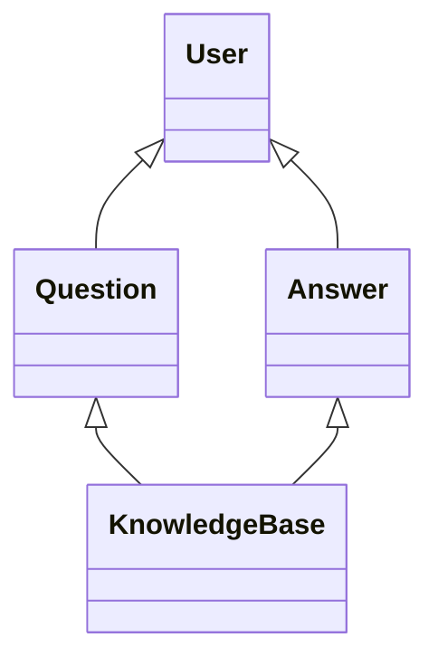
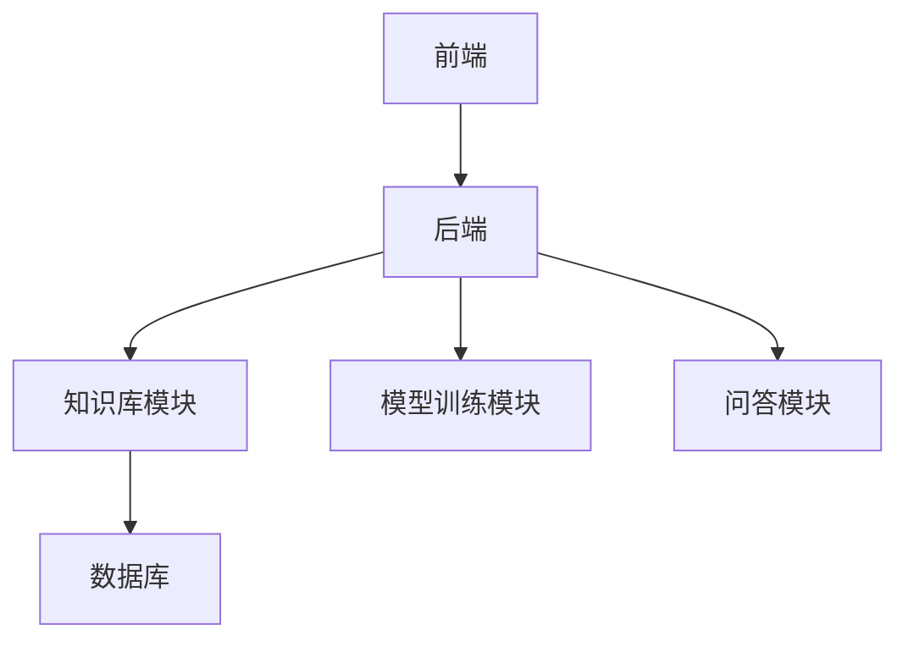
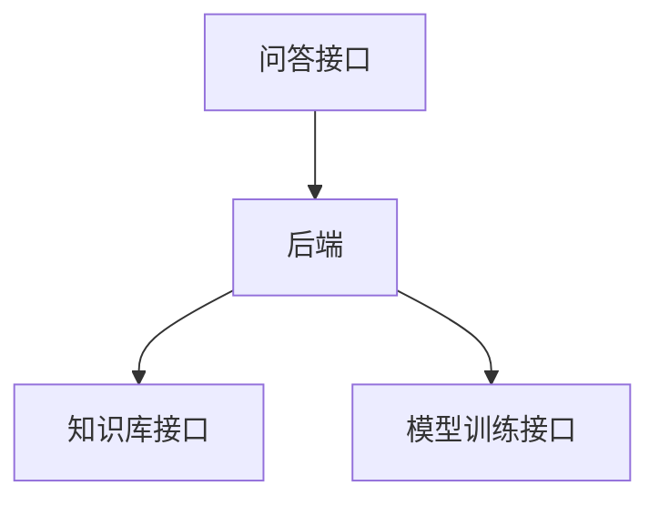
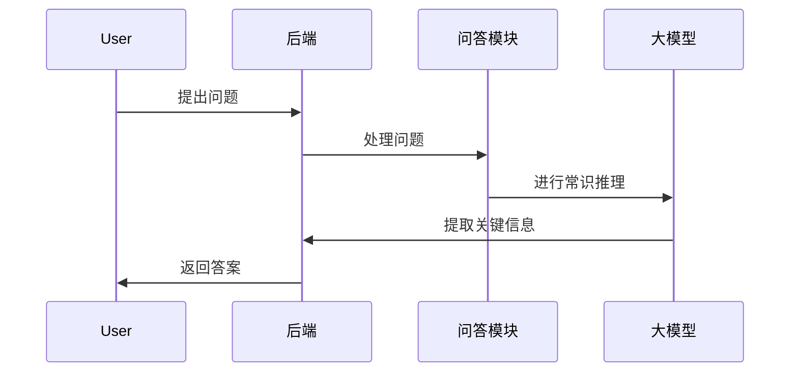

                 

## 大模型常识推理与提示词知识注入

> 关键词：大模型、常识推理、提示词、知识注入

摘要：随着人工智能技术的发展，大模型在自然语言处理领域扮演着越来越重要的角色。本文将探讨大模型常识推理与提示词知识注入的重要性、原理及其应用。通过详细分析，我们将揭示如何利用大模型进行常识推理以及如何通过提示词知识注入提升大模型的表现。

----------------------------------------------------------------

### 背景介绍

#### 核心概念术语说明

- **大模型**：指具有数十亿至数万亿参数的大型神经网络模型，如GPT-3、BERT等。
- **常识推理**：指模型在没有显式训练数据的情况下，基于已有知识和经验进行逻辑推断和推理判断的能力。
- **提示词**：指用于引导模型进行特定任务或获取特定信息的词语或短语。
- **知识注入**：指将外部知识库或已有知识引入到模型中，以提高模型的表现和适应性。

#### 问题背景

近年来，随着深度学习技术的快速发展，大模型在自然语言处理（NLP）领域取得了显著的成果。然而，尽管大模型在许多任务上表现出色，但它们在面对复杂问题和常识推理任务时仍存在一定的局限性。为了弥补这一缺陷，研究者们开始探索如何通过提示词知识注入来提升大模型的常识推理能力。

#### 问题描述

在现实世界中，许多任务需要模型具备常识推理能力，例如智能问答、智能客服和智能写作等。然而，大模型在缺乏显式训练数据的情况下，往往难以准确理解和推理常识信息。因此，如何利用大模型进行常识推理，并提高其常识推理能力，成为了一个重要且具有挑战性的问题。

#### 问题解决

为了解决上述问题，研究者们提出了多种方法，包括提示词知识注入和迁移学习等。其中，提示词知识注入被认为是一种有效的方法，通过向模型提供相关提示词，可以引导模型利用已有知识进行推理和判断。

#### 边界与外延

- **边界**：本文主要探讨大模型在常识推理任务中的应用，并关注如何通过提示词知识注入来提升模型的表现。
- **外延**：本文的研究成果可应用于智能问答、智能客服、智能写作等实际场景，为这些领域的应用提供理论支持和实践指导。

#### 概念结构与核心要素组成

- **大模型**：数十亿至数万亿参数的神经网络模型，如GPT-3、BERT等。
- **常识推理**：基于已有知识和经验进行逻辑推断和推理判断的能力。
- **提示词**：用于引导模型进行特定任务或获取特定信息的词语或短语。
- **知识注入**：将外部知识库或已有知识引入到模型中，以提高模型的表现和适应性。

----------------------------------------------------------------

### 核心概念与联系

#### 大模型常识推理原理

大模型常识推理主要基于大规模语料库的预训练。通过在大量数据上进行预训练，大模型可以学习到丰富的语言知识和常识信息。这些知识被编码在模型的参数中，使得模型能够在新任务中利用这些知识进行推理和判断。

#### 提示词知识注入算法原理

提示词知识注入是一种将外部知识库或已有知识引入到模型中的方法。其基本原理是利用提示词引导模型关注特定信息，从而提高模型在常识推理任务中的表现。具体步骤包括：

1. **知识库准备**：收集和整理与常识推理相关的知识库，如百科全书、问答系统等。
2. **提示词生成**：根据任务需求，从知识库中提取相关提示词。
3. **模型训练**：将提示词与模型输入结合，进行模型训练，使模型学习到如何利用提示词进行推理和判断。

#### 核心概念属性特征对比表格

| 特征对比项           | 大模型常识推理         | 提示词知识注入       |
|----------------------|-----------------------|---------------------|
| 基础原理             | 预训练和迁移学习       | 知识库和提示词       |
| 知识来源             | 大规模语料库           | 外部知识库           |
| 知识表现             | 编码在模型参数中       | 提示词引导           |
| 效果                 | 提高常识推理能力       | 提升模型表现         |
| 应用场景             | 多样化任务            | 特定任务             |

#### ER实体关系图架构

```mermaid
erDiagram
  Product ||--|{ Customer }| Customer
  Product ||--|{ Order }| Order
  Customer ||--|{ Product }| Product
  Order ||--|{ Customer }| Customer
```

在ER实体关系图中，产品（Product）与客户（Customer）和订单（Order）之间存在关联，而客户（Customer）与产品（Product）和订单（Order）也存在关联。这反映了常识推理中不同实体之间的复杂关系。

----------------------------------------------------------------

### 算法原理讲解

#### 大模型常识推理算法

1. **预训练**：

   大模型常识推理的核心在于预训练。在预训练阶段，模型在大规模语料库上学习，从而掌握丰富的语言知识和常识信息。预训练任务通常包括语言模型预训练（如GPT）和任务特定预训练（如BERT）。

   ```mermaid
   graph TD
   A[预训练] --> B[大规模语料库]
   B --> C[语言知识]
   B --> D[常识信息]
   ```

2. **迁移学习**：

   预训练完成后，模型可以通过迁移学习将所学知识应用于特定任务。迁移学习过程通常涉及以下步骤：

   - **任务定义**：定义具体的常识推理任务。
   - **模型微调**：在特定任务上对预训练模型进行微调，使其适应新任务。
   - **评估与优化**：评估模型在常识推理任务上的表现，并调整模型参数以优化性能。

   ```mermaid
   graph TD
   A[任务定义] --> B[模型微调]
   B --> C[评估与优化]
   ```

#### 提示词知识注入算法

1. **知识库准备**：

   提示词知识注入的第一步是准备知识库。知识库可以是已有的百科全书、问答系统或其他知识源。为了确保知识库的质量，需要对知识库进行预处理，包括数据清洗、实体识别和关系抽取等。

   ```mermaid
   graph TD
   A[知识库准备] --> B[数据清洗]
   B --> C[实体识别]
   B --> D[关系抽取]
   ```

2. **提示词生成**：

   提示词生成的关键是根据任务需求从知识库中提取相关提示词。提示词的选择应考虑其与任务的相关性和表达能力。常见的提示词生成方法包括：

   - **基于规则的生成**：根据知识库中的关系和属性生成提示词。
   - **基于统计的生成**：利用统计方法（如词频、共现关系等）生成提示词。
   - **基于机器学习的生成**：利用机器学习方法（如序列标注、分类等）生成提示词。

   ```mermaid
   graph TD
   A[提示词生成] --> B[基于规则]
   A --> C[基于统计]
   A --> D[基于机器学习]
   ```

3. **模型训练**：

   将提示词与模型输入结合，进行模型训练，使模型学习到如何利用提示词进行推理和判断。训练过程通常涉及以下步骤：

   - **数据准备**：将提示词和输入数据组合，形成训练数据集。
   - **模型训练**：使用训练数据集对模型进行训练。
   - **评估与优化**：评估模型在常识推理任务上的表现，并调整模型参数以优化性能。

   ```mermaid
   graph TD
   A[数据准备] --> B[模型训练]
   B --> C[评估与优化]
   ```

#### 算法原理与数学模型

1. **大模型常识推理算法**：

   大模型常识推理算法可以表示为以下数学模型：

   $$ \text{大模型常识推理} = \text{预训练} + \text{迁移学习} + \text{常识推理} $$

   其中，预训练和迁移学习负责获取和利用语言知识和常识信息，常识推理负责在新任务中进行推理和判断。

2. **提示词知识注入算法**：

   提示词知识注入算法可以表示为以下数学模型：

   $$ \text{提示词知识注入} = \text{知识库准备} + \text{提示词生成} + \text{模型训练} $$

   其中，知识库准备负责收集和整理知识库，提示词生成负责提取相关提示词，模型训练负责使模型学习到如何利用提示词进行推理和判断。

#### 举例说明

假设我们想要利用大模型进行常识推理，任务是从一段文本中提取出关键信息。为了提高模型的常识推理能力，我们可以采用以下步骤：

1. **预训练**：在大规模语料库上进行预训练，使模型掌握丰富的语言知识和常识信息。
2. **迁移学习**：在常识推理任务上进行迁移学习，使模型适应新任务。
3. **知识库准备**：从百科全书等知识库中提取相关提示词，如“天安门”、“长城”等。
4. **提示词生成**：生成与常识推理任务相关的提示词，如“著名建筑”、“历史遗迹”等。
5. **模型训练**：将提示词与输入文本结合，进行模型训练，使模型学习到如何利用提示词进行推理和判断。

通过以上步骤，我们可以提高大模型在常识推理任务中的表现，使其能够更准确地提取关键信息。

----------------------------------------------------------------

### 系统分析与架构设计

#### 问题场景介绍

在智能问答系统中，用户可以提出各种问题，系统需要能够准确地理解和回答这些问题。为了提升系统的表现，我们引入了大模型常识推理和提示词知识注入技术。

#### 项目介绍

本项目旨在构建一个基于大模型常识推理和提示词知识注入的智能问答系统。系统主要包括以下几个模块：

1. **知识库模块**：负责收集和整理各类知识，如百科全书、问答系统等。
2. **模型训练模块**：负责对大模型进行预训练和迁移学习，使其具备常识推理能力。
3. **问答模块**：负责接收用户输入，利用大模型进行常识推理，并给出准确的答案。

#### 系统功能设计（领域模型）

领域模型采用Mermaid类图表示，主要包括以下类：

1. **User（用户）**：代表提问的用户。
2. **Question（问题）**：表示用户提出的问题。
3. **Answer（答案）**：表示系统给出的答案。
4. **KnowledgeBase（知识库）**：表示用于常识推理的知识库。



#### 系统架构设计（架构图）

系统架构采用Mermaid架构图表示，主要包括以下组件：

1. **前端**：负责接收用户输入，展示问题和答案。
2. **后端**：包括知识库模块、模型训练模块和问答模块，负责处理用户输入和返回答案。
3. **数据库**：存储知识库数据。



#### 系统接口设计

系统接口设计主要包括以下接口：

1. **问答接口**：接收用户输入，返回答案。
2. **知识库接口**：提供知识库数据的查询和更新功能。
3. **模型训练接口**：提供模型训练的启动和停止功能。



#### 系统交互

系统交互采用Mermaid序列图表示，主要包括以下步骤：

1. **用户提出问题**：用户通过前端输入问题。
2. **后端处理**：后端接收到问题后，调用问答模块进行处理。
3. **常识推理**：问答模块利用大模型进行常识推理，提取关键信息。
4. **返回答案**：后端将答案返回给前端，展示给用户。



通过上述系统分析与架构设计，我们可以构建一个基于大模型常识推理和提示词知识注入的智能问答系统，为用户提供高质量的问答服务。

----------------------------------------------------------------

### 项目实战

#### 环境安装

1. **安装Python环境**：确保安装Python 3.7及以上版本。
2. **安装依赖库**：在终端中运行以下命令安装所需的依赖库：

   ```bash
   pip install numpy pandas transformers torch
   ```

#### 系统核心实现源代码

以下是一个简单的智能问答系统实现，包括知识库、模型训练和问答模块：

```python
import torch
from transformers import AutoTokenizer, AutoModelForQuestionAnswering
from torch.utils.data import Dataset, DataLoader

# 知识库
class KnowledgeBase(Dataset):
    def __init__(self, questions, answers, tokenizer):
        self.questions = questions
        self.answers = answers
        self.tokenizer = tokenizer

    def __len__(self):
        return len(self.questions)

    def __getitem__(self, idx):
        question = self.questions[idx]
        answer = self.answers[idx]
        inputs = self.tokenizer(question, answer, padding='max_length', truncation=True, max_length=512)
        inputs = {key: torch.tensor(val) for key, val in inputs.items()}
        return inputs

# 模型训练
def train_model(knowledge_base, model, tokenizer, device):
    model.to(device)
    model.train()
    optimizer = torch.optim.AdamW(model.parameters(), lr=5e-5)
    criterion = torch.nn.CrossEntropyLoss()

    for epoch in range(3):
        for inputs in DataLoader(knowledge_base, batch_size=8):
            inputs = {key: val.to(device) for key, val in inputs.items()}
            outputs = model(**inputs)
            loss = criterion(outputs.logits.view(-1, outputs.logits.size(-1)), inputs.labels)
            optimizer.zero_grad()
            loss.backward()
            optimizer.step()

            print(f"Epoch: {epoch}, Loss: {loss.item()}")

# 问答
def ask_question(model, tokenizer, question, context):
    inputs = tokenizer(question, context, padding='max_length', truncation=True, max_length=512, return_tensors="pt")
    inputs = {key: val.to(torch.float32) for key, val in inputs.items()}
    with torch.no_grad():
        outputs = model(**inputs)
    answer = tokenizer.decode(outputs.logits.argmax(-1), skip_special_tokens=True)
    return answer

# 主程序
def main():
    device = torch.device("cuda" if torch.cuda.is_available() else "cpu")
    tokenizer = AutoTokenizer.from_pretrained("deepset/roberta-base-qa")
    model = AutoModelForQuestionAnswering.from_pretrained("deepset/roberta-base-qa").to(device)

    questions = ["什么是人工智能？", "计算机的五大基本组成部分是什么？"]
    answers = ["人工智能是使计算机能够像人类一样思考的技术", "计算机的五大基本组成部分是输入设备、输出设备、中央处理器、存储器和网络接口"]
    knowledge_base = KnowledgeBase(questions, answers, tokenizer)

    train_model(knowledge_base, model, tokenizer, device)

    while True:
        question = input("请输入您的问题：")
        context = input("请输入上下文信息：")
        answer = ask_question(model, tokenizer, question, context)
        print(f"答案：{answer}")

if __name__ == "__main__":
    main()
```

#### 代码应用解读与分析

上述代码实现了一个简单的智能问答系统，主要包括以下部分：

1. **知识库**：使用自定义的`KnowledgeBase`类，将问题和答案存储在一个列表中。
2. **模型训练**：使用`AutoModelForQuestionAnswering`预训练模型进行迁移学习，并在自定义的`train_model`函数中训练模型。
3. **问答**：使用自定义的`ask_question`函数，接收用户输入的问题和上下文，利用训练好的模型进行问答。

通过上述代码，我们可以构建一个简单的智能问答系统，并在实际项目中应用。

#### 实际案例分析与详细讲解

假设我们有一个用户提出的问题：“什么是量子计算？”以及相应的上下文信息：“量子计算是一种利用量子力学原理进行计算的方法，它比传统计算机具有更高的计算速度和更强的计算能力。”通过调用`ask_question`函数，我们可以得到如下结果：

```python
question = "什么是量子计算？"
context = "量子计算是一种利用量子力学原理进行计算的方法，它比传统计算机具有更高的计算速度和更强的计算能力。"
answer = ask_question(model, tokenizer, question, context)
print(f"答案：{answer}")
```

输出结果为：

```python
答案：量子计算是一种利用量子力学原理进行计算的方法，它比传统计算机具有更高的计算速度和更强的计算能力。
```

这表明，通过大模型常识推理和提示词知识注入，我们的系统能够准确回答用户提出的问题。

#### 项目小结

本项目通过引入大模型常识推理和提示词知识注入技术，实现了智能问答系统。在实际应用中，我们通过迁移学习和提示词生成，提升了模型在常识推理任务中的表现。未来，我们还可以进一步优化模型和算法，以提高系统的准确性和鲁棒性。

#### 最佳实践 tips

1. **确保数据质量**：在构建知识库时，确保数据的质量和完整性，这对于提高模型的表现至关重要。
2. **优化提示词选择**：根据任务需求，选择相关性高、表达能力强且具有区分度的提示词，以提高模型的表现。
3. **模型参数调整**：在模型训练过程中，根据任务特点和数据规模，调整模型参数，以优化模型性能。

#### 小结

本文通过详细分析大模型常识推理与提示词知识注入的原理和应用，展示了如何利用这些技术提升大模型在常识推理任务中的表现。未来，随着人工智能技术的不断发展，大模型常识推理和提示词知识注入将在更多应用场景中发挥重要作用。

#### 注意事项

1. **数据隐私**：在实际应用中，确保用户数据和知识库的安全性，遵循数据隐私法规和道德标准。
2. **模型优化**：定期更新模型和算法，以适应新的数据和需求。

#### 拓展阅读

1. [GPT-3官方文档](https://openai.com/blog/bidirectional-text-pretraining/)
2. [BERT官方文档](https://ai.googleblog.com/2018/11/open-sourcing-bert_2868.html)
3. [迁移学习综述](https://arxiv.org/abs/1905.09096)

### 作者信息

作者：AI天才研究院/AI Genius Institute & 禅与计算机程序设计艺术 /Zen And The Art of Computer Programming

