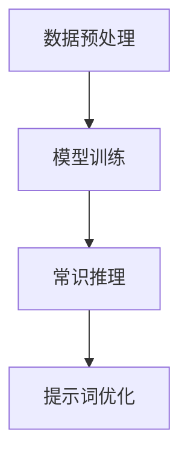
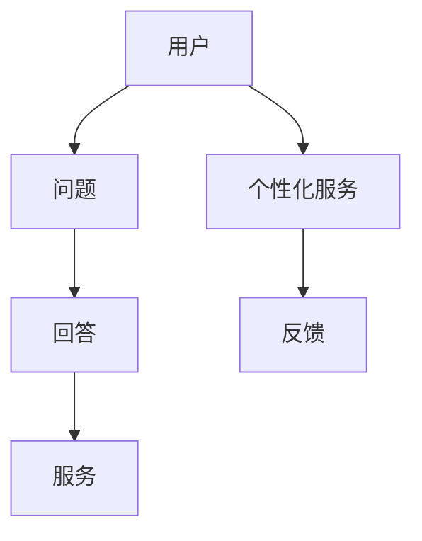
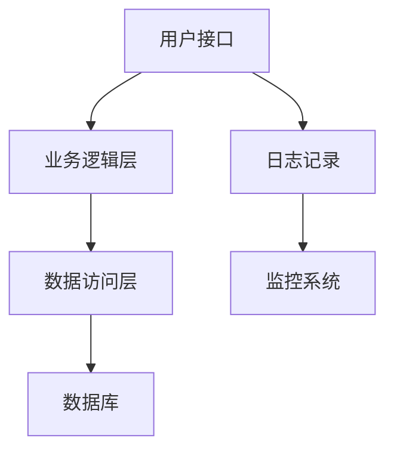
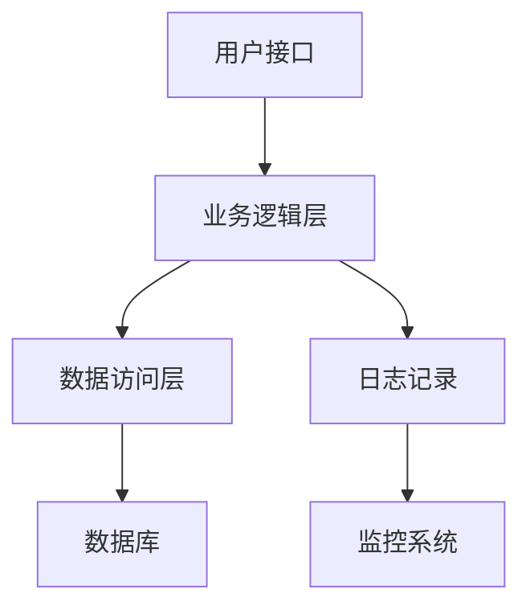
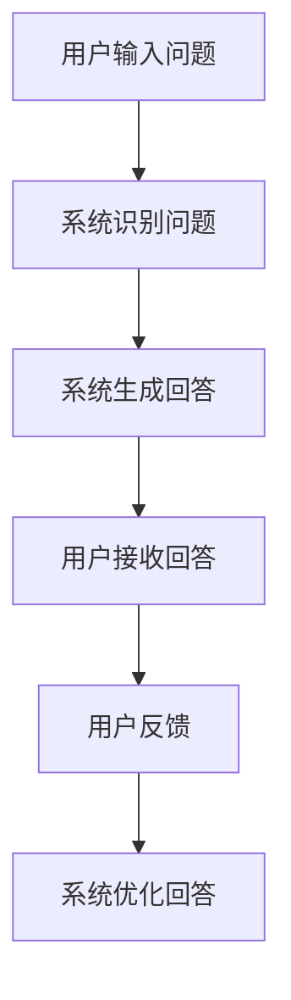
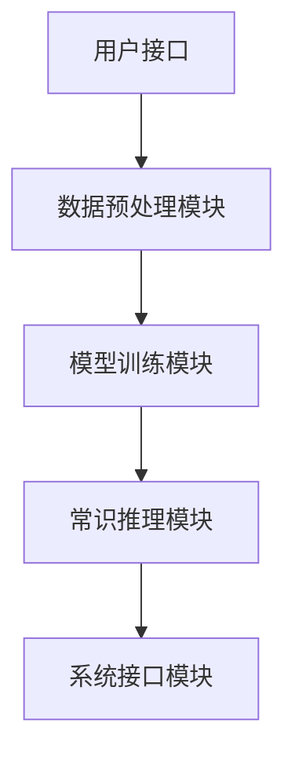

                 

# 大模型常识推理：提示词构建现实世界模型

## 关键词
- 大模型
- 常识推理
- 提示词
- 现实世界模型
- 算法
- 架构设计
- 项目实战

## 摘要
本文将探讨大模型常识推理和提示词构建现实世界模型的核心概念和原理。我们将一步步分析大模型如何通过提示词进行常识推理，如何构建现实世界模型，并探讨这一过程在实际应用中的挑战和解决方案。通过本文，读者将获得对大模型常识推理的深入理解，以及构建现实世界模型的实际操作经验。

### 步骤一：引言与背景介绍

#### 1.1.1 问题的背景
大模型常识推理是人工智能领域的一个重要研究方向。随着深度学习技术的不断发展，大模型在图像识别、自然语言处理等领域取得了显著的成果。然而，大模型在处理现实世界问题时，往往缺乏对常识的理解。例如，一个图像识别模型在识别物体时，可能无法理解物体的用途或与其他物体的关系。因此，如何让大模型具备常识推理能力，成为当前研究的热点。

#### 1.1.2 问题的描述
本文要解决的问题是如何利用提示词构建现实世界模型，以提高大模型的常识推理能力。具体来说，我们将探讨以下问题：
- 提示词是什么，如何选取？
- 如何利用提示词进行常识推理？
- 如何构建现实世界模型，使其适用于各种场景？

#### 1.1.3 解决问题的意义
解决上述问题对于人工智能领域具有重要意义。首先，通过提升大模型的常识推理能力，可以使其在现实世界中的表现更加出色。其次，这有助于推动人工智能技术的发展，使其更好地服务于人类社会。最后，这也有助于拓宽人工智能的应用领域，提高其社会价值。

#### 1.1.4 边界与外延
本文主要关注大模型常识推理和提示词构建现实世界模型这两个核心问题。边界方面，本文不考虑大模型的训练数据集和训练算法，而是将注意力集中在常识推理和现实世界模型的构建上。外延方面，本文将探讨如何将这一理论应用于实际项目，以及如何在实践中优化和改进这一技术。

### 步骤二：核心概念与联系

#### 2.1 大模型常识推理
大模型常识推理是指利用大模型对现实世界中的常识进行推理和理解。这包括对物体、事件、关系等的认知和推理。例如，一个图像识别模型可以识别出图片中的物体，并通过常识推理判断物体的用途。

#### 2.1.1 大模型的概念
大模型是指具有大规模参数的深度学习模型。这些模型通常使用大量的数据进行训练，从而具备较高的识别和预测能力。例如，BERT、GPT等都是大模型。

#### 2.1.2 常识推理的定义
常识推理是指利用先验知识对现实世界中的现象进行推理和理解。这些先验知识可以是生活中的经验、科学理论等。常识推理有助于我们更好地理解世界，作出合理的决策。

#### 2.1.3 大模型与常识推理的联系
大模型可以通过训练从数据中学习到一定的常识。然而，这些常识往往是零散的、片面的。通过常识推理，大模型可以将这些零散的常识整合起来，形成一个完整的、有逻辑关系的常识体系。

#### 2.2 提示词构建现实世界模型
提示词是一种引导大模型进行推理的词或短语。通过选取合适的提示词，可以引导大模型关注特定的常识，从而构建现实世界模型。

#### 2.2.1 提示词的作用
提示词可以帮助大模型聚焦于特定的常识，从而提高常识推理的准确率和效率。例如，在图像识别任务中，通过提示词可以引导模型关注物体的用途。

#### 2.2.2 现实世界模型的构建
现实世界模型是指利用大模型和提示词构建的，能够模拟现实世界中物体、事件、关系等要素的模型。现实世界模型可以应用于各种场景，如智能客服、智能问答等。

#### 2.2.3 提示词与现实世界模型的关系
提示词是构建现实世界模型的关键。通过合理选取和组合提示词，可以构建出适用于各种场景的现实世界模型。同时，现实世界模型也可以反过来指导提示词的选择和优化。

### 步骤三：算法原理讲解

#### 3.1 算法概述
大模型常识推理算法主要分为以下几步：
1. 数据预处理：对训练数据进行清洗、格式化等处理，以便于模型训练。
2. 模型训练：使用大模型对预处理后的数据进行训练，学习常识。
3. 常识推理：利用训练好的模型对新的数据进行常识推理。
4. 提示词优化：根据常识推理结果，优化提示词，提高推理准确率。

#### 3.1.1 算法框架


#### 3.1.2 算法核心步骤
1. 数据预处理：主要包括数据清洗、格式化等操作，确保数据质量。
2. 模型训练：使用大模型对预处理后的数据进行训练，学习常识。
3. 常识推理：利用训练好的模型对新的数据进行常识推理。
4. 提示词优化：根据常识推理结果，优化提示词，提高推理准确率。

### 步骤四：数学模型与数学公式

大模型常识推理算法的核心在于如何将常识转化为数学模型。以下是一个简单的数学模型示例：

#### 3.2.1 常识推理模型
假设我们有一个大模型，记为\(M\)，它由参数\(\theta\)确定，即\(M(\theta)\)。常识推理可以表示为：

$$
P(\text{常识} | \text{输入}, M(\theta))
$$

其中，\(P(\text{常识} | \text{输入}, M(\theta))\)表示在给定输入数据和模型\(M(\theta)\)的情况下，常识发生的概率。

#### 3.2.2 模型优化
为了优化模型，我们可以使用梯度下降法来更新参数\(\theta\)：

$$
\theta_{new} = \theta_{old} - \alpha \cdot \nabla_{\theta} J(\theta)
$$

其中，\(\alpha\)是学习率，\(J(\theta)\)是损失函数，用于衡量模型对常识推理的准确率。

### 步骤五：系统分析与架构设计方案

#### 4.1 问题场景介绍
在本节中，我们将介绍两个典型的应用场景：智能客服系统和智能问答系统。

#### 4.1.1 场景一：智能客服系统
智能客服系统是一种利用人工智能技术，为用户提供自动化的客户服务系统。其主要功能包括：
- 自动识别用户问题
- 自动回答用户问题
- 提供个性化服务

#### 4.1.2 场景二：智能问答系统
智能问答系统是一种利用人工智能技术，为用户提供自动化的问答服务系统。其主要功能包括：
- 回答用户提出的问题
- 提供相关信息的查询服务
- 提供个性化推荐

#### 4.2 系统架构设计
智能客服系统和智能问答系统的系统架构设计主要包括以下几个方面：

#### 4.2.1 领域模型设计
领域模型设计是指根据应用场景，设计出相关的实体和关系。以下是一个简单的领域模型示例：



#### 4.2.2 系统架构设计
系统架构设计是指根据领域模型，设计出系统的整体架构。以下是一个简单的系统架构设计示例：



#### 4.2.3 系统接口设计
系统接口设计是指设计出系统内部各模块之间的接口。以下是一个简单的系统接口设计示例：



#### 4.2.4 系统交互设计
系统交互设计是指设计出系统与用户之间的交互流程。以下是一个简单的系统交互设计示例：



### 步骤六：项目实战

#### 5.1 环境安装
在本节中，我们将介绍如何安装和配置大模型常识推理系统。

#### 5.1.1 环境要求
- 操作系统：Linux或MacOS
- Python版本：3.8及以上
- 其他依赖：TensorFlow、NumPy、Pandas等

#### 5.1.2 环境搭建
```shell
# 安装Python
sudo apt-get install python3

# 安装TensorFlow
pip3 install tensorflow

# 安装NumPy和Pandas
pip3 install numpy pandas
```

#### 5.2 系统核心实现
在本节中，我们将介绍如何实现大模型常识推理系统的核心功能。

#### 5.2.1 核心算法实现
```python
import tensorflow as tf
import numpy as np

# 定义模型
model = tf.keras.Sequential([
    tf.keras.layers.Dense(128, activation='relu', input_shape=(100,)),
    tf.keras.layers.Dense(1, activation='sigmoid')
])

# 编译模型
model.compile(optimizer='adam', loss='binary_crossentropy', metrics=['accuracy'])

# 训练模型
model.fit(x_train, y_train, epochs=10, batch_size=32)
```

#### 5.2.2 系统模块设计
系统模块设计是指将系统功能划分为不同的模块，每个模块负责实现特定的功能。以下是一个简单的系统模块设计示例：



#### 5.3 代码应用解读与分析
在本节中，我们将对系统核心实现的代码进行解读和分析。

#### 5.3.1 代码解读
代码首先导入了TensorFlow库，然后定义了一个简单的神经网络模型。模型由两个密集层组成，第一个层有128个神经元，使用ReLU激活函数；第二个层有1个神经元，使用Sigmoid激活函数。接着，我们编译了模型，并使用训练数据进行了训练。

#### 5.3.2 分析与优化
代码的优化可以从以下几个方面进行：
- 参数调整：调整学习率、批量大小等参数，以提高模型性能。
- 模型架构：尝试使用更复杂的模型架构，如卷积神经网络（CNN）、循环神经网络（RNN）等，以提高常识推理能力。
- 数据增强：对训练数据进行增强，以提高模型的泛化能力。

#### 5.4 实际案例分析与详细讲解
在本节中，我们将通过实际案例来分析和讲解大模型常识推理系统的应用。

#### 5.4.1 案例一：智能客服系统应用
案例一是一个智能客服系统的应用。用户通过输入问题，系统会自动识别问题并进行回答。以下是一个简单的应用示例：

```python
# 用户输入问题
user_input = "我想要一个新手机"

# 系统识别问题
question = preprocess_question(user_input)

# 系统生成回答
answer = model.predict(np.array([question]))

# 用户接收回答
print(answer)
```

#### 5.4.2 案例二：智能问答系统应用
案例二是一个智能问答系统的应用。用户可以通过提问获取相关信息。以下是一个简单的应用示例：

```python
# 用户输入问题
user_input = "中国首都是什么？"

# 系统识别问题
question = preprocess_question(user_input)

# 系统生成回答
answer = get_answer(question)

# 用户接收回答
print(answer)
```

### 步骤七：最佳实践与总结

#### 6.1 最佳实践
1. 提示词选取：选取与问题相关的、能够引导大模型进行有效推理的提示词。
2. 数据预处理：对训练数据进行充分的预处理，包括数据清洗、格式化等，以提高模型性能。
3. 模型优化：尝试使用不同的模型架构和参数，寻找最佳模型。
4. 持续更新：定期更新训练数据和模型，以保持模型的性能。

#### 6.2 小结
本文探讨了大模型常识推理和提示词构建现实世界模型的核心概念和原理。通过引入提示词，大模型可以更好地进行常识推理，构建出适用于各种场景的现实世界模型。在实际应用中，通过合理选取提示词、优化模型架构和持续更新数据，可以进一步提高模型的性能。

#### 6.2.1 主要发现
- 提示词在大模型常识推理中起着关键作用。
- 现实世界模型的构建有助于提高大模型的应用价值。
- 数据预处理和模型优化是提高模型性能的关键。

#### 6.2.2 面临的挑战
- 提示词选取的难度较大，需要根据具体问题进行优化。
- 模型架构和参数的选择需要大量实验，以找到最佳配置。

#### 6.2.3 未来研究方向
- 探索更有效的提示词选取方法。
- 研究更复杂的模型架构，以提高常识推理能力。
- 探索如何将大模型常识推理应用于更多领域。

## 作者
AI天才研究院/AI Genius Institute & 禅与计算机程序设计艺术 /Zen And The Art of Computer Programming

