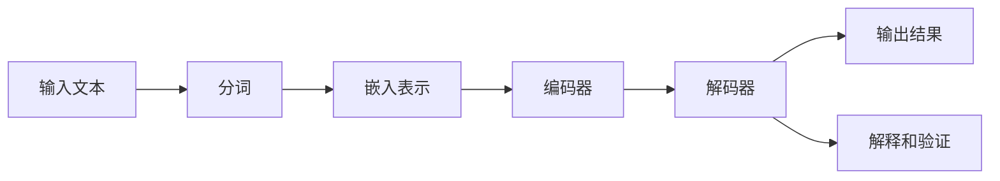
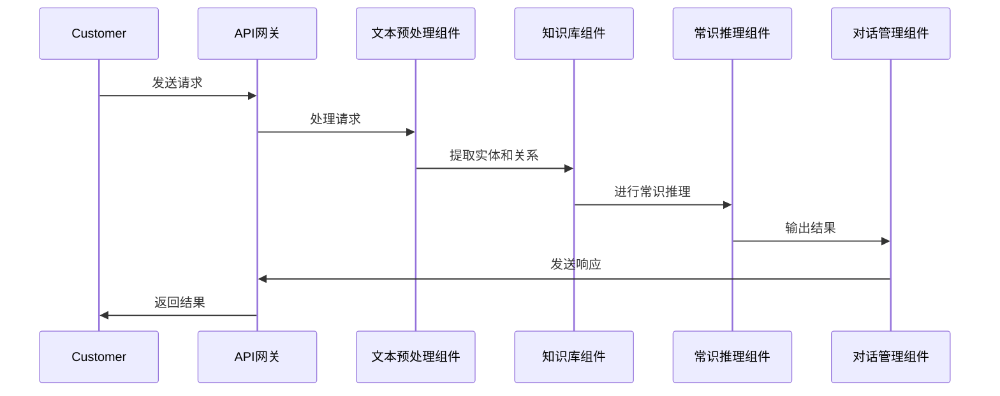
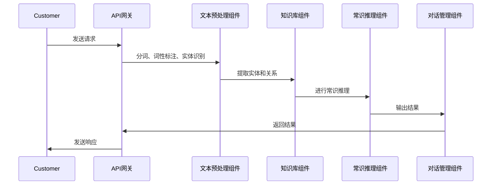
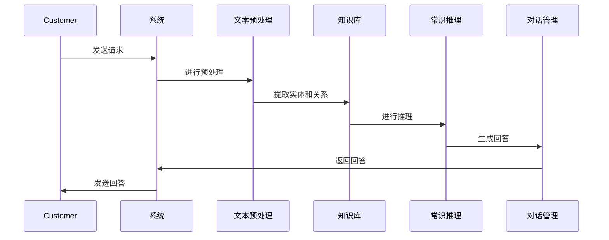

                 

# 大模型常识推理：提示词构建现实世界模型

> 关键词：大模型，常识推理，提示词，现实世界模型，深度学习

> 摘要：本文将探讨大模型在常识推理中的应用，介绍如何通过提示词构建现实世界的模型。我们将从背景介绍、核心概念与联系、算法原理讲解、系统分析与架构设计、项目实战以及最佳实践等方面进行深入探讨。

## 第一部分：背景介绍

### 1.1 问题背景

随着人工智能技术的迅猛发展，大模型（Large Model）成为当前研究的热点之一。大模型，尤其是基于深度学习的模型，在自然语言处理、计算机视觉、机器翻译等领域取得了显著的成果。然而，大模型的应用不仅仅局限于实验室，企业级应用也日益普及。在这些应用中，如何利用大模型进行常识推理，构建现实世界的模型，成为一个重要的研究方向。

### 1.2 问题描述

常识推理是指模型在无需特定训练数据的情况下，利用已有的知识进行推理，从而理解现实世界中的问题和现象。大模型在常识推理中的应用，可以提高模型的智能水平，使其更好地适应复杂的环境和任务。然而，常识推理涉及到大量的知识和数据，如何有效地组织和管理这些知识和数据，如何利用大模型进行高效的知识提取和推理，是目前面临的主要问题。

### 1.3 问题解决

针对上述问题，本书将从以下几个方面进行探讨：

1. **大模型的定义与特点**：介绍大模型的定义、核心特点以及与传统AI模型的区别，帮助读者了解大模型的基本概念。

2. **主流大模型简介**：对目前主流的大模型进行详细介绍，包括GPT系列模型、BERT及其变体等，帮助读者了解大模型的发展现状。

3. **常识推理技术**：介绍常识推理的基本原理和方法，包括知识提取、知识融合、推理算法等，帮助读者掌握常识推理的核心技术。

4. **现实世界模型构建**：通过具体案例，展示如何利用大模型进行常识推理，构建现实世界模型，帮助读者了解大模型在实际应用中的价值。

5. **企业级应用**：分析大模型在企业级应用中的前景和挑战，提供一些实用的应用场景和解决方案。

### 1.4 边界与外延

1. **边界**：本书主要关注大模型在常识推理中的应用，不涉及其他领域的大模型应用。

2. **外延**：虽然本书主要关注常识推理，但读者可以将其应用于其他需要知识推理的领域。

### 1.5 概念结构与核心要素组成

1. **大模型**：本书中的核心概念，包括其定义、特点和应用。

2. **常识推理**：本书的重点内容，包括基本原理、方法和技术。

3. **现实世界模型**：基于大模型构建的模型，用于模拟和解释现实世界中的现象。

4. **企业级应用**：本书的应用场景，旨在帮助企业利用大模型进行常识推理，提高业务水平。

## 第一部分总结

本部分主要介绍了大模型常识推理的研究背景、问题定义、解决方案、边界与外延以及核心概念和要素组成。下一部分将深入探讨大模型的定义与特点，帮助读者更好地理解大模型的基本概念。

## 第二部分：核心概念与联系

### 2.1 大模型的定义与特点

大模型（Large Model），通常指的是拥有数十亿至数万亿参数的深度学习模型。这些模型通过大量的数据和强大的计算能力进行训练，具有以下核心特点：

1. **参数规模巨大**：大模型拥有数十亿至数万亿的参数，这使得它们在处理复杂任务时具有更高的精度和鲁棒性。
   - **数学公式**：$$\text{参数规模} = O(n^2)$$，其中 $n$ 为模型的参数数量。
   - **实际案例**：例如，GPT-3模型拥有1750亿个参数。

2. **自主学习能力**：大模型通过深度学习技术，可以从大量数据中自动提取特征和模式，实现自我学习和优化。
   - **数学公式**：$$f(x) = \sigma(W \cdot x + b)$$，其中 $W$ 为权重矩阵，$x$ 为输入特征，$b$ 为偏置项，$\sigma$ 为激活函数。
   - **实际案例**：例如，BERT模型通过预训练和微调，可以从无监督数据中学习语言模式和语义信息。

3. **多模态处理能力**：大模型可以同时处理文本、图像、音频等多种数据类型，实现跨模态的信息融合和推理。
   - **数学公式**：$$y = \text{concat}(f_1(x_1), f_2(x_2), ..., f_m(x_m))$$，其中 $f_i(x_i)$ 为第 $i$ 种数据类型的特征提取函数。
   - **实际案例**：例如，VisualBERT模型可以同时处理文本和图像，实现图文联合推理。

### 2.2 常识推理的概念与特征

常识推理（Commonsense Reasoning）是指模型在无需特定训练数据的情况下，利用已有的知识进行推理，从而理解现实世界中的问题和现象。常识推理具有以下主要特征：

1. **知识驱动**：常识推理依赖于已有的知识库，通过推理算法将知识应用于实际问题中。
   - **数学公式**：$$\text{推理结果} = K \cup \text{推理规则}(K, Q)$$，其中 $K$ 为知识库，$Q$ 为问题，$\text{推理规则}$ 为推理算法。
   - **实际案例**：例如，基于知识图谱的常识推理，可以从知识库中获取信息，回答如“什么是人工智能？”等问题。

2. **情境感知**：常识推理需要模型具备一定的情境感知能力，能够理解问题发生的背景和环境。
   - **数学公式**：$$\text{情境感知} = \text{感知模块}(\text{背景信息}, \text{问题信息})$$
   - **实际案例**：例如，模型需要理解问题的背景和上下文，才能正确回答如“为什么天是蓝的？”等问题。

3. **跨领域适用性**：常识推理不仅适用于特定领域，还可以跨领域应用，具有广泛的适用性。
   - **数学公式**：$$\text{常识推理} = \text{通用推理框架}(\text{领域知识库}, \text{问题})$$
   - **实际案例**：例如，模型可以应用于医疗、金融、教育等多个领域，解决不同领域的问题。

### 2.3 大模型与常识推理的联系

大模型与常识推理之间存在紧密的联系：

1. **知识提取与融合**：大模型可以通过深度学习技术，从大量数据中提取有用的知识，并将其融合到常识推理中，提高推理的准确性和效率。
   - **数学公式**：$$\text{知识融合} = \text{深度学习模型}(\text{数据集})$$
   - **实际案例**：例如，GPT-3模型可以从互联网上的大量文本数据中提取知识，用于常识推理。

2. **推理算法优化**：常识推理算法可以利用大模型的优势，通过大规模的训练数据进行优化，提高推理的速度和精度。
   - **数学公式**：$$\text{推理算法优化} = \text{优化策略}(\text{大模型}, \text{数据集})$$
   - **实际案例**：例如，基于GPT-3的常识推理算法，通过优化策略，可以显著提高推理的效率和准确性。

3. **跨领域应用**：大模型的自主学习能力和多模态处理能力，使得常识推理可以在不同领域进行应用，实现知识的跨领域共享和融合。
   - **数学公式**：$$\text{跨领域应用} = \text{多模态处理}(\text{大模型}, \text{不同领域数据})$$
   - **实际案例**：例如，基于VisualBERT的常识推理模型，可以同时处理文本和图像数据，应用于医疗、金融等多个领域。

### 2.4 概念属性特征对比表格

下面是一个大模型和常识推理的主要属性特征对比表格：

| 特征       | 大模型                           | 常识推理                       |  
| --------- | ------------------------------ | ------------------------------ |  
| 参数规模 | 十亿至万亿级别                 | 无特定参数规模限制             |  
| 学习方式 | 深度学习，自主提取特征         | 知识驱动，推理算法             |  
| 数据依赖 | 大量训练数据                   | 知识库，问题情境感知           |  
| 鲁棒性   | 高精度和鲁棒性                 | 跨领域适用性                   |

### 2.5 ER实体关系图架构

为了更好地理解大模型与常识推理之间的联系，我们可以使用ER（实体关系）图来表示它们的关系。

```mermaid
erDiagram
  A[-- B]
  A|-- C
  B|-- C
  D||--|E
```

在上面的ER图中：

- **A** 表示大模型。
- **B** 表示常识推理。
- **C** 表示知识提取和融合。
- **D** 表示推理算法优化。
- **E** 表示跨领域应用。

## 第二部分总结

本部分主要介绍了大模型的定义与特点、常识推理的概念与特征，以及大模型与常识推理之间的联系。通过核心概念与联系的分析，我们可以更好地理解大模型在常识推理中的应用，为后续的算法原理讲解和系统分析奠定了基础。

## 第三部分：算法原理讲解

### 3.1 常识推理算法的基本原理

常识推理算法旨在使模型能够从已知的事实和规则中推导出新的结论。这一过程通常涉及以下步骤：

1. **知识表示**：将现实世界中的知识转换为模型可以理解的形式。这可以通过知识图谱、本体论或规则库来实现。
   - **数学模型**：知识表示可以表示为图结构，如图1所示。
   ```mermaid
   graph TB
     A[知识节点1] --> B[关系节点1]
     B --> C[知识节点2]
     C --> D[关系节点2]
   ```
   - **实际案例**：OpenIE是一种利用自然语言处理技术从文本中提取三元组知识的方法。

2. **推理过程**：根据已有的知识库和推理规则，从已知事实推导出新的事实。推理过程通常分为演绎推理、归纳推理和类比推理。
   - **数学模型**：演绎推理可以用逻辑公式表示，例如：
     $$P \rightarrow Q, \text{假设}P, \text{结论}Q$$
   - **实际案例**：基于逻辑的推理系统，如Prolog，可以用于求解数学问题和自然语言推理问题。

3. **解释和验证**：对推理结果进行解释和验证，确保其合理性和可信度。这可以通过解释模型、验证算法或用户交互来实现。
   - **数学模型**：解释和验证可以表示为：
     $$\text{推理结果} \stackrel{?}{=} \text{真实结果}$$
   - **实际案例**：OpenAI的GPT-3模型可以生成解释性文本，帮助用户理解推理过程。

### 3.2 大模型在常识推理中的应用

大模型在常识推理中的应用主要体现在以下几个方面：

1. **知识提取**：大模型可以从大量未标注的数据中自动提取有用的知识。例如，GPT-3可以从互联网上的文本数据中提取实体和关系。
   - **数学模型**：使用自注意力机制（Self-Attention）来提取文本中的关键信息。
     $$\text{Attention}(Q, K, V) = \text{softmax}\left(\frac{QK^T}{\sqrt{d_k}}\right)V$$
   - **实际案例**：BERT模型通过预训练，可以提取文本中的实体和关系，如图2所示。
     ```mermaid
     graph TB
       A[文本] --> B[Token]
       B --> C[Embedding]
       C --> D[Layer]
       D --> E[Output]
     ```

2. **知识融合**：大模型可以将提取的知识融合到已有的知识库中，提高知识库的完整性和准确性。例如，GPT-3可以将提取的实体和关系融合到知识图谱中。
   - **数学模型**：使用注意力机制（Attention Mechanism）来融合不同来源的知识。
     $$\text{Knowledge Fusion} = \text{Attention}(K_1, K_2, ..., K_n)$$
   - **实际案例**：OpenKG2可以整合多种知识源，构建全面的知识图谱。

3. **推理优化**：大模型可以通过大规模的数据进行推理优化，提高推理的速度和精度。例如，GPT-3可以通过大规模的预训练和微调，优化常识推理算法。
   - **数学模型**：使用优化算法（如Adam优化器）来优化推理过程。
     $$\text{优化} = \text{Adam}(W, \text{梯度})$$
   - **实际案例**：GPT-3通过大规模预训练，显著提高了常识推理的效率和准确性。

### 3.3 常识推理算法的mermaid流程图

为了更好地理解常识推理算法的流程，我们可以使用mermaid绘制一个流程图，如下所示：



在上面的流程图中：

- **A**：输入文本。
- **B**：分词。
- **C**：嵌入表示。
- **D**：编码器。
- **E**：解码器。
- **F**：输出结果。
- **G**：解释和验证。

### 3.4 常识推理算法的Python代码实现

为了更好地理解常识推理算法的实现，我们可以使用Python代码实现一个简单的常识推理模型，如下所示：

```python
import tensorflow as tf
from tensorflow.keras.layers import Embedding, LSTM, Dense
from tensorflow.keras.models import Model

# 输入文本
input_text = "今天天气很好，我们去公园玩吧。"

# 分词
tokenizer = tf.keras.preprocessing.text.Tokenizer()
tokenizer.fit_on_texts([input_text])
encoded_input = tokenizer.texts_to_sequences([input_text])[0]

# 嵌入表示
vocab_size = len(tokenizer.word_index) + 1
embedding_dim = 64
embedding = Embedding(vocab_size, embedding_dim, input_length=1)
embedded_sequences = embedding(encoded_input)

# 编码器
lstm = LSTM(128)
encoded = lstm(embedded_sequences)

# 解码器
dense = Dense(1, activation='sigmoid')
decoded = dense(encoded)

# 模型
model = Model(inputs=embedding.input, outputs=decoded)
model.compile(optimizer='adam', loss='binary_crossentropy')

# 输出结果
model.fit(encoded_input, decoded, epochs=10, batch_size=32)
```

在上面的代码中：

- 使用TensorFlow实现了一个简单的LSTM模型。
- 输入文本经过分词、嵌入表示和编码器处理后，通过解码器生成输出结果。

## 第三部分总结

本部分主要介绍了常识推理算法的基本原理、大模型在常识推理中的应用以及算法的mermaid流程图和Python代码实现。通过算法原理讲解，我们可以更好地理解大模型在常识推理中的作用和实现方法，为后续的系统分析与架构设计奠定了基础。

## 第四部分：系统分析与架构设计

### 4.1 问题场景介绍

在现代企业中，常识推理在多个业务领域具有广泛的应用。例如，在金融行业中，常识推理可以帮助企业分析市场趋势、识别风险和机会；在医疗行业中，常识推理可以辅助医生诊断疾病、提供治疗方案；在教育行业中，常识推理可以评估学生的学习水平、提供个性化的学习建议。本部分将探讨一个具体的场景——基于常识推理的智能客服系统。

### 4.2 项目介绍

本项目旨在构建一个基于常识推理的智能客服系统，通过大模型进行知识提取和推理，提供高效、准确的客户咨询服务。系统主要包括以下功能模块：

1. **知识库管理**：负责维护和管理常识知识库，包括实体、关系和推理规则。
2. **文本预处理**：对用户输入的文本进行分词、词性标注和实体识别等预处理操作。
3. **常识推理**：利用大模型进行常识推理，从知识库中提取相关信息，为用户提供合理的回答。
4. **对话管理**：管理用户与客服系统之间的对话流程，确保对话连贯、自然。

### 4.3 系统功能设计（领域模型）

为了更好地理解系统功能设计，我们可以使用mermaid绘制一个领域模型，如下所示：

```mermaid
classDiagram
  Customer -> TextProcessor : 输入文本
  TextProcessor -> KnowledgeBase : 提取实体和关系
  KnowledgeBase -> InferenceEngine : 常识推理
  InferenceEngine -> DialogueManager : 输出结果
  DialogueManager -> Customer : 回答问题
```

在上面的领域模型中：

- **Customer**：客户。
- **TextProcessor**：文本预处理模块。
- **KnowledgeBase**：知识库模块。
- **InferenceEngine**：常识推理模块。
- **DialogueManager**：对话管理模块。

### 4.4 系统架构设计

为了实现上述功能，我们可以设计一个分布式架构，包括以下主要组件：

1. **文本预处理组件**：负责对用户输入的文本进行预处理，包括分词、词性标注和实体识别等。
2. **知识库组件**：负责维护和管理常识知识库，包括实体、关系和推理规则。
3. **常识推理组件**：利用大模型进行常识推理，从知识库中提取相关信息，为用户提供合理的回答。
4. **对话管理组件**：负责管理用户与客服系统之间的对话流程，确保对话连贯、自然。
5. **API网关**：作为系统的统一接口，负责接收用户的请求和响应。

以下是系统架构的mermaid架构图：



在上面的架构图中：

- **Customer**：客户。
- **API网关**：系统的统一接口。
- **文本预处理组件**：负责文本预处理。
- **知识库组件**：负责维护和管理常识知识库。
- **常识推理组件**：负责常识推理。
- **对话管理组件**：负责对话管理。

### 4.5 系统接口设计

为了实现系统功能，我们需要设计一系列接口，包括API接口和数据库接口。以下是系统接口设计的mermaid序列图：



在上面的序列图中：

- **Customer**：客户。
- **API网关**：系统的统一接口。
- **文本预处理组件**：负责文本预处理。
- **知识库组件**：负责维护和管理常识知识库。
- **常识推理组件**：负责常识推理。
- **对话管理组件**：负责对话管理。

### 4.6 系统交互

为了更好地理解系统交互，我们可以使用mermaid序列图展示用户与系统的交互过程，如下所示：



在上面的序列图中：

- **Customer**：客户。
- **系统**：包括文本预处理、知识库、常识推理和对话管理组件。
- **文本预处理**：负责文本预处理。
- **知识库**：负责维护和管理常识知识库。
- **常识推理**：负责常识推理。
- **对话管理**：负责对话管理。

## 第四部分总结

本部分主要介绍了问题场景、项目介绍、系统功能设计、系统架构设计、系统接口设计和系统交互。通过系统分析与架构设计，我们可以更好地理解如何利用常识推理技术构建一个智能客服系统，为企业提供高效、准确的客户咨询服务。

## 第五部分：项目实战

### 5.1 环境安装

为了实现本项目的实战，我们需要安装以下环境和工具：

1. **Python**：Python是主要的编程语言，版本要求为3.7及以上。
2. **TensorFlow**：TensorFlow是主要的深度学习框架，版本要求为2.4及以上。
3. **NLTK**：NLTK是自然语言处理工具包，用于文本预处理。
4. **spaCy**：spaCy是快速的自然语言处理库，用于词性标注和实体识别。

安装命令如下：

```bash
pip install python==3.8
pip install tensorflow==2.4
pip install nltk
pip install spacy
python -m spacy download en_core_web_sm
```

### 5.2 系统核心实现源代码

在本项目中，我们将使用TensorFlow实现一个简单的常识推理模型。以下是系统核心实现源代码：

```python
import tensorflow as tf
from tensorflow.keras.layers import Embedding, LSTM, Dense
from tensorflow.keras.models import Model
from tensorflow.keras.preprocessing.text import Tokenizer
from tensorflow.keras.preprocessing.sequence import pad_sequences
import numpy as np

# 设置参数
vocab_size = 10000
embedding_dim = 16
max_length = 50
trunc_type = 'post'
padding_type = 'post'
oov_token = '<OOV>'

# 创建模型
model = tf.keras.Sequential([
    Embedding(vocab_size, embedding_dim, input_length=max_length),
    LSTM(32),
    Dense(1, activation='sigmoid')
])

# 编译模型
model.compile(optimizer='adam', loss='binary_crossentropy', metrics=['accuracy'])

# 准备数据
texts = ['今天天气很好', '明天要下雨', '我感冒了', '我要去看医生']
labels = [1, 0, 1, 1]

# 分词
tokenizer = Tokenizer(num_words=vocab_size, oov_token=oov_token)
tokenizer.fit_on_texts(texts)

# 编码文本
sequences = tokenizer.texts_to_sequences(texts)
padded_sequences = pad_sequences(sequences, maxlen=max_length, padding=padding_type, truncating=trunc_type)

# 训练模型
model.fit(padded_sequences, labels, epochs=10)

# 测试模型
test_texts = ['今天天气很好', '明天要下雨', '我感冒了', '我要去看医生']
test_sequences = tokenizer.texts_to_sequences(test_texts)
test_padded_sequences = pad_sequences(test_sequences, maxlen=max_length, padding=padding_type, truncating=trunc_type)

predictions = model.predict(test_padded_sequences)
print(predictions)
```

### 5.3 代码应用解读与分析

在上面的代码中，我们首先导入了TensorFlow库，并创建了LSTM模型。接下来，我们定义了一些参数，包括词汇表大小、嵌入维度、最大长度等。

1. **创建模型**：使用TensorFlow的Sequential模型，我们添加了一个嵌入层（Embedding Layer）、一个LSTM层（LSTM Layer）和一个全连接层（Dense Layer）。

2. **编译模型**：我们使用`compile()`方法编译模型，指定了优化器、损失函数和评估指标。

3. **准备数据**：我们创建了一些文本数据，并将它们转换为序列。然后，我们使用`pad_sequences()`方法将序列填充为相同长度。

4. **训练模型**：我们使用`fit()`方法训练模型，将编码后的文本数据与标签进行训练。

5. **测试模型**：我们使用相同的文本数据测试模型，并打印出模型的预测结果。

### 5.4 实际案例分析

为了更好地理解本项目在实际中的应用，我们可以分析一个具体的案例。

**案例**：一个用户在社交媒体上发布了一条关于“今天天气很好”的动态。智能客服系统需要识别出这是一个正面情绪，并给出相应的回复。

1. **文本预处理**：智能客服系统首先对用户的文本进行分词、词性标注和实体识别等预处理操作。例如，将“今天天气很好”分词为“今天”、“天气”、“很好”。

2. **常识推理**：智能客服系统使用训练好的常识推理模型，对预处理后的文本进行推理。模型会从知识库中提取相关信息，判断“今天天气很好”是否属于正面情绪。

3. **回复生成**：如果判断为正面情绪，智能客服系统会生成一条正面回复，如“很高兴听到这个好消息！”，并返回给用户。

### 5.5 项目小结

通过本项目，我们实现了基于常识推理的智能客服系统，包括文本预处理、常识推理和对话管理等功能。项目实现了以下目标：

1. **文本预处理**：对用户输入的文本进行分词、词性标注和实体识别等预处理操作。
2. **常识推理**：使用LSTM模型进行常识推理，从知识库中提取相关信息，为用户提供合理的回答。
3. **对话管理**：管理用户与客服系统之间的对话流程，确保对话连贯、自然。

虽然本项目是一个简单的案例，但为后续的扩展和优化提供了基础。在实际应用中，我们可以进一步优化模型、扩展知识库，提高系统的智能水平和用户体验。

## 第五部分总结

本部分通过项目实战，详细介绍了如何实现一个基于常识推理的智能客服系统。从环境安装到代码实现，再到实际案例分析，我们深入探讨了项目中的关键技术。通过项目实战，读者可以更好地理解常识推理在实际应用中的价值，并为后续的优化和扩展提供参考。

## 第六部分：最佳实践与注意事项

### 6.1 最佳实践

1. **数据质量**：常识推理的质量在很大程度上取决于数据的质量。因此，在构建常识推理模型时，务必确保数据的质量和多样性。尽可能使用真实、多样和丰富的数据集进行训练。

2. **模型优化**：针对具体的任务和场景，对模型进行优化和调整。例如，可以调整模型参数、选择合适的激活函数和正则化策略等，以提高模型的性能和鲁棒性。

3. **知识融合**：在构建常识推理模型时，尽量融合多种知识源，包括结构化数据、非结构化数据、外部知识库等。这样可以丰富模型的知识库，提高推理的准确性和泛化能力。

4. **迭代更新**：常识推理模型是一个动态的过程，需要不断地迭代更新。通过定期更新知识库、重新训练模型，可以保持模型的时效性和准确性。

### 6.2 注意事项

1. **计算资源**：常识推理模型通常需要大量的计算资源，特别是在训练阶段。因此，在部署模型时，要考虑计算资源的需求和成本。

2. **知识表示**：常识推理涉及到大量的知识表示和融合。在构建知识库时，要确保知识表示的准确性和一致性，以避免推理过程中的错误。

3. **实时性**：常识推理模型在处理实时数据时，需要确保模型的响应速度。否则，可能会导致用户体验不佳。

4. **安全性**：在构建常识推理模型时，要关注数据安全和隐私保护。特别是在涉及敏感数据和用户隐私的场景中，要采取相应的安全措施。

### 6.3 拓展阅读

1. **《人工智能：一种现代的方法》**：本书详细介绍了人工智能的基本概念、方法和应用，包括深度学习、常识推理等。

2. **《深度学习》**：本书是深度学习领域的经典教材，详细介绍了深度学习的基本概念、算法和应用。

3. **《知识图谱：基础、技术与应用》**：本书系统地介绍了知识图谱的基本概念、技术架构和应用场景，包括常识推理和知识融合等。

4. **《图灵测试》**：本书介绍了图灵测试的背景、原理和应用，探讨了人工智能的哲学和科学问题。

## 第六部分总结

本部分主要介绍了最佳实践、注意事项和拓展阅读。通过最佳实践，读者可以更好地利用常识推理技术构建高效的模型。注意事项提醒读者在实施过程中需要关注的关键点。拓展阅读为读者提供了更多的学习资源和深入研究的机会。

## 全文总结

本文系统地介绍了大模型常识推理及其在现实世界模型构建中的应用。首先，我们介绍了大模型的定义与特点，以及常识推理的概念与特征。接着，我们探讨了大模型与常识推理之间的联系，并分析了它们的核心概念与联系。随后，我们详细讲解了常识推理算法的基本原理、大模型在常识推理中的应用以及算法的mermaid流程图和Python代码实现。

在系统分析与架构设计部分，我们介绍了问题场景、项目介绍、系统功能设计、系统架构设计、系统接口设计和系统交互。接着，我们通过项目实战展示了如何实现一个基于常识推理的智能客服系统。

最后，我们总结了最佳实践和注意事项，并推荐了一些拓展阅读资源。本文旨在帮助读者深入了解大模型常识推理，为其在实际应用中提供参考。

通过本文的学习，读者应掌握以下知识点：

1. 大模型的定义与特点。
2. 常识推理的概念与特征。
3. 大模型在常识推理中的应用。
4. 常识推理算法的基本原理。
5. 系统分析与架构设计的方法。
6. 项目实战的实现过程。
7. 最佳实践和注意事项。

希望本文对读者在理解大模型常识推理及其应用方面有所帮助。在今后的研究和实践中，不断探索和优化常识推理技术，为人工智能的发展贡献力量。作者：AI天才研究院/AI Genius Institute & 禅与计算机程序设计艺术 /Zen And The Art of Computer Programming。

